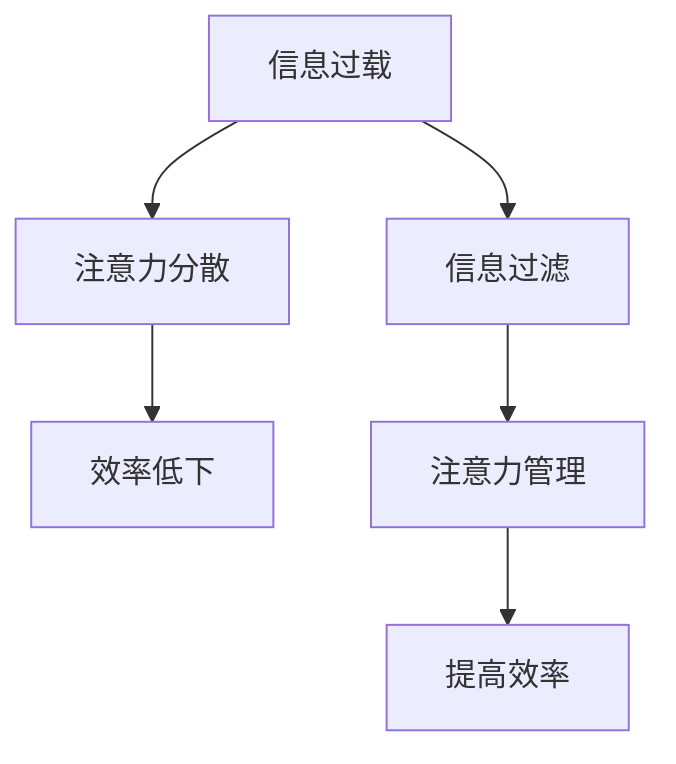
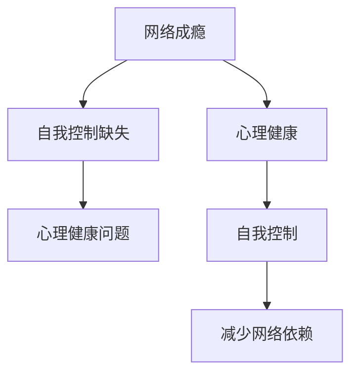
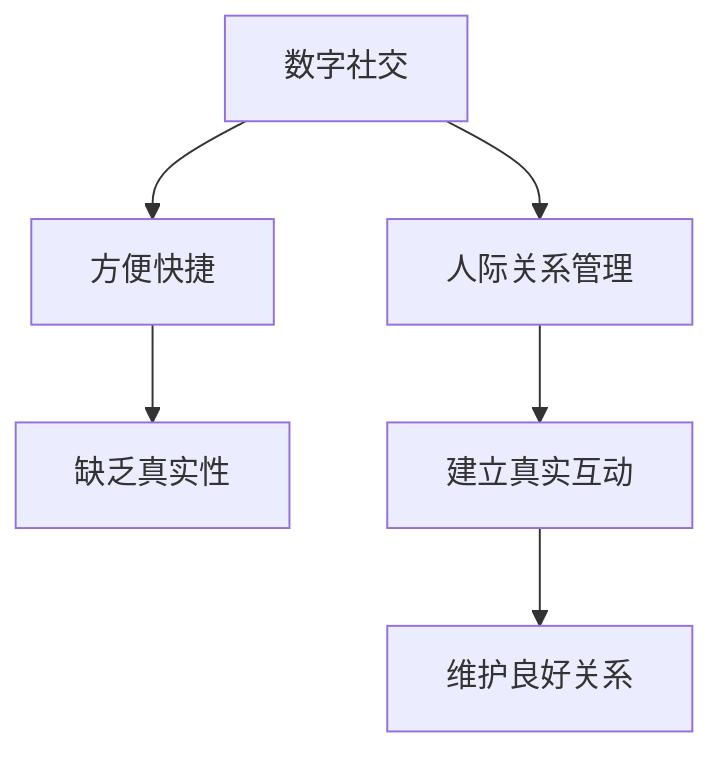
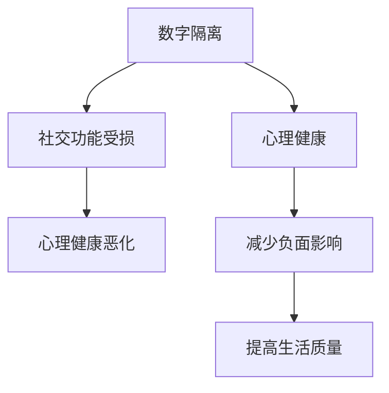
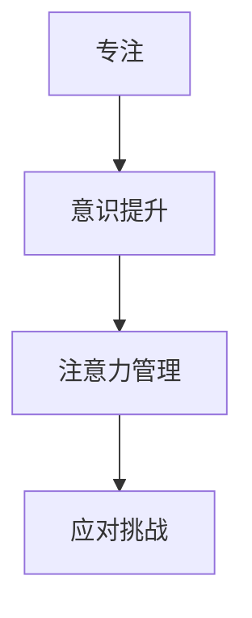
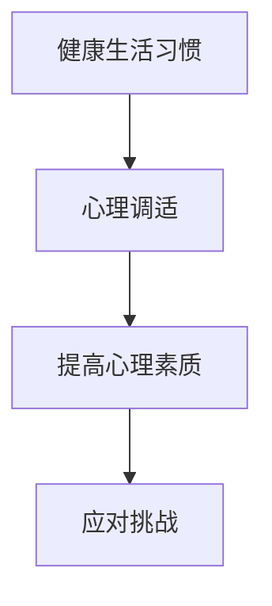
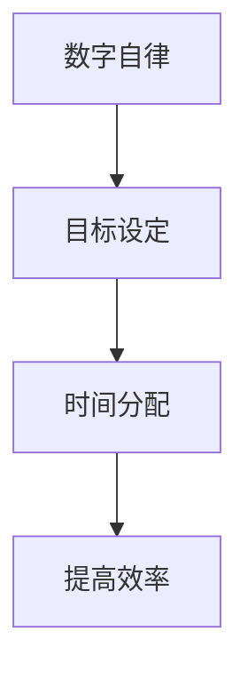
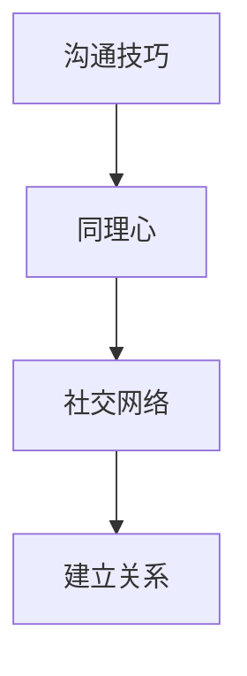

                 

### 文章标题

《在信息洪流中寻找意义：数字时代的精神导航》

### 文章关键词

数字时代，精神导航，信息过载，注意力管理，心理健康，自我控制，数字社交，人际关系，冥想，时间管理，技术趋势

### 摘要

在数字化信息爆炸的时代，人们面临着前所未有的精神挑战。本文将探讨数字时代的精神导航方法，从信息过载、网络成瘾、数字社交、数字隔离等方面分析精神挑战的根源，并提出实践方法、案例分析及未来展望。通过本文，读者将了解如何在数字洪流中找到自己的精神坐标，实现心理健康和自我成长。

## 引言与背景

### 数字时代的精神挑战

随着互联网和移动设备的普及，我们生活在一个信息爆炸的时代。然而，信息的便捷性也带来了新的精神挑战。首先，信息过载是一个普遍存在的问题。人们每天接收到的信息量远远超过他们能够处理的能力，这导致注意力分散和效率低下。其次，网络成瘾成为一个严重的问题，许多人沉迷于社交媒体和网络游戏，导致自我控制能力的丧失。此外，数字社交和人际关系的复杂性也带来了新的挑战，人们往往在虚拟世界中建立联系，但缺乏真实的人际互动。

### 精神导航的起源与发展

精神导航是一个相对较新的概念，它源于对人类心理健康需求的关注。精神导航的目的是帮助人们找到内心的平静和意义，以应对数字时代的精神挑战。这一概念的发展可以追溯到心理咨询和心理学领域的理论，特别是在认知行为疗法和正念冥想方面。随着技术的进步，精神导航方法也在不断演进，例如通过应用程序和智能设备提供个性化的心理健康服务。

## 数字时代的精神挑战

### 信息过载与注意力管理

#### 背景介绍

信息过载是指接收到的信息量超出了个体处理能力的一种状态。在数字化时代，人们面临着前所未有的信息过载问题。社交媒体、电子邮件、新闻网站等平台不断推送大量信息，使得人们难以筛选和处理。

#### 核心概念与联系

为了应对信息过载，我们需要关注两个核心概念：注意力管理和信息过滤。

- **注意力管理**：注意力是指我们在某一特定任务上集中精力并进行思考的能力。在信息过载的环境下，注意力管理变得尤为重要。通过提高注意力管理能力，我们可以更有效地处理信息，减少信息过载的影响。

- **信息过滤**：信息过滤是指从大量信息中筛选出对自己有价值的信息的过程。有效的信息过滤可以帮助我们减少不必要的干扰，专注于关键信息。

#### Mermaid 流程图

### 网络成瘾与自我控制

#### 背景介绍

网络成瘾是指个体对网络活动产生过度依赖和无法自我控制的现象。在数字时代，网络成瘾成为一个严重的社会问题，它不仅影响个人的心理健康，还可能导致学习、工作和社交功能的受损。

#### 核心概念与联系

为了应对网络成瘾，我们需要关注两个核心概念：自我控制和心理健康。

- **自我控制**：自我控制是指个体在面对诱惑时能够坚持目标和行为的能力。在网络成瘾的情况下，自我控制变得尤为重要，它可以帮助我们减少对网络活动的依赖。

- **心理健康**：心理健康是指个体在心理上的健康和平衡状态。网络成瘾往往与心理健康问题相关，因此，维护心理健康是应对网络成瘾的关键。

#### Mermaid 流程图

### 数字社交与人际关系

#### 背景介绍

数字社交是指通过互联网和社交媒体平台进行社交活动。在数字时代，数字社交已经成为人们建立和维持人际关系的主要方式之一。然而，数字社交也带来了一些新的挑战，例如人际关系的不真实性和人际互动的缺失。

#### 核心概念与联系

为了应对数字社交的挑战，我们需要关注两个核心概念：数字社交的利弊和人际关系管理。

- **数字社交的利弊**：数字社交具有方便快捷的优点，但同时也存在缺乏真实性和深度互动的缺点。了解数字社交的利弊可以帮助我们更好地利用其优势，避免其缺点。

- **人际关系管理**：人际关系管理是指我们如何与他人建立和维持良好的人际关系。在数字社交中，人际关系管理变得更加复杂，我们需要学会如何在虚拟世界中建立真实的人际互动。

#### Mermaid 流程图

### 数字隔离与心理健康

#### 背景介绍

数字隔离是指由于过度依赖数字设备而导致的人际关系疏远和社会隔离。在数字时代，数字隔离成为一个普遍存在的问题，它不仅影响心理健康，还可能导致孤独感和社交焦虑。

#### 核心概念与联系

为了应对数字隔离，我们需要关注两个核心概念：数字隔离的影响和心理健康。

- **数字隔离的影响**：数字隔离对心理健康的影响是多方面的，包括社交功能的受损、心理健康的恶化以及生活质量的下降。

- **心理健康**：心理健康是数字隔离的应对重点，通过维护心理健康，我们可以减少数字隔离带来的负面影响。

#### Mermaid 流程图

## 精神导航的实践方法

### 冥想与意识提升

#### 背景介绍

冥想是一种古老的心灵修炼方法，它通过专注于呼吸、冥想对象或身体感觉来训练意识，提高心理素质。在数字时代，冥想被广泛应用于心理健康和压力管理。

#### 核心概念与联系

冥想的核心概念包括专注、意识和呼吸。通过冥想，我们可以提升意识水平，增强注意力管理能力，从而更好地应对数字时代的精神挑战。

#### Mermaid 流程图

### 健康生活习惯与心理调适

#### 背景介绍

健康的生活习惯和心理调适是维持心理健康的基础。在数字时代，由于长时间使用电子设备和缺乏运动，健康生活习惯变得尤为重要。

#### 核心概念与联系

健康的生活习惯包括良好的饮食习惯、充足的睡眠和适当的运动。心理调适则包括压力管理、情绪调节和自我认知。通过健康的生活习惯和心理调适，我们可以提高心理素质，增强应对精神挑战的能力。

#### Mermaid 流�程图

### 数字自律与时间管理

#### 背景介绍

数字自律是指个体在面对数字设备诱惑时能够自我控制的能力。时间管理则是指如何合理安排时间和任务，以提高效率和生产力。在数字时代，数字自律和时间管理对于应对信息过载和精神挑战至关重要。

#### 核心概念与联系

数字自律和时间管理的核心概念包括自我控制、目标设定和时间分配。通过数字自律和时间管理，我们可以更好地控制自己的行为和时间，减少信息过载的负面影响。

#### Mermaid 流程图

### 人际关系与社交技能

#### 背景介绍

人际关系和社交技能是数字时代精神导航的重要组成部分。在数字社交环境中，建立和维护良好的人际关系变得尤为重要。

#### 核心概念与联系

人际关系和社交技能的核心概念包括沟通技巧、同理心和社交网络。通过提高人际关系和社交技能，我们可以更好地应对数字社交的挑战，建立真实而有意义的人际互动。

#### Mermaid 流程图

## 精神导航案例分析

### 成功案例分享

在精神导航领域，有许多成功的案例可以分享。以下是一个关于个人成长和心理健康改善的案例：

#### 案例背景

李明是一名职场人士，由于工作繁忙和长期使用电子设备，他感到精神疲惫和心理健康问题日益严重。在寻求精神导航的过程中，他开始尝试冥想和健康生活习惯的调整。

#### 案例分析

1. **冥想实践**：李明每天早晨和晚上各进行一次冥想，专注于呼吸和身体感觉。通过冥想，他逐渐提升了注意力管理和自我控制能力。

2. **健康生活习惯**：李明开始注意饮食和睡眠，增加运动时间。他发现，这些健康生活习惯有助于提高心理素质和应对压力。

3. **数字自律**：李明学会了设定目标和合理安排时间，减少了电子设备的使用时间，从而减少了信息过载的影响。

4. **人际关系与社交技能**：李明积极参加线下社交活动，提高沟通技巧和同理心。他发现，与真实的人际互动相比，数字社交更具真实性和深度。

#### 结果

通过精神导航的实践，李明感到心理健康状况显著改善，工作效率和人际关系也得到了提升。

### 失败案例分析

在精神导航实践中，也存在一些失败的案例。以下是一个关于网络成瘾和个人成长的案例：

#### 案例背景

张华是一名学生，由于沉迷于网络游戏和社交媒体，他的学业和生活受到了严重影响。在寻求精神导航的过程中，他尝试了多种方法，但效果不佳。

#### 案例分析

1. **缺乏自我控制**：张华在尝试减少网络游戏时间时，往往无法坚持，最终导致网络成瘾问题加剧。

2. **信息过载**：张华每天接收到的信息量过大，导致注意力分散和效率低下。

3. **心理健康问题**：由于长期沉迷于网络，张华出现了失眠、焦虑等心理健康问题。

4. **缺乏有效沟通**：张华在家庭和学校中缺乏有效的沟通，导致人际关系紧张。

#### 结果

尽管张华在精神导航实践中尝试了多种方法，但由于缺乏自我控制和心理健康问题，他最终未能实现个人成长和心理健康改善的目标。

## 精神导航的未来展望

### 新技术对精神导航的影响

随着科技的进步，新技术将进一步提升精神导航的效果。例如，人工智能和大数据分析可以帮助个性化心理健康服务，智能设备可以提供实时心理健康监测和干预。此外，虚拟现实（VR）和增强现实（AR）技术也为精神导航提供了新的可能性，例如通过虚拟环境进行冥想和实践。

### 未来精神导航的发展趋势

未来精神导航将更加注重个体化和智能化。通过个性化服务，精神导航将更准确地满足个体需求，提供定制化的心理健康解决方案。同时，随着技术进步，精神导航工具将变得更加便捷和高效，有助于人们更好地应对数字时代的精神挑战。

### 结论

在信息洪流中寻找意义，是数字时代每个人的精神导航。通过了解信息过载、网络成瘾、数字社交、数字隔离等精神挑战，以及实践冥想、健康生活习惯、数字自律和人际关系管理等方法，我们可以找到自己的精神坐标，实现心理健康和自我成长。未来，随着新技术的不断发展，精神导航将更加个性化、智能化，为人们提供更好的心理健康服务。

## 附录

### 相关资源推荐

1. 《数字时代的精神导航》- 一本关于数字时代心理健康和自我成长的畅销书。
2. 《冥想与自我意识》- 一本介绍冥想实践和心理提升的指南。
3. 《时间管理法则》- 一本关于如何合理安排时间和提高工作效率的书籍。

### 精神导航工具介绍

1. **Headspace**：一款提供个性化冥想课程的移动应用程序，帮助用户提升专注力和心理健康。
2. **Forest**：一款帮助用户减少手机使用的应用，通过种植虚拟树木激励用户减少手机使用时间。
3. **7 Cups**：一款提供免费心理健康支持和咨询服务的在线平台。

## 作者信息

作者：AI天才研究院/AI Genius Institute & 禅与计算机程序设计艺术 /Zen And The Art of Computer Programming

---

本文详细探讨了数字时代的精神挑战和应对策略，从信息过载、网络成瘾、数字社交、数字隔离等方面分析了精神挑战的根源，并提出了冥想、健康生活习惯、数字自律和人际关系管理等实践方法。通过成功和失败案例的分析，读者可以更好地了解精神导航的应用和实践效果。未来，随着新技术的不断发展，精神导航将更加个性化、智能化，为人们提供更好的心理健康服务。希望通过本文，读者能够在信息洪流中找到自己的精神导航，实现心理健康和自我成长。

