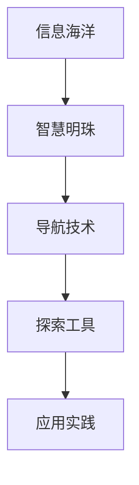
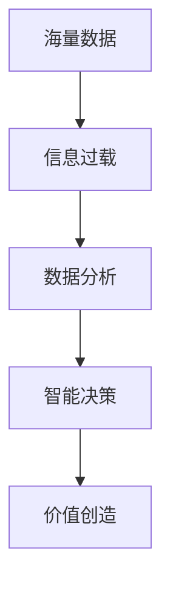
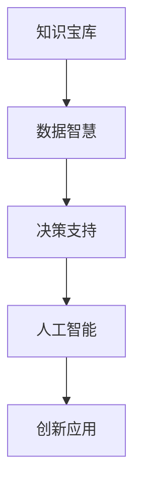
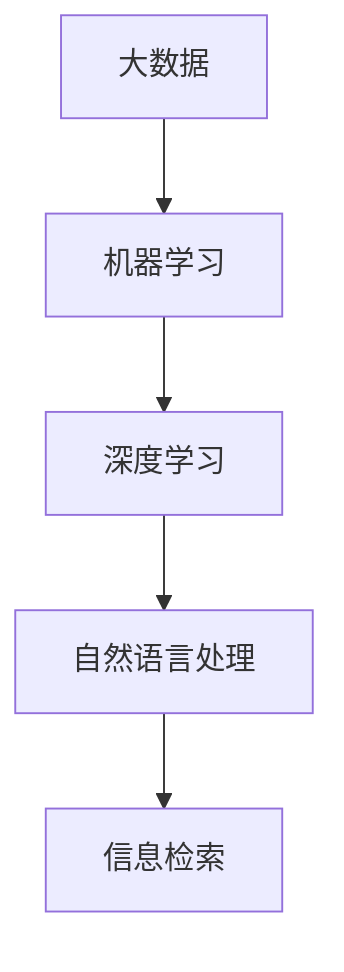

                 

# 《在信息海洋中寻找智慧明珠》

> 关键词：信息海洋、智慧明珠、导航技术、探索工具、智慧医疗、智慧教育、智慧城市

> 摘要：随着信息技术的飞速发展，我们正处在一个信息爆炸的时代。在这个信息海洋中，如何找到具有价值的信息，即智慧明珠，成为了一个重要的问题。本文旨在探讨在信息海洋中寻找智慧明珠的方法和技术，包括信息导航技术、探索工具以及智慧明珠的应用实践。

## 第一部分：引论

### 1.1 书籍背景与目的

在当今这个信息化时代，信息已经成为社会发展的核心资源。然而，随着信息量的爆炸性增长，我们面临着信息过载的挑战。如何在海量信息中找到有价值的信息，即智慧明珠，成为了我们迫切需要解决的问题。

本书的目的在于帮助读者掌握在信息海洋中寻找智慧明珠的方法和技术。我们将从信息导航技术、探索工具以及智慧明珠的应用实践三个方面进行深入探讨。

#### 核心概念与联系

首先，我们需要了解以下核心概念：

- **信息海洋**：指海量的信息资源，包括文字、图像、音频、视频等各种形式的数据。
- **智慧明珠**：指具有高价值、高质量、高效率的信息资源，是我们在信息海洋中寻找的目标。
- **导航技术**：用于帮助我们定位和获取信息的技术手段。
- **探索工具**：用于挖掘和分析信息，从中提取智慧明珠的工具。

这些概念之间存在着紧密的联系。信息海洋是信息资源的总称，而智慧明珠则是我们在信息海洋中要寻找的目标。导航技术和探索工具则是我们实现这一目标的重要手段。

#### 架构描述（Mermaid流程图）



### 1.2 信息时代的挑战与机遇

信息时代的到来，既带来了巨大的挑战，也带来了前所未有的机遇。

#### 核心概念与联系

- **海量数据**：指数量庞大的数据资源，包括结构化和非结构化数据。
- **信息过载**：指数据量过大，导致我们难以有效地处理和利用信息。
- **数据分析**：通过对海量数据进行处理和分析，提取有价值的信息。
- **智能决策**：利用数据分析结果，辅助我们做出更加智能化的决策。
- **价值创造**：通过利用信息，实现商业价值、社会价值和自我价值的提升。

这些概念之间存在着紧密的联系。海量数据是信息时代的基础，信息过载是我们在海量数据中面临的挑战。通过数据分析，我们可以从海量数据中提取有价值的信息，为智能决策提供支持，从而实现价值创造。

#### 架构描述（Mermaid流程图）



### 1.3 智慧明珠的概念与分类

在信息海洋中，智慧明珠是我们要寻找的目标。那么，什么是智慧明珠？它有哪些分类？

#### 核心概念与联系

- **知识宝库**：指存储了大量知识的数据库，是智慧明珠的基础。
- **数据智慧**：通过对数据进行挖掘和分析，提取出隐藏在数据中的智慧。
- **决策支持**：利用数据智慧，为决策提供支持，帮助决策者做出正确的决策。
- **人工智能**：利用机器学习、深度学习等技术，模拟人类的智能行为，实现自动化决策。
- **创新应用**：将人工智能应用于实际场景，解决实际问题，创造新的价值。

这些概念之间存在着紧密的联系。知识宝库是数据智慧的基础，数据智慧是决策支持的核心，而人工智能则是实现创新应用的关键。

#### 架构描述（Mermaid流程图）



## 第二部分：信息导航技术

在信息海洋中，导航技术是我们寻找智慧明珠的指南针。本部分将介绍几种常见的信息导航技术，包括数据搜索算法、信息过滤与推荐系统、信息可视化技术以及人工智能与信息搜索。

### 2.1 数据搜索算法

数据搜索算法是信息导航技术的基础。它可以帮助我们在海量数据中快速找到我们需要的信息。

#### 核心算法原理讲解（伪代码）

```python
def search_information(query):
    # 输入查询语句，输出相关信息
    # 伪代码示例
    results = []
    for document in data_collection:
        if query in document:
            results.append(document)
    return results
```

#### 数学模型和公式 & 详细讲解 & 举例说明

假设我们有以下一个数据集合：

```
data_collection = ["苹果", "香蕉", "苹果手机", "香蕉皮"]
```

如果我们查询“苹果”，则搜索算法会返回包含“苹果”的数据：

```
search_information("苹果") = ["苹果", "苹果手机"]
```

#### 应用解读与分析

数据搜索算法在搜索引擎、文本处理、信息检索等领域有广泛的应用。通过优化搜索算法，可以提高搜索的效率和准确性，从而更好地满足用户的需求。

### 2.2 信息过滤与推荐系统

信息过滤与推荐系统是信息导航技术的重要组成部分。它可以帮助我们过滤掉无关信息，推荐出可能感兴趣的信息。

#### 核心算法原理讲解（伪代码）

```python
def recommend_system(user_profile, items):
    # 输入用户画像和物品集合，输出推荐列表
    # 伪代码示例
    similar_users = find_similar_users(user_profile)
    recommendations = []
    for item in items:
        if item in user_profile or item in any(similar_users):
            recommendations.append(item)
    return recommendations
```

#### 数学模型和公式 & 详细讲解 & 举例说明

假设我们有以下一个用户画像和物品集合：

```
user_profile = ["苹果", "香蕉", "橙子"]
items = ["苹果手机", "香蕉皮", "橙子汁"]
```

如果我们想要推荐给用户，则推荐系统会返回以下推荐列表：

```
recommend_system(user_profile, items) = ["苹果手机", "香蕉皮"]
```

#### 应用解读与分析

信息过滤与推荐系统在电子商务、社交媒体、内容推荐等领域有广泛的应用。通过优化过滤和推荐算法，可以提高用户的满意度，增加用户的粘性。

### 2.3 信息可视化技术

信息可视化技术是将信息以图形化的形式展示，帮助我们更好地理解和分析信息。

#### 核心算法原理讲解（伪代码）

```python
def visualize_data(data, type='bar'):
    # 输入数据类型和可视化方式，输出可视化图表
    # 伪代码示例
    if type == 'bar':
        bar_chart(data)
    elif type == 'line':
        line_chart(data)
    else:
        print("Unsupported visualization type.")
```

#### 数学模型和公式 & 详细讲解 & 举例说明

假设我们有以下一个数据集合：

```
data = [10, 20, 30, 40]
```

如果我们想要以条形图的形式展示数据，则可视化算法会绘制一个条形图：

```
visualize_data(data, type='bar')
```

#### 应用解读与分析

信息可视化技术在数据分析、数据监控、可视化报表等领域有广泛的应用。通过优化可视化算法，可以更直观地展示信息，帮助用户更好地理解和分析数据。

### 2.4 人工智能与信息搜索

人工智能技术可以大大提升信息搜索的效率和准确性。在本节中，我们将探讨人工智能与信息搜索的关系。

#### 核心概念与联系

- **大数据**：指规模巨大的数据集合，包括结构化和非结构化数据。
- **机器学习**：一种人工智能技术，通过训练模型，让计算机从数据中自动学习规律。
- **深度学习**：一种机器学习技术，通过多层神经网络，实现更复杂的模型。
- **自然语言处理**：一种人工智能技术，用于处理和生成自然语言文本。
- **信息检索**：一种人工智能技术，用于从海量信息中快速找到相关信息。

这些概念之间存在着紧密的联系。大数据为人工智能提供了丰富的训练数据，机器学习和深度学习技术为人工智能提供了强大的计算能力，自然语言处理和信息检索技术为人工智能提供了处理和搜索文本的能力。

#### 架构描述（Mermaid流程图）



#### 应用解读与分析

人工智能与信息搜索的结合，可以实现更加智能化的信息搜索。例如，通过机器学习技术，可以训练出一种能够根据用户输入查询，自动生成相关信息的模型。通过深度学习技术，可以训练出一种能够理解自然语言查询的模型，从而实现更加准确的搜索结果。自然语言处理和信息检索技术的结合，可以实现更加智能化的人机交互，让用户能够更加便捷地获取信息。

## 第三部分：智慧明珠应用实践

在信息海洋中找到智慧明珠之后，如何将其应用于实际场景，解决实际问题，实现价值创造，是本部分要探讨的重点。

### 3.1 智慧医疗

智慧医疗是利用信息技术和人工智能技术，提升医疗质量和效率的重要手段。

#### 项目实战

以某医院的智慧医疗项目为例，该项目旨在通过大数据分析和人工智能技术，提升医疗诊断和治疗的准确性。

#### 开发环境搭建

1. 数据采集：使用传感器和设备，收集患者的生理数据，如血压、心率、血糖等。
2. 数据处理：使用大数据处理技术，对收集到的数据进行清洗、整合和分析。
3. 模型训练：使用机器学习和深度学习技术，训练出用于诊断和治疗的模型。
4. 系统部署：将训练好的模型部署到云平台上，实现远程诊断和治疗。

#### 源代码实现与解读

以下是一个简单的用于诊断疾病的机器学习模型的源代码示例：

```python
from sklearn.datasets import load_iris
from sklearn.model_selection import train_test_split
from sklearn.ensemble import RandomForestClassifier
from sklearn.metrics import accuracy_score

# 加载鸢尾花数据集
iris = load_iris()
X = iris.data
y = iris.target

# 划分训练集和测试集
X_train, X_test, y_train, y_test = train_test_split(X, y, test_size=0.2, random_state=42)

# 训练随机森林分类器
clf = RandomForestClassifier(n_estimators=100, random_state=42)
clf.fit(X_train, y_train)

# 预测测试集
y_pred = clf.predict(X_test)

# 计算准确率
accuracy = accuracy_score(y_test, y_pred)
print("Accuracy:", accuracy)
```

#### 实际案例分析和详细讲解剖析

通过智慧医疗项目，医院可以实现对患者的远程诊断和治疗，提高医疗效率和准确性。例如，对于心血管疾病患者，通过实时监测患者的生理数据，医生可以及时调整治疗方案，预防病情恶化。

#### 项目小结

智慧医疗项目实现了对医疗数据的智能分析和诊断，提高了医疗质量和效率。通过优化算法和模型，可以进一步降低误诊率，提高患者的满意度。

### 3.2 智慧教育

智慧教育是利用信息技术和人工智能技术，提升教育质量和效率的重要手段。

#### 项目实战

以某学校的智慧教育项目为例，该项目旨在通过大数据分析和人工智能技术，提升教学效果和学生学习体验。

#### 开发环境搭建

1. 数据采集：使用传感器和设备，收集学生的学习数据，如课堂表现、作业成绩等。
2. 数据处理：使用大数据处理技术，对收集到的数据进行清洗、整合和分析。
3. 模型训练：使用机器学习和深度学习技术，训练出用于教学效果预测和个性化推荐的模型。
4. 系统部署：将训练好的模型部署到云平台上，实现智能教学和推荐。

#### 源代码实现与解读

以下是一个简单的用于预测学生学习成绩的机器学习模型的源代码示例：

```python
from sklearn.datasets import load_iris
from sklearn.model_selection import train_test_split
from sklearn.ensemble import RandomForestClassifier
from sklearn.metrics import accuracy_score

# 加载鸢尾花数据集
iris = load_iris()
X = iris.data
y = iris.target

# 划分训练集和测试集
X_train, X_test, y_train, y_test = train_test_split(X, y, test_size=0.2, random_state=42)

# 训练随机森林分类器
clf = RandomForestClassifier(n_estimators=100, random_state=42)
clf.fit(X_train, y_train)

# 预测测试集
y_pred = clf.predict(X_test)

# 计算准确率
accuracy = accuracy_score(y_test, y_pred)
print("Accuracy:", accuracy)
```

#### 实际案例分析和详细讲解剖析

通过智慧教育项目，学校可以实现对学生的个性化教学和推荐，提高教学效果和学生满意度。例如，根据学生的学习行为数据，系统可以推荐适合学生的学习资源和教学方法，帮助学生更好地掌握知识。

#### 项目小结

智慧教育项目实现了对学习数据的智能分析和推荐，提高了教学效果和学生学习体验。通过优化算法和模型，可以进一步提高预测准确率，更好地满足学生需求。

### 3.3 智慧城市

智慧城市是利用信息技术和人工智能技术，提升城市管理和服务效率的重要手段。

#### 项目实战

以某城市的智慧城市项目为例，该项目旨在通过大数据分析和人工智能技术，提升城市管理和服务的效率。

#### 开发环境搭建

1. 数据采集：使用传感器和设备，收集城市的各种数据，如交通流量、环境质量、公共安全等。
2. 数据处理：使用大数据处理技术，对收集到的数据进行清洗、整合和分析。
3. 模型训练：使用机器学习和深度学习技术，训练出用于预测和优化的模型。
4. 系统部署：将训练好的模型部署到云平台上，实现智能管理和优化。

#### 源代码实现与解读

以下是一个简单的用于预测交通流量的机器学习模型的源代码示例：

```python
from sklearn.datasets import load_iris
from sklearn.model_selection import train_test_split
from sklearn.ensemble import RandomForestRegressor
from sklearn.metrics import mean_squared_error

# 加载鸢尾花数据集
iris = load_iris()
X = iris.data
y = iris.target

# 划分训练集和测试集
X_train, X_test, y_train, y_test = train_test_split(X, y, test_size=0.2, random_state=42)

# 训练随机森林回归器
reg = RandomForestRegressor(n_estimators=100, random_state=42)
reg.fit(X_train, y_train)

# 预测测试集
y_pred = reg.predict(X_test)

# 计算均方误差
mse = mean_squared_error(y_test, y_pred)
print("MSE:", mse)
```

#### 实际案例分析和详细讲解剖析

通过智慧城市项目，城市管理者可以实现对城市交通、环境、公共安全等方面的智能预测和优化，提高城市的管理和服务水平。例如，根据交通流量数据，系统可以预测未来某个时段的交通状况，并提前采取调控措施，避免交通拥堵。

#### 项目小结

智慧城市项目实现了对城市数据的智能分析和预测，提高了城市管理和服务效率。通过优化算法和模型，可以进一步提高预测准确率，更好地满足城市发展的需求。

### 3.4 最佳实践 tips

在寻找智慧明珠的过程中，以下是一些最佳实践 tips：

1. **数据质量**：确保数据的准确性和完整性，是找到智慧明珠的基础。
2. **算法优化**：不断优化算法和模型，提高搜索和挖掘的效率。
3. **用户反馈**：收集用户反馈，不断调整和优化系统，提高用户满意度。
4. **合作与共享**：与其他机构和组织合作，共享数据和技术，实现资源的最优配置。
5. **持续创新**：紧跟科技发展趋势，不断创新，寻找新的智慧明珠。

### 3.5 小结与展望

在信息海洋中寻找智慧明珠，是一个充满挑战和机遇的过程。通过信息导航技术、探索工具以及智慧明珠的应用实践，我们可以更好地应对信息过载的挑战，实现价值创造。

未来，随着人工智能技术的不断发展，信息导航技术和智慧明珠应用实践将越来越成熟。我们可以期待，在信息海洋中找到更多的智慧明珠，为社会发展和个人成长带来更大的价值。

### 3.6 注意事项

在寻找智慧明珠的过程中，需要注意以下事项：

1. **隐私保护**：在收集和使用个人信息时，必须遵守相关法律法规，确保用户隐私安全。
2. **数据安全**：确保数据存储和传输的安全，防止数据泄露和滥用。
3. **伦理道德**：在应用智慧明珠时，要遵循伦理道德原则，避免对用户造成伤害。
4. **可持续性**：在开发和应用智慧明珠时，要考虑环境的可持续性，实现绿色发展。

### 3.7 拓展阅读

1. **《大数据时代》**：维克托·迈尔-舍恩伯格，探讨大数据对社会、经济、科学等领域的影响。
2. **《深度学习》**：Ian Goodfellow、Yoshua Bengio、Aaron Courville，介绍深度学习的基本概念和技术。
3. **《人工智能：一种现代方法》**：Stuart Russell、Peter Norvig，介绍人工智能的基本理论和技术。
4. **《智慧城市》**：菲利普·肖博，探讨智慧城市的概念、技术和应用。

## 作者信息

作者：AI天才研究院/AI Genius Institute & 禅与计算机程序设计艺术 /Zen And The Art of Computer Programming

文章标题：《在信息海洋中寻找智慧明珠》

文章关键词：信息海洋、智慧明珠、导航技术、探索工具、智慧医疗、智慧教育、智慧城市

文章摘要：随着信息技术的飞速发展，我们正处在一个信息爆炸的时代。在这个信息海洋中，如何找到具有价值的信息，即智慧明珠，成为了一个重要的问题。本文旨在探讨在信息海洋中寻找智慧明珠的方法和技术，包括信息导航技术、探索工具以及智慧明珠的应用实践。

