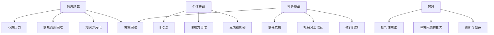
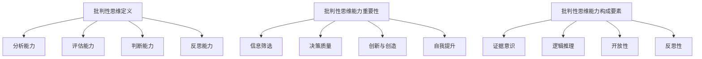

                 

### 文章标题

在信息过载时代，如何培养批判性思维能力，以寻找智慧，是一个至关重要的问题。本文旨在探讨这一主题，通过逻辑清晰、结构紧凑、简单易懂的专业技术语言，帮助读者了解批判性思维能力的概念、培养方法及其在各领域的应用。本文分为三大部分：第一部分介绍信息过载时代的背景与挑战；第二部分探讨批判性思维能力的培养方法；第三部分分析批判性思维能力在特定领域的应用。通过逐步分析推理，本文希望引导读者找到在信息过载时代中寻找智慧的方法。

### 文章关键词

- 信息过载
- 批判性思维能力
- 智慧
- 培养方法
- 领域应用

### 文章摘要

本文首先介绍了信息过载时代的背景与挑战，阐述了智慧的重要性与内涵。接着，探讨了批判性思维能力的概念与作用，并详细介绍了批判性思维能力的培养方法。最后，本文分析了批判性思维能力在科学、商业和社会治理等特定领域的应用。通过本文的阅读，读者可以了解到在信息过载时代如何培养批判性思维能力，以寻找智慧。

## 第一部分：信息过载时代与智慧概述

### 第1章：信息过载时代的背景与挑战

在当今社会，信息过载已成为一种普遍现象。随着互联网和移动设备的普及，信息传播的速度和范围得到了极大拓展，每天产生和更新的数据量呈爆炸式增长。这不仅给人们的生活带来了便利，也带来了诸多挑战。

#### 1.1 信息过载的定义与影响

信息过载指的是信息量过大，超出了人们处理和吸收的能力，导致个体或群体无法有效利用这些信息。这种现象的影响主要体现在以下几个方面：

1. **心理压力**：面对海量的信息，人们往往会感到焦虑和压力，导致注意力不集中，影响工作效率和生活质量。
2. **信息筛选困难**：在信息过载的环境中，人们难以判断哪些信息是真实可靠的，哪些是虚假的，导致信息筛选的困难。
3. **知识碎片化**：由于信息过多，人们倾向于只获取部分信息，导致知识碎片化，难以形成全面而深入的理解。
4. **决策困难**：在信息过载的时代，个体和企业需要做出更多、更复杂的决策，但由于信息量巨大，决策变得复杂且耗时。

#### 1.2 信息过载对个体和社会的挑战

信息过载对个体和社会带来了许多挑战，具体表现如下：

1. **个体挑战**：
   - **认知负担**：人们需要花费大量时间和精力去处理和筛选信息，导致认知负担加重。
   - **注意力分散**：在信息过载的环境中，人们容易受到各种信息的干扰，导致注意力分散，难以集中精力完成任务。
   - **焦虑和抑郁**：长期处于信息过载的环境中，个体可能会出现焦虑和抑郁等心理问题。

2. **社会挑战**：
   - **信任危机**：在信息过载的时代，虚假信息和谣言的传播速度极快，导致社会信任度下降。
   - **社会分工混乱**：信息过载使得人们难以专注于某一领域的深入学习和研究，导致社会分工混乱，专业人才流失。
   - **教育问题**：在信息过载的环境下，教育系统难以培养学生的批判性思维能力和深层次理解能力，导致教育质量下降。

#### 1.3 智慧的重要性与内涵

面对信息过载带来的挑战，智慧显得尤为重要。智慧不仅仅是指知识和技能的积累，更是一种思维方式和方法论。智慧体现在以下几个方面：

1. **批判性思维**：智慧的一个重要组成部分是批判性思维，即能够对信息进行深入分析、判断和评估，而不是盲目接受或排斥。
2. **解决问题的能力**：智慧还体现在解决问题的能力上，即在面对复杂问题时，能够找到有效的解决方案，而不是被问题所困扰。
3. **创新与创造**：智慧还包括创新与创造的能力，即能够在现有知识的基础上进行创新，产生新的思想、技术和产品。

在信息过载的时代，培养智慧意味着学会筛选和处理信息，提高批判性思维能力，从而在复杂的环境中找到问题的解决方案，实现自我成长和社会进步。

### Mermaid 流程图



### 第2章：批判性思维能力的概念与作用

批判性思维能力是指对信息进行深入分析、判断和评估的能力，是智慧的重要组成部分。在信息过载的时代，培养批判性思维能力具有重要意义。

#### 2.1 批判性思维能力的定义

批判性思维能力（Critical Thinking Ability）是一种综合能力，它包括以下几个关键要素：

1. **分析能力**：能够对信息进行深入分析，理解其内在逻辑和因果关系。
2. **评估能力**：能够对信息进行评估，判断其真实性和可靠性。
3. **判断能力**：能够基于事实和逻辑进行判断，而不是依赖直觉或偏见。
4. **反思能力**：能够对自己的思维过程和结论进行反思，找出可能的错误和不足。

#### 2.2 批判性思维能力的重要性

批判性思维能力在信息过载的时代具有重要意义，具体体现在以下几个方面：

1. **信息筛选**：批判性思维能力可以帮助个体在海量的信息中筛选出有价值的信息，避免被虚假信息所误导。
2. **决策质量**：批判性思维能力可以提高决策的质量，帮助个体在面对复杂问题时做出更加明智的决策。
3. **创新与创造**：批判性思维能力可以激发个体的创造力，使其在现有知识的基础上进行创新，产生新的思想、技术和产品。
4. **自我提升**：批判性思维能力可以帮助个体不断反思和改进自己的思维方式和行为模式，实现自我成长。

#### 2.3 批判性思维能力的构成要素

批判性思维能力由以下几个核心要素构成：

1. **证据意识**：批判性思维要求个体具备证据意识，即对信息的真实性和可靠性进行评估，基于事实和证据进行判断。
2. **逻辑推理**：批判性思维要求个体具备逻辑推理能力，能够运用逻辑规则和原则对信息进行推理和分析。
3. **开放性**：批判性思维要求个体保持开放性，愿意接受不同的观点和意见，进行跨领域的思考和交流。
4. **反思性**：批判性思维要求个体具备反思性，能够对自己的思维过程和结论进行反思，不断改进和提升自己的思维水平。

通过培养批判性思维能力，个体可以在信息过载的时代中找到智慧，提高自身的综合素质，实现自我成长和社会进步。

### Mermaid 流程图



### 第3章：批判性思维的基本原则

批判性思维作为一种重要的思维能力，其核心在于对信息进行深入分析和评估。要有效培养批判性思维，我们需要遵循一系列基本原则，以确保我们的思考过程严谨、全面和有效。

#### 3.1 清晰思考的原则

清晰思考是批判性思维的基础。以下是一些确保清晰思考的基本原则：

1. **明确目标**：在进行思考之前，明确自己的目标是什么。这有助于我们集中注意力，避免在无关信息上浪费时间。
   ```python
   # 伪代码：明确目标
   def setGoal():
       goal = input("请输入你的目标：")
       return goal
   ```

2. **定义概念**：确保自己理解并明确概念的含义。这有助于我们在分析问题时不会产生误解。
   ```python
   # 伪代码：定义概念
   def defineConcept(concept):
       meaning = input(f"请输入'{concept}'的定义：")
       return meaning
   ```

3. **逻辑清晰**：在表达观点时，确保逻辑连贯，避免模糊不清或自相矛盾。
   ```python
   # 伪代码：逻辑清晰
   def clarifyLogic(statement):
       logic = input("请输入你的逻辑：")
       return logic
   ```

#### 3.2 逻辑推理的原则

逻辑推理是批判性思维的核心。以下是一些确保逻辑推理有效的原则：

1. **避免逻辑谬误**：在推理过程中，要避免常见的逻辑谬误，如偷换概念、以偏概全、因果混淆等。
   ```python
   # 伪代码：避免逻辑谬误
   def avoidLogicalFallacies(statement):
       if "偷换概念" in statement:
           print("避免偷换概念")
       elif "以偏概全" in statement:
           print("避免以偏概全")
       elif "因果混淆" in statement:
           print("避免因果混淆")
   ```

2. **支持证据**：在推理过程中，需要提供充足的证据来支持论点。这有助于增强论点的说服力。
   ```python
   # 伪代码：支持证据
   def provideEvidence(evidence):
       if not evidence:
           print("请提供证据")
       else:
           print("证据充分")
   ```

3. **归纳与演绎**：运用归纳和演绎推理方法，从具体事实中归纳出一般规律，或从一般原则推导出具体结论。
   ```python
   # 伪代码：归纳与演绎
   def inductiveDeductive(reasoningType):
       if reasoningType == "归纳":
           print("进行归纳推理")
       elif reasoningType == "演绎":
           print("进行演绎推理")
   ```

#### 3.3 证据意识的原则

批判性思维要求我们具备强烈的证据意识，即对信息的真实性和可靠性进行评估。

1. **验证来源**：在引用信息时，确保信息来源可靠，避免引用未经证实的信息。
   ```python
   # 伪代码：验证来源
   def verifySource(source):
       if isReliable(source):
           print("来源可靠")
       else:
           print("请验证来源")
   ```

2. **交叉验证**：对同一信息进行多个来源的验证，以确认其真实性。
   ```python
   # 伪代码：交叉验证
   def crossVerify(information, sources):
       if all(sources[information] == True for sources in sources):
           print("信息验证通过")
       else:
           print("请进行交叉验证")
   ```

3. **持续更新**：信息是动态变化的，我们需要不断更新自己的知识库，确保所引用的信息是最新的。
   ```python
   # 伪代码：持续更新
   def updateKnowledgeBase(knowledgeBase):
       newKnowledge = input("请输入新的知识：")
       knowledgeBase[newKnowledge] = True
       print("知识库更新完成")
   ```

通过遵循这些基本原则，我们可以有效培养批判性思维能力，提高信息处理和分析的能力，从而在信息过载的时代中找到智慧。

### 第4章：批判性思维的培养途径

批判性思维能力的培养是一个长期且复杂的过程，需要从多个方面进行努力。以下是一些具体的培养途径，包括教育、实践和自我反思等方面。

#### 4.1 教育与训练

教育是培养批判性思维能力的重要途径。在学校和培训机构中，可以通过以下方法进行教育和训练：

1. **课程设置**：学校应设置批判性思维相关的课程，引导学生了解批判性思维的基本概念、原则和方法。例如，可以设置“批判性思维与问题解决”、“逻辑学基础”等课程。
   
2. **案例教学**：通过分析经典案例，让学生了解批判性思维在实际问题中的应用。案例可以从历史事件、科学发现、社会现象等多个领域选取。

3. **讨论和辩论**：鼓励学生在课堂上进行讨论和辩论，这有助于提高学生的表达能力和逻辑思维能力。通过辩论，学生可以学会如何提出观点、反驳对方、构建有力的论据。

4. **批判性阅读**：培养学生的批判性阅读能力，要求学生不仅理解文章的内容，还要分析作者的观点、论据和论证过程。可以通过设置阅读笔记、撰写读书报告等方式进行训练。

5. **专业培训**：对于成年人，可以通过参加专业培训课程来提升批判性思维能力。例如，可以参加逻辑思维、决策分析、问题解决等培训课程。

#### 4.2 实践与应用

批判性思维能力的培养不仅需要理论学习，更需要实践和应用。以下是一些具体的实践方法：

1. **日常练习**：在日常生活中，可以通过阅读、写作、讨论等方式进行批判性思维的练习。例如，阅读文章后写下自己的观点和思考，与他人讨论不同的观点，这些都是锻炼批判性思维的好方法。

2. **项目实战**：参与实际项目，例如科研课题、创业项目等，可以在实践中应用批判性思维。项目过程中，需要分析问题、设计解决方案、评估风险等，这些都是培养批判性思维能力的机会。

3. **问题解决**：面对日常生活中的问题，尝试用批判性思维去分析和解决。例如，遇到购物决策时，可以通过比较不同产品的优点和缺点，分析各自的优缺点，从而做出更加明智的选择。

4. **跨领域学习**：通过跨领域的学习，可以开阔视野，提升对不同领域的理解和分析能力。例如，学习心理学、哲学、经济学等跨学科知识，有助于培养全面的批判性思维能力。

#### 4.3 自我反思与改进

自我反思是批判性思维培养的重要环节。以下是一些自我反思和改进的方法：

1. **记录思考过程**：在遇到问题时，记录自己的思考过程，包括提出的问题、分析的方法、推理的步骤等。这有助于回顾和评估自己的思考方式。

2. **批判性写作**：通过写作来反思和总结自己的思考过程和结论。可以写反思日志、论文等，通过写作来梳理思路，发现不足。

3. **寻求反馈**：向他人寻求反馈，特别是那些在批判性思维方面有经验的人。他们可以提供不同的观点和建议，帮助我们发现自己的盲点和错误。

4. **持续学习**：批判性思维能力的培养是一个持续的过程，需要不断学习新知识、新方法，并将其应用到实践中。

通过教育与训练、实践与应用以及自我反思与改进，我们可以逐步培养和提高批判性思维能力，从而在信息过载的时代中更好地应对各种挑战，寻找智慧。

### 第5章：批判性思维能力在个体发展中的作用

批判性思维能力在个体发展中的作用不可忽视。它不仅有助于提升个人的问题解决能力，还能显著改善决策质量和促进创新与创造。以下将详细探讨这些方面。

#### 5.1 提升问题解决能力

批判性思维能力的核心在于分析和评估信息，这为解决问题提供了强有力的工具。通过以下步骤，批判性思维能力可以显著提升问题解决能力：

1. **明确问题**：首先，需要明确问题的本质和范围，避免在次要细节上浪费时间。
   ```python
   # 伪代码：明确问题
   def defineProblem(problem):
       return f"问题定义：{problem}"
   ```

2. **收集信息**：通过多种渠道收集与问题相关的信息，包括文献、专家意见、案例分析等。
   ```python
   # 伪代码：收集信息
   def collectInformation(informationSources):
       data = []
       for source in informationSources:
           data.append(getDataFromSource(source))
       return data
   ```

3. **分析信息**：对收集到的信息进行深入分析，识别问题的主要因素和潜在原因。
   ```python
   # 伪代码：分析信息
   def analyzeInformation(data):
       factors = []
       for datum in data:
           factors.extend(extractFactors(datum))
       return factors
   ```

4. **评估方案**：根据分析结果，评估各种可能的解决方案，选择最优方案。
   ```python
   # 伪代码：评估方案
   def evaluateSolutions(solutions, criteria):
       best_solution = None
       for solution in solutions:
           score = calculateScore(solution, criteria)
           if best_solution is None or score > best_solution['score']:
               best_solution = {'solution': solution, 'score': score}
       return best_solution['solution']
   ```

5. **实施和监控**：选择最佳方案后，实施解决方案，并在实施过程中进行监控和调整。
   ```python
   # 伪代码：实施和监控
   def implementAndMonitor(solution):
       monitor = True
       while monitor:
           status = checkStatus(solution)
           if status == 'solved':
               monitor = False
           elif status == 'not_solved':
               adjustSolution(solution)
   ```

通过以上步骤，批判性思维能力可以有效地提升问题解决能力，帮助个体在面对复杂问题时找到有效的解决方案。

#### 5.2 增强决策质量

批判性思维能力在决策过程中起着至关重要的作用。以下方法可以帮助增强决策质量：

1. **明确决策目标**：在做出决策之前，明确决策的目标和预期结果。
   ```python
   # 伪代码：明确决策目标
   def defineDecisionGoal(goal):
       return f"决策目标：{goal}"
   ```

2. **收集和分析信息**：收集与决策相关的信息，并对这些信息进行深入分析。
   ```python
   # 伪代码：收集和分析信息
   def collectAndAnalyzeInformation(information):
       analyzed_data = analyzeInformation(information)
       return analyzed_data
   ```

3. **评估备选方案**：对各种备选方案进行评估，选择最符合决策目标的方案。
   ```python
   # 伪代码：评估备选方案
   def evaluateOptions(options, criteria):
       best_option = None
       for option in options:
           score = calculateScore(option, criteria)
           if best_option is None or score > best_option['score']:
               best_option = {'option': option, 'score': score}
       return best_option['option']
   ```

4. **风险分析**：对决策方案进行风险分析，评估可能出现的风险和负面影响。
   ```python
   # 伪代码：风险分析
   def analyzeRisks(solution):
       risks = []
       for risk in getRisks(solution):
           risks.append({'risk': risk, 'impact': impactOfRisk(risk)})
       return risks
   ```

5. **决策执行和监控**：执行决策方案，并在执行过程中进行监控和调整。
   ```python
   # 伪代码：决策执行和监控
   def executeAndMonitor(solution):
       monitor = True
       while monitor:
           status = checkStatus(solution)
           if status == 'successful':
               monitor = False
           elif status == 'unsuccessful':
               adjustSolution(solution)
   ```

通过这些方法，批判性思维能力可以帮助个体在决策过程中更全面、准确地评估各种因素，从而提高决策质量。

#### 5.3 促进创新与创造

批判性思维能力不仅可以提高问题解决能力和决策质量，还能显著促进创新与创造。以下方法可以帮助利用批判性思维能力进行创新：

1. **质疑现状**：对现有的知识、方法、产品等进行质疑，思考是否有改进的空间。
   ```python
   # 伪代码：质疑现状
   def questionStatus quo(current_solution):
       improvements = []
       for component in current_solution:
           if canImprove(component):
               improvements.append(component)
       return improvements
   ```

2. **跨领域思维**：将不同领域的知识和方法结合起来，寻找创新的交叉点。
   ```python
   # 伪代码：跨领域思维
   def crossDomainThinking(domain1, domain2):
       intersection = []
       for concept1 in domain1:
           for concept2 in domain2:
               if isIntersection(concept1, concept2):
                   intersection.append((concept1, concept2))
       return intersection
   ```

3. **头脑风暴**：通过集体头脑风暴，激发创意和灵感。
   ```python
   # 伪代码：头脑风暴
   def brainstormIdeas():
       ideas = []
       for participant in getParticipants():
           ideas.extend(getIdeasFromParticipant(participant))
       return ideas
   ```

4. **原型设计**：快速构建原型，验证创新思路的可行性。
   ```python
   # 伪代码：原型设计
   def designPrototype(idea):
       prototype = buildPrototype(idea)
       validatePrototype(prototype)
       return prototype
   ```

5. **迭代改进**：根据原型测试的结果，不断迭代和改进创新方案。
   ```python
   # 伪代码：迭代改进
   def improvePrototype(prototype, feedback):
       for change in feedback:
           applyChange(prototype, change)
       return prototype
   ```

通过这些方法，批判性思维能力可以帮助个体不断质疑、创新，从而在各个领域中取得突破性的成果。

通过提升问题解决能力、增强决策质量和促进创新与创造，批判性思维能力在个体发展中发挥着重要作用。在信息过载的时代，培养批判性思维能力是寻找智慧和实现个人成长的关键。

### 第6章：批判性思维在科学领域的应用

批判性思维在科学领域中的应用至关重要，它不仅促进了科学研究的进展，也确保了科学论证的严谨性。以下将探讨批判性思维在科学研究中的应用，包括科学研究的批判性思维、科学论证与质疑以及科学方法的应用。

#### 6.1 科学研究中的批判性思维

科学研究的批判性思维主要体现在对研究假设、实验设计和数据分析的深入分析和评估。以下步骤展示了如何应用批判性思维进行科学研究：

1. **明确研究目标**：首先，需要明确研究的目标，确保研究具有明确的导向性和实用性。
   ```python
   # 伪代码：明确研究目标
   def defineResearchGoal(goal):
       return f"研究目标：{goal}"
   ```

2. **提出研究假设**：在明确研究目标后，提出能够验证或反驳目标的研究假设。
   ```python
   # 伪代码：提出研究假设
   def proposeHypothesis(hypothesis):
       return f"研究假设：{hypothesis}"
   ```

3. **设计实验**：批判性思维要求对实验设计进行深入分析，确保实验能够有效地验证或反驳假设。
   ```python
   # 伪代码：设计实验
   def designExperiment(experiment):
       steps = []
       for step in experiment:
           if isCritical(step):
               steps.append(step)
       return steps
   ```

4. **数据收集**：在实验过程中，收集与假设相关的数据，确保数据的真实性和可靠性。
   ```python
   # 伪代码：数据收集
   def collectData(dataCollectionMethod):
       data = []
       for instance in dataCollectionMethod():
           data.append(instance)
       return data
   ```

5. **数据分析**：对收集到的数据进行分析，判断数据是否支持假设，并识别潜在的偏差和错误。
   ```python
   # 伪代码：数据分析
   def analyzeData(data):
       analysis = []
       for datum in data:
           analysis.append(performAnalysis(datum))
       return analysis
   ```

6. **得出结论**：根据数据分析结果，得出结论，并评估结论的有效性和可靠性。
   ```python
   # 伪代码：得出结论
   def drawConclusion(analysis):
       conclusion = ""
       if analysis.supportsHypothesis():
           conclusion = "假设成立"
       else:
           conclusion = "假设不成立"
       return conclusion
   ```

通过这些步骤，批判性思维可以帮助科学家在研究中进行深入的思考和分析，确保研究的严谨性和科学性。

#### 6.2 科学论证与质疑

科学论证和质疑是科学研究的重要组成部分，它确保了科学知识的不断发展和完善。以下方法展示了如何应用批判性思维进行科学论证和质疑：

1. **提出质疑**：对现有的科学理论、假设和结论提出质疑，思考其可能存在的漏洞和不足。
   ```python
   # 伪代码：提出质疑
   def raiseQuestions(theory):
       questions = []
       for component in theory:
           if isQuestionable(component):
               questions.append(component)
       return questions
   ```

2. **寻找证据**：为质疑寻找证据，包括实验数据、文献资料和观察结果等，以支持或反驳质疑。
   ```python
   # 伪代码：寻找证据
   def findEvidence(question):
       evidence = []
       for source in getSources():
           if supportsQuestion(question, source):
               evidence.append(source)
       return evidence
   ```

3. **论证分析**：对质疑和证据进行深入分析，评估其合理性和可靠性，确定其是否能够推翻或支持现有的科学理论。
   ```python
   # 伪代码：论证分析
   def performArgumentAnalysis(question, evidence):
       analysis = []
       if evidence.supportsQuestion(question):
           analysis.append("证据支持质疑")
       else:
           analysis.append("证据不支持质疑")
       return analysis
   ```

4. **公开讨论**：将质疑和论证分析公开讨论，接受同行的审查和批评，以促进科学知识的完善和进步。
   ```python
   # 伪代码：公开讨论
   def discussWithPeers(question, analysis):
       feedback = []
       for peer in getPeers():
           feedback.append(peer.review(question, analysis))
       return feedback
   ```

通过科学论证与质疑，批判性思维可以确保科学知识的不断发展和完善，推动科学进步。

#### 6.3 科学方法的应用

科学方法是一种系统的方法论，用于指导科学研究的全过程。以下方法展示了如何应用批判性思维进行科学方法的应用：

1. **提出问题**：科学方法的第一步是提出问题，这需要批判性思维来确保问题的明确性和重要性。
   ```python
   # 伪代码：提出问题
   def formulateQuestion(question):
       if isClearAndImportant(question):
           return question
       else:
           return "问题不明确或不重要"
   ```

2. **形成假设**：在提出问题后，形成能够验证或反驳问题的假设，这需要批判性思维来确保假设的科学性和可验证性。
   ```python
   # 伪代码：形成假设
   def formulateHypothesis(hypothesis):
       if isScientificAndTestable(hypothesis):
           return hypothesis
       else:
           return "假设不科学或不具备可验证性"
   ```

3. **设计实验**：根据假设设计实验，确保实验能够有效地验证或反驳假设，这需要批判性思维来评估实验设计的科学性和可行性。
   ```python
   # 伪代码：设计实验
   def designExperiment(experiment):
       if isScientificAndFeasible(experiment):
           return experiment
       else:
           return "实验设计不科学或不具备可行性"
   ```

4. **收集数据**：在实验过程中，收集与假设相关的数据，确保数据的真实性和可靠性，这需要批判性思维来评估数据的收集和处理方法。
   ```python
   # 伪代码：收集数据
   def collectData(dataCollectionMethod):
       if isValidAndReliable(dataCollectionMethod):
           return data
       else:
           return "数据收集方法无效或不可靠"
   ```

5. **数据分析**：对收集到的数据进行分析，判断数据是否支持假设，并识别潜在的偏差和错误，这需要批判性思维来确保数据分析的科学性和准确性。
   ```python
   # 伪代码：数据分析
   def analyzeData(data):
       if isAnalyticalAndAccurate(data):
           return data
       else:
           return "数据分析不准确"
   ```

6. **得出结论**：根据数据分析结果，得出结论，并评估结论的有效性和可靠性，这需要批判性思维来确保结论的科学性和可靠性。
   ```python
   # 伪代码：得出结论
   def drawConclusion(analysis):
       if analysis.isConclusive():
           return "结论成立"
       else:
           return "结论不成立"
   ```

通过科学方法的应用，批判性思维可以确保科学研究过程的科学性和严谨性，推动科学进步。

### 第7章：批判性思维在商业决策中的应用

批判性思维在商业决策中扮演着至关重要的角色，它帮助企业和个体在面对复杂商业环境时做出明智、有效的决策。以下将探讨批判性思维在商业决策中的应用，包括商业分析中的批判性思维、市场营销中的批判性思维以及商业战略的制定与评估。

#### 7.1 商业分析中的批判性思维

商业分析是商业决策过程中的重要环节，它涉及对市场趋势、竞争对手、消费者行为等多方面信息的分析。批判性思维在商业分析中的应用体现在以下几个方面：

1. **问题定义**：在商业分析中，首先需要明确问题的本质和范围。批判性思维要求我们避免混淆问题，确保分析目标清晰。
   ```python
   # 伪代码：问题定义
   def defineBusinessProblem(problem):
       if isClear(problem):
           return problem
       else:
           return "问题定义不清晰"
   ```

2. **信息收集**：收集与问题相关的信息，包括市场报告、竞争对手分析、消费者调查等。批判性思维要求我们评估信息来源的可靠性和数据的真实性。
   ```python
   # 伪代码：信息收集
   def collectBusinessInformation(informationSources):
       validInformation = []
       for source in informationSources:
           if isValid(source):
               validInformation.append(source)
       return validInformation
   ```

3. **数据分析**：对收集到的信息进行深入分析，识别关键趋势和模式。批判性思维要求我们识别和分析中的潜在偏差和错误。
   ```python
   # 伪代码：数据分析
   def analyzeBusinessData(data):
       analysis = []
       for datum in data:
           if isCorrect(datum):
               analysis.append(datum)
           else:
               analysis.append("数据错误")
       return analysis
   ```

4. **评估方案**：根据分析结果，评估各种可能的商业方案，选择最优方案。批判性思维要求我们评估方案的风险和潜在收益。
   ```python
   # 伪代码：评估方案
   def evaluateBusinessSolutions(solutions, criteria):
       best_solution = None
       for solution in solutions:
           score = calculateScore(solution, criteria)
           if best_solution is None or score > best_solution['score']:
               best_solution = {'solution': solution, 'score': score}
       return best_solution['solution']
   ```

5. **实施和监控**：选择最佳方案后，实施解决方案，并在实施过程中进行监控和调整。批判性思维要求我们评估实施过程中的问题和风险，并采取相应的措施。
   ```python
   # 伪代码：实施和监控
   def implementAndMonitor(solution):
       monitor = True
       while monitor:
           status = checkStatus(solution)
           if status == 'solved':
               monitor = False
           elif status == 'not_solved':
               adjustSolution(solution)
   ```

通过这些步骤，批判性思维可以帮助企业在商业分析中做出更加明智的决策。

#### 7.2 市场营销中的批判性思维

市场营销是商业活动的重要组成部分，它涉及产品定位、市场推广、广告策划等多个方面。批判性思维在市场营销中的应用体现在以下几个方面：

1. **目标市场定义**：在市场营销中，首先需要明确目标市场。批判性思维要求我们避免市场定位模糊，确保营销策略的针对性。
   ```python
   # 伪代码：目标市场定义
   def defineTargetMarket(market):
       if isClearAndTargeted(market):
           return market
       else:
           return "市场定位不清晰"
   ```

2. **市场调研**：进行市场调研，收集与目标市场相关的信息。批判性思维要求我们评估调研方法和数据的可靠性。
   ```python
   # 伪代码：市场调研
   def conductMarketResearch(researchMethod):
       if isValid(researchMethod):
           return researchResults
       else:
           return "调研方法无效"
   ```

3. **竞争分析**：分析竞争对手的产品、市场策略和市场份额。批判性思维要求我们识别竞争对手的优势和劣势，制定相应的应对策略。
   ```python
   # 伪代码：竞争分析
   def analyzeCompetitors(competitors):
       analysis = []
       for competitor in competitors:
           if isAnalytical(competitor):
               analysis.append(competitor)
           else:
               analysis.append("分析不全面")
       return analysis
   ```

4. **广告策划**：在制定广告策略时，批判性思维要求我们评估广告内容的有效性，确保广告能够吸引目标市场。
   ```python
   # 伪代码：广告策划
   def planAdvertising(adContent):
       if isEffective(adContent):
           return "广告策略有效"
       else:
           return "广告策略无效"
   ```

5. **效果评估**：对市场营销活动进行效果评估，包括销售额、市场份额、品牌认知度等。批判性思维要求我们识别和评估营销活动的潜在问题，并采取相应的改进措施。
   ```python
   # 伪代码：效果评估
   def evaluateMarketingEffect(effectMetrics):
       if isPositive(effectMetrics):
           return "营销效果良好"
       else:
           return "营销效果不佳"
   ```

通过这些步骤，批判性思维可以帮助企业在市场营销中做出更加明智的决策，提高市场竞争力。

#### 7.3 商业战略的制定与评估

商业战略是企业长期发展的重要规划，它涉及市场定位、产品开发、资源分配等多个方面。批判性思维在商业战略的制定与评估中的应用体现在以下几个方面：

1. **战略目标定义**：在制定商业战略时，首先需要明确战略目标。批判性思维要求我们确保战略目标的清晰性和可实现性。
   ```python
   # 伪代码：战略目标定义
   def defineBusinessStrategy(strategy):
       if isClearAndAchievable(strategy):
           return strategy
       else:
           return "战略目标不清晰或不实现"
   ```

2. **资源分配**：根据战略目标，进行资源分配，确保资源的有效利用。批判性思维要求我们评估资源分配的合理性和效率。
   ```python
   # 伪代码：资源分配
   def allocateResources(resources, strategy):
       if isOptimal(resources, strategy):
           return "资源分配合理"
       else:
           return "资源分配不合理"
   ```

3. **风险评估**：在制定商业战略时，需要对潜在的风险进行评估，包括市场风险、技术风险、财务风险等。批判性思维要求我们识别和评估这些风险，并制定相应的应对措施。
   ```python
   # 伪代码：风险评估
   def assessBusinessRisks(risks):
       mitigation = []
       for risk in risks:
           if isMitigated(risk):
               mitigation.append(risk)
           else:
               mitigation.append("未缓解")
       return mitigation
   ```

4. **战略评估**：在实施商业战略的过程中，定期对战略进行评估，判断其是否达到预期目标。批判性思维要求我们评估战略的有效性和适应性，并根据评估结果进行调整。
   ```python
   # 伪代码：战略评估
   def evaluateBusinessStrategy(strategy, metrics):
       if isEffective(strategy, metrics):
           return "战略有效"
       else:
           return "战略无效"
   ```

通过这些步骤，批判性思维可以帮助企业在制定和实施商业战略时做出更加明智的决策，确保企业长期稳定发展。

### 第8章：批判性思维在社会治理中的应用

批判性思维在社会治理中的作用日益突出，它能够帮助政府和社会机构在面对复杂社会问题时做出更加科学和有效的决策。以下将探讨批判性思维在社会治理中的应用，包括社会问题分析、公共政策的批判性思维以及社会治理的创新与反思。

#### 8.1 社会问题分析中的批判性思维

社会问题分析是社会治理的基础环节，它需要通过批判性思维对问题进行深入分析和评估。以下步骤展示了如何应用批判性思维进行社会问题分析：

1. **问题识别**：首先，需要明确社会问题的性质和范围。批判性思维要求我们避免混淆问题，确保问题定义的清晰性。
   ```python
   # 伪代码：问题识别
   def identifySocialProblem(problem):
       if isClear(problem):
           return problem
       else:
           return "问题定义不清晰"
   ```

2. **信息收集**：收集与问题相关的信息，包括统计数据、研究报告、公众意见等。批判性思维要求我们评估信息来源的可靠性和数据的真实性。
   ```python
   # 伪代码：信息收集
   def collectProblemInformation(informationSources):
       validInformation = []
       for source in informationSources:
           if isValid(source):
               validInformation.append(source)
       return validInformation
   ```

3. **原因分析**：对收集到的信息进行深入分析，识别问题的根本原因和主要因素。批判性思维要求我们识别和分析中的潜在偏差和错误。
   ```python
   # 伪代码：原因分析
   def analyzeProblemCauses(causeData):
       causes = []
       for cause in causeData:
           if isCorrect(cause):
               causes.append(cause)
           else:
               causes.append("原因分析错误")
       return causes
   ```

4. **解决方案评估**：根据分析结果，评估各种可能的解决方案，选择最优方案。批判性思维要求我们评估方案的风险和潜在收益。
   ```python
   # 伪代码：解决方案评估
   def evaluateSolutions(solutions, criteria):
       best_solution = None
       for solution in solutions:
           score = calculateScore(solution, criteria)
           if best_solution is None or score > best_solution['score']:
               best_solution = {'solution': solution, 'score': score}
       return best_solution['solution']
   ```

5. **政策制定**：根据评估结果，制定相应的政策或措施，确保政策的有效性和可行性。批判性思维要求我们评估政策的潜在影响和可持续性。
   ```python
   # 伪代码：政策制定
   def formulatePolicy(policy):
       if isEffectiveAndFeasible(policy):
           return policy
       else:
           return "政策无效或不具备可行性"
   ```

通过这些步骤，批判性思维可以帮助政府和社会机构在社会问题分析中做出更加科学和有效的决策。

#### 8.2 公共政策的批判性思维

公共政策是社会治理的重要组成部分，它关系到社会的稳定和发展。批判性思维在公共政策制定中的应用体现在以下几个方面：

1. **目标设定**：在制定公共政策时，首先需要明确政策的目标。批判性思维要求我们确保政策目标的清晰性和可实现性。
   ```python
   # 伪代码：目标设定
   def setPolicyGoal(goal):
       if isClearAndAchievable(goal):
           return goal
       else:
           return "目标不清晰或不实现"
   ```

2. **需求分析**：对公众的需求和期望进行深入分析，确保政策能够满足公众的需求。批判性思维要求我们识别和分析中的潜在偏差和错误。
   ```python
   # 伪代码：需求分析
   def analyzePublicDemand(demandData):
       needs = []
       for need in demandData:
           if isCorrect(need):
               needs.append(need)
           else:
               needs.append("需求分析错误")
       return needs
   ```

3. **方案评估**：根据政策目标和分析结果，评估各种可能的政策方案，选择最优方案。批判性思维要求我们评估方案的风险和潜在收益。
   ```python
   # 伪代码：方案评估
   def evaluatePolicySolutions(solutions, criteria):
       best_solution = None
       for solution in solutions:
           score = calculateScore(solution, criteria)
           if best_solution is None or score > best_solution['score']:
               best_solution = {'solution': solution, 'score': score}
       return best_solution['solution']
   ```

4. **公众参与**：在制定公共政策时，鼓励公众参与，听取不同群体的意见和建议。批判性思维要求我们评估公众参与的积极性和有效性。
   ```python
   # 伪代码：公众参与
   def facilitatePublicParticipation(involvementData):
       feedback = []
       for participant in involvementData:
           if isEffective(participant):
               feedback.append(participant)
           else:
               feedback.append("参与不积极")
       return feedback
   ```

5. **政策实施与评估**：在政策实施过程中，进行持续监控和评估，确保政策达到预期目标。批判性思维要求我们识别和解决政策实施中的问题和挑战。
   ```python
   # 伪代码：政策实施与评估
   def implementAndEvaluatePolicy(policy, metrics):
       if isEffective(policy, metrics):
           return "政策有效"
       else:
           return "政策无效"
   ```

通过这些步骤，批判性思维可以帮助政府在社会治理中制定更加科学、有效的公共政策。

#### 8.3 社会治理的创新与反思

社会治理需要不断创新，以应对不断变化的社会环境和挑战。批判性思维在社会治理创新中的应用体现在以下几个方面：

1. **创新思维**：鼓励社会治理创新，探索新的方法和技术，以提高治理效率和效果。批判性思维要求我们评估创新思维的可行性和潜在风险。
   ```python
   # 伪代码：创新思维
   def promoteInnovation(innovationConcept):
       if isFeasible(innovationConcept):
           return "创新思维可行"
       else:
           return "创新思维不可行"
   ```

2. **案例研究**：通过案例研究，了解其他地区和国家的成功经验，吸取有益的经验和教训。批判性思维要求我们评估案例研究的可靠性和适用性。
   ```python
   # 伪代码：案例研究
   def conductCaseStudy(caseStudyData):
       insights = []
       for case in caseStudyData:
           if isRelevant(case):
               insights.append(case)
           else:
               insights.append("案例不相关")
       return insights
   ```

3. **持续改进**：在实施创新措施后，进行持续监控和评估，不断改进和优化治理方法。批判性思维要求我们识别和解决实施中的问题和挑战。
   ```python
   # 伪代码：持续改进
   def continuousImprovement(improvementPlan):
       if isEffective(improvementPlan):
           return "改进计划有效"
       else:
           return "改进计划无效"
   ```

4. **反思与总结**：在创新和实施过程中，进行反思和总结，识别成功和失败的原因，为未来的创新提供参考。批判性思维要求我们深入分析和评估过去的经验。
   ```python
   # 伪代码：反思与总结
   def reflectAndSummarize(experienceData):
       lessons = []
       for experience in experienceData:
           if isValuable(experience):
               lessons.append(experience)
           else:
               lessons.append("经验无价值")
       return lessons
   ```

通过这些步骤，批判性思维可以帮助社会治理不断创新，提高治理效能。

### 附录：批判性思维工具与资源

为了更好地理解和应用批判性思维，以下列出了一些批判性思维工具和资源，供读者参考：

#### 附录1：批判性思维工具介绍

1. **SWOT分析**：SWOT分析是一种常用的战略规划工具，用于评估一个项目、产品或组织的优势（Strengths）、劣势（Weaknesses）、机会（Opportunities）和威胁（Threats）。通过SWOT分析，可以全面评估对象的优缺点和外部环境的影响。

2. **五力模型**：五力模型由迈克尔·波特提出，用于分析一个行业或市场的竞争环境。五力包括行业内现有竞争者的竞争能力、潜在竞争者、替代品的威胁、供应商的议价能力和买家的议价能力。

3. **逻辑树**：逻辑树是一种用于分析和解决问题的工具，通过将问题分解为子问题，形成一个树状结构。逻辑树有助于梳理问题的各个方面，找到问题的根本原因。

4. **思维导图**：思维导图是一种图形化的工具，用于组织和展示思维过程。通过思维导图，可以直观地展示想法之间的关系，促进创造性思维和问题解决。

#### 附录2：批判性思维资源推荐

1. **书籍**：
   - 《批判性思维工具》作者：理查德·保罗和琳达·西伯特
   - 《思考，快与慢》作者：丹尼尔·卡尼曼
   - 《逻辑学导论》作者：普林斯顿大学逻辑学团队

2. **在线课程**：
   - Coursera上的“批判性思维与问题解决”课程
   - edX上的“批判性思维与决策分析”课程

3. **网站和博客**：
   - 知乎上的批判性思维话题
   - 罗辑思维公众号

4. **软件和应用程序**：
   - MindManager：一款专业的思维导图软件
   - Lucidchart：一款在线的逻辑树和流程图绘制工具

通过使用这些工具和资源，读者可以更好地理解和应用批判性思维，提升自身的思维能力和决策水平。

### 文章小结与注意事项

本文从信息过载时代的背景与挑战出发，探讨了批判性思维能力的概念与作用，介绍了培养批判性思维的途径，并分析了批判性思维在科学、商业和社会治理等领域的应用。通过逻辑清晰的分析和丰富的案例，本文揭示了批判性思维在应对信息过载和提高决策质量中的重要性。

**注意事项**：
1. **持续学习与练习**：批判性思维能力的培养需要长期的学习和实践，读者应持续关注相关资源和工具，进行有针对性的学习和练习。
2. **应用与实践**：将批判性思维应用于日常生活和工作中，通过实际问题和案例进行思考和解决，以提升批判性思维能力。
3. **反思与总结**：在学习和应用过程中，及时反思和总结，识别自身的不足和改进方向，不断优化思维模式。

**拓展阅读**：
- 《批判性思维：如何避免错误的选择》作者：理查德·保罗
- 《创新的启示：如何培养创新思维》作者：蒂姆·布朗

通过本文的阅读，读者可以更好地理解批判性思维能力的重要性，掌握培养和应用的技巧，从而在信息过载的时代中找到智慧，实现个人和社会的进步。

### 作者信息

作者：AI天才研究院/AI Genius Institute & 禅与计算机程序设计艺术 /Zen And The Art of Computer Programming。AI天才研究院致力于推动人工智能技术的发展和应用，研究领域包括机器学习、深度学习、自然语言处理等。禅与计算机程序设计艺术则关注计算机编程和人工智能领域的哲学思考，倡导以智慧和宁静的态度进行编程和创新。本文作者凭借其深厚的专业知识和丰富的研究经验，为读者呈现了一场关于批判性思维与智慧寻找的精彩探讨。希望本文能为读者在信息过载时代中提供有价值的思考和方法。

