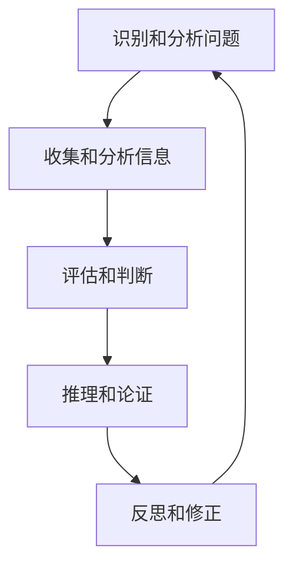

                 


### 介绍批判性思维的重要性

在信息过载的时代，我们被海量信息所包围，仿佛生活在数据的海洋中。无论是新闻、社交媒体、电子邮件还是广告，信息以各种形式充斥着我们的日常生活。然而，这些信息并非全部都有价值，甚至有些信息可能是误导性的。在这个背景下，批判性思维成为了我们寻找智慧的重要工具。

批判性思维是一种理性分析和评价信息的思考方式。它不仅仅是接受信息，更重要的是质疑信息、评估证据、分析论点，并形成独立的判断。批判性思维有助于我们辨别真伪，理解复杂问题，做出明智的决策。

首先，批判性思维能够帮助我们筛选信息。在信息过载的时代，我们无法处理所有的信息。通过批判性思维，我们可以识别出哪些信息是有用的，哪些信息是无关紧要的，甚至哪些信息是有害的。这样，我们才能将精力集中在最重要的信息上，从而提高工作效率。

其次，批判性思维能够提高我们的判断力。在面对复杂问题时，批判性思维能够帮助我们分析各种可能的解决方案，评估它们的优缺点，并选择最佳的方案。这种能力在任何领域都是非常重要的，无论是在个人生活中，还是在工作中。

最后，批判性思维能够促进我们的个人成长。通过不断地质疑和思考，我们能够更深入地理解世界，拓宽我们的知识面。这种深入的思考有助于我们形成独立的思想，培养我们的创造力，并提高我们的解决问题的能力。

总之，批判性思维是我们在信息过载时代的重要武器。它不仅能够帮助我们筛选信息，提高判断力，还能促进我们的个人成长。因此，培养批判性思维能力至关重要。在接下来的章节中，我们将详细探讨批判性思维的核心概念、方法，以及如何在各个领域应用它。

---

## 引言

### 信息过载现象及其影响

信息过载是指信息量过多，以至于我们无法有效处理或理解所有的信息。在现代社会，信息过载已经成为一个普遍现象。随着互联网和社交媒体的普及，我们每天都能接触到大量的信息。例如，平均每天接收到的电子邮件数量超过100封，社交媒体上的消息更是数不胜数。这些信息不仅来自个人通信，还包括新闻、广告、社交媒体帖子等。

信息过载对我们的生活产生了深远的影响。首先，它导致了我们的注意力分散。在处理大量信息的同时，我们很难集中精力完成一项任务。这种分散的注意力影响了我们的工作效率和生产力。其次，信息过载增加了我们的认知负担。我们需要不断地处理和评估这些信息，这要求我们的大脑进行大量的认知活动。长时间处于这种状态会导致大脑疲劳，影响我们的身心健康。此外，信息过载还可能导致我们陷入焦虑和恐慌。面对海量的信息，我们可能会感到不知所措，担心错过重要的信息，这进一步加剧了我们的焦虑感。

### 批判性思维的定义和重要性

批判性思维是一种理性的、系统的思考方式，它涉及到对信息的质疑、分析和评估。它不仅仅是对信息的接受，而是要求我们对信息进行深入思考，辨别其真伪，理解其背后的逻辑和意图。批判性思维的核心是质疑和反思，它要求我们在面对信息时，不仅仅接受表面的陈述，而是要深入探究其背后的假设、证据和论点。

批判性思维在信息过载时代的重要性不言而喻。首先，它能够帮助我们筛选信息。在信息过载的环境中，我们无法处理所有的信息。通过批判性思维，我们可以识别出哪些信息是有价值的，哪些是无关紧要的，甚至哪些是误导性的。这样，我们才能将精力集中在最重要的信息上，从而提高我们的工作效率和生活质量。

其次，批判性思维能够提高我们的判断力。在面对复杂问题时，批判性思维能够帮助我们分析各种可能的解决方案，评估它们的优缺点，并选择最佳的方案。这种能力在任何领域都是非常重要的，无论是在个人生活中，还是在工作中。

最后，批判性思维能够促进我们的个人成长。通过不断地质疑和思考，我们能够更深入地理解世界，拓宽我们的知识面。这种深入的思考有助于我们形成独立的思想，培养我们的创造力，并提高我们的解决问题的能力。

总之，批判性思维是我们在信息过载时代的重要武器。它不仅能够帮助我们筛选信息，提高判断力，还能促进我们的个人成长。因此，培养批判性思维能力至关重要。在接下来的章节中，我们将详细探讨批判性思维的核心概念、方法，以及如何在各个领域应用它。

## 第1章：批判性思维概述

### 批判性思维的定义

批判性思维（Critical Thinking）是一种理性的、系统的思考方式，它要求我们对信息进行深入的质疑、分析和评估。这种思维方式不仅仅是接受信息，而是要求我们深入探究信息的真实性和可靠性，理解其背后的逻辑和意图。

批判性思维的核心是质疑和反思。它涉及到对信息的来源、证据、假设、论点和结论进行系统性的分析和评估。通过批判性思维，我们可以辨别信息的真伪，理解复杂问题，做出明智的决策。

### 批判性思维与创造性思维的关系

批判性思维和创造性思维是两种不同的思维方式，但它们又是相辅相成的。批判性思维侧重于对已有信息的分析和评估，而创造性思维则侧重于产生新的想法和解决方案。

批判性思维为创造性思维提供了基础。通过对已有信息的批判性分析，我们可以识别出问题所在，发现新的需求或机会。而创造性思维则能够在此基础上，提出新的解决方案或创新的想法。

### 批判性思维的组成部分

批判性思维包括以下几个关键组成部分：

1. **识别和分析问题**：批判性思维的第一步是识别和分析问题。这涉及到理解问题的本质，明确问题的范围和目标。

2. **收集和分析信息**：在明确问题后，我们需要收集和分析相关信息。这包括查找可靠的资料、评估证据的可靠性和有效性。

3. **评估和判断**：在收集到足够的信息后，我们需要对信息进行评估和判断。这涉及到分析信息的逻辑性、一致性、相关性，并形成独立的判断。

4. **推理和论证**：批判性思维还包括推理和论证。通过逻辑推理，我们可以将信息串联起来，形成合理的结论。论证则是通过合理的逻辑和证据，支持我们的结论。

5. **反思和修正**：批判性思维不仅仅是得出结论，更重要的是不断反思和修正。在形成结论后，我们需要对结论进行反思，看看是否存在漏洞或不足之处，并进行相应的修正。

### 批判性思维的核心原则

批判性思维的核心原则包括以下几个方面：

1. **质疑和反思**：批判性思维要求我们不断地质疑和反思，不轻易接受表面的陈述，而是深入探究其背后的假设和逻辑。

2. **客观性和公正性**：在批判性思维中，我们需要保持客观和公正，不受个人偏见和情感的影响。

3. **全面性和系统性**：批判性思维要求我们对信息进行全面的、系统性的分析，不仅要考虑表面的信息，还要考虑潜在的因素和影响。

4. **逻辑性和一致性**：批判性思维强调逻辑性和一致性，要求我们的思考过程和结论都是合理和连贯的。

### 质疑技巧和假设检验

批判性思维的另一个重要方面是质疑技巧和假设检验。这包括以下几个步骤：

1. **提出假设**：在分析问题时，我们需要提出一个或多个假设。

2. **收集证据**：为了验证假设，我们需要收集相关的证据。

3. **分析证据**：在收集到证据后，我们需要对证据进行分析，判断其是否支持或反驳我们的假设。

4. **得出结论**：在分析证据后，我们可以根据证据得出结论。

5. **验证结论**：最后，我们需要对结论进行验证，确保结论的可靠性。

通过这些步骤，我们可以更系统地、理性地思考问题，从而提高我们的批判性思维能力。

### LaTeX公式：批判性思维的逻辑框架

为了更好地理解批判性思维的逻辑框架，我们可以使用LaTeX来展示其核心公式和概念。

以下是一个示例：

$$
\text{批判性思维} = \left( \text{质疑和反思} \right) + \left( \text{客观性和公正性} \right) + \left( \text{全面性和系统性} \right) + \left( \text{逻辑性和一致性} \right)
$$

此外，我们还可以使用LaTeX来展示推理和论证的过程：

$$
\text{论证} = \left( \text{前提} \right) \wedge \left( \text{逻辑推理规则} \right) \Rightarrow \left( \text{结论} \right)
$$

通过这些公式和概念，我们可以更清晰地理解批判性思维的核心原则和方法。

### Mermaid流程图：批判性思维的核心概念与联系

为了更好地展示批判性思维的核心概念和它们之间的联系，我们可以使用Mermaid流程图来绘制。

以下是一个示例：



这个流程图展示了批判性思维的核心步骤，以及它们之间的循环关系。通过这种图示，我们可以更直观地理解批判性思维的运作过程。

### 核心算法原理讲解

为了详细阐述批判性思维的核心算法原理，我们可以使用伪代码来展示。

以下是一个示例：

```python
# 批判性思维伪代码

# 输入：问题P，信息I
# 输出：结论C

# 步骤1：识别和分析问题
def identify_and_analyze_problem(P):
    # 分析问题的本质，明确问题的范围和目标
    return problem_analysis

# 步骤2：收集和分析信息
def collect_and_analyze_information(I):
    # 查找可靠的资料，评估证据的可靠性和有效性
    return analyzed_info

# 步骤3：评估和判断
def evaluate_and_judge(analyzed_info):
    # 分析信息的逻辑性、一致性、相关性，并形成独立的判断
    return judgment

# 步骤4：推理和论证
def reason_and_ARGUMENT(judgment):
    # 通过逻辑推理，形成合理的结论
    return conclusion

# 步骤5：反思和修正
def reflect_and_modify(conclusion):
    # 对结论进行反思，检查是否存在漏洞或不足之处，并进行修正
    return final_conclusion

# 主程序
P = input_problem()
I = input_information()

problem_analysis = identify_and_analyze_problem(P)
analyzed_info = collect_and_analyze_information(I)
judgment = evaluate_and_judge(analyzed_info)
conclusion = reason_and_ARGUMENT(judgment)
final_conclusion = reflect_and_modify(conclusion)

print("结论：", final_conclusion)
```

通过这个伪代码，我们可以看到批判性思维的核心步骤和流程。每个步骤都有明确的输入和输出，从而实现了一个系统的、可操作的思考过程。

### 数学模型和公式

在批判性思维中，数学模型和公式可以用来表示逻辑关系和推理过程。以下是一些常用的数学模型和公式：

1. **逻辑运算符**

   - 与运算符（AND）：\( A \wedge B \)
   - 或运算符（OR）：\( A \vee B \)
   - 非运算符（NOT）：\( \neg A \)

2. **推理规则**

   - 演绎推理（Deductive Reasoning）：\( P \Rightarrow Q \)
   - 归纳推理（Inductive Reasoning）：\( P \Leftarrow Q \)

3. **论证方法**

   - 直接论证（Direct Proof）：\( P \Rightarrow Q \)
   - 反证法（Proof by Contradiction）：\( \neg P \Rightarrow Q \)

以下是使用LaTeX格式展示的数学模型和公式：

$$
\text{前提} = P \\
\text{结论} = Q \\
\text{演绎推理} = P \Rightarrow Q \\
\text{归纳推理} = P \Leftarrow Q \\
\text{逻辑运算符} = A \wedge B, A \vee B, \neg A \\
\text{论证方法} = P \Rightarrow Q, \neg P \Rightarrow Q
$$

通过这些数学模型和公式，我们可以更精确地表示批判性思维中的逻辑关系和推理过程。

### 举例说明

为了更好地理解批判性思维的数学模型和公式，我们可以通过具体的例子来讲解。

#### 例子1：逻辑运算符

假设我们有两个陈述：A（今天下雨）和B（地面湿）。我们可以使用逻辑运算符来表示这两个陈述之间的关系。

- 与运算符（AND）：如果A和B都为真，则A ∧ B为真。

  $$ A: \text{今天下雨} \quad B: \text{地面湿} \\
  A \wedge B: \text{今天下雨且地面湿} $$

- 或运算符（OR）：如果A或B为真，则A ∨ B为真。

  $$ A: \text{今天下雨} \quad B: \text{地面湿} \\
  A \vee B: \text{今天下雨或地面湿} $$

- 非运算符（NOT）：如果A为真，则¬A为假。

  $$ A: \text{今天下雨} \\
  \neg A: \text{今天不下雨} $$

#### 例子2：推理规则

假设我们有以下前提和结论：

- 前提1（P）：所有的人都会死亡。
- 前提2（Q）：苏格拉底是人。

我们需要使用推理规则来证明结论（R）：苏格拉底会死亡。

- 演绎推理：从前提1和前提2，我们可以使用演绎推理得出结论。

  $$ P: \text{所有的人都会死亡} \\
  Q: \text{苏格拉底是人} \\
  R: \text{苏格拉底会死亡} \\
  \text{演绎推理}: P \Rightarrow Q \Rightarrow R $$

- 归纳推理：从多个实例推断出一般性结论。

  $$ P_1: \text{苏格拉底会死亡} \\
  P_2: \text{亚里士多德会死亡} \\
  ... \\
  P_n: \text{每个人都会死亡} \\
  \text{归纳推理}: P_1 \Leftarrow P_2 \Leftarrow ... \Leftarrow P_n \\
  R: \text{每个人都会死亡} $$

通过这些例子，我们可以看到批判性思维中的数学模型和公式如何帮助我们理解和推理复杂的逻辑关系。

### 批判性思维在项目实战中的应用

#### 项目一：分析新闻报道

在项目一中，我们将运用批判性思维来分析新闻报道，识别潜在的偏见和误导性信息。

**步骤1：识别和分析问题**

问题：某新闻报道声称“新冠疫苗接种率低的地区疫情反弹严重”。

**步骤2：收集和分析信息**

- 收集多方面的数据，包括疫苗接种率、感染率、死亡率等。
- 分析数据来源的可靠性，确保数据的真实性。

**步骤3：评估和判断**

- 评估新闻报道的论点是否基于可靠的数据。
- 分析报道中可能存在的偏见，如选择性报道或夸大事实。

**步骤4：推理和论证**

- 使用逻辑推理来评估报道的结论是否合理。
- 论证疫苗接种率低与疫情反弹之间的关系。

**步骤5：反思和修正**

- 对论证过程进行反思，检查是否存在逻辑漏洞。
- 根据新的证据和信息，修正结论。

**结论**

通过批判性思维的分析，我们得出结论：虽然疫苗接种率低的地区疫情反弹的可能性较高，但不能单纯归因于疫苗接种率低。还需考虑其他因素，如人口密度、医疗资源等。

#### 项目二：评估研究论文

在项目二中，我们将批判性思维应用于评估研究论文的可靠性。

**步骤1：识别和分析问题**

问题：某研究论文声称“新冠病毒起源于实验室”。

**步骤2：收集和分析信息**

- 收集多篇相关的研究论文和数据。
- 分析论文的方法论、数据分析和结论。

**步骤3：评估和判断**

- 评估论文的数据来源和方法是否可靠。
- 判断论文的结论是否基于充分的数据和合理的逻辑。

**步骤4：推理和论证**

- 使用逻辑推理来评估论文的论点是否成立。
- 论证不同观点之间的差异和共同点。

**步骤5：反思和修正**

- 对论证过程进行反思，检查是否存在偏见或逻辑漏洞。
- 根据新的证据和信息，修正结论。

**结论**

通过批判性思维的分析，我们得出结论：虽然存在关于新冠病毒起源的争议，但没有确凿证据表明病毒起源于实验室。这一结论基于现有的科学证据和逻辑推理。

### 总结

通过以上项目实战，我们可以看到批判性思维在处理复杂信息和分析论证中的应用。批判性思维不仅帮助我们识别潜在的偏见和误导性信息，还能提高我们的判断力和决策能力。在信息过载的时代，培养批判性思维能力至关重要。

### 批判性思维的障碍和克服策略

批判性思维的实践并非一帆风顺，我们在运用过程中可能会遇到各种障碍。以下是一些常见的批判性思维障碍及其克服策略：

#### 1. 习惯性思维定势

**障碍**：人们在长期的学习和生活中会形成固定的思维模式，习惯于接受已有的知识和观点，难以接受新异的信息。

**克服策略**：培养开放的心态，对已有知识和观点进行定期回顾和反思，勇于接受新的观点和挑战。可以通过阅读不同领域的书籍、参加跨学科讨论等方式，拓宽视野，打破思维定势。

#### 2. 情感影响

**障碍**：人们在面对与自己情感相关的问题时，容易受到情绪的影响，从而影响批判性思维的客观性。

**克服策略**：学会情绪管理，保持冷静和客观。在处理问题时，尝试从一个中立的视角出发，避免过度依赖情感。可以采用冥想、呼吸练习等方法来缓解情绪压力。

#### 3. 信息过载

**障碍**：在信息过载的环境中，人们往往感到无所适从，难以有效筛选和处理大量的信息。

**克服策略**：学会信息管理技巧，如制定阅读计划、使用信息过滤工具等。通过有效的时间管理和信息筛选，提高处理信息的效率。此外，可以培养批判性思维的习惯，对信息进行深入的质疑和分析。

#### 4. 偏见和成见

**障碍**：人们往往会根据个人的偏见和成见来判断信息，导致批判性思维的结果偏离事实。

**克服策略**：提高自我意识，识别并反思自己的偏见和成见。通过多角度、多方面的信息来源，进行全面的评估和分析，避免单一视角的偏见。可以尝试与不同观点的人进行交流，拓宽思路。

#### 5. 过度自信

**障碍**：过度自信可能导致人们在批判性思维过程中忽视其他观点，固执己见。

**克服策略**：保持谦逊和开放的态度，承认自己的局限性和不足。在批判性思维过程中，不断反思和修正自己的观点，接受他人的反馈和建议。

通过以上策略，我们可以克服批判性思维过程中常见的障碍，提高批判性思维的效能，从而在信息过载的时代中更好地寻找智慧。

### 批判性思维对个人和社会的影响

批判性思维不仅对个人的成长和发展有着深远的影响，也对整个社会产生了重要的积极作用。

#### 对个人成长的影响

1. **提高判断力**：批判性思维能够帮助个人在面对复杂问题和多角度信息时，做出更为明智和合理的判断。通过深入分析和评估信息，个人能够识别出真相和谬误，从而避免被误导。

2. **培养创造力**：批判性思维不仅要求我们接受现有的知识和观点，还鼓励我们质疑和创新。通过不断的反思和挑战，个人能够激发创造力，提出新的想法和解决方案。

3. **增强问题解决能力**：在面对问题和挑战时，批判性思维能够帮助我们系统地分析问题，识别出关键因素，并提出有效的解决方案。这种能力在任何领域都是至关重要的。

4. **促进个人成长**：批判性思维能够帮助个人更深入地理解世界，拓宽知识面。通过质疑和思考，个人能够形成独立的思想，增强自我意识，促进个人成长。

#### 对社会的影响

1. **提高公共决策质量**：在政治和社会领域，批判性思维能够帮助决策者更全面地评估政策的影响，识别潜在的风险和问题。通过理性的分析和评估，决策者能够做出更为明智和公正的决策。

2. **增强社会共识**：批判性思维能够促进公众对重要议题的深入理解和讨论，从而增强社会共识。通过理性对话和讨论，不同观点的人能够相互理解和尊重，找到共同点，推动社会的和谐发展。

3. **提高媒体素养**：在媒体和信息传播领域，批判性思维能够帮助公众辨别信息的真伪，避免被误导。通过批判性思维，公众能够更理性地对待媒体内容，增强媒体素养。

4. **促进社会进步**：批判性思维能够激发社会的创新和进步。通过质疑现有的规则和制度，批判性思维能够推动社会改革，促进科技进步和社会发展。

总之，批判性思维对个人和社会都有着重要的意义。它不仅能够提高个人的判断力、创造力和问题解决能力，还能够促进社会的理性发展和进步。在信息过载的时代，培养批判性思维能力已经成为每个人都应该关注的重要课题。

### 批判性思维的长期影响

批判性思维作为一种重要的思维能力，不仅在短期内对个人的判断力、创造力和社会参与产生积极影响，还具有长期而深远的影响。首先，批判性思维的培养能够帮助个人形成持续学习的习惯。通过批判性思维，人们能够不断质疑和反思现有的知识体系，从而激发对知识的渴望，主动寻求新的学习资源，保持知识的更新和迭代。这种持续学习的能力在快速发展的信息时代尤为重要。

其次，批判性思维能够提高个人的适应能力。在面对复杂多变的环境时，批判性思维能够帮助个人迅速分析形势，辨别信息的真实性和相关性，从而做出适应性的决策。这种能力不仅适用于个人生活，也对职业生涯有着显著的促进作用。在不断变化的职场环境中，具备批判性思维的人能够更好地应对挑战，抓住机遇，实现职业成长。

此外，批判性思维的长期影响还体现在其对社会结构的优化上。在社会层面，批判性思维能够促进公民的理性参与和公共决策的透明化。通过批判性思维，公众能够更加理性地对待社会问题，提出建设性的意见和解决方案。这种理性参与能够提高社会的整体决策质量，推动社会的公平和公正。

最后，批判性思维还能够培养社会的创新精神。在一个充满批判性思维的氛围中，人们更加倾向于质疑现有的规则和制度，提出创新的想法和方案。这种创新精神能够推动社会的进步，促进科技的快速发展，从而带来新的经济增长点。

总之，批判性思维的长期影响是多方面的，它不仅能够提升个人的知识和能力，还能够优化社会结构和促进社会进步。在信息过载的时代，培养批判性思维能力已成为个人和社会发展的关键。

### 批判性思维的教育应用

批判性思维的教育应用对于学生的全面发展具有重要意义。在学术领域，批判性思维能够帮助学生更深入地理解课程内容，培养独立思考和解决问题的能力。以下是一些具体的教育应用：

#### 1. 教学方法的变革

在传统教学中，教师通常扮演知识传递者的角色，而学生被动接受知识。然而，通过批判性思维的培养，教师可以转变为引导者和促进者，鼓励学生主动探索和质疑。例如，在历史课上，教师可以提供多个不同的历史观点，引导学生通过批判性思维分析这些观点的合理性和局限性，从而形成自己的见解。

#### 2. 提高学术研究能力

批判性思维在学术研究中的重要性不言而喻。通过批判性思维，学生能够更准确地识别研究问题，收集和分析数据，评估研究方法的有效性，并提出有见地的结论。例如，在科学实验中，学生可以通过批判性思维来评估实验设计的合理性，识别潜在的错误和偏差，从而提高研究的质量。

#### 3. 培养批判性阅读和写作能力

批判性阅读和写作是批判性思维的重要应用领域。在阅读过程中，学生需要分析文本的结构、论点和证据，判断其逻辑性和可靠性。通过批判性写作，学生能够更好地表达自己的观点，论证论点，并接受他人的反馈和改进。例如，在写作学术论文时，学生可以通过批判性思维来评估文献综述的全面性和深度，确保自己的研究具有学术价值。

#### 4. 激发创新思维

批判性思维能够激发学生的创新思维。在解决复杂问题时，学生需要跳出传统的思维框架，从多个角度思考问题，提出创新的解决方案。例如，在解决数学难题时，学生可以通过批判性思维来分析不同的解题方法，评估其优缺点，从而找到最优解。

#### 5. 培养批判性思维能力的教学策略

- **项目式学习**：通过项目式学习，学生可以在实际情境中应用批判性思维，解决真实的问题。例如，在环保项目中，学生需要通过批判性思维来评估不同环保措施的可行性，提出有效的解决方案。
- **小组讨论**：小组讨论能够促进学生之间的互动和思维碰撞，通过批判性思维来共同探讨问题。例如，在哲学课堂上，学生可以通过小组讨论来分析不同的伦理观点，形成自己的见解。
- **问题解决训练**：通过问题解决训练，学生可以练习如何应用批判性思维来分析和解决问题。例如，在数学课堂上，教师可以设计一系列复杂的问题，引导学生通过批判性思维逐步解决。

总之，批判性思维的教育应用能够显著提升学生的学术研究能力、批判性阅读和写作能力，以及创新思维能力。通过多种教学策略，教师可以有效地培养学生的批判性思维，为他们的未来发展奠定坚实的基础。

### 批判性思维在职业发展和决策中的应用

在职业发展和日常决策中，批判性思维扮演着至关重要的角色。它不仅帮助个人做出更明智的选择，还能提高决策的质量和效率。

#### 1. 职业发展中的批判性思维

在职业生涯中，批判性思维能够帮助个人更准确地评估自己的优势和劣势，识别职业发展的机会和挑战。以下是一些具体的应用：

- **职业规划**：通过批判性思维，个人可以深入分析自己的职业兴趣、技能和目标，制定出更具可行性的职业规划。例如，在考虑转行时，个人可以通过批判性思维评估新职业的就业前景、发展空间和个人适应能力，从而做出明智的决策。

- **绩效评估**：在职场中，批判性思维能够帮助个人更客观地评估自己的工作表现。通过对工作成果、挑战和改进点的分析，个人可以识别出提升绩效的方法，并制定相应的改进计划。

- **团队合作**：批判性思维有助于个人在团队合作中提出建设性的意见和建议，识别团队中的问题和潜在的风险。例如，在项目会议中，通过批判性思维，团队成员可以共同分析项目的进展、风险和资源需求，从而提高项目的成功概率。

- **领导力培养**：批判性思维是领导者必备的能力。通过批判性思维，领导者能够更深入地理解团队的需求和期望，识别团队中的问题和挑战，并制定有效的解决方案。例如，在危机管理中，领导者需要通过批判性思维快速分析形势，制定应对策略，确保团队的安全和稳定。

#### 2. 决策中的批判性思维

在日常决策中，批判性思维能够帮助个人更全面地评估信息的真实性和可靠性，减少决策失误。以下是一些关键步骤：

- **问题识别**：首先，明确需要决策的问题。通过批判性思维，个人可以深入分析问题的本质，识别出关键因素和潜在的影响。

- **信息收集**：在明确了问题后，个人需要收集相关信息。批判性思维要求个人不仅要收集正面的信息，还要收集负面的信息，从而形成全面的信息视图。

- **信息分析**：在收集到信息后，个人需要通过批判性思维对这些信息进行深入分析。这包括评估信息的可靠性、相关性、一致性和逻辑性。

- **方案评估**：在分析信息后，个人需要评估不同的解决方案。通过批判性思维，个人可以分析每个方案的优缺点，识别出最佳方案。

- **决策制定**：最后，根据评估结果，个人可以制定出决策。批判性思维能够帮助个人减少决策过程中的偏见和情感影响，做出更为理性、客观的决策。

- **决策验证**：在决策后，个人需要验证决策的有效性。通过批判性思维，个人可以反思决策的过程和结果，识别出潜在的改进空间，为未来的决策提供参考。

总之，批判性思维在职业发展和决策中具有重要的应用价值。通过批判性思维，个人可以更准确地评估自己的优势和劣势，识别职业发展的机会和挑战，并在日常决策中做出更为明智、合理的决策。

### 个人生活中的批判性思维

在个人生活中，批判性思维同样扮演着重要的角色。它不仅能帮助我们更好地理解世界，还能提高我们的生活质量。以下是一些具体的应用：

#### 1. 健康管理

批判性思维在健康管理中的应用尤为显著。通过批判性思维，我们可以更理性地评估健康信息，避免盲目跟风。例如，在了解某种健康疗法时，我们可以通过批判性思维评估该疗法的科学性和有效性，从而做出明智的选择。此外，批判性思维还能帮助我们制定个性化的健康管理计划，根据自身情况和需求进行调整。

#### 2. 财务规划

财务规划是个人生活中的一项重要任务。通过批判性思维，我们可以更深入地分析财务状况，制定合理的预算和投资计划。例如，在购买理财产品时，我们可以通过批判性思维评估产品的风险和收益，选择最适合自己的投资方案。此外，批判性思维还能帮助我们识别潜在的财务风险，提前做好预防措施。

#### 3. 教育规划

批判性思维在教育规划中的应用同样广泛。通过批判性思维，我们可以更理性地评估教育选择，根据孩子的兴趣和发展需求制定合适的教育计划。例如，在为孩子选择学校时，我们可以通过批判性思维分析不同学校的优势与不足，选择最适合孩子的教育环境。此外，批判性思维还能帮助我们培养孩子的独立思考能力和解决问题的能力，为他们的未来奠定坚实的基础。

#### 4. 社交互动

批判性思维在社交互动中的应用可以帮助我们更好地理解和处理人际关系。通过批判性思维，我们可以更客观地评估他人的观点和行为，避免被情绪和偏见所影响。例如，在处理冲突时，我们可以通过批判性思维分析冲突的根源，寻找合理的解决方法。此外，批判性思维还能帮助我们更好地理解和尊重他人的观点，促进有效沟通和合作。

#### 5. 自我反思

批判性思维在自我反思中的应用可以帮助我们更深入地了解自己，识别自身的优势和不足，从而不断改进和成长。通过批判性思维，我们可以反思自己的行为和决策，识别出错误和不足，制定改进计划。例如，在职场中，我们可以通过批判性思维反思自己的工作表现，找到提升工作效率和绩效的方法。

总之，批判性思维在个人生活中的应用是多方面的。它不仅能帮助我们更理性地管理健康、财务和教育，还能提升社交互动的质量，促进自我成长。通过批判性思维，我们能够更好地应对生活中的各种挑战，提高生活质量。

### 实际案例：批判性思维在决策中的应用

批判性思维在现实生活中的应用无处不在，以下通过几个具体案例，详细讲解如何运用批判性思维进行决策。

#### 案例一：健康决策

**问题背景**：小明最近感到身体疲惫，经常感到头痛和失眠。他决定去看医生，但面对多种治疗方案，他感到困惑。

**批判性思维应用**：

1. **识别和分析问题**：小明首先明确了问题的本质，即身体健康状况不佳。他分析了自己的生活习惯、工作压力以及饮食情况。

2. **收集和分析信息**：小明通过查阅医学文献和咨询医生，收集了关于头痛和失眠的各种治疗方案，包括药物治疗、生活方式调整和中医治疗。

3. **评估和判断**：小明对比了不同治疗方案的有效性和副作用。他评估了医生的专业意见，结合自己的实际情况，判断哪种方案最适合自己的需求。

4. **推理和论证**：小明通过逻辑推理，认为生活方式调整可能是最根本的解决方案，而药物治疗则可以作为辅助手段。他决定首先尝试调整生活方式，如果效果不佳再考虑药物治疗。

5. **反思和修正**：在实施方案后，小明定期反思自己的生活方式调整效果，并随时调整计划。他发现通过改善饮食和增加运动，头痛和失眠有所改善，于是继续坚持这一方案。

**结论**：通过批判性思维的运用，小明做出了明智的决策，改善了身体状况。

#### 案例二：职业决策

**问题背景**：李华在职业发展上感到迷茫，他在两个不同行业的工作机会之间犹豫不决。

**批判性思维应用**：

1. **识别和分析问题**：李华分析了两个行业的发展前景、薪资水平、工作环境和自身兴趣。

2. **收集和分析信息**：他收集了相关行业的职业发展资料，咨询了在该领域工作的朋友和专业人士。

3. **评估和判断**：李华比较了两个行业的优势和劣势，考虑了职业发展的长远性和个人的职业兴趣。

4. **推理和论证**：李华通过批判性思维分析，认为长期来看，他更倾向于选择与自己兴趣相符的行业，尽管短期内薪资可能较低。

5. **反思和修正**：在做出决策后，李华定期反思职业选择的合理性，并在遇到问题时及时调整。

**结论**：通过批判性思维的应用，李华选择了适合自己的职业道路，获得了职业上的满足感和成就感。

#### 案例三：投资决策

**问题背景**：张先生计划投资一笔资金，但他面对多种投资产品，不确定哪种产品最适合自己。

**批判性思维应用**：

1. **识别和分析问题**：张先生明确了投资的目标，即实现资产的保值增值。

2. **收集和分析信息**：他研究了各种投资产品的特点、风险和收益预期。

3. **评估和判断**：张先生通过评估自己的风险承受能力和投资期限，选择了适合的投资产品。

4. **推理和论证**：他运用批判性思维分析了投资产品的市场趋势和潜在风险，做出了理性的投资决策。

5. **反思和修正**：张先生定期检查投资表现，根据市场变化调整投资策略。

**结论**：通过批判性思维的运用，张先生成功地实现了投资目标，获得了稳定的投资回报。

通过这些案例，我们可以看到批判性思维在决策中的应用是如何帮助我们识别问题、收集信息、评估选项、推理论证并反思修正。这种系统化的思考方式能够提高决策的质量，帮助我们做出更明智的选择。

### 批判性思维的障碍与克服策略

尽管批判性思维是一种强大的工具，但在实际运用中，我们可能会遇到一些障碍。以下是一些常见的批判性思维障碍及其克服策略：

#### 1. 个人偏见和成见

**障碍**：个人偏见和成见会导致我们在评估信息时产生先入为主的观念，影响批判性思维的客观性。

**克服策略**：提高自我意识，定期反思自己的偏见和成见。可以通过阅读不同观点的资料、参与跨学科的讨论来拓宽视野，减少偏见的影响。

#### 2. 信息过载

**障碍**：在信息过载的环境中，我们可能难以处理和评估大量的信息，导致批判性思维的效果降低。

**克服策略**：培养信息筛选能力，学会有效地管理信息。通过制定阅读计划、使用信息过滤工具等方法，提高信息处理的效率。

#### 3. 过度自信

**障碍**：过度自信可能导致我们在批判性思维过程中忽视其他观点，固执己见。

**克服策略**：保持谦逊和开放的心态，承认自己的局限性和不足。在批判性思维过程中，不断反思和修正自己的观点，接受他人的反馈和建议。

#### 4. 缺乏经验

**障碍**：缺乏批判性思维的实践经验可能导致我们在面对复杂问题时无从下手。

**克服策略**：通过实践和训练来提高批判性思维能力。可以从简单的案例入手，逐步挑战更复杂的情境。同时，可以寻求指导或参与批判性思维的培训课程。

#### 5. 缺乏时间

**障碍**：在忙碌的生活中，我们可能没有足够的时间进行深入的批判性思考。

**克服策略**：培养时间管理能力，合理安排时间进行批判性思考。可以通过设定专门的时间段来练习批判性思维，提高效率。

通过以上策略，我们可以有效地克服批判性思维过程中的障碍，提高批判性思维的效能。

### 批判性思维的最佳实践 tips

1. **保持好奇心**：对未知保持好奇心，主动探索和质疑，这有助于激发批判性思维的活力。
2. **多角度思考**：尝试从不同角度分析问题，避免单一视角的偏见。
3. **记录与反思**：在思考过程中记录下自己的想法和观点，定期进行反思和修正。
4. **学会提问**：培养提问技巧，通过提出有力的问题来深入探讨问题。
5. **逻辑推理**：练习逻辑推理，确保思考过程的合理性和连贯性。
6. **信息验证**：对收集的信息进行验证，确保其真实性和可靠性。
7. **持续学习**：批判性思维是一种持续的过程，不断学习新知识和技能，以提升思维品质。

### 小结

在信息过载的时代，培养批判性思维能力显得尤为重要。通过批判性思维，我们能够筛选信息、提高判断力、促进个人成长，并在各个领域取得更好的成果。本文详细介绍了批判性思维的核心概念、方法、应用以及克服障碍的策略。我们鼓励读者在日常生活中不断练习和运用批判性思维，以应对复杂多变的环境，实现个人和社会的发展。

### 注意事项

1. **避免情绪化**：在批判性思维过程中，尽量保持冷静和客观，避免情绪的影响。
2. **保持开放性**：对待新观点和意见保持开放的态度，不断拓宽视野。
3. **持续反思**：定期对自己的思考过程和结论进行反思，确保思维的准确性和有效性。

### 拓展阅读

1. 《批判性思维：工具与应用》（M. Paul B. Johnson）
2. 《如何阅读一本书》（Mortimer J. Adler）
3. 《思考，快与慢》（丹尼尔·卡尼曼）
4. 《逻辑学导论》（Douglas B. Ray）
5. 《批判性思维技巧》（Richard Paul & Linda Elder）

参考文献：

1. Johnson, M. P. B. (2018). Critical Thinking: Tools for Taking Charge of Your Learning and Your Life. Pearson.
2. Adler, M. J. (1940). How to Read a Book: The Classic Guide to Intelligent Reading. Penguin Books.
3. Kahneman, D. (2011). Thinking, Fast and Slow. Farrar, Straus and Giroux.
4. Ray, D. B. (2016). Logic: A Brief Introduction. W. W. Norton & Company.
5. Paul, R., & Elder, L. (2009). The Thinker's Guide to Critical and Creative Thinking. The Foundation for Critical Thinking.

