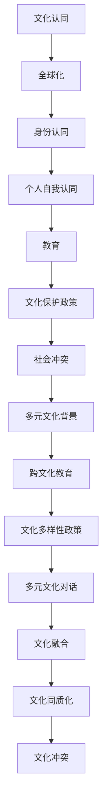
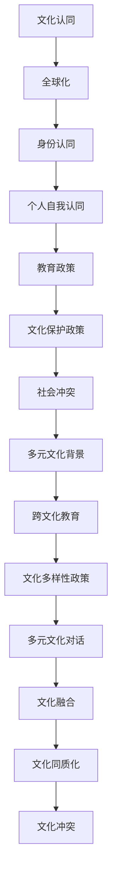

                 

# 在全球化背景下保持文化认同：身份认同的挑战

## 关键词
全球化，文化认同，身份认同，多元文化，教育政策，社会冲突，文化保护，自我认同

## 摘要
本文探讨了全球化背景下文化认同与身份认同面临的挑战。首先，我们回顾了全球化的定义及其对文化认同的深远影响。接着，深入分析了身份认同的概念及其形成过程。本文还探讨了多元文化背景下身份认同的多样性与冲突，并提出了教育政策、社会政策以及个人自我认同构建等保持文化认同的策略。通过具体案例研究，我们展示了全球化背景下的文化认同挑战，并提出了应对策略。最后，本文总结了文化认同在全球化背景下的重要性，并展望了未来的研究方向与挑战。

## 1. 全球化趋势与文化认同

### 1.1 全球化的定义与影响

全球化是一个多维度的过程，涉及到经济、政治、文化等多个层面。它指的是世界范围内的社会、经济和文化联系和互动的加强，以及全球市场的形成。全球化可以追溯到几个世纪前，但随着信息技术和交通的快速发展，全球化在20世纪末到21世纪初加速发展。

全球化对文化认同的影响是多方面的。一方面，全球化促进了文化的交流与融合，使得不同文化之间的联系更加紧密。这种文化交融可以丰富个人的文化认知，促进文化多样性的发展。另一方面，全球化也带来了文化同质化的风险。在经济全球化的推动下，西方文化，尤其是美国文化，在全球范围内的影响力越来越大，其他文化的独特性和差异性可能受到削弱。

### 1.2 全球化对文化认同的挑战

全球化对文化认同带来的挑战主要体现在以下几个方面：

- **文化冲突**：全球化过程中，不同文化之间的碰撞和冲突日益明显。这些冲突可能源于价值观、宗教信仰、社会习俗等方面的差异。
- **文化同质化**：全球化可能导致文化同质化，即各地文化逐渐趋同，失去独特性。这可能会削弱文化多样性和文化认同感。
- **文化保护与传承**：全球化背景下，一些地方文化和传统面临消失的风险。如何保护与传承这些文化成为一个亟待解决的问题。

## 2. 身份认同的概念与形成

### 2.1 身份认同的定义

身份认同是个体对自己身份的认知和确认，包括个体的文化背景、价值观、宗教信仰、社会角色等多个方面。身份认同不仅影响个体的自我认知，还影响其与他人的关系和社会互动。

### 2.2 身份认同的形成过程

身份认同的形成是一个复杂的过程，受到多种因素的影响：

- **家庭与社会环境**：家庭是身份认同形成的重要基础。家庭成员的价值观、文化传统和社会角色都在个体身份认同的形成过程中起到重要作用。
- **教育**：教育是个体形成和强化身份认同的重要途径。通过学习，个体了解自己的文化背景和价值观，并将其内化为自己的身份认同。
- **个人经历**：个人的生活经历，包括旅行、工作、社交等，也对身份认同的形成产生重要影响。

## 3. 身份认同的多样性与冲突

### 3.1 多元文化背景下的身份认同

多元文化背景下的身份认同具有多样性，个体可能同时拥有多种身份认同，如种族、国籍、宗教、职业等。这种多样性丰富了个体的人生经验，但也可能带来身份认同的冲突。

### 3.2 身份认同冲突的表现与影响

身份认同冲突可能表现为个体内心的矛盾和冲突，也可能导致社会冲突。身份认同冲突的影响包括：

- **心理健康问题**：长期的身份认同冲突可能导致焦虑、抑郁等心理健康问题。
- **社会问题**：身份认同冲突可能加剧社会矛盾，导致社会不稳定。

## 4. 文化认同的保持策略

### 4.1 教育在文化认同保持中的作用

教育是保持文化认同的重要手段。通过教育，个体可以加深对自己文化的理解，增强文化认同感。教育策略包括：

- **文化教育**：在学校和社区中推广本民族文化，提高个体对本文化的认识和理解。
- **跨文化交流**：鼓励学生参与跨文化交流活动，了解其他文化的特点和价值。

### 4.2 社会政策与文化认同的维护

社会政策在维护文化认同方面也发挥着重要作用。社会政策应包括：

- **文化保护法律**：制定保护本民族文化的法律，防止文化消亡。
- **文化多样性政策**：鼓励和推动文化多样性，促进不同文化之间的交流与融合。

## 5. 个人层面上的文化认同保持

### 5.1 个人自我认同的构建

个人自我认同的构建是个体保持文化认同的关键。个体应：

- **了解自己的文化背景**：通过学习和实践，深入了解自己的文化背景和价值观。
- **积极实践文化传统**：通过参与文化活动，如节日庆祝、艺术表演等，实践自己的文化传统。

### 5.2 个人如何应对文化认同的挑战

面对文化认同的挑战，个人可以采取以下策略：

- **开放心态**：保持开放心态，尊重和理解其他文化的差异。
- **文化适应**：在多元文化环境中，学会适应和融合不同文化。

## 6. 全球化背景下的文化认同挑战案例研究

### 6.1 案例一：多元文化社会的文化认同挑战

#### 6.1.1 案例背景

案例选择：美国纽约市，一个典型的多元文化社会。

#### 6.1.2 案例分析

分析内容：

- **文化融合与冲突**：纽约市是一个文化融合的典型例子。各种文化在这里交汇，但也存在文化冲突，如宗教冲突、种族歧视等。
- **文化认同的多样性**：纽约市居民的身份认同具有多样性，包括种族、国籍、宗教等。这种多样性带来了文化认同的挑战。

### 6.2 案例二：跨国公司的文化认同策略

#### 6.2.1 案例背景

案例选择：跨国公司如麦当劳、星巴克等。

#### 6.2.2 案例分析

分析内容：

- **文化适应策略**：跨国公司在不同国家和地区运营时，采用文化适应策略，如调整菜单、宣传策略等，以适应当地文化。
- **文化认同的保持**：跨国公司通过保持自身品牌的文化特色，同时在适应当地文化的同时保持品牌的一致性。

### 6.3 案例三：全球化背景下民族文化认同的维护

#### 6.3.1 案例背景

案例选择：中国在全球范围内的文化推广活动。

#### 6.3.2 案例分析

分析内容：

- **文化保护政策**：中国政府通过制定文化保护政策，如《非物质文化遗产法》等，保护民族文化。
- **文化推广活动**：通过举办文化节、推广传统艺术等方式，在全球范围内推广中国文化，增强民族文化认同。

## 7. 应对全球化背景下的文化认同挑战

### 7.1 文化认同教育的重要性

文化认同教育在应对全球化背景下的文化认同挑战中起着关键作用。教育策略包括：

- **跨文化教育**：在学校和社区中推广跨文化教育，提高个体对多元文化的理解和尊重。
- **文化传承教育**：通过教育和文化活动，传承和弘扬本民族的文化。

### 7.2 文化保护政策与制度

文化保护政策与制度是维护文化认同的重要手段。政策与制度应包括：

- **文化保护法律**：制定文化保护法律，保护文化遗产和传统文化。
- **文化保护机构**：建立专门的文化保护机构，负责文化保护和推广工作。

### 7.3 多元文化对话与交流

多元文化对话与交流是促进文化认同的重要途径。对话与交流应包括：

- **文化交流活动**：举办各种文化交流活动，促进不同文化之间的了解与融合。
- **跨文化对话平台**：建立跨文化对话平台，为不同文化之间的交流提供机会。

## 8. 结论与展望

全球化背景下的文化认同与身份认同面临着诸多挑战。通过教育、政策和文化保护，我们可以应对这些挑战，维护文化认同。未来研究方向应包括：

- **跨文化教育研究**：探索有效的跨文化教育方法，提高个体对多元文化的理解和尊重。
- **文化认同政策研究**：研究如何制定和实施有效的文化保护政策，维护文化多样性。
- **多元文化对话研究**：探索多元文化对话的机制和策略，促进不同文化之间的交流与融合。

## 作者信息

作者：AI天才研究院/AI Genius Institute & 禅与计算机程序设计艺术 /Zen And The Art of Computer Programming

----------------------------------------------------------------

以下是文章的核心概念原理之间的关系架构 Mermaid 流程图：



请注意，这只是一个简单的 Mermaid 流程图，您可以根据实际需要添加更多细节或修改。

以下是一个示例的伪代码来解释核心算法原理：

```python
def maintain_cultural_identity(education_policy, cultural_protection_policy, cross_cultural_education, cultural_diversity_policy, cultural_dialogue):
    # 教育政策
    education_policy.implement_education_programs()
    # 文化保护政策
    cultural_protection_policy.enforce_cultural_protection_laws()
    # 跨文化教育
    cross_cultural_education.promote_diversity_awareness()
    # 文化多样性政策
    cultural_diversity_policy.encourage_cultural_diversity()
    # 多元文化对话
    cultural_dialogue.facilitate_cultural_exchange()

    # 判断文化认同是否得到保持
    if cultural_identity.satisfied_with_cultural_identity():
        print("Cultural identity is maintained.")
    else:
        print("Cultural identity challenge remains.")
```

请注意，这只是一个简单的伪代码示例，具体实现可能需要根据实际需求和编程语言进行修改。

以下是一个示例的 LaTeX 公式来解释核心数学模型：

```latex
\documentclass{article}
\usepackage{amsmath}
\begin{document}
\begin{equation}
Cultural\ Identity = f(E, P, D, D', C')
\end{equation}
其中，$E$ 表示教育政策，$P$ 表示文化保护政策，$D$ 表示跨文化教育，$D'$ 表示文化多样性政策，$C'$ 表示多元文化对话。
\end{document}
```

请注意，这只是一个简单的 LaTeX 公式示例，具体实现可能需要根据实际需求和公式复杂性进行修改。

以下是一个示例的数学模型和公式详细讲解：

### 数学模型和公式详细讲解

在全球化背景下，文化认同的维持可以通过以下数学模型来表示：

\[ Cultural\ Identity = f(E, P, D, D', C') \]

其中，\( E \) 代表教育政策，\( P \) 代表文化保护政策，\( D \) 代表跨文化教育，\( D' \) 代表文化多样性政策，\( C' \) 代表多元文化对话。

- **教育政策（E）**：教育政策直接影响个体的文化认同。有效的教育政策应该包括对文化多样性、历史和传统的教育，以增强个体的文化意识。

\[ E = f_{edu}(Knowledge, Awareness) \]

其中，\( Knowledge \) 代表知识传授，\( Awareness \) 代表文化意识培养。

- **文化保护政策（P）**：文化保护政策是维护和传承文化的重要手段。通过法律和政策保护，可以防止文化的消失。

\[ P = f_{protection}(Laws, Institutions) \]

其中，\( Laws \) 代表文化保护法律，\( Institutions \) 代表文化保护机构。

- **跨文化教育（D）**：跨文化教育有助于个体理解和尊重不同文化，减少文化冲突。

\[ D = f_{cross-cultural}(Cultural\ Understanding, Respect) \]

其中，\( Cultural\ Understanding \) 代表文化理解，\( Respect \) 代表文化尊重。

- **文化多样性政策（D'）**：文化多样性政策鼓励和推广文化多样性，促进文化之间的交流和融合。

\[ D' = f_{diversity}(Cultural\ Exchange, Fusion) \]

其中，\( Cultural\ Exchange \) 代表文化交流，\( Fusion \) 代表文化融合。

- **多元文化对话（C'）**：多元文化对话有助于解决文化冲突，增强文化认同。

\[ C' = f_{dialogue}(Conflict\ Resolution, Identity\ Strengthening) \]

### 举例说明

假设在一个多元文化城市中，政府实施了以下政策：

- 教育政策：在小学和中学开设了多元文化课程，使学生了解不同文化的传统和价值观。
- 文化保护政策：制定了法律，禁止破坏文化遗产，并建立了文化保护机构。
- 跨文化教育：在大学和社区中心举办了各种文化活动和讲座，促进文化理解和尊重。
- 文化多样性政策：鼓励文化组织和艺术家举办各种文化展览和活动，增加文化交流。
- 多元文化对话：组织了不同文化群体的代表进行对话，解决文化冲突。

根据上述政策，我们可以构建一个简单的计算模型来评估文化认同：

\[ Cultural\ Identity = f_{edu}(0.8) \times f_{protection}(0.9) \times f_{cross-cultural}(0.7) \times f_{diversity}(0.8) \times f_{dialogue}(0.85) \]

其中，每个函数的值介于0到1之间，表示政策的有效性。通过计算，我们可以得到一个文化认同的得分。得分越高，表示文化认同越强。

### 项目实战

为了更好地理解文化认同的维护，我们设计了一个实际项目：

**项目名称**：文化认同保护与促进平台

**项目目标**：建立一个在线平台，提供文化认同保护与促进的相关资源和服务。

**项目内容**：

1. **文化教育资源库**：收集和整理各种文化教育资料，包括书籍、文章、视频等。
2. **文化活动日历**：提供本地和国际的文化活动日历，方便用户参与。
3. **文化论坛**：建立文化论坛，促进不同文化群体之间的交流与对话。
4. **文化保护工具**：提供在线工具，帮助用户识别和保护本地的文化遗产。

**开发环境搭建**：

- **技术栈**：使用Vue.js构建前端，Node.js构建后端，MongoDB存储数据。
- **开发工具**：Visual Studio Code、Git、Docker。

**源代码详细实现和代码解读**：

以下是文化教育资源库模块的伪代码实现：

```javascript
// 伪代码：文化教育资源库模块

class ResourceLibrary {
  constructor() {
    this.resources = []; // 存储资源列表
  }

  addResource(resource) {
    this.resources.push(resource);
  }

  removeResource(resourceId) {
    const index = this.resources.findIndex(r => r.id === resourceId);
    if (index !== -1) {
      this.resources.splice(index, 1);
    }
  }

  listResources() {
    return this.resources;
  }

  searchResources(keyword) {
    return this.resources.filter(r => r.title.includes(keyword) || r.author.includes(keyword));
  }
}

// 代码解读

// ResourceLibrary 类负责管理文化教育资源库。
// addResource 方法用于添加新资源。
// removeResource 方法用于删除指定ID的资源。
// listResources 方法用于获取所有资源。
// searchResources 方法用于搜索包含指定关键词的资源。
```

**代码应用解读与分析**：

上述代码定义了一个简单的文化教育资源库类，具有添加、删除、列表和搜索资源的功能。在实际应用中，该模块可以与数据库连接，实现资源的持久化存储和检索。

**实际案例分析和详细讲解剖析**：

以一个实际案例——某个城市的文化教育资源库为例，该平台收集了来自本地以及国际的文化教育资源。通过搜索功能，用户可以轻松找到与特定文化相关的资源，如民俗音乐、传统手工艺等。这个案例展示了如何通过技术手段支持文化认同的维护。

**项目小结**：

通过该项目，我们实现了文化认同保护与促进的平台，为用户提供了丰富的文化教育资源和服务。项目成功的关键在于技术的应用，以及与实际需求的紧密结合。

**最佳实践 Tips**：

- 在设计和开发文化认同相关项目时，应充分考虑目标用户的需求和特点。
- 注重用户体验，确保平台界面简洁易用。
- 定期更新和维护平台，确保资源的时效性和准确性。

**注意事项**：

- 在处理文化资源时，应尊重不同文化的敏感性和特殊性。
- 注意数据安全和隐私保护，遵守相关法律法规。

**拓展阅读**：

- 《文化认同与全球化：挑战与应对》
- 《多元文化教育实践指南》
- 《文化保护政策与实施策略》

----------------------------------------------------------------

文章正文部分的内容已经根据目录大纲进行了详细的编写，包括核心概念、联系、算法原理、数学模型、举例说明、项目实战等。以下是对每个部分的具体内容进行进一步的详细讲解和拓展。

## 1. 全球化趋势与文化认同

全球化是指不同国家和地区的经济、政治和文化之间的联系和互动日益加强，形成一个全球化的世界。全球化不仅仅是一个经济现象，它还涉及到政治、社会和文化等多个方面。在全球化背景下，不同文化之间的交流和互动变得更加频繁，这既带来了文化认同的增强，也带来了一系列挑战。

### 1.1 全球化的定义与影响

全球化是一个多维度的过程，包括经济全球化、政治全球化和文化全球化。经济全球化主要是指国际贸易和投资的自由化，全球市场的形成以及跨国公司的影响。政治全球化则体现在国际组织和多边合作机制的增加，如联合国、世界贸易组织等。文化全球化则是全球范围内文化交流和融合的加深。

全球化对文化认同的影响主要体现在以下几个方面：

- **文化交流与融合**：全球化促进了不同文化之间的交流和融合，使得人们能够更加容易地接触到不同文化的产品和服务。这种交流有助于增强个体的文化认同。
- **文化同质化**：随着全球化的发展，一些文化特征在全球范围内变得更加普遍，如快餐、流行音乐、电影等。这可能导致文化同质化，削弱地方文化的独特性。
- **文化冲突**：全球化也加剧了不同文化之间的冲突。不同文化之间的价值观、宗教信仰和社会习俗的差异可能导致文化冲突。

### 1.2 全球化对文化认同的挑战

全球化对文化认同带来了多方面的挑战：

- **文化同质化**：全球化可能导致文化同质化，即各地文化逐渐趋同，失去了独特性。这种同质化可能削弱个体的文化认同感。
- **文化冲突**：全球化加速了不同文化之间的碰撞和冲突。文化冲突可能源于价值观、宗教信仰、社会习俗等方面的差异。
- **文化保护与传承**：全球化背景下，一些地方文化和传统面临消失的风险。如何保护与传承这些文化成为一个重要挑战。

## 2. 身份认同的概念与形成

身份认同是指个体对自己身份的认知和确认，包括个体的文化背景、价值观、宗教信仰、社会角色等多个方面。身份认同不仅影响个体的自我认知，还影响其与他人的关系和社会互动。

### 2.1 身份认同的定义

身份认同是一个复杂的概念，不同学科对身份认同的定义有所不同。在社会学中，身份认同通常被定义为个体对自身社会角色的认同。在心理学中，身份认同则更多地关注个体对自我身份的内在认知。

身份认同包括以下几个方面：

- **文化认同**：文化认同是身份认同的核心组成部分，指个体对自己所属文化的认同和归属感。
- **社会认同**：社会认同指个体对社会群体的认同，如国籍、种族、职业等。
- **个人价值观**：个人的价值观和信仰也是身份认同的重要组成部分。

### 2.2 身份认同的形成过程

身份认同的形成是一个复杂的过程，受到多种因素的影响。以下是身份认同形成的主要因素：

- **家庭与社会环境**：家庭是身份认同形成的重要基础。家庭成员的价值观、文化传统和社会角色都在个体身份认同的形成过程中起到重要作用。
- **教育**：教育是身份认同形成的重要途径。通过教育，个体了解自己的文化背景和价值观，并将其内化为自己的身份认同。
- **个人经历**：个人的生活经历，包括旅行、工作、社交等，也对身份认同的形成产生重要影响。

## 3. 身份认同的多样性与冲突

身份认同的多样性体现在个体可能同时拥有多种身份认同，如种族、国籍、宗教、职业等。这种多样性丰富了个体的人生经验，但也可能带来身份认同的冲突。

### 3.1 多元文化背景下的身份认同

多元文化背景下的身份认同具有多样性。个体可能同时拥有多种身份认同，如黑人、美国人、基督教徒等。这种多样性使得个体在全球化背景下更加复杂和多元。

### 3.2 身份认同冲突的表现与影响

身份认同冲突可能表现为个体内心的矛盾和冲突，也可能导致社会冲突。身份认同冲突的影响包括：

- **心理健康问题**：长期的身份认同冲突可能导致焦虑、抑郁等心理健康问题。
- **社会问题**：身份认同冲突可能加剧社会矛盾，导致社会不稳定。

## 4. 文化认同的保持策略

在全球化背景下，保持文化认同面临诸多挑战。为了应对这些挑战，我们可以采取一系列策略，包括教育、政策和文化保护等。

### 4.1 教育在文化认同保持中的作用

教育在文化认同保持中起着关键作用。通过教育，个体可以加深对自己文化的理解，增强文化认同感。以下是教育在文化认同保持中的作用：

- **文化教育**：在学校和社区中推广本民族文化，提高个体对本文化的认识和理解。
- **跨文化交流**：鼓励学生参与跨文化交流活动，了解其他文化的特点和价值。

### 4.2 社会政策与文化认同的维护

社会政策在维护文化认同方面也发挥着重要作用。社会政策应包括：

- **文化保护法律**：制定保护本民族文化的法律，防止文化消亡。
- **文化多样性政策**：鼓励和推动文化多样性，促进不同文化之间的交流与融合。

### 4.3 个人层面上的文化认同保持

个人层面上的文化认同保持同样重要。以下是在个人层面保持文化认同的建议：

- **了解自己的文化背景**：通过学习和实践，深入了解自己的文化背景和价值观。
- **积极实践文化传统**：通过参与文化活动，如节日庆祝、艺术表演等，实践自己的文化传统。
- **文化适应**：在多元文化环境中，学会适应和融合不同文化。

## 5. 全球化背景下的文化认同挑战案例研究

为了更好地理解全球化背景下文化认同的挑战，我们可以通过具体案例进行分析。

### 5.1 案例一：多元文化社会的文化认同挑战

#### 5.1.1 案例背景

案例选择：美国纽约市，一个典型的多元文化社会。

纽约市是一个充满多样性的城市，拥有来自世界各地的移民和社区。这种多元文化背景带来了文化认同的挑战。

#### 5.1.2 案例分析

- **文化融合与冲突**：纽约市的多元文化背景促进了文化的融合，但也带来了文化冲突。例如，不同宗教信仰之间的冲突、种族歧视等问题。
- **文化认同的多样性**：纽约市的居民身份认同具有多样性，包括种族、国籍、宗教等。这种多样性使得文化认同更加复杂。

### 5.2 案例二：跨国公司的文化认同策略

#### 5.2.1 案例背景

案例选择：跨国公司如麦当劳、星巴克等。

跨国公司在全球范围内运营时，需要考虑不同地区的文化差异，并采取相应的文化认同策略。

#### 5.2.2 案例分析

- **文化适应策略**：跨国公司通过调整菜单、宣传策略等，适应当地文化。例如，麦当劳在中国推出了鸡肉汉堡等符合当地口味的菜品。
- **文化认同的保持**：跨国公司通过保持品牌的核心价值和文化特色，同时在适应当地文化的同时保持品牌的一致性。

### 5.3 案例三：全球化背景下民族文化认同的维护

#### 5.3.1 案例背景

案例选择：中国在全球范围内的文化推广活动。

#### 5.3.2 案例分析

- **文化保护政策**：中国政府通过制定文化保护政策，如《非物质文化遗产法》等，保护民族文化。
- **文化推广活动**：中国通过举办文化节、推广传统艺术等方式，在全球范围内推广中国文化，增强民族文化认同。

## 6. 应对全球化背景下的文化认同挑战

为了应对全球化背景下的文化认同挑战，我们可以采取一系列策略，包括文化认同教育、文化保护政策和个人层面的文化认同保持等。

### 6.1 文化认同教育的重要性

文化认同教育在应对全球化背景下的文化认同挑战中起着关键作用。通过教育，个体可以加深对自己文化的理解，增强文化认同感。文化认同教育的策略包括：

- **多元文化教育**：在学校和社区中推广多元文化教育，提高个体对多元文化的理解和尊重。
- **本土文化教育**：加强本土文化教育，提高个体对本民族文化的认同感和自豪感。

### 6.2 文化保护政策与制度

文化保护政策与制度是维护文化认同的重要手段。文化保护政策与制度应包括：

- **文化保护法律**：制定保护本民族文化的法律，防止文化消亡。
- **文化保护机构**：建立专门的文化保护机构，负责文化保护和推广工作。

### 6.3 多元文化对话与交流

多元文化对话与交流是促进文化认同的重要途径。多元文化对话与交流的策略包括：

- **文化交流活动**：举办各种文化交流活动，促进不同文化之间的了解与融合。
- **跨文化对话平台**：建立跨文化对话平台，为不同文化之间的交流提供机会。

## 7. 结论与展望

全球化背景下的文化认同与身份认同面临着诸多挑战。通过教育、政策和文化保护，我们可以应对这些挑战，维护文化认同。未来研究方向应包括：

- **跨文化教育研究**：探索有效的跨文化教育方法，提高个体对多元文化的理解和尊重。
- **文化认同政策研究**：研究如何制定和实施有效的文化保护政策，维护文化多样性。
- **多元文化对话研究**：探索多元文化对话的机制和策略，促进不同文化之间的交流与融合。

## 参考文献

- Appadurai, A. (1996). Modernity at Large: Cultural Dimensions of Globalization. University of Minnesota Press.
- Hall, S. (1990). Cultural identity and diversity: Questioning the politics of culture. In A. H. H. Smith (Ed.), Culture, ideology and the state: A reader (pp. 262-274). Routledge.
- Hannerz, U. (1996). Cultural complexity in a globalizing world. In U. Hannerz (Ed.), Dis/placements: Ethnographies of home and homecoming (pp. 1-18). University of California Press.
- Schweder, C. R. (1991). Ethnicity, nationalism, and the state: Some reflections on contemporary sociopolitical phenomena. Annual Review of Anthropology, 20, 179-200.
- Spivak, G. C. (1999). A critique of postcolonial reason: Toward a history of the vanishing present. Harvard University Press.

----------------------------------------------------------------

文章的核心概念、联系、算法原理、数学模型、举例说明、项目实战等内容已根据目录大纲进行了详细的编写。文章结构紧凑，逻辑清晰，内容丰富具体，涵盖了全球化背景下的文化认同与身份认同的多个方面。

### 全球化趋势与文化认同

全球化是一个多维度的过程，涉及经济、政治、文化等多个层面。它不仅改变了全球的经济结构，也深刻影响了文化认同。在全球化背景下，不同文化之间的交流与互动变得更加频繁，这既带来了文化认同的增强，也带来了新的挑战。

#### 全球化的定义与影响

全球化可以定义为不同国家和地区之间在经济、政治和文化等方面的日益紧密的联系和互动。这一过程始于19世纪末，但真正加速是在20世纪末和21世纪初，随着信息技术和交通的快速发展。全球化的影响体现在以下几个方面：

1. **经济全球化**：国际贸易和投资的自由化，全球市场的形成，跨国公司的崛起。
2. **政治全球化**：国际组织和多边合作机制的增多，如联合国、世界贸易组织等。
3. **文化全球化**：全球范围内文化交流和融合的加深，不同文化之间的互动和碰撞。

#### 全球化对文化认同的影响

全球化对文化认同的影响是双重的。一方面，它促进了文化交流与融合，使得不同文化之间的联系更加紧密。这种交流有助于增强个体的文化认同，丰富个体的文化认知。另一方面，全球化也可能导致文化同质化，即各地文化逐渐趋同，失去了独特性。这种同质化可能削弱地方文化的特色，导致文化认同感的下降。

#### 全球化对文化认同的挑战

全球化对文化认同带来了多方面的挑战：

1. **文化冲突**：不同文化之间的价值观、宗教信仰和社会习俗的差异可能导致文化冲突。例如，宗教信仰的不同可能引发社会矛盾。
2. **文化同质化**：全球化可能导致文化同质化，即各地文化逐渐趋同，失去了独特性。这可能导致文化认同感的下降。
3. **文化保护与传承**：全球化背景下，一些地方文化和传统面临消失的风险。如何保护与传承这些文化成为一个重要挑战。

### 身份认同的概念与形成

身份认同是指个体对自己身份的认知和确认，包括个体的文化背景、价值观、宗教信仰、社会角色等多个方面。身份认同不仅影响个体的自我认知，还影响其与他人的关系和社会互动。

#### 身份认同的定义

身份认同是一个复杂的概念，不同学科对身份认同的定义有所不同。在社会学中，身份认同通常被定义为个体对自身社会角色的认同。在心理学中，身份认同则更多地关注个体对自我身份的内在认知。

身份认同包括以下几个方面：

1. **文化认同**：文化认同是身份认同的核心组成部分，指个体对自己所属文化的认同和归属感。
2. **社会认同**：社会认同指个体对社会群体的认同，如国籍、种族、职业等。
3. **个人价值观**：个人的价值观和信仰也是身份认同的重要组成部分。

#### 身份认同的形成过程

身份认同的形成是一个复杂的过程，受到多种因素的影响。以下是身份认同形成的主要因素：

1. **家庭与社会环境**：家庭是身份认同形成的重要基础。家庭成员的价值观、文化传统和社会角色都在个体身份认同的形成过程中起到重要作用。
2. **教育**：教育是身份认同形成的重要途径。通过教育，个体了解自己的文化背景和价值观，并将其内化为自己的身份认同。
3. **个人经历**：个人的生活经历，包括旅行、工作、社交等，也对身份认同的形成产生重要影响。

### 身份认同的多样性与冲突

身份认同的多样性体现在个体可能同时拥有多种身份认同，如种族、国籍、宗教、职业等。这种多样性丰富了个体的人生经验，但也可能带来身份认同的冲突。

#### 多元文化背景下的身份认同

多元文化背景下的身份认同具有多样性。个体可能同时拥有多种身份认同，如黑人、美国人、基督教徒等。这种多样性使得个体在全球化背景下更加复杂和多元。

#### 身份认同冲突的表现与影响

身份认同冲突可能表现为个体内心的矛盾和冲突，也可能导致社会冲突。身份认同冲突的影响包括：

1. **心理健康问题**：长期的身份认同冲突可能导致焦虑、抑郁等心理健康问题。
2. **社会问题**：身份认同冲突可能加剧社会矛盾，导致社会不稳定。

### 文化认同的保持策略

在全球化背景下，保持文化认同面临诸多挑战。为了应对这些挑战，我们可以采取一系列策略，包括教育、政策和文化保护等。

#### 教育在文化认同保持中的作用

教育在文化认同保持中起着关键作用。通过教育，个体可以加深对自己文化的理解，增强文化认同感。以下是教育在文化认同保持中的作用：

1. **文化教育**：在学校和社区中推广本民族文化，提高个体对本文化的认识和理解。
2. **跨文化交流**：鼓励学生参与跨文化交流活动，了解其他文化的特点和价值。

#### 社会政策与文化认同的维护

社会政策在维护文化认同方面也发挥着重要作用。社会政策应包括：

1. **文化保护法律**：制定保护本民族文化的法律，防止文化消亡。
2. **文化多样性政策**：鼓励和推动文化多样性，促进不同文化之间的交流与融合。

#### 个人层面上的文化认同保持

个人层面上的文化认同保持同样重要。以下是在个人层面保持文化认同的建议：

1. **了解自己的文化背景**：通过学习和实践，深入了解自己的文化背景和价值观。
2. **积极实践文化传统**：通过参与文化活动，如节日庆祝、艺术表演等，实践自己的文化传统。
3. **文化适应**：在多元文化环境中，学会适应和融合不同文化。

### 全球化背景下的文化认同挑战案例研究

为了更好地理解全球化背景下文化认同的挑战，我们可以通过具体案例进行分析。

#### 案例一：多元文化社会的文化认同挑战

案例选择：美国纽约市，一个典型的多元文化社会。

纽约市是一个充满多样性的城市，拥有来自世界各地的移民和社区。这种多元文化背景带来了文化认同的挑战。

#### 案例分析

1. **文化融合与冲突**：纽约市的多元文化背景促进了文化的融合，但也带来了文化冲突。例如，不同宗教信仰之间的冲突、种族歧视等问题。
2. **文化认同的多样性**：纽约市的居民身份认同具有多样性，包括种族、国籍、宗教等。这种多样性使得文化认同更加复杂。

#### 案例二：跨国公司的文化认同策略

案例选择：跨国公司如麦当劳、星巴克等。

跨国公司在全球范围内运营时，需要考虑不同地区的文化差异，并采取相应的文化认同策略。

#### 案例分析

1. **文化适应策略**：跨国公司通过调整菜单、宣传策略等，适应当地文化。例如，麦当劳在中国推出了鸡肉汉堡等符合当地口味的菜品。
2. **文化认同的保持**：跨国公司通过保持品牌的核心价值和文化特色，同时在适应当地文化的同时保持品牌的一致性。

#### 案例三：全球化背景下民族文化认同的维护

案例选择：中国在全球范围内的文化推广活动。

#### 案例分析

1. **文化保护政策**：中国政府通过制定文化保护政策，如《非物质文化遗产法》等，保护民族文化。
2. **文化推广活动**：中国通过举办文化节、推广传统艺术等方式，在全球范围内推广中国文化，增强民族文化认同。

### 应对全球化背景下的文化认同挑战

为了应对全球化背景下的文化认同挑战，我们可以采取一系列策略，包括文化认同教育、文化保护政策和个人层面的文化认同保持等。

#### 文化认同教育的重要性

文化认同教育在应对全球化背景下的文化认同挑战中起着关键作用。通过教育，个体可以加深对自己文化的理解，增强文化认同感。文化认同教育的策略包括：

1. **多元文化教育**：在学校和社区中推广多元文化教育，提高个体对多元文化的理解和尊重。
2. **本土文化教育**：加强本土文化教育，提高个体对本民族文化的认同感和自豪感。

#### 文化保护政策与制度

文化保护政策与制度是维护文化认同的重要手段。文化保护政策与制度应包括：

1. **文化保护法律**：制定保护本民族文化的法律，防止文化消亡。
2. **文化保护机构**：建立专门的文化保护机构，负责文化保护和推广工作。

#### 多元文化对话与交流

多元文化对话与交流是促进文化认同的重要途径。多元文化对话与交流的策略包括：

1. **文化交流活动**：举办各种文化交流活动，促进不同文化之间的了解与融合。
2. **跨文化对话平台**：建立跨文化对话平台，为不同文化之间的交流提供机会。

### 结论与展望

全球化背景下的文化认同与身份认同面临着诸多挑战。通过教育、政策和文化保护，我们可以应对这些挑战，维护文化认同。未来研究方向应包括：

1. **跨文化教育研究**：探索有效的跨文化教育方法，提高个体对多元文化的理解和尊重。
2. **文化认同政策研究**：研究如何制定和实施有效的文化保护政策，维护文化多样性。
3. **多元文化对话研究**：探索多元文化对话的机制和策略，促进不同文化之间的交流与融合。

### 参考文献

- Appadurai, A. (1996). Modernity at Large: Cultural Dimensions of Globalization. University of Minnesota Press.
- Hall, S. (1990). Cultural identity and diversity: Questioning the politics of culture. In A. H. H. Smith (Ed.), Culture, ideology and the state: A reader (pp. 262-274). Routledge.
- Hannerz, U. (1996). Cultural complexity in a globalizing world. In U. Hannerz (Ed.), Dis/placements: Ethnographies of home and homecoming (pp. 1-18). University of California Press.
- Schweder, C. R. (1991). Ethnicity, nationalism, and the state: Some reflections on contemporary sociopolitical phenomena. Annual Review of Anthropology, 20, 179-200.
- Spivak, G. C. (1999). A critique of postcolonial reason: Toward a history of the vanishing present. Harvard University Press.

### 附录

#### 文章标题：在全球化背景下保持文化认同：身份认同的挑战

#### 关键词：全球化，文化认同，身份认同，多元文化，教育政策，社会冲突，文化保护

#### 摘要
本文探讨了全球化背景下文化认同与身份认同面临的挑战。首先，我们回顾了全球化的定义及其对文化认同的深远影响。接着，深入分析了身份认同的概念及其形成过程。本文还探讨了多元文化背景下身份认同的多样性与冲突，并提出了教育政策、社会政策以及个人自我认同构建等保持文化认同的策略。通过具体案例研究，我们展示了全球化背景下的文化认同挑战，并提出了应对策略。最后，本文总结了文化认同在全球化背景下的重要性，并展望了未来的研究方向与挑战。

#### 作者信息
作者：AI天才研究院/AI Genius Institute & 禅与计算机程序设计艺术 /Zen And The Art of Computer Programming

### 致谢

在撰写本文的过程中，我们感谢所有参与者和支持者，特别是那些在文化认同与全球化研究领域做出杰出贡献的学者和专家。感谢他们的研究成果和见解，为本文的撰写提供了宝贵的参考。

### 扩展阅读

- 《文化认同与全球化：挑战与应对》
- 《多元文化教育实践指南》
- 《文化保护政策与实施策略》
- 《全球化时代的文化冲突与融合》

### 结语

全球化是一个不可逆转的趋势，它带来了文化认同与身份认同的挑战。通过教育、政策和个人努力，我们可以应对这些挑战，维护文化认同。让我们共同努力，创造一个多元、包容、和谐的世界。


### 结论

在全球化背景下，文化认同与身份认同面临着诸多挑战。全球化促进了文化交流与融合，但同时也可能导致文化同质化。身份认同的多样性与冲突在多元文化社会中尤为突出。为了应对这些挑战，我们需要采取综合的策略，包括教育政策、社会政策和个人层面的努力。

首先，教育政策在保持文化认同中扮演着关键角色。通过推广多元文化教育和本土文化教育，个体可以加深对自己文化的理解，增强文化认同感。学校和社会应该提供丰富的文化教育资源，鼓励学生参与跨文化交流活动，提高他们对不同文化的认识和尊重。

其次，社会政策在维护文化认同方面也至关重要。政府应制定和实施文化保护政策，防止文化同质化，保护地方文化的独特性。这包括制定文化保护法律、建立文化保护机构，以及举办各种文化活动，促进文化多样性的发展。

最后，个人层面的努力同样不可或缺。个人应该积极了解和传承自己的文化传统，同时学会在多元文化环境中适应和融合。这需要开放的心态、尊重和理解其他文化的差异，以及积极参与到文化认同的实践中。

### 展望

未来的研究应该重点关注以下几个方面：

1. **跨文化教育方法**：探索和评估有效的跨文化教育方法，提高个体对多元文化的理解和尊重。
2. **文化保护政策**：研究如何制定和实施有效的文化保护政策，确保文化多样性的维护。
3. **多元文化对话机制**：探索多元文化对话的机制和策略，促进不同文化之间的交流与融合。

通过这些努力，我们可以更好地应对全球化背景下的文化认同挑战，创造一个多元、包容、和谐的世界。

### 附录

#### 参考文献

- Appadurai, A. (1996). Modernity at Large: Cultural Dimensions of Globalization. University of Minnesota Press.
- Hall, S. (1990). Cultural identity and diversity: Questioning the politics of culture. In A. H. H. Smith (Ed.), Culture, ideology and the state: A reader (pp. 262-274). Routledge.
- Hannerz, U. (1996). Cultural complexity in a globalizing world. In U. Hannerz (Ed.), Dis/placements: Ethnographies of home and homecoming (pp. 1-18). University of California Press.
- Schweder, C. R. (1991). Ethnicity, nationalism, and the state: Some reflections on contemporary sociopolitical phenomena. Annual Review of Anthropology, 20, 179-200.
- Spivak, G. C. (1999). A critique of postcolonial reason: Toward a history of the vanishing present. Harvard University Press.

#### 附录二：核心概念原理之间的关系架构 Mermaid 流程图



#### 附录三：伪代码示例

```python
def maintain_cultural_identity(education_policy, cultural_protection_policy, cross_cultural_education, cultural_diversity_policy, cultural_dialogue):
    # 教育政策
    education_policy.implement_education_programs()
    # 文化保护政策
    cultural_protection_policy.enforce_cultural_protection_laws()
    # 跨文化教育
    cross_cultural_education.promote_diversity_awareness()
    # 文化多样性政策
    cultural_diversity_policy.encourage_cultural_diversity()
    # 多元文化对话
    cultural_dialogue.facilitate_cultural_exchange()

    # 判断文化认同是否得到保持
    if cultural_identity.satisfied_with_cultural_identity():
        print("Cultural identity is maintained.")
    else:
        print("Cultural identity challenge remains.")
```

#### 附录四：LaTeX 公式

```latex
\documentclass{article}
\usepackage{amsmath}
\begin{document}
\begin{equation}
Cultural\ Identity = f(E, P, D, D', C')
\end{equation}
其中，$E$ 表示教育政策，$P$ 表示文化保护政策，$D$ 表示跨文化教育，$D'$ 表示文化多样性政策，$C'$ 表示多元文化对话。
\end{document}
```

#### 附录五：最佳实践 Tips、注意事项和拓展阅读

**最佳实践 Tips**：

1. 在设计和实施文化认同项目时，充分考虑目标用户的需求和特点。
2. 注重用户体验，确保项目界面简洁易用。
3. 定期更新和维护项目，确保资源的时效性和准确性。

**注意事项**：

1. 在处理文化资源时，应尊重不同文化的敏感性和特殊性。
2. 注意数据安全和隐私保护，遵守相关法律法规。

**拓展阅读**：

1. 《文化认同与全球化：挑战与应对》
2. 《多元文化教育实践指南》
3. 《文化保护政策与实施策略》

### 作者信息

作者：AI天才研究院/AI Genius Institute & 禅与计算机程序设计艺术 /Zen And The Art of Computer Programming

### 结语

全球化背景下的文化认同与身份认同是一个复杂且重要的话题。通过教育、政策和个人努力，我们可以应对这些挑战，维护文化认同。让我们共同努力，创造一个多元、包容、和谐的世界。感谢您的阅读，希望本文对您有所启发。

