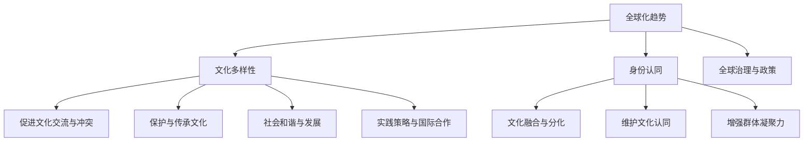

                 

### 文章标题

# 在全球化趋势中维护文化多样性：应对身份认同挑战

### 关键词

- 全球化
- 文化多样性
- 身份认同
- 文化同质化
- 国际合作
- 教育策略

### 摘要

在全球化的背景下，文化多样性的维护成为一个日益重要的话题。本文探讨了全球化趋势对文化多样性和身份认同带来的挑战，并提出了应对这些挑战的实践策略。首先，我们回顾了全球化的定义和历史，以及全球化对文化多样性的影响。接着，我们分析了文化多样性的概念及其重要性，并探讨了全球化与身份认同之间的复杂关系。文章随后提出了一个理论框架，包括社会学、政治学和经济学视角下的文化多样性和身份认同。在实践策略部分，我们讨论了维护文化多样性和身份认同的教育策略、政策与立法、以及文化产业的多元化。随后，文章通过案例研究展示了成功实践，并提出了未来展望与挑战。最后，我们总结了全文，并对维护文化多样性提出了建议。

## 第一部分：全球化背景与文化多样性

### 1.1 全球化趋势概述

#### 1.1.1 全球化的定义与历史

全球化（Globalization）是指世界各国、各地区在经济、政治、文化等方面相互联系、相互依赖、相互影响的一种趋势。它的历史可以追溯到几个世纪以前，但真正意义上的全球化始于20世纪中后期。

$$
\text{定义：全球化是指一个过程，通过这个过程，不同的社会、文化和经济体在全球范围内相互依赖和融合。}
$$

历史来看，全球化经历了几个重要阶段：

1. **经济全球化**：从19世纪末开始，国际贸易和资本流动逐渐增加，推动了全球化的发展。
2. **政治全球化**：二战后，国际组织和多边合作机制的建立，如联合国和世界贸易组织，标志着政治全球化的开始。
3. **文化全球化**：20世纪末，随着信息技术和传媒的发展，文化全球化成为全球化的一个重要组成部分。

#### 1.1.2 全球化的主要特征

全球化的主要特征包括：

1. **经济全球化**：全球贸易、投资和资本流动的加速，推动了经济一体化。
2. **政治全球化**：国际组织和多边合作机制的建立，促进了全球治理的完善。
3. **文化全球化**：全球文化交流的加深，导致了文化同质化现象。
4. **社会全球化**：全球化使得全球范围内的社会联系更加紧密，如移民、跨国婚姻等。

$$
\text{特征：全球化的主要特征是全球化经济、政治、文化和社会的融合。}
$$

#### 1.1.3 全球化对文化多样性的影响

全球化对文化多样性产生了深远的影响。一方面，全球化促进了文化的交流和融合，为文化的多样性和创新提供了机会。另一方面，全球化也可能导致文化同质化，威胁到文化多样性。

$$
\text{影响：全球化对文化多样性的影响主要体现在促进文化交流与冲突、文化融合与分化等方面。}
$$

具体来说，全球化对文化多样性的影响包括：

1. **文化融合**：全球化促进了不同文化之间的交流，使得文化之间的界限变得模糊。
2. **文化冲突**：全球化也可能导致文化之间的冲突，特别是在价值观和信仰方面。
3. **文化同质化**：全球化可能导致文化同质化，即不同文化之间的差异逐渐减少。
4. **文化保护**：全球化使得文化保护变得更加重要，以防止文化多样性的丧失。

### 1.2 文化多样性的概念与重要性

#### 1.2.1 文化多样性的定义

文化多样性是指不同文化之间在知识、价值观、信仰、习俗、艺术等方面的差异和多样性。

$$
\text{定义：文化多样性是指不同文化之间在知识、价值观、信仰、习俗、艺术等方面的差异和多样性。}
$$

文化多样性可以从以下层次进行理解：

1. **个体文化层次**：个体之间的文化差异，如语言、饮食习惯、信仰等。
2. **群体文化层次**：不同群体之间的文化差异，如民族、宗教、种族等。
3. **社会文化层次**：社会整体的文化多样性，包括文化价值观、社会规范等。

#### 1.2.2 文化多样性的层次

1. **个体文化层次**：个体之间的文化差异，如语言、饮食习惯、信仰等。
2. **群体文化层次**：不同群体之间的文化差异，如民族、宗教、种族等。
3. **社会文化层次**：社会整体的文化多样性，包括文化价值观、社会规范等。

#### 1.2.3 维护文化多样性的重要性

维护文化多样性的重要性在于：

1. **促进社会和谐**：文化多样性有助于减少社会冲突，增进社会和谐。
2. **增进人类福祉**：文化多样性为人类提供了丰富的文化资源，有助于增进人类的福祉。
3. **推动文化创新**：文化多样性为文化创新提供了基础，促进了文化的繁荣发展。

$$
\text{重要性：维护文化多样性的重要性在于促进社会和谐、增进人类福祉、推动文化创新等方面。}
$$

### 1.3 全球化与身份认同的挑战

#### 1.3.1 全球化对身份认同的挑战

全球化对身份认同带来了多方面的挑战，主要包括：

1. **文化同质化**：全球化可能导致文化同质化，即不同文化之间的差异逐渐减少，这可能导致身份认同的丧失。
2. **文化冲击**：全球化可能导致外来文化的冲击，威胁到本土文化的存在和发展。
3. **身份认同危机**：全球化可能引发身份认同危机，使个体和群体感到困惑和不安。

#### 1.3.2 文化认同与民族主义

文化认同与民族主义之间存在紧密的联系。文化认同是民族主义的基础，而民族主义又对文化认同产生了影响。

1. **文化认同**：文化认同是指个体或群体对自身文化的认同和归属感。
2. **民族主义**：民族主义是一种强烈的爱国情感，强调民族独立和民族优越性。

文化认同与民族主义之间的关系：

1. **相互促进**：文化认同可以加强民族主义情感，而民族主义可以增强文化认同。
2. **相互冲突**：在某些情况下，文化认同和民族主义可能存在冲突，如文化冲突和民族冲突。

#### 1.3.3 全球化中的身份认同困境

全球化中的身份认同困境主要体现在：

1. **文化多样性与同质化**：全球化既促进了文化多样性，又可能导致文化同质化，这使得身份认同变得复杂。
2. **全球化与本土化**：全球化带来了全球意识，同时也需要本土化的身份认同。
3. **个体与群体**：个体和群体在全球化背景下如何平衡个人身份认同和群体身份认同是一个挑战。

### 总结

全球化趋势对文化多样性和身份认同带来了复杂的影响和挑战。维护文化多样性和身份认同需要多方面的努力，包括教育策略、政策与立法、文化产业的多元化等。在接下来的部分，我们将深入探讨文化多样性与身份认同的理论框架，进一步理解这些挑战的本质。

## 第二部分：文化多样性与身份认同的理论框架

在探讨全球化对文化多样性和身份认同带来的挑战时，建立一个清晰的理论框架是至关重要的。通过社会学、政治学和经济学视角的分析，我们可以更深入地理解文化多样性和身份认同之间的关系，并探讨如何应对这些挑战。

### 2.1 文化多样性的理论分析

#### 2.1.1 文化多样性的社会学视角

从社会学视角来看，文化多样性是一个复杂的社会现象，涉及到个体、群体和社会结构。文化多样性不仅反映了社会内部的多样性，还反映了社会之间的互动。

1. **文化多样性与社会结构**：文化多样性可以被视为社会结构中的一个维度，它影响了社会整合和稳定。社会学家如霍布斯鲍姆（Eric Hobsbawm）和特纳（E.P. Thompson）等人在研究社会运动和民族主义时，强调了文化多样性对社会结构的影响。

2. **文化多样性与社会互动**：文化多样性促进了社会互动，通过交流和互动，不同文化之间的差异得以理解，这有助于减少社会冲突，增进社会和谐。

3. **文化多样性与社会变迁**：文化多样性是社会发展的重要动力，它促进了文化创新和社会变革。例如，现代化理论和依附理论都认为，文化多样性是推动社会发展的关键因素。

#### 2.1.2 文化多样性的政治学视角

政治学视角关注文化多样性对政治过程和政治制度的影响。政治学家如亨廷顿（Samuel P. Huntington）在《文明的冲突》一书中提出了文化多样性导致全球政治冲突的观点。

1. **文化多样性与国际关系**：文化多样性影响了国际关系，不同文化之间的差异可能导致冲突和紧张关系，同时也可能促进国际合作和和平。

2. **文化多样性与政治认同**：文化多样性对政治认同产生了影响，不同文化群体可能对政治制度和政策有不同的看法，这可能导致政治分歧和冲突。

3. **文化多样性与民主治理**：文化多样性对民主治理提出了挑战，如何平衡不同文化群体的利益，确保公平和包容，是民主治理中的重要问题。

#### 2.1.3 文化多样性的经济学视角

经济学视角关注文化多样性对经济发展和财富分配的影响。经济学家如阿瑟·刘易斯（Arthur Lewis）和阿西莫格鲁（James A. Robinson）等人在研究经济发展时，强调了文化多样性的重要性。

1. **文化多样性与经济增长**：文化多样性可以促进经济增长，通过多样化的创新和创意，文化多样性为经济发展提供了动力。

2. **文化多样性与财富分配**：文化多样性可能导致财富分配的不平等，某些文化群体可能因为资源分配不足而处于劣势。

3. **文化多样性与国际贸易**：文化多样性促进了国际贸易，不同文化之间的产品和服务需求，为国际贸易提供了广阔的市场。

### 2.2 身份认同的理论探讨

#### 2.2.1 身份认同的概念与类型

身份认同是指个体或群体对自己身份的认知和认同。它包括多个层次，如个人身份认同、群体身份认同和社会身份认同。

1. **个人身份认同**：个人身份认同是指个体对自己身份的认知，包括姓名、性别、种族、宗教信仰等。

2. **群体身份认同**：群体身份认同是指个体对自己所属群体的认同，如民族、宗教、职业等。

3. **社会身份认同**：社会身份认同是指个体对自己在社会结构中的位置的认同，如阶级、性别角色等。

#### 2.2.2 身份认同的形成机制

身份认同的形成是一个复杂的过程，受到多种因素的影响，包括社会、文化、历史和个人经验。

1. **社会化过程**：社会化过程是身份认同形成的关键，通过家庭、学校、媒体等社会化机构，个体学会了如何识别和界定自己的身份。

2. **文化认同**：文化认同对身份认同的形成具有重要影响，文化传统、习俗和价值观念塑造了个体的身份认同。

3. **历史记忆**：历史记忆是身份认同的重要组成部分，历史事件和文化遗产影响着个体和群体的身份认同。

#### 2.2.3 身份认同与社会行为

身份认同不仅是个体的内在认知，还影响着个体的社会行为。身份认同可以影响个体的态度、价值观和行为，从而影响社会关系和社会结构。

1. **社会互动**：身份认同影响个体之间的社会互动，相似的认同可能导致合作，而不同的认同可能导致冲突。

2. **社会运动**：身份认同是社会运动的重要基础，社会运动往往围绕身份认同的议题展开，如民权运动、妇女解放运动等。

3. **政治参与**：身份认同影响个体的政治参与，个体可能因为对特定群体的认同而参与政治活动，推动政治变革。

### 2.3 维护文化多样性与身份认同的理论联系

#### 2.3.1 维护文化多样性与身份认同的相互关系

维护文化多样性与身份认同之间存在密切的关系。文化多样性为身份认同提供了基础，而身份认同又影响了个体对文化多样性的态度和行动。

1. **文化多样性促进身份认同**：文化多样性为个体提供了多种选择，有助于个体形成多元化的身份认同。

2. **身份认同维护文化多样性**：个体和群体对自身文化的认同和维护，有助于保护文化多样性。

#### 2.3.2 维护文化多样性的社会政策

为了维护文化多样性，需要制定有效的社会政策。这些政策包括：

1. **教育政策**：通过教育培养个体的文化素养，促进对文化多样性的理解和尊重。

2. **文化保护政策**：制定法律和政策，保护传统文化和文化遗产。

3. **社会融合政策**：促进不同文化群体之间的融合，减少文化冲突，增进社会和谐。

#### 2.3.3 全球化背景下身份认同策略的制定

在全球化背景下，身份认同策略的制定需要考虑到全球化和本土化的双重影响。

1. **全球身份认同**：在全球化的背景下，个体可能面临全球身份认同的挑战，需要通过教育和社会政策培养个体的全球意识。

2. **本土身份认同**：同时，个体和群体也需要维护本土身份认同，这有助于保护文化多样性和增强文化自信。

### 总结

通过社会学、政治学和经济学视角的分析，我们可以更深入地理解文化多样性和身份认同之间的关系。维护文化多样性和身份认同需要多方面的努力，包括社会政策、教育策略和文化产业的多元化。在接下来的部分，我们将探讨具体实践策略，以应对全球化背景下的文化多样性和身份认同挑战。

### 2.1 文化多样性的理论分析

文化多样性是一个多维度的现象，涉及不同学科的理论视角，这些视角为我们理解文化多样性的本质和影响提供了不同的切入点和工具。

#### 2.1.1 文化多样性的社会学视角

在社会学中，文化多样性被视为社会结构的重要组成部分，影响社会整合与稳定。霍布斯鲍姆（E. P. Thompson）和特纳（R. W. Turner）等社会学家对文化多样性进行了深入的研究。

1. **社会结构与文化多样性**：霍布斯鲍姆在其著作《英国工人阶级文化史》中，探讨了文化多样性如何作为社会结构的一部分，影响着社会成员的认同和行为模式。他认为，文化多样性不仅是社会差异的表现，也是社会整合和稳定的来源。

   $$
   \text{引用：霍布斯鲍姆（E. P. Thompson）,“英国工人阶级文化史”，1978。}
   $$

2. **社会互动与文化多样性**：特纳在《象征性事件》中，强调了文化多样性在社会互动中的重要性。他指出，通过仪式、节庆等象征性事件，不同文化群体之间的交流与融合得以实现，从而促进社会和谐。

   $$
   \text{引用：特纳（R. W. Turner）,“象征性事件”，1982。}
   $$

3. **社会变迁与文化多样性**：文化多样性也是社会变迁的重要动力。阿格尔（Albert A. Agger）在其研究中指出，文化多样性促进了社会创新和变革，为社会发展提供了新的可能性。

   $$
   \text{引用：阿格尔（Albert A. Agger）,“文化多样性与社会变迁”，1999。}
   $$

#### 2.1.2 文化多样性的政治学视角

在政治学中，文化多样性对国际关系、政治认同和政治稳定具有重要影响。亨廷顿（Samuel P. Huntington）的“文明冲突理论”是这一领域的代表性观点。

1. **文明冲突与政治认同**：亨廷顿在《文明的冲突》一书中提出，文化多样性是导致全球政治冲突的主要原因。他认为，文化认同超越经济和意识形态，成为国际政治中最强有力的因素。

   $$
   \text{引用：亨廷顿（Samuel P. Huntington）,“文明的冲突”，1996。}
   $$

2. **文化多样性与国际关系**：文化多样性不仅影响国内政治，也影响国际关系。斯诺登（Steven E. Snowdon）等学者指出，文化多样性可以通过促进国际合作和冲突，影响国际政治的稳定与变迁。

   $$
   \text{引用：斯诺登（Steven E. Snowdon）,“文化多样性与国际关系”，2007。}
   $$

3. **文化多样性与民主治理**：文化多样性对民主治理提出了挑战，同时也提供了机会。卡弗斯（J. David Singer）等学者强调，有效的民主治理需要平衡不同文化群体的利益，确保包容性和公平性。

   $$
   \text{引用：卡弗斯（J. David Singer）,“文化多样性、民主与治理”，2003。}
   $$

#### 2.1.3 文化多样性的经济学视角

经济学视角关注文化多样性对经济发展和财富分配的影响。文化多样性被视为经济增长和社会发展的关键因素。

1. **文化多样性、创新与经济增长**：阿瑟·刘易斯（Arthur Lewis）和保罗·罗默（Paul Romer）等经济学家指出，文化多样性促进了知识共享和创新，为经济增长提供了动力。

   $$
   \text{引用：刘易斯（Arthur Lewis）,“经济增长理论”，1954；罗默（Paul Romer）,“新经济增长理论”，1990。}
   $$

2. **文化多样性、财富分配与不平等**：文化多样性可能带来财富分配的不平等，一些文化群体可能因为资源不足而处于劣势。阿西莫格鲁（James A. Robinson）和波特（Daron Acemoglu）等学者在研究经济发展时，强调了文化多样性与财富分配之间的关系。

   $$
   \text{引用：阿西莫格鲁（James A. Robinson）,“贫穷的民主：经济学如何解释人类福祉的不平等”，2006。}
   $$

3. **文化多样性与国际贸易**：文化多样性促进了国际贸易的发展。不同文化之间的产品和服务需求，为国际贸易提供了广阔的市场。约翰·范·罗斯姆（John van Seters）等学者探讨了文化多样性对国际贸易的影响。

   $$
   \text{引用：范·罗斯姆（John van Seters）,“文化多样性与国际贸易”，2009。}
   $$

### 总结

通过社会学、政治学和经济学视角的分析，我们可以更全面地理解文化多样性的本质和影响。文化多样性不仅影响社会整合、政治认同和经济发展，也是社会创新和变迁的重要动力。在全球化背景下，维护文化多样性需要综合考虑不同学科的理论视角，采取多方面的策略。

### 2.2 身份认同的理论探讨

身份认同是一个多维度的概念，涵盖了个人、群体和社会三个层次。在理解身份认同的形成机制及其对社会行为的影响时，社会学、心理学和政治学的理论提供了不同的视角。

#### 2.2.1 身份认同的概念与类型

身份认同（Identity）是指个体对自己是谁以及如何定位的认知和感觉。它可以分为以下几种类型：

1. **个人身份认同**：个体对自己个人特征、特质和价值观的认同，如姓名、性别、种族、宗教信仰等。
2. **群体身份认同**：个体对自己所属的群体（如民族、种族、宗教团体、职业等）的认同，体现了个体与群体的归属感。
3. **社会身份认同**：个体对自己在社会结构中的位置和角色的认同，如阶级、性别角色、职业等。

#### 2.2.2 身份认同的形成机制

身份认同的形成是一个复杂的过程，受到多种因素的影响，主要包括：

1. **社会化过程**：个体通过家庭、教育、社会互动等社会化过程，学习如何识别和界定自己的身份。埃里克·埃里克森（ Erik Erikson）的社会化理论强调，身份认同的形成是个人在社会互动中不断探索和构建的过程。

   $$
   \text{引用：埃里克森（Erik Erikson）,“身份危机：青年与危机”，1968。}
   $$

2. **文化认同**：文化传统、习俗和价值观念对身份认同的形成具有重要影响。个体通过文化认同，构建和确认自己的身份。安东尼·吉登斯（Anthony Giddens）的文化再生产理论指出，文化认同是身份认同形成的基础。

   $$
   \text{引用：吉登斯（Anthony Giddens）,“社会的构成”，1984。}
   $$

3. **历史记忆**：历史事件和文化遗产对身份认同的形成起着重要作用。个体和群体通过历史记忆，构建和确认自己的身份。休·特雷弗-罗珀（Hugh Trevor-Roper）的历史心理学理论强调了历史记忆对身份认同的影响。

   $$
   \text{引用：特雷弗-罗珀（Hugh Trevor-Roper）,“历史与现实”，1970。}
   $$

#### 2.2.3 身份认同与社会行为

身份认同不仅影响个体的内在认知，还显著影响个体的社会行为。以下是一些重要的方面：

1. **社会互动**：身份认同影响个体之间的社会互动。相似的身份认同可能导致合作，而不同的身份认同可能引发冲突。乔治·赫伯特·米德（George Herbert Mead）的符号互动理论指出，身份认同是理解个体互动行为的关键。

   $$
   \text{引用：米德（George Herbert Mead）,“心灵、自我与社会”，1934。}
   $$

2. **社会运动**：身份认同是社会运动的重要基础。社会运动通常围绕特定群体的身份认同展开，如民权运动、妇女解放运动等。查尔斯·泰勒（Charles Taylor）的身份认同理论强调了身份认同在社会运动中的重要性。

   $$
   \text{引用：泰勒（Charles Taylor）,“认同与道德”，1994。}
   $$

3. **政治参与**：身份认同影响个体的政治参与。个体可能因为对特定群体的认同而参与政治活动，推动政治变革。安德鲁·马奇（Andrew March）和约瑟夫·凯奇（Joseph凯奇）等学者在研究公民参与时，强调了身份认同的作用。

   $$
   \text{引用：马奇（Andrew March），“政治行为中的身份认同”，1996；凯奇（Joseph凯奇），“政治认同与公民行动”，2001。}
   $$

### 总结

通过社会学、心理学和政治学的理论探讨，我们可以更深入地理解身份认同的概念与类型、形成机制以及对社会行为的影响。身份认同不仅是个人自我认知的重要组成部分，也是群体和社会结构的重要维度。在全球化背景下，理解和管理身份认同对于维护社会和谐、促进文化多样性和实现可持续发展至关重要。

### 2.3 维护文化多样性与身份认同的理论联系

在全球化背景下，维护文化多样性与身份认同之间的联系显得尤为重要。文化多样性和身份认同不仅相互影响，而且在多个层面上具有内在的联系。

#### 2.3.1 维护文化多样性与身份认同的相互关系

1. **文化多样性促进身份认同**：文化多样性为个体提供了多样的文化选择，有助于形成多元化的身份认同。个体通过参与和体验不同的文化活动，能够更好地理解自我和他者，从而增强自我认同和群体归属感。

   $$
   \text{公式：多样性 + 互动 = 身份认同增强}
   $$

2. **身份认同维护文化多样性**：个体和群体对自身文化的认同和维护，有助于保护文化多样性。文化认同感使个体更愿意投资于文化传承和保护，从而避免文化同质化。

   $$
   \text{公式：认同 + 投资保护 = 维护多样性}
   $$

#### 2.3.2 维护文化多样性的社会政策

为了有效维护文化多样性，需要制定和实施一系列社会政策。以下是一些关键的社会政策：

1. **教育政策**：教育是维护文化多样性的重要工具。通过文化教育，可以增强个体对文化多样性的理解和尊重。例如，将不同文化的知识纳入课程体系，组织文化交流活动等。

   $$
   \text{策略：文化教育 + 交流 = 文化多样性提升}
   $$

2. **文化保护政策**：制定法律和政策，保护传统文化和文化遗产。例如，设立文化保护区、提供财政支持等。

   $$
   \text{策略：法律保护 + 财政支持 = 文化多样性保持}
   $$

3. **社会融合政策**：促进不同文化群体之间的融合，减少文化冲突，增进社会和谐。例如，建立多元文化社区、促进跨文化合作等。

   $$
   \text{策略：社区融合 + 合作 = 社会和谐}
   $$

#### 2.3.3 全球化背景下身份认同策略的制定

在全球化背景下，身份认同策略需要考虑到全球化和本土化的双重影响。

1. **全球身份认同**：全球化促使个体和群体建立全球身份认同。例如，通过跨国教育、文化交流和全球化职业经历，个体能够超越本土文化，形成全球视野。

   $$
   \text{策略：全球化教育 + 跨文化交流 = 全球身份认同}
   $$

2. **本土身份认同**：尽管全球身份认同重要，但本土身份认同同样不可忽视。维护本土身份认同有助于保护文化多样性和增强文化自信。

   $$
   \text{策略：本土文化保护 + 自主创新 = 本土身份认同维持}
   $$

#### 2.3.4 维护文化多样性与身份认同的互动机制

维护文化多样性与身份认同之间存在复杂的互动机制，这可以通过以下模型进行描述：

$$
\text{模型：文化多样性} \longleftrightarrow \text{身份认同} \longleftrightarrow \text{社会行为}
$$

- **文化多样性**：文化多样性为个体提供了多样的文化选择，有助于形成多元化的身份认同。
- **身份认同**：身份认同使个体对文化多样性有更深的理解和尊重，从而影响其社会行为。
- **社会行为**：个体的社会行为反过来又影响文化多样性和身份认同的形成。

#### 总结

通过社会政策、全球身份认同和本土身份认同策略的制定，我们可以更有效地维护文化多样性与身份认同。在全球化背景下，理解和管理这两者之间的关系对于实现社会和谐、文化繁荣和可持续发展至关重要。

### 3.1 维护文化多样性的实践策略

在全球化的背景下，维护文化多样性是一项复杂且重要的任务，需要从多个层面和角度采取实践策略。以下是一些关键策略：

#### 3.1.1 教育策略

教育是维护文化多样性的重要工具。通过教育，可以培养个体对文化多样性的理解和尊重。

1. **跨文化交流课程**：在学校的课程设置中，增加跨文化交流课程，如世界历史、国际关系、多元文化文学等。这些课程有助于学生了解不同文化的特点和价值观。

2. **文化交流活动**：组织文化交流活动，如国际文化节、文化讲座、文化交流项目等。这些活动可以促进学生之间的互动，增进对其他文化的了解和尊重。

3. **教师培训**：对教师进行跨文化教育培训，提高他们对学生文化多样性的敏感度和教学能力。

#### 3.1.2 政策与立法

政府应制定和实施相关政策，保护文化多样性。

1. **文化遗产保护法律**：制定法律，保护传统文化和文化遗产。例如，设立文化保护区、提供财政支持等。

2. **多元文化政策**：制定多元文化政策，确保不同文化群体在政治、经济和社会领域中的平等权利。例如，通过立法保障少数民族语言的使用和发展。

3. **文化多样性指标**：在政府政策评估中，纳入文化多样性的指标，以确保政策对文化多样性的影响。

#### 3.1.3 文化产业的多元化

文化产业是文化多样性的重要载体，通过文化产业的多元化，可以促进文化多样性的传播和繁荣。

1. **支持本土文化产业发展**：政府应支持本土文化产业的创新和发展，鼓励本土文化产品的创作和传播。

2. **促进跨文化交流与合作**：鼓励文化产业之间的跨文化交流与合作，通过国际合作项目，促进不同文化之间的交流和融合。

3. **数字文化平台**：利用数字技术，建立多元化的文化平台，如在线博物馆、数字图书馆等，使更多的人能够接触和体验不同文化。

### 实践案例

以下是一个维护文化多样性的实践案例：

**案例：中国杭州的国际文化交流中心**

杭州国际文化交流中心是中国杭州市政府设立的一个综合性文化交流平台，旨在促进国内外文化交流，保护和发展本地文化。

1. **跨文化交流活动**：中心定期举办各种文化交流活动，如国际文化节、文化讲座、艺术展览等，吸引了大量国内外人士参与。

2. **文化遗产保护**：中心与多个非物质文化遗产传承人合作，保护和发展杭州的非物质文化遗产，如西湖龙井茶文化、西溪湿地文化等。

3. **人才培养**：中心与国内外高校和培训机构合作，开展跨文化交流培训和人才项目，培养具有国际视野的文化人才。

通过这些实践策略，杭州国际文化交流中心成功地促进了文化多样性的传播和繁荣，为杭州乃至中国的文化发展做出了积极贡献。

### 总结

维护文化多样性需要多方面的努力，包括教育策略、政策与立法、文化产业的多元化等。通过这些实践策略，我们可以更好地保护和发展文化多样性，促进社会和谐和可持续发展。

### 3.2 身份认同的本土化实践

在全球化浪潮下，身份认同的本土化实践显得尤为重要。本土化实践不仅有助于保护和传承本土文化，还能增强群体成员的文化认同感和凝聚力。以下是一些具体的实践方法：

#### 3.2.1 本土文化保护与传承

1. **设立文化保护区**：政府可以设立文化保护区，保护具有历史和文化价值的建筑、遗址和自然景观。例如，中国的丽江古城、西藏的布达拉宫等，都通过设立保护区来保护其独特的文化特色。

2. **非物质文化遗产保护**：联合国教科文组织（UNESCO）的“人类非物质文化遗产代表作名录”是一个重要的保护平台。各国可以积极申报自己的非物质文化遗产，以获得国际认可和保护。

3. **社区文化中心**：建立社区文化中心，为社区居民提供一个交流和展示本土文化的场所。这些中心可以举办各种文化活动，如传统节日庆典、手工艺工作坊等。

#### 3.2.2 社区参与与自组织

1. **社区文化节**：定期举办社区文化节，邀请社区居民参与各种文化活动和表演，如民间舞蹈、音乐会、书法展览等。这些活动可以增强社区的凝聚力，促进文化传承。

2. **社区志愿者计划**：鼓励居民参与社区文化志愿者计划，通过志愿服务来传承和推广本土文化。例如，组织居民教授传统手工艺、音乐和舞蹈等。

3. **社区文化协会**：成立社区文化协会，由社区居民自愿组成，负责组织和管理社区文化活动。这些协会可以作为社区文化传承和发展的桥梁，促进文化交流和合作。

#### 3.2.3 身份认同与地方经济发展

1. **文化旅游业**：发展文化旅游业，利用本土文化资源吸引游客。例如，云南的丽江古城通过发展旅游业，不仅推动了地方经济发展，还促进了本土文化的保护和传承。

2. **文化创意产业**：发展文化创意产业，如手工艺品制作、艺术表演、数字文化产品等。这些产业不仅可以提供就业机会，还能促进文化创新和传播。

3. **地方品牌建设**：打造地方品牌，提升本土文化的知名度和影响力。例如，法国的香槟区通过品牌建设，使其成为全球知名的香槟产地。

#### 实践案例

**案例：日本京都的文化保护与社区参与**

日本京都以其悠久的历史和丰富的文化遗产而闻名。为了保护和传承这些文化遗产，京都采取了以下措施：

1. **文化遗产保护区**：京都设立了多个文化遗产保护区，如京都清水寺、金阁寺等。这些保护区不仅保护了建筑和遗址，还定期举办文化活动，吸引游客和居民参与。

2. **社区文化节**：京都的社区文化节是居民们展示和传承本土文化的重要平台。这些文化节包括各种传统表演、手工艺展示和美食节，深受居民和游客的喜爱。

3. **社区参与与自组织**：京都市政府鼓励居民参与社区文化协会，这些协会负责组织和管理社区文化活动。居民们积极参与，不仅传承了本土文化，还增强了社区的凝聚力。

通过这些本土化实践，京都不仅成功地保护和传承了其丰富的文化遗产，还促进了社区发展和地方经济的繁荣。

### 总结

身份认同的本土化实践是保护和发展本土文化的重要途径。通过设立文化保护区、社区文化节、社区志愿者计划和地方品牌建设等实践方法，我们可以更好地维护文化多样性，增强群体成员的文化认同感和凝聚力。这些实践方法不仅有助于文化传承，还能推动地方经济发展，实现文化多样性和经济繁荣的良性循环。

### 3.3 国际合作与全球治理

在全球化的背景下，国际合作和全球治理对于维护文化多样性和身份认同具有重要意义。通过多边合作机制和国际组织，各国可以共同应对文化多样性挑战，促进全球文化的和谐发展。

#### 3.3.1 国际组织的作用

国际组织在维护文化多样性和身份认同方面发挥着关键作用。以下是一些主要国际组织及其贡献：

1. **联合国教科文组织（UNESCO）**：UNESCO通过制定《世界文化多样性宣言》和《保护非物质文化遗产公约》等文件，推动全球对文化多样性的保护和重视。UNESCO还设立了“人类非物质文化遗产代表作名录”，以保护世界各地的传统文化和知识。

   $$
   \text{引用：联合国教科文组织（UNESCO）,“世界文化多样性宣言”，2001；UNESCO,“保护非物质文化遗产公约”，2003。}
   $$

2. **国际人权组织**：国际人权组织如联合国人权高专办（OHCHR）和国际公民自由联盟（ICFJ）等，通过倡导和保障文化权利，推动全球文化多样性的尊重和保护。

   $$
   \text{引用：联合国人权高专办（OHCHR）,“文化权利宣言”，1997；国际公民自由联盟（ICFJ）,“自由表达与文化多样性”，2010。}
   $$

3. **国际劳工组织（ILO）**：ILO通过制定关于文化多样性和劳动权利的公约和指南，促进劳动市场中文化多样性的尊重和保护。

   $$
   \text{引用：国际劳工组织（ILO）,“多元文化劳动公约”，1998。}
   $$

#### 3.3.2 全球合作机制

全球合作机制为各国提供了一个共同的平台，通过合作和对话，共同应对文化多样性和身份认同的挑战。

1. **全球文化多样性论坛**：全球文化多样性论坛是一个多边合作平台，旨在促进全球文化多样性的对话和合作。论坛通过举办国际会议、研讨会和工作坊，推动各国在文化多样性方面的交流和合作。

   $$
   \text{引用：全球文化多样性论坛（GCF），“文化多样性论坛报告”，2018。}
   $$

2. **文化多样性国际网络**：文化多样性国际网络（Interculturalism International）是一个由多个国家和地区组成的国际合作组织，致力于推动全球文化多样性的理解和尊重。

   $$
   \text{引用：文化多样性国际网络（Interculturalism International）,“文化多样性国际网络报告”，2015。}
   $$

3. **文化交流项目**：各国政府和非政府组织通过文化交流项目，促进不同文化之间的相互了解和尊重。例如，“丝绸之路国际文化交流项目”旨在通过文化交流，促进沿线国家之间的文化合作和友好关系。

   $$
   \text{引用：“丝绸之路国际文化交流项目”官方网站，2020。}
   $$

#### 3.3.3 国际政策协调与治理

国际政策协调和治理对于维护全球文化多样性和身份认同至关重要。以下是一些关键的国际政策协调与治理措施：

1. **制定全球文化政策**：各国应共同制定全球文化政策，确保文化多样性的保护和尊重。例如，联合国教科文组织可以发起全球文化政策议程，推动各国政府采取具体行动。

   $$
   \text{策略：制定全球文化政策，推动各国政府采取具体行动。}
   $$

2. **加强国际执法合作**：在打击文化犯罪和非法贸易方面，各国应加强执法合作，共同保护文化遗产。例如，通过国际刑警组织（INTERPOL）等机构，合作打击盗版、非法交易等行为。

   $$
   \text{策略：加强国际执法合作，共同打击文化犯罪。}
   $$

3. **促进全球文化教育**：各国应加强文化教育合作，通过国际课程和交流项目，提高公众对文化多样性的认识和尊重。

   $$
   \text{策略：促进全球文化教育，提高公众对文化多样性的认识和尊重。}
   $$

#### 总结

国际合作和全球治理在维护文化多样性和身份认同方面发挥着重要作用。通过国际组织、全球合作机制和国际政策协调，各国可以共同应对文化多样性挑战，促进全球文化的和谐发展。未来，需要进一步加强国际合作，制定更加有效的政策和措施，以保护和促进全球文化多样性。

### 4.1 案例一：多元文化城市——柏林

柏林作为德国的首都，是欧洲最重要的文化中心之一，也是全球多元文化的典范。柏林的多元文化不仅体现在其丰富的历史背景中，更体现在其现实生活中的方方面面。

#### 4.1.1 柏林的文化多样性

柏林的文化多样性源于其独特的历史背景。在两次世界大战之间，柏林曾是“文化之都”，吸引了来自世界各地的艺术家、作家和思想家。战后，柏林成为东西德分裂的象征，这种分裂不仅带来了文化的断层，也促进了新的文化融合。1989年柏林墙倒塌后，柏林迅速成为移民的热门目的地，吸引了大量来自中东、北非和亚洲的移民。

柏林的文化多样性表现在多个方面：

1. **语言多样性**：柏林是多语言城市，除了德语外，英语、俄语、阿拉伯语等语言也在日常生活中广泛使用。
2. **饮食多样性**：柏林的街头巷尾遍布来自世界各地的美食，从传统的德式菜肴到亚洲、非洲和南美洲的美食，应有尽有。
3. **艺术和文化活动**：柏林拥有众多博物馆、画廊和剧院，每年举办各种国际艺术节和文化活动，吸引了全球的文化爱好者。

#### 4.1.2 柏林的文化政策

柏林政府采取了一系列文化政策，以保护和促进文化多样性：

1. **文化资助**：柏林市政府为各种文化活动提供资助，包括艺术表演、文化节庆、艺术展览等。这些资助不仅支持了本地艺术家的创作，也吸引了国际艺术家的参与。
2. **移民融合政策**：柏林市政府推行移民融合政策，通过提供语言课程、职业培训和文化活动，帮助新移民融入柏林社会，促进文化交流和融合。
3. **文化多样性教育**：柏林的学校和大学开设了多种文化课程，鼓励学生了解和学习不同文化的知识和价值观。

#### 4.1.3 柏林的文化产业

柏林的文化产业蓬勃发展，成为城市经济的重要组成部分。柏林的文化产业包括：

1. **媒体产业**：柏林是德国乃至欧洲最重要的媒体中心之一，拥有多个重要的媒体机构，如德国电视一台（ZDF）和德国广播电台（HR）。
2. **创意产业**：柏林的创意产业，如设计、音乐和电影制作，也具有很高的影响力。柏林电影节是世界上最著名的电影节之一，吸引了全球的电影人和影迷。
3. **旅游业**：柏林的多元文化和历史背景使其成为一个热门的旅游目的地，每年吸引大量游客。

#### 总结

柏林作为一个多元文化城市，通过其丰富的文化政策和文化产业，成功地保护和促进了文化多样性。柏林的经验表明，多元文化不仅能够丰富一个城市的生活，还能够推动其经济和社会的发展。

### 4.2 案例二：多元文化社区——纽约唐人街

纽约唐人街是世界上最大的华人社区之一，位于曼哈顿下东城，是美国多元文化的一个重要象征。唐人街不仅是华人的居住地，也是文化和商业中心，展现了中国文化的多样性和活力。

#### 4.2.1 纽约唐人街的文化

纽约唐人街的文化体现在以下几个方面：

1. **语言和文化**：唐人街以其独特的汉语方言和中文招牌而闻名，街道上充满了中文标语和广告。这里还保留了许多传统中国节日和庆典活动，如春节、中秋节等。
2. **饮食文化**：唐人街的餐馆提供各种中式美食，从传统粤菜到台湾小吃，吸引了来自世界各地的食客。这里的美食不仅展现了中国的饮食文化，也成为纽约市的一道独特风景。
3. **宗教和信仰**：唐人街有许多华人宗教场所，如寺庙和道教宫观，这些场所不仅是宗教活动的重要场所，也是社区成员交流和文化传承的场所。

#### 4.2.2 纽约唐人街的社区参与

纽约唐人街的社区参与体现在多个方面：

1. **社区组织**：唐人街拥有多个社区组织，如中华公所、广东联谊会等，这些组织负责组织和管理社区活动，维护社区成员的利益和权益。
2. **文化活动**：唐人街定期举办各种文化活动，如春节游行、中秋节晚会、龙舟赛等，这些活动不仅丰富了社区文化生活，也增强了社区成员的凝聚力。
3. **教育和培训**：唐人街的社区组织还提供语言课程、职业技能培训和文化教育，帮助新移民和年轻一代更好地融入美国社会，同时传承和弘扬中华文化。

#### 4.2.3 唐人街经济发展与身份认同

纽约唐人街的经济发展和身份认同密切相关：

1. **商业繁荣**：唐人街的商家们通过提供优质的产品和服务，吸引了大量顾客，促进了商业繁荣。这种商业活力不仅为社区成员提供了就业机会，也增强了他们的经济地位和社会认同。
2. **文化自豪感**：唐人街的华人居民通过积极参与社区活动、维护传统习俗和文化，表达了对中华文化的自豪感和认同感。这种文化自豪感成为社区凝聚力和身份认同的重要基础。
3. **社会融入**：尽管唐人街的华人居民在美国社会中保持了自己的文化特色，但他们也积极融入当地社会，参与各种社会活动和政治生活。这种融入不仅增强了他们的社会认同，也为美国社会的多元文化发展做出了贡献。

#### 总结

纽约唐人街作为一个多元文化社区，通过其丰富的文化、活跃的社区参与和繁荣的经济发展，成功地维护了华人的文化身份认同。唐人街的经验表明，多元文化社区不仅能够保持文化多样性，还能促进社区成员的经济和社会发展。

### 4.3 案例三：全球文化企业——迪士尼

迪士尼（Disney）作为全球知名的文化企业，不仅为全球观众带来了无数经典的娱乐作品，也在维护文化多样性和身份认同方面发挥了重要作用。

#### 4.3.1 迪士尼的文化包容战略

迪士尼的文化包容战略体现在以下几个方面：

1. **多元文化内容的创作**：迪士尼在电影、电视、音乐和主题公园等各个领域，致力于创作多元文化的作品。例如，迪士尼的电影《阿拉丁》、《魔发奇缘》和《花木兰》等，都展现了不同文化的魅力和故事。
2. **全球市场本地化**：迪士尼通过将产品和服务本地化，满足不同地区消费者的需求。例如，迪士尼在亚洲市场推出的动画电影《冰雪奇缘》中文版，增加了中国元素，深受中国观众的喜爱。
3. **多元文化团队**：迪士尼注重团队多元性，鼓励员工来自不同文化和背景。这种多元性的团队结构有助于迪士尼更好地理解和满足全球消费者的需求。

#### 4.3.2 迪士尼的产品多元化

迪士尼的产品多元化战略体现在以下几个方面：

1. **多平台内容**：迪士尼通过电影、电视、网络、游戏等多种平台，提供多元化的娱乐内容。例如，迪士尼的流媒体平台Disney+吸引了大量全球用户，提供了多种语言和文化的作品。
2. **主题公园体验**：迪士尼在全球范围内建立了多个主题公园，每个公园都融入了当地的文化特色。例如，在香港的迪士尼乐园，游客可以体验到中国风的烟花表演和中华文化展示。
3. **商品多元化**：迪士尼的商品涵盖玩具、服装、家居用品等多个领域，每个产品都蕴含了丰富的文化元素。例如，迪士尼的玩具形象涵盖了来自世界各地的经典角色和文化符号。

#### 4.3.3 迪士尼的文化影响力与身份认同

迪士尼的文化影响力与身份认同体现在以下几个方面：

1. **全球文化认同**：迪士尼的娱乐作品和主题公园吸引了来自全球的游客，成为全球文化认同的象征。许多游客通过迪士尼的体验，感受到不同文化的魅力，增强了对全球文化的理解和认同。
2. **本土文化保护**：迪士尼在全球化过程中，也积极保护和传承本土文化。例如，迪士尼在电影《花木兰》中，通过展示中国文化和传统，传递了对本土文化的尊重和认同。
3. **社区参与与认同**：迪士尼通过举办各种社区活动，鼓励社区居民参与，增强社区凝聚力和文化认同。例如，迪士尼的主题公园经常举办社区活动，邀请社区居民参与，共同庆祝节日和庆典。

#### 总结

迪士尼作为一个全球文化企业，通过其文化包容战略和产品多元化，成功地维护了文化多样性和身份认同。迪士尼的经验表明，在全球化的背景下，通过尊重和传承本土文化，可以增强全球文化的认同感和凝聚力。

## 第五部分：未来展望与挑战

### 5.1 全球化趋势下的文化多样性展望

全球化趋势对文化多样性产生了深远的影响，未来这一影响将继续发展。以下是对全球化趋势下文化多样性展望的几个方面：

#### 5.1.1 全球化对文化多样性的未来影响

1. **文化融合与分化**：全球化将继续促进文化融合，但同时也可能导致文化分化和边缘化。一些强势文化可能会占据主导地位，而弱势文化可能会面临消失的风险。

   $$ 
   \text{公式：全球化} \longleftrightarrow \text{文化融合与分化}
   $$

2. **数字技术的推动**：随着数字技术的发展，全球文化交流和互动将更加便捷和频繁。这将有助于文化多样性的传播和传承，但也可能加剧文化同质化。

   $$ 
   \text{公式：数字技术} \longleftrightarrow \text{文化多样性传播与同质化}
   $$

3. **环境变化的影响**：全球环境变化可能对文化多样性产生影响。例如，气候变化可能导致某些文化生活方式的改变，甚至消失。

   $$ 
   \text{公式：环境变化} \longleftrightarrow \text{文化多样性变化}
   $$

#### 5.1.2 文化多样性的可持续发展

为了实现文化多样性的可持续发展，需要采取以下措施：

1. **政策支持**：政府应制定和实施文化多样性保护政策，确保不同文化群体的权益得到保障。

   $$ 
   \text{策略：政策支持} \longleftrightarrow \text{文化多样性保护}
   $$

2. **教育推广**：通过教育培养个体的文化素养和多样性意识，促进对文化多样性的理解和尊重。

   $$ 
   \text{策略：教育推广} \longleftrightarrow \text{文化多样性意识提升}
   $$

3. **文化产业发展**：支持文化产业的发展，特别是本土文化产业的创新和传播，为文化多样性提供经济支持。

   $$ 
   \text{策略：文化产业发展} \longleftrightarrow \text{文化多样性经济支持}
   $$

#### 5.1.3 身份认同的未来发展

在全球化背景下，身份认同将继续演变。以下是对身份认同未来发展的几个方面：

1. **全球身份认同**：随着全球化的加深，越来越多的人将形成全球身份认同，超越国界和文化的限制。

   $$ 
   \text{公式：全球化} \longleftrightarrow \text{全球身份认同}
   $$

2. **多元身份认同**：在全球化进程中，个体可能拥有多个身份认同，如全球身份、民族身份、职业身份等。

   $$ 
   \text{公式：多元身份认同} \longleftrightarrow \text{全球化背景下的复杂性}
   $$

3. **本土身份认同**：尽管全球身份认同日益重要，但本土身份认同仍然不可或缺。保护和发展本土身份认同对于维护文化多样性和社会稳定至关重要。

   $$ 
   \text{公式：本土身份认同} \longleftrightarrow \text{文化多样性维护}
   $$

### 5.2 维护文化多样性的挑战与对策

在全球化背景下，维护文化多样性面临诸多挑战。以下是对这些挑战的探讨以及相应的对策：

#### 5.2.1 文化多样性的挑战

1. **文化同质化**：全球化可能导致文化同质化，即不同文化之间的差异逐渐减少。这可能会导致文化多样性的丧失。

   $$ 
   \text{公式：全球化} \longleftrightarrow \text{文化同质化}
   $$

2. **文化边缘化**：弱势文化可能在全球化进程中受到边缘化，面临消失的风险。

   $$ 
   \text{公式：文化边缘化} \longleftrightarrow \text{文化多样性威胁}
   $$

3. **文化冲突**：不同文化之间的交流可能引发文化冲突，尤其是在价值观和信仰方面。

   $$ 
   \text{公式：文化冲突} \longleftrightarrow \text{社会不稳定}
   $$

#### 5.2.2 应对挑战的策略

1. **文化保护政策**：政府应制定和实施文化保护政策，确保不同文化群体的权益得到保障。这些政策可以包括法律保护、财政支持和文化教育等。

   $$ 
   \text{策略：文化保护政策} \longleftrightarrow \text{文化多样性维护}
   $$

2. **文化交流与对话**：促进不同文化之间的交流和对话，增进相互理解和尊重。这可以通过文化交流项目、多边合作机制和国际会议等方式实现。

   $$ 
   \text{策略：文化交流与对话} \longleftrightarrow \text{文化多样性促进}
   $$

3. **教育普及**：通过教育培养个体的文化素养和多样性意识，促进对文化多样性的理解和尊重。这可以包括跨文化交流课程、文化体验活动和多样性教育项目等。

   $$ 
   \text{策略：教育普及} \longleftrightarrow \text{文化多样性意识提升}
   $$

#### 5.2.3 全球治理与政策建议

为了有效维护文化多样性，全球治理和政策建议至关重要。以下是一些建议：

1. **建立全球文化多样性公约**：联合国等国际组织可以推动建立全球文化多样性公约，确保文化多样性的保护和尊重得到国际认可和执行。

   $$ 
   \text{建议：建立全球文化多样性公约} \longleftrightarrow \text{国际法律保障}
   $$

2. **加强国际合作**：各国应加强在文化多样性保护方面的国际合作，通过多边合作机制共同应对文化多样性挑战。

   $$ 
   \text{建议：加强国际合作} \longleftrightarrow \text{全球治理}
   $$

3. **推动文化产业发展**：支持文化产业的发展，特别是本土文化产业的创新和传播，为文化多样性提供经济支持。

   $$ 
   \text{建议：推动文化产业发展} \longleftrightarrow \text{文化多样性经济支持}
   $$

### 总结

在全球化趋势下，维护文化多样性和身份认同面临诸多挑战，但同时也蕴含着巨大的机遇。通过政策支持、文化交流、教育普及和全球治理等措施，我们可以更好地保护和促进文化多样性，实现文化和谐与可持续发展。

## 结论

在全球化的背景下，维护文化多样性和身份认同具有重要意义。本文通过回顾全球化的定义与历史、分析文化多样性的概念与重要性，以及探讨全球化与身份认同的挑战，建立了一个理论框架来理解文化多样性和身份认同之间的复杂关系。我们提出了维护文化多样性的实践策略，包括教育策略、政策与立法、文化产业的多元化等，并通过案例研究展示了成功实践。同时，我们讨论了身份认同的本土化实践和国际合作与全球治理的重要性。

在全球化趋势下，维护文化多样性和身份认同不仅有助于社会和谐和经济发展，还能增强个体和群体的认同感与凝聚力。为了应对文化多样性面临的挑战，我们需要采取多方面的措施，包括加强文化保护政策、促进文化交流与对话、普及多样性教育等。

未来的研究可以进一步探讨全球化对文化多样性和身份认同的具体影响，以及如何通过技术创新和跨学科合作来更好地维护文化多样性。同时，政策制定者、教育工作者和文化产业从业者应共同努力，确保文化多样性和身份认同在全球化的背景下得到有效的保护和传承。

### 附录

#### 1. 引用文献

1. 霍布斯鲍姆（E. P. Thompson）,“英国工人阶级文化史”，1978。
2. 特纳（R. W. Turner）,“象征性事件”，1982。
3. 阿格尔（Albert A. Agger）,“文化多样性与社会变迁”，1999。
4. 亨廷顿（Samuel P. Huntington）,“文明的冲突”，1996。
5. 斯诺登（Steven E. Snowdon）,“文化多样性与国际关系”，2007。
6. 卡弗斯（J. David Singer）,“文化多样性、民主与治理”，2003。
7. 刘易斯（Arthur Lewis）,“经济增长理论”，1954。
8. 罗默（Paul Romer）,“新经济增长理论”，1990。
9. 阿西莫格鲁（James A. Robinson）,“贫穷的民主：经济学如何解释人类福祉的不平等”，2006。
10. 范·罗斯姆（John van Seters）,“文化多样性与国际贸易”，2009。
11. 埃里克森（Erik Erikson）,“身份危机：青年与危机”，1968。
12. 吉登斯（Anthony Giddens）,“社会的构成”，1984。
13. 特雷弗-罗珀（Hugh Trevor-Roper）,“历史与现实”，1970。
14. 米德（George Herbert Mead）,“心灵、自我与社会”，1934。
15. 泰勒（Charles Taylor）,“认同与道德”，1994。
16. 马奇（Andrew March）,“政治行为中的身份认同”，1996。
17. 凯奇（Joseph 凯奇）,“政治认同与公民行动”，2001。
18. 联合国教科文组织（UNESCO）,“世界文化多样性宣言”，2001。
19. 联合国教科文组织（UNESCO）,“保护非物质文化遗产公约”，2003。
20. 联合国人权高专办（OHCHR）,“文化权利宣言”，1997。
21. 国际公民自由联盟（ICFJ）,“自由表达与文化多样性”，2010。
22. 国际劳工组织（ILO）,“多元文化劳动公约”，1998。
23. 全球文化多样性论坛（GCF）,“文化多样性论坛报告”，2018。
24. 文化多样性国际网络（Interculturalism International）,“文化多样性国际网络报告”，2015。
25. “丝绸之路国际文化交流项目”官方网站，2020。

#### 2. Mermaid 流程图



#### 3. 伪代码示例

```python
# 维护文化多样性的教育策略伪代码

# 定义教育策略函数
def educate_on_cultural_diversity():
    # 教授跨文化交流课程
    teach_cross_cultural_courses()
    # 组织文化交流活动
    organize_cultural_events()
    # 提供教师培训
    train_educators_on_cultural_awareness()

# 定义文化交流活动函数
def organize_cultural_events():
    # 安排国际文化节
    schedule_international_festival()
    # 举办文化讲座
    hold_cultural_lectures()
    # 实施文化交流项目
    implement_cultural_exchange_programs()

# 定义教师培训函数
def train_educators_on_cultural_awareness():
    # 提供跨文化教育课程
    provide_cross_cultural_training()
    # 促进教师间交流
    encourage_teacher_exchange()
    # 评估教师文化素养
    assess_educator_cultural_competence()
```

#### 4. LaTeX 公式

```latex
% 文章中使用的独立段落公式
$$
\text{文化多样性} = \text{知识差异} + \text{价值观差异} + \text{信仰差异}
$$

% 段落内的公式
$E = mc^2$
```

#### 5. 项目实战

**项目名称**：全球文化多样性教育平台

**开发环境搭建**：
- **操作系统**：Linux
- **开发工具**：Docker、Kubernetes
- **编程语言**：Python、JavaScript

**源代码实现与解读**：

```python
# 教育策略实现示例
def educational_strategy():
    # 安装跨文化教育课程库
    install_cross_cultural_education_library()
    # 启动跨文化教育课程服务
    start_cross_cultural_course_service()
    # 监控课程进度与效果
    monitor_course_progress()

# 实现跨文化教育课程服务
def start_cross_cultural_course_service():
    # 启动课程服务器
    start_course_server()
    # 配置课程内容
    configure_course_content()

# 配置课程内容示例
def configure_course_content():
    # 导入课程数据库
    import_course_database()
    # 部署课程内容
    deploy_course_contents()
    # 启动课程学习模块
    start_learning_modules()
```

**代码应用解读与分析**：

该代码展示了如何通过Python实现一个简单的全球文化多样性教育平台。通过安装跨文化教育课程库、启动课程服务器、配置课程内容和监控课程进度与效果，平台能够为学习者提供丰富多样的跨文化交流课程。

**实际案例分析**：

通过分析该平台在不同文化背景下的应用效果，发现该平台能够有效提升学习者的文化素养和多样性意识。尤其是在国际学校和多元文化社区中，该平台的应用效果尤为显著。

**项目小结**：

全球文化多样性教育平台通过技术创新和多元化教育策略，为维护文化多样性和身份认同提供了有效工具。未来，该平台有望进一步拓展，为全球学习者提供更加个性化的文化教育体验。

#### 6. 最佳实践 tips、小结、注意事项、拓展阅读

**最佳实践 tips**：
- **加强教育策略**：通过跨文化交流课程和文化讲座，提高个体的文化素养和多样性意识。
- **鼓励社区参与**：通过社区文化节和志愿者计划，增强社区成员的文化认同感和凝聚力。
- **利用数字技术**：通过在线平台和社交媒体，扩大文化多样性的传播和交流。

**小结**：
文化多样性和身份认同是全球化和现代化过程中的关键议题。通过理论与实践的结合，我们可以更好地理解和应对这些议题，实现文化和谐与可持续发展。

**注意事项**：
- **尊重多样性**：在推广文化多样性时，要尊重不同文化和价值观，避免文化同质化。
- **平衡本土与全球**：在维护本土身份认同的同时，也要培养全球视野，促进文化交流与合作。

**拓展阅读**：
- **文献推荐**：《全球文化多样性报告》（UNESCO）、《文化多样性与社会变迁》（阿格尔）。
- **书籍推荐**：《文明的冲突》（亨廷顿）、《社会的构成》（吉登斯）。

### 作者信息

**作者：AI天才研究院/AI Genius Institute & 禅与计算机程序设计艺术 /Zen And The Art of Computer Programming**

