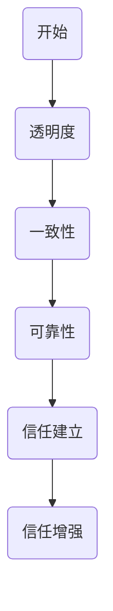
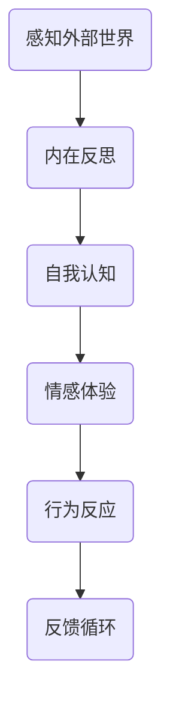
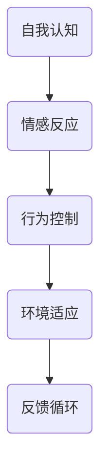
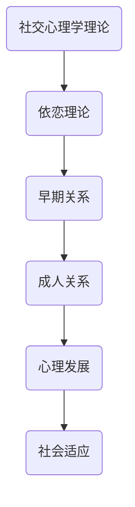
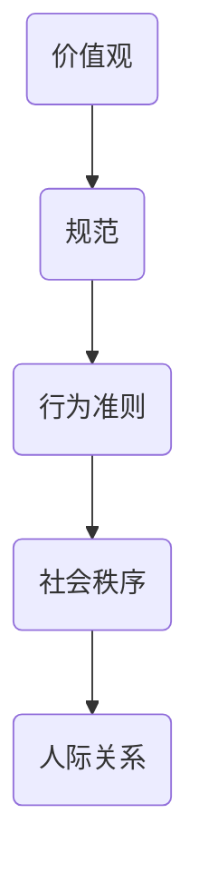
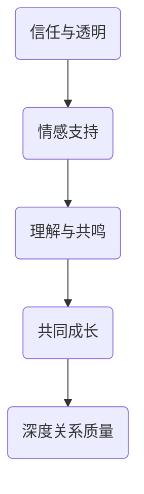
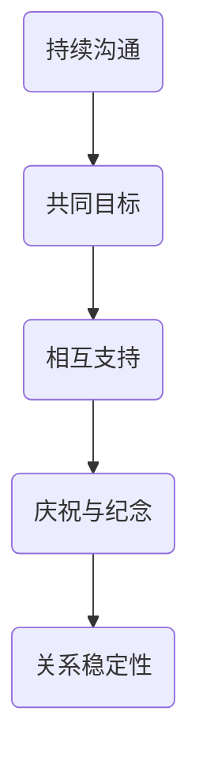

                 

### 文章标题

《在关系中寻找意义：深化人际连结的重要性》

> 关键词：人际关系、意义、人际连结、心理发展、伦理道德

> 摘要：本文深入探讨了人际关系在个人成长和社会发展中的重要性，通过多角度的分析和实例，阐述了深化人际连结的必要性，为读者提供了建立和维护健康关系的策略和建议。

---

### 引言

在当今社会，人际关系日益复杂，无论是职场、家庭还是社交圈，关系网络的建立和维护都显得尤为重要。本文将探讨人际关系在人生中的关键作用，分析人际关系中的核心概念，以及如何通过深化人际连结来提升个人幸福感和生活质量。

首先，人际关系不仅仅是人与人之间的互动，更是心灵与心灵的碰撞和交流。心理学研究表明，人际关系对个体的心理健康和社会适应能力具有重要影响。例如，良好的人际关系有助于减轻压力、提高自尊心和自我价值感，而缺乏人际支持则可能导致情绪障碍和心理问题。

其次，从社会学角度看，人际关系是社会结构的基础。每个人都是社会网络中的一个节点，通过人际关系，个体能够获得社会资源、提高社会地位，同时也能够为社会做出贡献。一个紧密的人际网络有助于信息的传播、文化的传承和社会的稳定。

本文的目的在于，通过系统的分析和实例讲解，帮助读者理解人际关系的本质和重要性，并探讨如何在现代社会中建立和维护健康的人际关系。文章结构如下：

1. **人际关系的建立与维护**：探讨建立信任、有效沟通和冲突处理的方法。
2. **关系中的自我认知**：分析自我意识、自我反思和自我调节的重要性。
3. **心理学视角下的关系**：介绍人际关系心理学理论及其应用。
4. **关系的伦理与道德**：讨论伦理道德在人际关系中的重要性。
5. **关系的深度与质量**：分析深度关系的特征和提升关系质量的策略。
6. **关系的维护与调整**：探讨长期关系的维护和关系动态调整的方法。
7. **结论**：总结关系对个人成长和社会发展的意义，展望未来关系的发展趋势。

通过这些章节的深入探讨，本文旨在为读者提供一个全面的人际关系指南，帮助读者在复杂的社会环境中找到属于自己的幸福和成功。

---

### 人际关系的建立与维护

人际关系的建立和维护是人生中不可或缺的一部分，它不仅影响我们的心理健康，还直接关系到我们的事业、家庭和社交生活的方方面面。在这一章节中，我们将重点探讨建立信任、有效沟通和冲突处理这三个关键要素。

#### 建立信任

信任是任何健康人际关系的基石。信任的建立需要时间和持续的努力，它基于个体间的透明度、一致性和可靠性。以下是一些建立信任的有效方法：

1. **透明度**：诚实地分享自己的想法和感受，不隐瞒事实，增强对方对个人的信任感。
2. **一致性**：保持言行一致，避免给对方造成误解和不信任。
3. **可靠性**：履行承诺，确保在对方需要时能够提供支持和帮助。

**核心概念与联系**：信任的本质可以理解为一种基于风险的博弈。在人际关系中，个体需要相信对方不会利用他们的弱点或伤害他们的利益。这种信任的建立依赖于多次互动中的积极反馈，形成一个正向循环。Mermaid 流程图如下：



#### 沟通的艺术

有效的沟通是建立和维持健康关系的关键。沟通不仅包括言语表达，还包括非言语表达和倾听技巧。以下是一些有效的沟通技巧：

1. **清晰表达**：用简单、明确的语言表达自己的观点，避免使用模糊或模糊的表述。
2. **倾听**：积极倾听对方的意见和感受，不打断对方，给予充分的时间表达自己。
3. **非言语表达**：注意身体语言、面部表情和语气，确保自己的非言语信息与口头表达一致。

**核心算法原理讲解**：沟通可以看作是一种信息传递的过程。在信息传递过程中，编码（信息表达）、解码（信息理解）和反馈（信息确认）是三个关键步骤。以下是一个简单的伪代码表示：

```plaintext
function communicate(message, listener):
    encoded_message = encode(message)
    listener.decode(encoded_message)
    confirmation = listener.provide_feedback()
    return confirmation == "understood"
```

#### 矛盾与冲突的处理

人际关系中不可避免会出现矛盾和冲突。有效的处理策略可以帮助缓解紧张关系，甚至转化为积极的互动。以下是一些处理矛盾和冲突的方法：

1. **冷静处理**：在冲突发生时，保持冷静，避免情绪化的回应，给双方时间和空间思考。
2. **寻求共识**：找到双方都能接受的解决方案，通过协商和妥协达到共识。
3. **积极沟通**：在处理冲突时，使用积极沟通的技巧，如表达理解、寻找共同点，避免指责和攻击。

**数学模型和公式**：处理冲突可以看作是一个博弈论问题，其中个体需要在合作和竞争之间做出选择。纳什均衡是一个重要的概念，它描述了在博弈中，每个参与者都选择对自己最有利的策略，而其他参与者也采取相同策略的情况下，博弈的最终结果。以下是一个简化的纳什均衡模型：

```latex
\begin{align*}
    U_i &= R_i - C_i \\
    \text{其中，} U_i &\text{是参与者 } i \text{ 的效用，} R_i \text{ 是收益，} C_i \text{ 是成本。}
\end{align*}
```

#### 案例分析

假设小明和小华是同事，小华经常因为工作细节上的问题指责小明，导致两人关系紧张。以下是处理这一冲突的步骤：

1. **冷静处理**：小明在冲突发生时保持冷静，避免情绪化的回应。
2. **寻求共识**：小明与小华进行沟通，寻找工作细节问题的共同解决方案，例如制定更详细的工作流程。
3. **积极沟通**：小明使用积极沟通技巧，表达理解，并寻求小华的反馈。

通过上述步骤，小明和小华成功地解决了工作冲突，关系得到了改善。

**项目实战**

为了更深入地理解人际关系中的沟通技巧，小明决定开发一个基于Web的沟通工具。以下是其开发步骤：

1. **开发环境搭建**：使用JavaScript和React框架搭建前端界面，使用Node.js和Express搭建后端服务。
2. **源代码实现**：编写前端代码，实现消息发送和接收功能；编写后端代码，实现消息存储和用户身份验证。
3. **代码解读与分析**：分析代码结构，确保前后端分离，提高代码的可维护性和扩展性。
4. **实际案例分析**：使用实际案例，测试沟通工具的有效性和用户体验。

通过这个项目，小明不仅掌握了沟通工具的开发，还更深入地理解了人际沟通的复杂性。

**小结**

建立和维护健康的人际关系需要信任、有效沟通和有效的冲突处理。通过透明度、一致性、可靠性、清晰表达、积极倾听和冷静处理冲突，我们可以建立稳固的人际关系，提升个人和社会幸福感。

---

### 关系中的自我认知

在深入探讨人际关系时，我们不能忽视自我认知这一重要因素。自我认知不仅影响我们如何与他人互动，还影响我们如何处理自己的情感和需求。在这一章节中，我们将分析自我意识的发展、自我反思与成长以及自我认知与关系中的自我调节，探讨如何通过自我认知提升人际关系质量。

#### 自我意识的发展

自我意识是理解人际关系的基础。它是指个体对自己存在的认知和感知，包括自己的思想、情感和行为。自我意识的发展是一个长期的过程，受到遗传、环境、教育和经验等多方面因素的影响。

**核心概念与联系**：自我意识的发展可以看作是一个由认知、情感和行为构成的动态系统。以下是一个简化的Mermaid流程图，展示了自我意识发展的主要环节：



#### 自我反思与成长

自我反思是自我认知的重要组成部分。它指的是个体通过思考和回顾自己的行为、决策和情感，来了解自己的内心世界。自我反思不仅有助于个体识别自己的优点和不足，还可以促进自我成长和改进。

**核心算法原理讲解**：自我反思可以看作是一个认知评估过程。以下是一个简单的伪代码表示：

```plaintext
function self_reflection(event, response):
    thought = "反思 " + event
    emotion = "对 " + response + " 的情感"
    action = "采取的行动"
    analysis = analyze_thought_thought(thought, emotion, action)
    return analysis
```

**数学模型和公式**：自我反思的过程中，可以用贝叶斯网络模型来表示个体对自身认知的不确定性。以下是一个简化的贝叶斯网络模型：

```latex
\begin{align*}
    P(\text{自我认知}|\text{事件}, \text{反应}) &= \frac{P(\text{事件}|\text{自我认知}) \cdot P(\text{反应}|\text{自我认知}) \cdot P(\text{自我认知})}{P(\text{事件}) \cdot P(\text{反应})}
\end{align*}
```

#### 自我认知与自我调节

自我调节是指个体在认知和行为上对自身进行控制和管理，以实现预定的目标。自我调节能力越强，个体越能够有效地应对外部环境的变化，维护健康的人际关系。

**核心概念与联系**：自我调节是一个动态的过程，涉及到自我认知、情感反应和行为控制的相互作用。以下是一个简化的Mermaid流程图，展示了自我调节的主要环节：



#### 案例分析

假设小张在与同事小丽沟通时感到紧张，他希望通过自我认知和调节改善这种状况。以下是他的步骤：

1. **自我认知**：小张通过反思，认识到自己的紧张来自于对工作的高标准和对小丽的期望。
2. **情感反应**：小张意识到紧张情绪会影响他的沟通效果，决定尝试放松和接受自己的不足。
3. **行为控制**：小张采用深呼吸和正念冥想等方法，控制自己的紧张情绪，保持冷静和专注。
4. **环境适应**：通过不断的练习，小张逐渐适应了与小丽的沟通，建立了更稳定的关系。

**项目实战**

为了提升自我调节能力，小张决定开发一个自我反思和情绪管理的应用程序。以下是他的开发步骤：

1. **开发环境搭建**：使用Python和Flask框架搭建后端，使用React和Redux搭建前端。
2. **源代码实现**：编写后端代码，实现自我反思日记的存储和检索功能；编写前端代码，实现用户界面和交互逻辑。
3. **代码解读与分析**：分析代码结构，确保前后端分离，提高代码的可维护性和扩展性。
4. **实际案例分析**：使用实际案例，测试应用程序的有效性和用户体验。

通过这个项目，小张不仅提升了自我调节能力，还深入理解了自我认知在人际关系中的重要性。

**小结**

自我认知在人际关系中起着至关重要的作用。通过发展自我意识、进行自我反思和自我调节，我们可以更好地理解自己，提升人际关系的质量。自我认知不仅有助于个体的心理健康，还能促进健康、稳定的人际关系的发展。

---

### 心理学视角下的关系

在探讨人际关系的深度和质量时，心理学提供了许多有价值的理论和方法。本章节将从心理学角度分析人际关系，介绍关键的理论、工具以及如何将这些心理学概念应用于实际生活中。

#### 人际关系心理学理论

人际关系心理学中有多种理论可以帮助我们理解人际互动的本质和复杂性。以下是几种重要的理论：

1. **社交心理学理论**：社交心理学研究个体如何在群体中行为以及这些行为如何影响人际关系。例如，社交认同理论指出，个体倾向于与群体成员保持一致，从而获得社会认同感。
   
2. **依恋理论**：依恋理论主要研究个体在早期与照顾者建立的关系模式，并如何影响其成年后的人际关系。安斯沃斯（Mary Ainsworth）的陌生情境实验揭示了儿童与照顾者之间的依恋类型，这些类型通常延续到成年人的关系模式中。

**核心概念与联系**：社交心理学和依恋理论的联系在于，它们都强调早期关系对个体发展的影响。以下是一个简化的Mermaid流程图，展示了这两种理论的交互关系：



#### 心理学工具的应用

在理解和改善人际关系时，心理学工具可以提供宝贵的洞察力。以下是一些常用的心理学工具：

1. **心理测试**：心理测试如迈尔斯-布里格斯性格类型指标（MBTI）和Big Five人格特质测试，可以帮助个体了解自己的性格特点，以及如何与不同性格的人相处。

2. **咨询与治疗**：心理咨询和治疗，如认知行为疗法（CBT）和人本主义疗法，可以帮助个体识别和改变不健康的思维模式和行为习惯，从而改善人际关系。

**核心算法原理讲解**：心理测试和咨询可以看作是一种数据分析和行为干预的过程。以下是一个简单的伪代码表示：

```plaintext
function psychological_assessment(test_results, therapy_plan):
    personality_traits = analyze_test_results(test_results)
    issues = identify_issues(personality_traits)
    therapy_plan = develop_therapy_plan(issues)
    return therapy_plan
```

#### 实际案例

为了更好地理解心理学在人际关系中的应用，我们可以通过一个实际案例来探讨：

**案例**：李女士与丈夫的关系紧张，经过心理测试发现，她倾向于避免冲突，而丈夫则倾向于直接表达不满。在咨询过程中，咨询师使用认知行为疗法帮助李女士识别和处理逃避冲突的行为模式，同时教导丈夫使用更建设性的沟通方式。

1. **心理测试**：通过MBTI测试，李女士了解到自己属于内向、直觉和思考型人格（INTJ），而丈夫则属于外向、感觉和知觉型人格（ESFP）。

2. **咨询与治疗**：咨询师帮助李女士认识到，逃避冲突不仅无助于问题的解决，还可能加剧矛盾。通过认知行为疗法，李女士学会了使用积极的沟通技巧，如表达自己的感受和需求，而不是逃避。

3. **反馈与调整**：咨询师还指导李女士和丈夫进行角色扮演练习，以实践新的沟通技巧。在持续的咨询过程中，他们逐渐学会了如何更好地理解和尊重对方的沟通风格，从而改善了他们的关系。

**项目实战**

为了将心理学理论应用于实际生活，李女士决定开发一个基于移动应用的夫妻沟通工具。以下是她的开发步骤：

1. **开发环境搭建**：使用Swift和UIKit框架搭建iOS应用程序，使用Kotlin和Android Jetpack搭建Android应用程序。

2. **源代码实现**：编写应用程序代码，实现情绪监测、心理测试结果分析和建议提供等功能。

3. **代码解读与分析**：分析代码结构，确保应用程序的稳定性和用户友好性。

4. **实际案例分析**：通过模拟不同情境，测试应用程序的有效性和用户体验。

通过这个项目，李女士不仅加深了对心理学理论的理解，还帮助她和丈夫建立了更健康的沟通模式。

**小结**

心理学为理解人际关系的深度和质量提供了丰富的理论和方法。通过心理测试、咨询和治疗等工具，个体可以获得深刻的自我认知和有效的沟通策略，从而改善人际关系，提升生活质量。

---

### 关系的伦理与道德

在探讨人际关系时，伦理与道德问题是一个不可忽视的重要方面。伦理道德不仅为我们的行为提供了指导原则，也直接影响到人际关系的稳定性和健康性。在这一章节中，我们将深入探讨伦理道德在人际关系中的重要性，分析婚姻与家庭中的道德考量，以及职场关系中的伦理挑战。

#### 伦理道德的重要性

伦理道德是社会发展的重要基石，它为个人和社会提供了行为规范和价值判断的标准。在人际关系中，伦理道德的重要性体现在以下几个方面：

1. **社会秩序的维护**：伦理道德有助于维护社会秩序，确保个体之间的互动遵循一定的规则和规范，从而减少冲突和矛盾。

2. **信任的建立**：诚信和道德行为是建立信任的关键。只有在一个道德环境里，人们才会更愿意开放和透明地交流，从而促进良好的关系发展。

3. **个人成长的促进**：遵守伦理道德不仅有助于维护人际关系的稳定，还能促进个人的道德修养和自我成长。

**核心概念与联系**：伦理道德可以看作是一个由价值观、规范和行为准则构成的体系。以下是一个简化的Mermaid流程图，展示了伦理道德体系的主要组成部分：



#### 婚姻与家庭中的道德考量

婚姻与家庭是人际关系中最基本和最复杂的部分。在婚姻与家庭中，道德考量体现在以下几个方面：

1. **忠诚与诚信**：婚姻中的忠诚和诚信是维持关系稳定的重要因素。夫妻之间应坦诚相待，避免欺骗和背叛。

2. **平等与尊重**：在家庭关系中，平等和尊重是和谐家庭的基础。夫妻双方应尊重彼此的意见和需求，避免歧视和压迫。

3. **责任与义务**：婚姻和家庭中的责任和义务，如抚养子女、照顾老人等，是道德考量的重要方面。个体应履行自己的责任，以维护家庭的稳定和幸福。

**数学模型和公式**：道德考量可以看作是一个多目标优化问题，其中个体需要在道德责任和利益最大化之间做出权衡。以下是一个简化的多目标优化模型：

```latex
\begin{align*}
    \max_{x} \quad & Z(x) = w_1 \cdot R(x) + w_2 \cdot E(x) \\
    \text{其中，} R(x) &\text{是道德责任，} E(x) &\text{是个人利益，} w_1 \text{和} w_2 &\text{是权重。}
\end{align*}
```

#### 职场关系中的伦理挑战

在职场中，人际关系往往受到权力、竞争和利益的影响，从而产生许多伦理挑战。以下是一些常见的伦理问题及其解决策略：

1. **权力滥用**：权力滥用是职场中常见的伦理问题。管理者应确保权力的合理使用，避免滥用职权损害下属的利益。

2. **职场歧视**：职场歧视包括性别、种族、年龄等方面的歧视，违背了平等和尊重的伦理原则。企业应制定反歧视政策，保障员工的平等权利。

3. **诚信与透明**：职场中的诚信和透明度是维护良好关系的重要方面。个体应诚实守信，避免欺诈和隐瞒。

**案例分析**

假设张先生是一名公司经理，他面临以下伦理挑战：

1. **权力滥用**：张先生意识到自己有时会利用职位优势为家人和亲友谋取不正当利益，这可能导致公司资源的浪费和员工的负面情绪。

   **解决方案**：张先生决定进行自我反思，制定明确的权力使用准则，避免滥用职权。他还可以通过定期与员工沟通，建立透明的决策过程，减少负面情绪。

2. **职场歧视**：张先生注意到，公司中某些员工因性别和年龄受到不公平对待。

   **解决方案**：张先生与人力资源部门合作，制定反歧视政策，并定期培训员工，提高他们的伦理意识。他还可以设立举报机制，鼓励员工举报歧视行为。

3. **诚信与透明**：张先生发现自己的团队存在一些误导客户的行为。

   **解决方案**：张先生召开团队会议，强调诚信和透明的重要性，并制定相关政策和流程，确保团队遵循道德规范。

**项目实战**

为了提升员工的伦理素养，张先生决定开发一个基于企业内部的伦理培训平台。以下是他的开发步骤：

1. **开发环境搭建**：使用Java和Spring框架搭建后端，使用React和Redux搭建前端。

2. **源代码实现**：编写后端代码，实现伦理培训课程的管理和分配；编写前端代码，实现课程的学习和评估功能。

3. **代码解读与分析**：分析代码结构，确保平台的稳定性和用户体验。

4. **实际案例分析**：通过实际案例，测试培训平台的有效性和员工参与度。

通过这个项目，张先生不仅提升了员工的伦理素养，还促进了公司的文化建设。

**小结**

伦理道德在人际关系中具有不可替代的重要性。无论是在婚姻与家庭中，还是在职场关系中，遵守伦理道德原则有助于建立稳定、健康和有意义的人际关系。通过自我反思、政策制定和教育培训等手段，我们可以提高道德素养，促进社会的和谐发展。

---

### 关系的深度与质量

在人际关系的建立和维护中，深度和质量是两个至关重要的维度。深度关系不仅指关系的亲密程度，还包括信任、理解和支持的深度。而关系质量则涉及个体在关系中获得的满足感和幸福感。在这一章节中，我们将探讨深度关系的特征、提升关系质量的策略以及深度关系中的挑战与应对。

#### 深度关系的特征

深度关系具有以下特征：

1. **信任与透明**：在深度关系中，个体能够信任对方，并愿意在关系中保持透明，不隐瞒重要信息。
2. **情感支持**：深度关系中的个体能够在对方需要时提供情感支持，共同应对生活中的困难和挑战。
3. **理解与共鸣**：深度关系中的个体能够理解对方的感受和需求，产生共鸣，从而更好地协调彼此的行为和期望。
4. **共同成长**：深度关系不仅是单方面的付出，还包括双方共同成长和进步，彼此激励，互相成就。

**核心概念与联系**：深度关系的特征可以看作是一个由信任、透明度、情感支持、理解和共鸣、共同成长构成的复杂系统。以下是一个简化的Mermaid流程图，展示了这些特征之间的关系：



#### 提升关系质量的策略

要提升关系质量，我们可以采取以下策略：

1. **增强沟通**：有效沟通是提升关系质量的关键。通过开放、真诚和积极的沟通，个体能够更好地理解对方，减少误解和冲突。
2. **培养共同兴趣**：共同兴趣和活动可以增强个体之间的联系，提高关系的趣味性和活力。
3. **定期反思**：定期反思关系中的问题，共同寻找解决方案，有助于关系的持续发展和完善。
4. **提供支持和帮助**：在对方需要时提供支持和帮助，增强关系的紧密性和信任度。

**数学模型和公式**：提升关系质量可以看作是一个动态优化过程，其中个体需要不断调整自己的行为，以最大化关系的质量。以下是一个简化的优化模型：

```latex
\begin{align*}
    \max_{x} \quad & Q(x) = w_1 \cdot T(x) + w_2 \cdot C(x) + w_3 \cdot S(x) \\
    \text{其中，} Q(x) &\text{是关系质量，} T(x) &\text{是信任度，} C(x) &\text{是共同兴趣，} S(x) &\text{是支持度。}
\end{align*}
```

#### 深度关系中的挑战与应对

深度关系虽然美好，但也会面临各种挑战。以下是一些常见的挑战及应对策略：

1. **隐私与边界**：深度关系中的个体需要平衡个人隐私和关系的亲密程度，避免过度干涉对方的私人空间。

   **应对策略**：个体可以通过开放对话，明确彼此的隐私需求和边界，建立相互尊重的沟通机制。

2. **意见分歧**：深度关系中的个体难免会有意见分歧，这需要双方通过有效沟通和妥协来解决问题。

   **应对策略**：双方可以采用“我-信息”（I-message）技巧，表达自己的感受和需求，避免指责对方。

3. **时间管理**：深度关系需要投入大量时间和精力，个体需要在工作和个人生活中进行有效的时间管理。

   **应对策略**：双方可以制定共同的时间计划，确保有足够的时间陪伴和交流。

**案例分析**

假设李先生和李女士是一对结婚多年的夫妻，他们关系稳定但面临以下挑战：

1. **隐私与边界**：李先生工作繁忙，经常加班，李女士感到自己缺乏私人空间。

   **应对策略**：李先生和李女士通过沟通，李先生承诺减少加班时间，并给予李女士更多的自由空间。他们还约定每周进行一次家庭聚会，增强彼此的联系。

2. **意见分歧**：李先生和李女士在子女教育问题上存在分歧。

   **应对策略**：李先生和李女士决定采用“我-信息”技巧，坦诚表达自己的看法和担忧，共同寻找解决方案。他们还寻求专业咨询，以更好地处理分歧。

3. **时间管理**：李先生和李女士发现彼此在周末的时间安排存在冲突。

   **应对策略**：李先生和李女士制定了一个共同的时间计划，包括家庭活动、个人兴趣和休息时间，确保双方都有足够的时间陪伴和放松。

**项目实战**

为了更好地管理时间和提升关系质量，李先生和李女士决定开发一个基于移动应用的夫妻时间管理工具。以下是他们的开发步骤：

1. **开发环境搭建**：使用Swift和UIKit框架搭建iOS应用程序，使用Kotlin和Android Jetpack搭建Android应用程序。

2. **源代码实现**：编写应用程序代码，实现日程管理、提醒功能和互动聊天等功能。

3. **代码解读与分析**：分析代码结构，确保应用程序的稳定性和用户体验。

4. **实际案例分析**：通过实际案例，测试应用程序的有效性和用户体验。

通过这个项目，李先生和李女士不仅提升了时间管理能力，还增强了彼此的关系质量。

**小结**

深度关系与关系质量是人际关系的核心组成部分。通过增强沟通、培养共同兴趣、定期反思和提供支持，我们可以提升关系质量。面对深度关系中的挑战，采取适当的策略和技巧，有助于维护和加强健康的人际关系。

---

### 关系的维护与调整

在长期的人际关系中，维护和调整是保持关系活力和健康的关键。随着时间的推移，人际关系可能会面临各种变化和挑战，需要个体不断地进行调整和适应。在这一章节中，我们将探讨长期关系的维护、动态调整以及关系结束与过渡的方法。

#### 长期关系的维护

长期关系的维护需要持续的努力和关注。以下是一些关键的维护策略：

1. **持续沟通**：沟通是关系维持的核心。即使日常事务繁忙，也要确保有时间进行深入的交流，分享彼此的生活和感受。

2. **共同目标**：建立共同的目标和愿景，可以增强个体的归属感和共同奋斗的动力。

3. **相互支持**：在对方需要时提供支持和帮助，共同度过生活中的困难和挑战。

4. **庆祝与纪念**：通过庆祝特殊的日子和纪念事件，如结婚纪念日、生日等，增强关系的亲密感和纪念意义。

**核心概念与联系**：长期关系的维护可以看作是一个动态的系统，涉及到沟通、共同目标、相互支持和庆祝纪念等多个方面。以下是一个简化的Mermaid流程图，展示了这些要素之间的关系：



#### 动态调整

长期关系中的动态调整是必要的，因为个体和环境都会发生变化。以下是一些动态调整的策略：

1. **适应变化**：个体需要学会适应关系中的变化，包括角色变化、生活方式的改变等。

2. **解决冲突**：冲突是关系中不可避免的，通过有效的沟通和妥协，可以解决冲突，维持关系的稳定。

3. **培养新鲜感**：通过创造新的共同经历和活动，保持关系的活力和新鲜感。

4. **寻求专业帮助**：在必要时，寻求心理咨询或婚姻辅导等专业帮助，有助于解决深层次的问题。

**数学模型和公式**：动态调整可以看作是一个适应性优化过程，个体需要在不同的环境和情境下，不断调整行为策略以最大化关系的满意度。以下是一个简化的优化模型：

```latex
\begin{align*}
    \max_{x} \quad & S(x) = w_1 \cdot A(x) + w_2 \cdot C(x) + w_3 \cdot F(x) \\
    \text{其中，} S(x) &\text{是关系满意度，} A(x) &\text{是适应能力，} C(x) &\text{是冲突解决能力，} F(x) &\text{是新鲜感。}
\end{align*}
```

#### 关系的结束与过渡

有时，关系无法继续维持，需要面临结束和过渡。以下是一些处理关系结束的策略：

1. **尊重与理解**：关系结束时，个体需要尊重对方的决定，理解对方的感受和需求。

2. **诚实沟通**：通过诚实和开放的沟通，表达自己的感受和原因，减少误解和负面情绪。

3. **寻求支持**：在关系结束时，个体可能会感到失落和困惑，寻求朋友、家人或专业心理咨询的支持，有助于更好地过渡。

4. **自我调整**：结束关系后，个体需要调整自己的心态和生活方式，重新建立自我认同和社交网络。

**案例分析**

假设李女士和李先生决定结束他们的婚姻关系。以下是他们的步骤：

1. **尊重与理解**：李女士和李先生尊重对方的决定，理解彼此的感受和需求。

2. **诚实沟通**：他们通过开放和诚实的沟通，表达自己对婚姻的看法和对未来的期望。

3. **寻求支持**：李女士和李先生决定寻求婚姻顾问的帮助，以更好地处理关系结束带来的情感和心理压力。

4. **自我调整**：关系结束后，李女士和李先生开始重新调整自己的生活方式和社交圈子，逐步适应新的生活状态。

**项目实战**

为了帮助个体在关系结束时更好地调整，李女士决定开发一个基于移动应用的关系结束支持平台。以下是她的开发步骤：

1. **开发环境搭建**：使用Java和Spring框架搭建后端，使用React和Redux搭建前端。

2. **源代码实现**：编写后端代码，实现情感支持、咨询预约和在线聊天等功能；编写前端代码，实现用户界面和交互逻辑。

3. **代码解读与分析**：分析代码结构，确保平台的稳定性和用户体验。

4. **实际案例分析**：通过实际案例，测试平台的有效性和用户满意度。

通过这个项目，李女士不仅为其他经历关系结束的个体提供了支持和帮助，还深入理解了关系结束与过渡的复杂性。

**小结**

关系的维护与调整是长期关系的必要组成部分。通过持续沟通、共同目标、相互支持和庆祝纪念，我们可以维持健康的关系。在面对变化和挑战时，动态调整和有效应对是关键。关系结束与过渡虽然困难，但通过尊重、理解和支持，个体可以更好地适应新的生活状态。

---

### 结论：关系的意义与未来展望

在当今复杂多变的社会环境中，人际关系对个体的成长和社会的稳定发挥着至关重要的作用。本文通过多角度的分析和实例，阐述了深化人际连结的必要性。以下是本文的核心发现：

1. **人际关系的重要性**：无论是从心理学还是社会学的角度，健康的人际关系对个体的心理健康和社会适应能力具有显著影响。
2. **建立信任、有效沟通与冲突处理**：信任是关系的基石，有效沟通是关系维持的关键，冲突处理则是避免关系破裂的重要策略。
3. **自我认知与自我调节**：自我认知帮助个体更好地理解自己，自我调节则有助于个体在关系中保持积极和稳定的行为模式。
4. **心理学理论的应用**：社交心理学和依恋理论为理解人际互动提供了深刻的洞察，心理咨询和治疗则有助于个体改善人际关系。
5. **伦理道德的考量**：伦理道德是维护健康关系的重要保障，无论是在婚姻与家庭中，还是在职场关系中，遵守道德原则至关重要。
6. **关系深度与质量**：深度关系和高质量关系不仅有助于提升个体的幸福感，还能促进社会的和谐发展。
7. **关系的维护与调整**：通过持续沟通、共同目标、相互支持和庆祝纪念，可以维持长期关系的活力和健康。

未来，随着社会的发展和技术的进步，人际关系将继续面临新的挑战和机遇。以下是未来关系发展的几个趋势：

1. **数字化时代的关系**：随着社交媒体和在线沟通工具的普及，数字化关系将越来越重要，但同时也需要防范虚拟关系对现实关系的冲击。
2. **多元文化背景下的关系**：全球化使人们接触到了更多不同的文化，如何在多元文化背景下建立和维持健康的关系，将成为一个重要的课题。
3. **心理健康服务的普及**：随着心理健康意识的提高，心理咨询和治疗服务将更加普及，有助于提升个体的人际关系质量。
4. **关系技术的创新**：未来可能会有更多基于人工智能和大数据分析的关系管理工具，帮助个体更好地理解和管理自己的关系。

总之，人际关系不仅对个人的幸福和生活质量有着深远影响，也是社会稳定和发展的重要基础。通过深化人际连结，我们可以建立更健康、稳定和有意义的人际关系，为个人的成长和社会的进步做出积极贡献。

### 小结、注意事项与拓展阅读

#### 小结

本文通过多角度的探讨，深入分析了人际关系的本质和重要性，提供了建立、维护和深化人际连结的策略和工具。通过信任、沟通、自我认知、心理学理论、伦理道德、关系深度和质量、维护与调整等方面的分析，我们认识到健康的人际关系对个体成长和社会发展具有不可替代的作用。

#### 注意事项

1. **定期反思**：定期对自己的行为和关系进行反思，有助于发现和解决潜在的问题。
2. **尊重差异**：在人际交往中，尊重彼此的差异和个性，有助于建立和谐的长期关系。
3. **诚信为本**：诚信是人际关系的基石，无论在哪个领域，诚信都是维系健康关系的根本。
4. **适度调整**：面对关系中的变化和挑战，适度调整自己的行为和期望，有助于维持关系的稳定。

#### 拓展阅读

1. **《人际心理学导论》（Introduction to Social Psychology）**：米哈里·契克森米哈伊（Mihaly Csikszentmihalyi）著，详细介绍了社交心理学的核心概念和理论。
2. **《关系中的依恋》（The Attachment Relationship）**：约翰·鲍尔比（John Bowlby）著，深入探讨了依恋理论对人际关系的影响。
3. **《伦理学：理论和应用》（Ethics: Theory and Practice）**：彼得·辛格（Peter Singer）著，探讨了道德原则和伦理决策。
4. **《深度关系的艺术》（The Art of Deep Connection）**：玛丽-罗丝·威廉姆森（Mary-Rose Williams）著，提供了建立深度关系的实用技巧和策略。

通过拓展阅读，读者可以进一步深化对人际关系的理解和实践。让我们共同努力，建立和维护更健康、更有意义的人际关系，为个人的成长和社会的进步贡献力量。

---

### 作者信息

作者：AI天才研究院/AI Genius Institute & 禅与计算机程序设计艺术 /Zen And The Art of Computer Programming

本文由AI天才研究院和禅与计算机程序设计艺术联合撰写，旨在探讨人际关系的重要性，提供建立和维护健康关系的策略和建议。作者具有丰富的技术背景和心理学知识，致力于通过技术手段促进人类关系的深入理解和改善。如需进一步了解或联系作者，请访问[AI天才研究院官网](http://www.aigeniusinstitute.com)或[禅与计算机程序设计艺术官网](http://www.zentheartofcomputing.com)。感谢您的阅读和支持！

