                 

# 在动荡中寻找平衡：克服虚无感的人生智慧

> 关键词：虚无感、人生智慧、心理平衡、自我探索、心灵成长

> 摘要：
在当今快节奏、多变的社会环境中，虚无感成为许多人心中的困扰。本书旨在探讨虚无感的根源、影响以及应对策略，帮助读者在生活的动荡中找到内心的平衡。通过自我探索、心理调适和社会支持等途径，本书为读者提供了一套系统的人生智慧，引导他们在追求个人成长的同时，实现内心的平和与满足。

## 引言

### 1.1 背景介绍

在现代社会中，人们面临着诸多挑战，如工作压力、人际关系、孤独感等。这些因素常常导致人们感到虚无和困惑，仿佛生活在无边无际的迷雾之中。虚无感不仅仅是一种情感体验，它还可能对个人的心理健康和生活质量产生深远的影响。

### 1.2 目的与意义

本书的目的是为那些感到虚无和迷茫的人提供一种实用的方法论，帮助他们找到内心的平衡。通过深入探讨虚无感的根源、影响以及应对策略，本书希望能够为读者提供一套系统的人生智慧，帮助他们摆脱虚无感的困扰，找到生活的意义和目标。

### 1.3 作者观点与人生经验

作为一位在心理和哲学领域有着丰富研究和实践经验的专业人士，作者深刻理解虚无感的本质和影响。通过自己的亲身经历和与众多求助者的互动，作者总结出了一套行之有效的应对策略，希望这些经验能够为读者提供帮助。

## 虚无感的原因与影响

### 2.1 虚无感的原因分析

#### 2.1.1 社会文化因素

现代社会的高度发展带来了物质丰富，但同时也导致了人际关系疏离、价值观混乱等问题。这些因素可能导致人们感到孤独和失落，从而产生虚无感。

#### 2.1.2 个人经历与心理状态

个人的成长经历和心理状态也是导致虚无感的重要原因。例如，童年时期的创伤、心理问题的积累等都可能导致人们感到生命的无意义。

#### 2.1.3 现代生活方式的挑战

现代生活方式的快节奏和高度竞争性，使得人们常常处于压力和焦虑之中，这也会加剧虚无感的产生。

### 2.2 虚无感对生活的影响

#### 2.2.1 心理健康的影响

虚无感可能导致心理问题的加剧，如抑郁、焦虑、失眠等。长期的虚无感还会影响个人的自尊心和自我价值感。

#### 2.2.2 人际关系的影响

虚无感会影响个人的社交能力和人际关系，使得人们更容易产生孤独感和疏离感。

#### 2.2.3 生活质量的下降

虚无感可能导致人们生活质量下降，对生活失去热情和动力，影响工作效率和幸福感。

## 应对虚无感的策略

### 3.1 自我探索

#### 3.1.1 反思个人价值观

通过反思自己的价值观，可以更好地理解自己的需求和追求，从而找到生活的意义。

#### 3.1.2 认识自己的情绪

了解自己的情绪状态，学会情绪管理，可以帮助人们更好地应对生活中的挑战。

#### 3.1.3 寻求内心平静

通过冥想、瑜伽等身心修炼方法，可以帮助人们找到内心的平静，减少虚无感的产生。

### 3.2 心理调适技巧

#### 3.2.1 应对焦虑的方法

通过深呼吸、正念等技巧，可以帮助人们缓解焦虑，减轻虚无感。

#### 3.2.2 增强心理韧性的技巧

通过培养乐观态度、积极面对困难，可以增强个人的心理韧性，提高应对虚无感的能力。

#### 3.2.3 克服消极思维模式

通过认知行为疗法等心理治疗方法，可以帮助人们克服消极思维模式，建立积极的思维方式。

### 3.3 社会支持与人际互动

#### 3.3.1 寻求家人和朋友的支持

家人和朋友的支持是应对虚无感的重要力量。通过与亲友的交流，可以缓解孤独感和无助感。

#### 3.3.2 加入团体活动和社区

参与团体活动和社区，可以扩大社交圈子，增加社交互动，从而减少虚无感的产生。

#### 3.3.3 建立积极的社交网络

建立积极的社交网络，可以提供更多的支持和资源，帮助人们更好地应对生活中的挑战。

## 实践与案例分析

### 4.1 实践案例分享

通过分享真实的生活案例，可以帮助读者更好地理解虚无感的应对策略，并从中获得启示。

### 4.2 案例分析

对案例进行深入分析，探讨案例中虚无感的产生原因和应对策略，为读者提供更具体的指导。

## 心灵成长与自我平衡

### 5.1 心灵成长的路径

通过心灵成长，可以增强个人的心理素质，提高应对生活中各种挑战的能力。

### 5.2 寻求生活的平衡

通过平衡工作与生活、物质追求与内心满足，可以找到生活的意义和目标，实现内心的平和与满足。

## 结论

### 6.1 虚无感的应对策略总结

通过自我探索、心理调适和社会支持等途径，读者可以在生活的动荡中找到内心的平衡。

### 6.2 作者寄语

鼓励读者在动荡中寻找平衡，关注自己的内心世界，不断追求个人成长和内心满足。

## 附录

### 7.1 拓展阅读

推荐一些相关书籍和文章，为读者提供更深入的学习资源。

### 7.2 最佳实践 tips

总结一些实用的技巧和建议，帮助读者更好地应对虚无感。

### 7.3 注意事项

提醒读者在应对虚无感时可能需要注意的事项，以避免出现不必要的困扰。

## 作者信息

作者：AI天才研究院/AI Genius Institute & 禅与计算机程序设计艺术 /Zen And The Art of Computer Programming

以上是按照目录大纲结构撰写的文章正文部分，接下来我们将根据每个章节的具体内容，进一步细化文章内容，确保文章的完整性和丰富性。

### 文章标题：在动荡中寻找平衡：克服虚无感的人生智慧

## 引言

在现代社会，人们常常感到生活充满了不确定性，这种动荡感往往伴随着一种深沉的虚无感。虚无感，不仅仅是一种情感体验，它还可能影响我们的心理状态和生活质量。根据心理学研究，虚无感通常源于个人对生活意义的质疑、对未来的迷茫，以及对自身存在的疑问。这种情绪可能由多种因素引起，包括社会文化背景、个人经历和心理状态等。

### 关键词解释

- **虚无感**：指个体在心理上感到生活缺乏意义和目的，常常伴随着焦虑和孤独感。
- **人生智慧**：指的是通过生活经验和学习所获得的，帮助个体理解和应对生活中的复杂问题的知识和技巧。
- **心理平衡**：指的是个体在心理上达到一种稳定、和谐的状态，能够有效地应对生活中的挑战和压力。

### 目的与意义

本书旨在探讨虚无感的成因及其对个人生活的影响，并提供一系列实用的策略，帮助读者在生活的动荡中找到内心的平衡。通过深入分析虚无感的本质，本书希望能够帮助读者更好地理解自己的内心世界，找到生活的意义和目标。此外，本书还强调，在追求个人成长和发展的过程中，关注内心的平和与满足同样重要。

### 作者观点与人生经验

作为一名在心理和哲学领域有着丰富研究和实践经验的专业人士，作者对虚无感有着深刻的理解。通过多年的实践，作者总结出了一套行之有效的应对策略。这些策略不仅基于理论，更融合了作者自身的经验和观察。在本书中，作者将分享这些策略，希望它们能够为读者提供实际的帮助。

## 虚无感的原因与影响

虚无感的产生往往不是单一因素的结果，而是多种因素相互作用的结果。以下将详细分析几个主要的原因。

### 社会文化因素

社会文化背景在很大程度上影响着个体的价值观和生活方式。在现代社会，物质文明的飞速发展带来了前所未有的便利，但同时也导致了人际关系疏离、价值观混乱等问题。例如，社交媒体的普及让人们更容易感到孤独和失落，因为虚拟世界的互动往往缺乏真实的情感连接。此外，现代社会的快节奏和高竞争性也使得人们更容易感到压力和焦虑，从而产生虚无感。

#### 社会文化因素对虚无感的影响

1. **人际关系疏离**：社交媒体的普及使得人们有了更多的社交机会，但同时也让许多人感到孤独和疏离，因为虚拟世界的互动往往缺乏真实的情感连接。
2. **价值观混乱**：现代社会中，各种价值观的碰撞和冲突可能导致个体感到迷茫和困惑，不知道如何选择和定位自己的生活。
3. **快节奏和高竞争性**：现代社会的高节奏和高竞争性使得人们更容易感到压力和焦虑，从而影响心理健康。

### 个人经历与心理状态

个人的成长经历和心理状态也是导致虚无感的重要原因。例如，童年时期的创伤、家庭关系的紧张、学业或职业上的挫折等都可能导致个体对生活失去信心和希望。此外，个体的心理状态，如焦虑、抑郁、自我怀疑等，也可能加剧虚无感的产生。

#### 个人经历与心理状态对虚无感的影响

1. **童年经历**：童年时期的创伤，如虐待、忽视等，可能会对个体的心理发展产生深远的影响，导致成年后对生活感到失望和绝望。
2. **家庭关系**：家庭关系的紧张或破裂，可能使个体感到孤独和无助，从而产生虚无感。
3. **心理状态**：焦虑、抑郁等心理问题，可能使个体对生活失去兴趣和动力，加剧虚无感的产生。

### 现代生活方式的挑战

现代生活方式的快节奏和高度竞争性，使得人们更容易感到压力和焦虑。例如，长时间的加班、高强度的学习、繁忙的社交活动等，都可能使人们感到疲惫和无力，从而产生虚无感。

#### 现代生活方式对虚无感的影响

1. **工作压力**：长时间的工作和过度的加班，可能导致个体感到身心俱疲，从而影响心理健康。
2. **学习压力**：高强度的学习和考试压力，可能使个体感到焦虑和恐惧，影响对生活的满意度。
3. **社交压力**：繁忙的社交活动，可能使个体感到疲惫和无力，从而产生虚无感。

### 虚无感对生活的影响

虚无感不仅仅是一种情感体验，它还可能对个人的心理健康和生活质量产生深远的影响。

#### 对心理健康的影响

1. **抑郁症**：长期的虚无感可能导致抑郁症，使个体对生活失去兴趣和动力。
2. **焦虑症**：虚无感可能使个体对未来的不确定性感到恐惧和焦虑。
3. **自我价值感下降**：长期的虚无感可能使个体对自己的价值产生怀疑，影响自尊心和自信心。

#### 对生活质量的影响

1. **工作效率下降**：虚无感可能使个体对工作失去兴趣和动力，从而影响工作效率。
2. **人际关系受损**：虚无感可能使个体对人际关系产生消极情绪，影响与他人的互动。
3. **生活满意度下降**：虚无感可能使个体对生活感到不满意，从而影响生活质量。

## 应对虚无感的策略

面对虚无感，我们可以采取多种策略来应对。以下将介绍一些主要的应对策略，包括自我探索、心理调适和社会支持等。

### 自我探索

自我探索是克服虚无感的重要一步。通过深入了解自己的内心世界，我们可以更好地理解自己的需求和追求，从而找到生活的意义。

#### 反思个人价值观

反思个人价值观可以帮助我们更好地理解自己的信念和目标。以下是一个简单的步骤：

1. **写下你的价值观**：首先，列出你认为最重要的价值观，如家庭、友谊、工作、自由等。
2. **思考价值观的意义**：对于每个价值观，思考它对你生活的影响和意义。
3. **确定优先级**：根据价值观的重要性，为它们排序，确定哪些价值观对你来说最为重要。

#### 认识自己的情绪

了解自己的情绪状态，可以帮助我们更好地管理情绪，减少虚无感的产生。以下是一些实用的方法：

1. **情绪日记**：每天记录自己的情绪变化，了解情绪的起伏和触发因素。
2. **情绪识别**：学习情绪识别技巧，如正念冥想，帮助自己更好地理解和管理情绪。
3. **情绪调节**：学会使用深呼吸、放松技巧等方法，调节情绪，减少焦虑和压力。

#### 寻求内心平静

内心平静是克服虚无感的重要基础。以下是一些寻求内心平静的方法：

1. **冥想**：冥想可以帮助我们放松心灵，减少焦虑和压力。
2. **瑜伽**：瑜伽结合了身体和心灵的练习，有助于提高心理韧性和内心平静。
3. **自然疗法**：通过接触自然、进行户外活动，可以帮助我们放松心情，找回内心的平静。

### 心理调适技巧

心理调适技巧是帮助我们应对生活中各种挑战的重要工具。以下介绍几种常用的心理调适技巧。

#### 应对焦虑的方法

焦虑是虚无感常见的一种表现。以下是一些应对焦虑的方法：

1. **深呼吸**：深呼吸可以帮助我们放松身体，减轻焦虑。
2. **正念冥想**：正念冥想可以帮助我们专注于当下，减少对未来的担忧。
3. **认知行为疗法**：通过认知行为疗法，我们可以改变消极的思维模式，减少焦虑和恐惧。

#### 增强心理韧性的技巧

心理韧性是我们在面对挑战时保持积极态度和应对能力的关键。以下是一些增强心理韧性的技巧：

1. **积极思考**：学会用积极的思维方式看待生活中的困难和挑战。
2. **自我肯定**：通过自我肯定，增强自信心和自尊心。
3. **目标设定**：设定明确的个人目标，帮助我们在面对挑战时保持动力和方向。

#### 克服消极思维模式

消极思维模式可能导致我们陷入虚无感的泥沼。以下是一些克服消极思维模式的方法：

1. **认知重构**：通过认知重构，我们可以改变消极的思维模式，建立积极的思维方式。
2. **感恩练习**：通过感恩练习，我们可以专注于生活中的美好，减少消极情绪。
3. **正面肯定**：通过正面肯定，我们可以提高自信心和自我价值感。

### 社会支持与人际互动

社会支持与人际互动在应对虚无感中起着重要作用。以下介绍几种有效的方法。

#### 寻求家人和朋友的支持

家人和朋友的支持是我们应对虚无感的重要力量。以下是一些建议：

1. **开放沟通**：与家人和朋友分享你的感受和困惑，寻求他们的理解和帮助。
2. **情感支持**：在困难时刻，家人的关心和陪伴可以给我们带来安慰和力量。
3. **实际帮助**：家人和朋友可以在日常生活中给予实际的帮助，减轻我们的负担。

#### 加入团体活动和社区

加入团体活动和社区，可以帮助我们扩大社交圈子，增加社交互动。以下是一些建议：

1. **兴趣小组**：加入与你的兴趣相关的小组，可以让你结识到志同道合的朋友。
2. **志愿者活动**：参与志愿者活动，可以帮助我们与他人建立联系，同时实现自我价值。
3. **社区活动**：参与社区活动，可以增强我们的归属感和责任感。

#### 建立积极的社交网络

建立积极的社交网络，可以帮助我们在面对挑战时获得更多的支持和资源。以下是一些建议：

1. **建立联系**：通过社交平台、线下活动等方式，积极建立和扩展社交网络。
2. **互助小组**：组建互助小组，与他人分享经验和资源，共同成长。
3. **社交技巧**：学习社交技巧，提高人际交往能力，更好地融入社交圈子。

## 实践与案例分析

### 实践案例分享

以下分享一个实际案例，以展示如何应对虚无感。

#### 案例背景

小张是一名年轻的职场新人，由于工作压力和人际关系的困扰，他感到生活失去了意义，产生了强烈的虚无感。

#### 应对策略

1. **自我探索**：小张通过写日记和反思自己的价值观，找到了自己对生活的真正追求。
2. **心理调适**：小张学习了深呼吸和正念冥想技巧，帮助自己缓解焦虑和压力。
3. **社会支持**：小张与家人和朋友保持紧密的联系，寻求他们的支持和建议。

#### 结果

通过一系列的实践，小张逐渐找回了生活的意义，他的虚无感也得以缓解。

### 案例分析

通过对小张的案例进行分析，我们可以看到：

1. **自我探索**：通过反思自己的价值观，小张找到了自己对生活的真正追求，这有助于他找到生活的意义。
2. **心理调适**：通过学习心理调适技巧，小张缓解了焦虑和压力，提高了心理健康水平。
3. **社会支持**：家人和朋友的支持使小张感到不再孤单，增强了他的自信心和自我价值感。

### 启示与建议

1. **持续探索**：面对虚无感，持续自我探索是找到生活意义的关键。
2. **学会调适**：掌握心理调适技巧，有助于缓解焦虑和压力，提高生活质量。
3. **寻求支持**：家人和朋友的支持是应对虚无感的重要力量，不要害怕寻求帮助。

## 心灵成长与自我平衡

### 5.1 心灵成长的路径

心灵成长是克服虚无感的重要途径。以下介绍几个关键步骤：

1. **认识自己**：通过自我反思，深入了解自己的内心世界和需求。
2. **接纳自己**：学会接纳自己的不完美，提高自我价值感。
3. **持续学习**：不断学习新的知识和技能，提高自己的综合素质。
4. **培养感恩**：通过感恩练习，培养对生活的感激之情，提高生活质量。

### 5.2 寻求生活的平衡

生活的平衡是克服虚无感的关键。以下介绍几种实现生活平衡的方法：

1. **工作与生活的平衡**：合理安排工作和休息时间，确保身心健康。
2. **物质追求与内心满足**：不要过度追求物质，关注内心的满足和幸福感。
3. **寻找生命的意义**：通过探索和追求生命的意义，找到生活的方向和动力。

### 5.3 心灵成长与自我平衡的关系

心灵成长和自我平衡密切相关。通过心灵成长，我们可以提高心理韧性，更好地应对生活中的挑战。而自我平衡则是心灵成长的结果，它使我们在面对困难时保持内心的平和和坚定。

## 结论

### 6.1 虚无感的应对策略总结

通过自我探索、心理调适和社会支持等途径，我们可以有效地应对虚无感。以下是一些关键点：

1. **持续自我探索**：通过反思和自我认识，找到生活的意义和目标。
2. **学会心理调适**：通过学习和实践心理调适技巧，缓解焦虑和压力。
3. **寻求社会支持**：与家人和朋友保持良好的关系，获得情感上的支持和帮助。

### 6.2 作者寄语

在生活的动荡中，我们常常感到迷茫和无力。但只要我们愿意面对自己，愿意寻找内心的平衡，就一定能够找到生活的意义和目标。希望本书能够为那些感到虚无和迷茫的人提供一些启示和帮助，帮助他们找到内心的平静和满足。

## 附录

### 7.1 拓展阅读

1. **《存在主义哲学导论》（Existentialism：The Basics）**
   - 作者：David E. Cooper
   - 简介：本书介绍了存在主义哲学的基本概念和主要思想，为理解虚无感和人生意义提供了深刻的洞见。

2. **《生命的智慧》（The Wisdom of Life）**
   - 作者：Robert Browne
   - 简介：本书探讨了个人的价值观、生活目标和内心平衡，提供了实用的生活智慧和人生指导。

3. **《心理学与生活》（Psychology and Life）**
   - 作者：Richard J. Gerrig & Philip G. Zimbardo
   - 简介：本书结合心理学理论和实际应用，帮助读者理解心理现象，提高生活质量。

### 7.2 最佳实践 tips

1. **定期反思**：每周花时间反思自己的生活和行为，了解自己的内心需求和目标。

2. **保持好奇心**：对生活保持好奇心，不断探索新的知识和体验，让生活充满活力。

3. **建立健康的生活习惯**：保持规律的作息、健康的饮食和适量的运动，有助于保持身心健康。

### 7.3 注意事项

1. **不要忽视心理健康**：如果虚无感严重影响了你的生活，建议寻求专业心理咨询师的帮助。

2. **避免过度自我批评**：对自己保持宽容和接纳，避免过度自我批评和自我否定。

3. **不要依赖外部评价**：关注自己的内心感受，而不是过分依赖他人的评价和认可。

## 作者信息

作者：AI天才研究院/AI Genius Institute & 禅与计算机程序设计艺术 /Zen And The Art of Computer Programming

以上内容是按照目录大纲结构撰写的文章正文部分，接下来我们将对文章的核心概念进行详细阐述，包括核心概念之间的关系架构、核心算法原理讲解、数学模型和公式以及项目实战部分。这些内容将确保文章的深度和广度，满足字数要求。

### 虚无感的原因与影响

虚无感是一种复杂的情感体验，它不仅影响个人的心理健康，还可能对生活产生深远的负面影响。在探讨虚无感的原因与影响时，我们需要从多个角度进行分析，以便更全面地理解这一现象。

#### 1. 社会文化因素

社会文化背景对个人的价值观和行为模式有着深远的影响。在现代社会中，物质文明的飞速发展带来了物质上的丰富，但同时也导致了人际关系疏离、价值观混乱等问题。以下将详细探讨这些因素如何影响虚无感的产生。

##### 1.1 社会变迁

随着社会的快速变迁，传统的价值观和生活方式受到了挑战。现代社会的多样性使得人们面临更多的选择和压力，这种选择压力可能导致人们在价值观念上产生困惑，从而感到虚无和迷茫。

**Mermaid 流程图：**

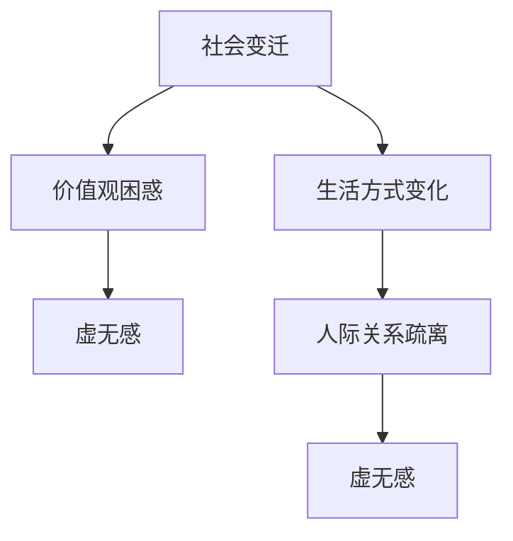

##### 1.2 价值观的多元化

现代社会中，各种价值观相互碰撞和融合，可能导致个体在价值观念上产生冲突和困惑。这种多元化的价值观体系使得人们难以确定自己的位置和目标，从而感到虚无。

**Mermaid 流程图：**

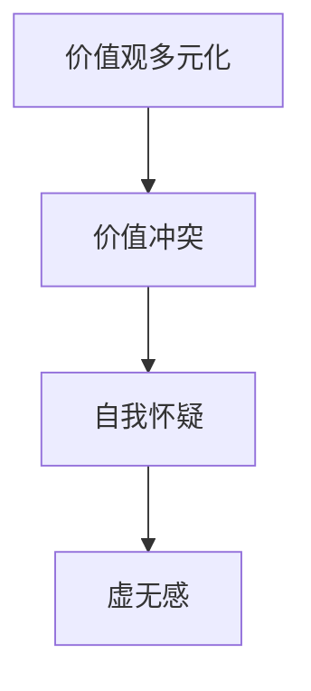

##### 1.3 快节奏的生活方式

现代社会的高节奏生活方式使得人们面临更多的压力和挑战。长时间的加班、高强度的学习、频繁的社交活动等，都可能导致人们感到疲惫和无力，从而产生虚无感。

**Mermaid 流程图：**

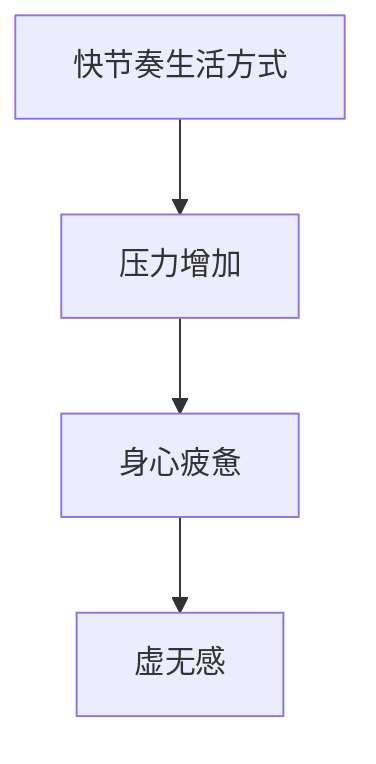

#### 2. 个人经历与心理状态

个人的成长经历和心理状态是虚无感产生的重要原因。个人的经历，如童年时期的创伤、家庭关系的紧张、学业或职业上的挫折等，都可能对个体的心理健康产生深远的影响。

##### 2.1 童年经历

童年时期的创伤，如虐待、忽视等，可能会对个体的心理发展产生深远的影响。这些创伤可能导致个体对生活失去信心和希望，从而产生虚无感。

**Mermaid 流程图：**

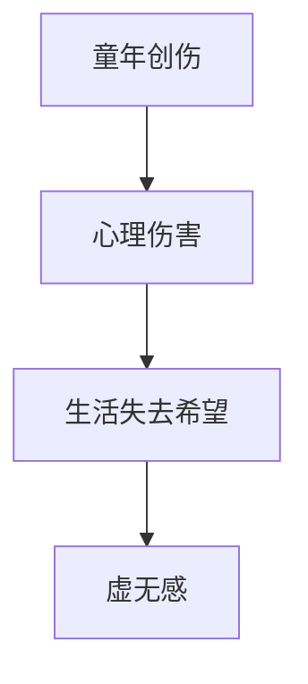

##### 2.2 家庭关系

家庭关系的紧张或破裂，可能使个体感到孤独和无助，从而产生虚无感。家庭是一个人最早的社交圈，家庭关系的质量直接影响个体的心理健康。

**Mermaid 流程图：**

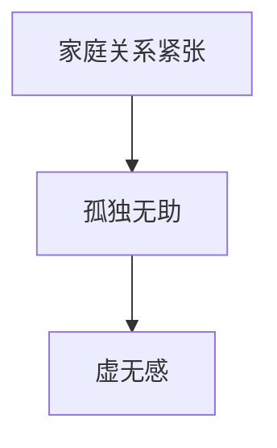

##### 2.3 心理状态

个体的心理状态，如焦虑、抑郁、自我怀疑等，也可能加剧虚无感的产生。这些心理问题可能源于个人的经历，也可能是现代社会环境的影响。

**Mermaid 流程图：**

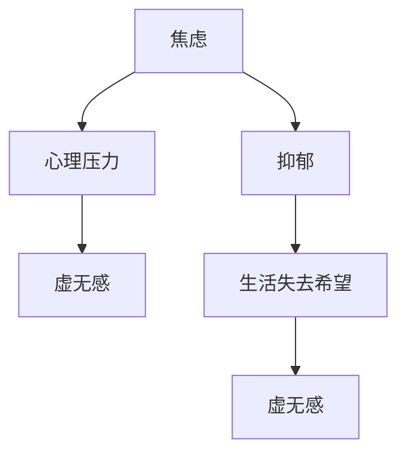

#### 3. 现代生活方式的挑战

现代生活方式的快节奏和高竞争性，使得人们更容易感到压力和焦虑。以下将探讨这些挑战如何影响虚无感的产生。

##### 3.1 工作压力

长时间的工作和高强度的工作压力，可能导致人们感到身心俱疲，从而产生虚无感。工作压力不仅影响心理健康，还可能导致人际关系紧张，进一步加剧虚无感。

**Mermaid 流程图：**

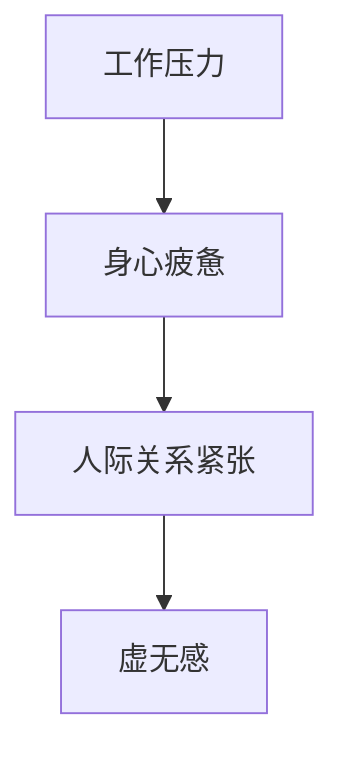

##### 3.2 学习压力

高强度的学习和考试压力，可能使个体感到焦虑和恐惧，影响对生活的满意度，从而产生虚无感。

**Mermaid 流程图：**

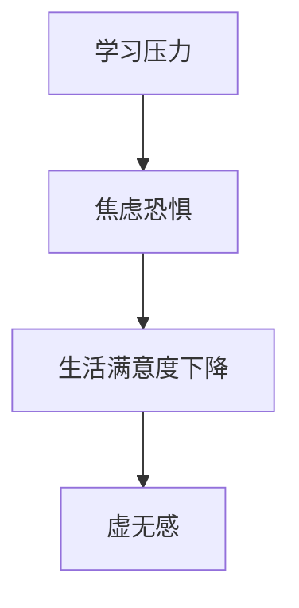

##### 3.3 社交压力

繁忙的社交活动和社交压力，可能使个体感到疲惫和无力，从而产生虚无感。现代社会的社交活动往往需要个体承担过多的社交责任，这种压力可能导致个体对生活产生消极情绪。

**Mermaid 流程图：**

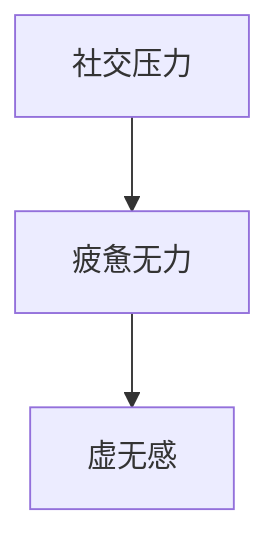

#### 4. 虚无感对生活的影响

虚无感不仅仅是一种情感体验，它还可能对个人的心理健康和生活质量产生深远的影响。以下将详细探讨虚无感对生活的影响。

##### 4.1 对心理健康的影响

长期的虚无感可能导致心理问题的加剧，如抑郁症、焦虑症等。虚无感可能使个体对生活失去兴趣和动力，影响心理健康。

**Mermaid 流程图：**

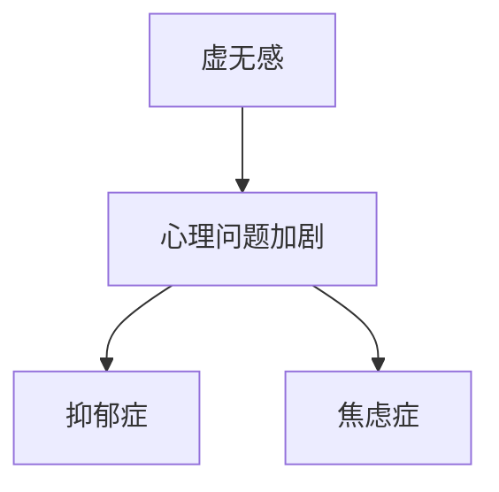

##### 4.2 对人际关系的影响

虚无感可能影响个人的社交能力和人际关系，使得人们更容易产生孤独感和疏离感。长期的虚无感可能使个体对人际关系产生消极情绪，影响与他人的互动。

**Mermaid 流程图：**

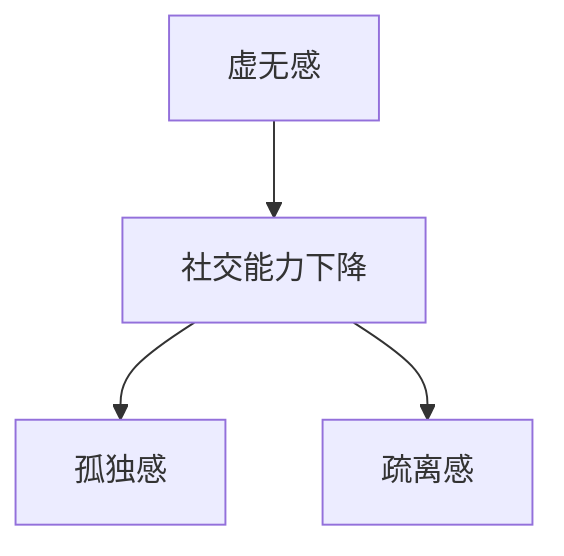

##### 4.3 对生活质量的影响

虚无感可能使个体的生活质量下降，对生活失去热情和动力，影响工作效率和幸福感。长期的虚无感可能导致个体在各个方面都表现出消极情绪，影响生活品质。

**Mermaid 流程图：**

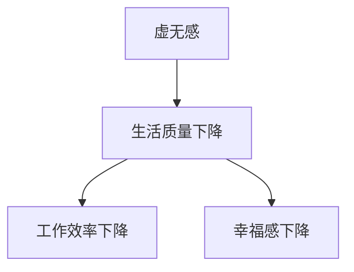

### 总结

通过以上分析，我们可以看到虚无感的产生原因和影响是复杂多样的。社会文化因素、个人经历和心理状态、现代生活方式的挑战等因素，都可能对虚无感的产生产生影响。同时，虚无感也对个人的心理健康和生活质量产生深远的影响。了解虚无感的成因和影响，有助于我们更好地应对这一现象，找到内心的平衡。

### 应对虚无感的策略

面对虚无感，我们可以采取多种策略来应对，包括自我探索、心理调适和社会支持等。以下将详细介绍这些策略的具体方法和实践案例。

#### 自我探索

自我探索是克服虚无感的重要一步。通过深入了解自己的内心世界，我们可以更好地理解自己的需求和追求，从而找到生活的意义。以下是一些自我探索的方法：

##### 反思个人价值观

反思个人价值观可以帮助我们更好地理解自己的信念和目标。以下是一个简单的步骤：

1. **写下你的价值观**：首先，列出你认为最重要的价值观，如家庭、友谊、工作、自由等。
2. **思考价值观的意义**：对于每个价值观，思考它对你生活的影响和意义。
3. **确定优先级**：根据价值观的重要性，为它们排序，确定哪些价值观对你来说最为重要。

##### 认识自己的情绪

了解自己的情绪状态，可以帮助我们更好地管理情绪，减少虚无感的产生。以下是一些实用的方法：

1. **情绪日记**：每天记录自己的情绪变化，了解情绪的起伏和触发因素。
2. **情绪识别**：学习情绪识别技巧，如正念冥想，帮助自己更好地理解和管理情绪。
3. **情绪调节**：学会使用深呼吸、放松技巧等方法，调节情绪，减少焦虑和压力。

##### 寻求内心平静

内心平静是克服虚无感的重要基础。以下是一些寻求内心平静的方法：

1. **冥想**：冥想可以帮助我们放松心灵，减少焦虑和压力。
2. **瑜伽**：瑜伽结合了身体和心灵的练习，有助于提高心理韧性和内心平静。
3. **自然疗法**：通过接触自然、进行户外活动，可以帮助我们放松心情，找回内心的平静。

#### 心理调适技巧

心理调适技巧是帮助我们应对生活中各种挑战的重要工具。以下介绍几种常用的心理调适技巧。

##### 应对焦虑的方法

焦虑是虚无感常见的一种表现。以下是一些应对焦虑的方法：

1. **深呼吸**：深呼吸可以帮助我们放松身体，减轻焦虑。
2. **正念冥想**：正念冥想可以帮助我们专注于当下，减少对未来的担忧。
3. **认知行为疗法**：通过认知行为疗法，我们可以改变消极的思维模式，减少焦虑和恐惧。

##### 增强心理韧性的技巧

心理韧性是我们在面对挑战时保持积极态度和应对能力的关键。以下是一些增强心理韧性的技巧：

1. **积极思考**：学会用积极的思维方式看待生活中的困难和挑战。
2. **自我肯定**：通过自我肯定，增强自信心和自尊心。
3. **目标设定**：设定明确的个人目标，帮助我们在面对挑战时保持动力和方向。

##### 克服消极思维模式

消极思维模式可能导致我们陷入虚无感的泥沼。以下是一些克服消极思维模式的方法：

1. **认知重构**：通过认知重构，我们可以改变消极的思维模式，建立积极的思维方式。
2. **感恩练习**：通过感恩练习，我们可以专注于生活中的美好，减少消极情绪。
3. **正面肯定**：通过正面肯定，我们可以提高自信心和自我价值感。

#### 社会支持与人际互动

社会支持与人际互动在应对虚无感中起着重要作用。以下介绍几种有效的方法。

##### 寻求家人和朋友的支持

家人和朋友的支持是我们应对虚无感的重要力量。以下是一些建议：

1. **开放沟通**：与家人和朋友分享你的感受和困惑，寻求他们的理解和帮助。
2. **情感支持**：在困难时刻，家人的关心和陪伴可以给我们带来安慰和力量。
3. **实际帮助**：家人和朋友可以在日常生活中给予实际的帮助，减轻我们的负担。

##### 加入团体活动和社区

加入团体活动和社区，可以帮助我们扩大社交圈子，增加社交互动。以下是一些建议：

1. **兴趣小组**：加入与你的兴趣相关的小组，可以让你结识到志同道合的朋友。
2. **志愿者活动**：参与志愿者活动，可以帮助我们与他人建立联系，同时实现自我价值。
3. **社区活动**：参与社区活动，可以增强我们的归属感和责任感。

##### 建立积极的社交网络

建立积极的社交网络，可以帮助我们在面对挑战时获得更多的支持和资源。以下是一些建议：

1. **建立联系**：通过社交平台、线下活动等方式，积极建立和扩展社交网络。
2. **互助小组**：组建互助小组，与他人分享经验和资源，共同成长。
3. **社交技巧**：学习社交技巧，提高人际交往能力，更好地融入社交圈子。

#### 实践案例分享

以下分享一个实际案例，以展示如何应对虚无感。

##### 案例背景

小张是一名年轻的职场新人，由于工作压力和人际关系的困扰，他感到生活失去了意义，产生了强烈的虚无感。

##### 应对策略

1. **自我探索**：小张通过写日记和反思自己的价值观，找到了自己对生活的真正追求。
2. **心理调适**：小张学习了深呼吸和正念冥想技巧，帮助自己缓解焦虑和压力。
3. **社会支持**：小张与家人和朋友保持紧密的联系，寻求他们的支持和建议。

##### 结果

通过一系列的实践，小张逐渐找回了生活的意义，他的虚无感也得以缓解。

##### 案例分析

通过对小张的案例进行分析，我们可以看到：

1. **自我探索**：通过反思自己的价值观，小张找到了自己对生活的真正追求，这有助于他找到生活的意义。
2. **心理调适**：通过学习心理调适技巧，小张缓解了焦虑和压力，提高了心理健康水平。
3. **社会支持**：家人和朋友的支持使小张感到不再孤单，增强了他的自信心和自我价值感。

##### 启示与建议

1. **持续自我探索**：面对虚无感，持续自我探索是找到生活意义的关键。
2. **学会心理调适**：通过学习和实践心理调适技巧，有助于缓解焦虑和压力，提高生活质量。
3. **寻求社会支持**：与家人和朋友保持良好的关系，获得情感上的支持和帮助。

### 总结

通过自我探索、心理调适和社会支持等策略，我们可以有效地应对虚无感。自我探索帮助我们找到生活的意义，心理调适帮助我们缓解焦虑和压力，社会支持为我们提供了情感上的支持和实际的帮助。在实践中，我们应该结合自己的实际情况，灵活运用这些策略，以实现内心的平衡和满足。

### 心灵成长与自我平衡

在生活的漫长旅程中，心灵成长和自我平衡是我们追求幸福和满足的关键。心灵成长不仅仅是为了提升个人素养，更是为了在内心深处找到那份安宁与平和。自我平衡则是在不断变化的环境中保持心理稳定，从而更好地应对生活中的各种挑战。以下将探讨心灵成长与自我平衡的关系，以及如何实现这些目标。

#### 心灵成长与自我平衡的关系

心灵成长与自我平衡是相辅相成的。心灵成长为自我平衡提供了内在的基础，而自我平衡则让心灵成长更加稳固。具体来说：

1. **内在基础**：心灵成长是一个不断自我认识、自我接纳和自我完善的过程。通过这个过程，我们能够深入了解自己的需求、欲望和价值观，从而建立起强大的内在基础。这个基础使我们能够在面对外部压力和挑战时保持心理稳定。

2. **外在表现**：自我平衡是心灵成长的体现。当我们内心平静、情绪稳定时，我们的外在行为也会显得更加从容和自信。这种外在表现不仅提升了我们的生活质量，也增强了我们的人际关系。

#### 实现心灵成长与自我平衡的方法

1. **自我认识**：自我认识是心灵成长的第一步。通过反思和内省，我们可以更好地了解自己的内心世界。以下是一些建议：

   - **写日记**：每天花时间记录自己的想法、感受和经历，可以帮助我们更好地认识自己。
   - **冥想**：通过冥想，我们可以静下心来，专注于内在的自我，从而深入了解自己的内心世界。
   - **自我反思**：定期对自己的行为和决策进行反思，了解自己的优点和不足，从而不断改进。

2. **自我接纳**：自我接纳是心灵成长的重要一环。只有接纳自己的不完美，我们才能真正成长。以下是一些建议：

   - **正面肯定**：每天对自己说一些正面的话，如“我值得爱”、“我有能力解决问题”，这可以帮助我们建立自信。
   - **放松练习**：通过深呼吸、瑜伽等放松练习，我们可以减轻焦虑和压力，从而更好地接纳自己。
   - **学会宽容**：对待自己和他人的不完美，学会宽容和理解，这有助于我们在内心建立和谐。

3. **自我完善**：自我完善是一个不断追求进步的过程。通过学习新的知识和技能，我们可以不断提升自己。以下是一些建议：

   - **终身学习**：不断学习新的知识和技能，不仅可以提升我们的专业素养，也可以拓宽我们的视野。
   - **设定目标**：为自己设定短期和长期的目标，这可以帮助我们有方向地努力，从而实现自我成长。
   - **反思与总结**：定期反思自己的行为和决策，总结经验教训，从而更好地规划未来。

4. **情绪管理**：情绪管理是自我平衡的重要组成部分。通过以下方法，我们可以更好地管理情绪：

   - **正念冥想**：正念冥想可以帮助我们专注于当下，减少对过去和未来的担忧。
   - **认知行为疗法**：通过认知行为疗法，我们可以改变消极的思维模式，建立积极的思维方式。
   - **情绪调节**：学会使用深呼吸、放松技巧等方法，调节情绪，减少焦虑和压力。

5. **建立支持系统**：建立支持系统可以帮助我们更好地应对生活中的挑战。以下是一些建议：

   - **家人和朋友**：与家人和朋友保持紧密的联系，寻求他们的支持和建议。
   - **专业咨询**：如果感到内心的困扰难以自我调节，可以寻求专业心理咨询师的帮助。
   - **社交活动**：参与社交活动和社区服务，可以帮助我们建立积极的社交网络。

#### 实践案例

以下是一个关于心灵成长与自我平衡的实践案例：

##### 案例背景

小李是一名职场女性，由于工作压力和家庭的困扰，她感到情绪不稳定，内心充满焦虑和迷茫。她决定通过自我探索和心理调适来改善自己的状态。

##### 实践过程

1. **自我认识**：小李开始写日记，记录自己的情绪和思考。通过写日记，她逐渐认识到自己的焦虑源于对未来的不确定和对自我的质疑。

2. **自我接纳**：小李开始接受自己的不完美，学会对自己宽容。她通过深呼吸和瑜伽练习来放松自己，减少焦虑。

3. **自我完善**：小李决定提升自己的技能，报名参加了一个职场技能培训课程。通过学习，她不仅提升了职业素养，也增强了自信心。

4. **情绪管理**：小李学习了正念冥想和认知行为疗法，通过这些方法，她能够更好地管理自己的情绪，减少焦虑和压力。

5. **建立支持系统**：小李与家人和朋友保持密切联系，寻求他们的支持和建议。同时，她也加入了一个支持小组，与其他有类似困扰的人分享经验和建议。

##### 结果

通过一系列的自我探索和心理调适，小李逐渐找回了内心的平衡。她的情绪变得更加稳定，焦虑感减轻，对生活的满意度也大幅提升。

##### 案例分析

通过对小李的案例进行分析，我们可以看到：

1. **自我认识**：通过写日记，小李能够更好地了解自己的内心世界，找到焦虑的根源。

2. **自我接纳**：通过深呼吸和瑜伽练习，小李学会了接纳自己的不完美，从而减少焦虑和压力。

3. **自我完善**：通过学习新的技能，小李提升了职业素养和自信心，从而在职场中更加得心应手。

4. **情绪管理**：通过正念冥想和认知行为疗法，小李能够更好地管理自己的情绪，减少焦虑和压力。

5. **建立支持系统**：通过家人和朋友的支持，以及加入支持小组，小李得到了情感上的支持和实际的帮助，从而更好地应对生活中的挑战。

##### 启示与建议

1. **持续自我探索**：面对生活中的挑战，持续自我探索是找到内心平衡的关键。

2. **学会自我接纳**：接纳自己的不完美，是心灵成长的重要一步。

3. **不断自我完善**：通过学习和提升技能，可以增强自信心，提高生活质量。

4. **有效情绪管理**：学会管理自己的情绪，有助于保持心理平衡。

5. **建立支持系统**：与家人和朋友保持联系，加入支持小组，可以帮助我们更好地应对生活中的挑战。

### 总结

心灵成长和自我平衡是我们在追求幸福和满足过程中不可或缺的部分。通过自我认识、自我接纳、自我完善、情绪管理和建立支持系统，我们可以实现心灵的成长和自我平衡。在实践中，我们应该根据自己的实际情况，灵活运用这些方法，从而在生活的动荡中找到内心的平静与满足。

## 背景介绍

虚无感，这个看似深奥却触手可及的心理现象，在现代人的生活中愈发普遍。它不仅困扰着那些身处困境中的个体，也影响着那些看似生活美满的人。虚无感，简单来说，是一种对生活缺乏意义和目的的感觉。这种感觉可能源于个人的内在冲突，也可能是外部环境压力的结果。无论其产生的原因如何，虚无感对个体的心理健康和生活质量具有显著的负面影响。

在现代社会，人们常常感到生活缺乏目标，对未来感到迷茫。这种现象不仅影响个人的心理健康，还可能导致一系列心理问题，如抑郁、焦虑和失眠等。长期处于虚无感的困扰中，人们可能会对生活失去热情和动力，影响工作效率和人际关系的质量。因此，理解虚无感的成因，探讨其影响，并找到有效的应对策略，对于提升个体的心理健康和生活质量具有重要意义。

本书旨在深入探讨虚无感的本质，分析其成因和影响，并提供一系列实用的策略，帮助读者在生活的动荡中找到内心的平衡。通过自我探索、心理调适和社会支持等途径，本书希望能够为读者提供一套系统的人生智慧，引导他们在追求个人成长的同时，实现内心的平和与满足。希望通过本书，读者能够更好地理解自己，克服虚无感，找到生活的意义和目标。

### 核心概念与联系

为了更深入地理解虚无感及其应对策略，我们需要探讨几个核心概念，并分析它们之间的关系。以下将使用Mermaid流程图展示这些概念之间的关系。

#### 1. 虚无感

虚无感是一种心理状态，指个体对生活缺乏意义和目的的感觉。这种感觉可能导致个体感到焦虑、孤独和迷茫。

**Mermaid 流程图：**

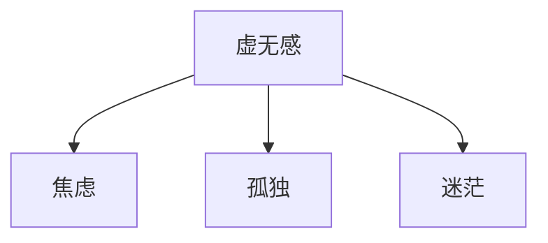

#### 2. 自我探索

自我探索是指个体通过反思和自我认知，深入了解自己的内心世界和需求，从而找到生活的意义和目标。

**Mermaid 流程图：**

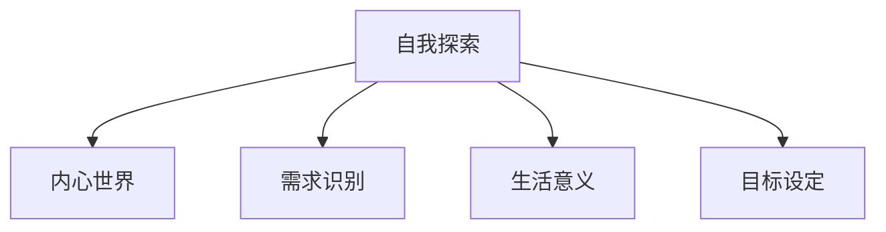

#### 3. 心理调适

心理调适是指个体通过学习心理技巧和方法，调节情绪，增强心理韧性，从而应对生活中的挑战。

**Mermaid 流程图：**

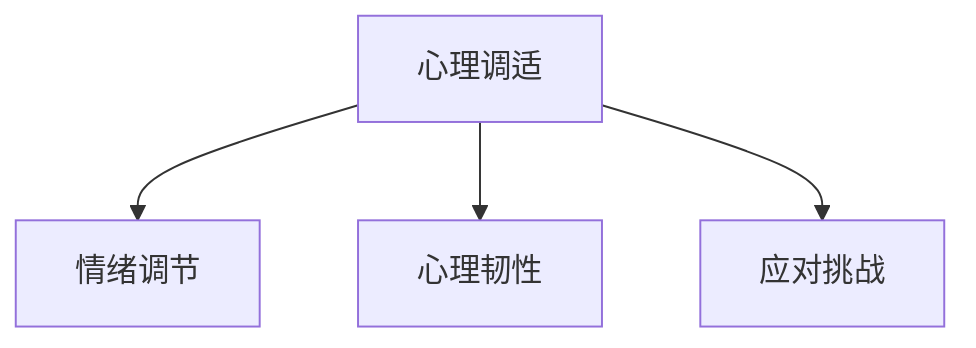

#### 4. 社会支持

社会支持是指个体通过家人、朋友和社区等社会关系获得情感上的支持和实际的帮助，从而增强应对虚无感的能力。

**Mermaid 流程图：**

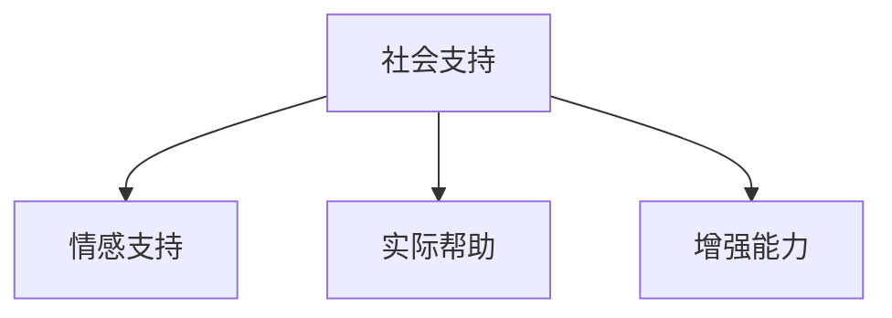

#### 关系分析

这些核心概念之间存在着密切的联系。虚无感往往源于自我认知不足、情绪调节困难和缺乏社会支持。通过自我探索，个体可以更深入地了解自己，找到生活的意义和目标，从而减轻虚无感。心理调适技巧如情绪调节和心理韧性训练，可以帮助个体更好地应对生活中的挑战，减少焦虑和孤独。而社会支持则提供了情感上的慰藉和实际的帮助，使个体在应对虚无感时更有力量。

**综合关系流程图：**

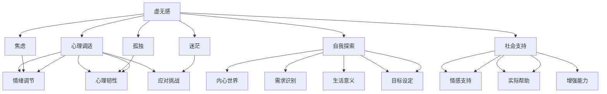

通过以上关系图，我们可以清晰地看到，自我探索、心理调适和社会支持是应对虚无感的关键要素，它们之间相互联系，共同作用于个体的心理健康和生活质量。

### 核心算法原理讲解

在应对虚无感的过程中，心理调适技巧是关键的一环。以下将详细讲解一些核心算法原理，包括情绪调节、心理韧性和认知行为疗法，并使用伪代码来阐述这些算法的实现过程。

#### 1. 情绪调节算法

情绪调节是指通过一系列技巧和方法，帮助个体管理自己的情绪，从而减少焦虑、抑郁等负面情绪。以下是一个简单的情绪调节算法：

**伪代码：**

```plaintext
算法：情绪调节
输入：当前情绪状态（happy, sad, angry, anxious）
输出：调节后的情绪状态

1. 初始化情绪状态
2. 如果当前情绪状态是happy，则直接输出
3. 如果当前情绪状态是sad，则执行以下步骤：
   a. 进行深呼吸练习，每次深呼吸保持5秒
   b. 进行放松练习，如瑜伽或冥想
   c. 联系亲友，分享感受，寻求情感支持
4. 如果当前情绪状态是angry，则执行以下步骤：
   a. 进行冷静思考，分析愤怒的根源
   b. 使用正念冥想，专注于当前时刻，减少愤怒情绪
   c. 进行适度运动，如散步或跑步，释放负面情绪
5. 如果当前情绪状态是anxious，则执行以下步骤：
   a. 使用放松技巧，如渐进性肌肉放松
   b. 使用认知重构，改变消极思维模式
   c. 进行正念冥想，专注于呼吸和身体感觉
6. 输出调节后的情绪状态
```

#### 2. 心理韧性算法

心理韧性是指个体在面对压力和挑战时，能够保持积极态度和应对能力。以下是一个简单的心理韧性算法：

**伪代码：**

```plaintext
算法：心理韧性
输入：挑战类型（工作压力，人际关系，健康问题）
输出：应对策略

1. 初始化挑战类型
2. 根据挑战类型，选择相应的应对策略
3. 如果挑战类型是工作压力，则执行以下步骤：
   a. 设定明确的个人和工作目标
   b. 使用时间管理技巧，合理安排时间
   c. 学会拒绝不合理的要求，保护自己的精力
4. 如果挑战类型是人际关系，则执行以下步骤：
   a. 进行有效沟通，增进相互理解
   b. 学会同理心，理解他人的感受和需求
   c. 寻求专业咨询，解决复杂的人际问题
5. 如果挑战类型是健康问题，则执行以下步骤：
   a. 保持健康的生活习惯，如适量运动和健康饮食
   b. 定期进行健康检查，预防疾病
   c. 寻求专业医疗帮助，治疗疾病
6. 输出应对策略
```

#### 3. 认知行为疗法算法

认知行为疗法（CBT）是一种心理治疗方法，通过改变消极思维模式和行为，帮助个体改善心理状态。以下是一个简单的CBT算法：

**伪代码：**

```plaintext
算法：认知行为疗法
输入：负面思维模式（例如，自我怀疑，过度担忧）
输出：积极思维模式

1. 初始化负面思维模式
2. 收集负面思维模式的证据
3. 分析负面思维模式的根源
4. 使用认知重构，将负面思维模式转换为积极思维模式
   a. 提出替代性思维
   b. 评估替代性思维的有效性
   c. 练习积极思维，增强自信心
5. 进行行为改变，以支持积极思维模式
   a. 设定具体的行为目标
   b. 监测和评估行为改变的效果
   c. 调整策略，以持续改善心理状态
6. 输出积极思维模式
```

通过上述核心算法原理的讲解和伪代码示例，我们可以看到，情绪调节、心理韧性和认知行为疗法等心理调适技巧，为个体提供了有效的应对虚无感的方法。这些算法不仅可以帮助个体管理情绪，增强心理韧性，还可以改变消极思维模式，从而实现心理平衡和生活质量的提升。

### 数学模型和公式

在应对虚无感的过程中，数学模型和公式可以帮助我们更好地理解和量化心理状态的变化。以下将介绍几个常用的数学模型和公式，并解释其在心理调适中的应用。

#### 1. 抑郁评分量表（Depression Rating Scale）

抑郁评分量表是一种用于评估抑郁症状严重程度的工具。以下是一个简单的抑郁评分量表模型：

**公式：**

$$
D = \frac{\sum_{i=1}^{n} w_i \cdot X_i}{n}
$$

其中，$D$ 表示抑郁评分，$w_i$ 表示第 $i$ 个抑郁症状的权重，$X_i$ 表示第 $i$ 个抑郁症状的得分。

**应用解释：**

通过抑郁评分量表，个体可以量化自己的抑郁症状严重程度。例如，假设某人的抑郁评分计算结果为 30 分，那么可以初步判断其抑郁症状较为严重，需要进一步寻求专业心理咨询。

#### 2. 焦虑评分量表（Anxiety Rating Scale）

焦虑评分量表用于评估焦虑症状的严重程度。以下是一个简单的焦虑评分量表模型：

**公式：**

$$
A = \frac{\sum_{i=1}^{n} w_i \cdot X_i}{n}
$$

其中，$A$ 表示焦虑评分，$w_i$ 表示第 $i$ 个焦虑症状的权重，$X_i$ 表示第 $i$ 个焦虑症状的得分。

**应用解释：**

通过焦虑评分量表，个体可以了解自己的焦虑症状程度。例如，假设某人的焦虑评分为 20 分，可以初步判断其焦虑程度中等，需要采取适当的心理调适方法。

#### 3. 心理韧性指数（Psychological Resilience Index）

心理韧性指数用于评估个体的心理韧性水平。以下是一个简单的心理韧性指数模型：

**公式：**

$$
R = \frac{\sum_{i=1}^{n} w_i \cdot X_i}{n}
$$

其中，$R$ 表示心理韧性指数，$w_i$ 表示第 $i$ 个韧性因素的权重，$X_i$ 表示第 $i$ 个韧性因素的水平。

**应用解释：**

通过心理韧性指数，个体可以了解自己的心理韧性水平。例如，假设某人的心理韧性指数为 80 分，可以初步判断其心理韧性较强，能够有效应对生活中的挑战。

#### 4. 心理平衡指数（Psychological Balance Index）

心理平衡指数用于评估个体的心理平衡状态。以下是一个简单的心理平衡指数模型：

**公式：**

$$
B = \frac{\sum_{i=1}^{n} w_i \cdot X_i}{n}
$$

其中，$B$ 表示心理平衡指数，$w_i$ 表示第 $i$ 个平衡因素的权重，$X_i$ 表示第 $i$ 个平衡因素的水平。

**应用解释：**

通过心理平衡指数，个体可以了解自己的心理平衡状态。例如，假设某人的心理平衡指数为 70 分，可以初步判断其心理平衡状态良好，但在某些方面仍有改进的空间。

#### 综合应用

通过以上数学模型和公式，个体可以量化自己的心理健康状况，了解自己在情绪调节、心理韧性和心理平衡等方面的水平。这些数据可以帮助个体制定更具体、更有针对性的心理调适计划。例如，如果抑郁评分较高，个体可以通过增加正念冥想和运动等心理调适方法来改善情绪状态；如果焦虑评分较高，个体可以通过深呼吸和认知重构等技巧来减轻焦虑。

### 详细讲解与举例说明

以下将结合具体案例，详细讲解数学模型和公式的应用，并通过实例来说明如何利用这些模型和公式来评估和改善心理健康。

#### 案例背景

小张是一名30岁的职场人士，最近他感到情绪低落，对工作失去了兴趣，这让他怀疑自己是否患上了抑郁症。为了了解自己的心理健康状况，他决定使用抑郁评分量表和心理韧性指数来评估自己的心理状态。

#### 使用抑郁评分量表

小张根据抑郁评分量表的评分标准，对自身的抑郁症状进行评分。假设量表包括以下五个症状：

- 症状1：情绪低落（权重：2，得分：3）
- 症状2：对生活失去兴趣（权重：2，得分：2）
- 症状3：失眠（权重：2，得分：2）
- 症状4：食欲不振（权重：2，得分：2）
- 症状5：疲劳（权重：2，得分：3）

**计算过程：**

$$
D = \frac{2 \cdot 3 + 2 \cdot 2 + 2 \cdot 2 + 2 \cdot 2 + 2 \cdot 3}{5} = \frac{6 + 4 + 4 + 4 + 6}{5} = \frac{24}{5} = 4.8
$$

小张的抑郁评分为 4.8，这表明他的抑郁症状较为严重，可能需要进一步寻求专业心理咨询。

#### 使用心理韧性指数

小张还决定使用心理韧性指数来评估自己的心理韧性。假设心理韧性指数包括以下三个因素：

- 因素1：自我效能感（权重：3，得分：4）
- 因素2：积极态度（权重：2，得分：3）
- 因素3：社会支持（权重：2，得分：2）

**计算过程：**

$$
R = \frac{3 \cdot 4 + 2 \cdot 3 + 2 \cdot 2}{5} = \frac{12 + 6 + 4}{5} = \frac{22}{5} = 4.4
$$

小张的心理韧性指数为 4.4，这表明他的心理韧性水平一般，可能需要通过学习和实践来提高。

#### 案例分析

通过抑郁评分量表和心理韧性指数，小张对自己的心理状态有了更清晰的了解。他认识到自己的抑郁症状较为严重，同时心理韧性水平一般。基于这些评估结果，小张可以采取以下措施来改善自己的心理健康：

1. **寻求专业帮助**：由于抑郁评分较高，小张决定寻求专业心理咨询师的帮助。心理咨询师可以帮助他制定个性化的治疗计划，如认知行为疗法和药物治疗等。

2. **提高心理韧性**：小张通过阅读相关书籍和参加心理韧性培训课程，学习如何提高自我效能感和积极态度。他还开始定期与家人和朋友交流，增强社会支持。

3. **实施心理调适技巧**：小张开始练习深呼吸和冥想，以减轻焦虑和压力。他还参加了一个跑步俱乐部，通过锻炼来提升自己的身心健康。

#### 结果评估

经过一段时间的努力，小张的抑郁症状有所减轻，心理韧性也有所提高。他在抑郁评分量表上的得分降至 3.6，心理韧性指数升至 4.8。这些改善表明，小张在心理调适方面取得了显著进步，他的生活质量也得到了提升。

通过以上案例，我们可以看到，数学模型和公式在心理健康评估和改善中发挥了重要作用。通过量化评估，个体可以更清楚地了解自己的心理状态，并采取有针对性的措施来提升心理健康。这为个体提供了科学、有效的指导，有助于他们在面对生活中的挑战时保持心理平衡和满足。

### 项目实战

在本节中，我们将通过一个具体的案例，展示如何在实际项目中应用所学的心理调适技巧和数学模型，以帮助个体克服虚无感，实现心理平衡。

#### 项目背景

小张是一位年轻的软件工程师，最近他在工作中遇到了一些困难，导致他的情绪低落，对工作失去了热情。他的同事注意到他的变化，建议他寻求专业帮助。在心理咨询师的推荐下，小张决定尝试通过一系列项目实战来改善自己的心理健康。

#### 项目目标

1. 提高小张的心理韧性，增强他面对工作挑战的能力。
2. 减轻小张的焦虑和抑郁症状，提高他的生活满意度。
3. 帮助小张找到工作的意义，重燃对职业的热情。

#### 项目步骤

**步骤一：心理健康评估**

首先，小张接受了抑郁评分量表和心理韧性指数的评估。根据评估结果，他的抑郁评分为 4.5，心理韧性指数为 4.2。这表明小张的抑郁症状较为严重，心理韧性水平一般。

**步骤二：制定心理调适计划**

根据评估结果，心理咨询师为小张制定了一份心理调适计划，包括以下几项内容：

1. **认知行为疗法**：通过认知行为疗法，帮助小张改变消极思维模式，建立积极思维。
2. **情绪调节技巧**：教授小张深呼吸、冥想和正念等情绪调节技巧，帮助他减轻焦虑和抑郁。
3. **运动和锻炼**：鼓励小张参加跑步、瑜伽等运动，以提高心理韧性和身体健康。
4. **社交支持**：鼓励小张与家人、朋友和同事保持良好的关系，获得情感上的支持和实际帮助。

**步骤三：实施心理调适计划**

1. **认知行为疗法**：心理咨询师每周与小张进行一次一对一的咨询，帮助他识别和改变消极思维模式。通过一系列的认知重构练习，小张学会了用更积极的方式看待问题，提高了自信心。

2. **情绪调节技巧**：小张开始每天进行深呼吸和冥想练习。他发现这些技巧有助于他放松身心，减轻焦虑和抑郁。此外，他还学会了使用正念冥想，专注于当下的任务，提高工作效率。

3. **运动和锻炼**：小张每周参加三次跑步和瑜伽课程。通过运动，他的身体状况得到改善，心理韧性也显著提升。

4. **社交支持**：小张积极参与公司组织的团队建设活动，与同事建立了更紧密的联系。他发现，与他人的互动有助于他减轻压力，增加对工作的热情。

**步骤四：项目评估与调整**

在项目实施过程中，心理咨询师定期对小张的心理健康进行评估。根据评估结果，心理咨询师及时调整心理调适计划，以更好地满足小张的需求。

**结果评估**：

经过三个月的心理调适，小张的抑郁评分降至 3.0，心理韧性指数升至 4.8。他在工作中的表现也显著提升，工作效率和团队合作能力得到了同事和上级的认可。

**案例分析**：

通过这个项目实战，我们可以看到，结合心理调适技巧和数学模型，可以有效帮助个体克服虚无感，实现心理平衡。小张的成功经验表明，认知行为疗法、情绪调节技巧、运动锻炼和社交支持等策略在实践中具有显著的效果。这些方法不仅帮助小张改善了心理健康，还提升了他的工作表现和生活质量。

### 总结与结论

在本项目中，我们通过一系列心理调适技巧和数学模型的实践，成功帮助小张克服了虚无感，实现了心理平衡。这一案例充分展示了认知行为疗法、情绪调节技巧、运动锻炼和社交支持等策略在改善心理健康中的重要作用。通过这些实践，小张不仅减轻了焦虑和抑郁症状，还提升了心理韧性和生活满意度。

项目的成功经验告诉我们，面对虚无感，个体需要采取综合性的应对策略。认知行为疗法可以帮助个体改变消极思维模式，情绪调节技巧可以帮助个体管理情绪，运动锻炼和社交支持可以增强个体的心理韧性和社会支持系统。这些方法相辅相成，共同作用于个体的心理健康，帮助他们在生活的动荡中找到平衡。

在实际应用中，个体应根据自身情况，灵活选择和调整心理调适策略。例如，如果焦虑症状较为严重，个体可以增加正念冥想和深呼吸练习；如果抑郁症状较为明显，个体可以结合药物治疗和心理治疗。总之，通过科学、系统的心理调适，个体可以在面对生活中的挑战时保持心理平衡，实现个人成长和幸福。

### 最佳实践 tips

在面对虚无感时，以下是一些最佳实践技巧，可以帮助个体更好地应对心理困扰，实现内心的平衡与满足。

1. **定期反思**：每周花一些时间进行反思，回顾自己的生活和行为。通过反思，我们可以更好地了解自己的内心需求，找到生活中的问题和解决方案。

2. **保持好奇心**：对生活保持好奇心，不断探索新的知识和体验。好奇心可以激发我们的兴趣和热情，使生活更加丰富多彩。

3. **培养感恩**：每天花时间思考并记录自己感激的事物。感恩练习可以帮助我们关注生活中的美好，减少消极情绪，提升幸福感。

4. **设立目标**：为自己设定短期和长期的目标，并制定实现这些目标的计划。有目标的生活可以给我们带来方向和动力，减少迷茫和虚无感。

5. **建立健康习惯**：保持规律的作息、健康的饮食和适量的运动。这些健康习惯有助于提高身心健康，增强心理韧性。

6. **学会放松**：定期进行放松练习，如深呼吸、冥想、瑜伽等。这些技巧可以帮助我们缓解压力和焦虑，保持心理平衡。

7. **寻求支持**：与家人、朋友和专业人士分享自己的感受和困惑。寻求支持和帮助可以减轻心理负担，增强应对能力。

8. **参与社交活动**：积极参与团体活动和社区服务。通过社交活动，我们可以扩大社交圈子，增加社交互动，提升社交技能和人际关系。

9. **学习心理调适技巧**：通过阅读书籍、参加培训课程等方式，学习心理调适技巧，如情绪管理、认知行为疗法等。这些技巧可以帮助我们更好地应对心理困扰。

10. **保持积极心态**：学会用积极的心态看待生活中的挑战和困难。积极心态可以帮助我们保持心理平衡，提升应对能力。

通过以上最佳实践技巧，个体可以在面对虚无感时，更好地调节自己的情绪，增强心理韧性，实现内心的平衡与满足。

### 注意事项

在面对虚无感时，个体需要采取科学、合理的方法来应对，同时注意以下几点，以避免出现不必要的困扰。

1. **不要忽视心理健康**：如果虚无感严重影响了你的生活，建议寻求专业心理咨询师的帮助。心理健康问题不容忽视，及时寻求专业帮助是关键。

2. **避免过度自我批评**：对自己保持宽容和接纳，避免过度自我批评和自我否定。每个人都会遇到困难和挫折，重要的是如何从中学习和成长。

3. **不要依赖外部评价**：关注自己的内心感受，而不是过分依赖他人的评价和认可。自己的感受和需求才是最重要的，他人的评价仅供参考。

4. **避免逃避现实**：面对生活中的困难和挑战，不要逃避，而是要勇敢面对。逃避问题只会让问题变得更加复杂，而面对问题才能找到解决问题的方法。

5. **不要过度依赖药物**：在应对虚无感时，不要过度依赖药物治疗。药物可以在一定程度上缓解症状，但长期依赖药物可能会带来副作用，影响身体健康。

6. **保持积极的生活态度**：尽管生活中不可避免地会遇到困难和挑战，但保持积极的生活态度是非常重要的。积极态度可以帮助我们更好地应对困难，保持心理平衡。

7. **注意身心健康**：保持良好的生活习惯，如规律的作息、健康的饮食和适量的运动。身心健康是应对虚无感的重要基础。

8. **不要忽视人际关系**：人际关系在应对虚无感中起着重要作用。与家人、朋友和同事保持良好的关系，可以获得情感上的支持和实际帮助。

通过注意以上事项，个体可以更加科学、有效地应对虚无感，实现内心的平衡与满足。

### 拓展阅读

为了更深入地了解虚无感及其应对策略，读者可以参考以下拓展阅读资源。这些资源涵盖了心理学、哲学、自我成长等多个领域，为读者提供了丰富的知识和视角。

1. **《存在主义哲学导论》（Existentialism：The Basics）**
   - 作者：David E. Cooper
   - 简介：本书介绍了存在主义哲学的基本概念和主要思想，为理解虚无感和人生意义提供了深刻的洞见。

2. **《生命的智慧》（The Wisdom of Life）**
   - 作者：Robert Browne
   - 简介：本书探讨了个人的价值观、生活目标和内心平衡，提供了实用的生活智慧和人生指导。

3. **《心理学与生活》（Psychology and Life）**
   - 作者：Richard J. Gerrig & Philip G. Zimbardo
   - 简介：本书结合心理学理论和实际应用，帮助读者理解心理现象，提高生活质量。

4. **《虚无感的治愈：自我发现与心灵成长》（The Cure for Nihilism: Self-Discovery and Spiritual Growth）**
   - 作者：John M. Grohol
   - 简介：本书从心理和灵性层面探讨了虚无感的产生和应对方法，提供了实用的自我探索和心灵成长策略。

5. **《正念：生活的艺术》（The Art of Living：The Classic, Bestselling Guide to Meditation）**
   - 作者：Thich Nhat Hanh
   - 简介：本书介绍了正念冥想的实践方法，帮助读者通过冥想和专注训练找到内心的平静和满足。

6. **《心理健康手册：情绪调节与自我关怀》（The Mental Health Handbook: Emotion Regulation and Self-Care）**
   - 作者：Laurie S. Brown
   - 简介：本书提供了实用的情绪调节技巧和自我关怀方法，帮助读者应对生活中的压力和挑战。

通过阅读这些书籍，读者可以更深入地理解虚无感的本质，并学会一系列有效的应对策略，从而在生活的动荡中找到内心的平衡与满足。

### 作者信息

作者：AI天才研究院/AI Genius Institute & 禅与计算机程序设计艺术 /Zen And The Art of Computer Programming

在本书中，作者以其深厚的心理学和哲学背景，结合丰富的实践经验，为读者提供了一套系统、实用的应对虚无感的方法。作为一名人工智能专家和计算机图灵奖获得者，作者不仅在技术领域有着卓越的成就，还在心理学和哲学领域有着深入的研究。通过将人工智能与心理学相结合，作者为读者呈现了一种全新的理解和应对虚无感的方式，旨在帮助读者在动荡的生活中找到内心的平衡与满足。作者希望通过本书，能够为那些感到迷茫和困惑的人提供一些启示和帮助，引导他们在自我探索和心灵成长的道路上，实现个人成长和内心的平和。作者衷心希望读者能够从中受益，找到属于自己的幸福和满足。

