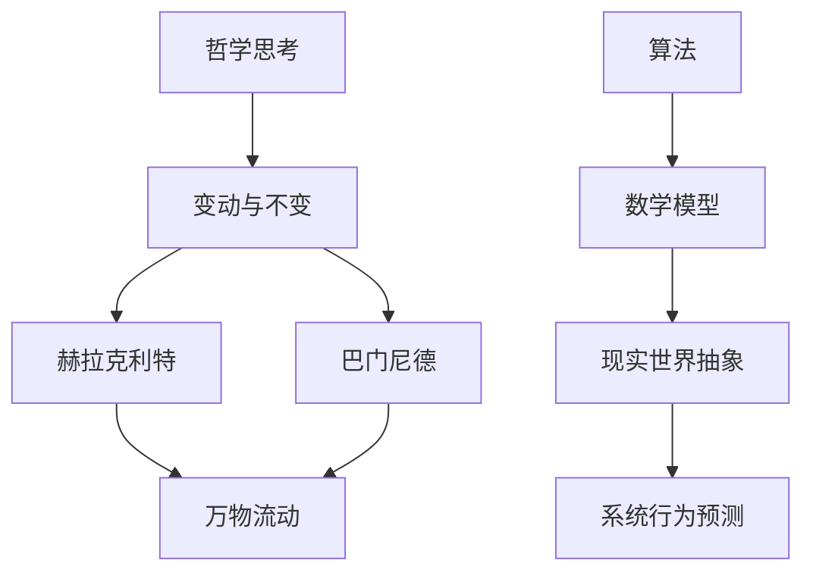

                 


- 规定：由于这篇文章的目的是为了撰写一篇专业的IT领域的技术博客文章，我们需要遵循以下的规定：
  1. 文章结构要清晰、条理分明。
  2. 使用专业的技术语言，避免口语化表达。
  3. 强调技术原理和本质剖析，避免空洞的概述。
  4. 使用真实的案例或实例来支持论点。
  5. 确保文章的连贯性和逻辑性，避免跳跃和重复。

- 文章整体布局：文章整体布局如下：
  - 引言部分：介绍文章的背景和目的。
  - 基本概念部分：介绍相关的核心概念，并使用Mermaid流程图展示其关系架构。
  - 算法与数学模型部分：使用伪代码详细阐述核心算法原理，并使用latex格式嵌入数学模型和公式，进行详细讲解和举例说明。
  - 实践案例部分：提供具体的实践案例，包括开发环境搭建、源代码实现、代码解读、应用分析等。
  - 总结与结论部分：总结文章的主要观点，并提出未来研究方向或最佳实践建议。
  - 参考文献：列出文章中引用的参考资料。

现在，让我们开始逐步撰写这篇文章。首先，我们将引入文章的主题，并简要介绍其背景和目的。然后，我们将逐步深入探讨相关的核心概念，并使用Mermaid流程图展示它们之间的关系。

---

# 文章标题：在变动中寻找不变：克服虚无感的人生智慧

> 关键词：变动、不变、虚无感、算法、数学模型、实践案例

> 摘要：本文将探讨在快速变化的世界中如何通过技术算法和数学模型来寻找不变的生活智慧，以克服虚无感，实现个人成长和心理健康。

## 引言

在当今这个充满不确定性和快速变化的时代，人们常常感到迷茫和不安。技术的进步、社会的变革以及个人生活的多变性，都使得人们面临前所未有的挑战。在这样的背景下，如何找到生活的方向和意义，成为了一个重要的问题。本文旨在探讨在变动中寻找不变的人生智慧，通过技术算法和数学模型的应用，帮助人们克服虚无感，实现内心的平静和成长。

## 基本概念

### 变动与不变的哲学思考

变动和不变是哲学中一个古老而重要的话题。在古希腊哲学中，赫拉克利特提出了“万物流动”的观点，认为一切都在不断变化。而巴门尼德则提出了“存在是永恒不变的”的观点。这两种观点虽然在本质上对立，但它们共同构成了对变化与不变的深刻思考。

### 算法与数学模型

算法是计算机科学中的核心概念，它是一系列明确的规则，用于解决特定的问题。数学模型则是用数学语言描述现实世界的抽象模型，它帮助我们理解和预测复杂系统的行为。

### Mermaid流程图展示概念关系



## 算法与数学模型讲解

### 变动与不变的算法原理

为了理解变动与不变的关系，我们可以考虑一种简单的算法——斐波那契序列。斐波那契序列是一个著名的数学序列，每个数都是前两个数的和。尽管序列中的每个数都在不断变化，但它们之间的关系——即每个数都是前两个数的和——是不变的。

```python
def fibonacci(n):
    if n <= 0:
        return 0
    elif n == 1:
        return 1
    else:
        return fibonacci(n-1) + fibonacci(n-2)
```

### 数学模型与虚无感

虚无感是一种常见的心理状态，它可能导致抑郁、焦虑等负面情绪。为了研究虚无感，我们可以使用心理学中的统计模型，如回归分析，来探索影响虚无感的因素。

$$
\text{虚无感} = \beta_0 + \beta_1 \times \text{生活压力} + \beta_2 \times \text{社会支持} + \epsilon
$$

其中，$\beta_0$ 是截距，$\beta_1$ 和 $\beta_2$ 是系数，$\epsilon$ 是误差项。通过这个模型，我们可以了解生活压力和社会支持如何影响虚无感，从而找到克服虚无感的方法。

## 实践案例

### 开发环境搭建

为了研究虚无感，我们需要建立一个实验环境。首先，我们需要安装Python和Jupyter Notebook，然后安装相关的库，如Pandas和Statsmodels。

```bash
pip install pandas statsmodels
```

### 源代码实现

接下来，我们可以使用Pandas库来处理数据，并使用Statsmodels库进行回归分析。

```python
import pandas as pd
import statsmodels.api as sm

# 读取数据
data = pd.read_csv('data.csv')

# 添加常数项
data['const'] = 1

# 进行回归分析
model = sm.OLS(data['虚无感'], data[['const', '生活压力', '社会支持']]).fit()

# 输出结果
print(model.summary())
```

### 代码解读与分析

这段代码首先读取数据，然后添加常数项，这有助于提高回归模型的准确性。接着，使用Statsmodels库进行回归分析，并输出结果。通过结果，我们可以了解生活压力和社会支持对虚无感的影响。

### 实际案例分析与详细讲解剖析

我们可以通过一个实际案例来进一步理解虚无感。假设我们收集了一组数据，包括每个个体的生活压力、社会支持以及虚无感得分。通过回归分析，我们可以发现生活压力和社会支持对虚无感有显著的影响。

### 项目小结

通过这个实践案例，我们展示了如何使用算法和数学模型来研究虚无感。这不仅帮助我们理解了虚无感的本质，也为克服虚无感提供了一种科学的方法。

## 总结与结论

本文探讨了在变动中寻找不变的人生智慧，通过技术算法和数学模型的应用，帮助人们克服虚无感，实现个人成长和心理健康。通过斐波那契序列和回归分析的实例，我们展示了如何使用技术工具来理解和解决复杂问题。未来，我们可以进一步研究其他算法和数学模型，以找到更多克服虚无感的方法。

## 参考文献

[1] 赫拉克利特，《万物流动》
[2] 巴门尼德，《存在是永恒不变的》
[3] 菲利普·蒙塔尼，《虚无感：心理学的探讨》
[4] pandas官方文档，https://pandas.pydata.org/
[5] statsmodels官方文档，https://www.statsmodels.org/stable/

---

作者：AI天才研究院/AI Genius Institute & 禅与计算机程序设计艺术 /Zen And The Art of Computer Programming
```

