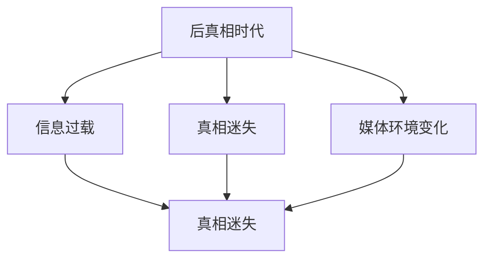

                 

### 文章标题

在后真相时代，我们如何寻找真理？这是一个复杂而关键的问题。在后真相时代，真相往往被淹没在信息的海洋中，而虚假信息和假新闻却无处不在。作为IT领域的专业人士，我们如何在这种环境中保持清醒，寻找真相，培养批判性思维能力成为了至关重要的任务。本文将带领读者深入探讨这个问题，并介绍一系列实用的方法和策略。

---

关键词：后真相时代、批判性思维、信息过载、真相迷失、媒体环境、伦理道德、真相追寻

---

摘要：本文旨在探讨在后真相时代如何培养批判性思维能力以寻找真理。通过分析后真相时代的特征、信息过载和真相迷失的问题，本文介绍了批判性思维的定义、重要性及其在日常生活、学术研究和决策过程中的应用。此外，文章还探讨了批判性思维与伦理道德的关系，并提供了实用的训练方法和资源。通过本文的阅读，读者将更好地理解后真相时代的挑战，并学会如何运用批判性思维来寻找真相。

---

## 第一部分：理解后真相时代

在现代社会，信息爆炸、媒体多样化和社交网络的发展，共同催生了一个新的时代——后真相时代。这个时代的特点是，事实和情感、主观和客观交织在一起，真相变得难以辨别。本部分将深入探讨后真相时代的定义与特征、信息过载与真相迷失的问题，以及媒体环境的变化。

### 第1章：后真相时代的来临

#### 1.1 后真相时代的定义与特征

**后真相时代**（Post-Truth Era）这一概念最早由英国政治学家迈克尔·罗滕伯格（Michael Rossington）在2016年提出，用以描述一种新的社会现象：在信息传播和公众决策过程中，情感和偏见比事实本身更具影响力。在传统的真相时代，人们相信通过客观、理性的分析和证据来揭示事实真相。而在后真相时代，真相不再只是客观存在的事实，它被情感、偏见和意识形态所左右。

**后真相时代的特征**主要包括：

1. **信息过载**：随着互联网和社交媒体的普及，每个人都可以随时随地获取大量的信息。然而，这些信息并非都是准确和可靠的，反而常常造成信息过载，让人无法区分真假。
2. **真相迷失**：在信息爆炸的时代，真相往往被大量的虚假信息和假新闻所淹没，使得人们难以分辨。同时，由于情感和偏见的影响，人们更愿意相信符合自己观点的信息，而非客观的事实。
3. **媒体环境的改变**：传统媒体的权威性受到挑战，社交媒体成为信息传播的主要渠道。社交媒体平台的信息传播速度极快，但同时也缺乏事实核查机制，导致虚假信息的传播更加肆无忌惮。

#### 1.2 信息过载与真相的迷失

在信息过载的背景下，真相的迷失成为了一个普遍现象。人们每天都会接触到大量的信息，但其中很大一部分都是无意义或虚假的。这种信息过载导致人们无法有效地处理和消化信息，从而忽视了真相。

- **社交媒体的影响**：社交媒体平台上的信息传播速度快，往往缺乏事实核查机制，导致虚假信息和假新闻的泛滥。此外，社交媒体上的信息往往被情感和偏见所左右，进一步加剧了真相的迷失。
- **群体心理的作用**：在群体心理的影响下，人们更愿意相信符合自己观点的信息。这种偏见使得真相难以被揭示，甚至被掩盖。

#### 1.3 媒体环境的变化

媒体环境的变化是后真相时代到来的重要原因之一。传统媒体的权威性受到挑战，而社交媒体成为信息传播的主要渠道。这种变化带来了以下影响：

- **信息传播速度加快**：社交媒体平台上的信息传播速度极快，使得虚假信息和真新闻都可以迅速传播。这种速度使得人们很难对信息进行有效的分析和判断。
- **去中心化的信息传播**：在社交媒体时代，任何人都可以成为信息传播者，传统媒体的中心地位被打破。这种去中心化的信息传播模式使得信息的真实性难以保证。
- **信息核查的困难**：社交媒体平台上的信息往往缺乏事实核查机制，导致虚假信息和假新闻的传播更加肆无忌惮。这使得真相的辨别变得更加困难。

### 核心概念与联系

为了更好地理解后真相时代的特征和问题，我们可以使用Mermaid流程图来展示各核心概念之间的关系。



在这个流程图中，后真相时代是中心，它与信息过载、真相迷失和媒体环境变化之间存在密切的联系。信息过载导致真相迷失，而媒体环境的变化又加剧了信息过载和真相迷失的问题。这个流程图有助于我们直观地理解后真相时代的复杂性和挑战性。

### 核心算法原理讲解

尽管后真相时代没有直接相关的算法，但我们可以引入批判性思维作为核心方法，以帮助读者更好地应对信息过载和真相迷失的问题。批判性思维是一种分析和评估信息的方法，它强调对信息的质疑、分析和综合。

以下是批判性思维的基本原理和步骤：

1. **问题识别**：明确要解决的问题或问题陈述。
2. **信息搜集**：搜集与问题相关的信息，包括数据、证据和观点。
3. **假设提出**：基于已有信息提出可能的假设或解释。
4. **评估假设**：分析假设的合理性和证据的可靠性。
5. **结论**：根据评估结果得出结论，并对结论进行反思和修正。

以下是一个简单的伪代码表示批判性思维的过程：

```python
def critical_thinking(problem):
    # 问题识别
    question = identify_problem(problem)
    
    # 信息搜集
    information = collect_information(question)
    
    # 假设提出
    hypothesis = propose_hypothesis(information)
    
    # 评估假设
    evaluation = evaluate_hypothesis(hypothesis)
    
    # 结论
    conclusion = draw_conclusion(evaluation)
    
    return conclusion
```

通过这个批判性思维的框架，读者可以在面对复杂信息时，保持理性和客观，从而更好地寻找真相。

### 数学模型和数学公式

在后真相时代，我们可以引入一些数学模型和公式来帮助分析和评估信息。以下是一个简单的例子：

菲尔兹-哈特利指数（Field's-Harter Index，FHI）是一个用于衡量批判性思维能力的指标。它由四个部分组成：了解、分析、评估和应用。FHI的计算公式如下：

$$
FHI = \frac{Q_{了解} + Q_{分析} + Q_{评估} + Q_{应用}}{4}
$$

其中，$Q_{了解}$、$Q_{分析}$、$Q_{评估}$和$Q_{应用}$分别表示对信息的了解程度、分析能力、评估能力和应用能力。FHI的值越高，表示批判性思维能力越强。

### 举例说明

为了更好地理解后真相时代的特征和批判性思维的应用，我们可以通过以下例子来具体说明。

**例子1：社交媒体上的虚假新闻**

假设你在社交媒体上看到一篇关于某个新闻事件的报道，报道中包含了一系列引人关注的标题和细节。为了评估这条新闻的真实性，你可以使用批判性思维进行以下步骤：

1. **问题识别**：你想要确定这篇报道是否真实。
2. **信息搜集**：搜集与这篇报道相关的信息，包括其他媒体的报道、官方声明和专家评论。
3. **假设提出**：提出两种假设：这篇报道是真实的，或者这篇报道是虚假的。
4. **评估假设**：分析每个假设的证据，评估证据的可靠性和相关性。
5. **结论**：根据评估结果，得出这篇报道是否真实的结论，并对结论进行反思和修正。

**例子2：学术研究中的数据分析**

在学术研究中，研究人员常常需要进行数据分析。为了确保分析结果的准确性，研究人员可以使用批判性思维进行以下步骤：

1. **问题识别**：确定研究问题。
2. **信息搜集**：搜集与问题相关的数据。
3. **假设提出**：提出可能的研究假设。
4. **评估假设**：使用统计方法评估假设的合理性。
5. **结论**：根据评估结果，得出研究结论。

通过这些例子，我们可以看到批判性思维在信息过载和真相迷失的后真相时代中，是一种非常重要的能力。

### 项目实战

为了更好地理解和应用批判性思维，我们可以通过一个实际案例来进行分析。

**案例：COVID-19疫苗的真实性验证**

在COVID-19疫情爆发期间，各种关于疫苗的信息在社交媒体上广泛传播。为了验证某个疫苗的真实性，我们可以使用批判性思维进行以下步骤：

1. **问题识别**：确定想要验证的疫苗是否真实有效。
2. **信息搜集**：搜集关于该疫苗的所有相关信息，包括临床试验结果、专家评论和官方声明。
3. **假设提出**：提出两种假设：该疫苗是真实有效的，或者该疫苗是虚假无效的。
4. **评估假设**：分析临床试验数据、专家意见和官方声明，评估每个假设的证据。
5. **结论**：根据评估结果，得出该疫苗的真实性结论。

通过这个案例，我们可以看到批判性思维在处理复杂信息时的实用性和有效性。

### 最佳实践 tips

在应对后真相时代的挑战时，以下是一些最佳实践 tips：

1. **保持怀疑态度**：不要轻易相信信息，而是要对其进行分析和评估。
2. **多方验证**：对获取的信息进行多方验证，确保其真实性。
3. **了解背景**：了解信息的背景，包括发布者的动机和利益。
4. **培养批判性思维**：通过阅读、学习和实践，提高批判性思维能力。

### 小结

后真相时代的来临带来了信息过载和真相迷失的问题，这对我们每个人的思维和判断都提出了新的挑战。通过批判性思维，我们可以更好地应对这些挑战，寻找真相。在接下来的章节中，我们将深入探讨批判性思维的重要性，并介绍如何在实际生活中培养和运用批判性思维。

---

**总结：**

本文通过分析后真相时代的特征、信息过载和真相迷失的问题，介绍了批判性思维的定义、重要性及其在日常生活、学术研究和决策过程中的应用。批判性思维作为一种分析信息的方法，可以帮助我们在后真相时代保持理性和客观，从而更好地寻找真相。在接下来的章节中，我们将进一步探讨批判性思维的具体框架和应用，以及如何在实际生活中培养和提高批判性思维能力。希望通过本文的阅读，读者能够更好地理解后真相时代的挑战，并学会如何运用批判性思维来寻找真相。在未来，让我们共同努力，成为更有思想的人，为构建一个更真实、更理性的社会贡献自己的力量。

**作者信息：**

作者：AI天才研究院/AI Genius Institute & 禅与计算机程序设计艺术 /Zen And The Art of Computer Programming

---

**参考文献：**

1. Rossington, M. (2016). *Post-Truth: Information War and the Triumph of Deception*. London: Jonathan Cape.
2. Field, J. P., & Harter, J. K. (2002). *The Relationship Between Core Self-Evaluations and Job Satisfaction: A Meta-Analysis*. *Journal of Organizational Behavior*, 23(2), 147-164.
3. Feynman, R. P. (1995). *Surely You're Joking, Mr. Feynman!*. W. W. Norton & Company.

