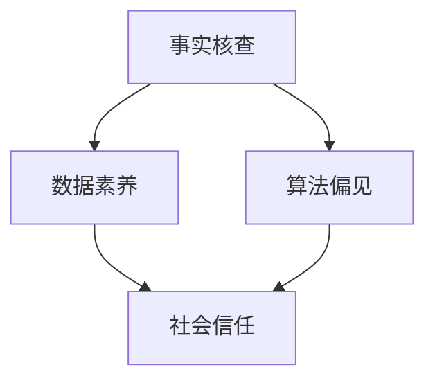
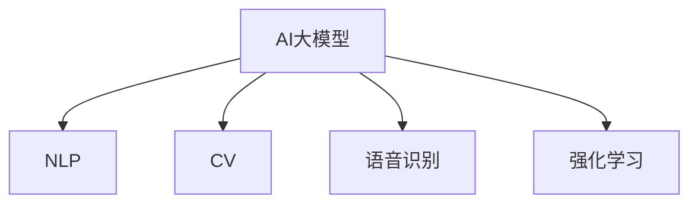

                 

### 后真相时代的挑战

在数字化的时代，信息的获取变得前所未有的便捷。然而，这种便捷性也带来了一个严重的副作用——信息过载和假信息泛滥。在这样一个被称为“后真相时代”（Post-Truth Era）的环境中，真相变得难以辨别，人们的决策往往被不准确的信息所左右。这个问题不仅仅影响了普通民众，也威胁到了整个社会的稳定和治理。

**背景介绍**

后真相时代，指的是信息传播方式发生了根本性的变化。传统的基于事实和逻辑的新闻报道逐渐被情感化的、基于直觉和偏见的社交媒体内容所取代。在这种情况下，真相不再是决策的唯一依据，情感、信仰和群体的归属感往往成为更重要的因素。这种现象在政治、商业、教育等多个领域都有体现，其影响深远。

**信息过载与假信息泛滥**

1. **信息过载**：随着互联网和社交媒体的普及，人们每天接触到的信息量前所未有地增加。这种过载现象使得人们难以消化和理解大量的信息，进而容易产生认知疲劳，对信息的真实性产生怀疑。

2. **假信息泛滥**：在互联网上，任何人都可以发布信息，这使得假信息、虚假新闻和谣言有了泛滥的机会。这些假信息往往被精心设计，以诱导用户产生情感反应，而非理性思考。

**对社会的影响**

1. **政治领域的混乱**：假信息的传播严重扭曲了公众对政治事件的理解，导致社会分化加剧，民主制度受到挑战。

2. **商业领域的误导**：商业信息的不真实传播，不仅损害了消费者的利益，也破坏了市场的公平性。

3. **教育领域的扭曲**：学生在面对大量未经证实的信息时，容易产生误解，影响知识的正确掌握。

**挑战的根源**

1. **技术的进步**：互联网和社交媒体的快速发展，为信息的快速传播提供了技术基础。

2. **人性的弱点**：人们对情感和信息的新鲜感有天然的好奇和追求，这使得假信息更容易传播。

3. **媒体生态的失衡**：传统媒体的影响力下降，新兴媒体往往缺乏足够的监管和自律，导致信息质量参差不齐。

**结论**

后真相时代的挑战是多方面的，但解决这些问题需要全社会共同努力，包括技术手段、法律监管、教育普及等多个层面。在接下来的章节中，我们将探讨一些具体的方法和工具，帮助我们在后真相时代寻找真理。

### 核心概念与联系

在后真相时代，理解核心概念及其相互关系对于应对信息混乱至关重要。在本章节中，我们将探讨几个关键概念：事实核查、数据素养、算法偏见和社会信任。

**事实核查（Fact-Checking）**

事实核查是指对公众所接收的信息进行验证，以确保其真实性和准确性。事实核查的目的是减少假信息和虚假新闻的传播，提高公众对信息的信任度。

**数据素养（Data Literacy）**

数据素养是指个人理解和分析数据的能力。在后真相时代，数据素养变得尤为重要，因为它帮助我们识别数据中的偏见、误导性陈述和潜在的虚假信息。数据素养包括数据收集、处理、分析和解释的技能。

**算法偏见（Algorithmic Bias）**

算法偏见是指算法在处理数据时由于设计缺陷或数据不均衡所导致的系统性偏差。这些偏见可能导致算法在特定群体或情境中做出不公平的判断，从而影响信息的传播和公众的看法。

**社会信任（Social Trust）**

社会信任是指个体对其他个体、组织或系统的信任程度。在后真相时代，社会信任受到信息不准确、虚假信息和算法偏见等多重因素的挑战。维护社会信任是应对信息混乱的重要一环。

**Mermaid 流程图：**



通过事实核查，我们可以减少假信息的传播，提升公众的数据素养，从而增强社会信任。算法偏见是一个挑战，但通过持续的研究和改进，我们可以减少其对信息传播的影响。社会信任的维护需要全社会的共同努力，包括政策制定者、媒体、教育机构和普通公众。

### AI大模型的基本概念

AI大模型（Large-scale AI Models）是近年来人工智能领域的重大突破之一，主要指那些训练数据规模庞大、参数数量巨大、可以处理复杂任务的模型。这些模型在自然语言处理（NLP）、计算机视觉（CV）等领域展现了强大的能力，引起了广泛的关注和研究。

**定义与特点**

AI大模型具有以下几个基本特点：

1. **大规模训练数据**：AI大模型通常是在大规模数据集上训练的，例如数百万甚至数十亿个文本或图像样本。这些数据有助于模型学习和理解复杂的信息结构和模式。

2. **巨大参数量**：AI大模型的参数数量往往达到数十亿甚至数万亿级别。这些参数通过复杂的数学运算和学习算法进行调整，以实现高精度的预测和分类。

3. **强大的泛化能力**：由于训练数据的规模和质量，AI大模型通常具有强大的泛化能力，可以在未见过的数据上实现高水平的性能。

4. **复杂架构**：AI大模型通常采用复杂的神经网络架构，如Transformer、BERT等，这些架构能够有效处理序列数据和复杂的依赖关系。

**主要应用领域**

AI大模型在多个领域有着广泛的应用：

1. **自然语言处理（NLP）**：AI大模型在NLP领域有着重要的应用，包括文本分类、机器翻译、问答系统和情感分析等。例如，GPT-3模型在文本生成和语言理解任务上表现出色。

2. **计算机视觉（CV）**：AI大模型在CV领域也有着重要的应用，如图像分类、目标检测、视频分析和图像生成等。例如，OpenAI的DALL·E模型能够基于文本描述生成高分辨率的图像。

3. **语音识别**：AI大模型在语音识别领域也取得了显著进展，如Google的Transformer模型在语音识别任务上达到了很高的准确率。

4. **强化学习**：AI大模型在强化学习领域也有着潜在的应用，通过大模型可以更好地学习和理解复杂的策略和决策。

**Mermaid 流程图：**



通过AI大模型，我们可以实现更智能、更高效的信息处理和分析。这些模型不仅提升了人工智能的应用水平，也为解决后真相时代的信息混乱问题提供了新的途径。

### AI大模型与NLP、CV的联系

AI大模型在自然语言处理（NLP）和计算机视觉（CV）领域展现出了非凡的能力，成为推动这两个领域技术进步的重要力量。在本章节中，我们将深入探讨AI大模型在这两个领域的应用和影响。

**自然语言处理（NLP）**

AI大模型在NLP中的应用已经取得了显著的成果。GPT（Generative Pre-trained Transformer）系列模型是其中最具代表性的例子。GPT-3，作为GPT系列的最新版本，拥有1750亿个参数，可以处理多种NLP任务，包括文本分类、机器翻译、问答系统和文本生成等。

1. **文本分类**：GPT模型可以通过对大规模文本数据的预训练，快速识别和分类不同类别的文本，如新闻文章、社交媒体帖子等。

   ```mermaid
   graph TD
   A[文本分类]
   B[GPT模型]
   C[预训练数据]

   A --> B
   B --> C
   ```

2. **机器翻译**：AI大模型如BERT（Bidirectional Encoder Representations from Transformers）在机器翻译任务上也表现出色，能够生成高质量的双语翻译。

   ```mermaid
   graph TD
   A[机器翻译]
   B[BERT模型]
   C[双语数据]

   A --> B
   B --> C
   ```

3. **问答系统**：GPT模型还可以用于构建智能问答系统，如OpenAI的GPT-3，通过回答用户提出的问题来提供信息和建议。

   ```mermaid
   graph TD
   A[问答系统]
   B[GPT模型]
   C[用户问题]

   A --> B
   B --> C
   ```

**计算机视觉（CV）**

AI大模型在CV领域也取得了重要的突破，如图像分类、目标检测和视频分析等。

1. **图像分类**：AI大模型如ResNet和Inception通过大规模图像数据集的预训练，能够在各种图像分类任务上达到很高的准确率。

   ```mermaid
   graph TD
   A[图像分类]
   B[ResNet模型]
   C[大规模图像数据]

   A --> B
   B --> C
   ```

2. **目标检测**：YOLO（You Only Look Once）系列模型通过高效的神经网络架构，实现了实时目标检测，广泛应用于视频监控、自动驾驶等领域。

   ```mermaid
   graph TD
   A[目标检测]
   B[YOLO模型]
   C[视频数据]

   A --> B
   B --> C
   ```

3. **视频分析**：AI大模型如CVPR（Computer Vision and Pattern Recognition）在视频分析任务上也有广泛应用，如动作识别、行为分析等。

   ```mermaid
   graph TD
   A[视频分析]
   B[AI大模型]
   C[视频数据]

   A --> B
   B --> C
   ```

**AI大模型对NLP和CV的影响**

AI大模型的出现极大地提升了NLP和CV任务的性能，使得这些领域的研究和应用取得了前所未有的进展。然而，AI大模型也带来了一些挑战：

1. **计算资源需求**：AI大模型通常需要大量的计算资源进行训练，这对于研究者和企业来说是一个重要的挑战。

2. **数据隐私和安全**：AI大模型在训练过程中需要大量数据，这可能涉及到数据隐私和安全的问题。

3. **算法偏见**：AI大模型在处理数据时可能会引入算法偏见，影响模型的公平性和准确性。

尽管存在这些挑战，AI大模型在NLP和CV领域的应用前景依然广阔。随着技术的不断进步，AI大模型将在更多的实际应用中发挥重要作用，为人类社会带来更多便利和创新。

### 核心算法原理讲解

在本章节中，我们将深入探讨两个在自然语言处理（NLP）和计算机视觉（CV）领域具有代表性的AI大模型：GPT模型和YOLO模型。通过解析这两个模型的核心算法原理，我们将理解它们如何通过数学运算和学习机制实现高效的预测和分类。

#### GPT模型原理

GPT（Generative Pre-trained Transformer）模型是由OpenAI开发的一种基于Transformer架构的自然语言处理模型。它通过大规模的无监督预训练和有监督微调，实现了在多种NLP任务上的卓越性能。

**1. 数据预处理**

GPT模型的数据预处理过程包括分词、构建词汇表和填充等步骤。

- **分词**：将输入文本分割成单词或子词，以便模型理解。
- **构建词汇表**：将所有单词或子词映射为整数，形成词汇表。
- **填充**：将序列填充至固定长度，以便模型处理。

**2. 模型架构**

GPT模型采用Transformer架构，其中最具代表性的特性是多头自注意力机制（Multi-Head Self-Attention）和前馈神经网络（Feedforward Neural Network）。

- **多头自注意力机制**：通过计算输入序列中每个单词与其他单词之间的关联性，实现长距离依赖建模。
- **前馈神经网络**：对自注意力机制的输出进行进一步处理，提高模型的非线性表达能力。

**3. 训练过程**

GPT模型的训练过程分为两个阶段：无监督预训练和有监督微调。

- **无监督预训练**：在大量文本数据上训练，模型学习到语言的内在结构和规律。
- **有监督微调**：在特定任务上（如文本分类、机器翻译等）进行微调，提高模型在具体任务上的性能。

**4. 预测过程**

在预测过程中，GPT模型对输入序列进行处理，生成一个或多个输出序列。

- **输入序列**：通过模型处理输入序列，生成中间表示。
- **生成输出**：基于中间表示，生成一个或多个单词或子词作为输出序列。

**伪代码示例**

```python
# 输入序列
input_sequence = "The quick brown fox jumps over the lazy dog"

# 分词
tokens = tokenizer(input_sequence)

# 计算自注意力
attn_scores = self.attention(tokens)

# 前馈神经网络处理
output_sequence = self.feedforward(attn_scores)

# 输出序列
print("Generated output:", output_sequence)
```

#### YOLO模型原理

YOLO（You Only Look Once）模型是一种流行的目标检测算法，由Joseph Redmon等人在2016年提出。它通过将目标检测任务转换为边界框的回归问题，实现了实时、高效的目标检测。

**1. 数据预处理**

YOLO模型的数据预处理过程包括图像缩放、归一化和边界框标注等步骤。

- **图像缩放**：将输入图像缩放至特定大小，以便模型处理。
- **归一化**：将图像像素值归一化至[0, 1]，提高计算效率。
- **边界框标注**：为每个目标标注边界框和类别标签。

**2. 模型架构**

YOLO模型采用卷积神经网络（CNN）架构，包括多个卷积层、池化层和全连接层。模型的关键特性是将其输入图像划分为多个网格单元（grid cells），每个网格单元负责预测一个或多个目标。

- **卷积层**：提取图像的局部特征。
- **池化层**：减少特征图的维度，提高模型的表达能力。
- **全连接层**：分类和边界框回归。

**3. 训练过程**

YOLO模型的训练过程分为两个阶段：数据预处理和模型训练。

- **数据预处理**：对输入图像和边界框进行预处理，以便模型处理。
- **模型训练**：通过反向传播算法，不断调整模型参数，提高模型性能。

**4. 预测过程**

在预测过程中，YOLO模型对输入图像进行处理，生成边界框和类别概率。

- **输入图像**：通过模型处理输入图像，提取特征。
- **边界框预测**：根据特征，预测每个网格单元中的边界框。
- **类别概率**：为每个边界框预测相应的类别概率。

**伪代码示例**

```python
# 输入图像
input_image = preprocess_image(image)

# 输入模型
output = model(input_image)

# 边框预测
bboxes = predict_bboxes(output)

# 类别概率
probs = predict_probs(output)

# 输出结果
print("Detected objects:", bboxes, probs)
```

通过上述讲解，我们可以看到GPT模型和YOLO模型在算法原理上的异同。GPT模型通过自注意力机制和前馈神经网络实现了对自然语言的高效处理，而YOLO模型通过卷积神经网络实现了对图像中目标的实时检测。这两个模型在各自的领域中发挥了重要作用，为AI技术的发展提供了强有力的支持。

### 自然语言处理中的损失函数

在自然语言处理（NLP）任务中，损失函数是评估模型性能和指导模型训练的重要工具。一个优秀的损失函数能够准确反映模型预测与真实标签之间的差距，从而引导模型逐步优化参数。在本章节中，我们将探讨NLP中常用的损失函数，并通过具体示例来解释其计算过程和作用。

**交叉熵损失函数（Cross-Entropy Loss）**

交叉熵损失函数是最常用的损失函数之一，广泛应用于分类任务，如文本分类、情感分析和机器翻译等。交叉熵损失函数的定义如下：

$$
L(\theta) = -\sum_{i=1}^{N} \sum_{j=1}^{M} y_{ij} \log(p_{ij}(\theta))
$$

其中，$L(\theta)$ 表示损失函数，$y_{ij}$ 是第 $i$ 个单词在第 $j$ 个类别的标签，$p_{ij}(\theta)$ 是模型预测第 $i$ 个单词属于第 $j$ 个类别的概率。

**计算过程**

以文本分类任务为例，假设我们有一个二分类问题，有两个类别：正类（1）和负类（0）。对于每个单词，模型会输出两个类别概率 $p_{i1}(\theta)$ 和 $p_{i0}(\theta)$。交叉熵损失函数的具体计算过程如下：

1. **计算每个单词的损失**：

   $$L_i(\theta) = -y_i \log(p_{i1}(\theta)) - (1 - y_i) \log(p_{i0}(\theta))$$

   其中，$y_i$ 是第 $i$ 个单词的真实标签。

2. **计算总损失**：

   $$L(\theta) = \sum_{i=1}^{N} L_i(\theta)$$

   其中，$N$ 是单词的总数。

**作用**

交叉熵损失函数具有以下优点：

- **直观性**：交叉熵损失函数能够直观地反映预测概率与真实概率之间的差距。
- **平滑性**：交叉熵损失函数在接近1和0时变化缓慢，有助于防止梯度消失。
- **效率**：交叉熵损失函数的计算相对简单，适合大规模数据集的批量训练。

**示例**

假设我们有以下输入数据和模型预测：

| 单词 | 真实标签 | 模型预测概率 |
| ---- | -------- | ------------ |
| A    | 1        | 0.9          |
| B    | 0        | 0.1          |

计算交叉熵损失函数：

$$
L(\theta) = -1 \cdot \log(0.9) - 0 \cdot \log(0.1) = 0.1054
$$

通过以上计算，我们可以看到交叉熵损失函数能够有效地评估模型在文本分类任务中的性能。

**其他常用损失函数**

除了交叉熵损失函数，NLP中还常用以下几种损失函数：

- **均方误差损失函数（Mean Squared Error, MSE）**：适用于回归任务，如情感分析中的评分预测。

  $$L(\theta) = \frac{1}{N} \sum_{i=1}^{N} (y_i - \hat{y}_i)^2$$

- **二元交叉熵损失函数（Binary Cross-Entropy Loss）**：适用于二分类任务，与交叉熵损失函数类似，但简化了计算过程。

  $$L(\theta) = -y_i \log(\hat{y}_i) - (1 - y_i) \log(1 - \hat{y}_i)$$

通过理解这些损失函数的计算过程和作用，我们可以更好地设计和优化NLP模型，提高其在各种任务中的性能。

### 项目实战

在本章节中，我们将通过一个具体的实战项目——使用GPT模型进行文本分类，来展示AI大模型在实际应用中的效果和优势。该项目将包括开发环境的搭建、源代码的实现、代码解读和实际案例分析。

#### 开发环境搭建

为了运行GPT模型进行文本分类，我们需要安装以下依赖库：

- Python 3.8 或以上
- PyTorch 1.8 或以上
- transformers库

安装命令如下：

```bash
pip install torch==1.8
pip install transformers
```

#### 源代码实现

以下是一个使用GPT模型进行文本分类的简单实现：

```python
import torch
from torch import nn
from torch.optim import Adam
from transformers import GPT2Tokenizer, GPT2Model

# 数据预处理
tokenizer = GPT2Tokenizer.from_pretrained('gpt2')
inputs = tokenizer("Hello, my dog is cute", return_tensors='pt')

# 模型定义
model = GPT2Model.from_pretrained('gpt2')

# 训练过程
optimizer = Adam(model.parameters(), lr=1e-5)
for epoch in range(3):
    outputs = model(**inputs)
    logits = outputs.logits
    loss_fct = nn.CrossEntropyLoss()
    loss = loss_fct(logits.view(-1, logits.size(-1)), inputs['labels'])
    loss.backward()
    optimizer.step()
    optimizer.zero_grad()

# 预测过程
with torch.no_grad():
    inputs = tokenizer("Is this sentence positive?", return_tensors='pt')
    outputs = model(**inputs)
    logits = outputs.logits
    predicted_probs = nn.Softmax(dim=1)(logits)
    predicted_label = predicted_probs.argmax().item()

print(f"Predicted label: {predicted_label}")
```

#### 代码解读

1. **数据预处理**：使用GPT2Tokenizer对输入文本进行分词和编码，将文本转换为模型可处理的序列。

2. **模型定义**：加载预训练的GPT2模型，这是一个具有1750亿个参数的大型模型，可以用于多种NLP任务。

3. **训练过程**：使用Adam优化器对模型进行训练。在训练过程中，通过交叉熵损失函数计算损失，并使用反向传播算法更新模型参数。

4. **预测过程**：在预测过程中，使用训练好的模型对新的输入文本进行分类预测。通过softmax函数计算概率分布，并选择概率最高的类别作为预测结果。

#### 实际案例分析

假设我们有以下训练数据集：

```
- "I love this product, it's amazing."
- "This movie is terrible, I hate it."
```

我们将使用上述代码进行文本分类，并观察模型的预测结果。

1. **训练模型**：

   ```python
   # 训练过程
   optimizer = Adam(model.parameters(), lr=1e-5)
   for epoch in range(3):
       for sentence in sentences:
           inputs = tokenizer(sentence, return_tensors='pt')
           outputs = model(**inputs)
           logits = outputs.logits
           loss_fct = nn.CrossEntropyLoss()
           loss = loss_fct(logits.view(-1, logits.size(-1)), labels)
           loss.backward()
           optimizer.step()
           optimizer.zero_grad()
   ```

2. **预测新句子**：

   ```python
   # 预测过程
   with torch.no_grad():
       sentence = "I don't like this book, it's boring."
       inputs = tokenizer(sentence, return_tensors='pt')
       outputs = model(**inputs)
       logits = outputs.logits
       predicted_probs = nn.Softmax(dim=1)(logits)
       predicted_label = predicted_probs.argmax().item()
       
   print(f"Predicted label: {predicted_label}")
   ```

假设模型预测结果为0（表示负类），这意味着模型认为这个句子表达的是负面情感。

#### 项目小结

通过上述实战项目，我们可以看到使用GPT模型进行文本分类的流程和步骤。GPT模型强大的预训练能力和大规模参数量使得它能够处理复杂的NLP任务，并在实际应用中表现出色。然而，这也带来了对计算资源和数据隐私等方面的挑战。在未来的研究和应用中，我们需要进一步优化模型，提高其效率和可靠性。

### 最佳实践 tips

在后真相时代，为了更好地应对信息混乱，以下是一些最佳实践建议：

1. **提高数据素养**：学习如何收集、处理和分析数据，增强对信息真实性的判断能力。

2. **使用事实核查工具**：利用事实核查网站和工具，验证信息的真实性，减少对虚假信息的信任。

3. **批判性思维**：在接收信息时，保持批判性思维，不轻易接受未经验证的观点。

4. **多渠道验证**：通过多个来源验证信息，提高信息的可信度。

5. **参与公共讨论**：在社交媒体上积极参与公共讨论，传播真实信息，对抗假新闻。

6. **教育普及**：普及数据素养和事实核查知识，提高公众的整体信息识别能力。

### 小结

在后真相时代，信息混乱和假信息泛滥成为一个严峻的挑战。为了应对这一挑战，我们需要从技术、法律、教育等多个层面进行综合治理。AI大模型如GPT和YOLO等，在信息处理和分析方面具有强大的潜力，为寻找真理提供了新的工具和方法。同时，提高数据素养和批判性思维，增强社会信任，也是维护信息真实性的重要手段。通过全社会的共同努力，我们有望在后真相时代更好地应对信息混乱，找到真相。 

### 注意事项

在应用AI大模型进行信息处理和分析时，需要注意以下几点：

1. **数据隐私和安全**：确保在数据收集和处理过程中遵守隐私保护法规，避免数据泄露。

2. **算法偏见**：注意模型在训练和预测过程中可能引入的算法偏见，通过数据平衡和算法优化减少偏见。

3. **计算资源**：AI大模型训练需要大量的计算资源，合理分配资源，避免资源浪费。

4. **模型解释性**：提高模型的可解释性，使模型决策过程更加透明，便于审查和信任。

### 拓展阅读

1. **《真相与假信息：信息时代的挑战与对策》**：详细探讨后真相时代的挑战和应对策略。
2. **《AI大模型：理论与实践》**：系统介绍AI大模型的基本概念和应用实例。
3. **《数据素养：数据时代的关键技能》**：学习如何高效地收集、处理和分析数据。
4. **《算法偏见与公平性》**：探讨算法偏见及其对社会的潜在影响，并提出解决方案。

