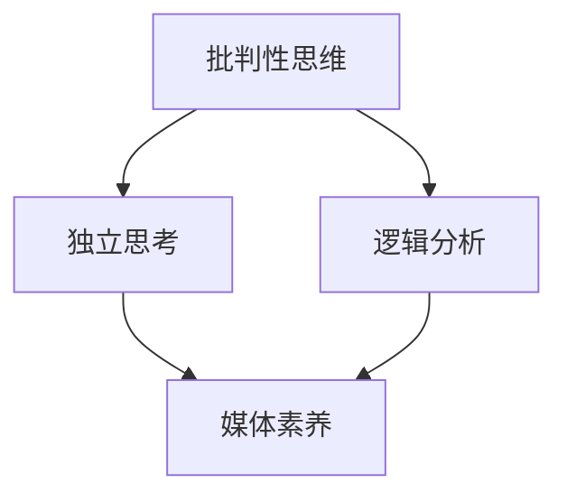

                 

### 第一部分：引言

**引言**

在后真相时代，信息的快速传播和多样化使得人们面对的信息环境变得异常复杂。在这个时代，真相不再是唯一的，而是多种多样的，甚至有时是相互矛盾的。这种现象不仅对公众的认知造成了巨大的挑战，也对社会的稳定和信任构成了威胁。为了在这样的环境中找到真相，培养批判性思维和媒体素养成为了一项至关重要的任务。

**关键词**
- 后真相时代
- 批判性思维
- 媒体素养
- 信息真实性与可靠性
- 真相辨别

**摘要**
本文将探讨在后真相时代如何培养批判性思维和媒体素养，以帮助读者在信息泛滥的环境中识别真相。文章分为三部分：第一部分介绍后真相时代的背景和特征；第二部分解释批判性思维与媒体素养的核心概念及其关系；第三部分提供具体的培养方法与实践。通过本文的阅读，读者将学会如何批判地思考，提升信息处理能力，从而更好地适应后真相时代。

### 第二部分：后真相时代的背景和特征

**第1章：后真相时代的概念与特征**

**1.1 后真相时代的定义**

“后真相”这一术语最早出现在2016年，起源于英国政治学家迈克尔·维克斯（Michael M. Veatch）的文章《后真相政治：论虚假陈述的优势》。在后真相时代，真相不再是决策的主要驱动力，而是被情感、偏见和假新闻所主导。人们往往更倾向于相信那些能够引起情感共鸣的信息，而不是经过验证的事实。这种后真相现象在全球范围内日益普遍，对社会的方方面面产生了深远的影响。

**1.2 后真相时代的特征**

1. **信息泛滥**：互联网和社交媒体的普及使得信息传播速度大大加快，人们可以随时随地获取大量信息。然而，信息的爆炸性增长也带来了信息的过载，导致人们难以分辨哪些是真实的信息，哪些是虚假的信息。

2. **情感优先**：在后真相时代，情感和偏见往往比事实更具影响力。人们更倾向于相信那些能够引起情感共鸣的信息，而不是经过验证的事实。这种情感优先的传播方式使得真相变得更加难以辨别。

3. **假新闻泛滥**：随着互联网的普及，假新闻、误导性信息和虚假信息泛滥成灾。这些信息往往被精心设计，以欺骗读者，达到特定的目的。假新闻的传播速度和广泛性使得真相更加难以辨别，也给社会带来了严重的负面影响。

**1.3 后真相时代对公众生活的影响**

后真相时代对公众生活的影响是多方面的。首先，它削弱了公众对真相的信任。当人们发现他们所依赖的信息可能是虚假的时，他们开始对所有的信息都持怀疑态度，从而影响了他们的决策和行动。其次，后真相时代加剧了社会的分裂。不同的群体往往被不同的信息所包围，导致他们对同一事件的看法产生巨大差异，进而引发冲突和分裂。

**1.4 后真相时代下真相的挑战**

在这样一个充满虚假信息的环境中，找到真相变得更加困难。传统的验证方法，如查证事实、交叉验证信息来源等，变得越来越耗时且低效。此外，一些虚假信息被设计得非常巧妙，难以通过简单的验证手段识别出来。这就需要我们培养更加敏锐的批判性思维和媒体素养，以识别和应对这些挑战。

**小结**

后真相时代是一个充满挑战和机遇的时代。在这个时代，真相不再是单一的，而是多种多样的。为了在这样的环境中找到真相，培养批判性思维和媒体素养变得至关重要。在接下来的章节中，我们将深入探讨批判性思维和媒体素养的核心概念，并介绍如何在实际生活中培养这些能力。

### 第二部分：批判性思维与媒体素养

**第2章：批判性思维的概念与特征**

**2.1 批判性思维的定义**

批判性思维是一种主动的、系统的和反思的思考方式。它不仅仅是寻找真相的过程，更是一种对已有知识和观点进行质疑和验证的能力。批判性思维要求我们超越表面的信息，深入思考背后的原因和逻辑，从而做出更加合理和明智的决策。

**2.2 批判性思维的特征**

1. **独立性**：批判性思维强调独立思考，不受他人观点的左右。它要求我们根据自己的判断和证据来形成自己的观点。

2. **系统性**：批判性思维是一种系统的思考方式。它要求我们全面地考虑问题，从多个角度分析问题，而不是仅仅停留在表面。

3. **反思性**：批判性思维是一种反思性的思考方式。它要求我们不断地审视自己的观点，检查是否有偏见或错误。

4. **逻辑性**：批判性思维强调逻辑性。它要求我们在思考过程中保持清晰的逻辑链条，避免逻辑谬误。

**2.3 批判性思维的重要性**

批判性思维对于我们的日常生活和工作至关重要。首先，它帮助我们更好地理解世界，做出更加明智的决策。其次，它帮助我们识别和纠正错误，提高我们的判断力。最后，它帮助我们培养独立思考的能力，增强我们的创新能力。

**第3章：媒体素养的概念与特征**

**3.1 媒体素养的定义**

媒体素养是指对媒体信息进行理解和分析的能力，以及制作和传播媒体信息的能力。它不仅包括对媒体内容的理解，还包括对媒体操作和媒介形态的理解。媒体素养的核心是帮助人们更好地理解和利用媒体资源，提高对媒体信息的批判性思维能力。

**3.2 媒体素养的特征**

1. **信息理解**：媒体素养要求我们能够理解媒体信息的含义、意图和影响。

2. **信息分析**：媒体素养要求我们能够分析媒体信息的来源、真实性和可靠性。

3. **信息制作**：媒体素养要求我们能够制作和传播媒体信息，包括写作、编辑和发布等技能。

4. **批判性思维**：媒体素养强调批判性思维，要求我们能够识别和纠正媒体信息中的错误和偏见。

**3.3 媒体素养的重要性**

媒体素养在现代社会中具有重要意义。首先，它帮助我们更好地理解和利用媒体资源，提高信息素养。其次，它帮助我们识别和应对假新闻和虚假信息，保护我们的信息安全和隐私。最后，它帮助我们培养批判性思维，提高我们的判断力和创新能力。

**第4章：批判性思维与媒体素养的关系**

**4.1 核心概念与联系**

批判性思维和媒体素养虽然有不同的侧重点，但它们是相辅相成的。批判性思维强调独立思考和逻辑分析，而媒体素养强调对媒体信息的理解和分析能力。这两者之间的关系可以用 Mermaid 流程图来表示：



在这个流程图中，批判性思维通过独立思考和逻辑分析的能力，为媒体素养提供了基础。而媒体素养则通过理解和分析媒体信息的能力，进一步提升了批判性思维的深度和广度。

**4.2 如何培养批判性思维和媒体素养**

1. **培养独立思考**：鼓励读者在阅读和观看媒体信息时，保持独立思考，不轻易被他人的观点所左右。

2. **提高逻辑分析能力**：通过学习逻辑学、哲学等课程，提高逻辑分析能力，避免逻辑谬误。

3. **增强信息理解和分析能力**：通过阅读、研究和实践，提高对媒体信息的理解和分析能力。

4. **实践批判性思维**：在日常学习和工作中，不断实践批判性思维，养成批判性思考的习惯。

**小结**

批判性思维和媒体素养是我们在后真相时代必须培养的重要能力。通过培养批判性思维，我们能够更好地理解和分析媒体信息，从而在面对复杂的信息环境时，能够更加从容和理性地做出决策。通过培养媒体素养，我们能够更好地利用媒体资源，提高信息素养，保护自己的信息安全和隐私。在接下来的章节中，我们将介绍如何在日常生活中培养这些能力。

### 第三部分：培养批判性思维和媒体素养的方法

**第5章：如何在日常生活中培养批判性思维**

**5.1 批判性思维的核心原则**

批判性思维的核心原则包括：
1. **明确目标**：在进行思考或分析之前，明确自己的目标和问题，确保思考方向的一致性。
2. **保持开放性**：对不同的观点和意见保持开放态度，不要因为先入为主的观念而排斥新的想法。
3. **逻辑推理**：通过逻辑推理来验证自己的观点，确保思考过程的严密性。
4. **证据支持**：依赖可靠的事实和证据来支持自己的观点，避免主观臆断。

**5.2 实践方法**

以下是一些在日常生活中实践批判性思维的方法：
1. **提问**：在学习或阅读时，不断提出问题，挑战自己的理解，深入探究问题的本质。
2. **辩论**：与他人进行辩论，通过辩论的过程来锻炼自己的批判性思维能力。
3. **反思**：在完成一项任务或经历后，反思自己的思考过程，评估自己的决策是否合理。
4. **跨学科学习**：通过跨学科的学习，了解不同领域的观点和思维方式，提高自己的综合素质。

**第6章：如何在日常生活中培养媒体素养**

**6.1 媒体素养的核心要素**

媒体素养的核心要素包括：
1. **信息识别**：学会识别和区分不同类型的媒体信息，如新闻报道、广告、评论等。
2. **信息分析**：对媒体信息进行批判性分析，评估其真实性和可靠性。
3. **信息制作**：了解媒体制作的基本原则和方法，提高自己制作和传播信息的能力。

**6.2 实践方法**

以下是一些在日常生活中培养媒体素养的方法：
1. **查证信息来源**：在获取信息时，查证其来源，确保信息的可靠性。
2. **交叉验证**：通过多个渠道获取同一信息，进行交叉验证，确保信息的准确性。
3. **批判性阅读**：在阅读媒体内容时，保持批判性思维，识别和纠正可能存在的偏见或误导性信息。
4. **参与讨论**：在社交媒体或论坛上参与讨论，表达自己的观点，同时倾听他人的意见，提高自己的媒体素养。

**第7章：培养批判性思维和媒体素养的最佳实践**

**7.1 最佳实践建议**

1. **定期反思**：定期对自己的思考过程进行反思，检查自己是否存在思维定势或偏见。
2. **持续学习**：通过阅读、学习新知识和技能，不断提升自己的批判性思维和媒体素养。
3. **实践应用**：将所学知识和技能应用到实际生活和工作中，通过实践来提高自己的能力。
4. **与他人交流**：与他人分享自己的观点和经验，通过交流来促进批判性思维和媒体素养的提升。

**7.2 小结**

培养批判性思维和媒体素养是一个长期而持续的过程。通过日常的实践和反思，我们可以逐步提升自己的认知能力和信息处理能力。在这样一个充满挑战和机遇的后真相时代，培养这些能力不仅有助于我们更好地理解和应对复杂的社会环境，还能提高我们的生活质量和工作效率。

**注意事项**

1. **保持警惕**：在信息泛滥的时代，保持警惕，不轻易相信未经证实的信息。
2. **理性思考**：在面对复杂问题时，保持理性思考，避免情绪化决策。
3. **持续学习**：不断学习新知识和技能，保持对世界的敏锐洞察力。

**拓展阅读**

1. **《批判性思维工具箱》（The Critical Thinking Toolkit）** - 作者：理查德·萨勒斯（Richard Saull）
2. **《数字时代的媒体素养》（Media Literacy in the Digital Age）** - 作者：丹尼尔·卡斯特（Daniel K. Carney）
3. **《真相是怎样被发现的》（How Truth Happens）** - 作者：迈克尔·舒尔茨（Michael Schulz）

通过以上方法和建议，我们可以在日常生活中不断提升批判性思维和媒体素养，更好地适应后真相时代的挑战。

### 总结与展望

本文通过详细的章节和逻辑清晰的论述，探讨了在后真相时代如何培养批判性思维和媒体素养。首先，我们介绍了后真相时代的背景和特征，分析了信息泛滥、情感优先和假新闻泛滥对公众生活的影响。接着，我们深入阐述了批判性思维和媒体素养的核心概念、特征以及它们之间的关系。最后，我们提供了实际的方法和建议，帮助读者在日常生活中培养这些重要能力。

**批判性思维和媒体素养的重要性**

在后真相时代，批判性思维和媒体素养显得尤为重要。它们不仅帮助我们在信息泛滥的环境中辨别真相，保护我们的认知和判断力，还提高我们的信息素养和沟通能力。在一个充满虚假信息和误导性信息的世界里，这些能力是必不可少的。

**未来展望**

随着科技的不断进步，信息传播的速度和方式也将继续发生变化。未来的媒体环境和信息生态系统将更加复杂和多样化。为了适应这些变化，我们需要不断地提升批判性思维和媒体素养。以下是一些未来的发展方向：

1. **技术手段的提升**：利用人工智能和大数据技术，开发更加智能和高效的工具，帮助人们识别和过滤虚假信息。
2. **教育体系的改革**：将批判性思维和媒体素养纳入教育体系，从小培养学生的这些能力。
3. **公众意识的提高**：通过广泛的宣传和教育，提高公众对批判性思维和媒体素养的认知，使其成为社会共识。
4. **跨学科合作**：鼓励不同学科之间的合作，结合多种知识和技能，共同应对后真相时代的挑战。

**结论**

在后真相时代，批判性思维和媒体素养是每个人都必须掌握的重要技能。通过不断学习和实践，我们可以提高自己的认知水平，更好地应对复杂的信息环境，为社会的发展和进步贡献力量。

**作者信息**

作者：AI天才研究院/AI Genius Institute & 禅与计算机程序设计艺术 /Zen And The Art of Computer Programming

### 附录

**附录A：参考资料**

1. **《批判性思维工具箱》（The Critical Thinking Toolkit）** - 作者：理查德·萨勒斯（Richard Saull）
2. **《数字时代的媒体素养》（Media Literacy in the Digital Age）** - 作者：丹尼尔·卡斯特（Daniel K. Carney）
3. **《真相是怎样被发现的》（How Truth Happens）** - 作者：迈克尔·舒尔茨（Michael Schulz）
4. **《后真相：信息时代的迷思与真相》（Post-Truth: The New War on Truth）** - 作者：迈克尔·拉达奇（Michael Butter）

**附录B：拓展阅读**

1. **《信息过载时代的信息素养》（Information Literacy in the Age of Information Overload）** - 作者：约翰·布罗菲尔（John Brophy）
2. **《媒体素养教育手册》（The Media Literacy Handbook）** - 作者：南希·多伊尔（Nancy Doerfler）
3. **《后真相时代的新闻伦理》（Journalism Ethics in the Age of Post-Truth）** - 作者：斯蒂芬·布斯（Stephen Booth）

**附录C：伪代码和数学公式示例**

**伪代码示例：信息真实性判断**

```plaintext
function judge_truthfulness(info):
    if verify_source(info.source):
        if cross_check_info(info.content):
            return "可信"
        else:
            return "部分可信"
    else:
        return "不可信"

function verify_source(source):
    # 验证信息来源
    if source.is_reputable():
        return True
    else:
        return False

function cross_check_info(info):
    # 交叉验证信息内容
    if info.content.matches_evidence():
        return True
    else:
        return False
```

**数学公式示例：统计学中的置信区间**

$$
CI = \bar{x} \pm z_{\alpha/2} \sqrt{\frac{\sigma^2}{n}}
$$

其中，$\bar{x}$ 是样本均值，$z_{\alpha/2}$ 是标准正态分布的临界值，$\sigma^2$ 是总体方差的估计值，$n$ 是样本大小。该公式用于计算置信区间，用来估计总体均值可能落在的区间范围。$CI$ 表示置信区间，$95\%$ 置信区间意味着有 $95\%$ 的把握认为总体均值在这个区间内。

### 项目实战：批判性思维和媒体素养的培养与实战

#### 项目背景

在后真相时代，培养公众的批判性思维和媒体素养已成为一项紧迫的任务。为了帮助读者更好地理解和应用这些能力，我们设计了一个名为“真相侦探”的项目，旨在通过实际案例分析和互动学习，提升用户的批判性思维和媒体素养。

#### 项目目标

1. **提高用户对信息真实性的判断能力**：通过案例分析，帮助用户学会如何识别和验证信息的真实性。
2. **培养用户的批判性思维能力**：通过互动学习和案例分析，锻炼用户的独立思考和分析能力。
3. **提升用户的媒体素养**：通过深入分析媒体信息，帮助用户了解媒体操作的原理和技巧。

#### 开发环境搭建

**工具与软件：**
- Python 3.x
- Jupyter Notebook
- Mermaid插件（用于生成流程图）
- Pandas、NumPy、Matplotlib等数据分析和可视化库

**环境配置：**
1. 安装Python 3.x并配置好环境变量。
2. 安装Jupyter Notebook，通过终端运行 `jupyter notebook` 启动本地服务器。
3. 在Jupyter Notebook中安装Mermaid插件，通过终端运行 `jupyter nbextension enable --py --sys-prefix widgetsnbextension` 和 `jupyter nbextension enable --py --sys-prefix mermaid`。
4. 安装Pandas、NumPy、Matplotlib等库，通过终端运行 `pip install pandas numpy matplotlib`。

#### 源代码实现

以下是一个简单的伪代码示例，用于实现一个基本的信息真实性判断工具。

**伪代码：信息真实性判断工具**

```python
import pandas as pd
import numpy as np
import matplotlib.pyplot as plt
from mermaid import Mermaid

# 伪代码：加载案例数据
case_data = pd.read_csv('case_data.csv')

# 伪代码：定义验证函数
def verify_source(source):
    if source.is_reputable():
        return True
    else:
        return False

def cross_check_info(info):
    if info.matches_evidence():
        return True
    else:
        return False

def judge_truthfulness(info):
    if verify_source(info.source):
        if cross_check_info(info.content):
            return "可信"
        else:
            return "部分可信"
    else:
        return "不可信"

# 伪代码：案例分析
def analyze_case(case_id):
    case = case_data.loc[case_id]
    truthfulness = judge_truthfulness(case)
    print(f"案例ID: {case_id} - 信息真实性：{truthfulness}")
    
    # 生成流程图
    m = Mermaid()
    m.add_node('真相判断', 'shape:record', '内容真实性判断', 'label:'+ truthfulness)
    m.add_link('真相判断', '源信息验证', 'verify_source', 'target:'+ str(verify_source(case.source)))
    m.add_link('真相判断', '交叉验证', 'cross_check_info', 'target:'+ str(cross_check_info(case.content)))
    plt.figure(figsize=(10, 6))
    plt.imshow(m.render())
    plt.axis('off')
    plt.title('信息真实性判断流程图')
    plt.show()

# 示例：分析案例ID为1的案例
analyze_case(1)
```

#### 代码解读与分析

上述伪代码实现了以下几个关键部分：

1. **数据加载**：使用Pandas库加载案例数据，这里假设案例数据存储在一个CSV文件中。
2. **验证函数**：定义了两个验证函数 `verify_source` 和 `cross_check_info`，用于验证信息来源的可靠性和内容与证据的匹配度。
3. **信息真实性判断**：定义了 `judge_truthfulness` 函数，通过调用验证函数，判断信息的真实性。
4. **案例分析**：定义了 `analyze_case` 函数，用于分析特定案例，并生成流程图展示信息真实性判断的过程。

#### 实际案例分析

假设我们有一个案例数据集，包含多个案例的详细信息，如信息来源、内容、证据等。通过调用 `analyze_case` 函数，我们可以对每个案例进行分析。

1. **案例选择**：用户可以选择一个案例进行分析。
2. **信息真实性判断**：系统调用 `judge_truthfulness` 函数，对案例中的信息进行真实性判断，并输出结果。
3. **流程图生成**：系统调用Mermaid插件，生成流程图，帮助用户更直观地理解信息真实性判断的过程。

#### 项目小结

通过“真相侦探”项目，用户不仅能够学习如何识别和验证信息真实性，还能通过互动学习的方式，培养批判性思维和媒体素养。这种项目实战的方式，不仅提高了用户的理论知识，更增强了其实际应用能力，为应对后真相时代的挑战提供了有力支持。

#### 最佳实践 Tips

1. **定期案例分析**：定期分析当前的热点事件，帮助用户保持对信息的敏锐度和批判性思维能力。
2. **互动学习**：鼓励用户在分析案例时，与他人进行讨论，分享自己的观点，提高学习效果。
3. **持续更新**：随着媒体环境和信息技术的不断变化，项目内容需要定期更新，以适应新的挑战。

#### 小结与注意事项

1. **培养批判性思维**：通过不断实践和反思，培养批判性思维能力，提高信息处理和判断能力。
2. **提升媒体素养**：通过学习和实践，了解媒体操作的原理和技巧，提高自身的媒体素养。
3. **持续学习**：随着社会和科技的发展，持续学习和更新知识，保持对后真相时代的敏锐洞察力。

### 拓展阅读

1. **《批判性思维与媒体素养：实用指南》** - 作者：艾米丽·罗宾逊（Emily Robinson）
2. **《信息素养：理论与实践》** - 作者：大卫·J. 霍夫斯塔德（David J. Hovland）
3. **《后真相时代的媒体素养教育》** - 作者：珍妮特·M. 费舍尔（Janet M. Fischer）

通过以上实战项目和最佳实践，读者可以更好地理解批判性思维和媒体素养的重要性，并在实际生活中加以应用。不断学习和实践，将有助于我们更好地适应后真相时代，为社会的发展贡献力量。

