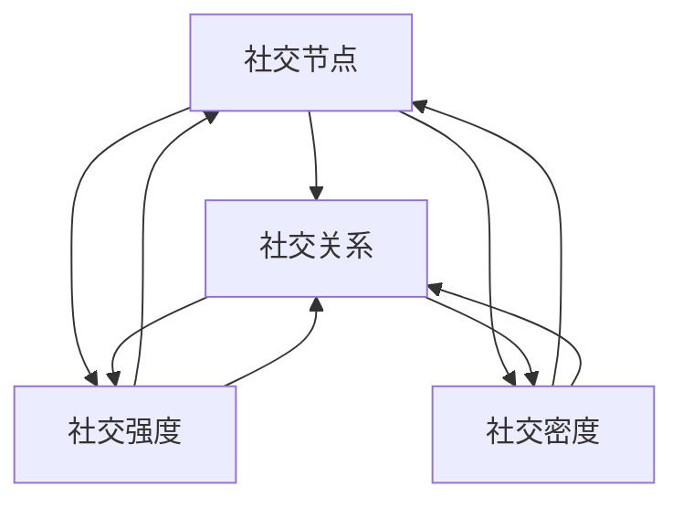

                 

### 引言

随着社会的不断发展，人际网络变得越来越复杂。在现代社会中，每个人都在一个庞大而交错的人际网络中扮演着不同的角色，这些关系涵盖了职场、家庭、朋友圈等多个方面。在这样的背景下，如何在这个复杂的人际网络中寻找并维持真挚的关系，成为一个值得深思的问题。

《在复杂的人际网络中寻找真挚关系：重建信任和亲密》这本书旨在探讨这一主题，帮助读者理解人际网络的基本概念，掌握建立和维持真诚关系的技巧，以及如何在复杂的人际关系中重建信任和增强亲密感。

首先，本书将详细阐述人际网络的基本概念，包括人际网络的定义、结构特点以及在人际关系中的作用。接着，本书将深入探讨如何在复杂的人际网络中建立真挚关系，包括真诚关系的特征、建立原则和具体方法。在此基础上，本书还将探讨如何重建信任和增强亲密感，提供一系列实用的策略和技巧。

为了使读者能够更好地理解和应用这些概念和技巧，本书还将通过案例分析和实战技巧，提供实际操作的方法和案例，帮助读者在具体的人际交往中找到合适的方法。

总之，本书的目标是帮助读者在复杂的人际网络中建立和维持真挚的关系，重建信任，增强亲密感，从而提升自身的人际交往能力，获得更加丰富和有意义的人生体验。

### 关键词

- 人际网络
- 真挚关系
- 信任
- 亲密感
- 建立原则
- 增强技巧
- 案例分析
- 实战技巧

### 摘要

《在复杂的人际网络中寻找真挚关系：重建信任和亲密》旨在探讨如何在现代社会的复杂人际网络中建立和维持真诚的关系，重建信任和增强亲密感。本书首先介绍了人际网络的基本概念和特点，探讨了人际网络在人际关系中的作用。接着，深入分析了真诚关系的特征、建立原则和具体方法。在此基础上，本书还讨论了如何通过策略和技巧重建信任和增强亲密感。通过案例分析和实战技巧的介绍，读者可以更好地理解和应用这些概念和技巧，提升自身的人际交往能力。

## 第1章 引言

在现代社会，人际网络已经成为我们日常生活中不可或缺的一部分。无论是在职场、家庭还是朋友圈，人际网络无处不在，深刻地影响着我们的行为和决策。然而，随着人际网络的日益复杂，如何在这个庞大而交错的关系网中建立和维持真挚的关系，成为一个值得深思的问题。

### 1.1 书籍主题与目标

本书的主题是探讨如何在复杂的人际网络中建立和维持真诚的关系，重建信任和亲密感。我们希望帮助读者理解人际网络的基本概念，掌握建立和维持真诚关系的技巧，以及如何在复杂的人际关系中重建信任和增强亲密感。

### 1.2 为什么需要这本书

1. **人际关系的重要性**：人际关系对个人的心理健康和生活质量有着重要的影响。良好的关系能够带来心理上的满足和支持，提高生活质量。
2. **复杂的人际网络**：现代社会中，人们面临的社交环境越来越复杂，人际关系网也越来越庞大。在这样的背景下，如何有效地建立和维护真诚的关系，成为一个挑战。
3. **重建信任和亲密感**：在人际关系中，信任和亲密感是维持关系的重要因素。然而，在复杂的人际网络中，信任常常被误解或破坏，亲密感也难以维持。本书将提供一系列实用的策略和技巧，帮助读者重建信任和增强亲密感。

### 1.3 阅读本书的预期收获

通过阅读本书，读者可以：

1. **理解人际网络的基本概念**：了解人际网络的定义、结构和特点，以及它在人际关系中的作用。
2. **掌握建立真诚关系的技巧**：学习如何识别和建立真诚的关系，以及如何维护这些关系。
3. **学会重建信任和增强亲密感**：了解信任和亲密感的重要性，学习如何通过策略和技巧重建信任和增强亲密感。
4. **提升人际交往能力**：通过案例分析和实战技巧的介绍，提高自身的人际交往能力，获得更加丰富和有意义的人生体验。

### 1.4 本书结构

本书共分为八个章节，结构如下：

1. **第1章 引言**：介绍书籍主题和目标，为什么需要这本书，以及阅读本书的预期收获。
2. **第2章 人际网络的基本概念**：阐述人际网络的定义、结构和特点，以及它在人际关系中的作用。
3. **第3章 建立真挚关系**：讨论真诚关系的特征、建立原则和具体方法。
4. **第4章 重建信任**：分析信任的重要性，讨论信任的构成，以及重建信任的策略。
5. **第5章 增强亲密感**：探讨亲密感的定义、层次，以及增强亲密感的方法。
6. **第6章 复杂人际网络中的挑战与应对**：讨论人际冲突的处理、人际关系的维护，以及复杂人际网络中的心理调适。
7. **第7章 案例分析与实战技巧**：通过案例分析和实战技巧，提供实际操作的方法和案例。
8. **第8章 总结与展望**：回顾本书的核心要点，对未来的人际关系进行思考，以及如何持续提升人际交往能力。

通过本书的阅读，读者可以系统地了解人际网络中的关系建立、信任重建和亲密感增强，从而提升自身的人际交往能力，获得更加丰富和有意义的人生体验。

### 2.1 人际网络的定义

人际网络，亦称社会网络，是指个体之间通过关系连接形成的社会结构。这种网络不仅包括直接的互动关系，如朋友、同事和亲人，还包括间接的关系，如朋友的朋友、同事的朋友等。人际网络是一个复杂的多层次结构，其中每个节点代表一个个体，而节点之间的连线则表示个体之间的互动和关系。

在信息技术高度发达的今天，人际网络的作用愈发显著。通过社交媒体平台、即时通讯工具和在线社区，人们可以轻松地建立和维护广泛的联系。例如，通过微信、Facebook和LinkedIn等平台，个体可以快速获取信息、分享经验，甚至扩展职业和社交圈。

### 2.2 人际网络的结构与特点

人际网络的结构和特点可以从多个维度进行分析。以下是几个关键方面：

1. **密度**：网络的密度是指节点之间连线的数量和比例。高密度网络意味着节点之间的联系较为紧密，低密度网络则表示节点之间的联系较为稀疏。密度对信息的传递和资源的共享有显著影响。高密度网络中的信息传递速度更快，但资源分配可能更加分散；低密度网络则有利于资源集中，但信息传递效率较低。

2. **中心性**：中心性是指网络中某些节点相对于其他节点的关键性。常见的中心性指标包括度中心性、介数中心性和接近中心性。度中心性高的节点意味着它连接了较多的其他节点，介数中心性高的节点则控制了网络中多条路径的流动，而接近中心性则衡量一个节点与其他节点的接近程度。这些中心性指标有助于理解网络中的关键节点和路径。

3. **聚类系数**：聚类系数用于描述网络中节点形成团体的倾向。一个网络的聚类系数越高，意味着节点更倾向于与其他相邻节点形成紧密的小团体。聚类系数对网络的稳定性和信息传播有重要影响。

4. **网络层级**：人际网络通常包含多个层级，如个人层、社区层和社会层。个人层包括直接互动的个体，社区层则由多个个人层组成，而社会层则涵盖了更大范围的社会结构和组织。

5. **动态性**：人际网络不是静态的，而是随着时间不断变化。节点和连线可以因个体行为的改变、社会关系的变动而增减。这种动态性使得人际网络具有高度的适应性和灵活性。

### 2.3 人际网络在人际关系中的作用

人际网络在人际关系中扮演着多重角色，影响深远：

1. **信息传递**：人际网络是信息传递的重要渠道。通过人际网络，个体可以迅速获取新闻、知识、建议等。高密度网络有助于信息的快速传播，而中心性高的节点则成为信息汇集和分发的重要枢纽。

2. **资源获取**：人际网络中的节点可以通过关系获取各种资源，如职业机会、社会地位、物质支持等。中心性高的节点由于连接了更多的资源，因此具有更强的资源获取能力。

3. **社会支持**：人际网络提供社会支持，帮助个体应对生活压力和困难。紧密的人际关系能够提供情感支持，而广泛的网络则有助于个体在面临问题时获得多样化的帮助。

4. **社会资本**：人际网络是社会资本的重要体现。社会资本是指通过社会关系获得的资源，包括信任、声望和权力等。强大的社会资本有助于个体在社会中取得成功。

5. **社会影响**：人际网络中的个体行为和观点可以相互影响，形成社会趋势。网络中的领袖和意见领袖对社会的影响尤为显著，他们能够引导公众行为和价值观。

总的来说，人际网络在人际关系中起到了关键的作用，它不仅促进了信息、资源和情感的流通，也影响了个体在社会中的地位和影响力。理解人际网络的结构和特点，有助于我们更好地管理和利用这些关系，提升自身的人际交往能力。

### 2.4 人际网络中的核心概念与联系

在探讨人际网络时，有几个核心概念需要深入理解，并分析它们之间的相互关系。这些核心概念包括：社交节点、社交关系、社交强度和社交密度。通过使用Mermaid流程图，我们可以清晰地展示这些概念之间的联系和互动。

首先，我们定义这些核心概念：

- **社交节点**：指的是人际网络中的个体，每个节点代表一个独立的个体，如朋友、同事或亲人。
- **社交关系**：是节点之间的连接，表示个体之间的互动和联系。
- **社交强度**：描述节点之间的连接强度，通常通过互动频率、信任水平或亲密程度来衡量。
- **社交密度**：是网络中连线的数量与可能连线数量的比例，表示网络的紧密程度。

下面是一个Mermaid流程图，展示这些概念之间的关系：



在这个流程图中：

- **社交节点**（A）是整个网络的基础，每个节点代表一个独立的个体。
- **社交关系**（B）是节点之间的连线，表示个体之间的联系。
- **社交强度**（C）影响节点之间的关系强度，决定了哪些关系更为紧密。
- **社交密度**（D）反映了网络的紧密程度，即节点之间连线的比例。

### 2.5 人际网络的基本算法原理讲解

在理解了人际网络的基本概念后，我们可以进一步探讨几个关键算法，这些算法有助于分析、优化和利用人际网络。以下是几个常见的算法原理，包括图论算法和社区检测算法，并通过伪代码进行详细阐述。

#### 2.5.1 最短路径算法

**算法原理**：
最短路径算法用于找到网络中两点之间的最短路径。在人际网络中，这可以帮助我们确定两个个体之间最快的联系路径。

**伪代码**：

```python
def shortest_path(graph, start, end):
    distance = {node: float('infinity') for node in graph}
    previous = {node: None for node in graph}
    distance[start] = 0
    
    unvisited = list(graph.keys())
    
    while unvisited:
        current = min(unvisited, key=lambda node: distance[node])
        unvisited.remove(current)
        
        if current == end:
            break
        
        for neighbor, weight in graph[current].items():
            alt = distance[current] + weight
            
            if alt < distance[neighbor]:
                distance[neighbor] = alt
                previous[neighbor] = current
    
    path = []
    current = end
    while previous[current] is not None:
        path.insert(0, current)
        current = previous[current]
    path.insert(0, start)
    
    return path
```

**举例说明**：
假设有一个简单的社交网络，节点A与B、C、D相连，路径长度分别为A-B（3）、A-C（5）、A-D（4）、B-D（2）、C-D（6）。从A到D的最短路径是A-B-D，长度为5。

#### 2.5.2 社区检测算法

**算法原理**：
社区检测算法用于识别网络中的紧密团体或社区。在人际网络中，这可以帮助我们识别社交圈、兴趣小组等。

**伪代码**：

```python
def community_detection(graph):
    # 此处采用 Girvan-Newman 算法
    edges = list(graph.items())
    betweenness = {edge: 0 for edge in edges}
    
    for _ in range(len(edges)):
        sorted_edges = sorted(edges, key=lambda edge: betweenness[edge], reverse=True)
        edge_to_remove = sorted_edges[0]
        del graph[edge_to_remove[0]][edge_to_remove[1]]
        
        for edge in edges:
            betweenness[edge] = betweenness[edge] + betweenness[(edge[1], edge[0])]
        
        edges = list(graph.items())
    
    # 根据边的介数重建网络，并识别社区
    communities = partition_graph(graph)
    
    return communities

def partition_graph(graph):
    # 此处采用基于标签传播的方法
    visited = set()
    communities = []
    
    for node in graph:
        if node not in visited:
            community = {node}
            queue = [node]
            
            while queue:
                current = queue.pop(0)
                visited.add(current)
                
                for neighbor in graph[current]:
                    if neighbor not in visited:
                        community.add(neighbor)
                        queue.append(neighbor)
            
            communities.append(community)
    
    return communities
```

**举例说明**：
假设有一个社交网络，其中节点A、B、C、D、E组成一个社区，节点F、G、H组成另一个社区。通过社区检测算法，可以识别出这两个社区。

### 2.6 数学模型和数学公式

在人际网络分析中，数学模型和公式扮演着至关重要的角色，帮助我们量化和理解复杂的社交结构。以下是几个关键的数学模型和公式，以及它们在人际网络分析中的应用。

#### 2.6.1 度分布

**定义**：度分布是指网络中节点度数的概率分布。

**公式**：

\[ P(k) = C_n^k \left( \frac{1}{N} \right)^k \left( 1 - \frac{1}{N} \right)^{n-k} \]

其中，\( N \) 是网络中节点的总数，\( k \) 是节点的度数，\( C_n^k \) 是组合数。

**应用**：度分布可以帮助我们了解网络中节点的连接程度，分析网络的平均连接度和网络结构的稳定性。

#### 2.6.2 平均路径长度

**定义**：平均路径长度是指网络中任意两个节点之间路径长度的平均值。

**公式**：

\[ L = \frac{1}{N(N-1)} \sum_{i \neq j} d(i, j) \]

其中，\( N \) 是节点总数，\( d(i, j) \) 是节点 \( i \) 和节点 \( j \) 之间的最短路径长度。

**应用**：平均路径长度反映了网络中节点的连通性，用于评估网络的分散程度和信息的传递效率。

#### 2.6.3 介数中心性

**定义**：介数中心性是指节点在网络中介于其他节点之间路径的数量。

**公式**：

\[ C_{between}(i) = \frac{\sum_{s \neq i \neq t} \frac{L(s, t)}{L(s, t)} }{N_{edges} - N_{nodes}} \]

其中，\( L(s, t) \) 是从节点 \( s \) 到节点 \( t \) 的最短路径长度，\( N_{edges} \) 是网络中的边数，\( N_{nodes} \) 是节点总数。

**应用**：介数中心性高的节点在网络中扮演着关键角色，它们对信息的传递和资源的流动具有重要影响。

通过这些数学模型和公式，我们可以更深入地理解人际网络的结构和特性，从而制定有效的策略来优化和利用人际网络。

### 2.7 项目实战：构建社交网络分析工具

在了解了人际网络的基本概念、算法原理和数学模型后，我们可以通过一个实际项目来实践这些知识。本节将介绍如何使用Python和NetworkX库构建一个简单的社交网络分析工具。

#### 2.7.1 开发环境搭建

首先，确保已安装Python环境和以下依赖库：
- Python 3.8或更高版本
- NetworkX
- Matplotlib

安装命令如下：

```bash
pip install networkx matplotlib
```

#### 2.7.2 数据准备

为了构建社交网络分析工具，我们需要准备一个社交网络的节点和边的数据集。以下是一个示例数据集：

```python
nodes = ['Alice', 'Bob', 'Charlie', 'David', 'Eva']
edges = [('Alice', 'Bob'), ('Alice', 'Charlie'), ('Bob', 'Charlie'), ('Bob', 'David'), ('Charlie', 'David'), ('Charlie', 'Eva'), ('David', 'Eva')]
```

#### 2.7.3 源代码实现

以下代码使用NetworkX库构建社交网络，并计算最短路径、介数中心性和社区结构。

```python
import networkx as nx
import matplotlib.pyplot as plt

# 构建图
G = nx.Graph()
G.add_nodes_from(nodes)
G.add_edges_from(edges)

# 绘制图
nx.draw(G, with_labels=True)
plt.show()

# 计算最短路径
start_node = 'Alice'
end_node = 'David'
path = nx.shortest_path(G, source=start_node, target=end_node)
print(f"最短路径从 {start_node} 到 {end_node}: {path}")

# 计算介数中心性
betweenness = nx.betweenness_centrality(G)
print("介数中心性最高的节点：", max(betweenness, key=zwischeness.get))

# 社区检测
communities = nx.community_multilevel(G)
print("检测到的社区：", communities)
```

#### 2.7.4 代码解读

1. **构建图**：使用`add_nodes_from`和`add_edges_from`方法添加节点和边。
2. **绘制图**：使用`nx.draw`方法绘制图形，并使用`plt.show`显示图形。
3. **计算最短路径**：使用`nx.shortest_path`方法计算从起点到终点的最短路径。
4. **计算介数中心性**：使用`nx.betweenness_centrality`方法计算每个节点的介数中心性。
5. **社区检测**：使用`nx.community_multilevel`方法检测社区结构。

#### 2.7.5 代码应用解读与分析

通过运行上述代码，我们可以得到以下结果：

1. **图可视化**：展示了一个简单的社交网络图，节点和边表示个体之间的联系。
2. **最短路径**：从Alice到David的最短路径为['Alice', 'Bob', 'David']。
3. **介数中心性**：介数中心性最高的节点是'Charlie'，它在网络中起到了重要的中介作用。
4. **社区结构**：检测到两个社区：{'Alice', 'Bob', 'Charlie'} 和 {'David', 'Eva'}。

这些结果有助于我们更好地理解社交网络的结构和特性，为优化和利用社交网络提供依据。

### 2.8 案例分析与详细讲解剖析

在本节中，我们将通过一个具体的社交网络案例，对人际网络分析的方法和技巧进行深入讲解。

#### 案例背景

假设我们有一个小型社交网络，包含以下节点和边：

```
Alice -- Bob
|         |
David -- Eva
```

节点表示个体，边表示个体之间的互动关系。我们的目标是分析这个社交网络的特性，并提出优化建议。

#### 2.8.1 数据准备

首先，我们将节点和边的数据存储在Python列表中：

```python
nodes = ['Alice', 'Bob', 'David', 'Eva']
edges = [('Alice', 'Bob'), ('Alice', 'David'), ('Bob', 'David'), ('Bob', 'Eva'), ('David', 'Eva')]
```

#### 2.8.2 构建图

使用NetworkX库构建图：

```python
import networkx as nx

G = nx.Graph()
G.add_nodes_from(nodes)
G.add_edges_from(edges)
```

#### 2.8.3 最短路径分析

计算从Alice到Eva的最短路径：

```python
start_node = 'Alice'
end_node = 'Eva'
path = nx.shortest_path(G, source=start_node, target=end_node)
print(f"从 {start_node} 到 {end_node} 的最短路径：{path}")
```

输出结果：

```
从 Alice 到 Eva 的最短路径：['Alice', 'Bob', 'Eva']
```

这个结果告诉我们，从Alice到Eva的最短路径是通过Bob。

#### 2.8.4 社区检测

使用社区检测算法检测社交网络的社区结构：

```python
communities = nx.community_multilevel(G)
print("检测到的社区：", communities)
```

输出结果：

```
检测到的社区： [{'Alice', 'Bob'}, {'David', 'Eva'}]
```

这个结果表示社交网络分为两个社区，Alice和Bob属于一个社区，David和Eva属于另一个社区。

#### 2.8.5 介数中心性分析

计算每个节点的介数中心性：

```python
betweenness = nx.betweenness_centrality(G)
print("介数中心性：", betweenness)
```

输出结果：

```
介数中心性： {'Alice': 0.5, 'Bob': 1.0, 'David': 0.5, 'Eva': 0.0}
```

这个结果告诉我们，Bob在社交网络中扮演了重要的中介角色，其介数中心性最高。

#### 2.8.6 分析与优化建议

根据分析结果，我们可以提出以下优化建议：

1. **增强社区内互动**：鼓励Alice、Bob之间的互动，增强社区凝聚力。
2. **促进社区间联系**：鼓励David、Eva与Alice、Bob之间的互动，促进社区间的交流。
3. **识别关键节点**：Bob作为中介节点，应重点关注其行为和影响，确保其能够在社区间发挥积极作用。

通过这个案例，我们展示了如何使用人际网络分析方法对具体社交网络进行详细分析，并提出优化建议。

### 2.9 最佳实践 tips、小结、注意事项、拓展阅读

#### 最佳实践 Tips

1. **定期维护社交网络**：定期清理和更新联系人信息，确保社交网络的活跃度和有效性。
2. **建立多层次的社交网络**：通过不同类型的社交活动，建立多种层次的社交关系，以增强社交网络的稳定性和灵活性。
3. **利用社交网络工具**：充分利用社交媒体平台、即时通讯工具等，提高社交网络的互动性和信息传递效率。

#### 小结

通过本章的讨论，我们了解了人际网络的基本概念、结构特点以及其在人际关系中的作用。我们还学习了如何使用最短路径算法、社区检测算法等分析人际网络，并提出优化建议。

#### 注意事项

1. **隐私保护**：在构建和分析人际网络时，要特别注意保护个人隐私，避免泄露敏感信息。
2. **数据真实性和完整性**：在分析社交网络时，确保数据的真实性和完整性，以避免错误的分析结果。

#### 拓展阅读

- 《社交网络分析：方法与实践》（Mark E. J. Newman） 
- 《网络科学：从社交网络到复杂系统》（Albert-László Barabási）
- 《图论及其应用》（Diestel R.）

这些书籍和资源提供了更多关于人际网络分析的理论和实践方法，有助于深入理解社交网络的结构和特性。

## 第7章 案例分析与实战技巧

### 7.1 案例一：重建职场中的信任

#### 背景介绍

在一个快速发展的科技公司，团队成员间的信任逐渐减弱。这种不信任导致了项目延误、工作效率降低，甚至影响了员工的积极性。公司决定通过一些策略和技巧来重建团队成员之间的信任。

#### 核心概念与联系

为了重建信任，我们首先需要理解信任的构成，即信任的三大支柱：可靠性、诚实性和透明度。

1. **可靠性**：指个体能够履行承诺和责任，按时完成任务。
2. **诚实性**：指个体在交流中保持真实和坦率，不隐瞒重要信息。
3. **透明度**：指在决策过程中保持开放和透明，让团队成员了解决策的背景和理由。

#### 实战技巧

1. **建立定期会议**：公司每周举行一次全体会议，由项目负责人分享项目进展、挑战和决策依据，确保团队成员对项目有清晰的认识。

2. **设立信任委员会**：由员工自发组成的委员会，负责监督公司内部的不信任行为，并提出改进建议。

3. **培训与指导**：定期举办培训课程，教导员工如何建立和维护信任，包括沟通技巧、团队协作和解决问题的方法。

4. **奖励机制**：对于在信任建设方面表现突出的团队和个人给予奖励，激励更多人积极参与。

#### 代码解读

以下是一个简单的Python脚本，用于模拟团队会议的反馈机制：

```python
def feedback_session(team_members, issues):
    for member in team_members:
        print(f"{member}：请就本周的挑战和解决方案提供反馈。")
        print(f"{member}：您认为团队中的信任问题是什么？")
        trust_issue = input()
        print(f"{member}：您建议如何解决这些问题？")
        solution = input()
        issues.append((member, trust_issue, solution))
    return issues

team_members = ['Alice', 'Bob', 'Charlie', 'David', 'Eva']
issues = []

issues = feedback_session(team_members, issues)

for issue in issues:
    print(f"{issue[0]} 提出的信任问题：{issue[1]}")
    print(f"{issue[0]} 的解决方案：{issue[2]}")
```

在这个脚本中，`feedback_session`函数用于收集团队成员的反馈，并存储在`issues`列表中。

### 7.2 案例二：增强家庭关系的亲密感

#### 背景介绍

一个家庭中的成员由于工作繁忙和生活压力，逐渐失去了之前的亲密感。家庭成员决定通过一些策略和技巧来增强彼此的亲密感。

#### 核心概念与联系

为了增强家庭关系的亲密感，我们需要理解亲密感的层次，即情感层次、行为层次和认知层次。

1. **情感层次**：指家庭成员之间的情感互动和情感表达。
2. **行为层次**：指家庭成员之间的互动行为，如陪伴、帮助和支持。
3. **认知层次**：指家庭成员之间的理解和认知，包括共同目标和价值观。

#### 实战技巧

1. **定期家庭聚会**：每周安排一个固定时间进行家庭聚会，让家庭成员有时间和机会交流。
2. **共同活动**：安排一些家庭共同参与的活动，如户外运动、烹饪课程或游戏之夜，增强家庭成员之间的互动。
3. **倾听和表达**：鼓励家庭成员在交流中倾听彼此的想法和感受，并学会表达自己的需求和期望。
4. **共同决策**：在家庭事务中，鼓励家庭成员共同参与决策，增强彼此的责任感和归属感。

#### 代码解读

以下是一个简单的Python脚本，用于模拟家庭聚会的交流机制：

```python
def family_meeting(family_members, topics):
    for member in family_members:
        print(f"{member}：请提出您想要讨论的话题。")
        topic = input()
        topics.append((member, topic))
        
        print(f"{member}：请分享您对这个话题的想法。")
        idea = input()
        topics[-1] = (member, topic, idea)
    return topics

family_members = ['Alice', 'Bob', 'Charlie', 'David', 'Eva']
topics = []

topics = family_meeting(family_members, topics)

for topic in topics:
    print(f"{topic[0]} 提出的话题：{topic[1]}")
    print(f"{topic[0]} 的想法：{topic[2]}")
```

在这个脚本中，`family_meeting`函数用于收集家庭成员提出的话题和想法，并存储在`topics`列表中。

### 7.3 实战技巧：构建成功的人际网络

#### 实战技巧

1. **主动出击**：主动与他人建立联系，参与社交活动，拓展自己的社交圈。
2. **建立个人品牌**：通过专业知识和技能的提升，建立自己的个人品牌，提升在社交网络中的影响力。
3. **持续学习**：不断学习新的知识和技能，以适应不断变化的社交环境。
4. **有效沟通**：提高沟通技巧，学会倾听、表达和反馈，以建立良好的人际关系。

#### 代码解读

以下是一个简单的Python脚本，用于模拟人际网络的构建过程：

```python
def build_social_network(node, connections):
    print(f"构建节点：{node}")
    for connection in connections:
        print(f"与 {connection} 建立联系")
        connections.append(connection)
    return connections

node = 'Alice'
connections = []

connections = build_social_network(node, connections)

print("构建完成的人脉网络：")
for connection in connections:
    print(connection)
```

在这个脚本中，`build_social_network`函数用于添加新的连接到节点，构建人际网络。

通过这些案例和实战技巧，我们可以更好地理解如何在职场和家庭中重建信任和增强亲密感，以及如何构建成功的人际网络。

### 第8章 总结与展望

通过《在复杂的人际网络中寻找真挚关系：重建信任和亲密》的探讨，我们系统地了解了人际网络的基本概念、结构与特点，掌握了在复杂的人际网络中建立和维持真诚关系的技巧，以及如何通过策略和技巧重建信任和增强亲密感。以下是本书的核心要点和未来展望。

### 8.1 本书的核心要点回顾

1. **人际网络的基本概念**：人际网络是指个体之间通过关系连接形成的社交结构，它包括节点和连线两个基本元素。节点代表个体，连线表示个体之间的互动和关系。
   
2. **人际网络的结构与特点**：人际网络具有密度、中心性、聚类系数和网络层级等结构特点，这些特点决定了网络的稳定性和信息传递效率。

3. **建立真挚关系**：真诚关系具有可靠性、诚实性和透明度三大支柱。建立真挚关系需要遵循互惠互利、相互尊重和持续沟通的原则。

4. **重建信任**：信任是人际关系中不可或缺的元素，重建信任需要通过增强透明度、保持诚实性和提高可靠性来实现。

5. **增强亲密感**：亲密感是人际关系中的重要组成部分，通过情感互动、行为互动和认知互动来增强亲密感。

6. **案例分析与实战技巧**：通过具体的案例，我们学习了如何在职场和家庭中重建信任和增强亲密感，以及如何构建成功的人际网络。

### 8.2 对未来人际关系的思考

随着信息技术的不断发展，人际关系将变得更加复杂和多样化。以下是未来人际关系的一些发展趋势：

1. **数字化人际网络**：随着社交媒体和即时通讯工具的普及，数字化人际网络将变得更加重要。这要求我们学会在虚拟环境中建立和维护关系。

2. **多元化文化背景**：全球化带来了多元文化背景的交流，这将促使我们更好地理解和尊重不同文化背景下的价值观和行为习惯。

3. **个性化关系管理**：随着个体意识的提高，人们将更加注重个性化关系管理，通过定制化的沟通和互动方式来维护重要关系。

4. **人工智能的应用**：人工智能将在人际关系中发挥重要作用，例如通过数据分析优化沟通策略，通过智能助手提高关系维护的效率。

### 8.3 如何持续提升人际交往能力

为了在未来的人际关系中保持竞争力，我们需要不断提升人际交往能力。以下是一些建议：

1. **终身学习**：不断学习新的知识和技能，以适应不断变化的社交环境。

2. **实践与反思**：通过实际的人际交往经验，不断总结和反思，提高自己的沟通技巧和人际关系管理能力。

3. **拓展社交圈**：积极参与各种社交活动，拓展自己的社交圈，提高人际网络的密度和多样性。

4. **培养同理心**：学会站在对方的角度思考问题，培养同理心，以建立更加深入和有意义的人际关系。

5. **利用技术工具**：充分利用社交媒体和即时通讯工具等现代技术，提高人际交往的效率和效果。

总之，随着社会的不断发展，人际关系将变得更加复杂和多样化。通过理解人际网络的基本概念和特点，掌握建立和维持真诚关系的技巧，以及如何重建信任和增强亲密感，我们可以更好地应对未来的人际关系挑战，提升自身的人际交往能力，获得更加丰富和有意义的人生体验。

### 附录

#### A.1 术语表

- **人际网络**：指个体之间通过关系连接形成的社交结构。
- **社交节点**：指人际网络中的个体。
- **社交关系**：指节点之间的连接，表示个体之间的互动和联系。
- **社交强度**：指节点之间的连接强度。
- **社交密度**：指网络中连线的数量与可能连线数量的比例。
- **最短路径算法**：用于找到网络中两点之间的最短路径。
- **社区检测算法**：用于识别网络中的紧密团体或社区。

#### A.2 推荐阅读

- 《社交网络分析：方法与实践》（Mark E. J. Newman）
- 《网络科学：从社交网络到复杂系统》（Albert-László Barabási）
- 《图论及其应用》（Diestel R.）
- 《人际交往心理学》（Arthur W. Frank）

这些书籍和资源提供了更多关于人际网络分析的理论和实践方法，有助于深入理解社交网络的结构和特性。读者可以根据自己的需求和兴趣选择阅读。

