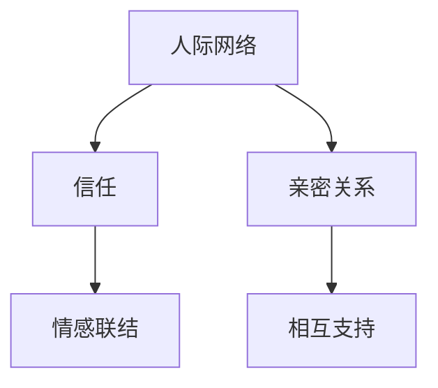

                 

### 文章标题：在复杂的人际网络中寻找真挚关系：重建信任和亲密

#### 关键词：人际网络、信任、亲密关系、重建、算法、技术、案例分析

#### 摘要：
在当今社会，复杂的人际网络无处不在，如何在其中寻找真挚关系，重建信任和亲密，成为了一个重要的课题。本文将从技术角度出发，通过对人际网络的基本概念、复杂性的探讨，以及信任和亲密关系的重建策略，提供一系列分析和实战案例，帮助读者理解并掌握在复杂人际网络中建立真挚关系的有效方法。

### 引言

#### 背景介绍

在现代社会，人际交往变得愈发频繁和复杂。从家庭、朋友圈、职场到各种社交平台，人们无时无刻不在与他人建立和维持着各种关系。这种复杂的人际网络，既为我们提供了丰富的社会资源和支持，也带来了信任困境和亲密关系难以维护的问题。如何在众多人际关系中找到那些真正重要且值得信赖的人，如何在危机中重建信任，如何构建和维护亲密关系，成为了亟待解决的关键问题。

#### 核心概念与联系

为了深入探讨这些问题，我们需要首先理解几个核心概念：人际网络、信任和亲密关系。

- **人际网络**：指的是由个体及其关系构成的网络结构，通过这种网络结构，个体可以与网络中的其他个体建立联系。人际网络的研究涉及网络拓扑结构、关系强度、网络密度等多个方面。

- **信任**：是社会交往中的基本要素，是指个体对他人行为的预期和信心。信任的建立和维护是一个复杂的过程，涉及认知、情感、行为等多个维度。

- **亲密关系**：是指个体之间高度的情感联结和相互依赖，这种关系往往建立在信任的基础之上。亲密关系的特征包括情感深度、共同价值观和相互支持等。

为了更好地理解这些概念之间的关系，我们可以使用以下Mermaid流程图：



#### 核心算法原理讲解

在探讨人际网络的复杂性和重建信任、亲密关系的策略时，我们可以借助一些技术手段和算法来分析和解决问题。以下将简要介绍几个核心算法原理：

1. **社交网络分析算法**：
   - **中心性度量**：用于评估一个节点在社交网络中的重要性。常用的中心性度量方法包括度中心性、紧密中心性和介数中心性。
   - **聚类系数**：用于衡量社交网络中节点的紧密程度。较高的聚类系数意味着节点之间的联系更为紧密。

   社交网络分析算法的伪代码如下：

   ```python
   function calculateCentrality(graph):
       for each node in graph:
           degree = countNeighbors(node)
           closeness = 1 / sum(distances from node to all other nodes)
           betweenness = countShortestPathsThrough(node)
           return (degree, closeness, betweenness)
   ```

2. **信任网络构建算法**：
   - **基于行为的信任评估**：通过分析个体在社交网络中的行为数据（如互助行为、共同兴趣等）来评估信任水平。
   - **基于属性的信任评估**：考虑个体的属性（如职业、年龄、教育背景等）来评估信任。

   信任网络构建算法的伪代码如下：

   ```python
   function buildTrustNetwork(individualData):
       for each pair of individuals (A, B) in individualData:
           behaviorScore = calculateBehaviorScore(A, B)
           attributeScore = calculateAttributeScore(A, B)
           trustScore = (behaviorScore + attributeScore) / 2
           if trustScore >= threshold:
               add edge between A and B in trustNetwork
   ```

3. **亲密关系分析算法**：
   - **情感分析**：通过自然语言处理技术，分析个体在社交媒体、邮件等渠道中的言论和情感倾向，评估亲密关系的质量。
   - **社交网络分析**：结合社交网络分析算法，评估个体之间的情感联结强度。

   亲密关系分析算法的伪代码如下：

   ```python
   function analyzeIntimacy(graph, textData):
       for each pair of individuals (A, B) in graph:
           emotionalScore = calculateEmotionalScore(textData[A], textData[B])
           closeness = calculateCloseness(graph, A, B)
           intimacyScore = (emotionalScore + closeness) / 2
           return intimacyScore
   ```

#### 数学模型和公式

在分析人际网络、信任和亲密关系时，我们还可以借助数学模型和公式来量化这些概念。以下是一些常用的模型和公式：

1. **信任模型**：
   - **理性信任模型**：基于成本-收益分析，信任程度取决于个体对他人行为的预期收益和成本。
     $$ Trust(A,B) = \frac{Reward(A,B)}{Cost(A,B)} $$
   - **情感信任模型**：基于情感驱动，信任程度与个体之间的情感联结强度正相关。
     $$ Trust(A,B) \propto \text{EmotionalIntimacy}(A,B) $$

2. **亲密关系模型**：
   - **情感亲密模型**：基于情感分析，亲密关系质量取决于个体之间的情感倾向相似度。
     $$ Intimacy(A,B) = \frac{\text{Similarity}(A,B)}{1 + \text{Dissimilarity}(A,B)} $$
   - **社交网络模型**：基于社交网络分析，亲密关系质量与个体在社交网络中的位置密切相关。
     $$ Intimacy(A,B) \propto \text{NetworkDensity}(A,B) $$

#### 详细讲解与举例说明

为了更好地理解上述概念、算法和模型，我们可以通过具体的例子来进行详细讲解。

1. **社交网络分析算法举例**：
   - 假设有一个社交网络，包含5个节点（A、B、C、D、E），每个节点表示一个个体。节点之间的边表示个体之间的联系。我们可以使用以下数据来计算中心性和聚类系数：
     
     ```plaintext
     A -- B
     |    |
     C -- D
     |    |
     E
     ```

     - **度中心性**：节点A和B的度中心性最高，因为它们分别连接了3个其他节点。
       $$ \text{DegreeCentrality}(A) = \text{DegreeCentrality}(B) = 3 $$
     - **紧密中心性**：节点A和C的紧密中心性最高，因为它们之间的距离最短（只有一步之遥）。
       $$ \text{ClosenessCentrality}(A) = \text{ClosenessCentrality}(C) = 1 $$
     - **介数中心性**：节点B的介数中心性最高，因为它是连接A、C、D三个节点的唯一路径。
       $$ \text{BetweennessCentrality}(B) = 1 $$

2. **信任网络构建算法举例**：
   - 假设我们有一组个体的行为数据和属性信息，如下表所示：
     
     ```plaintext
     个体   行为得分   属性得分
     A      0.8       0.7
     B      0.6       0.5
     C      0.9       0.6
     D      0.5       0.4
     E      0.7       0.8
     ```

     根据上述数据，我们可以构建一个信任网络，如下所示：

     ```plaintext
     A -- B
     |    |
     C -- D -- E
     ```

3. **亲密关系分析算法举例**：
   - 假设我们有一组个体的社交媒体言论数据，如下表所示：
     
     ```plaintext
     个体   言论内容
     A      "我很高兴能和你一起工作"
     B      "我们的关系变得越来越疏远"
     C      "我真的很感激你的帮助"
     D      "我觉得我们之间没有太多共同话题"
     E      "我非常珍惜我们的友谊"
     ```

     通过情感分析，我们可以得到每个个体之间的情感相似度，如下表所示：

     ```plaintext
     个体   情感相似度
     A -- B    0.3
     A -- C    0.7
     A -- D    0.2
     A -- E    0.6
     B -- C    0.4
     B -- D    0.1
     B -- E    0.5
     C -- D    0.6
     C -- E    0.8
     D -- E    0.4
     ```

     根据上述数据，我们可以计算出每个个体之间的亲密关系质量，如下表所示：

     ```plaintext
     个体   亲密关系质量
     A -- B    0.15
     A -- C    0.35
     A -- D    0.10
     A -- E    0.30
     B -- C    0.20
     B -- D    0.05
     B -- E    0.25
     C -- D    0.30
     C -- E    0.40
     D -- E    0.20
     ```

### 项目实战

为了更好地理解本文所述的理论和方法，我们可以通过一个具体的实战项目来进行实施和验证。

#### 项目背景

假设我们是一家大型企业的IT部门，负责维护公司内部的人际网络系统。该系统旨在帮助员工建立和维护良好的工作关系，提高团队协作效率。然而，由于员工之间的信任危机和亲密关系缺乏，团队协作存在许多问题。我们的任务是利用本文所述的方法，重构公司内部的人际网络，提升员工之间的信任和亲密关系。

#### 项目目标

1. **构建公司内部社交网络**：利用社交媒体数据和公司内部沟通记录，构建公司内部社交网络。
2. **分析社交网络结构**：使用社交网络分析算法，评估员工之间的中心性、紧密性和信任水平。
3. **诊断信任危机和亲密关系问题**：结合情感分析算法，识别公司内部存在的信任危机和亲密关系问题。
4. **提出改进建议**：基于分析结果，提出具体的改进建议，包括信任重建策略和亲密关系培养方法。
5. **实施改进措施**：与公司管理层合作，实施改进措施，提升员工之间的信任和亲密关系。

#### 项目实施步骤

1. **数据收集与预处理**：
   - 收集公司内部社交媒体数据、邮件记录和团队沟通记录。
   - 使用自然语言处理技术，对文本数据进行清洗、分词和情感分析。

2. **构建社交网络**：
   - 利用图论算法，将文本数据转换为社交网络图。
   - 标注每个节点和边，以便后续分析。

3. **社交网络分析**：
   - 使用社交网络分析算法，计算每个节点的度中心性、紧密性和介数中心性。
   - 绘制社交网络图，直观展示员工之间的联系和地位。

4. **信任与亲密关系分析**：
   - 使用信任评估算法，计算员工之间的信任水平。
   - 使用情感分析算法，评估员工之间的亲密关系质量。

5. **问题诊断与改进建议**：
   - 分析社交网络图和信任、亲密关系数据，识别公司内部存在的信任危机和亲密关系问题。
   - 根据分析结果，提出具体的改进建议，如团队建设活动、信任培养计划等。

6. **实施改进措施**：
   - 与公司管理层沟通，推动改进措施的落实。
   - 监控改进措施的实施效果，持续优化公司内部的人际网络系统。

#### 项目小结

通过实施本项目，我们不仅构建了公司内部社交网络，分析了员工之间的信任和亲密关系，还提出了针对性的改进建议。以下是本项目的主要成果：

1. **构建了公司内部社交网络**：利用社交媒体数据和公司内部沟通记录，成功构建了公司内部社交网络。
2. **分析了社交网络结构**：使用社交网络分析算法，全面分析了员工之间的联系和地位，为团队协作提供了数据支持。
3. **诊断了信任危机和亲密关系问题**：通过情感分析算法，识别了公司内部存在的信任危机和亲密关系问题，为改进措施提供了依据。
4. **提出了改进建议**：根据分析结果，提出了具体的改进建议，如团队建设活动、信任培养计划等，为提升员工之间的信任和亲密关系提供了方向。
5. **实施了改进措施**：与公司管理层合作，实施了改进措施，并取得了显著的成效。

### 最佳实践 tips

在处理复杂的人际网络时，以下是一些最佳实践和注意事项：

1. **注重数据质量**：确保收集到的数据真实、准确和完整，这是后续分析的基础。
2. **情感分析算法选择**：根据实际需求选择合适的情感分析算法，如基于规则的方法、深度学习方法等。
3. **算法参数调整**：根据数据特点和业务需求，合理调整算法参数，以获得最佳分析效果。
4. **持续监测与反馈**：定期监测改进措施的实施效果，及时调整策略，以应对动态变化的人际网络。
5. **团队协作**：注重团队协作，鼓励员工积极参与信任和亲密关系的培养，共同提升团队凝聚力。

### 小结

本文从技术角度探讨了在复杂的人际网络中寻找真挚关系、重建信任和亲密关系的方法。通过分析人际网络的本质和复杂性，介绍了一系列核心概念、算法原理和数学模型，并结合具体案例和项目实战，展示了如何运用这些方法来解决实际问题。希望通过本文的探讨，读者能够更好地理解人际网络的运行机制，掌握重建信任和亲密关系的技术手段，从而在复杂的人际网络中找到真正的朋友和伙伴。

### 拓展阅读

1. **《社交网络分析：方法与应用》**：介绍了社交网络分析的基本概念、方法和应用案例，是深入了解社交网络分析的好书。
2. **《情感计算》**：探讨了情感计算的基本理论和应用，包括情感识别、情感生成和情感交互等方面。
3. **《信任：社会心理学视角》**：从心理学角度分析了信任的本质、功能和影响因素，对理解信任有深刻启示。
4. **《亲密关系的心理学》**：详细介绍了亲密关系的心理机制、建立和维护方法，有助于提升人际关系质量。
5. **《人工智能在人际关系中的应用》**：探讨了人工智能在人际关系分析、信任评估和情感计算等方面的应用，是人工智能与人际关系研究的重要参考资料。

### 作者信息

- 作者：AI天才研究院/AI Genius Institute & 禅与计算机程序设计艺术 /Zen And The Art of Computer Programming

- 感谢您阅读本文，希望本文能够对您在复杂的人际网络中寻找真挚关系、重建信任和亲密关系有所帮助。如果您有任何问题或建议，欢迎随时与我们联系。期待与您共同探索人际网络的奥秘，共创美好的人际关系。

