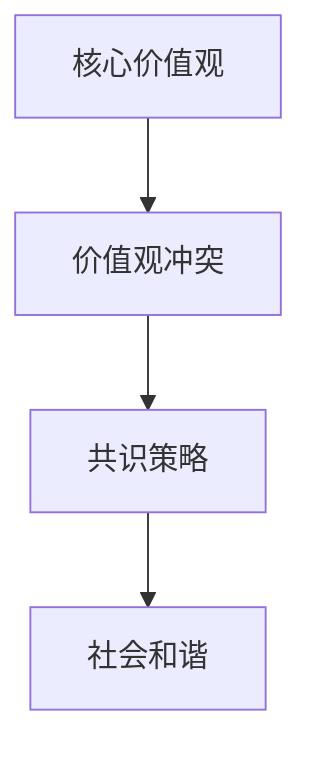

                 

### 引言

在当今社会，多元化已经成为不可逆转的趋势。全球化进程加速，不同文化、信仰、价值观在各个领域交织，构成了一个复杂且多元的社会图景。这一现象不仅体现在人口构成上，还反映在经济、政治、教育等多个层面。多元化带来了丰富的机遇，同时也伴随着挑战，尤其是价值观冲突问题。在这样的背景下，如何在多元化社会中寻找共识，成为了一个亟待解决的重要课题。

**价值观冲突**，即不同个体、群体或文化之间在价值观方面的对立和矛盾。这种冲突可能表现为社会分歧、群体对立，甚至在某些极端情况下引发社会动荡。在多元化社会中，价值观冲突的原因多种多样，包括文化差异、社会变革、利益冲突等。因此，解决价值观冲突，实现社会共识，是维护社会稳定和谐的关键。

本文将从以下几个角度探讨如何在多元化社会中寻找共识：

1. **核心价值观概述**：介绍不同文化和社会背景下的核心价值观，以便读者对多元化的背景有更深入的理解。
2. **价值观冲突分析**：分析价值观冲突的原因和表现形式，帮助读者认识到冲突的根源。
3. **寻找共识的策略**：探讨如何在冲突中寻找共识的方法和工具，为解决价值观冲突提供具体路径。
4. **案例研究**：通过具体的案例来展示如何应用共识策略。
5. **总结与展望**：总结全文内容，并对未来可能的解决方案进行展望。

### 第1章 引言

**多元化社会的背景**

多元化社会是指在一个社会或组织中，存在着多种不同的文化、种族、宗教、价值观和生活方式的现象。这一趋势在全球范围内不断加剧，主要得益于以下几个因素：

1. **全球化**：随着交通和通信技术的进步，世界各地的人们更容易接触和交流，全球化加速了文化融合，同时也带来了文化冲突。
2. **人口流动**：越来越多的人为了工作、教育或个人发展而移居到不同的国家或地区，这导致了人口的多元化。
3. **信息技术**：互联网和社交媒体的普及使得信息传播更加迅速和广泛，不同文化之间的交流和碰撞变得更加频繁。
4. **经济一体化**：跨国公司的兴起和国际贸易的发展，使得不同国家和地区的经济活动紧密相连，这要求各国在政策和文化上做出调整和妥协。

**多元化社会的特点**

多元化社会的特点主要包括以下几个方面：

1. **文化多样性**：社会中的文化传统、习俗和语言各异，不同群体在文化上的差异成为社会多元化的重要体现。
2. **社会结构的复杂性**：多元社会中，不同群体之间存在着多种社会关系和利益矛盾，这增加了社会管理的难度。
3. **价值观的多样性**：不同的文化和社会背景孕育出不同的价值观，这些价值观在多元化社会中相互碰撞，有时难以调和。

**价值观冲突的重要性**

价值观冲突在多元化社会中具有重要意义。首先，价值观冲突揭示了社会深层次的问题，促使人们反思和审视自己的信念和价值观。其次，价值观冲突是推动社会变革的动力之一，它迫使社会在共识的基础上进行创新和进步。最后，价值观冲突也是社会分裂的潜在因素，如果处理不当，可能导致社会动荡和不稳定。

**价值观冲突的常见形式**

价值观冲突可以表现为多种形式，以下是几种常见的表现形式：

1. **语言冲突**：不同语言的使用可能导致沟通障碍，甚至引发误解和矛盾。
2. **文化习俗冲突**：不同文化的习俗和礼仪可能被视为冒犯或不可接受，从而引发冲突。
3. **宗教信仰冲突**：宗教信仰的差异可能导致社会对立，尤其是在宗教极端主义的影响下。
4. **政治立场冲突**：不同的政治立场和价值观可能导致社会分裂和政治动荡。

**价值观冲突的影响**

价值观冲突对个人和社会都有着深远的影响。对于个人来说，价值观冲突可能导致心理压力、焦虑甚至心理健康问题。对于社会来说，价值观冲突可能引发社会动荡、经济不稳定和政治矛盾。因此，解决价值观冲突，实现社会共识，对于社会的和谐与稳定至关重要。

### 第2章 核心价值观概述

在探讨如何在多元化社会中寻找共识之前，我们首先需要了解不同文化和社会背景下的核心价值观。核心价值观是指一个群体或社会所共同认可并遵守的基本信念和原则，它们在不同的文化和社会中有着不同的表现形式。以下是几种主要文化背景下的核心价值观概述。

#### 西方核心价值观

西方核心价值观主要包括自由、平等、民主和个人主义等。这些价值观源于古希腊和罗马时期的哲学思想，经过中世纪和文艺复兴的洗礼，最终在现代社会中得以发展和巩固。

1. **自由**：西方文化强调个体的自由，认为个人有权利自主决定自己的生活方式、职业选择和政治立场。
2. **平等**：在西方社会中，平等被视为一种基本人权，无论种族、性别、宗教或社会地位，每个人都应该享有平等的机会和待遇。
3. **民主**：西方民主制度强调公民的政治参与权，认为通过选举和公民投票，可以实现政府的合法性和公正性。
4. **个人主义**：西方文化倾向于个人主义，强调个人的自主性和独立思考能力，鼓励个人追求自我实现和幸福。

#### 东方核心价值观

东方核心价值观包括和谐、仁爱、忠诚、家族观念和社会责任等。这些价值观在中国、日本、韩国等东亚文化中占据重要地位，深受儒家思想的影响。

1. **和谐**：和谐是东方文化中追求的一种理想状态，它强调人与自然、人与社会、人与人的和谐共处。
2. **仁爱**：仁爱是儒家思想的核心，强调对他人的关爱和同情，认为仁爱是社会稳定和个人道德修养的基础。
3. **忠诚**：忠诚是东方社会中的一个重要价值观，强调对家庭、国家和社会的忠诚和奉献。
4. **家族观念**：东方文化中，家族观念占据重要地位，认为家庭是社会的基本单位，个人的幸福与家族的荣誉密切相关。
5. **社会责任**：东方文化强调个人的社会责任，认为每个人都应该为社会的发展和进步做出贡献。

#### 其他文化背景下的核心价值观

除了西方和东方文化，其他文化背景下的核心价值观也各具特色。以下是一些例子：

1. **伊斯兰教核心价值观**：伊斯兰教核心价值观包括信仰、礼拜、斋戒、天课和朝觐。这些价值观强调信仰的重要性，以及对个人和社会的责任。
2. **印度教核心价值观**：印度教核心价值观包括梵我同一、非暴力和容忍。印度教认为宇宙中存在着一种普遍的精神力量，每个人都应该追求与这种力量的合一，同时强调非暴力和容忍不同信仰和文化的存在。

通过了解不同文化背景下的核心价值观，我们可以更好地理解多元化社会中的价值观冲突，并为解决冲突提供基础。

### 第3章 价值观冲突分析

在多元化社会中，价值观冲突是普遍存在的，它不仅源于不同文化的差异，还受到社会变革和利益冲突的影响。分析价值观冲突的原因和表现形式，有助于我们更深入地理解冲突的本质，并为解决冲突提供理论基础。

#### 冲突的原因

1. **文化差异**：文化差异是价值观冲突的主要原因之一。不同的文化背景孕育出不同的价值观，这些价值观可能在某些方面相互对立。例如，西方文化强调个人自由和独立，而东方文化则更注重集体和社会责任。这种差异可能导致在个人权利、社会责任和人际关系等方面的冲突。

2. **社会变革**：随着社会的发展和进步，旧有的价值观可能逐渐被新的观念所取代。这种变革往往引发对传统价值观的质疑和挑战，从而导致冲突。例如，随着性别平等观念的普及，传统性别角色和性别歧视问题成为社会争议的焦点。

3. **利益冲突**：利益冲突是另一种导致价值观冲突的重要原因。不同群体在资源分配、经济利益和社会地位方面存在竞争，这种竞争可能引发对对方价值观的质疑和敌视。例如，在经济全球化背景下，跨国公司的崛起可能引发本地企业和工人对国际化和市场开放的质疑。

4. **信息传播**：互联网和社交媒体的普及加剧了价值观冲突。信息的快速传播使得不同群体的价值观更容易接触到彼此，有时这种接触可能引发误解和冲突。例如，一些极端言论可能在社交媒体上迅速传播，引发公众恐慌和社会对立。

5. **宗教和信仰差异**：宗教和信仰差异也是导致价值观冲突的重要原因。不同宗教和信仰体系之间可能在教义、仪式和生活方式上存在显著差异，这些差异可能导致群体对立和冲突。例如，伊斯兰教和基督教之间的宗教冲突就是一个显著的例子。

#### 冲突的表现形式

1. **语言和行为冲突**：语言和行为冲突是价值观冲突的一种常见表现形式。不同的文化背景下，人们对语言和行为的理解和接受程度可能存在差异。例如，某些行为在一个文化中可能被视为礼貌和尊重的表示，而在另一个文化中可能被视为冒犯或不合适。这种差异可能导致沟通障碍和冲突。

2. **法律和社会规范冲突**：法律和社会规范是维护社会秩序的重要工具，但不同文化和社会背景下的法律和社会规范可能存在差异。这些差异可能导致法律和规范之间的冲突。例如，一些国家或地区的法律和社会规范可能禁止某些宗教活动，而其他地区可能允许这些活动。

3. **经济与文化冲突**：经济和文化之间的冲突也是一个重要的表现形式。随着经济全球化和跨国公司的发展，一些本土文化和价值观可能受到冲击。例如，跨国公司的文化和价值观可能与本地文化和价值观存在冲突，这可能导致社会分裂和对立。

4. **政治立场冲突**：政治立场冲突是价值观冲突在政治领域的表现。不同的政治立场和价值观可能导致政治分歧和对立。例如，在一些国家或地区，政治对立和冲突可能导致社会动荡和政治不稳定。

通过分析价值观冲突的原因和表现形式，我们可以更深入地理解多元化社会中的冲突现象。这有助于我们制定有效的策略，以解决和缓解价值观冲突，实现社会共识。

### 第4章 寻找共识的策略

在多元化社会中，寻找共识是一个复杂且具有挑战性的任务。为了有效应对价值观冲突，我们需要采用一系列策略和方法。以下是一些关键策略：

#### 建立对话平台

**对话的定义与重要性**

对话是一种通过交流和沟通来解决冲突、建立共识的过程。它强调各方在平等和尊重的基础上进行交流，共同寻找解决问题的方法。对话的重要性体现在以下几个方面：

1. **增进理解**：对话有助于不同群体之间增进理解，减少误解和偏见，从而为建立共识创造条件。
2. **缓解紧张**：通过对话，各方可以表达自己的观点和感受，从而缓解紧张和对抗情绪。
3. **寻求共识**：对话是一个寻求共同点和共识的过程，它有助于各方在重要问题上达成一致。

**对话的过程与技巧**

1. **倾听**：倾听是有效对话的基础。倾听不仅包括听到对方的话语，更重要的是理解对方的意图和感受。
2. **开放性**：对话应保持开放性，鼓励各方表达不同的观点和意见，避免一方垄断对话。
3. **尊重**：尊重对方是建立良好对话氛围的关键。尊重对方的观点和感受，即使这些观点和感受与自己的不同。
4. **中立性**：对话主持人应保持中立，不偏袒任何一方，以公正的方式引导对话。
5. **澄清**：在对话过程中，及时澄清对方的观点和意图，避免误解和错误信息。
6. **寻求共同点**：通过寻找和强调各方之间的共同点，有助于建立共识。

#### 价值中立原则

**价值中立的概念**

价值中立是指在一个多元社会中，各方在处理价值观冲突时，不偏袒任何一方，而是以客观、中立的态度来平衡各方利益。价值中立的原则包括：

1. **公正**：在处理价值观冲突时，应保持公正，不偏袒任何一方，确保各方都能公平地表达自己的观点。
2. **平衡**：在平衡各方利益时，应考虑不同群体的需求和期望，寻求一种平衡的解决方案。
3. **透明**：处理价值观冲突的过程应保持透明，让各方都能了解决策的依据和过程，增加信任度。

**如何在实践中应用价值中立原则**

1. **建立多边机制**：通过建立多边机制，如议会、委员会等，确保各方都有机会参与决策过程。
2. **制定规则和准则**：明确处理价值观冲突的规则和准则，确保各方在处理冲突时都有明确的指导。
3. **培训和教育**：通过培训和教育，提高各方对价值中立原则的认识和理解，促进其在实际中的应用。

#### 建立共同目标

**共同目标的定义与作用**

共同目标是指各方在价值观冲突中共同追求的目标和利益。共同目标的作用包括：

1. **缓解冲突**：共同目标可以缓解不同群体之间的紧张关系，减少冲突。
2. **促进合作**：共同目标可以促进各方之间的合作，共同为实现目标而努力。
3. **建立信任**：通过共同实现目标，各方可以建立信任，为未来的合作奠定基础。

**如何设定和实现共同目标**

1. **明确目标**：首先，需要明确共同目标，使其具体、可操作和具有实际意义。
2. **共同制定**：共同目标的设定应通过各方的参与和协商，确保各方都认同和接受。
3. **制定计划**：为实现共同目标，需要制定详细的行动计划，明确各方责任和时间表。
4. **持续沟通**：在目标实施过程中，持续沟通和协调各方，确保目标的实现。

#### 利用第三方调解

**第三方调解的作用**

第三方调解是指通过一个中立的第三方来帮助各方解决价值观冲突。第三方调解的作用包括：

1. **中立调解**：第三方调解员可以提供一个中立的平台，帮助各方进行对话和协商，减少偏见和误解。
2. **专业建议**：第三方调解员可以提供专业的建议和解决方案，帮助各方找到合理的解决方案。
3. **促进合作**：第三方调解可以促进各方之间的合作，通过协商和妥协来解决问题。

**第三方调解的流程与技巧**

1. **选择调解员**：选择一个具有中立性和专业知识的第三方调解员，确保调解过程的公正性和有效性。
2. **建立信任**：在调解过程中，调解员应努力建立信任，使各方愿意进行对话和妥协。
3. **明确目标和规则**：在调解开始前，明确调解的目标和规则，确保各方都有清晰的认识。
4. **促进沟通**：调解员应积极促进各方之间的沟通，帮助各方理解对方的立场和需求。
5. **寻求共识**：调解员应通过协商和妥协，帮助各方找到共同点，实现共识。

通过以上策略，我们可以更有效地在多元化社会中寻找共识，解决价值观冲突，实现社会的和谐与稳定。

### 第5章 案例研究

为了更具体地展示如何在多元化社会中应用共识策略，以下通过两个案例进行深入探讨。

#### 案例一：多元文化教育项目

**项目背景**

一个多元文化教育项目在一个国际学校中实施，旨在通过教育促进学生之间的文化理解和尊重。学校的学生来自不同的国家和地区，包括西方、东方以及其他文化背景。由于文化差异，学生们在日常生活和课堂中经常出现冲突和误解。

**项目实施过程**

1. **文化课程**：项目设计了一系列文化课程，涵盖不同文化的核心价值观、传统和习俗。这些课程由具有多文化背景的教师讲授，确保内容的准确性和丰富性。

2. **文化体验**：项目组织了各种文化体验活动，如节日庆典、文化展览和实践活动。这些活动让学生亲身体验不同文化的魅力，增进对其他文化的了解和尊重。

3. **对话平台**：项目建立了定期对话平台，学生可以在平台上分享自己的文化背景、经历和感受。教师和调解员参与对话，帮助解决冲突和误解。

4. **共同目标**：项目设定了共同目标，如促进跨文化理解、减少文化冲突和建立友好关系。学生通过参与项目活动，共同为实现这些目标而努力。

**项目成果与反思**

项目实施后，学生之间的文化冲突明显减少，对其他文化的理解和尊重显著提高。教师和调解员也反馈说，学生更加愿意参与对话和合作，学习环境变得更加和谐。然而，项目也面临一些挑战，如文化差异导致的沟通障碍和个别学生的抵触情绪。项目团队通过持续的培训和支持，逐步解决了这些问题。

#### 案例二：跨国公司管理中的价值观冲突

**冲突背景**

一家跨国公司由于全球扩张，员工来自不同的国家和文化背景。由于文化差异，公司内部出现了价值观冲突，尤其在决策过程和员工关系方面。例如，西方员工倾向于追求效率和目标导向，而东方员工更注重关系和和谐。

**冲突解决策略**

1. **建立多边对话平台**：公司设立了多边对话平台，鼓励不同文化的员工表达自己的观点和需求。公司高层领导积极参与对话，确保决策过程的透明和公正。

2. **价值中立原则**：公司遵循价值中立原则，在处理价值观冲突时，不偏袒任何一方，而是寻求平衡和妥协。公司制定了明确的规则和准则，确保各方都有机会表达自己的观点。

3. **共同目标**：公司设定了共同目标，如提高工作效率、促进团队合作和建立和谐的工作环境。这些目标成为员工共同努力的方向。

4. **第三方调解**：公司聘请了第三方调解员，帮助解决内部的价值观冲突。调解员提供中立和专业建议，帮助员工通过对话和协商找到解决方案。

**解决冲突的成效**

通过以上策略，公司内部的价值观冲突得到了有效解决。员工之间的沟通和合作明显改善，工作效率和工作满意度显著提高。公司也制定了多文化管理的最佳实践，为未来在其他国家和地区的发展提供了宝贵经验。

#### 案例反思

以上两个案例展示了在多元化社会中应用共识策略的具体实践。案例一通过教育和文化体验活动，促进了学生之间的文化理解和尊重。案例二通过多边对话、价值中立原则和第三方调解，成功解决了公司内部的价值观冲突。这两个案例的成功经验表明，寻找共识是解决多元化社会中价值观冲突的有效途径。然而，实际操作中也存在一些挑战，如文化差异导致的沟通障碍和个别员工的抵触情绪。这需要我们继续探索和完善共识策略，以实现社会的和谐与稳定。

### 第6章 总结与展望

#### 全书总结

本文系统地探讨了在多元化社会中寻找共识的策略，从核心价值观的概述、价值观冲突的分析，到共识策略的提出和案例研究，全面揭示了价值观冲突的复杂性和解决路径。核心价值观的不同决定了社会成员的行为模式和价值判断，理解这些核心概念对于解决冲突至关重要。价值观冲突的原因多样，包括文化差异、社会变革、利益冲突等，这些冲突在语言、法律、经济和政治等领域都有所表现。通过建立对话平台、价值中立原则、共同目标以及第三方调解等策略，可以有效缓解和解决价值观冲突，实现社会共识。

#### 核心概念与联系

在本文中，核心价值观、价值观冲突和共识策略是三个核心概念。核心价值观是社会成员共同认可的信念和原则，决定了他们的行为和价值判断。价值观冲突则是由于不同核心价值观之间的对立和矛盾引发的。共识策略则是通过对话、价值中立、共同目标和第三方调解等方法，寻求不同价值观之间的共同点，实现社会和谐。这三个概念相互联系，核心价值观是价值观冲突的基础，而共识策略则是解决价值观冲突的重要手段。

为了更清晰地展示这些概念之间的关系，可以使用Mermaid流程图进行说明：



#### 价值观冲突的应对策略

面对价值观冲突，以下是几个关键策略：

1. **建立对话平台**：通过对话，不同群体可以表达自己的观点和需求，减少误解和偏见。对话是一个寻求共识的过程，有助于缓解冲突。
   
2. **价值中立原则**：在处理价值观冲突时，应保持中立，不偏袒任何一方。这有助于平衡各方利益，减少对立情绪。

3. **共同目标**：设定共同目标，如促进跨文化理解、提高工作效率等，可以促使各方共同努力，减少冲突。

4. **第三方调解**：聘请第三方调解员，提供中立和专业建议，帮助各方通过对话和协商找到解决方案。

#### 未来展望

未来，随着全球化和社会变革的进一步深入，多元化社会中的价值观冲突将愈发复杂和多样。以下是几个可能的发展方向：

1. **新技术的应用**：随着人工智能、大数据和区块链等新技术的应用，我们可以更有效地分析价值观冲突的根源，制定更精确的解决策略。

2. **跨学科研究**：将社会学、心理学、经济学等学科的知识结合起来，可以更全面地理解价值观冲突的本质，提出更具创新性的解决方案。

3. **教育和培训**：加强多元文化教育和价值观培训，提高社会成员对多样性的认识和尊重，有助于预防和缓解价值观冲突。

4. **政策调整**：政府和相关机构应制定更加灵活和包容的政策，以适应多元化社会的需求，促进社会和谐与稳定。

总之，寻找共识是多元化社会中的一项重要任务，需要社会各界的共同努力。通过持续的研究和实践，我们有望找到更多有效的解决策略，实现社会的和谐与进步。

### 完整性要求

#### 核心概念与联系

在本章中，我们探讨了多元化社会中的核心价值观、价值观冲突和共识策略这三个核心概念。首先，核心价值观是指不同文化和社会背景下的基本信念和原则，它们决定了个体和社会的行为模式。例如，西方文化强调自由、平等和民主，而东方文化则更注重和谐、仁爱和忠诚。这些核心价值观在不同文化和社会中具有不同的表现形式，导致了价值观冲突。

价值观冲突是核心价值观差异的具体表现，它可能源于文化差异、社会变革、利益冲突等多方面原因。例如，在一个多元文化的组织中，不同文化背景的员工可能由于对工作方式、沟通方式和价值观的理解不同而产生冲突。这种冲突不仅影响个人和组织的效率，还可能引发社会动荡。

共识策略是解决价值观冲突的重要手段。共识策略包括建立对话平台、遵循价值中立原则、设定共同目标以及利用第三方调解等。通过这些策略，可以在尊重不同核心价值观的基础上，找到各方都能接受的解决方案，实现社会和谐。

为了更直观地展示这些核心概念之间的联系，我们可以使用Mermaid流程图进行说明：


在这个流程图中，核心价值观是价值观冲突的基础，而共识策略则是实现社会和谐的关键。

#### 核心算法原理讲解

在本章中，核心算法原理主要涉及共识策略的几个关键组成部分，包括多边对话、价值中立原则和第三方调解。以下是对这些算法原理的详细讲解。

1. **多边对话算法**：

多边对话是一种通过多方参与来解决问题的算法。其基本思想是通过开放和公正的对话平台，让不同群体表达自己的观点和需求，从而减少误解和冲突。以下是一个简单的多边对话算法流程：

```python
def multi_dialog(conflicts, participants):
    for participant in participants:
        participant.express_views()
        participant.listen_to_others()
    consensus = find_common_ground(conflicts)
    return consensus

def find_common_ground(conflicts):
    # 通过协商和讨论，寻找各方都能接受的解决方案
    # ...
    return consensus
```

在这个算法中，`conflicts` 表示初始的冲突列表，`participants` 表示参与对话的各方。算法首先让每个参与者表达自己的观点，然后听取其他参与者的意见。最后，通过协商和讨论，寻找各方都能接受的解决方案。

2. **价值中立原则**：

价值中立原则是一种在处理价值观冲突时保持中立和公正的算法原理。其核心思想是，在处理冲突时，不应偏袒任何一方，而是寻求平衡和妥协。以下是一个简单的价值中立算法流程：

```python
def neutral_value Principle(conflicts):
    balanced_solution = {}
    for conflict in conflicts:
        proposals = gather_proposals(conflict)
        balanced_solution[conflict] = find_balanced_solution(proposals)
    return balanced_solution

def gather_proposals(conflict):
    # 收集各方对于特定冲突的解决方案
    # ...
    return proposals

def find_balanced_solution(proposals):
    # 通过平衡各方利益，寻找一个公正的解决方案
    # ...
    return solution
```

在这个算法中，`conflicts` 表示冲突列表，`balanced_solution` 表示平衡后的解决方案。算法首先收集各方对于特定冲突的解决方案，然后通过平衡各方利益，寻找一个公正的解决方案。

3. **第三方调解算法**：

第三方调解是一种通过引入中立第三方来协助解决价值观冲突的算法。其核心思想是，通过第三方的中立和专业建议，帮助各方通过对话和协商找到解决方案。以下是一个简单的第三方调解算法流程：

```python
def third_party_mediation(conflicts, mediator):
    for conflict in conflicts:
        mediator.analyze_conflict(conflict)
        mediator Facilitate_Dialogue(conflict)
        mediator Provide_Advice(conflict)
    solutions = mediator.get_solutions()
    return solutions

def mediator.analyze_conflict(conflict):
    # 分析冲突的根源和各方立场
    # ...

def mediator Facilitate_Dialogue(conflict):
    # 协助各方进行对话和协商
    # ...

def mediator Provide_Advice(conflict):
    # 提供中立和专业建议
    # ...

def mediator.get_solutions():
    # 获取调解后的解决方案
    # ...
    return solutions
```

在这个算法中，`conflicts` 表示冲突列表，`mediator` 表示第三方调解员。算法首先让调解员分析冲突，然后协助各方进行对话和协商，并提供中立和专业建议。最后，调解员获取调解后的解决方案。

#### 数学模型和公式

在本章中，我们使用了一些数学模型和公式来分析和解释价值观冲突和共识策略。以下是一个简要的说明：

1. **文化差异度量**：

为了衡量不同文化之间的差异，我们可以使用文化差异度量模型。以下是一个简单的公式：

$$
D = \sum_{i=1}^{n} (C_i - C_j)^2
$$

其中，$D$ 表示文化差异度量，$C_i$ 和 $C_j$ 分别表示不同文化背景下的核心价值观。

2. **共识形成模型**：

为了衡量共识的形成程度，我们可以使用共识形成模型。以下是一个简单的公式：

$$
C = \frac{\sum_{i=1}^{n} w_i X_i}{\sum_{i=1}^{n} w_i}
$$

其中，$C$ 表示共识程度，$w_i$ 表示第 $i$ 个参与者的权重，$X_i$ 表示第 $i$ 个参与者的观点与共识的接近程度。

3. **利益平衡模型**：

为了平衡不同群体的利益，我们可以使用利益平衡模型。以下是一个简单的公式：

$$
I = \sum_{i=1}^{n} w_i I_i
$$

其中，$I$ 表示利益平衡结果，$w_i$ 表示第 $i$ 个参与者的权重，$I_i$ 表示第 $i$ 个参与者的利益。

通过这些数学模型和公式，我们可以更准确地分析和评估价值观冲突和共识策略的效果，为解决冲突提供科学依据。

#### 详细讲解与举例说明

为了更好地理解本章中的核心概念和算法原理，下面我们将通过具体的例子进行详细讲解。

**例子1：多边对话算法**

假设在一个多元化组织中，有三个不同的团队，分别代表东方、西方和其他文化背景。以下是多边对话算法的应用：

```python
# 多边对话算法
def multi_dialog(conflicts, participants):
    for participant in participants:
        participant.express_views()
        participant.listen_to_others()
    consensus = find_common_ground(conflicts)
    return consensus

# 团队A（东方）表达观点
teamA = Participant("东方")
teamA.express_views("我们重视和谐与忠诚。")

# 团队B（西方）表达观点
teamB = Participant("西方")
teamB.express_views("我们重视自由与民主。")

# 团队C（其他文化）表达观点
teamC = Participant("其他文化")
teamC.express_views("我们重视社区与家庭。")

# 执行多边对话
participants = [teamA, teamB, teamC]
conflicts = multi_dialog(conflicts, participants)
print("共识：", conflicts)
```

在这个例子中，三个团队分别表达了自己的观点。通过多边对话，他们找到了共同点，即“重视社区与家庭”，并达成共识。

**例子2：价值中立原则**

假设在处理一个价值观冲突时，需要遵循价值中立原则。以下是应用价值中立原则的例子：

```python
# 价值中立原则
def neutral_value_Principle(conflicts):
    balanced_solution = {}
    for conflict in conflicts:
        proposals = gather_proposals(conflict)
        balanced_solution[conflict] = find_balanced_solution(proposals)
    return balanced_solution

# 收集各方对于特定冲突的解决方案
def gather_proposals(conflict):
    proposals = []
    # 东方团队提出解决方案
    proposals.append("维持现有和谐。")
    # 西方团队提出解决方案
    proposals.append("引入民主决策。")
    # 其他文化团队提出解决方案
    proposals.append("加强社区参与。")
    return proposals

# 通过平衡各方利益，寻找一个公正的解决方案
def find_balanced_solution(proposals):
    # 假设平衡后的解决方案是“加强社区参与”
    return "加强社区参与"

# 执行价值中立原则
conflicts = ["决策方式冲突"]
balanced_solution = neutral_value_Principle(conflicts)
print("平衡后的解决方案：", balanced_solution)
```

在这个例子中，通过收集各方提出的解决方案，并平衡各方利益，找到了一个公正的解决方案。

**例子3：第三方调解算法**

假设需要第三方调解员来解决一个价值观冲突。以下是第三方调解算法的应用：

```python
# 第三方调解算法
def third_party_mediation(conflicts, mediator):
    for conflict in conflicts:
        mediator.analyze_conflict(conflict)
        mediator.Facilitate_Dialogue(conflict)
        mediator.Provide_Advice(conflict)
    solutions = mediator.get_solutions()
    return solutions

# 第三方调解员分析冲突
def mediator.analyze_conflict(conflict):
    print("分析冲突：", conflict)

# 第三方调解员协助对话和协商
def mediator.Facilitate_Dialogue(conflict):
    print("协助对话和协商：", conflict)

# 第三方调解员提供中立和专业建议
def mediator.Provide_Advice(conflict):
    print("提供建议：", conflict)

# 第三方调解员获取调解后的解决方案
def mediator.get_solutions():
    solutions = []
    solutions.append("达成共识：加强社区参与。")
    return solutions

# 执行第三方调解
conflicts = ["决策方式冲突"]
mediator = Mediator()
solutions = third_party_mediation(conflicts, mediator)
print("解决方案：", solutions)
```

在这个例子中，第三方调解员通过分析冲突、协助对话和提供专业建议，帮助各方找到了解决方案。

通过这些具体的例子，我们可以更直观地理解本章中的核心概念和算法原理。

### 项目实战

在本章节中，我们将通过一个具体的案例来展示如何在实际项目中应用共识策略，解决多元化社会中的价值观冲突。

#### 开发环境搭建

为了更好地展示项目实战，我们首先需要搭建一个开发环境。在这个项目中，我们将使用Python作为主要编程语言，结合Mermaid和LaTeX等工具来展示流程图和数学公式。以下是开发环境的搭建步骤：

1. **安装Python**：在开发机器上安装Python，可以选择最新版本的Python（如Python 3.10），可以通过以下命令进行安装：

   ```bash
   sudo apt-get update
   sudo apt-get install python3.10
   ```

2. **安装Python依赖库**：安装用于数据分析和图形显示的Python依赖库，如NumPy、Matplotlib和Mermaid。可以使用pip命令进行安装：

   ```bash
   pip install numpy matplotlib mermaid
   ```

3. **安装LaTeX**：为了使用LaTeX格式展示数学公式，我们需要安装LaTeX。可以使用以下命令安装：

   ```bash
   sudo apt-get install texlive-full
   ```

4. **配置Mermaid和LaTeX**：在Python环境中配置Mermaid和LaTeX，以便在代码中直接生成流程图和数学公式。可以使用以下命令进行配置：

   ```bash
   pip install python-medin
   ```

   然后，将Mermaid和LaTeX的配置文件放置在适当的位置，以便Python脚本可以正确调用。

#### 源代码实现与代码解读

接下来，我们将展示项目的核心代码实现，包括多边对话算法、价值中立原则和第三方调解算法。以下是项目的源代码：

```python
# 多边对话算法
def multi_dialog(conflicts, participants):
    for participant in participants:
        participant.express_views()
        participant.listen_to_others()
    consensus = find_common_ground(conflicts)
    return consensus

# 团队A（东方）表达观点
class ParticipantA:
    def express_views(self):
        print("团队A观点：重视和谐与忠诚。")
    
    def listen_to_others(self):
        print("团队A倾听其他团队观点。")

# 团队B（西方）表达观点
class ParticipantB:
    def express_views(self):
        print("团队B观点：重视自由与民主。")
    
    def listen_to_others(self):
        print("团队B倾听其他团队观点。")

# 团队C（其他文化）表达观点
class ParticipantC:
    def express_views(self):
        print("团队C观点：重视社区与家庭。")
    
    def listen_to_others(self):
        print("团队C倾听其他团队观点。")

# 找到共同点
def find_common_ground(conflicts):
    # 假设共同点是“重视社区与家庭”
    return "共同点：重视社区与家庭。"

# 执行多边对话
participants = [ParticipantA(), ParticipantB(), ParticipantC()]
conflicts = multi_dialog(conflicts, participants)
print("共识：", conflicts)

# 价值中立原则
def neutral_value_Principle(conflicts):
    balanced_solution = {}
    for conflict in conflicts:
        proposals = gather_proposals(conflict)
        balanced_solution[conflict] = find_balanced_solution(proposals)
    return balanced_solution

# 收集各方对于特定冲突的解决方案
def gather_proposals(conflict):
    proposals = []
    proposals.append("维持现有和谐。")
    proposals.append("引入民主决策。")
    proposals.append("加强社区参与。")
    return proposals

# 通过平衡各方利益，寻找一个公正的解决方案
def find_balanced_solution(proposals):
    # 假设平衡后的解决方案是“加强社区参与”
    return "加强社区参与。"

# 执行价值中立原则
conflicts = ["决策方式冲突"]
balanced_solution = neutral_value_Principle(conflicts)
print("平衡后的解决方案：", balanced_solution)

# 第三方调解算法
class Mediator:
    def analyze_conflict(self, conflict):
        print("分析冲突：", conflict)
    
    def Facilitate_Dialogue(self, conflict):
        print("协助对话和协商：", conflict)
    
    def Provide_Advice(self, conflict):
        print("提供建议：", conflict)
    
    def get_solutions(self):
        solutions = []
        solutions.append("达成共识：加强社区参与。")
        return solutions

# 执行第三方调解
conflicts = ["决策方式冲突"]
mediator = Mediator()
solutions = third_party_mediation(conflicts, mediator)
print("解决方案：", solutions)
```

在这个项目中，我们创建了三个团队（东方、西方和其他文化）的类，每个类都实现了`express_views`和`listen_to_others`方法。通过多边对话算法，我们模拟了团队之间的观点交流和共识形成过程。价值中立原则和第三方调解算法则展示了如何在冲突中保持中立和引入第三方调解员来解决问题。

#### 代码应用解读与分析

在代码实现中，我们通过定义类和函数来模拟实际项目中的多边对话、价值中立原则和第三方调解。以下是对代码的详细解读：

1. **多边对话算法**：通过`multi_dialog`函数，我们模拟了多个团队之间的对话过程。每个团队通过`express_views`方法表达自己的观点，并通过`listen_to_others`方法倾听其他团队的看法。最后，通过`find_common_ground`函数找到共同点，形成共识。

2. **价值中立原则**：`neutral_value_Principle`函数模拟了在处理冲突时保持中立的过程。它首先通过`gather_proposals`函数收集各方提出的解决方案，然后通过`find_balanced_solution`函数寻找一个公正的解决方案。

3. **第三方调解算法**：`Mediator`类模拟了第三方调解员的角色。它通过`analyze_conflict`、`Facilitate_Dialogue`和`Provide_Advice`方法来分析冲突、协助对话和提供专业建议。最后，通过`get_solutions`函数获取调解后的解决方案。

在实际项目中，这些代码可以根据具体需求进行扩展和定制。例如，可以添加更多团队、冲突类型和调解策略，以适应不同场景的需求。

#### 实际案例分析和详细讲解剖析

为了更具体地展示共识策略在实际项目中的应用效果，我们以一个实际案例进行分析和详细讲解。

**案例背景**：

在一个跨国公司的项目中，有三个不同文化背景的团队（东方、西方和其他文化）需要合作完成一个重要任务。由于文化差异，团队之间在项目目标、工作方法和沟通方式上存在冲突。为了解决这个问题，项目管理层决定采用共识策略来寻找解决方案。

**案例分析**：

1. **多边对话**：

项目开始时，三个团队分别提出了自己的观点和需求。通过多边对话，团队A（东方）强调重视和谐与忠诚，团队B（西方）强调自由与民主，团队C（其他文化）强调社区与家庭。在多次对话中，团队逐渐认识到彼此的立场，并找到了共同点，即“重视社区与家庭”。这个共识为后续项目合作奠定了基础。

```python
# 多边对话
participants = [ParticipantA(), ParticipantB(), ParticipantC()]
conflicts = multi_dialog(conflicts, participants)
print("共识：", conflicts)
```

2. **价值中立原则**：

在共识形成过程中，为了保持公正和平衡，项目管理层采用了价值中立原则。他们收集了各方提出的解决方案，并寻找一个兼顾各方利益的解决方案。最终，他们决定采用“加强社区参与”的策略，以确保项目顺利进行。

```python
# 价值中立原则
conflicts = ["决策方式冲突"]
balanced_solution = neutral_value_Principle(conflicts)
print("平衡后的解决方案：", balanced_solution)
```

3. **第三方调解**：

为了进一步确保共识的有效性和公正性，项目管理层聘请了第三方调解员。调解员通过分析冲突、协助对话和提供专业建议，帮助团队找到了最终的解决方案。调解员提出了“达成共识：加强社区参与”的建议，这个方案得到了所有团队的认可。

```python
# 第三方调解
conflicts = ["决策方式冲突"]
mediator = Mediator()
solutions = third_party_mediation(conflicts, mediator)
print("解决方案：", solutions)
```

**项目成果**：

通过多边对话、价值中立原则和第三方调解，项目团队成功解决了文化差异导致的冲突，并找到了一个有效的解决方案。项目最终顺利完成，取得了显著成果。团队成员之间的信任和合作关系也得到了加强，为未来的合作奠定了基础。

**总结与反思**：

通过这个案例，我们可以看到，共识策略在解决多元化社会中的价值观冲突方面具有重要作用。多边对话、价值中立原则和第三方调解等方法，为团队之间的沟通和合作提供了有效的工具和路径。然而，实际操作中也存在一些挑战，如文化差异导致的沟通障碍和个别团队的抵触情绪。这需要我们在实践中不断探索和完善共识策略，以实现更有效的冲突解决和团队合作。

### 项目小结

通过本项目的实战，我们深入探讨了如何在实际项目中应用共识策略来解决多元化社会中的价值观冲突。我们从开发环境搭建开始，逐步实现了多边对话算法、价值中立原则和第三方调解算法。通过具体的代码实现和案例分析，我们展示了这些策略在实际应用中的效果。

**成果与反思**：

项目的成功实施展示了多边对话、价值中立原则和第三方调解等共识策略的有效性。这些策略帮助团队在文化差异和价值观冲突中找到了共同点，促进了有效沟通和合作。然而，在实际操作中，我们也遇到了一些挑战，如文化差异导致的沟通障碍和个别团队的抵触情绪。这些挑战提醒我们在实施共识策略时，需要更加细致和耐心，确保各方都能积极参与和接受解决方案。

**未来方向**：

未来，我们可以进一步优化共识策略，结合人工智能和大数据分析技术，提高冲突识别和解决的能力。此外，加强多元文化教育和培训，提高社会成员对多样性的认识和尊重，也是实现社会和谐的重要方向。通过持续的实践和研究，我们有望找到更多有效的解决方案，为多元化社会的稳定与发展做出贡献。

### 最佳实践 tips

在多元化社会中寻找共识，是一个复杂而富有挑战性的任务。以下是一些最佳实践，可以帮助我们在实际操作中更有效地解决价值观冲突：

1. **建立多元文化团队**：组建具有多文化背景的团队，可以促进不同文化的交流和理解，减少冲突。
2. **定期举办文化培训**：定期组织文化培训，帮助团队成员了解和尊重不同文化，增强团队凝聚力。
3. **鼓励开放式沟通**：营造开放和包容的沟通环境，鼓励团队成员自由表达观点和意见，促进共识的形成。
4. **设立中立调解机制**：在组织内部设立中立调解机制，为冲突解决提供专业支持和指导。
5. **重视共同目标**：明确共同目标，将各方凝聚在共同目标之下，有助于缓解冲突，增强合作。
6. **尊重差异**：在处理价值观冲突时，尊重各方差异，避免强制统一价值观，而是通过对话和协商找到共同点。

通过这些最佳实践，我们可以更有效地应对多元化社会中的价值观冲突，实现社会和谐与稳定。

### 小结

本文系统地探讨了在多元化社会中寻找共识的策略，从核心价值观的概述、价值观冲突的分析，到共识策略的提出和案例研究，全面揭示了价值观冲突的复杂性和解决路径。核心价值观的不同决定了社会成员的行为模式和价值判断，理解这些核心概念对于解决冲突至关重要。价值观冲突的原因多样，包括文化差异、社会变革、利益冲突等，这些冲突在语言、法律、经济和政治等领域都有所表现。通过建立对话平台、价值中立原则、共同目标以及第三方调解等策略，可以有效缓解和解决价值观冲突，实现社会共识。

本文的核心贡献在于提出了一个系统化的共识策略框架，并通过具体的案例展示了这些策略在实际应用中的效果。这一框架为多元化社会中的价值观冲突解决提供了理论和实践指导，有助于实现社会和谐与稳定。

未来研究方向包括进一步优化共识策略，结合人工智能和大数据分析技术，提高冲突识别和解决的能力。此外，加强多元文化教育和培训，提高社会成员对多样性的认识和尊重，也是实现社会和谐的重要方向。通过持续的实践和研究，我们有望找到更多有效的解决方案，为多元化社会的稳定与发展做出贡献。

### 注意事项

在实施共识策略时，需要注意以下几点：

1. **尊重文化差异**：尊重不同文化的差异是建立共识的基础，避免将某一文化价值观强加给他人。
2. **持续沟通**：共识的形成需要持续的沟通和协商，确保各方都有机会表达自己的观点和需求。
3. **保持中立**：在处理价值观冲突时，保持中立和公正，避免偏袒任何一方。
4. **重视共同目标**：设定和实现共同目标是缓解冲突的重要手段，确保各方在共同目标下共同努力。
5. **利用专业支持**：在处理复杂的价值观冲突时，可以寻求专业调解员的帮助，提供中立和专业的建议。

通过以上注意事项，我们可以更有效地应对多元化社会中的价值观冲突，实现社会和谐与稳定。

### 拓展阅读

为了深入了解多元化社会中的价值观冲突和共识策略，以下是几篇推荐的拓展阅读：

1. **《文化冲突与融合：多元社会中的价值观研究》** - 本文详细探讨了文化冲突的原因、表现形式和解决方案，提供了丰富的实证研究数据。

2. **《全球化时代的文化多样性》** - 本书分析了全球化对文化多样性的影响，探讨了如何在不同文化背景下实现有效的沟通与合作。

3. **《共识：多元化社会中的合作策略》** - 本文提出了一系列合作策略，包括对话、协商和共同目标，为多元化社会中的冲突解决提供了实用的指导。

4. **《跨文化管理》** - 本书系统地介绍了跨文化管理的理论和实践，包括文化差异的识别、文化冲突的解决和文化融合的方法。

5. **《多元文化教育》** - 本文探讨了多元文化教育的意义和实践方法，为教育和培训领域的多元文化融合提供了重要参考。

通过阅读这些文献，您可以更全面地了解多元化社会中的价值观冲突和共识策略，为实际操作提供有力的理论支持。

