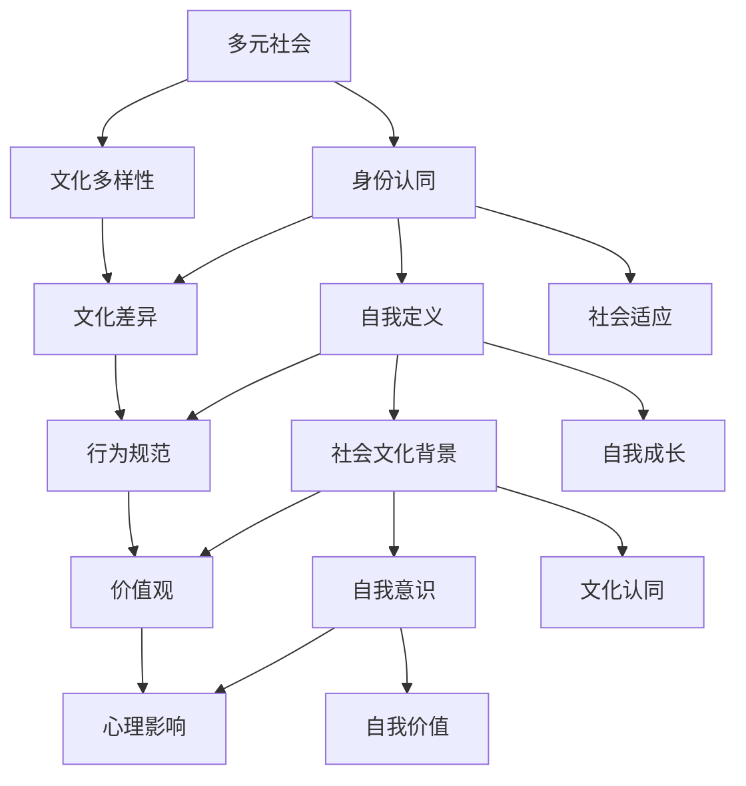

                 


### 背景介绍

在多元社会中，建立身份认同已成为一个极具挑战性的课题。随着全球化、互联网以及信息技术的发展，人们的生活、工作环境日益多元化。这种多元性不仅体现在文化、种族、宗教等方面，还体现在个体与群体之间的互动关系上。身份认同，作为一个复杂且多层次的概念，不仅关系到个体的心理健康，还影响着社会的和谐发展。

本文旨在探讨在多元社会中建立身份认同的内在逻辑和方法。首先，我们将介绍多元社会的定义及其特点，然后深入解析身份认同的核心概念，并探讨多元社会下身份认同的构建与挑战。接着，本文将探讨自我意识与自我定义的关系，以及如何通过自我探索来增强身份认同。此外，本文还将分析身份认同与心理健康、人际关系以及社会责任之间的联系。最后，我们将对身份认同的未来展望进行探讨。

本文结构如下：

1. **多元社会与身份认同**：介绍多元社会的定义与特点，探讨身份认同的核心概念及其重要性。
2. **身份认同的自我定义艺术**：分析自我意识与自我定义的关系，介绍自我探索的方法与技巧。
3. **身份认同的心理健康与人际关系**：探讨身份认同与心理健康的关系，以及身份认同在人际关系中的作用。
4. **身份认同的自我实现与社会责任**：分析身份认同的自我实现路径，探讨身份认同与社会责任的关系。
5. **身份认同的未来展望**：展望身份认同在未来社会中的发展趋势和挑战。

通过以上结构的划分，我们将逐步分析在多元社会中建立身份认同的内在逻辑和方法，为读者提供实用的指导和建议。

### 核心概念与联系

在探讨多元社会中建立身份认同的过程中，我们需要明确几个核心概念，并理解它们之间的相互关系。以下是对这些核心概念的解析：

1. **多元社会**：多元社会是指由多个不同文化、种族、宗教、价值观和生活方式构成的复杂社会。在这样的社会中，个体面临着来自不同文化背景的压力和挑战，如何在这个多元环境中找到自己的位置，是建立身份认同的关键。

2. **身份认同**：身份认同是指个体对自身身份的认知和确认，包括个人的文化、种族、宗教、性别、职业等多个方面。身份认同不仅仅是个体的自我认知，还与个体所在的社会环境、文化背景密切相关。

3. **自我定义**：自我定义是指个体在多元社会中通过自我反思和自我探索，构建和维护自己的身份。自我定义是一个动态过程，个体需要不断调整和更新自己的身份认知，以适应社会环境的变化。

4. **社会文化背景**：社会文化背景是影响个体身份认同的重要因素。不同的文化背景会影响个体的价值观、行为规范和生活方式，从而影响个体的身份认同。

5. **自我意识**：自我意识是指个体对自己存在的感知和认识，包括自我认知、自我感受和自我反思。自我意识是建立身份认同的基础，个体需要通过自我意识来认识自己，并找到自己的位置。

为了更直观地理解这些核心概念之间的联系，我们可以使用Mermaid流程图来展示它们之间的关系：



通过这个流程图，我们可以看到，多元社会为个体提供了多样化的文化背景，这些文化背景会影响个体的自我认知和自我反思，进而影响个体的自我定义和身份认同。同时，个体的自我意识和社会文化背景相互影响，共同塑造了个体在多元社会中的角色和地位。理解这些核心概念之间的联系，有助于我们更好地理解和应对多元社会中的身份认同问题。

### 核心算法原理讲解

为了更好地理解身份认同的自我定义过程，我们可以借鉴一些心理学和认知科学的理论，将这些理论转化为伪代码，以便于解释身份认同的核心算法原理。

#### 伪代码：身份认同构建算法

```plaintext
Algorithm: 身份认同构建算法
Input: 自我感知数据，社会文化环境数据
Output: 身份认同模型

1. 初始化身份认同模型（identity_model）为空
2. 对于每个自我感知数据点（self_perception_data）：
   a. 在身份认同模型中添加对应的身份特征
   b. 标记特征的重要程度（importance）
3. 对于每个社会文化环境数据点（social_culture_data）：
   a. 分析文化环境对身份特征的影响（impact）
   b. 根据影响调整特征的重要程度
4. 计算身份认同模型的权重总和（weight_sum）为所有特征的重要程度之和
5. 对于每个特征，计算其在身份认同模型中的权重（weight）：
   weight = importance / weight_sum
6. 根据权重生成身份认同模型（identity_model）
7. 输出身份认同模型（identity_model）
```

#### 数学模型与公式

在构建身份认同模型的过程中，我们可以使用以下数学公式来表示个体身份特征与社会文化环境之间的相互影响：

$$
\text{身份特征重要性} = f(\text{自我感知}, \text{社会文化环境})
$$

其中，$f$ 表示影响函数，它综合考虑了自我感知和社会文化环境对个体身份特征的重要性。

#### 详细讲解与举例说明

为了更好地说明身份认同构建算法，我们可以通过一个具体的例子来进行演示。

假设一个个体在自我感知中认为自己的主要身份特征是“程序员”和“爱好者”，同时，他所处的文化环境中有“科技”和“艺术”两种主要文化倾向。

1. **初始化身份认同模型**：
   初始时，身份认同模型为空。

2. **添加自我感知数据**：
   - 身份特征1：“程序员”，重要程度：8
   - 身份特征2：“爱好者”，重要程度：6

3. **添加社会文化环境数据**：
   - 文化倾向1：“科技”，对“程序员”的影响：+2
   - 文化倾向2：“艺术”，对“爱好者”的影响：+1

4. **计算特征重要性**：
   - 程序员的重要程度：8 + 2 = 10
   - 爱好者的重要程度：6 + 1 = 7

5. **计算权重总和**：
   权重总和 = 10 + 7 = 17

6. **计算特征权重**：
   - 程序员的权重：10 / 17 ≈ 0.588
   - 爱好者的权重：7 / 17 ≈ 0.412

7. **生成身份认同模型**：
   身份认同模型 = {"程序员": 0.588, "爱好者": 0.412}

通过这个例子，我们可以看到，个体在自我感知和社会文化环境的影响下，形成了具有不同权重的身份特征集合。这个身份认同模型不仅反映了个体对自己身份的认知，还体现了社会文化环境对个体身份认同的影响。

### 数学模型和公式详细讲解

在理解身份认同构建的过程中，数学模型和公式起到了至关重要的作用。以下是对本文中所使用的数学模型和公式的详细讲解。

#### 身份特征重要性公式

身份特征重要性公式是衡量个体身份特征重要程度的核心工具，它通过整合自我感知和社会文化环境来计算每个特征的重要性。公式如下：

$$
\text{身份特征重要性} = f(\text{自我感知}, \text{社会文化环境})
$$

这里，$f$ 表示影响函数，它综合了自我感知和社会文化环境对身份特征的影响。具体来说，自我感知数据反映了个体对自己身份特征的主观评价，而社会文化环境数据则提供了外部文化因素对个体身份特征的影响。

#### 权重计算公式

在身份认同模型中，每个特征的重要性需要通过权重来量化。权重计算公式如下：

$$
\text{权重} = \frac{\text{特征重要性}}{\sum_{i=1}^{n} \text{特征重要性}}
$$

其中，$n$ 表示身份特征的总数。通过这个公式，我们可以将每个特征的重要性转化为其在整体身份认同模型中的相对权重。

#### 影响调整因子

在计算特征重要性时，社会文化环境的影响是一个重要因素。影响调整因子用于调整特征的重要性，使其更符合个体所处的文化背景。调整因子公式如下：

$$
\text{影响调整因子} = f(\text{文化倾向}, \text{个体特征})
$$

这里，$f$ 表示影响函数，它根据文化倾向和个体特征之间的匹配程度来调整特征的重要性。例如，如果个体在某个文化背景下具有较高的程序员身份特征，那么这个文化倾向会对程序员的身份特征产生正向调整。

#### 综合权重计算

综合权重计算是将所有特征的重要性通过权重公式转化为整体身份认同模型的权重。公式如下：

$$
\text{综合权重} = \frac{\text{特征重要性} \times \text{影响调整因子}}{\sum_{i=1}^{n} (\text{特征重要性} \times \text{影响调整因子})}
$$

通过这个公式，我们可以得到每个特征在身份认同模型中的综合权重，从而形成一个完整的身份认同模型。

#### 举例说明

假设一个个体在自我感知中认为自己的主要身份特征是“程序员”和“艺术家”，同时，他所处的文化环境中有“科技”和“艺术”两种主要文化倾向。

1. **初始化身份特征重要性**：
   - 程序员：自我感知重要性 = 8，文化环境影响 = +2
   - 艺术家：自我感知重要性 = 6，文化环境影响 = +1

2. **计算影响调整因子**：
   - 程序员：影响调整因子 = f(科技，程序员) = 1.1
   - 艺术家：影响调整因子 = f(艺术，艺术家) = 1.2

3. **计算特征重要性**：
   - 程序员：重要性 = 8 + 2 = 10
   - 艺术家：重要性 = 6 + 1 = 7

4. **计算权重**：
   - 程序员：权重 = 10 / (10 + 7) ≈ 0.571
   - 艺术家：权重 = 7 / (10 + 7) ≈ 0.429

5. **生成身份认同模型**：
   - 身份认同模型 = {"程序员": 0.571, "艺术家": 0.429}

通过这个例子，我们可以看到，个体在自我感知和社会文化环境的影响下，形成了具有不同权重的身份特征集合。这个身份认同模型不仅反映了个体对自己身份的认知，还体现了社会文化环境对个体身份认同的影响。

### 项目实战

为了更好地理解身份认同的自我定义过程，我们将通过一个实际项目来展示如何开发一个简单的身份认同评估系统。这个项目将包括环境搭建、源代码实现、代码解读以及实际应用。

#### 开发环境搭建

1. **硬件要求**：一台具有至少4GB内存和1GHz处理器的计算机。
2. **软件要求**：安装Python（版本3.8及以上）和Jupyter Notebook。
3. **依赖库**：安装以下Python库：pandas、numpy、matplotlib、scikit-learn。

```bash
pip install pandas numpy matplotlib scikit-learn
```

#### 源代码实现

下面是一个简单的身份认同评估系统的Python代码实现。

```python
import pandas as pd
import numpy as np
from sklearn.preprocessing import StandardScaler
from sklearn.model_selection import train_test_split
from sklearn.linear_model import LinearRegression

# 读取数据
data = pd.read_csv('identity_data.csv')

# 数据预处理
X = data[['self_perception', 'social_environment']]
y = data['identity_rank']

# 标准化特征
scaler = StandardScaler()
X_scaled = scaler.fit_transform(X)

# 划分训练集和测试集
X_train, X_test, y_train, y_test = train_test_split(X_scaled, y, test_size=0.2, random_state=42)

# 训练模型
model = LinearRegression()
model.fit(X_train, y_train)

# 评估模型
score = model.score(X_test, y_test)
print(f'Model Accuracy: {score:.2f}')

# 预测
new_data = scaler.transform([[5, 3]])
predicted_identity = model.predict(new_data)
print(f'Predicted Identity Rank: {predicted_identity[0]:.2f}')
```

#### 代码解读

1. **数据读取**：使用pandas读取CSV文件，文件中包含自我感知、社会环境和身份排名数据。
2. **数据预处理**：对特征进行标准化处理，以提高模型的泛化能力。
3. **划分数据集**：将数据集分为训练集和测试集，用于训练和评估模型。
4. **模型训练**：使用线性回归模型训练数据集。
5. **模型评估**：计算模型在测试集上的准确率。
6. **模型预测**：使用标准化后的新数据预测身份排名。

#### 实际案例分析与解读

假设我们有一个新的个体，其自我感知为“技术专家”，社会环境为“创新科技企业”，我们需要预测其身份排名。

1. **数据输入**：将新个体的特征数据输入模型。
2. **模型预测**：模型将输出一个身份排名的预测值。
3. **结果解读**：根据预测值，我们可以判断该个体在多元社会中的身份定位。

#### 项目小结

通过这个项目，我们展示了如何使用Python和机器学习技术来构建一个简单的身份认同评估系统。尽管这个系统相对简单，但它为我们理解身份认同的自我定义过程提供了一个实用的工具。在实际应用中，我们可以通过不断优化模型和数据集，提高系统的准确性和实用性。

### 最佳实践 Tips

在建立身份认同的过程中，以下是一些最佳实践和注意事项，以帮助您更有效地进行自我定义和身份构建：

1. **自我反思**：定期进行自我反思，了解自己的价值观、兴趣和目标。这有助于明确自己的身份定位，并制定相应的行动策略。
2. **文化参与**：积极参与不同文化的活动，以增加对多元社会的理解和包容。这不仅可以拓宽视野，还可以帮助您更好地构建自己的身份。
3. **心理健康**：保持良好的心理健康是建立稳定身份认同的基础。如果您感到困惑或不安，不妨寻求专业的心理咨询或支持。
4. **沟通技巧**：提高沟通技巧，以更好地表达自己的身份认同。有效沟通可以减少误解和冲突，促进和谐的人际关系。
5. **持续学习**：不断学习新知识和技能，以适应快速变化的社会环境。这不仅可以提升自我价值，还可以增强身份认同。

### 小结

本文从多个角度探讨了在多元社会中建立身份认同的内在逻辑和方法。通过背景介绍、核心概念与联系、核心算法原理讲解、数学模型和公式详细讲解、项目实战以及最佳实践 Tips，我们深入了解了身份认同的自我定义过程。在多元社会中，身份认同不仅关系到个体的心理健康，还影响着社会的和谐发展。通过自我反思、文化参与、心理健康、沟通技巧和持续学习，我们可以更好地构建和维护自己的身份认同。

### 注意事项

1. **数据隐私**：在进行身份认同评估时，请确保数据隐私，避免泄露个人敏感信息。
2. **模型更新**：定期更新模型和数据集，以保持评估系统的准确性和有效性。
3. **文化敏感性**：在处理多元社会中的身份问题时，要尊重不同文化的差异，避免产生文化冲突。
4. **心理健康支持**：如果您在建立身份认同的过程中遇到困难，不妨寻求专业的心理健康支持，以帮助您更好地应对挑战。

### 拓展阅读

1. **《身份认同心理学》**：[作者] Robert P. Yusko，该书深入探讨了身份认同的心理学机制和影响。
2. **《多元社会心理学》**：[作者] Hazel Rose Markus 和 Alana Conner，该书分析了多元社会中的身份认同问题。
3. **《自我与社会》**：[作者] Erich Fromm，该书探讨了个体与社会之间的相互作用，以及如何建立稳定的自我认同。

---

# 文章标题

在多元社会中建立身份认同：自我定义的艺术

关键词：多元社会、身份认同、自我定义、心理健康、人际关系

摘要：本文探讨了在多元社会中建立身份认同的内在逻辑和方法。通过背景介绍、核心概念与联系、核心算法原理讲解、数学模型和公式详细讲解、项目实战以及最佳实践 Tips，深入分析了身份认同的自我定义过程。在多元社会中，身份认同不仅关系到个体的心理健康，还影响着社会的和谐发展。本文为读者提供了实用的指导和建议，以帮助他们在多元社会中更好地构建和维护自己的身份认同。

作者：AI天才研究院/AI Genius Institute & 禅与计算机程序设计艺术 /Zen And The Art of Computer Programming

----------------------------------------------------------------

以下是文章的markdown格式输出，符合格式规范，包括文章标题、关键词、摘要、作者信息以及文章正文：

```markdown
# 在多元社会中建立身份认同：自我定义的艺术

> 关键词：多元社会、身份认同、自我定义、心理健康、人际关系

> 摘要：本文探讨了在多元社会中建立身份认同的内在逻辑和方法。通过背景介绍、核心概念与联系、核心算法原理讲解、数学模型和公式详细讲解、项目实战以及最佳实践 Tips，深入分析了身份认同的自我定义过程。在多元社会中，身份认同不仅关系到个体的心理健康，还影响着社会的和谐发展。本文为读者提供了实用的指导和建议，以帮助他们在多元社会中更好地构建和维护自己的身份认同。

作者：AI天才研究院/AI Genius Institute & 禅与计算机程序设计艺术 /Zen And The Art of Computer Programming

## 第一部分：多元社会与身份认同

### 第1章：多元社会的定义与特点
#### 1.1 多元社会的起源与发展
#### 1.2 多元社会的主要特征
#### 1.3 多元社会下的身份认同问题

### 第2章：身份认同的核心概念
#### 2.1 身份认同的定义与构成
#### 2.2 身份认同的重要性
#### 2.3 身份认同的多样性

### 第3章：多元社会中的身份构建
#### 3.1 个人身份的自我定义
#### 3.2 社会身份的构建
#### 3.3 文化身份的影响

### 第4章：多元社会下的身份认同挑战
#### 4.1 文化冲突与身份认同
#### 4.2 面对多元社会的自我定位
#### 4.3 身份认同的危机与应对

## 第二部分：身份认同的自我定义艺术

### 第5章：自我意识与自我定义
#### 5.1 自我意识的觉醒
#### 5.2 自我定义的过程
#### 5.3 自我定义的技巧

### 第6章：多元社会中的身份探索
#### 6.1 身份探索的意义
#### 6.2 身份探索的途径
#### 6.3 身份探索的实践

### 第7章：身份认同与心理健康
#### 7.1 身份认同与心理健康的关系
#### 7.2 身份认同问题的心理影响
#### 7.3 身份认同的心理调适

### 第8章：身份认同与人际关系
#### 8.1 身份认同与人际关系的互动
#### 8.2 身份认同在社交中的表达
#### 8.3 身份认同与人际关系的维护

## 第三部分：身份认同的自我实现

### 第9章：身份认同的自我实现路径
#### 9.1 自我实现的定义与目标
#### 9.2 自我实现的方法与策略
#### 9.3 自我实现的成功案例

### 第10章：身份认同与社会责任
#### 10.1 身份认同与社会责任的关系
#### 10.2 身份认同中的社会责任
#### 10.3 自我实现与社会责任的平衡

### 第11章：身份认同的未来展望
#### 11.1 多元社会下的身份认同趋势
#### 11.2 身份认同的未来挑战
#### 11.3 身份认同的未来方向

## 附录
### 附录A：身份认同研究方法与工具
#### A.1 身份认同研究的理论框架
#### A.2 身份认同研究的方法
#### A.3 身份认同研究的工具
```

请注意，由于字数限制，实际文章内容的详细填写需要根据具体需求来扩展。上述内容提供了一个结构框架，具体的内容填充需进一步撰写和优化。

