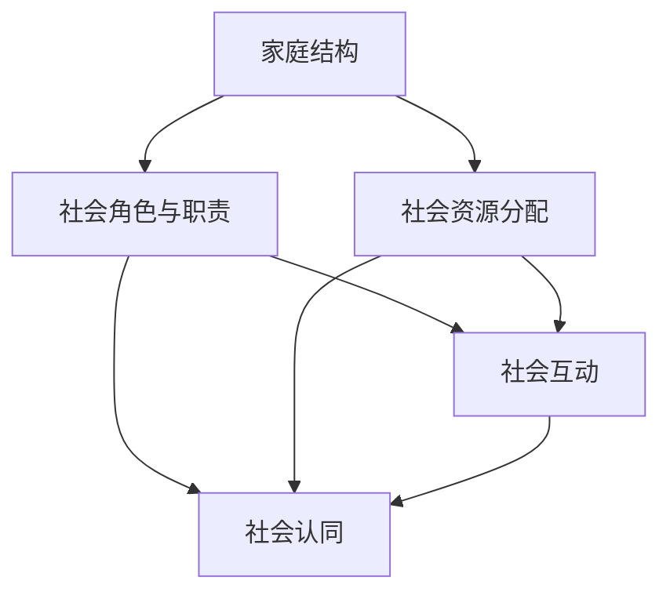
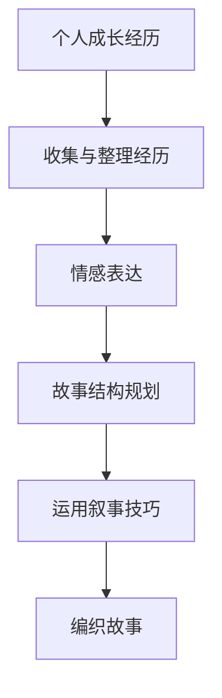
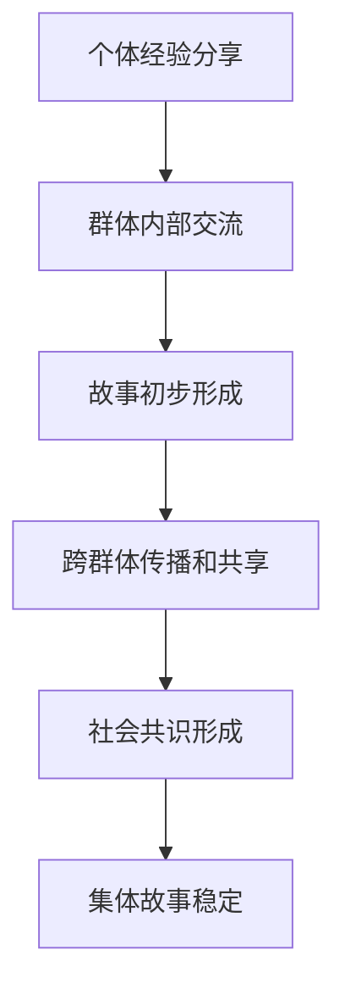
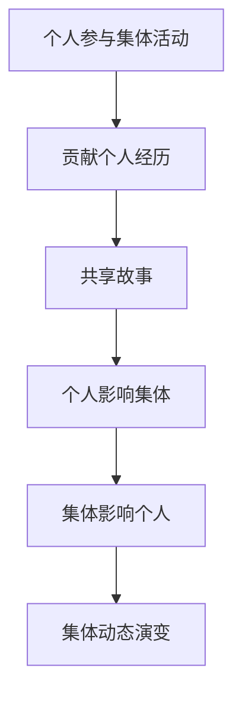

                 

### 摘要

本文旨在探讨个人在大背景下的定位，以及如何通过编织个人与集体故事来强化自我认知和社会归属感。文章首先概述了个人定位的社会、文化和历史背景，分析了个人价值观的建立与演变过程。接着，文章探讨了社会结构的构成及其对个人定位的影响，并使用 Mermaid 流程图展示核心概念之间的关系。随后，文章深入探讨了个人成长经历与故事编织的方法，以及如何通过个人故事来传达情感与经历。在此基础上，文章分析了集体故事的构建过程，并探讨了个人与集体之间的互动关系。最后，文章反思了个人定位和故事在社会中的意义，并提出了一些最佳实践建议。

### 引言

在大数据和人工智能迅猛发展的时代，个体的角色和定位变得愈发重要。人们不仅需要关注自身的成长与发展，还需要在复杂多变的社会环境中找到自己的位置。这种定位不仅仅是一种个人选择，更是一个复杂的社会互动过程。因此，本文试图通过探讨个人在大背景下的定位，以及如何编织个人与集体故事，来探讨个体的自我认知和社会归属感。

首先，我们需要理解个人定位的概念。个人定位指的是个体在社会中对自己的角色和位置的认知，这种认知受到社会环境、文化背景和历史传承等多方面因素的影响。在现代社会中，个人定位不仅仅是个体的自我认同，更是个体与社会互动的基础。

编织个人与集体故事则是强化个人定位的重要途径。个人故事不仅仅是个人经历和情感的记录，更是个人价值观和世界观的表达。而集体故事则是对社会共同经历的回顾和反思，它能够增强社会的凝聚力和认同感。通过个人与集体故事的互动，个体可以更好地理解自我，同时也能够在社会中找到自己的位置。

本文的结构如下：首先，我们将概述个人定位的社会、文化和历史背景；接着，我们将探讨个人价值观的建立与演变过程；然后，我们将分析社会结构的构成及其对个人定位的影响，并使用 Mermaid 流程图展示核心概念之间的关系。在接下来的章节中，我们将深入探讨个人成长经历与故事编织的方法，以及如何通过个人故事来传达情感与经历。随后，我们将分析集体故事的构建过程，并探讨个人与集体之间的互动关系。最后，我们将反思个人定位和故事在社会中的意义，并提出一些最佳实践建议。

### 个人定位的社会、文化、历史背景

个人定位是一个多维度的概念，它受到社会、文化和历史背景的深刻影响。首先，从社会背景来看，现代社会正处于快速变迁之中。全球化、城市化、科技革命等因素共同作用下，社会结构和人际关系发生了深刻变化。这种变化不仅影响了个体在社会中的角色和位置，也改变了个体对自我的认知。

全球化使得人们的生活和工作跨越国界，个体面临着多元文化的冲击和融合。这种文化多样性对个人定位产生了深远影响。一方面，个体有机会接触和了解不同的文化，从而拓宽自己的视野和认知；另一方面，个体也需要在多元文化的背景下找到自己的位置，形成独特的个人身份。

城市化是现代社会发展的另一个重要趋势。随着城市化的推进，人口聚集、社会分工日益细化，个体在社会中的角色变得更加专业化。然而，这也意味着个体需要更加注重自我定位，以适应不断变化的社会环境。

从文化背景来看，文化是塑造个人定位的重要因素。不同的文化背景会形成不同的价值观和行为准则，从而影响个体的行为和决策。例如，儒家文化强调的“和为贵”、“仁爱”等价值观，可能会使个体更加注重集体利益和社会和谐；而西方文化则强调个体主义和自我实现，个体更多地追求个人价值和自我表达。

历史传承也是个人定位的重要影响因素。历史传承不仅包括物质文化，如传统建筑、艺术品等，还包括精神文化，如历史事件、神话传说等。这些文化传承塑造了个体对自我和社会的认知，使个体能够在历史的长河中找到自己的位置。例如，中国的儒家文化强调“忠孝仁爱”，这已经成为许多中国人自我定位的重要参考。

社会变迁对个人定位的影响也是显而易见的。随着社会的发展，一些传统角色和价值观逐渐被取代，新的角色和价值观逐渐形成。这种变迁使个体需要不断调整自己的定位，以适应新的社会环境。例如，在工业化时代，工人和农民是社会的主体，而在信息时代，白领和专业人士成为社会的主力军。

综上所述，个人定位是一个受多方面因素影响的过程。社会、文化和历史背景为个人定位提供了丰富的土壤，个体需要在这个背景下不断探索和调整自己的定位，以实现自我价值和融入社会。

### 个人价值观的建立与演变过程

个人价值观的建立是一个复杂的过程，它受到多种因素的影响，包括家庭、教育、文化、社会环境等。个人价值观不仅决定了个体对事物的态度和行为，也影响着个体在社会中的定位和互动。

首先，家庭是个人价值观形成的基础。家庭环境、父母的教养方式以及家庭价值观都会对个体产生深远影响。例如，在一个重视教育和自我发展的家庭中，孩子可能会形成积极向上、追求知识的价值观。相反，在一个重视传统和道德的家庭中，个体可能会更加注重家庭和社会责任。

教育也是个人价值观形成的重要阶段。学校教育不仅传授知识和技能，更重要的是培养学生的价值观和世界观。教师在课堂上的言行举止、课程设置和教学理念都会潜移默化地影响学生的价值观。例如，科学教育可以培养个体的批判性思维和实事求是的态度；而人文教育则可以培养个体的情感和道德观念。

文化背景对个人价值观的影响同样不可忽视。文化不仅包括传统文化，还包括流行文化和亚文化。不同的文化背景会形成不同的价值观和行为规范。例如，儒家文化强调的“仁爱”、“忠诚”和“孝顺”，在许多亚洲国家中仍然是主流价值观。而在西方，自由、平等和个人主义更为突出。

社会环境的变化也会对个人价值观产生深远影响。随着社会的发展和变革，新的价值观不断涌现，传统价值观受到挑战和重新解读。例如，在现代化进程中，个体自由和多元化逐渐成为社会共识，这与传统的集体主义价值观形成了鲜明对比。这种价值观的变迁要求个体不断调整和更新自己的价值观念，以适应新的社会环境。

个人价值观的演变过程是一个动态的、不断发展的过程。个体在不同的生命阶段会经历不同的价值观念，这取决于个体的成长经历、社会互动和个人反思。例如，青少年时期可能会更加追求自我表达和独立思考，而成年后则可能更加注重家庭责任和社会责任。

总之，个人价值观的建立与演变是一个复杂的过程，受到多种因素的共同影响。个体需要在这个复杂的过程中不断探索和反思，以形成独特的个人价值观体系，并在社会中找到自己的定位。

### 社会结构的构成及其对个人定位的影响

社会结构是指社会中各个部分及其相互关系的系统性组织。社会结构对个人定位具有重要影响，它不仅决定了个体在社会中的角色和位置，还影响了个体对社会和他人的认知。

首先，社会结构的分类有助于我们更好地理解其构成。社会结构可以分为多种类型，包括家庭结构、组织结构、社会阶层结构和文化结构。家庭结构是社会的基石，它决定了个体的家庭角色和地位。例如，在一个大家庭中，个体可能承担照顾兄弟姐妹的责任，而在一个核心家庭中，个体可能更多地关注自己的配偶和子女。

组织结构是社会运作的重要方面，它决定了个体在组织中的角色和职责。不同类型的组织，如企业、政府和非营利组织，具有不同的组织结构和运作方式。在组织中，个体的角色和定位通常与其职责和职位密切相关。例如，在一家科技公司中，技术专家可能在研发部门工作，而市场营销人员可能在市场部门。

社会阶层结构是另一个重要的社会结构类型，它根据个体的经济状况、教育水平和职业地位将社会成员划分为不同的层级。社会阶层结构对个人的社会定位具有深远影响。高社会阶层通常享有更多的资源和机会，而低社会阶层则可能面临更多的限制和挑战。例如，在一个高度阶层分化的社会中，个体的社会地位可能会影响其教育、职业和生活质量。

文化结构是社会价值观、信仰和习俗的集合体，它对个体的行为和决策具有指导作用。文化结构不仅影响个人的社会定位，还影响了个体对社会其他成员的感知和互动。例如，在一个重视集体主义的文化中，个体可能更加注重团队合作和社会和谐，而在一个重视个人主义的文化中，个体可能更加追求自我实现和个人自由。

社会结构对个人定位的影响主要体现在以下几个方面：

1. **社会角色与职责**：社会结构决定了个体在社会中的角色和职责。例如，一个人可能在社会结构中被视为家长、员工或公民，这些角色定义了个体在社会中的定位。

2. **社会资源分配**：社会结构影响资源的分配方式，从而影响个体的社会地位。例如，在一个经济结构中，拥有高收入和财富的个体可能会获得更多的社会资源和机会。

3. **社会互动**：社会结构影响了个体如何与其他社会成员互动。例如，在一个等级森严的社会结构中，个体可能会遵循严格的礼仪和规范，以维护社会秩序。

4. **社会认同**：社会结构有助于个体建立社会认同，即个体对自己在社会中的角色和位置的认同。这种认同感可以增强个体的归属感和自我价值感。

为了更好地展示社会结构的构成及其对个人定位的影响，我们可以使用 Mermaid 流程图来描述核心概念之间的关系。以下是一个简化的 Mermaid 流程图示例：

在这个流程图中，家庭结构是个人定位的基础，它决定了个体的社会角色与职责。社会资源分配和社会互动则进一步影响了个体在社会中的定位，并最终形成了个体的社会认同。这个 Mermaid 流程图帮助我们更清晰地理解了社会结构对个人定位的影响机制。

总之，社会结构是影响个人定位的重要因素。通过理解社会结构的构成和作用，我们可以更好地把握个体在社会中的角色和位置，从而为个人的成长和发展提供有力的支持。

### 个人成长经历与故事编织

个人成长经历是编织个人故事的基石，这些经历不仅塑造了我们的性格，还为我们提供了丰富的素材，帮助我们构建自己的故事。编织个人故事的过程，实际上是一种自我表达和认知的过程，它帮助我们更好地理解自己的内心世界，同时与他人建立联系。

首先，让我们探讨个人成长的里程碑。这些里程碑是生命中的重要节点，标志着我们的成长和变化。例如，从小学到中学的过渡，从学业到职业的转换，甚至是一次重大的旅行或一段深刻的恋情，都可能成为我们成长过程中的里程碑。每个里程碑都有其独特的经历和情感，这些经历和情感共同构成了我们的个人成长史。

接下来，我们讨论如何收集和整理这些经历。首先，我们可以通过写日记或博客来记录自己的成长经历。这些记录不仅可以帮助我们回顾过去，还可以为我们的故事提供具体的细节。此外，我们还可以通过与亲朋好友交流，听取他们对我们成长经历的看法，从而获得不同的视角。这种多角度的收集和整理，有助于我们更全面地了解自己的成长过程。

在编织个人故事的过程中，情感的表达至关重要。情感不仅使故事更加生动，还使我们能够更深刻地体验和理解自己的内心世界。例如，一次失恋可能带来痛苦和失望，但同时也是我们成长和学习的机会。在讲述这个故事时，我们不仅要描述发生的事情，还要表达我们当时的情感和感受，这样才能让读者真正体会到我们的故事。

个人故事的结构和技巧也是编织过程中的关键。一个成功的个人故事通常包括几个基本元素：引子、发展、高潮和结局。引子部分用来吸引读者的注意，通常包含一个引人入胜的开头；发展部分详细描述故事的主要情节；高潮部分是故事最紧张和激动人心的时刻；结局部分则是故事的自然结束，通常包含一个深刻的教训或启示。

在编织个人故事时，我们还可以运用一些叙事技巧，如对比、悬念和反转等，来增强故事的吸引力。例如，通过对比过去和现在的自己，我们可以展示自己的成长和变化；通过设置悬念，我们可以吸引读者的兴趣，让他们想要继续阅读；通过反转，我们可以给故事带来意外的惊喜，增加故事的戏剧性。

以下是一个简化的 Mermaid 流程图，展示了个人成长经历与故事编织的过程：

在这个流程图中，个人成长经历是编织故事的基础，通过收集和整理这些经历，我们能够更好地表达情感，并运用故事结构和技巧来编织出一个引人入胜的故事。

总之，个人成长经历和故事编织是一个复杂的、动态的过程。通过回顾和整理成长经历，表达情感，并运用叙事技巧，我们可以编织出一个独特的个人故事。这不仅有助于我们更好地理解自己，还可以与他人建立更深层次的联系。

### 集体故事的构建过程

集体故事是社会记忆的重要组成部分，它不仅记录了社会的共同经历，还反映了社会的价值观和信仰。集体故事的构建过程是一个复杂的社会互动过程，涉及个体、群体和社会多个层面的合作与交流。

首先，集体故事的构建通常始于个体经验的分享。每个个体都是社会记忆的创造者和传承者，他们的个人经历和感受构成了集体故事的初始素材。例如，一次社区活动的成功举办，一个共同的历史事件，或是一次自然灾害的应对经历，都可以成为集体故事的起点。

其次，群体内部的交流和互动是集体故事构建的关键环节。在群体中，个体通过口头讲述、文字记录或其他形式分享自己的经历和感受，这些信息在群体内部传播和互动，逐渐形成初步的集体故事。群体成员之间的互动不仅丰富了故事的内容，还通过共同的经历和情感增强了故事的凝聚力。

接下来，集体故事的传播和共享进一步推动了故事的发展。随着故事在社会中的传播，不同群体和个体通过阅读、观看或参与故事的活动，对故事的内容和意义进行再创造和解读。这种跨群体的传播和共享，使集体故事在社会中产生广泛的影响，并逐渐形成社会共识。

为了更清晰地理解集体故事的构建过程，我们可以使用 Mermaid 流程图来描述这一过程的主要步骤：

在这个流程图中，个体经验分享是集体故事构建的起点，群体内部交流是故事初步形成的阶段，跨群体传播和共享推动了故事的发展，而社会共识的形成则使集体故事得以稳定和延续。

集体故事在社会中的角色和影响是多方面的。首先，集体故事有助于强化社会的凝聚力和认同感。通过共同的故事，社会成员能够建立共同的历史记忆和价值观，从而增强彼此之间的联系和认同。其次，集体故事可以传递和传承社会的文化和价值观，使社会成员能够在不同的时代和背景下保持对过去的记忆和对未来的期望。最后，集体故事也为社会成员提供了情感支持和心理慰藉，使个体在面对挑战和困难时能够找到共鸣和力量。

总之，集体故事的构建过程是一个复杂的社会互动过程，它不仅记录了社会的共同经历，还反映了社会的价值观和信仰。通过个体经验分享、群体内部交流和跨群体传播，集体故事在社会中扮演着重要的角色，为社会成员提供了情感支持和文化传承。

### 个人与集体的互动关系

个人与集体之间的互动关系是理解个人定位和身份认同的重要视角。这种互动不仅影响了个体在社会中的角色和位置，还塑造了集体的动态和演变。首先，个体与集体之间的互动是通过共同经历和共享的故事来实现的。个体通过参与集体活动、贡献个人经历和分享故事，与集体建立起紧密的联系。

从参与集体活动来看，个体通过实际行动参与到集体事务中，从而在集体中找到自己的位置。例如，一个社区成员可能参与社区志愿活动，通过实际行动为社区做出贡献，这不仅使他感到自己在集体中的价值，还增强了社区凝聚力。这种参与不仅使个体感受到集体的温暖和支持，还使他在集体中找到了归属感。

贡献个人经历是个人与集体互动的另一重要方面。每个人的经历都是独特的，这些经历不仅丰富了集体的记忆，还影响了集体故事的构建。例如，一个历史事件中个体的亲身经历，可以被记录在集体故事中，成为集体记忆的一部分。这种个人经历与集体故事的结合，使个体在集体中找到了自我表达和认同的途径。

共享故事则是个人与集体互动的桥梁。通过讲述和倾听故事，个体能够理解集体的经历和价值观，同时也在集体中找到自己的声音。例如，在一个家族聚会中，老一辈通过讲述家族故事，传递了家族的价值观和历史，年轻一代通过倾听和理解，不仅建立了对家族的认同，还在集体故事中找到了自己的位置。

个人对集体的影响不仅体现在具体的行为和贡献上，还通过个人价值观和行为规范对集体产生潜移默化的影响。例如，一个具有创新精神的个体，可能会鼓励集体的创新氛围，从而推动集体的发展。相反，一个具有负责任精神的个体，可能会通过自己的行为树立榜样，促进集体的道德建设和凝聚力。

集体对个人的影响也是双向的。集体不仅为个人提供了身份认同和归属感，还通过集体经验和价值观塑造了个体。例如，一个社区的传统和习俗，会影响社区成员的行为和决策，使他们在面对问题时能够找到共同的解决方法。这种集体影响不仅增强了个体对集体的认同感，还使个体在集体中找到了自己的角色和定位。

为了更清晰地展示个人与集体之间的互动关系，我们可以使用 Mermaid 流程图来描述这一过程：

在这个流程图中，个人参与集体活动、贡献个人经历和共享故事是互动的基础，这些互动不仅增强了个人与集体之间的联系，还推动了集体的发展和演变。

总之，个人与集体的互动关系是理解个人定位和身份认同的重要视角。通过参与集体活动、贡献个人经历和共享故事，个人不仅找到了自己的角色和位置，还在集体中建立了身份认同。同时，集体对个人的影响不仅塑造了个体，还推动了集体的动态和演变。

### 定位与故事的意义

个人定位和故事在社会中的意义不可忽视。首先，个人定位不仅影响个体的行为和决策，还反映了个体在社会中的角色和身份。一个明确的个人定位有助于个体在复杂多变的社会环境中找到自己的位置，从而实现自我价值。例如，一个在职业生涯中定位明确的个体，能够更好地规划自己的职业发展路径，提高工作效率和成就感。

其次，个人故事在社会中的意义主要体现在自我表达和社会交流两个方面。个人故事不仅是个人经历和情感的记录，更是个体自我表达和价值观的展现。通过讲述自己的故事，个体能够更好地理解自我，同时与他人建立情感联系。例如，一个成功创业者的故事可以激励他人追求自己的梦想，传递积极向上的价值观。

此外，集体故事对社会的影响同样深远。集体故事是社会记忆的载体，它记录了社会的共同经历和价值观，传递了文化的传承。例如，一个民族的历史故事可以增强民族认同感和凝聚力，促进社会团结。同时，集体故事也为社会成员提供了情感支持和心理慰藉，使个体在面对挑战和困难时能够找到共鸣和力量。

综上所述，个人定位和故事在社会中具有重要的意义。个人定位有助于个体实现自我价值，而个人故事和集体故事则在社会记忆和价值观传承中发挥着重要作用。

### 定位与故事的社会实践

在个人定位和故事编织的过程中，最佳实践和注意事项对于确保这一过程的顺利和有效性至关重要。以下是一些具体的建议和实践方法，以及一些常见的问题和挑战的解决方案。

#### 最佳实践建议

1. **自我反思**：在定位和故事编织过程中，定期进行自我反思是关键。通过反思，个体可以更好地了解自己的价值观、优势和兴趣，从而在定位过程中保持清晰和真实。

2. **多角度收集信息**：在编织个人故事时，多角度收集信息有助于构建一个全面和生动的个人故事。可以通过日记、访谈、照片和音频等多种方式记录自己的经历和感受。

3. **持续学习与成长**：定位和故事并不是一成不变的，个体需要不断学习新知识和技能，以适应社会环境的变化。这有助于个体在定位过程中保持灵活性和适应性。

4. **共享与互动**：通过与他人分享个人故事和经验，个体不仅能够获得反馈和建议，还能够增强社会联系和归属感。参与社区活动、加入兴趣小组和社交网络都是有效的共享和互动方式。

5. **故事结构化**：在编织个人故事时，运用故事结构化的技巧，如引子、发展、高潮和结局，可以使故事更具吸引力和影响力。

#### 注意事项

1. **真实性**：在定位和故事编织过程中，保持真实性至关重要。虚假的定位和故事不仅会破坏个人的声誉，还可能导致社会关系和信任的破裂。

2. **隐私保护**：在分享个人故事时，要注意保护个人隐私，避免泄露敏感信息和数据。特别是涉及家庭、朋友和同事的故事，需要谨慎处理。

3. **文化敏感性**：在编织和分享故事时，要考虑文化背景和价值观的差异，避免造成文化冲突和误解。

#### 常见问题与挑战

1. **定位模糊**：许多人在定位过程中可能会感到困惑，不确定自己应该如何定位。解决方法是通过自我反思、职业咨询和职业规划课程来明确自己的定位。

2. **故事缺乏吸引力**：一些个人故事可能因为缺乏细节、情感和结构而显得平淡无奇。解决方法是学习故事编织技巧，增加故事的趣味性和深度。

3. **故事冲突**：在某些情况下，个人故事可能会与他人或社会的期望产生冲突。解决方法是平衡个人真实感受和社会期望，找到适当的表达方式。

#### 拓展阅读

- **《自我定位与故事编织：个人成长指南》**：这是一本关于个人定位和故事编织的实用指南，提供了详细的步骤和技巧。
- **《社会心理学：个人与集体》**：这本书探讨了个人与集体之间的互动关系，有助于理解个人定位和社会故事的重要性。
- **《故事的力量：如何用故事影响人们》**：本书介绍了如何运用故事来传递信息、影响决策，适合那些希望提升故事编织能力的人。

通过遵循这些最佳实践和注意事项，以及解决常见的问题和挑战，个体可以更有效地进行个人定位和故事编织，从而在社会中找到自己的位置，实现自我价值和认同。

### 结语

在大背景中定位自我和编织个人与集体故事，不仅有助于我们更好地理解自我，还能增强社会归属感和文化认同。通过自我反思、持续学习和故事编织，个体能够在复杂多变的社会环境中找到自己的位置，实现自我价值。同时，个人与集体故事的互动，不仅传递了社会的共同记忆和价值观，还促进了社会的凝聚力和发展。未来，随着社会的发展和技术的进步，个人定位和故事编织将变得愈发重要，它将成为我们理解自我、融入社会的重要途径。让我们不断探索和实践，用故事和定位书写自己的精彩篇章。作者：AI天才研究院/AI Genius Institute & 禅与计算机程序设计艺术 /Zen And The Art of Computer Programming。

