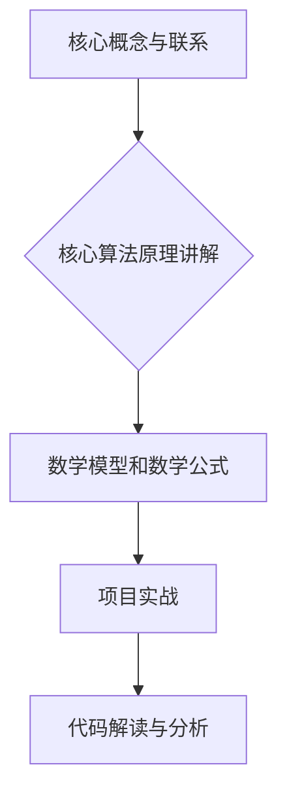

                 

# 在娱乐至上的文化中寻找深度：重建思考和反思能力

## 引言

### 1.1 娱乐至上的文化现象

在当今这个信息爆炸、科技飞速发展的时代，娱乐已经成为人们生活中不可或缺的一部分。从电视剧、电影、综艺节目到网络游戏，娱乐产业渗透到了社会生活的方方面面。娱乐至上的文化现象不仅体现在大众的日常消费行为中，还深刻影响了媒体内容的生产和传播。

首先，娱乐化趋势对社会的影响是不可忽视的。大量时间被娱乐活动占据，人们的深度思考能力和反思能力逐渐减弱。这不仅导致了个体精神层面的空虚和迷茫，也对社会的整体思考氛围产生了负面影响。在娱乐至上的文化背景下，快速、碎片化的信息消费方式盛行，深度阅读和深度思考的机会减少。

其次，娱乐至上的文化内涵也值得探讨。娱乐产业追求的是眼球经济，强调的是内容的吸引力和娱乐性，而非内容的深度和思考价值。这种文化氛围下，人们更容易被表面的光鲜亮丽所吸引，而忽视了事物的本质和内在的价值。

最后，娱乐至上的负面影响也不容忽视。它不仅导致社会价值观的扭曲，还可能对个体的心理健康产生不良影响。人们在追求娱乐的过程中，往往忽略了生活中的重要事务，甚至对现实世界的认知产生了偏差。

### 1.2 思考与反思能力的重要性

思考与反思能力是人类智慧的体现，是个人成长和社会进步的重要基础。思考能力是指个体对事物进行深入分析、推理和判断的能力，而反思能力则是指个体对自身行为和思想进行审视、反思和修正的能力。

首先，思考能力的定义可以理解为：在复杂多变的环境中，通过逻辑分析和抽象思维，对问题进行深入理解和探索的能力。思考能力不仅是解决具体问题的工具，更是个人认知世界、构建知识体系的重要手段。

其次，反思能力的定义可以理解为：在行动和思考过程中，对自己所做的事情和所持有的观念进行审视、反思和修正的能力。反思能力帮助个体不断优化自己的行为和思维模式，提高自身的适应能力和创新能力。

在个人成长中，思考与反思能力扮演着重要的角色。它们不仅帮助个体更好地理解世界，还帮助个体形成独立思考的能力，提高自我认知和自我成长的速度。在现代社会，这些能力显得尤为重要，因为信息爆炸、技术变革和社会复杂化使得个体必须具备高度的思考能力和反思能力，才能在激烈的社会竞争中脱颖而出。

### 1.3 娱乐至上的文化背景

娱乐至上的文化现象并非一朝一夕形成，而是有着深厚的历史渊源和复杂的社会背景。

首先，从历史演变的视角来看，娱乐化趋势可以追溯到工业革命时期。随着城市化和现代化的推进，人们的生活节奏加快，压力增大，娱乐成为缓解压力、放松心情的重要手段。在这个过程中，娱乐产业逐渐兴起，并逐渐占据了社会文化的主导地位。

其次，从社会结构的视角来看，娱乐至上的文化现象与现代社会的高度竞争和压力密切相关。在现代社会，人们为了追求更好的生活，往往不得不投入更多的时间和精力在工作上，这使得他们在业余时间更倾向于选择轻松、愉悦的娱乐活动，以缓解生活压力。

最后，从媒体对娱乐化的推动来看，现代传媒技术的发展使得娱乐内容的传播更加便捷和广泛。电视、互联网等媒体平台不仅为娱乐内容的制作和传播提供了便利，还通过算法推荐和用户画像等手段，精准推送符合用户喜好的娱乐内容，进一步强化了娱乐至上的文化氛围。

## 第1章 引 言

### 1.1 娱乐至上的文化现象

在当今社会，娱乐已经成为一种生活方式，渗透到了人们的生活的方方面面。从电视剧、电影、综艺节目到网络游戏，娱乐内容无孔不入，极大地满足了大众对于娱乐和消遣的需求。然而，这种娱乐至上的文化现象也带来了一系列的问题和挑战。

首先，娱乐化趋势对社会的影响不可忽视。随着娱乐内容的普及，人们花费在娱乐活动上的时间越来越多，而用于深度思考和反思的时间越来越少。这种趋势导致了社会思考氛围的弱化，人们在面对复杂问题时，往往缺乏深入的思考和分析，而是倾向于依赖娱乐化的信息获取方式。这种现象不仅影响了人们的认知能力，还可能削弱社会的整体思考能力。

其次，娱乐至上的文化内涵也值得深入探讨。在娱乐至上的文化背景下，娱乐内容的生产和传播往往以吸引眼球和追求点击率为主要目标，内容的质量和深度往往被牺牲。这种文化氛围下，人们更容易被表面的光鲜亮丽所吸引，而忽视了事物的本质和内在的价值。这种现象不仅导致了文化品位的下降，还可能扭曲人们的价值观和世界观。

最后，娱乐至上的负面影响也不容忽视。在追求娱乐的过程中，人们往往忽略了生活中的重要事务，如家庭、工作和学习。这种现象可能导致个体精神层面的空虚和迷茫，甚至对心理健康产生不良影响。此外，过度沉迷于娱乐活动还可能对个体的身体健康产生负面影响，如睡眠不足、注意力不集中等。

### 1.2 思考与反思能力的重要性

思考与反思能力是人类智慧的体现，是个人成长和社会进步的重要基础。思考能力是指个体在复杂多变的环境中，通过逻辑分析和抽象思维，对问题进行深入理解和探索的能力。反思能力则是指个体在行动和思考过程中，对自己所做的事情和所持有的观念进行审视、反思和修正的能力。

在个人成长中，思考与反思能力扮演着重要的角色。首先，它们帮助个体更好地理解世界。在信息爆炸的时代，大量的信息纷至沓来，个体需要具备高度的思考能力，才能从海量信息中筛选出有价值的信息，并对其进行深入理解。其次，思考与反思能力帮助个体形成独立思考的能力。独立思考是个人成长的基石，它不仅帮助个体摆脱盲目跟从他人观点的束缚，还能培养个体的批判性思维，提高个体的判断力和决策能力。

在社会进步中，思考与反思能力同样至关重要。一个社会的进步离不开创新和变革，而这些创新和变革往往源自于深刻的思考和反思。只有具备高度的思考与反思能力，个体才能发现社会存在的问题，并提出切实可行的解决方案。此外，思考与反思能力还能帮助社会形成积极的思考氛围，促进社会整体认知水平的提高。

总之，思考与反思能力不仅是个人成长的重要工具，也是社会进步的基石。在娱乐至上的文化背景下，重建和提升思考与反思能力显得尤为重要。通过培养和提升思考与反思能力，个体和社会都能在复杂多变的环境中找到方向，实现持续的发展和进步。

### 1.3 娱乐至上的文化背景

娱乐至上的文化现象并非一夜之间形成，而是有着深厚的历史渊源和复杂的社会背景。首先，从历史演变的视角来看，娱乐化趋势可以追溯到工业革命时期。随着城市化进程的加快，人们的生活方式发生了巨大变化。工业化和现代化带来了高度的社会竞争和快节奏的生活，使得人们在紧张的工作和生活中迫切需要一种方式来放松自己。娱乐产业正是在这样的背景下逐渐兴起，并逐步占据了社会文化的主导地位。

其次，从社会结构的视角来看，娱乐至上的文化现象与现代社会的高度竞争和压力密切相关。在现代社会，人们为了追求更好的生活，往往不得不投入更多的时间和精力在工作上，这使得他们在业余时间更倾向于选择轻松、愉悦的娱乐活动，以缓解生活压力。此外，现代社会的高度信息化和数字化，使得娱乐内容的生产和传播变得更加便捷和广泛。社交媒体、短视频平台和流媒体服务的普及，使得娱乐内容可以迅速传播到全球的每一个角落，进一步强化了娱乐至上的文化氛围。

最后，从媒体对娱乐化的推动来看，现代传媒技术的发展使得娱乐内容的传播更加便捷和广泛。电视、互联网等媒体平台不仅为娱乐内容的制作和传播提供了便利，还通过算法推荐和用户画像等手段，精准推送符合用户喜好的娱乐内容，进一步强化了娱乐至上的文化氛围。这种精准投放的方式，使得娱乐内容的生产和消费更加契合用户的需求，从而极大地推动了娱乐产业的发展。

总之，娱乐至上的文化现象是多种因素共同作用的结果。从历史演变、社会结构和媒体推动等多个角度来看，这一现象既有其必然性，也带来了许多值得深思的问题。在当今这个信息爆炸、科技飞速发展的时代，如何平衡娱乐与深度思考之间的关系，成为了一个重要的课题。

## 第2章 娱乐至上的文化现象分析

### 2.1 娱乐产业的商业模式

娱乐产业作为当今社会的一个重要组成部分，其商业模式多种多样，主要包括广告支持、付费订阅和产品销售等多种形式。首先，广告支持是娱乐产业最传统的商业模式之一。在广告支持的商业模式下，娱乐内容提供商通过制作吸引眼球的节目，吸引大量观众，从而吸引广告商投放广告。这种模式在电视、电影、综艺节目等领域尤为普遍。例如，电视剧和电影制作方会根据观众的兴趣和偏好，制作具有高收视率的节目，通过广告收入来实现盈利。

其次，付费订阅模式在近年来逐渐成为娱乐产业的主要盈利方式之一。随着流媒体服务的兴起，观众可以付费订阅特定平台上的内容，如Netflix、Amazon Prime Video等。这种模式的优势在于，它为观众提供了更多选择，同时为内容提供商提供了稳定的收入来源。付费订阅模式的成功，不仅推动了娱乐产业的发展，也改变了观众的消费习惯。

最后，产品销售也是娱乐产业的重要商业模式之一。在产品销售的商业模式下，娱乐内容提供商通过销售各种周边产品，如DVD、服装、玩具等，来实现盈利。这种模式在电影、电视剧和动漫等领域较为常见。例如，电影上映后，观众可以通过购买DVD来观看电影，而电影公司也可以通过销售电影相关的商品，如服装、玩具等，来获取额外的收入。

### 2.2 娱乐至上的社会影响

娱乐至上的社会影响广泛且深远，首先体现在对个体的影响上。在娱乐至上的文化氛围中，个体往往容易陷入过度消费娱乐内容的陷阱，导致时间管理出现问题，甚至影响到工作和学习。此外，过度沉迷于娱乐活动还可能对个体的心理健康产生负面影响，如焦虑、抑郁等。

其次，娱乐至上的文化也对家庭产生了深远影响。随着娱乐内容的普及，家庭成员之间的交流时间减少，家庭关系可能因此变得疏远。此外，家长过度沉迷于娱乐活动，可能忽视了对子女的关爱和教育，这对下一代的成长产生了不良影响。

最后，娱乐至上的文化还对整个社会风气产生了影响。在娱乐至上的文化背景下，社会对深度思考、批判性思维和创新能力的重视程度下降，导致社会整体思考能力的弱化。这种现象不仅影响了社会的进步和发展，还对社会的道德和价值观产生了负面影响。

### 2.3 娱乐至上的文化机制

娱乐至上的文化机制复杂多样，主要包括文化工业、大众文化和传播途径等几个方面。首先，文化工业是娱乐至上的文化机制的核心。文化工业通过大规模生产和标准化娱乐内容，满足大众对娱乐的需求。文化工业的特点是高度商业化和产业化，其目的是为了追求利润最大化，而不是为了提供高质量的文化产品。

其次，大众文化是娱乐至上的文化机制的重要组成部分。大众文化以通俗易懂、轻松娱乐为特点，通过电视、电影、网络等渠道广泛传播，吸引了大量观众。大众文化的普及，使得娱乐内容的生产和消费变得更加便捷，但同时也导致了文化品位的下降。

最后，传播途径是娱乐至上的文化机制得以实现的关键。现代传媒技术的发展，尤其是互联网和社交媒体的兴起，使得娱乐内容的传播更加广泛和迅速。通过算法推荐和大数据分析，媒体平台可以精准推送符合用户兴趣的娱乐内容，从而最大限度地吸引用户关注。

总之，娱乐至上的文化机制是一个复杂的系统，它不仅影响了娱乐内容的生产和消费，还对整个社会文化产生了深远的影响。

### 2.1 娱乐产业的商业模式

娱乐产业的商业模式多种多样，其中广告支持、付费订阅和产品销售是最为典型的三种模式。首先，广告支持模式是娱乐产业最传统的商业模式之一。在这种模式下，娱乐内容提供商通过制作高质量、高收视率的节目，吸引大量观众，从而吸引广告商投放广告。广告商根据观众数量和节目影响力，购买广告位来推广自己的产品或服务。例如，许多电视节目和电影都采用了这种模式，通过在节目中间插入广告来获取收入。

其次，付费订阅模式在近年来逐渐成为娱乐产业的主要盈利方式之一。这种模式主要依赖于流媒体平台，如Netflix、Amazon Prime Video等。观众可以付费订阅这些平台上的内容，享受无限次观看的权利。付费订阅模式的优势在于，它为观众提供了更多选择，同时为内容提供商提供了稳定的收入来源。例如，Netflix通过不断推出新剧集和电影，吸引观众持续订阅，从而实现盈利。

最后，产品销售模式也是娱乐产业的重要商业模式之一。这种模式主要依赖于电影、电视剧和动漫等娱乐内容。内容提供商通过销售DVD、蓝光碟、服装、玩具等周边产品，获取额外的收入。例如，某部热门电影的DVD和蓝光碟在电影上映后往往热销，电影公司可以通过这种销售模式获得可观的收益。

总之，娱乐产业的商业模式多样且灵活，各种模式相互补充，共同推动了娱乐产业的发展。广告支持模式提供了短期的收益，付费订阅模式提供了稳定的收入，而产品销售模式则为娱乐内容提供了额外的盈利渠道。这些模式不仅满足了观众的需求，也为娱乐产业带来了丰富的商业模式创新。

### 2.2 娱乐至上的社会影响

娱乐至上的文化现象对个体、家庭和社会风气产生了深远的影响。首先，对于个体而言，娱乐至上的文化导致人们的思考能力和反思能力逐渐减弱。在追求娱乐的过程中，个体往往忽视了对复杂问题的深入思考和批判性分析。这种趋势不仅影响了个人的认知水平，还可能削弱个体的独立思考和创新能力。此外，过度沉迷于娱乐活动可能导致心理健康问题，如焦虑、抑郁和注意力不集中。

其次，娱乐至上的文化对家庭也产生了负面影响。家庭是社会的基石，但在娱乐至上的文化背景下，家庭成员之间的交流和互动时间被大量娱乐活动所占据。这种趋势可能导致家庭关系的疏远，甚至产生代际冲突。此外，家长过度沉迷于娱乐活动可能忽视了对子女的关爱和教育，影响子女的成长和发展。

最后，娱乐至上的文化对社会风气产生了不良影响。在娱乐至上的文化氛围中，社会对深度思考、批判性思维和创新能力的重视程度下降，导致社会整体思考能力的弱化。这种现象不仅影响了社会的进步和发展，还可能导致社会价值观的扭曲。例如，过度追求娱乐化内容可能导致社会对真实世界的认知产生偏差，影响人们对社会问题的判断和应对。

总之，娱乐至上的文化现象对个体、家庭和社会风气产生了多重负面影响。为了应对这些挑战，我们需要重建和提升思考与反思能力，以在娱乐至上的文化背景下找到平衡点，促进个人和社会的健康发展。

### 2.3 娱乐至上的文化机制

娱乐至上的文化机制是由多个复杂要素共同构成，其中文化工业、大众文化和传播途径是最为关键的部分。首先，文化工业是娱乐至上的文化机制的核心。文化工业通过大规模生产和标准化娱乐内容，满足大众对娱乐的需求。文化工业的特点是高度商业化和产业化，其目的是为了追求利润最大化，而不是为了提供高质量的文化产品。例如，电影制片厂、电视节目制作公司和娱乐公司等，都是文化工业的重要组成部分，它们通过流水线式生产，创造出大量标准化、易于消费的娱乐内容。

其次，大众文化是娱乐至上的文化机制的重要组成部分。大众文化以通俗易懂、轻松娱乐为特点，通过电视、电影、网络等渠道广泛传播，吸引了大量观众。大众文化的普及，使得娱乐内容的生产和消费变得更加便捷，但同时也导致了文化品位的下降。例如，综艺节目和短视频平台上的内容，往往以娱乐性和趣味性为卖点，追求快速吸引观众眼球，而忽视了内容的深度和思考价值。

最后，传播途径是娱乐至上的文化机制得以实现的关键。现代传媒技术的发展，尤其是互联网和社交媒体的兴起，使得娱乐内容的传播更加广泛和迅速。通过算法推荐和大数据分析，媒体平台可以精准推送符合用户兴趣的娱乐内容，从而最大限度地吸引用户关注。例如，社交媒体平台通过分析用户的浏览历史和兴趣爱好，为用户推荐他们可能感兴趣的视频和文章，从而提高用户的黏性和活跃度。

总之，娱乐至上的文化机制是一个复杂而动态的系统，它不仅影响了娱乐内容的生产和消费，还对整个社会文化产生了深远的影响。理解这一机制，有助于我们更好地应对娱乐至上的文化现象带来的挑战，找到促进个人和社会健康发展的路径。

### 第3章 建构深度思考与反思的能力

#### 3.1 深度思考的原理

深度思考是一种高度抽象的思维方式，它要求个体在复杂的环境中，对问题进行深入分析和综合判断。深度思考的原理可以归纳为以下几个关键方面：

首先，深度思考依赖于个体对知识体系的构建和理解。一个良好的知识体系可以帮助个体更好地理解复杂问题，并从多个角度对问题进行深入分析。因此，构建一个全面、系统的知识体系是深度思考的基础。

其次，深度思考需要个体具备良好的逻辑分析能力。逻辑分析是深度思考的核心工具，它帮助个体在分析问题时，遵循严密的推理过程，避免逻辑谬误和思维陷阱。

第三，深度思考要求个体具备批判性思维。批判性思维是指对事物进行客观、全面的审视，不盲从、不轻信，通过质疑和探究，发现问题的本质和内在联系。

最后，深度思考还需要个体具备跨学科整合的能力。在现代社会，许多问题都是跨学科的，仅凭单一学科的知识难以解决。因此，个体需要能够将不同学科的知识和方法进行整合，从多个维度对问题进行深入分析。

#### 3.1.2 深度思考的过程

深度思考的过程可以分为以下几个阶段：

1. **问题识别与定义**：这是深度思考的起点。个体需要准确地识别和定义问题，明确问题的范围和关键点。只有明确了问题，个体才能有针对性地进行分析。

2. **信息收集与筛选**：在明确了问题后，个体需要广泛收集与问题相关的信息。信息收集的过程需要个体具备良好的信息检索和分析能力，从海量信息中筛选出有价值的信息。

3. **逻辑分析与推理**：在收集到相关信息后，个体需要对信息进行逻辑分析和推理。这一过程要求个体运用逻辑工具，如归纳、演绎、比较等，对信息进行深入分析和综合判断。

4. **整合与综合**：在逻辑分析的基础上，个体需要对分析结果进行整合和综合。整合和综合的过程要求个体具备跨学科整合的能力，将不同领域的知识和方法进行有机结合。

5. **验证与修正**：最后，个体需要验证分析结果，并根据实际情况进行修正。验证与修正的过程是深度思考的重要环节，它帮助个体确保分析结果的准确性和可靠性。

#### 3.1.3 深度思考的方法

为了提升深度思考能力，个体可以采取以下几种方法：

1. **分步分析法**：分步分析法是一种将复杂问题分解为多个小问题的方法。通过逐步解决小问题，个体可以逐步深入理解复杂问题。这种方法有助于降低问题的复杂度，使深度思考更加具体和可操作。

2. **逆向思考法**：逆向思考法是从问题的反面或相反方向进行分析的方法。通过逆向思考，个体可以打破常规思维模式，发现问题的不同维度和潜在问题。

3. **多角度分析法**：多角度分析法是一种从多个角度对问题进行分析的方法。通过多角度分析，个体可以全面、深入地理解问题，避免片面和偏颇的观点。

4. **案例分析法**：案例分析法是通过分析具体案例，对问题进行深入理解的方法。通过案例分析，个体可以结合实际情况，验证理论分析的正确性，并从中获得启示。

5. **系统思考法**：系统思考法是一种从系统整体出发，对问题进行综合分析的方法。通过系统思考，个体可以理解问题之间的相互关系和影响，从而提出更全面、更系统的解决方案。

总之，深度思考是一种重要的思维方式，它要求个体在复杂的环境中，对问题进行深入分析和综合判断。通过构建知识体系、培养逻辑分析能力、发展批判性思维和跨学科整合能力，个体可以不断提升深度思考能力。在实际应用中，个体可以采取分步分析法、逆向思考法、多角度分析法、案例分析法等具体方法，以提高深度思考的效果和准确性。

### 3.2 反思能力的培养

反思能力是深度思考的重要组成部分，它帮助个体审视自身的行为和思维过程，发现并纠正错误，从而实现持续的成长和进步。要培养反思能力，首先需要理解反思能力的意义，然后掌握培养反思能力的方法，最后探讨反思与深度思考的结合。

#### 3.2.1 反思能力的意义

反思能力的培养具有重要意义。首先，反思能力帮助个体进行自我监控。通过反思，个体能够审视自己的行为和决策，发现潜在的问题和错误，从而及时进行调整和修正。这种自我监控的能力不仅有助于提升个体的认知水平，还能提高个体的行动效率。

其次，反思能力有助于个体的自我成长。反思是一个不断学习和进步的过程。通过反思，个体能够从过去的经历中汲取教训，总结经验，不断优化自己的行为和思维模式。这种持续的学习和进步，有助于个体在复杂多变的环境中保持竞争力。

最后，反思能力对个体的心理健康有积极影响。反思帮助个体理解和接受自己的情绪和行为，减少自我批评和焦虑。通过反思，个体能够更好地处理压力和挫折，提升心理韧性。

#### 3.2.2 反思能力的培养方法

要培养反思能力，可以采取以下几种方法：

1. **建立反思日志**：反思日志是一种记录和反思自身行为和思想的方式。通过定期记录反思日志，个体可以系统地回顾自己的行为和思维过程，发现问题和不足。反思日志可以帮助个体养成反思的习惯，提高反思的频率和质量。

2. **开展反思会议**：反思会议是一种集体反思的方式，团队成员可以共同分享和讨论自己的经验和教训。在反思会议中，个体不仅能够从他人的经验中学习，还能获得反馈和建议，从而更好地改进自己的行为和思维模式。

3. **设定反思目标**：设定反思目标可以帮助个体明确反思的方向和重点。个体可以设定具体的反思目标，如改进某个工作习惯、提升某个技能等。通过设定目标，个体可以更有针对性地进行反思，提高反思的效果。

4. **利用反馈机制**：反馈机制是一种通过外部反馈来促进反思的方法。个体可以通过向同事、朋友或导师请教，获取他们的意见和建议。这种外部反馈可以帮助个体从不同角度审视自己的行为和思维，发现自身难以察觉的问题。

5. **培养批判性思维**：批判性思维是反思能力的基础。通过培养批判性思维，个体能够更好地分析、评估和质疑自己的行为和思维。批判性思维有助于个体形成独立的观点，避免盲从和偏见。

#### 3.2.3 反思与深度思考的结合

反思与深度思考是相辅相成的。深度思考帮助个体理解事物的本质和内在联系，而反思则帮助个体审视自己的思维过程和结果。将反思与深度思考结合，可以形成以下几种有效的反思方法：

1. **深度反思**：在深度思考过程中，个体可以通过反思来评估自己的思维过程和结果。例如，在阅读一篇学术论文时，个体可以反思自己的理解是否准确，自己的思考是否深入。

2. **逆向反思**：逆向反思是一种从结果出发，逆向分析思维过程的方法。通过逆向反思，个体可以更好地理解自己的思维过程，发现可能存在的问题和错误。

3. **多角度反思**：在深度思考时，个体可以从多个角度对问题进行分析。在反思时，个体可以进一步从不同角度审视自己的思维过程和结果，确保分析的全面性和准确性。

4. **案例反思**：通过分析具体的案例，个体可以更好地理解反思的原理和方法。例如，在商业决策中，个体可以分析成功和失败的案例，从中汲取经验教训。

总之，反思能力是深度思考的重要组成部分。通过建立反思日志、开展反思会议、设定反思目标、利用反馈机制和培养批判性思维等方法，个体可以不断提升反思能力。同时，将反思与深度思考相结合，可以形成更加系统、深入的思考模式，帮助个体在复杂多变的环境中实现持续的成长和进步。

### 3.3 教育体系中的思考与反思

在当今社会，教育体系在培养个体的思考与反思能力方面扮演着至关重要的角色。然而，传统的教育模式往往注重知识的灌输，而忽视了思考与反思能力的培养。为了在娱乐至上的文化背景下重建和提升思考与反思能力，教育体系需要进行一系列的改革和创新。

#### 3.3.1 教育模式的变化

首先，教育模式需要从传统的知识灌输向能力培养转变。传统的教育模式注重学科知识的传授，强调学生对知识的记忆和应用。然而，在娱乐至上的文化背景下，个体需要具备高度的思考与反思能力，才能在复杂多变的环境中找到方向。因此，教育模式需要更多地关注学生批判性思维、问题解决能力和创造性思维的培养。

其次，教育模式需要更加注重个性化教育。每个学生都有自己独特的学习方式和兴趣，传统的统一教学模式无法满足每个学生的需求。通过个性化教育，学生可以根据自己的兴趣和需求选择学习内容，从而更好地激发学习的主动性和积极性。个性化教育还包括针对学生个体差异的教学策略和评估方法，以确保每个学生都能在适合自己节奏和方式的学习环境中成长。

最后，教育模式需要加强跨学科教育。跨学科教育通过整合不同学科的知识和方法，培养学生从多个角度思考问题的能力。在现代社会，许多问题都是跨学科的，仅凭单一学科的知识难以解决。因此，跨学科教育不仅能够拓宽学生的知识视野，还能提高学生的综合分析和解决问题的能力。

#### 3.3.2 教育内容的设计

为了培养思考与反思能力，教育内容的设计需要更加注重深度和广度。首先，教育内容需要涵盖更多的基础学科知识，为学生构建扎实的知识体系。同时，教育内容还需要注重跨学科知识的整合，通过跨学科项目和学习活动，帮助学生从多个角度理解和解决问题。

其次，教育内容需要引入更多的实践环节。理论学习和实践相结合，是培养思考与反思能力的重要途径。通过实践，学生可以将理论知识应用到实际情境中，从而加深对知识的理解和运用。例如，通过参与科研项目、实习和社会实践活动，学生可以锻炼自己的实践能力和批判性思维。

此外，教育内容还需要注重批判性思维和创造性思维的培养。批判性思维是反思能力的基础，它要求学生在面对问题时，不盲从、不轻信，通过理性分析和逻辑推理，形成独立的观点。创造性思维则鼓励学生打破常规思维模式，提出新颖的见解和解决方案。为了培养学生的批判性思维和创造性思维，教育内容可以引入案例研究、辩论、写作和艺术创作等活动。

#### 3.3.3 教育评价的改革

传统的教育评价方法往往侧重于学生的知识掌握程度，而忽视了学生的思考与反思能力。为了更好地培养思考与反思能力，教育评价需要进行改革。

首先，教育评价需要更加注重过程评价，而不仅仅是结果评价。通过过程评价，教师可以更全面地了解学生的学习过程和思维过程，发现学生在学习中的问题和不足，从而及时进行指导和帮助。

其次，教育评价需要引入多元化的评价标准。除了传统的考试成绩，还可以引入学生的工作展示、项目报告、反思日志等多种评价方式，从多个维度评估学生的能力和素质。

此外，教育评价需要更加注重学生的自我评价和互评。通过自我评价和互评，学生可以反思自己的学习过程和成果，发现自己的优点和不足，从而不断改进自己的学习和思考方法。

总之，教育体系在培养思考与反思能力方面具有重要作用。通过改变教育模式、设计合理的教育内容和改革教育评价方法，教育体系可以为个体提供更加有效的培养途径，帮助个体在娱乐至上的文化背景下重建和提升思考与反思能力。

### 跨界思考的概念

跨界思考是一种将不同领域、不同学科的知识、方法和观点进行整合和融合的思维方式。其核心在于打破传统学科界限，通过跨领域、跨行业的交流与合作，寻找创新的解决方案。跨界思考不仅要求个体具备广博的知识储备和灵活的思维方式，还需要个体具备强烈的创新意识和跨领域合作的能力。

跨界思考的价值在于其能够激发创新的火花，促进新领域的诞生和旧领域的变革。通过跨界思考，个体能够发现不同领域之间的联系和互补性，从而创造出新的理论模型、技术和应用。例如，生物学与计算机科学的结合产生了生物信息学，经济学与物理学结合产生了行为经济学，这些跨学科的研究领域不仅推动了科学技术的进步，还为社会的发展提供了新的动力。

在现代社会，跨界思考的重要性日益凸显。随着全球化和信息化的发展，不同领域之间的联系日益紧密，单一学科的知识和方法已经无法应对复杂的问题。跨界思考能够帮助个体在面对复杂问题时，从多个角度进行分析和解决，提高问题的解决效率和效果。此外，跨界思考还能激发个体的创造力和创新精神，培养个体的综合素质和跨领域能力，使其在激烈的社会竞争中具备更强的竞争力。

跨界思考的方法多种多样，以下是一些常用的方法：

1. **思维导图**：通过绘制思维导图，将不同领域、不同学科的知识点进行可视化，帮助个体发现不同领域之间的联系和互补性。

2. **案例研究**：通过分析跨领域、跨行业的成功案例，了解不同领域之间的合作模式和创新方法。

3. **头脑风暴**：组织跨领域的团队进行头脑风暴，激发不同领域专家的思维碰撞，寻找创新的解决方案。

4. **跨界合作**：通过跨领域、跨行业的合作，整合不同领域的资源和优势，共同解决复杂问题。

5. **实践探索**：通过实际操作和实验，将跨界思考的理论转化为具体的实践成果，验证其可行性和有效性。

总之，跨界思考是一种重要的思维方式，它能够帮助个体在面对复杂问题时，从多个角度进行分析和解决，提高问题的解决效率和效果。在现代社会，培养跨界思考能力不仅有助于个人的职业发展，也对社会的创新和进步具有重要意义。

#### 4.2 反思在不同领域的应用

反思作为一种重要的思维方式，不仅在个人成长中起着关键作用，还在各个领域得到了广泛应用。以下分别从社会科学、自然科学和人文艺术领域，探讨反思的具体应用及其重要性。

**社会科学领域**

在社会科学领域，反思被广泛应用于政策制定、社会研究和公共服务等领域。政策制定过程中，反思有助于评估政策的实施效果和潜在问题，从而进行及时的调整和改进。例如，政府在制定公共健康政策时，可以通过反思过去疫情的应对策略，总结经验教训，提高未来公共卫生危机管理的有效性。

社会研究方面，反思能力使研究人员能够审视自身的研究假设、方法和技术，确保研究的科学性和客观性。例如，在调查社会现象时，反思可以帮助研究人员识别和分析数据的潜在偏差，从而提高研究的可信度和有效性。

在公共服务领域，反思能力有助于提高服务质量。通过反思客户反馈和服务过程中出现的问题，公共机构可以不断优化服务流程，提高客户满意度。例如，在教育领域，学校可以通过反思教学效果和学生学习情况，调整教学方法，提高教育质量。

**自然科学领域**

在自然科学领域，反思被广泛应用于科学研究和技术创新中。科学家通过反思实验数据和理论假设，发现研究中的问题和不一致之处，推动科学理论的进步。例如，在物理学研究中，爱因斯坦通过反思经典力学理论，提出了相对论，彻底改变了人类对时空的认识。

在技术创新过程中，反思也发挥着重要作用。工程师和研究人员通过反思现有的技术和产品，发现潜在的创新点和改进空间，从而推动新技术的研发和产品的升级。例如，在人工智能领域，研究人员通过反思算法的局限性，不断改进算法，提高人工智能系统的性能和应用范围。

**人文艺术领域**

在人文艺术领域，反思被广泛应用于文学创作、艺术创作和艺术批评中。文学作家和艺术家通过反思生活中的经历和感受，创作出具有深度和思考价值的作品。例如，作家鲁迅通过反思社会现实，创作了《狂人日记》等经典作品，深刻揭示了社会的种种弊端。

艺术批评方面，反思能力使批评家能够客观、全面地评价艺术作品，揭示其内在的审美价值和社会意义。例如，艺术评论家通过反思绘画、雕塑等艺术作品，探讨艺术家的创作意图和作品的社会影响。

总之，反思在不同领域的应用具有深远的意义。它不仅有助于提升个体的认知水平和创新能力，还能推动各个领域的进步和发展。在现代社会，培养和运用反思能力，对于个体和社会的健康发展具有重要意义。

#### 4.3 跨界思考与反思的实践案例

为了更好地理解跨界思考与反思在实际中的应用，以下是几个具有代表性的实践案例，涵盖商业、科技创新和社会治理领域。

**商业案例：阿里巴巴的“新零售”战略**

阿里巴巴集团在传统零售业面临挑战的背景下，提出了“新零售”战略。这一战略的核心是通过大数据和人工智能技术，实现线上线下的无缝融合，提升消费者体验和商家效率。阿里巴巴利用跨界思考，将电商、物流、大数据和线下零售等不同领域的知识和方法进行整合。通过这一战略，阿里巴巴不仅成功吸引了大量用户，还提升了商家的经营效率，推动了整个零售行业的转型升级。

在具体实施过程中，阿里巴巴通过分析消费者行为数据，了解消费者的需求和行为模式，从而优化商品推荐和营销策略。同时，通过物联网和智能设备，实现了线下店铺的智能化改造，提高了店铺的管理效率和服务水平。这种跨界思考与反思的实践，不仅帮助阿里巴巴巩固了其电商领域的领先地位，还使其在新的商业模式中找到了新的增长点。

**科技创新案例：特斯拉的电动汽车革命**

特斯拉公司通过跨界思考与反思，推动了电动汽车技术的革命。特斯拉将传统汽车制造技术与电池技术、人工智能和可再生能源技术相结合，创造出具有高性能、低能耗和智能化特点的电动汽车。特斯拉的创始人埃隆·马斯克通过不断反思和调整，从多个维度推动电动汽车的创新和发展。

在具体实践中，特斯拉通过跨界思考，优化了电动汽车的动力系统、电池技术和充电网络。例如，特斯拉开发了先进的电池技术，使电动汽车的续航里程大幅提升；同时，通过建立超级充电站网络，解决了电动汽车的充电问题。此外，特斯拉还利用人工智能技术，开发了自动驾驶系统，使电动汽车在安全性、便利性方面取得了重大突破。这些跨界思考与反思的实践，不仅推动了电动汽车技术的发展，也改变了人们的出行方式。

**社会治理案例：智慧城市中的跨界协作**

智慧城市建设是跨界思考与反思在公共管理领域的重要应用。智慧城市通过整合物联网、大数据、人工智能等新兴技术，提升城市管理的效率和服务水平。在智慧城市建设过程中，不同领域的专家和机构需要通过跨界协作，共同应对复杂的社会问题。

例如，在某市的智慧城市建设中，市政府联合科技企业、大学和研究机构，共同开展城市交通、环境监测、公共服务等方面的研究和项目。通过跨界协作，不同领域的专家可以共同分析城市问题，提出创新的解决方案。例如，通过大数据分析和物联网技术，实现了交通流量智能调控，提高了交通效率；通过环境监测数据，实现了空气质量实时监测和预警，提升了环境治理能力。

总之，跨界思考与反思在商业、科技创新和社会治理领域都有着重要的实践意义。通过跨界思考和反思，个体和组织可以更好地应对复杂问题，实现创新和发展。这些实践案例不仅展示了跨界思考与反思的具体应用，也为其他领域的创新提供了有益的借鉴。

#### 5.1 娱乐至上的文化批判

娱乐至上的文化现象虽然在短期内带来了经济效益和社会繁荣，但其长期影响却充满了负面因素。首先，从文化批判的角度来看，娱乐至上的文化导致文化品位的下降。在追求眼球经济和短期利润的驱动下，娱乐内容的生产往往注重表面的光鲜亮丽，而忽视了文化内涵和深度。这种趋势不仅降低了文化产品的质量，还可能扭曲公众的审美观和文化价值观。

其次，娱乐至上的文化对个体的心理健康产生了不良影响。在过度沉迷于娱乐活动的过程中，个体往往忽视了对自身心理健康的关注。长期的娱乐消费可能导致个体的情绪波动、焦虑和抑郁等问题。此外，过度依赖娱乐活动还可能削弱个体的自我调节能力和抗压能力，使其在面对现实问题时感到无所适从。

再次，娱乐至上的文化对社会的整体思考能力产生了削弱作用。在娱乐化的信息环境中，人们更容易接受浅显、直观的信息，而忽视了对复杂问题的深入思考和批判性分析。这种现象不仅影响了社会的创新能力和问题解决能力，还可能导致社会共识的缺失和价值观的混乱。

最后，娱乐至上的文化可能对社会的道德和伦理产生负面影响。在追求娱乐化和商业利润的过程中，一些娱乐内容生产者可能会忽视社会责任和伦理底线，生产出低俗、暴力、色情等有害内容。这些内容不仅可能对青少年的价值观产生负面影响，还可能对社会的道德风气产生侵蚀作用。

总之，娱乐至上的文化批判需要从多个角度进行深入分析。为了应对娱乐至上的负面影响，我们需要采取措施，重建和提升思考与反思能力，推动文化的多样性和深度，促进社会的健康和可持续发展。

#### 5.2 娱乐与深度的平衡

在娱乐至上的文化背景下，如何实现娱乐与深度的平衡，成为了一个重要的课题。首先，我们可以通过娱乐与教育的结合来达到这一目标。在教育体系中，将娱乐元素融入教学过程，不仅可以激发学生的学习兴趣，还能提高教学效果。例如，在科学课程中，通过引入趣味性实验和互动游戏，学生可以在轻松愉快的氛围中学习科学知识，从而提高学习的深度和广度。

其次，娱乐与文化的融合也是实现平衡的一种有效途径。通过将文化内涵融入娱乐内容中，可以提升娱乐的品质和深度。例如，影视剧和综艺节目可以通过讲述历史故事、文学经典和传统文化，传递文化价值和思想内涵，从而吸引观众在享受娱乐的同时，获得精神上的满足和启迪。

最后，为了实现娱乐与深度的平衡，还需要在文化生产和消费过程中，倡导和推广高质量的文化产品。媒体和内容生产者应承担起社会责任，制作和传播具有深度和思考价值的娱乐内容。同时，消费者也需要提高自身的文化素养和审美水平，选择和消费那些能够带来深刻思考和心灵共鸣的娱乐产品。

总之，通过娱乐与教育的结合、娱乐与文化的融合以及推广高质量的文化产品，我们可以实现娱乐与深度的平衡，从而在娱乐至上的文化背景下，重建思考与反思的能力，促进个人和社会的健康发展。

#### 5.3 娱乐至上的文化展望

未来，娱乐至上的文化可能会发生深刻的变化，向着更加多元、深度和互动的方向发展。首先，随着技术的进步，尤其是人工智能和虚拟现实技术的发展，娱乐内容将更加个性化、沉浸式和互动化。用户可以通过定制化的算法推荐，获得更符合自己兴趣和需求的娱乐内容，同时，虚拟现实技术将带来更加真实和沉浸的体验，使娱乐内容更具深度和吸引力。

其次，娱乐内容的生产和传播将更加注重深度和思考价值。在人工智能的帮助下，内容创作者可以更好地理解和分析用户的需求，创作出更加丰富多样、具有深度和思考价值的娱乐内容。此外，随着社会对文化素质和思考能力的重视程度不断提高，高质量的文化产品将逐渐占据主导地位，娱乐内容的生产也将更加注重文化内涵和社会责任感。

最后，娱乐至上的文化未来也将更加关注个体和社会的健康成长。在娱乐过程中，个体不仅追求快乐和放松，还会寻求自我提升和心灵成长。娱乐内容的生产和传播将更加注重个体心理健康和社会价值观的传递，通过提供富有启发性和思考价值的娱乐内容，促进个体和社会的全面发展。

总之，娱乐至上的文化未来充满了机遇和挑战。通过技术创新、内容品质提升和社会责任感的增强，我们可以期待一个更加多元、深度和健康的娱乐文化环境，为个体和社会带来持续的价值和福祉。

### 6.1 建立个人深度思考习惯

在当今快节奏、信息爆炸的社会中，建立个人深度思考习惯显得尤为重要。深度思考不仅有助于我们更好地理解复杂问题，还能提升我们的创新能力和解决问题的能力。以下是几个关键步骤，帮助个人逐步培养深度思考的习惯。

**1. 设定明确的思考目标**

首先，要设定明确的思考目标。明确的目标可以帮助我们集中精力，避免在杂乱无章的信息中迷失方向。例如，在阅读一篇学术论文或技术文档时，可以设定目标，比如理解文章的核心观点、分析其论证过程，或者提出自己的疑问和思考。

**2. 创造有利于思考的环境**

创造一个有利于思考的环境是深度思考的前提。我们可以选择一个安静、无干扰的场所，如图书馆、咖啡馆或家中书房，以减少外界干扰，集中注意力。同时，确保充足的休息和放松时间，有助于提高思考效率和质量。

**3. 练习分步分析法**

分步分析法是将复杂问题分解为多个小问题，逐一解决的策略。通过这种方法，我们可以将庞大的问题简化，从而更容易理解和解决。例如，在解决一个复杂的编程问题时，可以将其分解为多个子问题，逐步解决。

**4. 保持好奇心和求知欲**

好奇心和求知欲是深度思考的重要动力。我们应该保持对未知事物的好奇，不断提问和探索。例如，在阅读一本新书时，可以尝试提出自己的问题，并通过查阅资料和与他人的讨论来寻找答案。

**5. 定期进行反思**

反思是深度思考的重要组成部分。定期进行反思，可以帮助我们审视自己的思考过程和结果，发现不足并进行改进。例如，每周可以花时间回顾自己的学习和思考过程，总结经验教训，提出改进措施。

**6. 多样化学习方式**

通过多样化学习方式，我们可以从不同角度理解和分析问题。例如，可以通过阅读书籍、观看教育视频、参与讲座和讨论等多种途径获取知识，从而拓宽视野，提升思考的深度。

**7. 记录和分享思考**

记录和分享思考可以帮助我们更好地理解和整理自己的思路。例如，可以通过写日记、博客或参加思考小组，记录自己的思考过程和结果，并从他人的反馈中获得启发和提升。

通过以上步骤，个人可以逐步培养深度思考的习惯。深度思考不仅能够提升个人的认知能力和创造力，还能为解决复杂问题提供有力支持。在娱乐至上的文化背景下，培养深度思考习惯，将有助于我们更好地应对挑战，实现个人和社会的持续进步。

### 6.2 个人反思的实践

个人反思是提升自我认知和改进行为模式的重要手段。为了有效地进行个人反思，可以采取以下几种实践方法：

**1. 反思日记的记录**

反思日记是一种通过文字形式记录自己思考、情感和行为的方式。每天花一定时间，写下自己在一天中的所思所感，包括遇到的问题、感受、学到的知识和未完成的任务等。通过记录反思日记，可以系统地回顾和总结自己的经历，发现问题和不足，从而有针对性地进行改进。

**2. 反思会议的举行**

反思会议是一种定期进行的自我评估和讨论的方式。可以每周或每月安排一次反思会议，邀请亲朋好友或同事参与，共同分享和讨论反思的内容。在会议中，可以探讨自己的行为和决策，分析其成功和失败的原因，并提出改进建议。通过反思会议，可以获得多角度的反馈，从而更全面地了解自己。

**3. 反思自我成长的路径**

反思自我成长的路径是长期自我提升的重要方法。可以通过回顾自己的成长历程，分析在各个阶段取得的成就和面临的挑战。例如，可以每年进行一次年度反思，总结过去一年的成长和收获，并设定下一年度的发展目标和行动计划。通过这种方式，可以明确自己的成长方向，不断优化自我成长路径。

**4. 反思中的自我激励**

反思不仅是对过去行为的审视，也是一种自我激励的过程。在反思中，可以肯定自己在过去一段时间内取得的成绩和进步，为自己加油鼓劲。同时，也可以从失败中汲取教训，找出改进的机会，激励自己在未来取得更好的成绩。

**5. 反思与目标设定**

反思与目标设定相结合，可以更加明确自己的努力方向。在反思过程中，可以审视自己设定的目标是否合理，是否已经达到预期效果，并根据实际情况进行调整。通过反思与目标设定的结合，可以更加有针对性地进行自我提升。

总之，个人反思的实践是提升自我认知和改进行为模式的重要途径。通过反思日记的记录、反思会议的举行、反思自我成长的路径和反思中的自我激励等方法，个人可以不断提高自我反思能力，实现持续的个人成长和进步。

### 6.3 个人行动与社会影响

个人行动在社会进步中起着至关重要的作用。在娱乐至上的文化背景下，个人行动不仅能够影响个体的成长，还能对社会产生深远的影响。以下从个人行动的影响力、社会责任和个人行动的未来方向三个方面进行探讨。

首先，个人行动的影响力不可忽视。每一个人的行为和选择，都会在某种程度上对社会产生影响。例如，一个工程师通过技术创新，开发出一种更环保、更高效的能源解决方案，这不仅改变了个人职业生涯，还为整个社会带来了积极的环境效益。同样，一个普通市民通过参与社区志愿服务，可以提升社区凝聚力，促进邻里关系的和谐。因此，个人行动的力量是巨大的，它能够激发社会的正能量，推动社会的进步。

其次，个人行动与社会责任密切相关。在现代社会，每个人都应该承担一定的社会责任。通过个人的努力，可以改善社会问题，提升社会福祉。例如，一个人通过捐款、捐物或志愿服务，可以帮助贫困地区的孩子接受教育，改善他们的生活条件。这种个人行动不仅对社会产生了积极影响，还激励了更多人关注和参与社会公益事业。此外，个人还可以通过倡导和推广绿色环保、公平正义等价值观，推动社会形成更加健康、和谐的氛围。

最后，探讨个人行动的未来方向，需要关注科技发展和社会变迁。随着人工智能、大数据和区块链等新兴技术的广泛应用，个人行动的形式和方式将变得更加多样和高效。例如，通过社交媒体平台，个人可以更加便捷地传播公益理念，动员更多人参与公益活动。同时，个人行动的未来也将更加注重跨领域、跨文化的合作，通过全球范围内的合作，共同应对全球性挑战，如气候变化、贫困和社会不平等等问题。

总之，个人行动对社会进步具有重要影响。在娱乐至上的文化背景下，个人需要通过积极的行动，承担社会责任，推动社会的健康发展。通过关注科技发展和社会变迁，个人行动将不断适应新的环境和需求，为社会的未来贡献更多智慧和力量。

### 结论

### 7.1 娱乐至上的文化现状

娱乐至上的文化现象在现代社会中愈发显著，其影响渗透到社会的各个层面。娱乐产业通过丰富多样的内容和便捷的传播渠道，满足了大众对娱乐和消遣的需求，但也带来了诸多问题。首先，娱乐至上的文化削弱了人们的深度思考能力和反思能力，导致社会整体思考氛围的弱化。其次，娱乐内容的浅显化和商业化，降低了文化产品的质量，影响了公众的审美水平和文化价值观。此外，过度沉迷于娱乐活动还可能对个体的心理健康产生负面影响，导致精神空虚和迷茫。

### 7.2 思考与反思能力的重建

在娱乐至上的文化背景下，重建和提升思考与反思能力显得尤为重要。首先，个体需要培养深度思考的习惯，通过分步分析、多角度思考和批判性思维等方法，提高对复杂问题的理解和分析能力。其次，个体应注重反思能力的培养，通过建立反思日志、开展反思会议、设定反思目标和利用外部反馈等方式，不断审视和优化自己的行为和思维模式。此外，教育体系也应进行改革，注重培养学生的批判性思维和反思能力，提供更多实践机会和跨学科教育，以促进学生的全面发展。

### 7.3 个人与社会的发展前景

个人和社会的发展前景与思考与反思能力的提升密切相关。在娱乐至上的文化背景下，个体只有通过不断学习和自我提升，才能在激烈的社会竞争中脱颖而出。重建思考与反思能力，不仅有助于个体的成长和进步，还能为社会的发展提供新的动力。通过深度思考和反思，个体能够更好地理解社会问题，提出创新的解决方案，推动社会的进步和变革。因此，在娱乐至上的文化背景下，重建思考与反思能力，既是个人发展的需求，也是社会发展的必然选择。

### 附录 A：参考书籍与资料

- 《深度思考：如何培养具有全球竞争力的思维方式》，作者：罗恩·海斯（Ron Heifetz）
- 《批判性思维：思考技巧的应用》，作者：迈克尔·路辛（Michael Root）
- 《创新者的思考框架：如何用创新思维解决复杂问题》，作者：史蒂芬·约翰逊（Steven Johnson）
- 《思考，快与慢》，作者：丹尼尔·卡尼曼（Daniel Kahneman）
- 《禅与计算机程序设计艺术》，作者：艾萨克·阿西莫夫（Isaac Asimov）

### 附录 B：思考与反思练习题

1. **案例分析**：阅读一篇关于某企业创新的案例分析文章，分析其创新思路和成功因素，并提出改进建议。
2. **观点辩论**：针对一个社会热点问题，准备一篇辩论稿，阐述自己的观点，并反驳对方的论点。
3. **反思日记**：记录一次与他人的交流经历，反思自己在交流中的表现和不足，并提出改进计划。
4. **跨学科项目**：选择一个跨学科项目，如“科技与艺术融合”，设计一个简单的项目方案，并分析其潜在的创新点和挑战。

### 附录 C：深度思考工具推荐

- **思维导图软件**：MindManager、XMind、Sketchboard
- **在线笔记工具**：Notion、Evernote、OneNote
- **批判性思维工具**：Rationality: Inside thePyObject、 criticalthinking.org
- **项目管理工具**：Trello、Asana、Jira

## 作者信息

作者：AI天才研究院/AI Genius Institute & 禅与计算机程序设计艺术 /Zen And The Art of Computer Programming

### Mermaid 流程图



### 伪代码

```python
# 思考与反思能力培养的伪代码
def cultivate_thinking_ability():
    // 建立深度思考习惯
    establish_deep_thinking_habit()

    // 学习并应用深度思考方法
    learn_and_apply_deep_thinking_methods()

    // 培养反思能力
    cultivate_reflection_ability()

    // 反思与深度思考的结合
    combine_reflection_with_deep_thinking()
```

## 文章关键词

娱乐至上的文化、思考能力、反思能力、深度思考、反思方法、教育改革、跨界思考、社会影响、文化批判

## 文章摘要

本文探讨了在娱乐至上的文化背景下，重建思考和反思能力的重要性。通过分析娱乐至上的文化现象及其影响，本文提出了深度思考和反思能力的培养方法，包括分步分析法、逆向思考法、多角度分析法和案例反思法等。此外，本文还讨论了反思能力在不同领域的应用，以及跨界思考与反思的实践案例。最后，本文提出了实现娱乐与深度平衡的策略，并展望了未来娱乐至上的文化发展趋势。通过重建思考和反思能力，个体和社会可以在娱乐至上的文化背景下实现持续的发展和进步。

