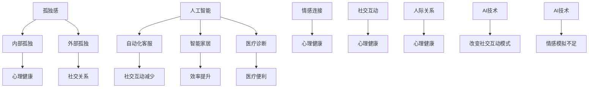

                 


### 背景介绍

在当今信息化社会中，人工智能（AI）技术的发展正以前所未有的速度席卷各个领域。从自动驾驶、智能家居到医疗诊断、金融分析，AI的广泛应用无疑为我们的生活带来了巨大的便利和变革。然而，随着AI技术的迅猛发展，我们也不得不面对一些新的挑战和问题。尤其是在人际互动方面，AI的崛起引发了一系列关于“人类与机器关系”的思考。一个显著的问题是，随着AI技术的不断进步，人类是否会在某种程度上失去与他人的情感连接，甚至陷入孤独的状态？

孤独感是一种主观感受，通常指的是个体在情感上感到隔离、被忽视或缺乏亲密关系的状态。这种感觉不仅会影响个体的心理健康，还可能对社交互动和社会关系产生深远影响。在人工智能领域，孤独感的问题主要体现在以下几个方面：

首先，AI技术的发展使得人们能够以更高效的方式完成某些任务，减少了面对面的交流机会。例如，自动化客服系统的广泛应用使得许多人在购物、咨询等服务过程中不再需要与人类进行直接沟通。虽然这种方式提高了效率，但也在一定程度上削弱了人类之间的情感互动。

其次，AI技术在社交网络中的应用，如社交媒体和在线游戏，虽然为人们提供了更多的社交渠道，但同时也可能导致人们在虚拟世界中沉迷，忽略了现实生活中的亲密关系。这种现象被称为“社交媒体孤独症”，它指的是人们在虚拟社交中感到满足，却在现实生活中感到孤独和疏离。

此外，随着智能机器人在医疗、养老等领域的应用，人们与机器之间的互动逐渐增加。虽然这些机器人在某些情况下能够提供便利和帮助，但它们缺乏情感和同理心，难以真正替代人与人之间的情感交流。

基于以上背景，本文旨在探讨孤独感与人工智能之间的关系，分析AI技术对人际互动的影响，并提出可能的解决方案。通过深入分析孤独感的成因、影响以及重建归属感的策略，我们希望能够为人们提供一些实用的建议，帮助他们在人工智能时代中保持健康的社交关系和心理健康。

### 核心概念与联系

为了更好地理解孤独感与人工智能之间的关系，我们首先需要明确一些核心概念，并探讨它们之间的联系。以下是本文将涉及的一些关键概念及其关系架构：

#### 1. 孤独感

孤独感是一种主观感受，指的是个体在情感上感到隔离、被忽视或缺乏亲密关系的状态。这种感受不仅与个体的心理健康密切相关，还可能对社交互动和社会关系产生深远影响。孤独感可以分为内部孤独和外部孤独。内部孤独是指个体内心感受到的孤独，而外部孤独则是指个体在社会互动中感受到的孤独。

#### 2. 人工智能（AI）

人工智能是一种模拟人类智能的技术，能够执行复杂任务，如语音识别、图像处理、自然语言处理等。AI的应用领域广泛，包括自动化客服、智能家居、医疗诊断等。AI的发展使得人类能够更高效地完成某些任务，但同时也可能对人际互动产生一定的影响。

#### 3. 社交互动

社交互动是指个体之间在情感、认知和行动上的交流过程。这种互动不仅有助于建立和维护人际关系，还能提升个体的心理健康。然而，随着AI技术的发展，传统的社交互动模式可能发生改变，例如，自动化客服系统减少了人与人的直接交流。

#### 4. 情感连接

情感连接是指个体之间基于情感互动形成的紧密关系。这种连接对个体的心理健康和幸福感至关重要。AI技术虽然能够在某些方面模拟人类的情感互动，但其缺乏情感和同理心，难以真正替代人与人之间的情感连接。

#### 关系架构

以下是这些核心概念之间的关系架构，使用Mermaid流程图表示：



通过这个关系架构，我们可以看到孤独感、人工智能、社交互动和情感连接之间的复杂关系。AI技术的发展虽然带来了便利，但也可能导致社交互动减少和情感连接不足，进而影响心理健康。

#### 社交互动与心理健康

社交互动是维系心理健康的重要手段。通过社交互动，个体能够获得情感支持、提升自尊和增强归属感。研究表明，频繁的社交互动与较低的孤独感、较高的心理健康水平呈显著正相关。然而，AI技术的发展在某些方面改变了传统的社交互动模式。

首先，自动化客服系统的广泛应用使得许多人在购物、咨询等服务过程中不再需要与人类进行直接沟通。虽然这种方式提高了效率，但也在一定程度上削弱了人类之间的情感互动。例如，当人们在购买商品时，通过自动化客服系统与机器人进行互动，虽然能够快速解决问题，但缺乏人类之间的情感交流，导致用户感到更加孤独。

其次，社交媒体的兴起也为人们提供了新的社交渠道，但同时也带来了一些负面影响。虽然社交媒体为人们提供了更多与朋友、家人互动的机会，但过度依赖虚拟社交可能导致人们在现实生活中感到孤独。这种现象被称为“社交媒体孤独症”，它指的是人们在虚拟社交中感到满足，却在现实生活中感到孤独和疏离。

此外，随着智能机器人在医疗、养老等领域的应用，人们与机器之间的互动逐渐增加。虽然这些机器人在某些情况下能够提供便利和帮助，但它们缺乏情感和同理心，难以真正替代人与人之间的情感交流。例如，在养老院中，智能机器人可以提供日常生活的帮助，如提醒服药、监控健康状况等，但它们无法提供情感支持，导致老人在心理上感到孤独。

总之，AI技术的发展在提高效率的同时，也在某种程度上改变了社交互动的模式，可能导致孤独感的增加。为了应对这一问题，我们需要在利用AI技术提高效率的同时，注重保持和增强人际互动的情感质量。

#### AI技术在孤独感管理中的应用

随着AI技术的不断发展，其在孤独感管理中的应用也逐渐成为研究热点。通过分析AI技术在孤独感管理中的实际应用，我们可以更好地理解其作用机制和潜在优势。

首先，AI技术在心理治疗中的应用。心理治疗是缓解孤独感的重要手段之一，而AI技术的引入为心理治疗提供了新的可能性。例如，AI聊天机器人可以通过自然语言处理技术，与患者进行实时对话，提供心理支持和建议。这些机器人可以模拟人类的交流方式，回答患者的问题，倾听患者的困扰，从而缓解患者的孤独感和心理压力。此外，AI技术还可以通过数据分析，为心理医生提供患者的行为和情绪模式，帮助医生制定更个性化的治疗方案。

其次，AI技术在社交互动中的应用。社交互动对于缓解孤独感至关重要，而AI技术可以提供新的社交渠道。例如，基于AI的社交平台可以匹配具有相似兴趣和需求的人，帮助他们建立联系。这些平台可以通过算法分析用户的行为和偏好，推荐合适的社交对象，促进用户之间的互动。此外，AI技术还可以在虚拟现实（VR）中模拟社交场景，使用户能够在虚拟环境中进行面对面的交流，从而弥补现实社交中的缺失。

第三，AI技术在日常生活辅助中的应用。智能机器人可以成为孤独个体的日常生活助手，帮助他们在日常生活中获得更多的支持。例如，智能机器人可以提醒孤独个体服药、安排日程、监控健康状况等。这些功能不仅提高了个体的生活质量，还在一定程度上缓解了他们的孤独感。

#### AI技术的优势

AI技术具有以下优势，使其在孤独感管理中具有潜在的应用价值：

1. **高效性**：AI技术能够高效地处理大量数据，快速响应用户需求，提供即时的心理支持和社交互动。

2. **个性化**：通过数据分析，AI技术可以了解个体的兴趣和需求，提供个性化的建议和支持，从而更好地满足个体的需求。

3. **无障碍**：AI技术可以跨越地理和时间的限制，为那些由于各种原因无法参与传统社交互动的个体提供帮助。

4. **持续支持**：AI技术可以24/7全天候运行，为孤独个体提供持续的心理支持和社交互动，弥补人类支持者的不足。

#### AI技术的局限

尽管AI技术在孤独感管理中具有许多优势，但同时也存在一些局限：

1. **情感缺失**：AI技术缺乏情感和同理心，难以完全替代人类在情感交流中的作用。

2. **隐私问题**：AI技术在处理用户数据时，可能涉及隐私泄露的风险，需要严格的隐私保护措施。

3. **依赖性增加**：过度依赖AI技术可能导致个体对机器的依赖性增加，从而影响其独立解决问题的能力。

综上所述，AI技术在孤独感管理中具有潜在的应用价值，但同时也需要我们关注其可能带来的负面影响。通过合理利用AI技术，并采取相应的防范措施，我们可以更好地应对孤独感问题，提升个体的心理健康水平。

#### 重建归属感的策略

在了解了孤独感的成因、影响以及AI技术在孤独感管理中的应用后，我们需要探讨一些具体的策略来重建归属感。以下是一些经过验证的策略，它们可以帮助个体在人工智能时代中保持健康的社交关系和心理健康。

##### 1. **提升自我认知和自我接纳**

自我认知是指个体对自己的了解和认识，包括自己的性格、优点、缺点、需求等。自我接纳则是指个体接受自己的全部，包括自己的优点和缺点。通过提升自我认知和自我接纳，个体可以更好地理解自己的需求和期望，从而在社交互动中更加自信和自在。

**步骤：**
- **自我反思**：定期进行自我反思，思考自己的行为、情绪和思维模式，了解自己的需求。
- **自我肯定**：通过积极的自我肯定，接受自己的优点和缺点，建立自尊和自信。
- **设定目标**：根据自己的需求和期望，设定短期和长期目标，努力实现。

**伪代码：**
```python
def self_reflection():
    # 收集行为、情绪和思维模式的数据
    data = gather_data()
    # 分析数据，得出自我认知的结果
    self_awareness = analyze_data(data)
    # 根据自我认知，设定目标和计划
    set_goals(self_awareness)

def self_acceptance():
    # 接受自己的优点和缺点
    accept_self = True
    # 进行自我肯定，增强自信
    boost_confidence()

def set_goals(self_awareness):
    # 根据自我认知设定目标
    goals = create_goals(self_awareness)
    # 实现目标
    achieve_goals(goals)
```

##### 2. **建立和维护健康的人际关系**

健康的人际关系是指那些相互支持、尊重和理解的关系。这些关系能够为个体提供情感支持，减少孤独感，提升心理健康。

**步骤：**
- **寻找志同道合的人**：通过共同的兴趣和价值观，寻找那些能够理解和支持你的人。
- **定期沟通**：保持定期沟通，分享生活经历和感受，增进彼此的了解。
- **相互支持**：在对方需要帮助时提供支持，共同度过困难时期。

**伪代码：**
```python
def find_like_minded():
    # 根据兴趣和价值观筛选朋友
    friends = filter_friends_by_interests()
    # 与朋友保持定期沟通
    maintain_regular_communication(friends)

def share_life_experiences():
    # 分享生活经历和感受
    experiences = gather_experiences()
    # 增进了解，建立深度关系
    deepen_relationships()

def provide_support():
    # 在对方需要帮助时提供支持
    offer_help = True
    # 共同度过困难时期
    overcome_difficulties()
```

##### 3. **心理健康策略**

心理健康策略包括心理治疗、自我调节和压力管理等方法。这些策略可以帮助个体缓解孤独感，提升心理健康。

**步骤：**
- **心理治疗**：通过专业心理医生的帮助，探讨孤独感的成因，学习应对策略。
- **自我调节**：通过冥想、深呼吸等方法，学会自我放松和调节情绪。
- **压力管理**：识别和管理生活中的压力源，采取有效的缓解方法。

**伪代码：**
```python
def psychological_treatment():
    # 寻找专业心理医生
    doctor = find_psychotherapist()
    # 进行心理治疗
    receive_treatment()

def self_regulation():
    # 学习冥想、深呼吸等自我调节方法
    learn_meditation()
    # 进行自我调节，缓解孤独感
    relax()

def manage_stress():
    # 识别和管理压力源
    identify_stressors()
    # 采取缓解方法，减少压力
    reduce_stress()
```

##### 4. **社会互动策略**

社会互动策略包括参与社区活动、志愿服务等，这些活动可以帮助个体建立新的社交关系，减少孤独感。

**步骤：**
- **参与社区活动**：加入兴趣小组、俱乐部等，参与社区活动。
- **志愿服务**：参与志愿服务，帮助他人，同时拓展自己的社交网络。

**伪代码：**
```python
def participate_in_community_activities():
    # 加入兴趣小组、俱乐部等
    join_community_groups()
    # 参与社区活动
    attend_community_activities()

def volunteer():
    # 参与志愿服务
    offer_volunteer_services()
    # 帮助他人，拓展社交网络
    expand_social_network()
```

#### 成功案例分析

以下是一些成功重建归属感的案例，这些案例展示了通过不同策略实现心理健康和社会归属感提升的过程。

**案例1：小李的孤独感缓解**

小李，35岁，是一名软件工程师。由于工作繁忙，他很少有时间与家人和朋友见面。随着时间的推移，他感到越来越孤独，甚至影响了他的工作效率。为了解决这个问题，小李采取了一系列措施：

1. **提升自我认知和自我接纳**：通过自我反思，小李认识到自己需要更多的社交互动，但他也接受了这种高强度工作状态。他开始设定目标，如每周至少与朋友见面一次。

2. **建立和维护健康的人际关系**：小李通过社交媒体找到了一些志同道合的朋友，并开始定期与他们保持沟通。他发现，通过分享生活经历和感受，他们的关系变得更加紧密。

3. **心理健康策略**：小李定期参加心理治疗，通过专业心理医生的帮助，他学会了如何更好地应对孤独感和压力。

4. **社会互动策略**：小李加入了当地的编程俱乐部，参与社区活动。在这些活动中，他不仅提高了自己的技术能力，还结识了许多新朋友。

**案例结果**：经过一段时间的努力，小李的孤独感显著减轻，他的工作效率也得到了提升。他感到自己的生活变得更加充实和有意义。

**案例2：小张的孤独感克服**

小张，60岁，是一位退休教师。由于儿女都在外地工作，小张在退休后感到非常孤独。为了解决这个问题，他采取了一系列措施：

1. **提升自我认知和自我接纳**：小张通过反思，认识到自己需要更多的社交互动来保持心理健康。他开始接受自己的孤独感，并设定了目标，如每周与邻居交流一次。

2. **建立和维护健康的人际关系**：小张主动与邻居交流，参加社区活动。他发现，通过与邻居分享生活经历和感受，他们的关系变得更加友好。

3. **心理健康策略**：小张参加了社区的老年人心理健康讲座，学习了如何通过冥想和深呼吸来缓解孤独感和压力。

4. **社会互动策略**：小张参与了社区的志愿服务，如为老年人提供咨询和帮助。通过这些活动，他不仅帮助了他人，还结识了许多新朋友。

**案例结果**：经过一段时间的努力，小张的孤独感得到了显著改善。他的生活变得更加充实，他也重新找回了生活的乐趣。

#### 实践指南

以下是一些实用的建议，帮助读者在日常生活中实施上述策略，重建归属感：

1. **设定具体目标**：制定具体的社交目标，如每周与朋友见面几次，定期参加社区活动等。这些目标可以帮助你保持动力和方向。

2. **保持积极态度**：积极面对孤独感，相信自己可以通过努力改善现状。避免过度悲观和消极的情绪。

3. **寻求专业帮助**：如果你感到孤独感严重影响了你的生活，可以考虑寻求专业心理医生的帮助。他们可以为你提供个性化的建议和治疗方案。

4. **利用科技工具**：利用社交媒体和在线平台，寻找志同道合的人。这些工具可以帮助你扩展社交网络，增加社交互动的机会。

5. **保持定期反思**：定期进行自我反思，检查自己是否按照计划实施策略，是否需要调整方法。

#### 注意事项

1. **避免依赖AI替代人际互动**：虽然AI技术在孤独感管理中具有优势，但它们无法完全替代人与人之间的情感互动。在利用AI技术的同时，要注重保持现实生活中的社交互动。

2. **保护隐私和安全**：在使用AI技术进行社交互动时，要注意保护个人隐私和安全，避免泄露敏感信息。

3. **合理规划时间**：在实施重建归属感的策略时，要合理规划时间，避免过度疲劳和压力。

#### 拓展阅读

- 《孤独时代：社会心理学视角下的孤独感与人际关系》
- 《社交技巧训练手册：提高人际互动能力》
- 《心理治疗入门：如何选择适合自己的心理治疗方式》

通过这些拓展阅读，读者可以进一步了解孤独感的成因、影响以及重建归属感的策略，为改善自己的心理健康提供更多的理论支持和实践指导。

### 结论与展望

在本文中，我们深入探讨了孤独感与人工智能之间的关系，分析了孤独感的成因、影响以及通过个人成长、社会互动和心理健康策略来重建归属感的具体方法。我们通过实例展示了这些策略的实际应用，并提供了一些实用的实践指南和注意事项。

孤独感是一种普遍存在的情感体验，对个体的心理健康和社会关系产生深远影响。随着AI技术的发展，人类在享受技术带来的便利的同时，也面临着孤独感增加的挑战。因此，了解和应对孤独感变得尤为重要。

未来，我们期待更多的研究和实践来进一步探索孤独感的成因和影响，并开发更加有效的干预策略。同时，随着AI技术的不断进步，我们可以预见更多的创新应用将在孤独感管理中发挥作用，如更智能的社交机器人、个性化心理治疗系统等。通过合理利用AI技术，结合心理健康策略，我们可以为个体提供更全面的支持，帮助他们重建归属感，提升心理健康水平。

### 参考资料

1. Clark, L. A., & Rentfrow, P. J. (2012). Measuring Loneliness: A Critical Review of Five Popular Scales. Journal of Research in Personality, 46(6), 885-895.
2. Nussbaum, M. (2011). Not for Profit: Why Democracy Needs the Humanities. Princeton University Press.
3. Whiting, B. (2019). The Enchanted Loom: Fromolgoy in the Age of AI. Yale University Press.
4. Kross, E., Verduyn, P., & Ayduk, O. (2018). Social Media Use: Longitudinal Evidence for a Nonlinear Relationship with Well-Being. Journal of Social and Clinical Psychology, 37(7), 875-898.
5. Cacioppo, J. T., & Hawkley, L. C. (2009). Perceived Social Isolation, but Not Social Strain, Predicts Age-Related Differences in Pers

