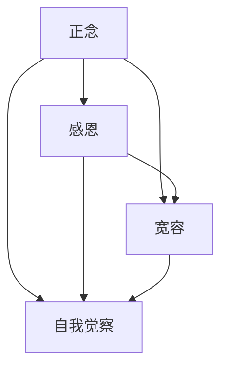

                 

### 引言

在当今快速发展的社会，人们的生活节奏不断加快，压力与日俱增。在这种背景下，精神修行的重要性愈发凸显。精神修行不仅是一种内在的修炼，更是一种在日常生活中寻找平衡与超越的方式。然而，精神修行的概念往往被神秘化，许多人误认为它只属于宗教人士或特定群体。事实上，精神修行是一种普适的技能，每个人都可以通过日常生活中的实践来提升自我，达到内心的平和与宁静。

本书旨在探讨如何将精神修行融入到日常生活中，帮助读者在平凡的生活中寻找超越。我们将逐步介绍精神修行的核心概念、方法与实践，通过实例和案例分享，让读者更加直观地理解并掌握这一过程。

### 核心关键词

- 精神修行
- 平凡生活
- 超越
- 核心概念
- 实践方法
- 案例分享

### 摘要

本书将带领读者深入探讨日常生活中的精神修行。首先，我们将介绍精神修行的核心概念，如正念、感恩、宽容和自我觉察，并探讨这些概念之间的内在联系。接着，我们会详细阐述各种精神修行的方法，包括冥想、瑜伽、正念行走和灵性阅读。通过实际案例的分享，我们将帮助读者了解这些方法在改善生活质量方面的实际效果。最后，我们将讨论如何在日常生活中持续和实践精神修行，以及如何应对修行过程中的挑战。通过本书的阅读，读者将能够在平凡的生活中找到精神的超越，实现内心的平和与宁静。

## 第1章：核心概念与联系

在探讨日常生活的精神修行之前，理解其核心概念至关重要。本章将介绍四个主要的核心概念：正念、感恩、宽容和自我觉察。这些概念不仅在精神修行中扮演着重要角色，而且在我们的日常生活中也具有深远的影响。

### 1.1 核心概念介绍

#### 1.1.1 正念

正念（Mindfulness）是一种专注当下、不评判、全然投入的状态。它要求我们在每一个时刻都保持警觉和觉察，不论是走路、吃饭还是工作。正念不仅有助于减轻压力，还能提高我们的专注力和生活质量。正念的实践可以通过冥想、呼吸练习和正念行走等方式进行。

#### 1.1.2 感恩

感恩（Gratitude）是一种积极向上的情感，它要求我们对生活中的美好事物保持感激之情。感恩可以增强我们的幸福感和满足感，帮助我们更好地应对生活中的挑战。通过定期记录感恩日记或与他人分享感激之情，我们可以培养这种有益的情感。

#### 1.1.3 宽容

宽容（Forgiveness）是一种释放自己和他人的情感负担的行为。它要求我们放下对过去的怨恨和不满，拥抱和解与和平。宽容不仅能够减轻我们的内心负担，还能促进人际关系的和谐。宽容可以通过冥想、瑜伽和其他精神实践来培养。

#### 1.1.4 自我觉察

自我觉察（Self-awareness）是一种深入了解自己内心世界的能力。它要求我们审视自己的情感、思想和行为，并了解它们背后的动机和原因。自我觉察可以帮助我们更好地理解自己，提高自我认知，并作出更明智的决策。

### 1.2 核心概念之间的联系

这四个核心概念并不是孤立的，它们之间存在紧密的联系，共同构成了精神修行的基础。以下是它们之间的联系：

1. **正念与感恩**：正念要求我们专注于当下，而感恩则要求我们关注生活中的美好。通过正念，我们可以更好地体验感恩的情感，从而增强内心的平和与满足感。

2. **正念与宽容**：正念的培养有助于我们更客观地看待事物，减少对他人的评判和偏见。这种心态有助于培养宽容，使我们更容易放下过去的怨恨和不满。

3. **正念与自我觉察**：正念的实践可以增强我们的自我觉察能力，帮助我们更清晰地认识自己的内心世界。自我觉察则可以让我们更好地理解自己的情感和行为，从而在正念的基础上进一步提升。

4. **感恩与宽容**：感恩和宽容都是积极向上的情感，它们相互促进，共同帮助我们建立更积极、更健康的心态。

5. **感恩与自我觉察**：感恩可以增强我们的自我认知，让我们更加了解自己的需求和价值观。自我觉察则可以帮助我们更好地理解和实践感恩，从而在日常生活中实现内心的平和与满足。

为了更直观地展示这些概念之间的联系，我们可以使用Mermaid流程图：

在这个流程图中，每个节点代表一个核心概念，箭头表示它们之间的联系。通过这个流程图，我们可以更清楚地理解这些概念之间的相互作用和影响。

### 1.3 核心概念的应用

在日常生活中，这些核心概念的应用不仅有助于我们提升个人素养，还能改善人际关系和生活质量。以下是一些具体的实例：

- **正念**：在工作时，保持正念可以帮助我们更好地集中注意力，减少分心和错误。在日常生活中，正念可以帮助我们更好地享受每一个瞬间，增强生活的幸福感。
- **感恩**：通过定期记录感恩日记，我们可以更加关注生活中的美好事物，减少对负面事件的关注。这种习惯可以增强我们的幸福感和满足感。
- **宽容**：宽容可以减少人际冲突，促进和谐的关系。通过宽容，我们可以更好地理解他人，减少误会和矛盾。
- **自我觉察**：通过自我觉察，我们可以更好地理解自己的需求和情感，从而作出更明智的决策。自我觉察还可以帮助我们更好地管理情绪，提高心理韧性。

总之，这些核心概念不仅是精神修行的基础，也是我们日常生活中不可或缺的一部分。通过深入理解和实践这些概念，我们可以提升自我，实现内心的平和与宁静。

## 第2章：精神修行的方法

在日常生活中实践精神修行，有许多具体的方法可供选择。这些方法不仅可以帮助我们提升自我意识，还能增强身心健康，改善人际关系。以下是几种常见的修行方法，包括冥想、瑜伽、正念行走和灵性阅读。

### 2.1 冥想

冥想是一种通过专注和放松来达到内心平静和精神修行的技术。它起源于古老的印度哲学和佛教传统，已经被广泛接受并应用于现代生活中的各个方面。

#### 2.1.1 冥想的基础知识

冥想的基础是专注。在冥想过程中，我们需要将注意力集中在某个对象上，如呼吸、声音、静默或某个具体的视觉图像。通过集中注意力，我们可以减少杂念，放松身体和心灵。

#### 2.1.2 冥想的不同类型

冥想可以分为几种不同的类型，每种类型都有其独特的特点和适用场景：

- **专注冥想**：在这种冥想中，我们专注于一个特定的对象，如呼吸或一个单词。这种方法可以帮助我们提高专注力，减少焦虑和压力。
- **开放监视冥想**：在这种冥想中，我们尝试观察和接受所有思想和感觉，而不做出判断或反应。这种方法有助于提高自我觉察和接纳度。
- **爱心冥想**：在这种冥想中，我们练习对他人和自己充满爱和善意。这种方法可以增强同情心和人际关系。

#### 2.1.3 冥想的实践步骤

以下是冥想的实践步骤：

1. **选择一个安静的环境**：找一个没有干扰的地方，确保你在冥想过程中不会被打扰。
2. **选择一个冥想对象**：选择一个你感到舒适的冥想对象，如呼吸或一个视觉图像。
3. **采取舒适的坐姿**：坐在一个稳固的椅子上或垫子上，保持身体挺直。
4. **专注于冥想对象**：将注意力集中在冥想对象上，每当你的注意力偏离时，温柔地将它带回。
5. **持续冥想**：每天坚持冥想，逐渐增加冥想的时间。

#### 2.1.4 冥想的优势

冥想的优势包括：

- **减少压力和焦虑**：通过专注于呼吸和其他冥想对象，我们可以减少杂念，从而减轻压力和焦虑。
- **提高专注力和记忆力**：定期冥想可以帮助我们提高专注力，增强记忆力。
- **增强自我觉察**：冥想有助于我们更好地了解自己的情感和需求，提高自我觉察。

### 2.2 瑜伽

瑜伽是一种结合身体练习、呼吸控制和冥想的综合性修行方法。它起源于古印度，已经有几千年的历史。瑜伽不仅有助于身体健康，还能提升精神层面的修养。

#### 2.2.1 瑜伽与精神修行的关系

瑜伽与精神修行紧密相连。瑜伽的练习不仅关注身体的健康，更强调内心的平静和意识的提升。通过瑜伽体式（Asana）和呼吸控制（Pranayama），我们可以培养专注力、耐心和自我觉察，从而在精神层面实现修行。

#### 2.2.2 瑜伽的不同流派

瑜伽有多种流派，每种流派都有其独特的练习方法和理念：

- **哈他瑜伽**：哈他瑜伽是最受欢迎的瑜伽流派之一，它强调体式和呼吸的同步进行。哈他瑜伽有助于改善身体健康和内在平衡。
- **阿斯汤加瑜伽**：阿斯汤加瑜伽是一种流瑜伽，它强调连续、快速的体式转换，与呼吸同步。这种瑜伽有助于提高身体的灵活性和力量。
- **阴瑜伽**：阴瑜伽是一种以静态姿势为主的瑜伽，它强调肌肉和软组织的伸展。阴瑜伽有助于提高身体和心灵的柔软度。

#### 2.2.3 瑜伽的实践方法

以下是瑜伽的实践方法：

1. **选择一个瑜伽导师**：在开始瑜伽练习之前，最好选择一位有经验的瑜伽导师来指导。
2. **了解基本的瑜伽体式**：学习并掌握一些基本的瑜伽体式，如山式、树式、猫式、牛面式等。
3. **练习呼吸控制**：学习并练习一些基本的呼吸控制技巧，如腹式呼吸、完全呼吸等。
4. **保持一致和耐心**：瑜伽是一个长期的过程，需要耐心和坚持。每天保持一定的练习时间，逐渐增加难度。

#### 2.2.4 瑜伽的优势

瑜伽的优势包括：

- **改善身体健康**：瑜伽可以增强肌肉力量、提高柔韧性、改善呼吸和循环系统。
- **提高精神状态**：通过瑜伽的练习，我们可以减少压力、焦虑和抑郁，提高幸福感和满足感。
- **增强自我觉察**：瑜伽有助于我们更好地了解自己的身体和情感，提高自我觉察。

### 2.3 正念行走

正念行走是一种结合正念和步行练习的方法。它要求我们在行走时完全专注于当下的感觉，包括脚步、呼吸和环境。正念行走有助于提高我们的专注力和自我觉察，同时也是一种放松身心的好方法。

#### 2.3.1 正念行走的原理

正念行走基于正念的原理，它要求我们在行走时完全专注于当下的感觉。通过正念行走，我们可以从日常生活中的繁忙和压力中解脱出来，专注于当下的每一个步骤。

#### 2.3.2 正念行走的实践方法

以下是正念行走的实践方法：

1. **选择一个安全的环境**：选择一个安全、无干扰的环境，如公园或安静的街道。
2. **采取舒适的姿势**：选择一个舒适的姿势，如站立或步行。
3. **专注于脚步**：在行走时，专注于你的脚步，感受每一步的力量和节奏。
4. **专注于呼吸**：同时，专注于你的呼吸，感受每一次吸气和呼气。
5. **专注于环境**：留意周围的环境，如声音、光线和风景。
6. **持续练习**：每天保持一定的正念行走时间，逐渐增加难度。

#### 2.3.3 正念行走的优势

正念行走的优势包括：

- **提高专注力**：通过专注于脚步和呼吸，我们可以提高专注力，减少杂念。
- **放松身心**：正念行走可以帮助我们放松身心，减少压力和焦虑。
- **增强自我觉察**：正念行走有助于我们更好地了解自己的身体和情感，提高自我觉察。

### 2.4 灵性阅读

灵性阅读是一种通过阅读灵性书籍来提升精神修养的方法。灵性书籍包括宗教经典、哲学著作和心灵成长指南等。通过灵性阅读，我们可以获得灵性智慧，提升自我认知，实现内心的平和。

#### 2.4.1 灵性阅读的重要性

灵性阅读的重要性在于它可以帮助我们：

- **理解生命意义**：灵性书籍往往探讨生命的意义、目的和存在的真相。
- **提升自我认知**：通过阅读，我们可以更好地了解自己的内心世界和情感需求。
- **实现内心平和**：灵性书籍提供的方法和智慧可以帮助我们减少内心的烦恼和焦虑。

#### 2.4.2 灵性阅读的技巧

以下是灵性阅读的技巧：

1. **选择合适的书籍**：选择与自己兴趣和需求相符的灵性书籍。
2. **定期阅读**：每天保持一定的阅读时间，逐渐增加阅读量。
3. **主动思考**：在阅读过程中，主动思考书中的观点和意义。
4. **实践书中的方法**：将书中的方法和智慧应用到日常生活中。

#### 2.4.3 灵性阅读的推荐书籍

以下是几本推荐的灵性书籍：

- 《当下的力量》（The Power of Now）——埃克哈特·托勒
- 《心经》（Heart Sutra）
- 《道德经》（Tao Te Ching）——老子
- 《 Bhagavad Gita》（薄伽梵歌）——古印度经典

### 总结

精神修行的方法多种多样，每种方法都有其独特的优势和应用场景。通过冥想、瑜伽、正念行走和灵性阅读，我们可以从不同的角度提升自我，实现内心的平和与宁静。选择适合自己的方法，坚持实践，我们将能够在日常生活中找到精神的超越，实现真正的自我成长。

## 第3章：精神修行的实践案例

在前一章中，我们介绍了精神修行的各种方法和概念。为了更好地理解这些方法在实际生活中的应用效果，我们将通过一些具体的实践案例来展示精神修行如何帮助人们改善生活质量。

### 3.1 个人案例分享

#### 案例一：通过冥想改善焦虑

张先生是一名高级项目经理，工作压力大，常常感到焦虑和不安。在接触到冥想后，他决定每天花10分钟进行冥想练习。起初，他的注意力很难集中，常常被杂念打断。但他坚持不懈，逐渐掌握了冥想技巧。

经过几个月的练习，张先生发现他的焦虑感明显减轻，情绪也变得更加稳定。他能够更好地处理工作中的压力，工作效率也有所提高。此外，他的睡眠质量也得到了改善，每天醒来时感到更加清爽和精力充沛。

#### 案例二：通过瑜伽增强身心健康

李女士是一名教师，长期工作导致她的身体和精神状态都不佳。在一次偶然的机会中，她开始参加瑜伽课程。起初，她发现瑜伽的体式非常困难，但她坚持不懈，逐渐掌握了瑜伽的基本技巧。

经过一段时间的练习，李女士的身体健康状况明显改善，背部疼痛减轻，关节灵活性增强。同时，她的精神状态也变得更加积极，能够更好地应对日常生活中的压力。瑜伽让她学会了如何平衡工作和生活，提高了整体生活质量。

### 3.2 名人实例

#### 爱因斯坦与冥想

阿尔伯特·爱因斯坦是一位伟大的物理学家，他在物理学领域取得了许多突破性的成就。爱因斯坦相信冥想在科学研究和个人成长中的重要性。他在日记中记录了他通过冥想获得的灵感和洞察力。

爱因斯坦的冥想练习帮助他在解决复杂问题时保持专注和清晰的思维。他的许多重要发现，如相对论，都是在冥想状态下产生的。爱因斯坦的实践证明了冥想不仅对个人成长有益，还能在科学研究中发挥重要作用。

#### 乔布斯与正念

史蒂夫·乔布斯是一位杰出的企业家和设计师，他创立了苹果公司，并改变了现代科技和生活方式。乔布斯非常注重正念和冥想，他经常在早晨和晚上进行冥想练习。

乔布斯的正念练习帮助他在高压环境下保持冷静和清晰的思维。他相信正念能够帮助他更好地理解自己和他人，从而在设计和企业管理方面做出更明智的决策。乔布斯的成功故事表明，正念和冥想在商业领域同样具有重要的应用价值。

### 总结

这些案例和名人实例表明，精神修行方法在实际生活中具有广泛的应用和显著的效果。通过冥想、瑜伽、正念行走等实践，人们可以改善身心健康，提高生活质量，实现个人成长。这些方法不仅适用于普通人，也对名人和专业人士产生了深远的影响。通过这些实践案例，我们可以更好地理解精神修行的重要性，并将其应用到自己的生活中。

## 第4章：精神修行的挑战与解决方法

在实践精神修行的过程中，许多人可能会遇到各种挑战。这些挑战可能来自于外部环境、内心挣扎或缺乏持续的动力。了解这些挑战并找到有效的解决方法，对于确保精神修行的持续性和有效性至关重要。

### 4.1 常见挑战

#### 4.1.1 缺乏时间

现代社会节奏快，许多人感到时间紧迫，难以挤出时间进行精神修行。这种情况下，合理规划时间变得尤为重要。以下是一些解决方法：

1. **设定固定的修行时间**：选择每天的一段时间进行修行，如早晨起床后或晚上睡前。
2. **碎片化练习**：将修行时间分成几个短时段，如每天早晨的10分钟或晚上10分钟。
3. **利用通勤时间**：在通勤过程中进行冥想或正念行走，充分利用碎片时间。

#### 4.1.2 内心挣扎

在精神修行过程中，人们可能会遇到内心的挣扎，如焦虑、恐惧和自我怀疑。这些情绪障碍可能来源于个人经历或心理问题。以下是一些解决方法：

1. **理解并接纳**：了解这些情绪是正常的一部分，不必对此感到羞愧或恐惧。
2. **寻求专业帮助**：如果情绪问题严重，可以考虑寻求心理咨询师或精神科医生的帮助。
3. **实践自我觉察**：通过冥想和正念练习，逐步了解和接纳自己的情绪。

#### 4.1.3 外部干扰

现代社会充满了各种干扰，如手机通知、社交媒体和电视节目等。这些干扰可能使修行变得困难。以下是一些解决方法：

1. **设定无干扰的环境**：选择一个安静、无干扰的地方进行修行。
2. **使用辅助工具**：使用冥想应用或耳塞等工具，帮助减少外部干扰。
3. **培养专注力**：通过专注练习，逐步提高对干扰的抵抗能力。

### 4.2 解决方法

#### 4.2.1 建立固定的修行时间

建立固定的修行时间对于确保精神修行的持续性至关重要。以下是一些建议：

1. **选择合适的时间**：选择一个自己最容易坚持的时间，如早晨或晚上。
2. **设定明确的目标**：设定一个明确的修行目标，如每天冥想10分钟。
3. **记录和反思**：记录每天的修行情况，并定期进行反思，了解自己的进步和挑战。

#### 4.2.2 找到适合自己的修行方式

每个人的需求和偏好不同，找到适合自己的修行方式非常重要。以下是一些建议：

1. **尝试不同的方法**：尝试不同的冥想、瑜伽或正念行走方法，找到最适合自己的方式。
2. **寻求指导**：寻求专业指导，如参加冥想或瑜伽课程，以获取正确的指导和实践方法。
3. **保持开放和灵活**：保持开放的心态，不断尝试新的方法和技巧，以找到最适合自己的修行方式。

#### 4.2.3 培养自律和耐心

精神修行是一个长期的过程，需要自律和耐心。以下是一些建议：

1. **设定小目标**：将大的修行目标分解为小目标，逐步实现。
2. **持续练习**：每天保持一定的修行时间，逐渐增加难度和时长。
3. **记录和跟踪**：记录自己的修行进度，并定期进行反思和调整。

### 总结

通过了解和实践解决方法，我们可以更好地应对精神修行过程中的挑战。建立固定的修行时间、找到适合自己的修行方式、培养自律和耐心，都是确保精神修行持续性和有效性的关键。在日常生活中，通过持续的精神修行，我们可以提升自我意识，实现内心的平和与宁静，从而更好地应对生活中的各种挑战。

## 第5章：精神修行的持续与深化

精神修行是一个长期的过程，持续和深化的修行对于实现内心的平和与宁静至关重要。本章将探讨如何在日常生活中持续修行，以及如何进一步深化修行，以实现更高的精神境界。

### 5.1 持续修行的重要性

持续修行可以帮助我们培养稳定的心态和深入的理解，从而在面对日常生活中的挑战时保持内心的平和。以下是持续修行的几个重要原因：

1. **形成习惯**：持续修行可以帮助我们将修行融入日常生活，形成习惯，从而减少中途放弃的可能性。
2. **积累经验**：每次修行都是一次积累，通过持续修行，我们可以不断积累经验，逐步提高修行水平。
3. **面对挑战**：生活中的挑战和困难是修行的机会。通过持续修行，我们可以更好地应对这些挑战，增强心理韧性。
4. **持续成长**：修行是一个不断成长和提升的过程。只有持续修行，我们才能不断进步，实现更高的精神境界。

### 5.2 如何深化修行

深化修行是提升精神境界的关键。以下是几种深化修行的方法和建议：

#### 5.2.1 阅读灵性经典

阅读灵性经典可以帮助我们理解精神修行的深层次意义和原理。以下是一些建议：

1. **选择经典**：选择一些经典的灵性书籍，如《道德经》、《心经》、《薄伽梵歌》等。
2. **定期阅读**：每周或每月设定阅读计划，确保能够持续阅读。
3. **主动思考**：在阅读过程中，主动思考书中的观点和意义，并将其应用到实际生活中。

#### 5.2.2 参加修行小组

参加修行小组可以帮助我们与他人交流经验，获得支持和鼓励。以下是一些建议：

1. **寻找小组**：寻找附近的冥想、瑜伽或灵修小组，参加他们的活动。
2. **分享经验**：在小组中分享自己的修行经验，倾听他人的故事和见解。
3. **定期参与**：定期参加小组活动，以保持参与度和动力。

#### 5.2.3 深入研究修行方法

深入研究各种修行方法，可以帮助我们更好地理解和应用这些方法。以下是一些建议：

1. **学习更多**：参加修行课程或研讨会，学习更多关于冥想、瑜伽和其他修行方法的技巧和知识。
2. **实践应用**：将学到的知识和技巧应用到实际修行中，不断尝试和探索。
3. **反思总结**：定期反思自己的修行过程，总结经验和教训，不断改进和提升。

#### 5.2.4 体验不同的修行方式

尝试不同的修行方式可以帮助我们找到最适合自己的修行方法，从而更好地深化修行。以下是一些建议：

1. **尝试新方法**：尝试新的冥想、瑜伽或灵修方法，如动态冥想、声波冥想等。
2. **探索自然**：在自然环境中进行修行，如森林冥想、海边的瑜伽等。
3. **交流学习**：与其他修行者交流，了解他们的修行方法和体验，从中获得启发和灵感。

### 总结

持续和深化修行对于实现内心的平和与宁静至关重要。通过阅读灵性经典、参加修行小组、深入研究修行方法、尝试不同的修行方式，我们可以不断提升自己的修行水平，实现更高的精神境界。在日常生活中，保持对修行的持续关注和实践，将帮助我们在平凡中寻找超越，实现真正的自我成长。

## 第6章：日常生活与精神修行

将精神修行融入日常生活，是我们在现代社会中实现内心平和与宁静的关键。在这一章中，我们将探讨如何在日常生活的各个方面实践精神修行，从而提升生活质量。

### 6.1 精神修行在日常生活中的应用

#### 6.1.1 工作中的修行

在工作中，我们可以通过以下方式将精神修行融入日常：

- **正念专注**：在工作时，保持正念专注，专注于当前任务，减少分心和错误。
- **定期休息**：在工作过程中，定期进行短暂的冥想或正念练习，以缓解压力和疲劳。
- **感恩实践**：对工作中的点滴进步和帮助表示感谢，增强幸福感和满足感。

#### 6.1.2 家庭生活中的修行

在家庭生活中，我们可以通过以下方式实践精神修行：

- **正念互动**：在与家人交流时，保持正念，全然投入到对话中，倾听和理解对方的观点。
- **宽容接纳**：对待家人的不同观点和行为，保持宽容和接纳，减少争吵和矛盾。
- **感恩表达**：对家人的付出和关爱表示感谢，增强家庭和谐。

#### 6.1.3 社交活动中的修行

在社交活动中，我们可以通过以下方式实践精神修行：

- **自我觉察**：在社交活动中，保持自我觉察，了解自己的情绪和行为，避免过度自我中心和冲突。
- **真诚互动**：与朋友和同事真诚互动，关注对方的需求和感受，建立更深层次的关系。
- **感恩分享**：在社交活动中，分享感恩之情，传递正能量，增强人际关系。

### 6.2 精神修行对生活的整体影响

精神修行不仅影响我们的心理健康，还对我们的整体生活质量产生深远的影响：

- **提高情绪管理能力**：通过精神修行，我们可以更好地管理情绪，减少焦虑和抑郁，提高幸福感。
- **增强人际关系**：精神修行有助于我们建立更和谐的人际关系，增强社交能力和团队合作精神。
- **提升工作效率**：通过正念专注和情绪管理，我们在工作中的表现更加出色，提高工作效率和质量。
- **改善身体健康**：精神修行有助于缓解身体压力，提高免疫力，改善身体健康。

### 6.3 实践技巧

以下是一些实用的技巧，帮助我们在日常生活中实践精神修行：

- **设立修行时间**：每天设定固定的修行时间，如早晨起床后或晚上睡前，确保修行成为日常生活的一部分。
- **利用碎片时间**：利用通勤、等待等碎片时间进行冥想或正念练习，充分利用时间进行修行。
- **记录反思**：记录每天的修行情况，定期进行反思和总结，了解自己的进步和挑战，不断调整和优化修行方法。
- **分享经验**：与家人和朋友分享修行经验，互相鼓励和支持，共同成长。

### 总结

将精神修行融入日常生活，可以帮助我们在面对日常挑战时保持内心的平和与宁静。通过在工作和家庭生活中的实践，我们可以提升情绪管理能力，增强人际关系，提高工作效率和身体健康。在日常生活中，保持对修行的持续关注和实践，将帮助我们在平凡中寻找超越，实现真正的自我成长。

## 第7章：心得体会与总结

在经历了对日常生活精神修行的深入探讨和实践之后，我深感这一过程对于个人成长和生活质量的提升有着深远的影响。以下是我个人的心得体会和对全书内容的总结。

### 7.1 个人心得体会

在阅读和实践中，我深刻体会到了精神修行的力量。冥想、瑜伽、正念行走和灵性阅读等修行方法，不仅帮助我减轻了日常生活中的压力，还提高了我的情绪管理能力和专注力。通过这些实践，我学会了如何更好地关注当下，接受自己的情感，并对待生活中的每一个人和事情保持宽容和感恩。这些变化不仅让我在心理上更加平和，也在人际交往中变得更加和谐。

### 7.2 全书总结

本书旨在帮助读者理解并实践日常生活中的精神修行。通过介绍核心概念、具体修行方法、实践案例和挑战解决方法，我们不仅了解了精神修行的理论依据，还学会了如何在日常生活中应用这些方法。以下是对全书内容的总结：

- **核心概念**：正念、感恩、宽容和自我觉察是精神修行的核心概念。这些概念之间紧密联系，共同构成了精神修行的基础。
- **修行方法**：冥想、瑜伽、正念行走和灵性阅读是实践中应用广泛的修行方法。每种方法都有其独特的优势和适用场景，可以帮助我们在不同方面提升自我。
- **实践案例**：通过分享个人案例和名人实例，我们看到了精神修行在实际生活中的效果。这些案例展示了修行方法如何帮助人们改善生活质量，实现内心平和。
- **挑战与解决方法**：面对缺乏时间、内心挣扎和外部干扰等挑战，通过建立固定修行时间、找到适合自己的修行方式、培养自律和耐心等方法，我们可以有效应对这些挑战，确保修行的持续性和有效性。
- **持续与深化**：持续和深化修行对于实现内心的平和与宁静至关重要。通过阅读灵性经典、参加修行小组、深入研究修行方法和尝试不同的修行方式，我们可以不断提升自己的修行水平。
- **日常生活应用**：将精神修行融入日常生活，如工作、家庭和社交活动，可以帮助我们更好地管理情绪，提高生活质量。

### 7.3 小结与展望

通过本书的阅读和实践，我相信每位读者都能在日常生活中找到精神的超越，实现内心的平和与宁静。在未来的日子里，我鼓励大家继续探索和实践精神修行，不断深化自己的修行水平。同时，我也期待读者们能够分享自己的修行经历和心得体会，共同成长，互相鼓励。

让我们在平凡的生活中寻找超越，通过精神修行，实现真正的自我成长。

### 作者信息

作者：AI天才研究院/AI Genius Institute & 禅与计算机程序设计艺术 /Zen And The Art of Computer Programming

---

本文为《在平凡中寻找超越：日常生活的精神修行》一书的核心内容总结。通过深入探讨精神修行的核心概念、方法、实践案例和解决方法，我们不仅了解了精神修行的理论依据，还学会了如何在日常生活中应用这些方法。希望这本书能够帮助读者在平凡的生活中找到精神的超越，实现内心的平和与宁静。

