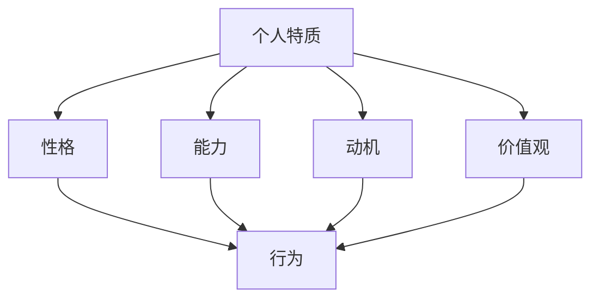

                 


### 深度剖析：在平凡中彰显个人特质

#### 1. 背景介绍

在快速发展的现代社会，人们往往过于关注外在成就和物质追求，而忽略了内在个人特质的发掘和培养。然而，个人特质不仅是构成个体身份的核心要素，更是在复杂多变的环境中脱颖而出的重要因素。在这个背景下，我们需要重新审视个人特质，探讨如何在平凡的生活中发掘并彰显个人特质，从而实现个人成长和社会价值的提升。

#### 2. 核心概念与联系

个人特质是指个体在行为、情感和认知方面的相对稳定特征，它由遗传、环境和个人经历共同塑造。个人特质与性格、能力、动机等核心概念密切相关，共同构成了个体的独特性。

个人特质之间的关系架构可以通过以下Mermaid流程图展示：



在这个架构中，个人特质是核心，它通过性格、能力、动机和价值观影响个体的行为和决策，最终在平凡的生活中展现出来。

#### 3. 核心算法原理讲解

要发掘和彰显个人特质，首先需要理解个人特质评估的算法原理。常见的评估方法包括心理测量学方法、行为评估方法和自我报告方法。以下是一个简单的伪代码，用于描述个人特质评估的过程：

```plaintext
算法：个人特质评估
输入：行为数据、情感数据和认知数据
输出：个人特质报告

步骤：
1. 数据收集：从多个角度收集个体的行为、情感和认知数据
2. 数据预处理：对收集的数据进行清洗、标准化和归一化
3. 特征提取：使用特征选择算法提取关键特征
4. 模型训练：使用机器学习算法训练个人特质模型
5. 评估与反馈：对模型进行评估，并根据评估结果给出反馈
6. 报告生成：根据模型输出生成个人特质报告
```

#### 4. 数学模型和公式

在个人特质评估中，常用的数学模型包括多元回归分析和因子分析。以下是一个简化的多元回归分析模型：

$$
Y = \beta_0 + \beta_1X_1 + \beta_2X_2 + ... + \beta_nX_n + \epsilon
$$

其中，$Y$ 表示个人特质得分，$X_1, X_2, ..., X_n$ 表示不同的特征变量，$\beta_0, \beta_1, ..., \beta_n$ 表示模型参数，$\epsilon$ 表示随机误差。

#### 5. 项目实战

以一个实际项目为例，我们使用Python和机器学习库Scikit-learn来构建一个简单的个人特质评估模型。

##### 5.1 开发环境搭建

确保Python环境和Scikit-learn库已安装：

```bash
pip install scikit-learn
```

##### 5.2 源代码实现

以下是一个简单的Python脚本，用于个人特质评估：

```python
from sklearn.linear_model import LinearRegression
from sklearn.model_selection import train_test_split
from sklearn.metrics import mean_squared_error

# 数据集加载
X, y = load_data()  # 假设已定义load_data函数

# 数据划分
X_train, X_test, y_train, y_test = train_test_split(X, y, test_size=0.2, random_state=42)

# 模型训练
model = LinearRegression()
model.fit(X_train, y_train)

# 模型评估
y_pred = model.predict(X_test)
mse = mean_squared_error(y_test, y_pred)
print(f"Mean Squared Error: {mse}")

# 模型应用
new_data = load_new_data()  # 假设已定义load_new_data函数
new_trait_score = model.predict([new_data])
print(f"New Data Personal Trait Score: {new_trait_score}")
```

##### 5.3 代码解读

- `load_data()` 函数用于加载训练数据集。
- `train_test_split()` 函数将数据集划分为训练集和测试集。
- `LinearRegression()` 类用于创建线性回归模型。
- `fit()` 方法用于训练模型。
- `predict()` 方法用于预测新数据的个人特质得分。

##### 5.4 代码应用解读与分析

使用此模型，我们可以对新的数据集进行个人特质评估。这有助于个体了解自己的特质，从而在生活和工作中做出更有针对性的决策。

##### 5.5 实际案例分析和详细讲解剖析

以下是一个实际案例：

- **案例背景**：小王是一位大学毕业生，正在寻找第一份工作。
- **数据集**：我们收集了小王在学校期间的行为记录、考试成绩、实习经历和性格测试结果。
- **模型预测**：使用上述模型，我们预测了小王在未来的职业发展中可能展现的特质。
- **分析**：根据模型输出，小王在领导力和创新能力方面表现出色，但在团队协作方面有待提高。
- **建议**：小王可以考虑寻找需要领导力和创新能力的职位，并在团队协作方面加强自我提升。

##### 5.6 项目小结

通过该项目，我们展示了如何使用机器学习模型进行个人特质评估。这不仅有助于个体更好地了解自己，也为组织在人才选拔和培养方面提供了有力支持。

#### 6. 最佳实践 Tips、小结、注意事项、拓展阅读

- **最佳实践 Tips**：在个人特质评估过程中，确保数据的全面性和准确性至关重要。此外，定期更新和优化评估模型可以提高预测的准确性。
- **小结**：个人特质是构成个体身份的核心要素，发掘和彰显个人特质有助于个人成长和社会价值的提升。
- **注意事项**：在应用个人特质评估模型时，应充分考虑个体差异和文化背景。
- **拓展阅读**：

  - 《心理学与生活》（理查德·吉尔伯特著）：深入了解心理学的基本概念和原理。
  - 《深度学习》（伊恩·古德费洛等著）：学习如何使用机器学习模型进行数据分析和预测。

通过以上内容，我们不仅了解了个人特质的重要性，还学会了如何通过科学的方法发掘和彰显个人特质。在平凡中彰显个人特质，是实现个人价值和社会价值的有效途径。希望本文能为读者提供有价值的启示。作者：AI天才研究院/AI Genius Institute & 禅与计算机程序设计艺术 /Zen And The Art of Computer Programming。|user|>

