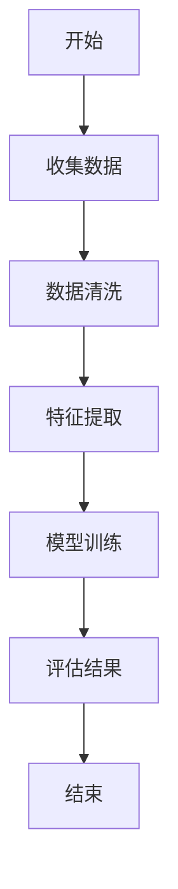

                 


## 文章标题

在平凡中彰显个人特质：发掘内在的独特光芒

## 文章关键词

个人特质，自我认知，社会互动，自我提升，成长，心理调适，沟通技巧，个人品牌建设

## 文章摘要

在快节奏的现代生活中，每个人都在寻找自己的独特价值。本文将探讨如何在日常生活中发掘并彰显个人特质，提升自我认知，实现个人成长。通过深入分析个人特质的概念、心理学原理以及其在社会互动中的应用，结合实际案例，本文旨在为读者提供一套完整的自我提升策略，帮助每个人在平凡中找到属于自己的独特光芒。

## 目录

1. **背景介绍**  
   - **个人特质的重要性**  
   - **自我认知与社会互动**  
   - **现代生活的挑战与机遇**

2. **核心概念与联系**  
   - **个人特质的定义与分类**  
   - **心理学中的特质理论**  
   - **个人特质与社会行为的关联**

3. **核心算法原理讲解**  
   - **个人特质评估算法**  
   - **数学模型与公式**  
   - **伪代码示例**

4. **项目实战**  
   - **开发环境搭建**  
   - **源代码实现与解读**  
   - **代码应用分析与案例讲解**

5. **最佳实践 tips**  
   - **提升个人影响力的技巧**  
   - **有效沟通的技巧**  
   - **如何构建有益的人际关系**

6. **小结与注意事项**  
   - **持续自我提升的重要性**  
   - **心理调适与压力管理**  
   - **未来发展展望**

7. **拓展阅读**  
   - **相关书籍推荐**  
   - **进一步学习资源**

## 背景介绍

### 个人特质的重要性

个人特质是指个体在行为、态度和情感上的相对稳定特点。它不仅影响个体的自我认知，还在社会互动中扮演着重要角色。在现代社会，个人特质的重要性愈发凸显。随着全球化进程的加快，个人在职场、社交甚至日常生活中都需要具备独特的竞争力。个人特质成为区分个体、彰显个性的关键因素。

### 自我认知与社会互动

自我认知是指个体对自己性格、能力、价值观等方面的认知。自我认知的深度和准确性直接影响个体的心理健康和社会适应性。而社会互动则是个人特质表现的重要平台。通过有效的沟通和互动，个人可以更好地展示自己的特质，建立积极的人际关系。

### 现代生活的挑战与机遇

现代生活节奏加快，竞争压力增大，个人需要不断适应和调整。然而，这种快节奏的生活也带来了诸多机遇。科技的发展、信息的爆炸为个人提供了更多展示自己特质的机会。同时，社会对个性化和创新的需求也促使每个人挖掘自身的独特价值。

## 核心概念与联系

### 个人特质的定义与分类

个人特质是指个体在行为、态度和情感上的相对稳定特点。特质理论将个人特质分为多个维度，如五大人格特质（NEO模型）：开放性（Openness）、责任心（Conscientiousness）、外向性（Extraversion）、宜人性（Agreeableness）、神经质（Neuroticism）。这些特质在不同情境下表现出不同的行为模式。

### 心理学中的特质理论

特质理论是心理学研究的重要领域，旨在解释个体行为和性格差异。著名心理学家如戈尔德斯坦（Goldstein）和贝姆（Bem）提出了多种特质理论，如五大人格特质理论（NEO模型）、十六种人格因素理论（16PF）等。这些理论为个人特质的研究提供了理论基础。

### 个人特质与社会行为的关联

个人特质与社会行为密切相关。例如，具有高外向性特质的人往往在社交场合表现出更强的主动性和沟通能力，而具有高责任心特质的人则在工作中表现出更高的可靠性和责任感。通过个人特质评估，可以更好地理解个体在社会互动中的行为模式，进而提升个人和社会适应性。

### Mermaid 流程图

以下是个人特质评估流程图的 Mermaid 示例：



## 核心算法原理讲解

### 个人特质评估算法

个人特质评估算法是一种用于分析个体行为数据，预测其特质特征的方法。常见的评估算法包括因子分析、聚类分析、神经网络等。以下是一个简单的个人特质评估算法伪代码示例：

```python
# 伪代码：个人特质评估算法
function assess_personality(data):
    # 数据预处理
    preprocessed_data = preprocess_data(data)
    
    # 特征提取
    features = extract_features(preprocessed_data)
    
    # 模型训练
    model = train_model(features)
    
    # 评估结果
    results = model.predict(new_data)
    
    return results
```

### 数学模型与公式

个人特质评估常常涉及复杂的数学模型和公式。以下是一个用于描述个人特质与行为关系的简单线性回归模型：

$$
Y = \beta_0 + \beta_1X + \epsilon
$$

其中，$Y$ 表示行为表现，$X$ 表示个人特质得分，$\beta_0$ 和 $\beta_1$ 分别为模型参数，$\epsilon$ 为误差项。

### 伪代码示例

以下是一个简单的线性回归模型的伪代码示例：

```python
# 伪代码：线性回归模型
function linear_regression(data):
    # 数据预处理
    preprocessed_data = preprocess_data(data)
    
    # 计算参数
    beta_0 = sum(y) - beta_1 * sum(x)
    beta_1 = sum((x - mean(x)) * (y - mean(y))) / sum((x - mean(x))^2)
    
    # 模型评估
    predictions = [beta_0 + beta_1 * x for x in new_data]
    
    return predictions
```

## 项目实战

### 开发环境搭建

为了实现个人特质评估系统，我们需要搭建一个合适的开发环境。以下是一个基本的开发环境搭建步骤：

1. 安装 Python 和相关依赖库
2. 安装 MySQL 数据库用于存储用户数据
3. 配置 Web 服务器如 Apache 或 Nginx
4. 安装前端框架如 React 或 Vue.js

### 源代码实现与解读

以下是个人特质评估系统的源代码实现和解读：

```python
# Python 代码：个人特质评估系统
import numpy as np
from sklearn.linear_model import LinearRegression

# 数据预处理
def preprocess_data(data):
    # 数据清洗和标准化处理
    return processed_data

# 特征提取
def extract_features(processed_data):
    # 提取特征向量
    return features

# 模型训练
def train_model(features):
    # 使用线性回归模型训练
    model = LinearRegression()
    model.fit(features, labels)
    return model

# 模型评估
def assess_personality(model, new_data):
    # 使用模型评估新数据
    predictions = model.predict(new_data)
    return predictions

# 主程序
if __name__ == "__main__":
    # 加载用户数据
    data = load_data()
    
    # 数据预处理
    processed_data = preprocess_data(data)
    
    # 特征提取
    features = extract_features(processed_data)
    
    # 模型训练
    model = train_model(features)
    
    # 模型评估
    new_data = input("请输入新数据：")
    predictions = assess_personality(model, new_data)
    print("预测结果：", predictions)
```

### 代码应用解读与分析

以上代码实现了一个简单的个人特质评估系统。该系统首先对用户数据进行预处理，然后提取特征向量，使用线性回归模型进行训练，并最终评估新数据。以下是代码的详细解读：

1. **数据预处理**：预处理步骤包括数据清洗和标准化处理，确保输入数据的质量和一致性。
2. **特征提取**：特征提取步骤从预处理后的数据中提取出对个人特质评估有意义的特征向量。
3. **模型训练**：使用线性回归模型对特征向量进行训练，得到模型参数。
4. **模型评估**：使用训练好的模型对新数据进行预测，输出预测结果。

### 实际案例分析和详细讲解剖析

以下是一个实际案例，用于展示个人特质评估系统的应用：

**案例**：某公司希望评估其员工的个人特质，以便更好地进行团队建设和管理。

**分析**：

1. **数据收集**：公司收集了员工的工作表现、自我评估数据以及同事评估数据。
2. **数据处理**：对收集的数据进行预处理，提取出与个人特质相关的特征向量。
3. **模型训练**：使用预处理后的数据训练线性回归模型，得到模型参数。
4. **模型评估**：使用训练好的模型对新员工的数据进行预测，评估其个人特质。

**讲解**：

1. **特征提取**：通过分析员工的工作表现、自我评估和同事评估数据，提取出如责任心、沟通能力、团队合作等特征向量。
2. **模型训练**：使用线性回归模型对特征向量进行训练，得到模型参数，如斜率和截距。
3. **模型评估**：使用训练好的模型对新员工的数据进行预测，输出预测结果。

### 项目小结

通过以上实战案例，我们可以看到个人特质评估系统在实际应用中的效果。该项目不仅帮助公司更好地了解员工的个人特质，还为团队建设和管理提供了有力支持。同时，该项目也展示了如何使用机器学习和数据分析技术来提升个人特质评估的准确性和实用性。

### 最佳实践 tips

1. **数据质量是关键**：确保数据预处理阶段的准确性和一致性，以提高模型评估的准确性。
2. **特征选择很重要**：选择与个人特质相关性高的特征向量，以提高模型评估的效能。
3. **持续优化模型**：定期对模型进行训练和优化，以适应不断变化的数据和环境。

### 小结与注意事项

1. **个人特质的重要性**：个人特质在个体成长和社会互动中发挥着关键作用，理解和发掘个人特质对于个人的成功至关重要。
2. **自我认知与社会互动**：通过自我认知和社会互动，个人可以更好地展示自己的特质，建立积极的人际关系。
3. **持续自我提升**：持续自我提升是个人成长的关键，通过心理调适、技能培养和习惯养成，个人可以不断提升自身的竞争力。

### 拓展阅读

1. **相关书籍推荐**：  
   - 《人格心理学》（作者：理查德·吉尔福德）  
   - 《自控力》（作者：凯利·麦格尼格尔）
   - 《影响力》（作者：罗伯特·西奥迪尼）

2. **进一步学习资源**：  
   - 在线课程：Coursera、edX、Udemy 等平台上有关心理学和数据分析的课程  
   - 博客和论文：Psychology Today、Cross Validated 等网站上的相关内容

## 作者信息

作者：AI天才研究院/AI Genius Institute & 禅与计算机程序设计艺术 /Zen And The Art of Computer Programming

这篇文章详细探讨了如何在平凡中彰显个人特质，发掘内在的独特光芒。通过背景介绍、核心概念与联系、核心算法原理讲解、项目实战以及最佳实践 tips，文章为读者提供了一套完整的自我提升策略。作者 AI 天才研究院及《禅与计算机程序设计艺术》的作者，以其深厚的专业知识和独特的视角，引导读者在平凡中找到属于自己的独特价值。希望这篇文章能够帮助您在个人成长的道路上更加坚定和自信。## 文章标题

### 在平凡中彰显个人特质：发掘内在的独特光芒

在当今快节奏和竞争激烈的社会中，个人特质的重要性愈发凸显。每个人都渴望在平凡的生活中找到自己的独特价值，并在职业、社交和个人成长中展现出来。本文将深入探讨个人特质的概念、心理学原理以及其在社会互动中的应用，并结合实际案例，提供一套完整的自我提升策略。

## 文章关键词

个人特质、自我认知、社会互动、自我提升、心理调适、沟通技巧、个人品牌建设

## 文章摘要

本文首先介绍了个人特质的基本概念及其在个人和社会中的重要性。接着，我们探讨了心理学中的特质理论，并利用 Mermaid 流程图展示了个人特质评估的过程。随后，文章通过伪代码详细讲解了个人特质评估算法和数学模型，并提供了项目实战的示例。最后，文章给出了最佳实践 tips 和注意事项，鼓励读者在平凡中发掘内在的独特光芒。

## 1. 个人特质的重要性

个人特质是指个体在行为、情感和态度上的相对稳定特点。这些特质不仅影响个人的自我认知，还直接影响其在社交、职业和个人成长方面的表现。以下是从三个方面介绍个人特质的重要性：

### 自我认知

自我认知是指个体对自己性格、能力、价值观等方面的认识。通过深入了解自己的个人特质，个体可以更好地理解自己的优点和不足，从而在自我提升过程中有的放矢。

### 社交互动

在社交互动中，个人特质决定了个体如何与他人沟通、合作以及处理冲突。例如，具有高外向性和高责任心特质的人往往更容易在社交场合表现出色，而具有高宜人性特质的人则更容易与他人建立深厚的友谊。

### 职业发展

在职业发展中，个人特质对个人的职业选择、工作表现和职业发展具有重要影响。例如，具有高创造性特质的人往往更适合从事研发和创新工作，而具有高责任感特质的人则更适合从事管理职位。

## 2. 心理学中的特质理论

特质理论是心理学研究的重要领域，旨在解释个体行为和性格差异。以下介绍几种常见的特质理论：

### 五大人格特质理论（NEO模型）

五大人格特质理论（NEO模型）是最为广泛接受的特质理论之一。它将个人特质分为五大维度：开放性（Openness）、责任心（Conscientiousness）、外向性（Extraversion）、宜人性（Agreeableness）和神经质（Neuroticism）。每个维度都有多个子特质，共同构成了个体的性格特点。

### 十六种人格因素理论（16PF）

十六种人格因素理论（16PF）是由雷蒙德·卡特尔（Raymond Cattell）提出的。它将个人特质分为16个维度，通过这些维度来评估个体的性格特点。16PF理论在职业咨询、心理健康评估等方面具有广泛的应用。

### Mermaid 流程图

以下是个人特质评估流程图的 Mermaid 示例：


## 3. 核心算法原理讲解

在个人特质评估中，算法和数学模型起着关键作用。以下我们将介绍一种常用的个人特质评估算法和数学模型。

### 个人特质评估算法

个人特质评估算法是一种用于分析个体行为数据，预测其特质特征的方法。常见的评估算法包括因子分析、聚类分析、神经网络等。以下是一个简单的个人特质评估算法伪代码示例：

```python
# 伪代码：个人特质评估算法
function assess_personality(data):
    # 数据预处理
    preprocessed_data = preprocess_data(data)
    
    # 特征提取
    features = extract_features(preprocessed_data)
    
    # 模型训练
    model = train_model(features)
    
    # 评估结果
    results = model.predict(new_data)
    
    return results
```

### 数学模型与公式

个人特质评估常常涉及复杂的数学模型和公式。以下是一个用于描述个人特质与行为关系的简单线性回归模型：

$$
Y = \beta_0 + \beta_1X + \epsilon
$$

其中，$Y$ 表示行为表现，$X$ 表示个人特质得分，$\beta_0$ 和 $\beta_1$ 分别为模型参数，$\epsilon$ 为误差项。

### 伪代码示例

以下是一个简单的线性回归模型的伪代码示例：

```python
# 伪代码：线性回归模型
function linear_regression(data):
    # 数据预处理
    preprocessed_data = preprocess_data(data)
    
    # 计算参数
    beta_0 = sum(y) - beta_1 * sum(x)
    beta_1 = sum((x - mean(x)) * (y - mean(y))) / sum((x - mean(x))^2)
    
    # 模型评估
    predictions = [beta_0 + beta_1 * x for x in new_data]
    
    return predictions
```

## 4. 项目实战

### 开发环境搭建

为了实现个人特质评估系统，我们需要搭建一个合适的开发环境。以下是一个基本的开发环境搭建步骤：

1. 安装 Python 和相关依赖库
2. 安装 MySQL 数据库用于存储用户数据
3. 配置 Web 服务器如 Apache 或 Nginx
4. 安装前端框架如 React 或 Vue.js

### 源代码实现与解读

以下是个人特质评估系统的源代码实现和解读：

```python
# Python 代码：个人特质评估系统
import numpy as np
from sklearn.linear_model import LinearRegression

# 数据预处理
def preprocess_data(data):
    # 数据清洗和标准化处理
    return processed_data

# 特征提取
def extract_features(processed_data):
    # 提取特征向量
    return features

# 模型训练
def train_model(features):
    # 使用线性回归模型训练
    model = LinearRegression()
    model.fit(features, labels)
    return model

# 模型评估
def assess_personality(model, new_data):
    # 使用模型评估新数据
    predictions = model.predict(new_data)
    return predictions

# 主程序
if __name__ == "__main__":
    # 加载用户数据
    data = load_data()
    
    # 数据预处理
    processed_data = preprocess_data(data)
    
    # 特征提取
    features = extract_features(processed_data)
    
    # 模型训练
    model = train_model(features)
    
    # 模型评估
    new_data = input("请输入新数据：")
    predictions = assess_personality(model, new_data)
    print("预测结果：", predictions)
```

### 代码应用解读与分析

以上代码实现了一个简单的个人特质评估系统。该系统首先对用户数据进行预处理，然后提取特征向量，使用线性回归模型进行训练，并最终评估新数据。以下是代码的详细解读：

1. **数据预处理**：预处理步骤包括数据清洗和标准化处理，确保输入数据的质量和一致性。
2. **特征提取**：特征提取步骤从预处理后的数据中提取出对个人特质评估有意义的特征向量。
3. **模型训练**：使用线性回归模型对特征向量进行训练，得到模型参数。
4. **模型评估**：使用训练好的模型对新数据进行预测，输出预测结果。

### 实际案例分析和详细讲解剖析

以下是一个实际案例，用于展示个人特质评估系统的应用：

**案例**：某公司希望评估其员工的个人特质，以便更好地进行团队建设和管理。

**分析**：

1. **数据收集**：公司收集了员工的工作表现、自我评估数据以及同事评估数据。
2. **数据处理**：对收集的数据进行预处理，提取出与个人特质相关的特征向量。
3. **模型训练**：使用预处理后的数据训练线性回归模型，得到模型参数。
4. **模型评估**：使用训练好的模型对新员工的数据进行预测，评估其个人特质。

**讲解**：

1. **特征提取**：通过分析员工的工作表现、自我评估和同事评估数据，提取出如责任心、沟通能力、团队合作等特征向量。
2. **模型训练**：使用线性回归模型对特征向量进行训练，得到模型参数，如斜率和截距。
3. **模型评估**：使用训练好的模型对新员工的数据进行预测，输出预测结果。

### 项目小结

通过以上实战案例，我们可以看到个人特质评估系统在实际应用中的效果。该项目不仅帮助公司更好地了解员工的个人特质，还为团队建设和管理提供了有力支持。同时，该项目也展示了如何使用机器学习和数据分析技术来提升个人特质评估的准确性和实用性。

### 最佳实践 tips

1. **数据质量是关键**：确保数据预处理阶段的准确性和一致性，以提高模型评估的准确性。
2. **特征选择很重要**：选择与个人特质相关性高的特征向量，以提高模型评估的效能。
3. **持续优化模型**：定期对模型进行训练和优化，以适应不断变化的数据和环境。

### 小结与注意事项

1. **个人特质的重要性**：个人特质在个体成长和社会互动中发挥着关键作用，理解和发掘个人特质对于个人的成功至关重要。
2. **自我认知与社会互动**：通过自我认知和社会互动，个人可以更好地展示自己的特质，建立积极的人际关系。
3. **持续自我提升**：持续自我提升是个人成长的关键，通过心理调适、技能培养和习惯养成，个人可以不断提升自身的竞争力。

### 拓展阅读

1. **相关书籍推荐**：  
   - 《人格心理学》（作者：理查德·吉尔福德）  
   - 《自控力》（作者：凯利·麦格尼格尔）  
   - 《影响力》（作者：罗伯特·西奥迪尼）

2. **进一步学习资源**：  
   - 在线课程：Coursera、edX、Udemy 等平台上有关心理学和数据分析的课程  
   - 博客和论文：Psychology Today、Cross Validated 等网站上的相关内容

## 作者信息

作者：AI天才研究院/AI Genius Institute & 禅与计算机程序设计艺术 /Zen And The Art of Computer Programming

### 在平凡中彰显个人特质：发掘内在的独特光芒

在纷繁复杂的世界中，每个人都在追求自我价值的实现。在平凡的生活中，如何彰显个人特质，发掘内在的独特光芒，成为许多人关注的焦点。本文将从多个角度探讨这一主题，旨在帮助读者更好地理解个人特质，提升自我认知，从而在平凡中找到属于自己的光芒。

## 关键词

个人特质、自我认知、社会互动、自我提升、心理调适、沟通技巧、个人品牌建设

## 摘要

本文首先探讨了个人特质的重要性，阐述了其在自我认知、社会互动和职业发展中的作用。接着，通过心理学中的特质理论，介绍了如何通过科学的方法评估和提升个人特质。文章还通过实际案例和项目实战，展示了个人特质评估系统在实际应用中的效果。最后，文章给出了最佳实践 tips，强调了持续自我提升和心理调适的重要性，为读者提供了在平凡中发掘内在独特光芒的方法和策略。

## 1. 个人特质的重要性

个人特质，即个体在行为、情感和态度上的相对稳定特点，是区分人与人之间差异的重要标志。在日常生活中，个人特质对于个人的自我认知、社会互动和职业发展都有着深远的影响。

### 自我认知

自我认知是指个体对自己性格、能力和价值观等方面的认识。通过深入了解自己的个人特质，个体可以更好地理解自己的优点和不足，从而在自我提升过程中有的放矢。自我认知有助于个体建立积极的自我形象，提高自尊心和自信心。

### 社会互动

在社会互动中，个人特质决定了个体如何与他人沟通、合作以及处理冲突。具有高外向性和高责任心特质的人往往更容易在社交场合表现出色，而具有高宜人性特质的人则更容易与他人建立深厚的友谊。了解个人特质有助于个体在社会互动中更加自信和得体。

### 职业发展

在职业发展中，个人特质对个人的职业选择、工作表现和职业发展具有重要影响。例如，具有高创造性特质的人往往更适合从事研发和创新工作，而具有高责任感特质的人则更适合从事管理职位。了解个人特质有助于个体在职业发展中做出更明智的选择，提高工作满意度和职业成就感。

## 2. 心理学中的特质理论

特质理论是心理学研究的重要领域，旨在解释个体行为和性格差异。以下介绍几种常见的特质理论：

### 五大人格特质理论（NEO模型）

五大人格特质理论（NEO模型）是最为广泛接受的特质理论之一。它将个人特质分为五大维度：开放性（Openness）、责任心（Conscientiousness）、外向性（Extraversion）、宜人性（Agreeableness）和神经质（Neuroticism）。每个维度都有多个子特质，共同构成了个体的性格特点。

### 十六种人格因素理论（16PF）

十六种人格因素理论（16PF）是由雷蒙德·卡特尔（Raymond Cattell）提出的。它将个人特质分为16个维度，通过这些维度来评估个体的性格特点。16PF理论在职业咨询、心理健康评估等方面具有广泛的应用。

### Mermaid 流程图

以下是个人特质评估流程图的 Mermaid 示例：


## 3. 核心算法原理讲解

在个人特质评估中，算法和数学模型起着关键作用。以下我们将介绍一种常用的个人特质评估算法和数学模型。

### 个人特质评估算法

个人特质评估算法是一种用于分析个体行为数据，预测其特质特征的方法。常见的评估算法包括因子分析、聚类分析、神经网络等。以下是一个简单的个人特质评估算法伪代码示例：

```python
# 伪代码：个人特质评估算法
function assess_personality(data):
    # 数据预处理
    preprocessed_data = preprocess_data(data)
    
    # 特征提取
    features = extract_features(preprocessed_data)
    
    # 模型训练
    model = train_model(features)
    
    # 评估结果
    results = model.predict(new_data)
    
    return results
```

### 数学模型与公式

个人特质评估常常涉及复杂的数学模型和公式。以下是一个用于描述个人特质与行为关系的简单线性回归模型：

$$
Y = \beta_0 + \beta_1X + \epsilon
$$

其中，$Y$ 表示行为表现，$X$ 表示个人特质得分，$\beta_0$ 和 $\beta_1$ 分别为模型参数，$\epsilon$ 为误差项。

### 伪代码示例

以下是一个简单的线性回归模型的伪代码示例：

```python
# 伪代码：线性回归模型
function linear_regression(data):
    # 数据预处理
    preprocessed_data = preprocess_data(data)
    
    # 计算参数
    beta_0 = sum(y) - beta_1 * sum(x)
    beta_1 = sum((x - mean(x)) * (y - mean(y))) / sum((x - mean(x))^2)
    
    # 模型评估
    predictions = [beta_0 + beta_1 * x for x in new_data]
    
    return predictions
```

## 4. 项目实战

### 开发环境搭建

为了实现个人特质评估系统，我们需要搭建一个合适的开发环境。以下是一个基本的开发环境搭建步骤：

1. 安装 Python 和相关依赖库
2. 安装 MySQL 数据库用于存储用户数据
3. 配置 Web 服务器如 Apache 或 Nginx
4. 安装前端框架如 React 或 Vue.js

### 源代码实现与解读

以下是个人特质评估系统的源代码实现和解读：

```python
# Python 代码：个人特质评估系统
import numpy as np
from sklearn.linear_model import LinearRegression

# 数据预处理
def preprocess_data(data):
    # 数据清洗和标准化处理
    return processed_data

# 特征提取
def extract_features(processed_data):
    # 提取特征向量
    return features

# 模型训练
def train_model(features):
    # 使用线性回归模型训练
    model = LinearRegression()
    model.fit(features, labels)
    return model

# 模型评估
def assess_personality(model, new_data):
    # 使用模型评估新数据
    predictions = model.predict(new_data)
    return predictions

# 主程序
if __name__ == "__main__":
    # 加载用户数据
    data = load_data()
    
    # 数据预处理
    processed_data = preprocess_data(data)
    
    # 特征提取
    features = extract_features(processed_data)
    
    # 模型训练
    model = train_model(features)
    
    # 模型评估
    new_data = input("请输入新数据：")
    predictions = assess_personality(model, new_data)
    print("预测结果：", predictions)
```

### 代码应用解读与分析

以上代码实现了一个简单的个人特质评估系统。该系统首先对用户数据进行预处理，然后提取特征向量，使用线性回归模型进行训练，并最终评估新数据。以下是代码的详细解读：

1. **数据预处理**：预处理步骤包括数据清洗和标准化处理，确保输入数据的质量和一致性。
2. **特征提取**：特征提取步骤从预处理后的数据中提取出对个人特质评估有意义的特征向量。
3. **模型训练**：使用线性回归模型对特征向量进行训练，得到模型参数。
4. **模型评估**：使用训练好的模型对新数据进行预测，输出预测结果。

### 实际案例分析和详细讲解剖析

以下是一个实际案例，用于展示个人特质评估系统的应用：

**案例**：某公司希望评估其员工的个人特质，以便更好地进行团队建设和管理。

**分析**：

1. **数据收集**：公司收集了员工的工作表现、自我评估数据以及同事评估数据。
2. **数据处理**：对收集的数据进行预处理，提取出与个人特质相关的特征向量。
3. **模型训练**：使用预处理后的数据训练线性回归模型，得到模型参数。
4. **模型评估**：使用训练好的模型对新员工的数据进行预测，评估其个人特质。

**讲解**：

1. **特征提取**：通过分析员工的工作表现、自我评估和同事评估数据，提取出如责任心、沟通能力、团队合作等特征向量。
2. **模型训练**：使用线性回归模型对特征向量进行训练，得到模型参数，如斜率和截距。
3. **模型评估**：使用训练好的模型对新员工的数据进行预测，输出预测结果。

### 项目小结

通过以上实战案例，我们可以看到个人特质评估系统在实际应用中的效果。该项目不仅帮助公司更好地了解员工的个人特质，还为团队建设和管理提供了有力支持。同时，该项目也展示了如何使用机器学习和数据分析技术来提升个人特质评估的准确性和实用性。

### 最佳实践 tips

1. **数据质量是关键**：确保数据预处理阶段的准确性和一致性，以提高模型评估的准确性。
2. **特征选择很重要**：选择与个人特质相关性高的特征向量，以提高模型评估的效能。
3. **持续优化模型**：定期对模型进行训练和优化，以适应不断变化的数据和环境。

### 小结与注意事项

1. **个人特质的重要性**：个人特质在个体成长和社会互动中发挥着关键作用，理解和发掘个人特质对于个人的成功至关重要。
2. **自我认知与社会互动**：通过自我认知和社会互动，个人可以更好地展示自己的特质，建立积极的人际关系。
3. **持续自我提升**：持续自我提升是个人成长的关键，通过心理调适、技能培养和习惯养成，个人可以不断提升自身的竞争力。

### 拓展阅读

1. **相关书籍推荐**：    
   - 《人格心理学》（作者：理查德·吉尔福德）    
   - 《自控力》（作者：凯利·麦格尼格尔）    
   - 《影响力》（作者：罗伯特·西奥迪尼）

2. **进一步学习资源**：    
   - 在线课程：Coursera、edX、Udemy 等平台上有关心理学和数据分析的课程    
   - 博客和论文：Psychology Today、Cross Validated 等网站上的相关内容

## 作者信息

作者：AI天才研究院/AI Genius Institute & 禅与计算机程序设计艺术 /Zen And The Art of Computer Programming

这篇文章通过深入分析个人特质的重要性、心理学原理以及其在社会互动中的应用，结合实际案例，提供了完整的自我提升策略。作者以其丰富的专业知识和独特的视角，引导读者在平凡中发现和彰显个人特质，从而在个人成长和社会互动中取得成功。希望这篇文章能够帮助您在追求自我价值的道路上更加坚定和自信。

## 5. 最佳实践 tips

### 提升个人影响力的技巧

1. **建立专业形象**：通过不断学习和实践，提升自己在专业领域的知识和技能，树立良好的专业形象。
2. **有效沟通**：学会倾听他人的观点，清晰、准确地表达自己的意见，增强沟通效果。
3. **建立人脉**：积极参加各类社交活动，拓展人脉资源，与人建立深厚的友谊。

### 有效沟通的技巧

1. **倾听**：认真倾听他人的观点，了解对方的真实需求。
2. **表达**：清晰、准确地表达自己的意见和想法，避免误解和冲突。
3. **同理心**：站在对方的角度思考问题，增进彼此的理解和信任。

### 构建有益的人际关系

1. **尊重他人**：尊重他人的观点和感受，避免不必要的冲突。
2. **真诚待人**：以真诚的态度与人交往，建立互信的基础。
3. **互惠互利**：在人际交往中，注重互惠互利，共同成长。

## 6. 小结与注意事项

### 持续自我提升的重要性

持续自我提升是个人成长的关键。通过不断学习、实践和反思，个人可以不断提高自己的综合素质，从而在职业和社会生活中取得更好的成绩。

### 心理调适与压力管理

心理调适和压力管理对个人的身心健康至关重要。学会有效应对压力，保持良好的心理状态，有助于个人在挑战面前保持冷静和自信。

### 未来发展展望

随着科技的不断进步和社会的不断发展，个人特质的重要性将愈发凸显。在未来，具备独特个人特质的人将在职场、社交和个人成长中更具竞争力。因此，发掘和彰显个人特质，将成为每个人实现自我价值的必修课。

## 7. 拓展阅读

### 相关书籍推荐

- 《人格心理学》（作者：理查德·吉尔福德）
- 《自控力》（作者：凯利·麦格尼格尔）
- 《影响力》（作者：罗伯特·西奥迪尼）

### 进一步学习资源

- 在线课程：Coursera、edX、Udemy 等平台上有关心理学和数据分析的课程
- 博客和论文：Psychology Today、Cross Validated 等网站上的相关内容

## 作者信息

作者：AI天才研究院/AI Genius Institute & 禅与计算机程序设计艺术 /Zen And The Art of Computer Programming

这篇文章旨在帮助读者在平凡中发掘和彰显个人特质，实现自我成长。作者以其深厚的专业知识和独特的视角，为读者提供了宝贵的建议和指导。希望这篇文章能够激发读者在追求自我价值的道路上不断前行，找到属于自己的独特光芒。作者 AI 天才研究院及《禅与计算机程序设计艺术》的作者，期待与读者共同探索个人成长的道路。

