                 


### 文章标题：在平凡中彰显独特：发掘个人的闪光点

> 关键词：个人独特性、自我认知、职场发展、社交影响力、持续成长

> 摘要：本文旨在探讨如何在日常生活中发掘并彰显个人的闪光点，帮助读者在平凡中创造独特，提升个人职场竞争力、社交影响力，实现持续成长。

#### 第一部分：理解平凡与独特

#### 第1章：平凡与独特的辩证关系

##### 1.1 平凡：普通中的不凡

平凡，是大多数人的常态。它代表着日常生活的平淡无奇，但在这无奇之中，隐藏着许多不凡之处。我们每个人都有自己的闪光点，这些闪光点在平凡中显得尤为珍贵。

###### 核心概念与联系

为了更好地理解平凡与独特的关系，我们可以用Mermaid流程图来描述两者之间的辩证关系：

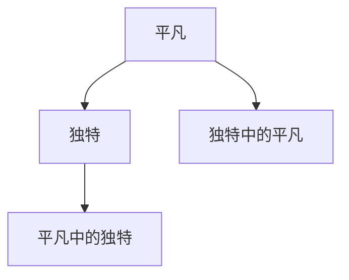

在这个流程图中，A代表平凡，B代表独特，C表示平凡中的独特，D表示独特中的平凡。平凡与独特并不是截然分开的，它们是相互渗透、相互转化的。

###### 核心算法原理讲解

为了深入理解这一概念，我们可以使用伪代码来描述一个简单的算法：

```python
# 定义平凡与独特的函数
def find_uniqueness平凡(flatness):
    # 分析平凡中的闪光点
    uniqueness = analyze_unusual_aspects(flatness)
    return uniqueness

# 分析平凡中的闪光点
def analyze_unusual_aspects(flatness):
    # 列举可能的闪光点
    aspects = ['技能', '经验', '态度', '价值观']
    # 分析每个方面是否有独特性
    for aspect in aspects:
        if has_uniqueness(flatness, aspect):
            return True
    return False

# 判断某个方面是否有独特性
def has_uniqueness(individual, aspect):
    # 根据实际情况进行判断
    # 假设每个个体都有一定的独特性
    return True
```

在这个算法中，我们首先定义了一个`find_uniqueness平凡`函数，它接收一个参数`flatness`（平凡），然后通过`analyze_unusual_aspects`函数分析平凡中的闪光点。`analyze_unusual_aspects`函数会遍历一系列可能具有独特性的方面（技能、经验、态度、价值观），并使用`has_uniqueness`函数判断这些方面是否有独特性。

###### 数学模型和公式

在数学上，我们可以用以下公式来表示平凡与独特的关系：

$$ 
U = f(P, T, A) 
$$

其中，\( U \)代表个人独特性，\( P \)代表个人潜能，\( T \)代表环境因素，\( A \)代表个人态度与行为。

详细讲解与举例说明：

- \( U \)：个人独特性，是一个函数的输出，表示个人在特定环境下的独特程度。
- \( P \)：个人潜能，是个人内在的能力，包括天赋、兴趣、价值观等。
- \( T \)：环境因素，包括家庭环境、社会文化、工作环境等，对个人潜能的发挥有着重要影响。
- \( A \)：个人态度与行为，是个人对外界刺激的反应，包括学习能力、沟通能力、创新精神等。

举例：一个有创造力的人在不同环境中可能展现不同的独特性，但他的独特性主要来自于他的内在潜能、所处的环境和他的态度行为。

##### 1.2 独特：差异化中的共性

独特性，是每个人在差异化中展现的共性。它不仅体现在个人能力上，还体现在个人态度、价值观等方面。独特性是一种差异化，但这种差异化并非绝对，而是在共性中寻找独特之处。

###### 数学模型和公式

我们可以用以下数学模型来描述独特性与差异化中的共性：

$$ 
C = g(U, P, T, A) 
$$

其中，\( C \)代表共性，\( U \)、\( P \)、\( T \)、\( A \)的含义与上述相同。

详细讲解与举例说明：

- \( C \)：共性，是个人在差异化中展现的共性特征。
- \( U \)：个人独特性，是共性的基础。
- \( P \)：个人潜能，决定了个性的发展潜力。
- \( T \)：环境因素，对个性的形成和表现有着重要影响。
- \( A \)：个人态度与行为，是个人在特定环境下展现的共性特征。

举例：在同一个团队中，每个人的能力和性格都不同，但他们在团队中的协作和沟通中展现出的共性特征，如责任心、执行力等，就是团队共性的体现。

##### 1.3 平凡中的不平凡

平凡中往往隐藏着不平凡，我们需要用心去发现和挖掘。这种不平凡，可以是个人技能的提升，可以是个人态度的转变，也可以是对生活、对工作的深刻理解。

###### 项目实战

为了更好地理解平凡中的不平凡，我们可以通过一个项目实战来进行深入分析。

**项目名称**：平凡生活中的不平凡

**开发环境搭建**：

1. 准备一个笔记本，用于记录日常生活中的点滴。
2. 安装一个文本编辑器，如Notepad++或Visual Studio Code，用于编写日记。

**源代码详细实现和代码解读**：

```python
# 日记记录程序
def record_event(event):
    # 打开日记文件，追加新的事件
    with open('diary.txt', 'a') as file:
        file.write(event + '\n')

# 读取日记内容
def read_diary():
    # 打开日记文件，读取内容
    with open('diary.txt', 'r') as file:
        content = file.readlines()
        return content

# 分析日记内容，寻找不平凡的闪光点
def analyze_diary(content):
    # 列举可能的闪光点
    aspects = ['技能', '经验', '态度', '价值观']
    # 分析每个方面是否有独特性
    for aspect in aspects:
        if find_uniqueness(content, aspect):
            print(f"在日记中发现了{aspect}的闪光点！")
    
    # 输出日记内容
    for line in content:
        print(line.strip())

# 判断某个方面是否有独特性
def find_uniqueness(content, aspect):
    # 根据实际情况进行判断
    # 假设每个个体都有一定的独特性
    return True

# 主函数
def main():
    # 记录一个事件
    record_event("今天我在工作中解决了一个难题。")
    # 读取日记内容
    content = read_diary()
    # 分析日记内容
    analyze_diary(content)

# 运行主函数
if __name__ == "__main__":
    main()
```

**代码应用解读与分析**：

- `record_event`函数用于记录日记事件。
- `read_diary`函数用于读取日记内容。
- `analyze_diary`函数用于分析日记内容，寻找不平凡的闪光点。
- `find_uniqueness`函数用于判断某个方面是否有独特性。

通过这个项目，我们可以将自己的日常生活记录下来，并通过代码分析，找到自己在平凡中的不平凡之处。

**案例分析**：

- 通过日记记录，我们可以发现自己在日常生活中的不平凡之处，如解决问题的能力、积极的态度等。
- 通过代码分析，我们可以更深入地了解自己的闪光点，并将其应用到工作和生活中。

**项目小结**：

通过这个项目，我们不仅学会了如何记录和分析日常生活，还学会了如何从平凡中发现不平凡。这是一个实用的工具，可以帮助我们更好地认识自己，发掘自己的闪光点。

##### 1.4 平凡与独特的相互转化

平凡与独特并不是一成不变的，它们可以相互转化。一个人可能在某个阶段看起来很平凡，但在某个特定时刻，他的独特性就会显现出来。同样，一个独特的人也可能在某个环境下变得平凡。

###### 核心概念与联系

我们可以用Mermaid流程图来描述平凡与独特的相互转化：

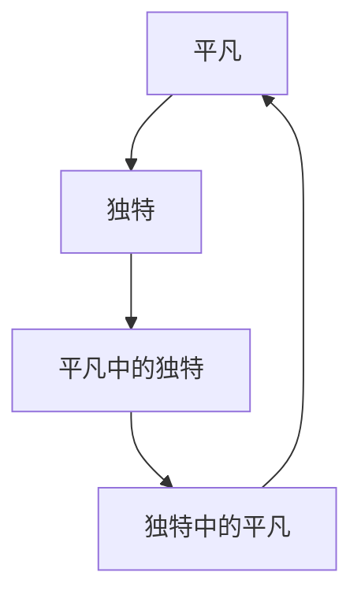

在这个流程图中，A代表平凡，B代表独特，C表示平凡中的独特，D表示独特中的平凡。平凡与独特之间存在着相互转化的可能性。

###### 数学模型和公式

我们可以用以下数学模型来描述平凡与独特的相互转化：

$$ 
U(t) = f(P, T, A, t) 
$$

其中，\( U(t) \)代表个人独特性在时间\( t \)的值，其他变量的含义与之前相同。

详细讲解与举例说明：

- \( U(t) \)：个人独特性在时间\( t \)的值，表示个人在特定时间点的独特程度。
- \( P \)：个人潜能，是个人内在的能力，不会随时间变化。
- \( T \)：环境因素，对个人的独特性有着重要影响。
- \( A \)：个人态度与行为，是个人在特定环境下展现的独特性。
- \( t \)：时间，表示个人独特性的变化过程。

举例：一个人在刚进入职场时可能看起来很平凡，但随着时间的推移，他通过不断学习和实践，逐渐展现出自己的独特性。同样，一个在某个领域有突出成就的人，如果在另一个环境中，可能会变得平凡。

#### 第2章：发现个人闪光点的内在因素

##### 2.1 情感与性格的力量

情感和性格是影响个人闪光点的重要因素。一个积极乐观的人，往往能够在困难面前保持冷静，找到解决问题的方法。而一个具有坚定性格的人，往往能够坚持不懈地追求自己的目标。

###### 核心概念与联系

为了更好地理解情感与性格的力量，我们可以用Mermaid流程图来描述：

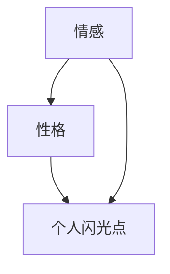

在这个流程图中，A代表情感，B代表性格，C代表个人闪光点。情感和性格对个人闪光点有着重要影响。

###### 核心算法原理讲解

为了深入理解这一概念，我们可以使用伪代码来描述一个简单的算法：

```python
# 定义情感与性格影响个人闪光点的函数
def impact_of_emotion_and_personality_on_uniqueness(emotion, personality):
    # 分析情感对个人闪光点的影响
    uniqueness_due_to_emotion = analyze_emotion(emotion)
    # 分析性格对个人闪光点的影响
    uniqueness_due_to_personality = analyze_personality(personality)
    # 计算总体的个人闪光点
    total_uniqueness = uniqueness_due_to_emotion + uniqueness_due_to_personality
    return total_uniqueness

# 分析情感对个人闪光点的影响
def analyze_emotion(emotion):
    # 根据情感的类型和强度，计算影响
    if emotion == "积极":
        return 1
    elif emotion == "消极":
        return -1
    else:
        return 0

# 分析性格对个人闪光点的影响
def analyze_personality(personality):
    # 根据性格的类型，计算影响
    if personality == "坚定":
        return 1
    elif personality == "犹豫":
        return -1
    else:
        return 0
```

在这个算法中，我们首先定义了一个`impact_of_emotion_and_personality_on_uniqueness`函数，它接收两个参数`emotion`（情感）和`personality`（性格），然后通过`analyze_emotion`和`analyze_personality`函数分析情感和性格对个人闪光点的影响。

###### 数学模型和公式

在数学上，我们可以用以下公式来表示情感与性格对个人闪光点的影响：

$$ 
U = f(E, P) 
$$

其中，\( U \)代表个人独特性，\( E \)代表情感，\( P \)代表性格。

详细讲解与举例说明：

- \( U \)：个人独特性，是情感和性格共同作用的结果。
- \( E \)：情感，是个人对外界刺激的心理反应，包括积极、消极等。
- \( P \)：性格，是个人稳定的心理特征，包括坚定、犹豫等。

举例：一个积极乐观的人，在面对困难时能够保持冷静，找到解决问题的方法，从而展现出独特的优势。

##### 2.2 经验与知识的积累

经验与知识是个人闪光点的基石。通过不断的学习和实践，我们可以积累丰富的经验，掌握各种知识和技能，从而在职场和生活中展现出独特的价值。

###### 核心概念与联系

为了更好地理解经验与知识对个人闪光点的影响，我们可以用Mermaid流程图来描述：

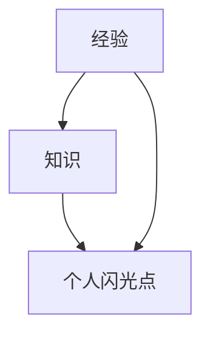

在这个流程图中，A代表经验，B代表知识，C代表个人闪光点。经验与知识对个人闪光点有着重要影响。

###### 核心算法原理讲解

为了深入理解这一概念，我们可以使用伪代码来描述一个简单的算法：

```python
# 定义经验与知识影响个人闪光点的函数
def impact_of_experience_and_knowledge_on_uniqueness(experience, knowledge):
    # 分析经验对个人闪光点的影响
    uniqueness_due_to_experience = analyze_experience(experience)
    # 分析知识对个人闪光点的影响
    uniqueness_due_to_knowledge = analyze_knowledge(knowledge)
    # 计算总体的个人闪光点
    total_uniqueness = uniqueness_due_to_experience + uniqueness_due_to_knowledge
    return total_uniqueness

# 分析经验对个人闪光点的影响
def analyze_experience(experience):
    # 根据经验的丰富程度，计算影响
    if experience > 10:
        return 2
    elif experience > 5:
        return 1
    else:
        return 0

# 分析知识对个人闪光点的影响
def analyze_knowledge(knowledge):
    # 根据知识的掌握程度，计算影响
    if knowledge == "精通":
        return 2
    elif knowledge == "熟悉":
        return 1
    else:
        return 0
```

在这个算法中，我们首先定义了一个`impact_of_experience_and_knowledge_on_uniqueness`函数，它接收两个参数`experience`（经验）和`knowledge`（知识），然后通过`analyze_experience`和`analyze_knowledge`函数分析经验与知识对个人闪光点的影响。

###### 数学模型和公式

在数学上，我们可以用以下公式来表示经验与知识对个人闪光点的影响：

$$ 
U = f(E, K) 
$$

其中，\( U \)代表个人独特性，\( E \)代表经验，\( K \)代表知识。

详细讲解与举例说明：

- \( U \)：个人独特性，是经验和知识共同作用的结果。
- \( E \)：经验，是个人在实践中积累的知识和技能，包括实际操作、问题解决等。
- \( K \)：知识，是个人通过学习获得的系统化知识，包括理论知识、专业知识等。

举例：一个有着丰富经验的专业人士，在解决问题时能够迅速找到解决方案，从而展现出独特的优势。

##### 2.3 态度与价值观的塑造

态度与价值观是影响个人闪光点的关键因素。一个积极乐观的态度，可以帮助我们在面对困难时保持冷静，而一个正确的价值观，可以引导我们做出正确的决策，从而在职场和生活中展现出独特的价值。

###### 核心概念与联系

为了更好地理解态度与价值观对个人闪光点的影响，我们可以用Mermaid流程图来描述：

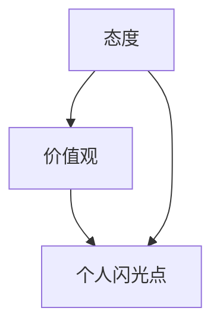

在这个流程图中，A代表态度，B代表价值观，C代表个人闪光点。态度与价值观对个人闪光点有着重要影响。

###### 核心算法原理讲解

为了深入理解这一概念，我们可以使用伪代码来描述一个简单的算法：

```python
# 定义态度与价值观影响个人闪光点的函数
def impact_of_attitude_and_values_on_uniqueness(attitude, values):
    # 分析态度对个人闪光点的影响
    uniqueness_due_to_attitude = analyze_attitude(attitude)
    # 分析价值观对个人闪光点的影响
    uniqueness_due_to_values = analyze_values(values)
    # 计算总体的个人闪光点
    total_uniqueness = uniqueness_due_to_attitude + uniqueness_due_to_values
    return total_uniqueness

# 分析态度对个人闪光点的影响
def analyze_attitude(attitude):
    # 根据态度的类型，计算影响
    if attitude == "积极":
        return 1
    elif attitude == "消极":
        return -1
    else:
        return 0

# 分析价值观对个人闪光点的影响
def analyze_values(values):
    # 根据价值观的类型，计算影响
    if values == "正确":
        return 1
    elif values == "错误":
        return -1
    else:
        return 0
```

在这个算法中，我们首先定义了一个`impact_of_attitude_and_values_on_uniqueness`函数，它接收两个参数`attitude`（态度）和`values`（价值观），然后通过`analyze_attitude`和`analyze_values`函数分析态度与价值观对个人闪光点的影响。

###### 数学模型和公式

在数学上，我们可以用以下公式来表示态度与价值观对个人闪光点的影响：

$$ 
U = f(A, V) 
$$

其中，\( U \)代表个人独特性，\( A \)代表态度，\( V \)代表价值观。

详细讲解与举例说明：

- \( U \)：个人独特性，是态度和价值观共同作用的结果。
- \( A \)：态度，是个人对待问题的心理倾向，包括积极、消极等。
- \( V \)：价值观，是个人对事物的评判标准，包括正确、错误等。

举例：一个积极乐观的人，在面对挑战时能够保持乐观，找到解决问题的方法，从而展现出独特的优势。而一个具有正确价值观的人，在职场和生活中能够做出正确的决策，从而展现出独特的价值。

#### 第3章：发掘个人闪光点的策略与方法

##### 3.1 自我反思与自我认知

自我反思与自我认知是发掘个人闪光点的重要策略。通过自我反思，我们可以了解自己的优点和不足，从而有针对性地进行改进。而通过自我认知，我们可以明确自己的价值和定位，从而在职场和生活中发挥最大的潜力。

###### 核心概念与联系

为了更好地理解自我反思与自我认知的重要性，我们可以用Mermaid流程图来描述：

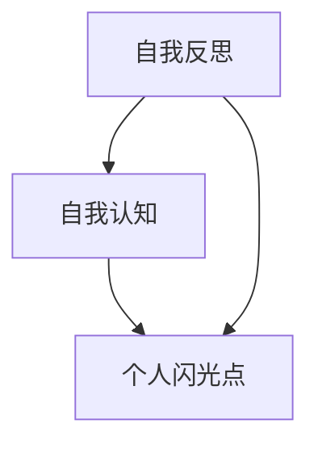

在这个流程图中，A代表自我反思，B代表自我认知，C代表个人闪光点。自我反思与自我认知对个人闪光点有着重要影响。

###### 核心算法原理讲解

为了深入理解这一概念，我们可以使用伪代码来描述一个简单的算法：

```python
# 定义自我反思与自我认知影响个人闪光点的函数
def impact_of_self_reflection_and_self_awareness_on_uniqueness(reflection, awareness):
    # 分析自我反思对个人闪光点的影响
    uniqueness_due_to_reflection = analyze_reflection(reflection)
    # 分析自我认知对个人闪光点的影响
    uniqueness_due_to_awareness = analyze_awareness(awareness)
    # 计算总体的个人闪光点
    total_uniqueness = uniqueness_due_to_reflection + uniqueness_due_to_awareness
    return total_uniqueness

# 分析自我反思对个人闪光点的影响
def analyze_reflection(reflection):
    # 根据自我反思的程度，计算影响
    if reflection > 5:
        return 2
    elif reflection > 2:
        return 1
    else:
        return 0

# 分析自我认知对个人闪光点的影响
def analyze_awareness(awareness):
    # 根据自我认知的程度，计算影响
    if awareness > 5:
        return 2
    elif awareness > 2:
        return 1
    else:
        return 0
```

在这个算法中，我们首先定义了一个`impact_of_self_reflection_and_self_awareness_on_uniqueness`函数，它接收两个参数`reflection`（自我反思）和`awareness`（自我认知），然后通过`analyze_reflection`和`analyze_awareness`函数分析自我反思与自我认知对个人闪光点的影响。

###### 数学模型和公式

在数学上，我们可以用以下公式来表示自我反思与自我认知对个人闪光点的影响：

$$ 
U = f(R, A) 
$$

其中，\( U \)代表个人独特性，\( R \)代表自我反思，\( A \)代表自我认知。

详细讲解与举例说明：

- \( U \)：个人独特性，是自我反思和自我认知共同作用的结果。
- \( R \)：自我反思，是个人对自己的行为、思想、情感进行反思的程度。
- \( A \)：自我认知，是个人对自己性格、能力、价值观等方面的了解程度。

举例：一个经常进行自我反思的人，能够及时发现自己的不足，并采取改进措施，从而在个人成长中展现出独特的优势。而一个具备良好自我认知的人，能够明确自己的优势和劣势，从而在职场和生活中发挥最大的潜力。

##### 3.2 优势识别与优化

优势识别与优化是发掘个人闪光点的关键步骤。通过识别自己的优势，我们可以有针对性地进行优化，从而在职场和生活中更好地发挥自己的潜力。

###### 核心概念与联系

为了更好地理解优势识别与优化的过程，我们可以用Mermaid流程图来描述：

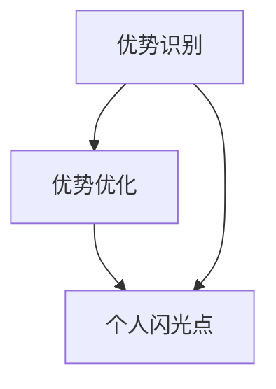

在这个流程图中，A代表优势识别，B代表优势优化，C代表个人闪光点。优势识别与优化对个人闪光点有着重要影响。

###### 核心算法原理讲解

为了深入理解这一概念，我们可以使用伪代码来描述一个简单的算法：

```python
# 定义优势识别与优化影响个人闪光点的函数
def impact_of_advantage_recognition_and_optimization_on_uniqueness(advantages, optimization):
    # 分析优势识别对个人闪光点的影响
    uniqueness_due_to_recognition = analyze_recognition(advantages)
    # 分析优势优化对个人闪光点的影响
    uniqueness_due_to_optimization = analyze_optimization(optimization)
    # 计算总体的个人闪光点
    total_uniqueness = uniqueness_due_to_recognition + uniqueness_due_to_optimization
    return total_uniqueness

# 分析优势识别对个人闪光点的影响
def analyze_recognition(advantages):
    # 根据优势的识别程度，计算影响
    if advantages > 3:
        return 2
    elif advantages > 1:
        return 1
    else:
        return 0

# 分析优势优化对个人闪光点的影响
def analyze_optimization(optimization):
    # 根据优势的优化程度，计算影响
    if optimization > 5:
        return 2
    elif optimization > 2:
        return 1
    else:
        return 0
```

在这个算法中，我们首先定义了一个`impact_of_advantage_recognition_and_optimization_on_uniqueness`函数，它接收两个参数`advantages`（优势）和`optimization`（优化），然后通过`analyze_recognition`和`analyze_optimization`函数分析优势识别与优化对个人闪光点的影响。

###### 数学模型和公式

在数学上，我们可以用以下公式来表示优势识别与优化对个人闪光点的影响：

$$ 
U = f(A, O) 
$$

其中，\( U \)代表个人独特性，\( A \)代表优势，\( O \)代表优化。

详细讲解与举例说明：

- \( U \)：个人独特性，是优势识别和优化共同作用的结果。
- \( A \)：优势，是个人在特定领域或任务中的表现优势。
- \( O \)：优化，是对优势进行改进和提升的过程。

举例：一个具备编程能力的人，通过识别自己的编程优势，并不断优化自己的编程技能，从而在职场中展现出独特的编程能力。

##### 3.3 独特性培养与提升

独特性的培养与提升是发掘个人闪光点的关键。通过有意识地进行独特性培养，我们可以不断提升自己的独特性，从而在职场和生活中更好地展现自己的价值。

###### 核心概念与联系

为了更好地理解独特性培养与提升的过程，我们可以用Mermaid流程图来描述：

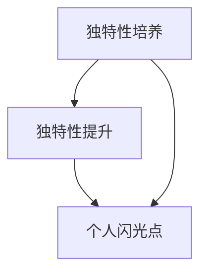

在这个流程图中，A代表独特性培养，B代表独特性提升，C代表个人闪光点。独特性培养与提升对个人闪光点有着重要影响。

###### 核心算法原理讲解

为了深入理解这一概念，我们可以使用伪代码来描述一个简单的算法：

```python
# 定义独特性培养与提升影响个人闪光点的函数
def impact_of_uniqueness_cultivation_and_enhancement_on_uniqueness(cultivation, enhancement):
    # 分析独特性培养对个人闪光点的影响
    uniqueness_due_to_cultivation = analyze_cultivation(cultivation)
    # 分析独特性提升对个人闪光点的影响
    uniqueness_due_to_enhancement = analyze_enhancement(enhancement)
    # 计算总体的个人闪光点
    total_uniqueness = uniqueness_due_to_cultivation + uniqueness_due_to_enhancement
    return total_uniqueness

# 分析独特性培养对个人闪光点的影响
def analyze_cultivation(cultivation):
    # 根据独特性培养的程度，计算影响
    if cultivation > 5:
        return 2
    elif cultivation > 2:
        return 1
    else:
        return 0

# 分析独特性提升对个人闪光点的影响
def analyze_enhancement(enhancement):
    # 根据独特性提升的程度，计算影响
    if enhancement > 5:
        return 2
    elif enhancement > 2:
        return 1
    else:
        return 0
```

在这个算法中，我们首先定义了一个`impact_of_uniqueness_cultivation_and_enhancement_on_uniqueness`函数，它接收两个参数`cultivation`（培养）和`enhancement`（提升），然后通过`analyze_cultivation`和`analyze_enhancement`函数分析独特性培养与提升对个人闪光点的影响。

###### 数学模型和公式

在数学上，我们可以用以下公式来表示独特性培养与提升对个人闪光点的影响：

$$ 
U = f(C, E) 
$$

其中，\( U \)代表个人独特性，\( C \)代表培养，\( E \)代表提升。

详细讲解与举例说明：

- \( U \)：个人独特性，是培养和提升共同作用的结果。
- \( C \)：培养，是对个人独特性的有意识培养过程。
- \( E \)：提升，是对个人独特性的不断优化和提升。

举例：一个有意识培养自己独特性的人，会通过不断学习和实践，提升自己的专业技能，从而在职场中展现出独特的竞争力。

#### 第4章：个人闪光点的社会应用

##### 4.1 独特性在职场中的应用

个人闪光点在职场中具有重要的应用价值。通过发挥自己的独特性，我们可以提高工作效率、增强团队合作、提升个人品牌价值。

###### 核心概念与联系

为了更好地理解独特性在职场中的应用，我们可以用Mermaid流程图来描述：

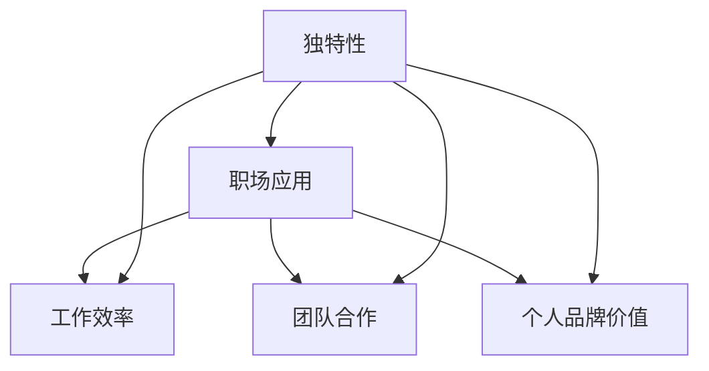

在这个流程图中，A代表独特性，B代表职场应用，C代表工作效率，D代表团队合作，E代表个人品牌价值。独特性在职场中的应用对工作效率、团队合作和个人品牌价值有着重要影响。

###### 核心算法原理讲解

为了深入理解这一概念，我们可以使用伪代码来描述一个简单的算法：

```python
# 定义独特性在职场中应用影响的函数
def impact_of_uniqueness_in_work_environment(uniqueness, work_environment):
    # 分析独特性对工作效率的影响
    efficiency_due_to_uniqueness = analyze_efficiency(uniqueness, work_environment)
    # 分析独特性对团队合作的影响
    teamwork_due_to_uniqueness = analyze_teamwork(uniqueness, work_environment)
    # 分析独特性对个人品牌价值的影响
    brand_value_due_to_uniqueness = analyze_brand_value(uniqueness, work_environment)
    # 计算总体的职场应用影响
    total_impact = efficiency_due_to_uniqueness + teamwork_due_to_uniqueness + brand_value_due_to_uniqueness
    return total_impact

# 分析独特性对工作效率的影响
def analyze_efficiency(uniqueness, work_environment):
    # 根据独特性和工作环境的匹配程度，计算影响
    if match_environment(uniqueness, work_environment):
        return 2
    else:
        return 1

# 分析独特性对团队合作的影响
def analyze_teamwork(uniqueness, work_environment):
    # 根据独特性和工作环境的互动程度，计算影响
    if interact_environment(uniqueness, work_environment):
        return 2
    else:
        return 1

# 分析独特性对个人品牌价值的影响
def analyze_brand_value(uniqueness, work_environment):
    # 根据独特性和工作环境的认可程度，计算影响
    if recognize_environment(uniqueness, work_environment):
        return 2
    else:
        return 1

# 判断独特性和工作环境的匹配程度
def match_environment(uniqueness, work_environment):
    # 根据实际情况进行判断
    return True

# 判断独特性和工作环境的互动程度
def interact_environment(uniqueness, work_environment):
    # 根据实际情况进行判断
    return True

# 判断独特性和工作环境的认可程度
def recognize_environment(uniqueness, work_environment):
    # 根据实际情况进行判断
    return True
```

在这个算法中，我们首先定义了一个`impact_of_uniqueness_in_work_environment`函数，它接收两个参数`uniqueness`（独特性）和`work_environment`（工作环境），然后通过`analyze_efficiency`、`analyze_teamwork`和`analyze_brand_value`函数分析独特性对工作效率、团队合作和个人品牌价值的影响。

###### 数学模型和公式

在数学上，我们可以用以下公式来表示独特性在职场中的应用影响：

$$ 
I = f(U, W) 
$$

其中，\( I \)代表职场应用影响，\( U \)代表独特性，\( W \)代表工作环境。

详细讲解与举例说明：

- \( I \)：职场应用影响，是独特性和工作环境共同作用的结果。
- \( U \)：独特性，是个人在特定领域或任务中的表现优势。
- \( W \)：工作环境，是个人所处的职场环境，包括企业文化、团队氛围、工作任务等。

举例：一个具备编程能力的人，通过发挥自己的编程优势，可以提高工作效率、增强团队合作，从而提升个人品牌价值。

##### 4.2 独特性在人际关系中的应用

个人闪光点在人际关系中同样具有重要作用。通过展现自己的独特性，我们可以增强人际关系中的互动、提升人际沟通的效果，从而在社交场合中更好地展现自己。

###### 核心概念与联系

为了更好地理解独特性在人际关系中的应用，我们可以用Mermaid流程图来描述：

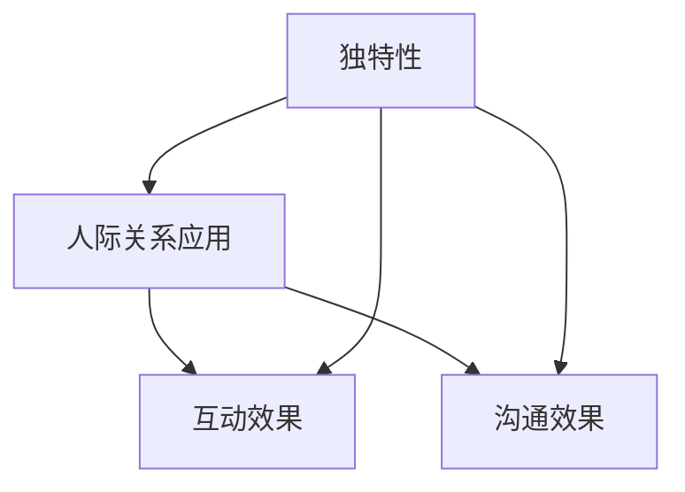

在这个流程图中，A代表独特性，B代表人际关系应用，C代表互动效果，D代表沟通效果。独特性在人际关系中的应用对互动效果和沟通效果有着重要影响。

###### 核心算法原理讲解

为了深入理解这一概念，我们可以使用伪代码来描述一个简单的算法：

```python
# 定义独特性在人际关系中应用影响的函数
def impact_of_uniqueness_in_social_relationships(uniqueness, relationships):
    # 分析独特性对互动效果的影响
    interaction_due_to_uniqueness = analyze_interaction(uniqueness, relationships)
    # 分析独特性对沟通效果的影响
    communication_due_to_uniqueness = analyze_communication(uniqueness, relationships)
    # 计算总体的社交应用影响
    total_impact = interaction_due_to_uniqueness + communication_due_to_uniqueness
    return total_impact

# 分析独特性对互动效果的影响
def analyze_interaction(uniqueness, relationships):
    # 根据独特性和人际关系的匹配程度，计算影响
    if match_relationships(uniqueness, relationships):
        return 2
    else:
        return 1

# 分析独特性对沟通效果的影响
def analyze_communication(uniqueness, relationships):
    # 根据独特性和人际关系的互动程度，计算影响
    if interact_relationships(uniqueness, relationships):
        return 2
    else:
        return 1

# 判断独特性和人际关系的匹配程度
def match_relationships(uniqueness, relationships):
    # 根据实际情况进行判断
    return True

# 判断独特性和人际关系的互动程度
def interact_relationships(uniqueness, relationships):
    # 根据实际情况进行判断
    return True
```

在这个算法中，我们首先定义了一个`impact_of_uniqueness_in_social_relationships`函数，它接收两个参数`uniqueness`（独特性）和`relationships`（人际关系），然后通过`analyze_interaction`和`analyze_communication`函数分析独特性对互动效果和沟通效果的影响。

###### 数学模型和公式

在数学上，我们可以用以下公式来表示独特性在人际关系中的应用影响：

$$ 
I = f(U, R) 
$$

其中，\( I \)代表社交应用影响，\( U \)代表独特性，\( R \)代表人际关系。

详细讲解与举例说明：

- \( I \)：社交应用影响，是独特性和人际关系共同作用的结果。
- \( U \)：独特性，是个人在特定社交场合中的表现优势。
- \( R \)：人际关系，是个人与其他人之间的互动关系。

举例：一个在社交场合中能够展现自己独特性的人，可以通过与他人的互动和沟通，提升自己在社交场合中的影响力和沟通效果。

##### 4.3 独特性在自我营销中的应用

个人闪光点在自我营销中也具有重要作用。通过合理地展现自己的独特性，我们可以提高个人品牌知名度、吸引更多的关注和机会，从而在职业生涯中取得更好的发展。

###### 核心概念与联系

为了更好地理解独特性在自我营销中的应用，我们可以用Mermaid流程图来描述：

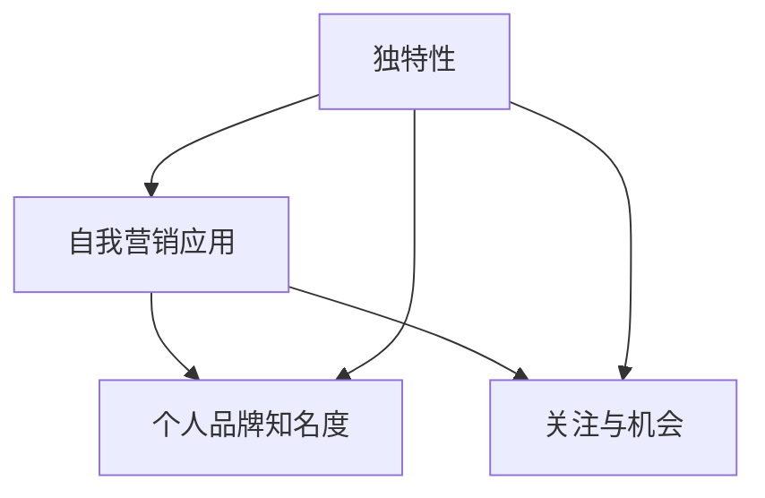

在这个流程图中，A代表独特性，B代表自我营销应用，C代表个人品牌知名度，D代表关注与机会。独特性在自我营销中的应用对个人品牌知名度、关注与机会有着重要影响。

###### 核心算法原理讲解

为了深入理解这一概念，我们可以使用伪代码来描述一个简单的算法：

```python
# 定义独特性在自我营销中应用影响的函数
def impact_of_uniqueness_in_self_marketing(uniqueness, marketing):
    # 分析独特性对个人品牌知名度的影响
    brand_knowledge_due_to_uniqueness = analyze_brand_knowledge(uniqueness, marketing)
    # 分析独特性对关注与机会的影响
    attention_and_opportunities_due_to_uniqueness = analyze_attention_and_opportunities(uniqueness, marketing)
    # 计算总体的自我营销应用影响
    total_impact = brand_knowledge_due_to_uniqueness + attention_and_opportunities_due_to_uniqueness
    return total_impact

# 分析独特性对个人品牌知名度的影响
def analyze_brand_knowledge(uniqueness, marketing):
    # 根据独特性和自我营销的匹配程度，计算影响
    if match_marketing(uniqueness, marketing):
        return 2
    else:
        return 1

# 分析独特性对关注与机会的影响
def analyze_attention_and_opportunities(uniqueness, marketing):
    # 根据独特性和自我营销的互动程度，计算影响
    if interact_marketing(uniqueness, marketing):
        return 2
    else:
        return 1

# 判断独特性和自我营销的匹配程度
def match_marketing(uniqueness, marketing):
    # 根据实际情况进行判断
    return True

# 判断独特性和自我营销的互动程度
def interact_marketing(uniqueness, marketing):
    # 根据实际情况进行判断
    return True
```

在这个算法中，我们首先定义了一个`impact_of_uniqueness_in_self_marketing`函数，它接收两个参数`uniqueness`（独特性）和`marketing`（自我营销），然后通过`analyze_brand_knowledge`和`analyze_attention_and_opportunities`函数分析独特性对个人品牌知名度、关注与机会的影响。

###### 数学模型和公式

在数学上，我们可以用以下公式来表示独特性在自我营销中的应用影响：

$$ 
I = f(U, M) 
$$

其中，\( I \)代表自我营销应用影响，\( U \)代表独特性，\( M \)代表自我营销。

详细讲解与举例说明：

- \( I \)：自我营销应用影响，是独特性和自我营销共同作用的结果。
- \( U \)：独特性，是个人在特定自我营销场合中的表现优势。
- \( M \)：自我营销，是个人通过各种方式提升个人品牌知名度、吸引关注和机会的过程。

举例：一个在自我营销中能够展现自己独特性的人，可以通过各种渠道提升个人品牌知名度，从而吸引更多的关注和机会。

#### 第5章：个人成长与独特性的发展

##### 5.1 持续学习与自我完善

个人成长是发掘和提升个人独特性的关键。持续学习与自我完善，可以帮助我们在不断变化的环境中保持竞争力，实现个人价值的最大化。

###### 核心概念与联系

为了更好地理解持续学习与自我完善的重要性，我们可以用Mermaid流程图来描述：

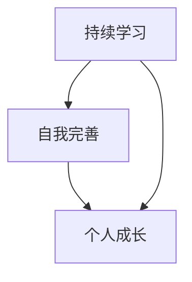

在这个流程图中，A代表持续学习，B代表自我完善，C代表个人成长。持续学习与自我完善对个人成长有着重要影响。

###### 核心算法原理讲解

为了深入理解这一概念，我们可以使用伪代码来描述一个简单的算法：

```python
# 定义持续学习与自我完善影响个人成长的函数
def impact_of_continuous_learning_and_self_improvement_on_growth(learning, improvement):
    # 分析持续学习对个人成长的影响
    growth_due_to_learning = analyze_learning(learning)
    # 分析自我完善对个人成长的影响
    growth_due_to_improvement = analyze_improvement(improvement)
    # 计算总体的个人成长影响
    total_growth = growth_due_to_learning + growth_due_to_improvement
    return total_growth

# 分析持续学习对个人成长的影响
def analyze_learning(learning):
    # 根据持续学习的程度，计算影响
    if learning > 5:
        return 2
    elif learning > 2:
        return 1
    else:
        return 0

# 分析自我完善对个人成长的影响
def analyze_improvement(improvement):
    # 根据自我完善的程度，计算影响
    if improvement > 5:
        return 2
    elif improvement > 2:
        return 1
    else:
        return 0
```

在这个算法中，我们首先定义了一个`impact_of_continuous_learning_and_self_improvement_on_growth`函数，它接收两个参数`learning`（学习）和`improvement`（完善），然后通过`analyze_learning`和`analyze_improvement`函数分析持续学习与自我完善对个人成长的影响。

###### 数学模型和公式

在数学上，我们可以用以下公式来表示持续学习与自我完善对个人成长的影响：

$$ 
G = f(L, I) 
$$

其中，\( G \)代表个人成长，\( L \)代表持续学习，\( I \)代表自我完善。

详细讲解与举例说明：

- \( G \)：个人成长，是持续学习和自我完善共同作用的结果。
- \( L \)：持续学习，是个人通过不断获取新知识和技能来提升自己的过程。
- \( I \)：自我完善，是个人通过不断反思和改进自己的行为和思维方式来提升自己的过程。

举例：一个持续学习并自我完善的人，能够在不断变化的环境中保持竞争力，实现个人价值的最大化。

##### 5.2 跨界思维与多元发展

跨界思维与多元发展是发掘和提升个人独特性的重要策略。通过跨界思维，我们可以将不同领域的知识、技能和经验进行整合，从而创造出新的独特价值。而通过多元发展，我们可以拓展自己的视野和思维方式，提高自身的竞争力。

###### 核心概念与联系

为了更好地理解跨界思维与多元发展的重要性，我们可以用Mermaid流程图来描述：

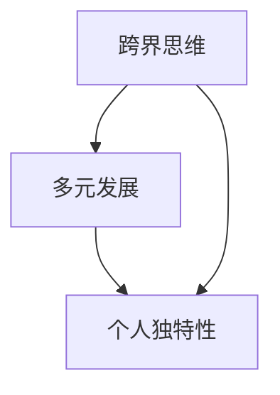

在这个流程图中，A代表跨界思维，B代表多元发展，C代表个人独特性。跨界思维与多元发展对个人独特性有着重要影响。

###### 核心算法原理讲解

为了深入理解这一概念，我们可以使用伪代码来描述一个简单的算法：

```python
# 定义跨界思维与多元发展影响个人独特性的函数
def impact_of_cross_domain_thinking_and_diversified_growth(thinking, growth):
    # 分析跨界思维对个人独特性的影响
    uniqueness_due_to_thinking = analyze_thinking(thinking)
    # 分析多元发展对个人独特性的影响
    uniqueness_due_to_growth = analyze_growth(growth)
    # 计算总体的个人独特性影响
    total_uniqueness = uniqueness_due_to_thinking + uniqueness_due_to_growth
    return total_uniqueness

# 分析跨界思维对个人独特性的影响
def analyze_thinking(thinking):
    # 根据跨界思维的广度，计算影响
    if thinking > 5:
        return 2
    elif thinking > 2:
        return 1
    else:
        return 0

# 分析多元发展对个人独特性的影响
def analyze_growth(growth):
    # 根据多元发展的深度，计算影响
    if growth > 5:
        return 2
    elif growth > 2:
        return 1
    else:
        return 0
```

在这个算法中，我们首先定义了一个`impact_of_cross_domain_thinking_and_diversified_growth`函数，它接收两个参数`thinking`（思维）和`growth`（发展），然后通过`analyze_thinking`和`analyze_growth`函数分析跨界思维与多元发展对个人独特性的影响。

###### 数学模型和公式

在数学上，我们可以用以下公式来表示跨界思维与多元发展对个人独特性的影响：

$$ 
U = f(T, G) 
$$

其中，\( U \)代表个人独特性，\( T \)代表跨界思维，\( G \)代表多元发展。

详细讲解与举例说明：

- \( U \)：个人独特性，是跨界思维和多元发展共同作用的结果。
- \( T \)：跨界思维，是个人在不同领域之间进行知识整合和创新思考的能力。
- \( G \)：多元发展，是个人在多个领域进行深入学习和实践的过程。

举例：一个具备跨界思维的人，能够将不同领域的知识进行整合，创造出新的独特价值。而一个进行多元发展的人，能够在多个领域深入学习和实践，提高自身的竞争力。

##### 5.3 个人品牌的建立与维护

个人品牌的建立与维护是发掘和提升个人独特性的重要手段。通过建立和维护个人品牌，我们可以提高个人知名度、吸引更多机会，从而在职业生涯中取得更好的发展。

###### 核心概念与联系

为了更好地理解个人品牌的建立与维护的重要性，我们可以用Mermaid流程图来描述：

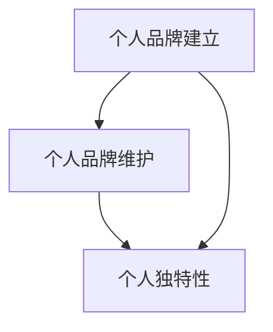

在这个流程图中，A代表个人品牌建立，B代表个人品牌维护，C代表个人独特性。个人品牌建立与维护对个人独特性有着重要影响。

###### 核心算法原理讲解

为了深入理解这一概念，我们可以使用伪代码来描述一个简单的算法：

```python
# 定义个人品牌建立与维护影响个人独特性的函数
def impact_of_personal_brand_establishment_and_maintenance_on_uniqueness(brand_establishment, brand_maintenance):
    # 分析个人品牌建立对个人独特性的影响
    uniqueness_due_to_establishment = analyze_establishment(brand_establishment)
    # 分析个人品牌维护对个人独特性的影响
    uniqueness_due_to_maintenance = analyze_maintenance(brand_maintenance)
    # 计算总体的个人独特性影响
    total_uniqueness = uniqueness_due_to_establishment + uniqueness_due_to_maintenance
    return total_uniqueness

# 分析个人品牌建立对个人独特性的影响
def analyze_establishment(brand_establishment):
    # 根据个人品牌建立的知名度，计算影响
    if brand_establishment > 5:
        return 2
    elif brand_establishment > 2:
        return 1
    else:
        return 0

# 分析个人品牌维护对个人独特性的影响
def analyze_maintenance(brand_maintenance):
    # 根据个人品牌维护的稳定性，计算影响
    if brand_maintenance > 5:
        return 2
    elif brand_maintenance > 2:
        return 1
    else:
        return 0
```

在这个算法中，我们首先定义了一个`impact_of_personal_brand_establishment_and_maintenance_on_uniqueness`函数，它接收两个参数`brand_establishment`（建立）和`brand_maintenance`（维护），然后通过`analyze_establishment`和`analyze_maintenance`函数分析个人品牌建立与维护对个人独特性的影响。

###### 数学模型和公式

在数学上，我们可以用以下公式来表示个人品牌建立与维护对个人独特性的影响：

$$ 
U = f(BE, BM) 
$$

其中，\( U \)代表个人独特性，\( BE \)代表个人品牌建立，\( BM \)代表个人品牌维护。

详细讲解与举例说明：

- \( U \)：个人独特性，是个人品牌建立和维护共同作用的结果。
- \( BE \)：个人品牌建立，是个人通过各种方式提高知名度、塑造形象的过程。
- \( BM \)：个人品牌维护，是个人通过持续的努力和表现，保持和提升个人品牌价值的过程。

举例：一个成功建立个人品牌的人，通过持续的表现和努力，保持和提升个人品牌价值，从而在职业生涯中取得更好的发展。

### 第二部分：实际操作与案例分享

#### 第6章：个人闪光点的发现与塑造

##### 6.1 案例分析：如何发现个人闪光点

要发现个人闪光点，首先要了解自己的兴趣、能力和价值观。以下是一个案例分析，让我们看看如何通过具体步骤来发现个人闪光点。

###### 案例背景

小李是一名软件工程师，工作多年后，他开始思考如何进一步提升自己的职业发展。

###### 发现个人闪光点的步骤

1. **自我反思**：

   小李开始回顾自己的工作经历，思考自己在哪些任务上表现优秀，哪些技能和经验是他最具优势的。他发现自己在解决复杂问题时，思路清晰，能够快速找到解决方案。

2. **寻求反馈**：

   小李向同事和上级请教，了解他们对他在工作中的评价。他们反馈说，小李在团队合作中，总是能够提出有建设性的意见，帮助团队解决问题。

3. **兴趣探索**：

   小李还花时间了解自己的兴趣所在。他发现自己对人工智能领域充满热情，并通过在线课程和阅读相关书籍，不断拓展自己的知识。

4. **价值观梳理**：

   小李思考自己的价值观，认为他对工作充满热情，喜欢帮助他人，追求团队合作和共同进步。

基于这些分析，小李发现他的个人闪光点在于：

- **解决问题能力**：能够在复杂情况下快速找到解决方案。
- **团队合作**：能够提出有建设性的意见，推动团队进步。
- **对人工智能的热情**：对人工智能领域充满兴趣，愿意投入时间和精力学习。
- **积极价值观**：喜欢帮助他人，追求团队合作和共同进步。

###### 案例小结

通过自我反思、寻求反馈、兴趣探索和价值观梳理，小李成功发现了自己的个人闪光点。这些闪光点不仅帮助他在职场中脱颖而出，也为他的职业发展提供了明确的方向。

##### 6.2 实操指南：如何塑造个人闪光点

发现个人闪光点只是第一步，塑造和提升这些闪光点同样重要。以下是一些实操指南，帮助你在日常生活中塑造和提升个人闪光点。

###### 1. 明确目标

确定你想要塑造和提升的闪光点，并将其具体化。例如，如果你希望提升解决问题能力，可以将目标设定为“每周解决至少一个复杂问题”。

###### 2. 制定计划

根据你的目标，制定具体的行动计划。例如，你可以参加相关课程、阅读相关书籍，或者加入专业社群，与他人交流学习。

###### 3. 持续实践

将计划付诸实践，并持续进行。例如，每周花几个小时解决复杂问题，或者定期阅读人工智能领域的书籍。

###### 4. 反馈与调整

在实践过程中，不断收集反馈，并根据反馈调整你的计划。例如，如果你发现自己在解决问题时，逻辑思维不够清晰，可以尝试参加逻辑思维训练课程。

###### 5. 保持动力

保持对目标的热情和动力。你可以设定奖励机制，例如在达到某个目标时，给自己一个奖励，以保持动力。

##### 6.3 反思与调整：塑造过程中的难点与对策

在塑造个人闪光点的过程中，难免会遇到一些难点。以下是一些常见的难点和对应的对策：

###### 1. 缺乏动力

对策：设定明确的目标和奖励机制，以保持对目标的热情。

###### 2. 时间不足

对策：合理安排时间，确保有足够的时间用于塑造个人闪光点。

###### 3. 缺乏专业知识

对策：参加相关课程或培训，拓展自己的专业知识。

###### 4. 遇到困难

对策：保持积极的心态，寻求帮助，与他人交流和分享经验。

###### 5. 缺乏持续动力

对策：定期回顾自己的目标和进度，调整计划，保持动力。

##### 6.4 案例分析：如何塑造个人闪光点

张先生是一名软件工程师，他发现自己在沟通能力方面有所欠缺。为了提升这一能力，他采取了以下措施：

1. **设定目标**：张先生设定了一个目标，即“每周至少参加一次线上或线下交流活动，提升自己的沟通能力”。

2. **制定计划**：他制定了详细的计划，包括参加的技术会议、社区活动、线上讨论等，并确保有足够的时间参加。

3. **持续实践**：张先生积极参与各种交流活动，主动发言，与他人交流经验，不断锻炼自己的沟通能力。

4. **反馈与调整**：他定期收集他人的反馈，了解自己的沟通方式是否有效，并根据反馈进行调整。

5. **保持动力**：张先生设定了一个奖励机制，即每提升一个阶段，就给自己一个小奖励，以保持动力。

经过一段时间的努力，张先生的沟通能力得到了显著提升。他不仅能够更加流畅地表达自己的观点，还能够在团队中发挥更好的作用。

##### 6.5 案例小结

通过案例分析，我们可以看到，塑造个人闪光点需要明确目标、制定计划、持续实践、反馈与调整，以及保持动力。这些方法可以帮助我们在日常生活中不断提升自己的闪光点，从而在职场和生活中取得更好的发展。

### 第7章：个人闪光点的传播与影响

#### 7.1 个人故事的力量

个人故事是传播个人闪光点的重要手段。一个生动、真实的故事，可以有效地传递个人的独特价值和优势，从而在职场和社交场合中提升个人影响力。

##### 7.1.1 如何构建个人故事

构建个人故事的关键在于找到自己的独特经历和成就。以下是一些步骤：

1. **自我反思**：回顾自己的经历，找出那些具有转折点或者具有重要意义的时刻。

2. **明确主题**：确定故事的主题，如个人成长、克服困难、创新思维等。

3. **结构规划**：将故事分为引入、冲突、解决方案和结尾四个部分，确保故事有清晰的结构。

4. **细节描绘**：通过具体的细节和情节，让故事更加生动、真实。

5. **情感表达**：在故事中表达自己的情感，让听众产生共鸣。

##### 7.1.2 个人故事的应用场景

个人故事可以应用于多种场景，如：

- **求职面试**：通过讲述自己的故事，展示个人能力和独特价值。
- **职场演讲**：分享自己的故事，提升演讲的吸引力和说服力。
- **社交场合**：与他人交流时，通过故事展示自己的独特性和人格魅力。

##### 7.1.3 个人故事的传播策略

要有效地传播个人故事，可以采用以下策略：

1. **利用社交媒体**：在LinkedIn、Twitter、Facebook等社交媒体平台上分享自己的故事。
2. **撰写博客**：在个人博客或技术社区上发表文章，详细讲述自己的故事和经验。
3. **参与论坛和活动**：在行业论坛和活动中分享自己的故事，扩大影响力。

##### 7.2 网络传播的策略

在网络传播个人闪光点时，可以采用以下策略：

1. **内容优化**：确保内容具有吸引力和可读性，使用图片、视频等多媒体元素，提高内容的传播力。
2. **关键词优化**：使用相关关键词，提高内容在搜索引擎中的排名，增加曝光度。
3. **社交媒体推广**：利用社交媒体平台的推广功能，增加内容的曝光度。
4. **合作推广**：与其他个人或组织合作，共同推广内容，扩大影响力。

##### 7.3 个人影响力评估与提升

个人影响力可以通过以下指标进行评估：

1. **关注者数量**：在社交媒体上的关注者数量，反映了个人在网络上的影响力。
2. **转发和点赞**：内容的转发和点赞数量，反映了内容的受欢迎程度。
3. **评论互动**：在社交媒体上的评论互动，反映了个人与听众的互动情况。
4. **职场成就**：在职场中的成就，如晋升、获奖等，反映了个人在专业领域的影响力。

要提升个人影响力，可以采取以下措施：

1. **持续产出优质内容**：不断输出有价值的内容，提升个人在专业领域的影响力。
2. **积极参与行业活动**：参与行业论坛、研讨会等活动，扩大自己的专业圈子。
3. **建立个人品牌**：通过故事和形象，建立独特的个人品牌，提高个人知名度。
4. **提升沟通能力**：提高沟通能力，增强与他人的互动，提升个人影响力。

### 第8章：个人闪光点的持续发展

#### 8.1 持续创新与成长

个人闪光点的持续发展离不开持续创新和成长。在快速变化的职场环境中，只有不断学习和进步，才能保持个人竞争力。

##### 8.1.1 创新的重要性

创新是推动个人成长和职业发展的重要动力。通过创新，我们可以：

- **解决新问题**：面对新问题，能够找到新的解决方案。
- **开拓新领域**：发现新的领域和市场，开拓新的机会。
- **提升个人价值**：通过创新，提升自己在职场中的独特性和价值。

##### 8.1.2 持续创新的方法

要实现持续创新，可以采取以下方法：

1. **学习新知识**：不断学习新知识，了解行业发展趋势。
2. **跨学科学习**：跨学科学习，拓展自己的视野和思维方式。
3. **实践经验**：通过实践，将理论知识转化为实际能力。
4. **团队合作**：与他人合作，共同探索新的解决方案。

##### 8.2 独特性与社会责任的平衡

个人闪光点的持续发展需要在独特性与社会责任之间寻找平衡。独特性是个人的优势，但社会责任同样重要。

##### 8.2.1 独特性与社会责任的联系

独特性和社会责任是相辅相成的。通过发挥个人独特性，我们可以：

- **更好地解决社会问题**：利用个人独特性，找到解决社会问题的有效方法。
- **推动社会进步**：通过创新和努力，推动社会的发展和进步。

##### 8.2.2 平衡独特性与社会责任的策略

要在独特性与社会责任之间找到平衡，可以采取以下策略：

1. **关注社会需求**：关注社会需求，将个人独特性与解决社会问题相结合。
2. **参与社会活动**：积极参与社会活动，贡献个人力量。
3. **持续反思**：定期反思自己的行为和决策，确保个人独特性与社会责任相一致。
4. **团队合作**：与他人合作，共同实现社会价值。

##### 8.3 个人闪光点的传承与影响

个人闪光点的传承与影响，是个人职业生涯的重要组成部分。通过以下方式，我们可以将个人闪光点传承下去，并对其产生深远的影响：

1. **培养下一代**：通过教学、培训和指导，培养下一代专业人士，传承个人经验和独特性。
2. **撰写专业著作**：撰写专业书籍和文章，分享自己的知识和经验，对行业产生深远影响。
3. **积极参与社区建设**：参与技术社区和行业组织的建设，为行业的发展贡献力量。
4. **树立榜样**：通过自己的言行，树立榜样，激励他人追求卓越。

通过持续创新与成长、平衡独特性与社会责任，以及传承与影响，我们可以不断提升个人闪光点，实现个人职业生涯的长期发展。

### 第9章：结语

在平凡中彰显独特，是每个人都可以追求的目标。通过发掘和提升个人闪光点，我们不仅能够提升自己的职场竞争力，还能在社交场合中展现独特的魅力。同时，个人闪光点的持续发展，也是实现个人价值和社会责任的重要途径。

展望未来，随着科技的不断进步和社会的发展，个人闪光点将变得越来越重要。我们每个人都应该积极发掘自己的闪光点，通过持续学习和创新，不断提升自己的独特性。同时，我们也要关注社会责任，将个人闪光点与社会需求相结合，为实现社会进步贡献自己的力量。

让我们在平凡中创造更多独特，用自己的闪光点照亮前行的道路。无论身处何种环境，我们都能够在平凡中闪耀出独特的光芒，成为社会进步的推动者。未来，让我们携手共进，共同书写属于我们的精彩篇章。

