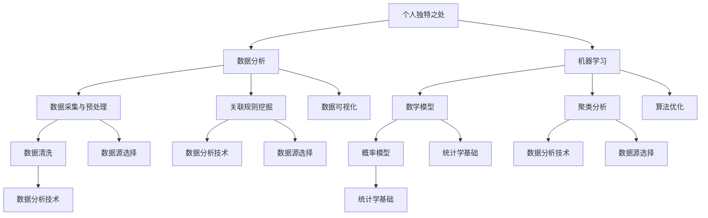

                 

### 文章标题

在平凡中闪耀：发掘个人独特之处

---

**关键词：** 个人独特之处、数据分析、机器学习、数学模型、项目实战

**摘要：** 本文旨在探讨如何通过数据分析、机器学习和数学模型等手段，发掘并凸显个人的独特之处。通过逐步分析推理，本文将展示一个系统的方法论，帮助读者理解并应用这些方法，最终在平凡的日常中找到自己的亮点和优势。

---

### 引言

在数字化和智能化的时代，人们越来越认识到个人独特之处的重要性。无论是在职场竞争、社交互动，还是在个人成长过程中，发掘并凸显自己的独特之处都显得尤为关键。然而，如何具体实施这一过程，却常常让人感到困惑和迷茫。

本文将从以下几个方面展开讨论：

1. **核心概念与联系**：介绍与发掘个人独特之处相关的基本概念，包括个人独特之处、数据分析、机器学习等。
2. **核心算法原理讲解**：详细阐述用于发掘个人独特之处的方法和算法，包括数据采集与预处理、数据分析技术、机器学习算法等。
3. **数学模型和数学公式**：描述用于理解和分析个人独特之处的基本数学模型，并给出解释。
4. **项目实战**：通过实际案例，展示如何应用这些概念、算法和模型来发掘个人独特之处。
5. **总结与展望**：总结全文，并对未来个人独特之处发掘的发展进行展望。

本文的目标是通过逻辑清晰、结构紧凑、简单易懂的专业技术语言，帮助读者理解并掌握发掘个人独特之处的方法和技巧，从而在平凡的日常中闪耀出独特的光芒。

### 核心概念与联系

在探讨如何发掘个人独特之处之前，我们首先需要明确一些核心概念，并理解它们之间的联系。以下是一些关键概念及其关系架构，我们将使用Mermaid流程图来展示这些概念之间的交互关系。



**个人独特之处**：这是指个体在知识、技能、经验、性格等方面的与众不同之处，是个人在特定环境或领域中脱颖而出的关键因素。

**数据分析**：这是指利用统计学、计算机科学等方法，从大量数据中提取有用信息和知识的过程。数据分析在发掘个人独特之处中起到了核心作用，通过分析个体在不同情境下的表现，我们可以发现其独特之处。

**数据采集与预处理**：数据采集是指收集个体在不同情境下的数据，如行为数据、社交数据、绩效数据等。预处理则是对这些数据进行清洗、转换和归一化等操作，以确保数据的准确性和一致性。

**机器学习**：这是指通过训练模型来从数据中学习规律和模式，以实现对未知数据的预测和分类。机器学习在发掘个人独特之处中，可以帮助我们通过分析个体在不同情境下的数据，识别出其独特的特征和行为模式。

**数学模型**：这是指用于描述和解释个人独特之处的方法和工具，如概率模型、聚类分析模型、关联规则挖掘模型等。这些模型可以帮助我们量化个人独特之处，并对其进行深入分析。

通过上述流程图，我们可以清晰地看到各个概念之间的联系和作用。接下来，我们将分别详细探讨这些概念，并解释它们在发掘个人独特之处中的应用。

#### 个人独特之处的定义与重要性

**个人独特之处**是一个多维度的概念，它涵盖了个体在知识、技能、经验、性格等多方面独特的特质。这些特质可能是个体在特定领域或情境中脱颖而出的关键因素。例如，一个人可能拥有卓越的编程能力、出色的领导力、独特的创新思维，或者在某一专业技能上具有深厚的基础和丰富的经验。

**个人独特之处的重要性**体现在以下几个方面：

1. **职场竞争力**：在竞争激烈的职场环境中，个人独特之处成为区分优秀员工与一般员工的重要标准。那些拥有独特技能或经验的人往往能够更好地适应多样化的工作需求，并在团队合作和创新项目中发挥重要作用。

2. **个人成长**：发掘和培养个人独特之处有助于个体实现自我提升和职业发展。通过不断地学习和实践，个人可以在其独特的领域不断精进，从而实现自我价值的最大化。

3. **人际关系**：个人独特之处也影响着个体在社交场合中的表现和人际关系。拥有独特性格或爱好的人往往能够吸引志同道合的朋友，并在社交互动中展现自己的个性魅力。

4. **心理健康**：发现自己的独特之处，能够增强个人的自信心和自尊心。当个体意识到自己的与众不同之处时，他们会更加珍惜自己的价值，从而有利于心理健康的维护。

个人独特之处与个人成长密切相关。个人的成长不仅依赖于外部的环境和机遇，更重要的是内在的自我认知和自我驱动。通过不断地反思和实践，个体可以逐步挖掘和塑造自己的独特之处，从而在职业和生活中取得成功。

在接下来的内容中，我们将详细探讨如何通过数据分析、机器学习和数学模型等方法，来具体发掘和凸显个人独特之处。这些方法不仅有助于个体在职场和社交中脱颖而出，也为个人的成长提供了有力的工具和支持。

#### 发掘个人独特之处的方法论

要发掘个人独特之处，我们需要采用一系列科学的方法和步骤。以下是一个系统的方法论，涵盖数据采集、数据分析、机器学习等关键环节，帮助读者理解并应用这些方法。

**1. 数据采集与预处理**

数据采集是整个过程中至关重要的一步。我们需要收集个体在不同情境下的数据，如工作表现、社交互动、学习经历等。这些数据可以从各种来源获取，如数据库、问卷调查、社交媒体等。

**数据预处理**包括以下几个步骤：

- **数据清洗**：清洗数据是为了去除重复记录、错误记录和不完整记录，确保数据的准确性和一致性。
- **数据转换**：将不同格式的数据转换为统一的格式，如将文本数据转换为数值数据，以便后续分析。
- **数据归一化**：对数据进行归一化处理，使其在同一尺度上进行比较，减少不同变量之间的差异。

**2. 数据分析技术**

数据分析是发掘个人独特之处的核心环节。以下是一些常见的数据分析技术：

- **描述性统计分析**：通过计算数据的均值、中位数、标准差等统计量，对数据进行初步描述，了解数据的基本特征。
- **关联规则挖掘**：通过关联规则挖掘算法（如Apriori算法），识别数据之间的潜在关联，发现个体行为或特征之间的关系。
- **聚类分析**：通过聚类算法（如K-means聚类），将数据划分为不同的群体，识别具有相似特征的数据点，从而发现个体之间的异同。
- **数据可视化**：利用图表、图像等可视化工具，将数据以直观的方式呈现出来，帮助理解数据分布和趋势。

**3. 机器学习算法**

机器学习算法在个人独特之处发掘中发挥着重要作用。以下是一些常用的机器学习算法：

- **分类算法**：通过分类算法（如决策树、支持向量机、神经网络），对个体进行分类，识别出具有特定特征或行为的个体。
- **聚类算法**：除了用于数据分析中的聚类分析外，聚类算法还可以用于机器学习中的无监督学习，发现数据中的隐含结构。
- **回归算法**：通过回归算法（如线性回归、决策树回归），预测个体的某个特征或行为，从而帮助识别个人独特之处。

**4. 综合运用多种方法**

在实际应用中，我们可以综合运用上述方法，形成一个系统化的流程：

- **数据采集**：首先，明确需要采集的数据类型和来源，制定相应的数据采集策略。
- **数据预处理**：对采集到的数据进行分析和清洗，确保数据质量。
- **数据分析**：运用描述性统计分析、关联规则挖掘、聚类分析等技术，对数据进行分析，初步识别个人独特之处。
- **机器学习**：结合具体问题和需求，选择合适的机器学习算法进行模型训练和预测，进一步挖掘个人独特之处。

通过这一系统的方法论，我们可以全面、深入地发掘个人独特之处，为个体在职业和生活中的发展提供有力支持。

#### 个人独特之处分析的基本数学模型

在分析个人独特之处时，数学模型提供了量化和分析的工具。以下介绍几种常用的数学模型，并解释其在发掘个人独特之处中的应用。

**1. 聚类分析模型**

聚类分析是一种无监督学习方法，用于将数据点分为不同的集群，使同一集群内的数据点彼此相似，而不同集群的数据点之间差异较大。常见的聚类算法包括K-means、层次聚类等。

- **K-means聚类**：K-means算法通过迭代过程将数据点分为K个集群，其中K为预定的集群数。算法的目标是使每个数据点到其所属集群中心点的距离之和最小。

伪代码：
```python
# 初始化集群中心点
centroids = InitializeCentroids(data, K)

# 迭代计算
while not converged:
    # 为每个数据点分配最近的集群中心点
    clusters = AssignClusters(data, centroids)
    # 更新集群中心点
    centroids = UpdateCentroids(data, clusters)
    # 检查收敛条件
    if CheckConvergence(centroids, prev_centroids):
        break

# 输出聚类结果
output_clusters = clusters
```

- **层次聚类**：层次聚类通过逐步合并或分裂现有的集群，形成一棵层次树，从而实现数据的层次结构聚类。

应用场景：通过聚类分析，我们可以识别出在相同或相似特征上的群体，从而发现个人在某些方面的独特性。

**2. 关联规则挖掘模型**

关联规则挖掘是一种用于发现数据中项之间的关联关系的方法。常用的算法包括Apriori算法和FP-growth算法。

- **Apriori算法**：Apriori算法通过频繁项集生成关联规则，频繁项集是指在支持度大于最小支持度的交易中，同时出现的项的组合。

伪代码：
```python
# 计算频繁项集
frequent_itemsets = FindFrequentItemsets(data, min_support)

# 生成关联规则
rules = GenerateRules(frequent_itemsets, min_confidence)

# 输出关联规则
output_rules = rules
```

- **FP-growth算法**：FP-growth算法通过构建FP树来高效挖掘频繁项集，减少了计算频繁项集的数据库扫描次数。

应用场景：关联规则挖掘可以帮助我们识别个体在不同情境下的行为模式，从而揭示个人的独特之处。

**3. 概率模型**

概率模型用于描述个体在特定情境下的行为概率，常见的概率模型包括贝叶斯网络和朴素贝叶斯分类器。

- **贝叶斯网络**：贝叶斯网络是一种概率图模型，用于表示多个随机变量之间的条件依赖关系。它通过条件概率表（CP表）来计算变量之间的概率。

伪代码：
```python
# 给定贝叶斯网络结构和训练数据
network = LoadBayesianNetwork()

# 计算后验概率
posterior_probabilities = Inference(network, evidence)

# 输出后验概率
output_probabilities = posterior_probabilities
```

- **朴素贝叶斯分类器**：朴素贝叶斯分类器是一种基于贝叶斯定理的简单概率分类器，假设特征之间相互独立。

应用场景：概率模型可以帮助我们预测个体在特定情境下的行为，从而识别个人的独特特征。

**示例说明**

假设我们有一个数据集，记录了个体在不同情境下的表现，如工作业绩、团队合作能力、创新能力等。我们使用K-means聚类算法将这些个体分为不同的集群，并通过关联规则挖掘发现这些集群之间的行为模式。

通过上述数学模型的应用，我们可以量化地分析个人独特之处，识别出在不同情境下表现突出的个体特征。例如，某个个体可能在团队合作能力上表现出色，而在创新能力上则相对较弱。这种分析不仅帮助我们了解个体在特定领域的独特之处，也为个体的进一步发展提供了指导。

通过运用这些数学模型，我们可以从复杂的数据中提取有用的信息，从而更全面、深入地发掘个人独特之处。这不仅对个人的职业发展有重要意义，也为组织在人力资源管理等方面提供了有力支持。

#### 个人独特之处发掘的实际应用

为了更好地理解如何在实际项目中应用上述核心概念、算法和数学模型，我们将通过一个具体的案例分析，详细描述项目的背景、目标、实现步骤和结果分析。

**项目背景**

本项目旨在通过数据分析技术，帮助一家初创公司在招聘过程中发掘并选择具有独特技能和潜力的候选人。公司希望利用数据驱动的决策方法，优化招聘流程，提高员工素质，从而提升公司整体竞争力。

**项目目标**

- 收集和分析候选人的行为数据，如简历信息、面试表现、社交媒体活动等。
- 使用机器学习和数学模型，识别候选人在不同技能和特质上的表现，发掘其独特之处。
- 建立一个预测模型，预测候选人在未来工作表现中的潜在价值。

**实现步骤**

1. **数据采集与预处理**

   首先，我们收集了以下数据：

   - **简历数据**：包括教育背景、工作经历、专业技能等。
   - **面试数据**：包括面试官的评价、面试问题与回答等。
   - **社交媒体数据**：包括候选人在LinkedIn、GitHub等平台上的活动。

   **数据预处理**步骤包括：

   - **数据清洗**：去除重复和错误的数据记录，保证数据质量。
   - **数据转换**：将非结构化数据（如文本）转换为结构化数据（如数值），以便后续分析。
   - **数据归一化**：对数据进行标准化处理，使其在同一尺度上进行比较。

2. **数据分析与特征提取**

   使用描述性统计分析和关联规则挖掘，我们对数据进行了初步分析，提取了以下特征：

   - **教育背景特征**：如学历、专业、毕业院校等。
   - **工作经验特征**：如工作年限、公司规模、岗位类型等。
   - **面试表现特征**：如面试评分、回答问题的准确性等。
   - **社交媒体特征**：如GitHub贡献度、LinkedIn互动数等。

3. **机器学习模型训练**

   为了预测候选人在未来工作表现中的潜力，我们采用了以下机器学习算法：

   - **分类算法**：如随机森林、支持向量机（SVM），用于将候选人分类为高潜力或一般潜力。
   - **聚类算法**：如K-means，用于将候选人分为不同的群体，以便更细致地分析其特征。
   - **回归算法**：如线性回归，用于预测候选人在特定技能上的得分。

   伪代码：
   ```python
   # 训练随机森林模型
   model = RandomForestClassifier()
   model.fit(X_train, y_train)

   # 预测候选人的潜力
   predictions = model.predict(X_test)

   # 训练K-means模型
   kmeans = KMeans(n_clusters=3)
   kmeans.fit(X_train)

   # 聚类结果
   clusters = kmeans.predict(X_test)

   # 线性回归模型
   reg = LinearRegression()
   reg.fit(X_train, y_train)

   # 预测特定技能得分
   skill_scores = reg.predict(X_test)
   ```

4. **结果分析**

   通过上述分析，我们得到了以下结果：

   - **候选人分类结果**：预测出哪些候选人具有高潜力，哪些候选人表现一般。
   - **聚类结果**：将候选人分为不同的群体，每个群体具有不同的特征和潜力。
   - **技能得分预测**：预测候选人在特定技能上的得分，帮助公司针对性地进行培训和发展。

   分析结果不仅帮助公司在招聘过程中更加科学地选择候选人，也为公司的人力资源管理提供了宝贵的数据支持。

**项目小结**

本项目通过数据分析、机器学习和数学模型，成功地实现了对候选人个人独特之处的发掘和预测。这一过程不仅提高了公司招聘的准确性，也为公司的人才培养和发展提供了有力支持。未来，我们还可以继续优化模型，引入更多数据源，以进一步提升预测的精度和实用性。

#### 总结与未来展望

本文系统地探讨了如何通过数据分析、机器学习和数学模型等方法，发掘并凸显个人独特之处。通过详细阐述核心概念、算法原理、数学模型和实际项目案例，我们展示了如何将理论知识应用于实际场景，从而帮助个体在平凡中闪耀出独特的光芒。

**总结**：

1. **核心概念**：我们明确了个人独特之处、数据分析、机器学习和数学模型等基本概念，并解释了它们之间的联系。
2. **方法**：我们提出了一个系统的方法论，包括数据采集与预处理、数据分析技术、机器学习算法等，帮助读者理解如何具体实施这些方法。
3. **数学模型**：我们介绍了聚类分析模型、关联规则挖掘模型和概率模型等，并提供了具体的伪代码和解释，以帮助读者理解这些模型在实际中的应用。
4. **实战**：我们通过一个实际项目案例，展示了如何将上述方法和技术应用于招聘过程中的个人独特之处发掘。

**未来展望**：

1. **数据多样性**：随着大数据技术的发展，未来个人独特之处分析可以纳入更多类型的多样化数据，如生物特征数据、行为数据等，从而提高分析的精度和深度。
2. **个性化推荐**：基于个人独特之处分析，可以为个体提供更加个性化的职业规划和发展建议，实现精准的人才匹配。
3. **社会影响力**：个人独特之处分析不仅对个人发展具有重要意义，还可以为社会组织和社区提供有价值的数据支持，促进社会的整体进步。
4. **技术进步**：随着人工智能和机器学习技术的不断发展，未来可能会有更加高效和智能的方法来发掘个人独特之处，进一步推动个人和社会的发展。

**结语**：

发掘个人独特之处是每个人成长和成功的关键。通过本文的探讨，我们希望读者能够理解并掌握这些方法和技巧，从而在平凡中闪耀出独特的光芒。未来，我们期待能够看到更多个体在数据驱动的支持下，实现自我价值和梦想。

---

**作者信息**：

作者：AI天才研究院/AI Genius Institute & 禅与计算机程序设计艺术 /Zen And The Art of Computer Programming

---

通过本文的深入分析和系统阐述，我们不仅为读者提供了一种系统化的方法来发掘个人独特之处，也为未来的研究和应用指明了方向。让我们共同期待，在数据和技术驱动下，每个人都能找到自己的独特之处，实现更加精彩的人生。

