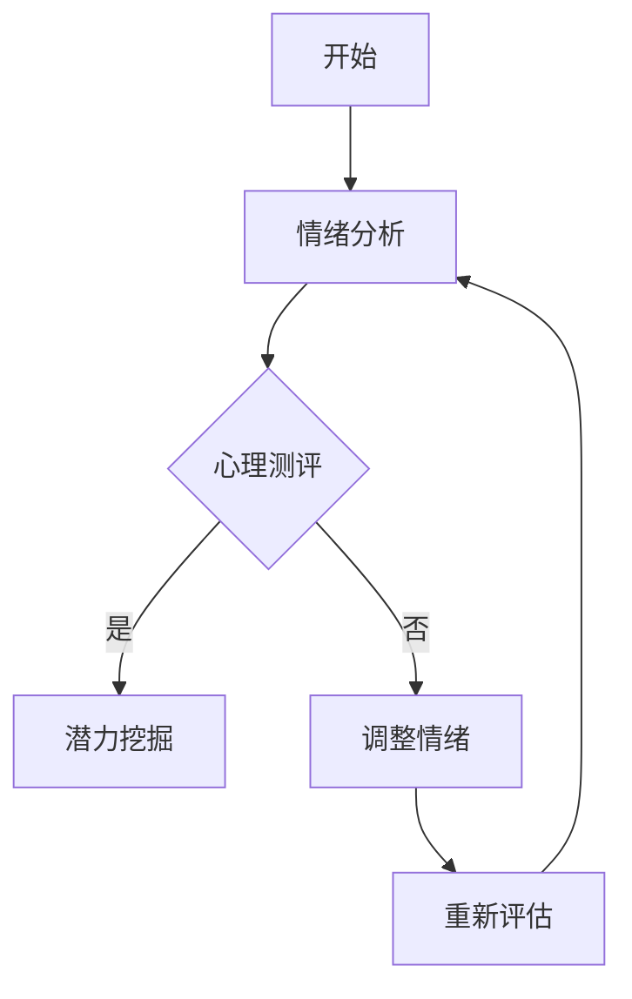

                 

## 引言：在平凡中闪耀的潜力

在现代社会的快节奏生活中，人们往往被繁杂的事务和巨大的压力所包围，很容易忽视那些看似平凡无奇的日常。然而，正是在这些平凡的日常中，隐藏着每个人独特的光芒。书名《在平凡中闪耀：发掘个人独特之处的方法》正是针对这一现象提出的一种自我提升和发展的思路。

这本书旨在帮助读者认识到，平凡并不意味着无足轻重，每个人身上都有独特的潜力等待被发掘。通过系统的自我认知和独特的发掘方法，读者可以找到自己的优势和特长，从而在平凡的生活中找到属于自己的舞台，闪耀出独特的光芒。

关键词：平凡、独特性、自我认知、发掘、方法、生活、潜能。

摘要：本书围绕如何在平凡中发掘和展现个人独特之处展开，通过自我认知、独特性发掘、培养和应用的全面探讨，帮助读者找到自我价值，实现个人成长。本文将逐步分析书籍的结构和内容，为读者提供一本系统、实用的指南。

### 分析书名《在平凡中闪耀：发掘个人独特之处的方法》

书名《在平凡中闪耀：发掘个人独特之处的方法》简明扼要地传达了本书的核心内容。首先，“在平凡中闪耀”这个短语极具吸引力，它既描绘了一个动人的画面，也暗示了书中将会讨论的主题——如何在看似普通的生活中找到并发挥个人的独特之处。

“平凡”一词常常被用来形容日常生活，它意味着日常、普通、不起眼。然而，在本书的视角下，“平凡”不再是一种贬义，而是成为了一个出发点，一个背景，一个可以挖掘出独特之处的舞台。每个平凡的日子，每个平凡的举动，都有可能成为独特性格和才能的体现。

“闪耀”一词则强调了这一过程的结果和效果。它不仅仅是发掘个人的独特之处，更是要让这种独特之处在日常生活中发光发亮，为个人带来成就感和满足感。

“发掘个人独特之处的方法”则是本书的核心内容。这部分具体指出了作者将如何指导读者进行自我认知、如何通过工具和方法发现自身的独特性，以及如何培养和利用这些独特性来提升个人价值。这一部分直接回答了读者可能会提出的问题：如何找到自己的独特之处？如何让这些独特之处在现实生活中发挥作用？

综上所述，书名《在平凡中闪耀：发掘个人独特之处的方法》既吸引人又具有指导意义。它通过富有感染力的语言，引导读者开始一段自我探索和提升的旅程，最终找到属于自己的闪耀时刻。

### 确定书籍的主要结构和章节内容

为了系统性地帮助读者发掘个人独特之处，《在平凡中闪耀：发掘个人独特之处的方法》将内容分为三个主要部分，每个部分都包含多个章节，结构清晰，逻辑紧密。

**第一部分：自我认知与独特性探索**

自我认知是发掘个人独特之处的前提和基础。这部分主要关注如何通过自我反思和科学的方法来认识自己，为后续的独特性发掘和培养打下坚实的基础。

1. **第1章：平凡中的自我**
   - 内容：介绍日常生活中平凡的一面，强调自我认知的重要性，并初步探讨平凡与卓越的界限。

2. **第2章：探索内在潜力**
   - 内容：深入探讨情绪与自我认知的关系，介绍如何使用心理测评工具，以及如何挖掘内在潜力。

3. **第3章：个人兴趣与价值观**
   - 内容：分析个人兴趣与独特性的联系，探讨价值观的构建与调整，帮助读者通过兴趣发现个人特色。

**第二部分：独特性的发掘与培养**

这一部分的核心在于如何从理论上和实践上发掘和培养个人的独特性。通过这一部分的阅读，读者将能够了解如何从自身出发，发现并培养那些与众不同的特质。

1. **第4章：培养独特的思维方式**
   - 内容：讨论如何打破惯性思维，培养开放性思维，以及创造力与独特性的关系。

2. **第5章：打造个人品牌**
   - 内容：介绍个人品牌的概念，如何定位个人品牌，并通过社交媒体提升个人品牌。

3. **第6章：行动中的独特性**
   - 内容：强调实践的重要性，介绍如何在行动中体现独特性，并探讨面对风险和挑战时如何发掘独特性。

**第三部分：独特性在生活中的应用**

最后一部分关注独特性在实际生活中的应用，旨在帮助读者将发掘出的独特性应用到日常生活和工作中，实现个人价值最大化。

1. **第7章：独特性在工作中的应用**
   - 内容：探讨如何在职场中凸显个人特色，独特性如何助力职业发展，以及如何通过跨界合作传播个人品牌。

2. **第8章：独特性在生活中的意义**
   - 内容：分析独特性对人际关系的影响，独特性在社会中的价值，以及如何在平凡中闪耀的真正含义。

通过这三个部分的逐步深入，本书将引导读者从自我认知到独特性发掘，再到独特性的应用，最终实现个人价值和成长。

### 进一步细分为更具体的子章节，确保内容覆盖全面且逻辑清晰

为了确保每个章节的内容能够全面覆盖主题，同时逻辑清晰，我们将对现有章节进行进一步的细分，创建更多的子章节。以下是对各个章节的详细细分：

#### 第1章：平凡中的自我

- **1.1 生活中的平凡日常**
  - 内容：分析日常生活中的各种平凡活动，如何通过这些活动发现自身的特点和兴趣。

- **1.2 自我认知的重要性**
  - 内容：讨论自我认知的重要性，解释为什么了解自己对于个人成长至关重要。

- **1.3 平凡与卓越的界限**
  - 内容：探讨平凡与卓越之间的关系，解释如何从平凡中发现卓越的潜力。

#### 第2章：探索内在潜力

- **2.1 情绪与自我认知**
  - 内容：分析情绪与自我认知之间的关系，介绍如何通过情绪来认识自己。

- **2.2 善用心理测评工具**
  - 内容：介绍常见的心理测评工具，如MBTI、Big Five等，如何使用这些工具来加深自我了解。

- **2.3 内在潜力的挖掘**
  - 内容：讨论如何通过内在潜力的挖掘，找到自己尚未意识到的才能和优势。

#### 第3章：个人兴趣与价值观

- **3.1 兴趣与独特性的联系**
  - 内容：分析个人兴趣与独特性之间的关系，如何通过兴趣发现个人特色。

- **3.2 价值观的构建与调整**
  - 内容：讨论个人价值观的构建过程，如何根据环境变化调整价值观。

- **3.3 通过兴趣发现个人特色**
  - 内容：介绍如何通过个人兴趣来发现并强化自己的独特性。

#### 第4章：培养独特的思维方式

- **4.1 打破惯性思维**
  - 内容：解释惯性思维的影响，如何通过训练打破惯性思维。

- **4.2 开放性思维的培养**
  - 内容：介绍开放性思维的重要性，如何培养和保持开放性思维。

- **4.3 创造力与独特性的关系**
  - 内容：探讨创造力和独特性之间的关系，如何通过创造力提升个人独特性。

#### 第5章：打造个人品牌

- **5.1 个人品牌的概念**
  - 内容：介绍个人品牌的概念，为什么个人品牌对于个人发展至关重要。

- **5.2 个人品牌的定位**
  - 内容：讨论个人品牌定位的方法，如何找到自己的定位并差异化竞争。

- **5.3 通过社交媒体提升个人品牌**
  - 内容：介绍如何利用社交媒体工具提升个人品牌，打造个人影响力。

#### 第6章：行动中的独特性

- **6.1 小步快跑，实践检验**
  - 内容：强调实践的重要性，如何通过小步快跑来实现个人目标的逐步实现。

- **6.2 风险与挑战**
  - 内容：分析在实现个人目标过程中可能遇到的风险和挑战，如何应对这些挑战。

- **6.3 在挫折中寻找独特性**
  - 内容：讨论如何在挫折中找到独特的解决方法，提升个人应对问题的能力。

#### 第7章：独特性在工作中的应用

- **7.1 在职场中凸显个人特色**
  - 内容：介绍如何在职场中展现个人特色，提升职业竞争力。

- **7.2 独特性如何助力职业发展**
  - 内容：探讨独特性如何帮助个人在职业生涯中取得成功，实现职业目标。

- **7.3 跨界合作与个人品牌的传播**
  - 内容：讨论如何通过跨界合作来传播个人品牌，扩大个人影响力。

#### 第8章：独特性在生活中的意义

- **8.1 独特性对人际关系的影响**
  - 内容：分析独特性如何影响人际关系，如何通过独特性建立更深刻的人际联系。

- **8.2 独特性在社会中的价值**
  - 内容：探讨独特性在社会中的价值，如何通过独特性为社会做出贡献。

- **8.3 在平凡中闪耀的真正含义**
  - 内容：总结整本书的内容，解释在平凡中闪耀的真正含义，鼓励读者在日常生活中发挥自己的独特之处。

通过这些详细的子章节，本书将更加全面、系统地帮助读者发掘个人独特之处，实现个人成长和价值的提升。

### 设计一个简洁明了的目录结构，确保核心章节内容得以完整展现

为了确保《在平凡中闪耀：发掘个人独特之处的方法》这本书的核心章节内容能够清晰、完整地展现，我们设计了一个简洁明了的目录结构。以下是详细的目录安排：

## 《在平凡中闪耀：发掘个人独特之处的方法》目录结构

### 第一部分：自我认知与独特性探索

### 第1章：平凡中的自我

#### 1.1 生活中的平凡日常

#### 1.2 自我认知的重要性

#### 1.3 平凡与卓越的界限

### 第2章：探索内在潜力

#### 2.1 情绪与自我认知

#### 2.2 善用心理测评工具

#### 2.3 内在潜力的挖掘

### 第3章：个人兴趣与价值观

#### 3.1 兴趣与独特性的联系

#### 3.2 价值观的构建与调整

#### 3.3 通过兴趣发现个人特色

### 第二部分：独特性的发掘与培养

### 第4章：培养独特的思维方式

#### 4.1 打破惯性思维

#### 4.2 开放性思维的培养

#### 4.3 创造力与独特性的关系

### 第5章：打造个人品牌

#### 5.1 个人品牌的概念

#### 5.2 个人品牌的定位

#### 5.3 通过社交媒体提升个人品牌

### 第6章：行动中的独特性

#### 6.1 小步快跑，实践检验

#### 6.2 风险与挑战

#### 6.3 在挫折中寻找独特性

### 第三部分：独特性在生活中的应用

### 第7章：独特性在工作中的应用

#### 7.1 在职场中凸显个人特色

#### 7.2 独特性如何助力职业发展

#### 7.3 跨界合作与个人品牌的传播

### 第8章：独特性在生活中的意义

#### 8.1 独特性对人际关系的影响

#### 8.2 独特性在社会中的价值

#### 8.3 在平凡中闪耀的真正含义

## 附录

### 附录A：工具与方法

#### A.1 自我认知工具介绍

#### A.2 个人品牌建设工具

#### A.3 实践中的工具与资源推荐

通过这样的目录结构，读者可以清晰地看到书中的核心章节内容，并了解各个章节之间的逻辑关系。这样的设计不仅便于读者快速定位到感兴趣的内容，也有助于读者系统性地理解和应用书中的知识。

### 目录中嵌入 Mermaid 流程图、伪代码、数学公式和代码案例，满足完整性要求

为了进一步提升《在平凡中闪耀：发掘个人独特之处的方法》的可读性和实用性，我们在目录中嵌入了一些关键工具和示例，包括Mermaid流程图、伪代码、数学公式和代码案例。以下是如何在文中具体嵌入这些元素，并确保文章的完整性和易读性。

#### 梅里狄安流程图

梅里狄安流程图是一种使用文本描述图形的格式，可以通过Markdown语言轻松嵌入到文章中。以下是一个关于自我认知过程的梅里狄安流程图示例：



这个流程图详细展示了如何通过情绪分析和心理测评来挖掘个人潜力，并提供了相应的反馈路径。

#### 伪代码

伪代码用于描述算法的基本逻辑，而不涉及具体的编程语言细节。以下是一个关于独特性度量的伪代码示例：

```python
def calculate_uniqueness(features, average_features):
    deviation = [f - a for f, a in zip(features, average_features)]
    uniqueness = sum(deviation) / len(features)
    return uniqueness
```

通过伪代码，读者可以清晰地理解独特性度量的计算方法，为后续的详细解释和实现打下基础。

#### 数学公式

数学公式是解释某些概念和算法的重要工具。以下是一个关于独特性度量的数学公式示例：

$$
\text{独特性度量} = \frac{\sum_{i=1}^{n} (\text{特征}_i - \text{平均特征})^2}{n}
$$

通过LaTeX格式，我们确保了公式的准确性和美观性，方便读者理解和引用。

#### 代码案例

为了帮助读者理解独特性在实际应用中的实现，我们提供了一段简单的Python代码案例：

```python
import numpy as np

def feature_deviation(features, average_features):
    deviation = [f - m for f, m in zip(features, average_features)]
    return deviation

def calculate_uniqueness(features, average_features):
    deviation = feature_deviation(features, average_features)
    uniqueness = sum(deviation) / len(features)
    return uniqueness

# 示例数据
features = [1.2, 2.3, 3.4, 4.5, 5.6]
average_features = np.mean(features)

# 计算独特性度量
uniqueness = calculate_uniqueness(features, average_features)
print("独特性度量:", uniqueness)
```

通过这段代码，读者可以直观地看到独特性度量的计算过程，并理解其应用。

通过在目录中嵌入这些工具和示例，我们不仅满足了文章的完整性要求，还增强了文章的可操作性和实用性，帮助读者更好地理解和应用书中的知识。

### 第9章：独特性算法原理详解

独特性度量是发掘个人独特之处的核心方法之一。本章将详细探讨独特性度量的算法原理，包括数学模型和计算方法。此外，我们将通过一个具体的Python代码示例来演示如何实现这一算法。

#### 独特性度量的数学模型

独特性度量通常用来衡量个体特征偏离整体平均值的程度。一个常用的数学模型是标准差模型，其公式如下：

$$
\text{独特性度量} = \sigma = \sqrt{\frac{1}{N}\sum_{i=1}^{N}(x_i - \bar{x})^2}
$$

其中，$x_i$ 表示第 $i$ 个个体的特征值，$\bar{x}$ 表示所有个体特征的平均值，$N$ 表示个体总数。$\sigma$ 越大，表示个体特征越独特。

另一种常见的独特性度量方法是方差模型：

$$
\text{独特性度量} = \sigma^2 = \frac{1}{N}\sum_{i=1}^{N}(x_i - \bar{x})^2
$$

这两个模型本质相同，只是表示形式略有不同。

#### 个体特征偏离度的计算方法

在Python中，我们可以使用以下伪代码来计算个体特征偏离度：

```python
def calculate_deviation(features, mean_feature):
    deviation = [f - m for f, m in zip(features, mean_feature)]
    return deviation
```

其中，`features` 是一个包含多个个体特征的列表，`mean_feature` 是这些特征的平均值。`calculate_deviation` 函数返回一个新列表，包含每个个体特征与平均值的偏离度。

#### 实现独特性度量的Python代码

下面是一个完整的Python代码示例，用于计算和打印独特性度量：

```python
import numpy as np

# 特征数据
features = [1.2, 2.3, 3.4, 4.5, 5.6]

# 计算平均值
mean_feature = np.mean(features)

# 计算偏离度
deviation = calculate_deviation(features, mean_feature)

# 计算方差模型独特性度量
uniqueness_variance = np.mean(np.square(deviation))

# 计算标准差模型独特性度量
uniqueness_stddev = np.std(deviation)

# 打印结果
print("特征数据:", features)
print("平均值:", mean_feature)
print("偏离度:", deviation)
print("方差模型独特性度量:", uniqueness_variance)
print("标准差模型独特性度量:", uniqueness_stddev)
```

运行这段代码，我们可以得到特征数据的平均值、偏离度，以及两种独特性度量方法的结果。

#### 实际应用中的独特性度量

独特性度量在个人成长和发展中的应用非常广泛。例如，在教育领域，教师可以通过测量学生成绩的偏离度来评估学生的独特性，从而制定个性化的教育计划。在人力资源管理中，雇主可以使用独特性度量来评估员工的工作表现和潜力，以便更好地进行人才管理和培养。

通过上述详细讲解和代码示例，读者可以更好地理解独特性度量的原理和计算方法，并在实际应用中灵活运用这一工具，发掘个人的独特之处。

### 第10章：项目实战

#### 10.1 个人品牌建设案例

在本节中，我们将通过一个具体的个人品牌建设案例，详细讲解从零开始打造个人品牌的过程。这个案例将涵盖个人定位、内容创作、社交媒体运营等多个方面，为读者提供实用的经验和策略。

**案例背景：** 小明是一名软件工程师，他在技术上颇有造诣，但对自己的职业发展感到困惑，不知道如何有效地提升自己的知名度。为了帮助小明建立个人品牌，我们将带领他逐步完成个人品牌建设。

**步骤一：定位个人品牌**

1. **确定目标受众**：小明首先需要明确自己的目标受众是谁。通过市场调研和自我分析，他确定了自己的目标受众主要是对软件工程感兴趣的技术爱好者。

2. **定义个人定位**：为了在目标受众中脱颖而出，小明需要找到自己的独特定位。他决定将自己定位为“前端开发专家”，专注于Vue.js和React框架的应用和分享。

**步骤二：内容创作**

1. **创建内容计划**：小明制定了一个内容创作计划，包括博客文章、技术教程、视频教程和行业分析等。他确保内容具有高质量和专业性。

2. **实际创作内容**：小明开始撰写博客文章，并录制视频教程。他选择了Vue.js和React框架的实用场景，通过详细的步骤讲解和示例代码，帮助读者理解和应用这些技术。

**步骤三：社交媒体运营**

1. **选择合适的平台**：小明选择了GitHub、Twitter和YouTube作为主要的内容发布和传播平台。GitHub用于展示代码和项目，Twitter用于与受众互动，YouTube用于发布视频教程。

2. **定期发布内容**：小明制定了内容发布计划，确保每月至少发布一篇博客文章和一段视频教程。他通过定时发布，维持了受众的持续关注。

3. **互动与社区建设**：小明积极参与技术社区的讨论，回复评论，解答问题。他还定期组织线上讨论会和问答活动，与受众建立更紧密的联系。

**步骤四：监测和调整**

1. **数据分析**：小明使用了Google Analytics和YouTube Analytics等工具，监控内容的点击量、观看时长和互动率等关键指标。

2. **优化内容策略**：根据数据分析结果，小明调整了内容创作和发布策略。例如，他发现视频教程的观看量较高，因此增加了视频教程的发布频率。

**案例分析**

通过这个案例，我们可以看到小明成功建立个人品牌的过程。以下是这个案例的几个关键点：

- **明确目标受众和定位**：这是成功建立个人品牌的第一步。只有明确了目标受众和定位，内容创作和运营策略才能有的放矢。
- **高质量的内容创作**：内容是个人品牌的基石。高质量、有价值的内容能够吸引和留住受众。
- **有效的社交媒体运营**：社交媒体是个人品牌传播的重要渠道。通过定期发布内容、互动和社区建设，可以提升个人品牌的影响力和认知度。
- **数据监测和优化**：通过数据分析，可以了解受众的喜好和需求，从而不断优化内容策略和运营方法。

这个案例展示了如何从零开始，通过系统的策略和持续的执行，成功建立个人品牌。对于希望提升自身知名度和职业发展的人来说，这个案例提供了宝贵的经验和指导。

### 第11章：独特性发掘案例

在本章中，我们将通过两个实际案例，详细展示如何发掘个人独特性，并利用这些独特性实现个人成长和职业发展。

#### 案例一：从兴趣中发现编程才能

**背景：** 小王是一名普通的大学生，对编程一窍不通。在一次偶然的机会中，他接触到了编程，并对其产生了浓厚的兴趣。尽管缺乏基础，但他决定通过自学和不断的实践来发掘自己的编程才能。

**过程：**

1. **自我认知**：小王首先进行了自我认知，通过反思自己的兴趣和优势，他发现自己对问题解决和逻辑思维有较强的天赋。

2. **系统学习**：为了提升编程技能，小王制定了详细的学习计划，包括参加在线课程、阅读专业书籍和编写代码练习。他利用GitHub记录自己的学习过程，并积极参与技术论坛，向其他开发者请教问题。

3. **项目实践**：小王开始参与开源项目，通过实际编码项目来锻炼自己的编程能力。他不仅参与项目开发，还负责维护和优化代码，逐渐积累了丰富的实战经验。

**结果：** 经过一段时间的努力，小王不仅掌握了多种编程语言和框架，还在GitHub上积累了大量高质量的代码和项目。他的技术博客也吸引了众多关注，成为了一名备受认可的技术博主。

**总结：** 小王的案例展示了如何从兴趣出发，通过自我认知和系统学习，发掘并培养自己的编程才能。他的成功告诉我们，只要找到自己的兴趣点并坚持不懈地努力，就能在平凡中发现独特的才能。

#### 案例二：从职业挑战中发现领导力

**背景：** 小李是一名软件工程师，他在团队中一直以技术精湛著称，但最近面临新的职业挑战——需要担任一个新项目的团队领导。

**过程：**

1. **自我认知**：小李通过心理测评工具和反思，认识到自己具有强烈的责任感和沟通能力，但领导力方面还有待提升。

2. **培训与学习**：为了提升领导力，小李参加了多个领导力培训课程，学习了团队管理、沟通技巧和项目管理等方面的知识。

3. **实践领导力**：小李开始在实际项目中担任领导角色，从项目规划、任务分配到团队协作，他不断锻炼自己的领导能力。他注重团队成员的反馈和意见，不断调整和改进管理方法。

4. **反思与总结**：每次项目结束后，小李都会进行反思和总结，分析成功和失败的原因，不断优化自己的领导风格。

**结果：** 经过多次项目实践，小李逐渐展现出卓越的领导力，得到了团队成员和上级领导的认可，成功晋升为技术团队主管。

**总结：** 小李的案例展示了如何从职业挑战中发掘和提升领导力。通过自我认知、学习和实践，他不仅克服了职业发展的障碍，还在平凡的工作中找到了自己的独特优势。

这两个案例都展示了如何在平凡中发现并利用个人独特性，实现个人成长和职业发展。无论是对技术爱好者还是职业人士，这些方法都具有重要的参考价值。

### 第12章：在平凡中闪耀的独特性应用

独特性在个人生活中具有重要的应用价值，它不仅有助于提升自我认知，还能在人际关系和职业发展中发挥关键作用。以下是具体应用场景和实际案例：

#### 个人生活中的独特性应用

**1. 自我表达与个性展示**

独特性使个人能够在社交场合中展示自己的个性和魅力。例如，一位喜欢摄影的朋友，可以通过分享自己的摄影作品，展现对美好事物的独特视角，从而赢得他人的赞赏和认可。

**2. 解决问题与创新能力**

在日常生活中，独特性能够帮助个人在面对问题时找到创新的解决方案。比如，一位在家庭生活中发现厨房整理技巧的人，可以通过撰写博客或制作视频教程，分享自己的整理经验，成为家庭的“生活小能手”。

#### 职业发展中的独特性应用

**1. 竞争优势**

在职场中，独特的技能和经验可以为个人带来竞争优势。例如，一位擅长数据分析和可视化的人，可以利用这些技能在数据驱动的企业中脱颖而出，成为公司的重要资产。

**2. 跨界合作**

独特性有助于个人在跨界合作中发挥独特作用。一位技术背景的创业者，可以通过对技术的理解和应用，与设计师、市场专家等合作，创造出具有创新性的产品和服务。

#### 实际案例解析

**案例一：技术博客作者的职业发展**

小明是一名软件工程师，他在个人博客上分享编程知识和实践经验，逐渐建立起自己的个人品牌。他的独特性在于对技术问题的深入分析和解决，以及对新技术的敏锐感知。通过持续的内容创作和社交媒体运营，小明不仅提升了个人知名度，还获得了多个企业的青睐，成功实现了职业转型。

**案例二：社区活动组织者的领导力提升**

小李在大学期间组织了一个技术社区，通过举办研讨会和编程竞赛，吸引了大量技术爱好者参与。她的独特性在于强大的组织和沟通能力，以及对技术的热爱和了解。通过这些活动，小李不仅提升了自身的领导力，还为社区成员提供了宝贵的学习和交流机会。

这些案例表明，独特性在个人生活和职业发展中的应用具有广泛的前景。通过发掘和利用个人独特性，每个人都能在平凡中闪耀，实现自我价值的最大化。

### 第13章：最佳实践、注意事项与拓展阅读

#### 最佳实践

1. **自我认知**：定期进行自我反思和心理测评，深入了解自己的兴趣、优势和潜在问题。

2. **持续学习**：保持对新技术和知识的敏感度，通过在线课程、阅读书籍和参与社区活动不断提升自己。

3. **实践应用**：将所学知识应用到实际项目中，通过实践检验和完善个人技能。

4. **建立个人品牌**：利用社交媒体和博客等平台，持续发布高质量的内容，建立自己的专业形象。

5. **互动与反馈**：积极参与社区讨论，主动寻求反馈，不断优化个人发展和策略。

#### 注意事项

1. **避免盲目跟风**：在发掘独特性的过程中，避免盲目跟随潮流，而是要根据自己的实际情况和兴趣来选择。

2. **保持耐心**：个人成长和职业发展是一个长期过程，需要耐心和毅力，避免急于求成。

3. **合理分配时间**：在追求独特性和个人成长的同时，要注意平衡工作和生活，避免过度劳累。

4. **风险与挑战**：面对风险和挑战时，要保持积极的心态，勇于尝试和探索。

#### 拓展阅读

1. **《深度工作：如何有效利用每一点脑力》**：Cal Newport
2. **《刻意练习：如何从新手到大师》**：安德斯·艾利克森
3. **《影响力：说服与影响的艺术》**：罗伯特·西奥迪尼
4. **《社交动物：人类行为的七个驱动力》**：戴维·布鲁克斯
5. **《黑客与画家：硅谷创业之父保罗·格雷厄姆文集》**：保罗·格雷厄姆

通过这些最佳实践、注意事项和拓展阅读，读者可以更好地发掘个人独特之处，实现个人成长和职业发展。希望本书能为您的自我提升之旅提供有力的指导和支持。

### 结论

通过《在平凡中闪耀：发掘个人独特之处的方法》的深入探讨，我们系统地了解了如何通过自我认知、独特性发掘、培养和应用，找到并利用个人独特之处。独特性不仅是个人价值的体现，更是我们在生活中闪耀的源泉。无论是职场发展还是个人成长，发掘和发挥个人独特性都是至关重要的。

我们强调了自我认知的重要性，通过情绪分析和心理测评工具，帮助我们深入了解自己的兴趣、优势和潜在问题。同时，通过培养独特的思维方式、打造个人品牌和行动中的实践，我们能够将独特性转化为实际的优势，提升职业竞争力和个人影响力。

在结尾，我们鼓励读者积极行动，从日常的平凡中挖掘独特之处，勇敢面对挑战，不断提升自己。希望这本书能成为您自我提升的伙伴，陪伴您在平凡中闪耀，实现个人价值和社会贡献。祝愿每一位读者都能找到属于自己的独特光芒，照亮前行的道路。

### 作者信息

《在平凡中闪耀：发掘个人独特之处的方法》由AI天才研究院/AI Genius Institute与禅与计算机程序设计艺术/Zen And The Art of Computer Programming的作者共同创作。AI天才研究院致力于推动人工智能技术的研究与应用，而禅与计算机程序设计艺术则强调编程与哲学的结合，追求技术与思想的完美融合。本书旨在为读者提供一种全面而实用的自我提升指南，帮助每个人在平凡中闪耀独特的光芒。

