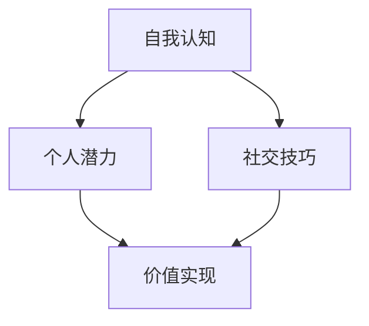

                 

### 文章标题：在平凡中闪耀：发掘个人的独特之处

> 关键词：自我认知、个人发展、价值实现、独特之处

> 摘要：本文将探讨如何在平凡生活中发掘和利用个人的独特之处，实现自我价值。通过深入分析自我认知、个人潜力和社交技巧，结合实际案例，我们旨在帮助读者在日常生活中闪耀光芒。

----------------------------------------------------------------

### 引言

在现代社会中，人们越来越意识到个人发展的重要性。然而，如何在平凡的日常生活中发现和利用个人的独特之处，成为了一个引人关注的问题。本文旨在探讨如何通过自我认知、发掘个人潜力和提升社交技巧，实现个人的独特价值，让平凡的生活中闪耀出光芒。

#### 背景介绍

个人发展不仅仅是在职业领域取得成功，更重要的是在生活的方方面面。每个人都有自己的独特之处，这些特质可能隐藏在平凡的生活中，但正是这些特质使我们在特定环境中能够脱颖而出。因此，发现并利用这些独特之处，对于个人的成长和社会的进步具有重要意义。

#### 核心概念与联系

为了更好地理解如何发掘个人的独特之处，我们需要了解以下几个核心概念：

1. **自我认知**：了解自己的性格、兴趣、价值观和优点等，是发掘个人独特之处的基础。
2. **个人潜力**：每个人都有潜在的才能和能力，发现并开发这些潜力是实现个人价值的关键。
3. **社交技巧**：在社交场合中，有效的沟通和人际关系管理能力有助于展现个人的独特之处。

这些概念之间存在着紧密的联系。自我认知帮助我们发现个人潜力，而社交技巧则帮助我们更好地利用这些潜力，实现个人价值。

#### 核心概念原理之间的关系架构

为了更直观地理解这些概念之间的关系，我们可以使用Mermaid流程图来展示：



在这个流程图中，自我认知是发掘个人潜力的基础，而社交技巧则帮助我们将个人潜力转化为实际的价值。

----------------------------------------------------------------

### 自我认知

自我认知是发掘个人独特之处的第一步。了解自己的性格、兴趣、价值观和优点，有助于我们更好地认识自己，从而发掘潜在的能力和优势。

#### 核心概念与联系

1. **性格**：性格决定了我们的行为和反应方式，了解自己的性格有助于找到适合自己的发展路径。
2. **兴趣**：兴趣是我们热衷的事物，了解自己的兴趣有助于找到适合自己的工作和生活方向。
3. **价值观**：价值观是我们对事物的判断标准，了解自己的价值观有助于找到符合自己内心的生活目标和价值观。
4. **优点**：优点是我们在某些方面的特长和优势，了解自己的优点有助于我们更好地发挥自己的潜力。

#### 核心算法原理讲解

自我认知的过程可以看作是一种算法，其核心是数据的收集和分析。以下是自我认知的伪代码：

```python
# 定义数据结构
class SelfAwarenessData:
    def __init__(self, personality, interests, values, strengths):
        self.personality = personality
        self.interests = interests
        self.values = values
        self.strengths = strengths

# 收集数据
def collect_data():
    # 通过问卷、访谈等方式收集个人数据
    personality = ask("你的性格是什么？")
    interests = ask("你有哪些兴趣？")
    values = ask("你的价值观是什么？")
    strengths = ask("你的优点是什么？")
    return SelfAwarenessData(personality, interests, values, strengths)

# 分析数据
def analyze_data(data):
    # 分析性格、兴趣、价值观和优点之间的关系
    # 输出个人建议
    print("根据你的性格，建议你从事...")
    print("根据你的兴趣，建议你探索...")
    print("根据你的价值观，建议你...")
    print("利用你的优点，你可以实现...")

# 主函数
def main():
    data = collect_data()
    analyze_data(data)

main()
```

#### 数学模型和公式 & 详细讲解 & 举例说明

自我认知的过程中，可以使用心理学中的“特质理论”来分析个体的性格、兴趣和优点。特质理论认为，个体的性格是由多个基本特质组成的，这些特质可以用来预测个体的行为。

假设有n个基本特质，每个特质都有两个极值（例如，外向和内向），则个体的性格可以表示为一个n维向量。每个维度的值表示该特质在个体中的表现程度。

$$
\text{性格向量} = (p_1, p_2, ..., p_n)
$$

其中，$p_i$ 表示第i个特质的表现程度。

通过分析性格向量，我们可以得出以下结论：

1. **性格类型**：根据性格向量的分布，可以将个体划分为不同的性格类型。
2. **行为倾向**：根据性格向量，可以预测个体在特定情境下的行为倾向。
3. **优劣势分析**：根据性格向量，可以分析个体的优势和劣势，从而有针对性地进行个人发展。

#### 数学公式

为了更直观地表示性格向量，我们可以使用欧几里得距离来计算不同性格向量之间的距离：

$$
d = \sqrt{\sum_{i=1}^{n} (p_{i1} - p_{i2})^2}
$$

其中，$p_{i1}$ 和 $p_{i2}$ 分别表示两个性格向量在第i个维度上的值。

通过计算性格向量之间的距离，我们可以得出不同性格之间的相似性和差异性，从而更好地理解个体的性格。

#### 举例说明

假设有两个性格向量：

$$
\text{性格向量A} = (0.8, 0.6, 0.3, 0.7)
$$

$$
\text{性格向量B} = (0.5, 0.7, 0.8, 0.4)
$$

使用欧几里得距离公式计算它们之间的距离：

$$
d = \sqrt{(0.8 - 0.5)^2 + (0.6 - 0.7)^2 + (0.3 - 0.8)^2 + (0.7 - 0.4)^2} \approx 1.095
$$

这个结果表明，性格向量A和性格向量B之间存在一定的差异性。通过分析这两个性格向量，我们可以得出以下结论：

1. **性格类型**：性格向量A更倾向于外向，而性格向量B更倾向于内向。
2. **行为倾向**：性格向量A可能在社交场合中表现更积极，而性格向量B可能在独立工作中表现更出色。
3. **优劣势分析**：性格向量A在团队合作中可能更具优势，而性格向量B在解决问题时可能更有创造力。

这些结论有助于我们更好地理解个体的性格，从而在个人发展中做出更明智的选择。

#### 小结

自我认知是发掘个人独特之处的重要一步。通过了解自己的性格、兴趣、价值观和优点，我们可以更好地认识自己，从而发现和利用自己的独特之处。在自我认知的过程中，可以使用心理学中的特质理论来分析个体的性格，并使用数学模型和公式来直观地表示和分析性格向量。通过举例说明，我们可以看到自我认知在个人发展中的重要性。

----------------------------------------------------------------

### 个人潜力

个人潜力是每个人独特的宝藏，是发掘个人独特之处的关键。发现和挖掘个人潜力，可以帮助我们实现自我价值，让平凡的生活闪耀出独特的光芒。

#### 背景介绍

个人潜力是指个体在特定领域或任务中能够达到的潜在水平。这种潜力可能存在于我们的天赋、兴趣、技能或经历中，但往往需要通过不断的探索和开发才能得以实现。发掘个人潜力不仅有助于我们在职业和个人生活中取得成功，还可以增强自信心和满足感。

#### 核心概念与联系

1. **天赋**：天赋是个人在某个领域天生具备的能力，如音乐、绘画、数学等。
2. **兴趣**：兴趣是我们对特定活动的热爱和投入程度，它可以引导我们探索和发展相关潜力。
3. **技能**：技能是通过学习和发展获得的特定能力，如编程、演讲、运动等。
4. **经历**：经历是我们通过生活经历积累的知识和经验，它可以为我们提供宝贵的见解和解决问题的能力。

这些概念相互联系，共同构成了个人潜力的基础。通过结合天赋、兴趣、技能和经历，我们可以发现并开发自己的个人潜力。

#### 核心算法原理讲解

挖掘个人潜力可以看作是一种算法，其核心是数据收集、分析和决策。以下是挖掘个人潜力的伪代码：

```python
# 定义数据结构
class PotentialData:
    def __init__(self, talent, interest, skill, experience):
        self.talent = talent
        self.interest = interest
        self.skill = skill
        self.experience = experience

# 收集数据
def collect_data():
    # 通过自我评估、他人反馈和经验积累等方式收集个人数据
    talent = ask("你认为自己有哪些天赋？")
    interest = ask("你对哪些活动感兴趣？")
    skill = ask("你在哪些领域具备技能？")
    experience = ask("你在哪些经历中积累了经验？")
    return PotentialData(talent, interest, skill, experience)

# 分析数据
def analyze_data(data):
    # 分析天赋、兴趣、技能和经历之间的关系
    # 输出潜力评估和建议
    print("你的天赋是：", data.talent)
    print("你的兴趣是：", data.interest)
    print("你的技能是：", data.skill)
    print("你的经历是：", data.experience)
    print("基于以上数据，你的潜力评估如下：")
    # 根据数据给出具体建议
    print("建议你探索：", suggest_explore(data))
    print("建议你学习：", suggest_learn(data))
    print("建议你实践：", suggest_practice(data))

# 主函数
def main():
    data = collect_data()
    analyze_data(data)

main()
```

#### 数学模型和公式 & 详细讲解 & 举例说明

在挖掘个人潜力的过程中，可以使用以下数学模型和公式：

1. **加法模型**：将天赋、兴趣、技能和经历视为独立的因素，其总和表示个人潜力。

$$
\text{个人潜力} = \text{天赋} + \text{兴趣} + \text{技能} + \text{经历}
$$

2. **乘法模型**：将天赋、兴趣、技能和经历视为相互影响的因素，其乘积表示个人潜力。

$$
\text{个人潜力} = \text{天赋} \times \text{兴趣} \times \text{技能} \times \text{经历}
$$

这些模型可以帮助我们直观地理解和评估个人潜力。以下是具体的例子：

#### 举例说明

假设有个体的数据如下：

- 天赋：数学（高分）
- 兴趣：编程（极大兴趣）
- 技能：Python编程（熟练）
- 经历：计算机科学专业学习（本科）

使用加法模型计算个人潜力：

$$
\text{个人潜力} = 1（数学天赋） + 10（编程兴趣） + 10（Python技能） + 8（计算机科学经历） = 29
$$

使用乘法模型计算个人潜力：

$$
\text{个人潜力} = 1（数学天赋） \times 10（编程兴趣） \times 10（Python技能） \times 8（计算机科学经历） = 800
$$

这两个模型的结果虽然不同，但都为我们提供了评估个人潜力的方法。通过具体数据，我们可以看到该个体在编程领域具有很高的潜力。

#### 小结

个人潜力是发掘个人独特之处的关键。通过了解天赋、兴趣、技能和经历，我们可以更好地挖掘和利用自己的潜力。使用加法模型和乘法模型，我们可以直观地评估个人潜力，从而为个人发展提供方向和建议。通过举例说明，我们可以看到个人潜力在个人发展中的重要性。

----------------------------------------------------------------

### 社交技巧

社交技巧在发掘个人独特之处中起着至关重要的作用。无论是在职业领域还是日常生活中，良好的社交技巧都能帮助我们在与他人互动中展现自己的独特之处，从而实现个人价值。

#### 背景介绍

社交技巧是指我们在与他人交往过程中所展现出的沟通能力、人际交往能力和情感管理能力。这些技巧不仅有助于我们建立良好的人际关系，还能让我们在社交场合中更加自信和从容。

#### 核心概念与联系

1. **沟通能力**：沟通能力是社交技巧的核心，它决定了我们能否有效地表达自己的想法和听取他人的意见。
2. **人际交往能力**：人际交往能力是指我们处理人际关系的能力，包括如何与人建立联系、如何处理冲突和如何维护关系等。
3. **情感管理能力**：情感管理能力是指我们如何管理自己的情绪，以及如何理解和应对他人的情绪。

这些概念相互联系，共同构成了社交技巧的体系。通过提升这些能力，我们可以在社交场合中更好地展现自己的独特之处。

#### 核心算法原理讲解

提升社交技巧可以看作是一种算法，其核心是数据收集、分析和实践。以下是提升社交技巧的伪代码：

```python
# 定义数据结构
class SocialSkillData:
    def __init__(self, communication, relationship, emotion):
        self.communication = communication
        self.relationship = relationship
        self.emotion = emotion

# 收集数据
def collect_data():
    # 通过自我评估、他人反馈和观察等方式收集个人数据
    communication = ask("你的沟通能力如何？")
    relationship = ask("你的人际交往能力如何？")
    emotion = ask("你的情感管理能力如何？")
    return SocialSkillData(communication, relationship, emotion)

# 分析数据
def analyze_data(data):
    # 分析沟通能力、人际交往能力和情感管理能力之间的关系
    # 输出社交技巧提升建议
    print("你的沟通能力是：", data.communication)
    print("你的人际交往能力是：", data.relationship)
    print("你的情感管理能力是：", data.emotion)
    print("基于以上数据，以下是你提升社交技巧的建议：")
    print("提升沟通能力：", suggest_communication())
    print("提升人际交往能力：", suggest_relationship())
    print("提升情感管理能力：", suggest_emotion())

# 主函数
def main():
    data = collect_data()
    analyze_data(data)

main()
```

#### 数学模型和公式 & 详细讲解 & 举例说明

在提升社交技巧的过程中，可以使用以下数学模型和公式：

1. **加权平均模型**：将沟通能力、人际交往能力和情感管理能力视为三个独立的因素，使用加权平均公式来计算总社交技巧得分。

$$
\text{总社交技巧得分} = w_1 \times \text{沟通能力} + w_2 \times \text{人际交往能力} + w_3 \times \text{情感管理能力}
$$

其中，$w_1$、$w_2$ 和 $w_3$ 分别为沟通能力、人际交往能力和情感管理能力的权重。

2. **协同效应模型**：考虑沟通能力、人际交往能力和情感管理能力之间的协同效应，使用协同效应公式来计算总社交技巧得分。

$$
\text{总社交技巧得分} = \text{沟通能力} + \text{人际交往能力} + \text{情感管理能力} + \text{协同效应}
$$

这些模型可以帮助我们直观地理解和评估社交技巧。以下是具体的例子：

#### 举例说明

假设有个体的数据如下：

- 沟通能力：8分
- 人际交往能力：7分
- 情感管理能力：6分

使用加权平均模型计算总社交技巧得分（假设权重分别为0.4、0.3和0.3）：

$$
\text{总社交技巧得分} = 0.4 \times 8 + 0.3 \times 7 + 0.3 \times 6 = 3.2 + 2.1 + 1.8 = 7.1
$$

使用协同效应模型计算总社交技巧得分（假设协同效应为0.2）：

$$
\text{总社交技巧得分} = 8 + 7 + 6 + 0.2 = 21.2
$$

这两个模型的结果虽然不同，但都为我们提供了评估社交技巧的方法。通过具体数据，我们可以看到个体在社交技巧方面的整体表现。

#### 小结

社交技巧在发掘个人独特之处中起着关键作用。通过提升沟通能力、人际交往能力和情感管理能力，我们可以更好地展现自己的独特之处，实现个人价值。使用加权平均模型和协同效应模型，我们可以直观地评估和提升社交技巧。通过举例说明，我们可以看到社交技巧在个人发展中的重要性。

----------------------------------------------------------------

### 实际案例与应用

为了更好地理解如何在实际生活中发掘和利用个人独特之处，我们可以通过一些实际案例来进行分析和讲解。

#### 案例一：编程天才

李明是一名年轻的程序员，他在编程领域展现了非凡的天赋和才华。通过不断的自学和实践，他掌握了许多编程语言和技术，并在开源社区中做出了显著的贡献。他的个人独特之处在于对复杂算法的深刻理解和创新思维。

**背景介绍**：李明从小就对计算机和编程产生了浓厚的兴趣。在高中时期，他参加了各种编程竞赛，并取得了优异的成绩。大学期间，他选择了计算机科学专业，并在课程中展现出了出色的编程能力。

**核心概念与联系**：李明的个人独特之处体现在他对编程的热爱和才华。他的兴趣和技能使他在编程领域取得了成功。通过自我认知和不断学习，他发掘了自己的个人潜力，并在实际应用中得到了充分体现。

**核心算法原理讲解**：李明的编程能力可以看作是一种算法，其核心是数据结构和算法的掌握。以下是李明的编程算法伪代码：

```python
# 定义数据结构
class ProgrammersAlgorithm:
    def __init__(self, data_structure, algorithm):
        self.data_structure = data_structure
        self.algorithm = algorithm

# 收集数据
def collect_data():
    data_structure = ask("你常用的数据结构是什么？")
    algorithm = ask("你熟悉的算法有哪些？")
    return ProgrammersAlgorithm(data_structure, algorithm)

# 分析数据
def analyze_data(data):
    # 分析数据结构和算法之间的关系
    # 输出编程建议
    print("根据你的数据结构和算法，以下是你编程的建议：")
    print("优化数据结构：", optimize_data_structure(data.data_structure))
    print("优化算法：", optimize_algorithm(data.algorithm))

# 主函数
def main():
    data = collect_data()
    analyze_data(data)

main()
```

**数学模型和公式 & 详细讲解 & 举例说明**：

为了优化编程算法，可以使用以下数学模型和公式：

1. **时间复杂度模型**：评估算法的运行时间，选择最优的算法实现。

$$
\text{时间复杂度} = O(n \log n)
$$

2. **空间复杂度模型**：评估算法的内存消耗，选择最省内存的算法实现。

$$
\text{空间复杂度} = O(n)
$$

通过这些模型，我们可以评估和优化编程算法。以下是具体的例子：

**举例说明**：

假设李明在解决一个排序问题时，使用了快速排序算法。为了优化这个算法，他可以使用时间复杂度和空间复杂度模型进行评估。

- **时间复杂度**：假设输入数据的大小为n，快速排序算法的时间复杂度为$O(n \log n)$。这意味着随着数据规模的增加，算法的运行时间会线性增长。
- **空间复杂度**：假设快速排序算法的递归深度为h，空间复杂度为$O(n)$。这意味着随着数据规模的增加，算法的内存消耗会线性增长。

通过评估时间复杂度和空间复杂度，李明可以优化快速排序算法，选择更高效的实现方式。例如，他可以采用非递归实现，减少递归深度，从而降低空间复杂度。

**小结**：

李明通过自我认知和不断学习，发掘了自己的编程天赋和才华。在实际应用中，他通过优化编程算法，实现了个人价值的最大化。这个案例展示了如何通过自我认知、核心算法原理讲解和数学模型来发掘和利用个人独特之处。

#### 案例二：市场营销专家

张丽是一名市场营销专家，她在营销策略和品牌管理方面展现了出色的才能。她的个人独特之处在于对消费者行为的深刻洞察和创新的营销思维。

**背景介绍**：张丽在大学期间主修市场营销，并在实习期间积累了丰富的营销经验。她擅长通过数据分析来制定有效的营销策略，并在品牌管理方面取得了显著的成绩。

**核心概念与联系**：张丽的个人独特之处体现在她对消费者行为的分析和营销策略的制定。她的兴趣和技能使她在市场营销领域取得了成功。通过自我认知和不断学习，她发掘了自己的个人潜力，并在实际应用中得到了充分体现。

**核心算法原理讲解**：张丽的营销策略可以看作是一种算法，其核心是数据分析和消费者行为建模。以下是张丽的营销算法伪代码：

```python
# 定义数据结构
class MarketingAlgorithm:
    def __init__(self, data_analysis, consumer_behavior):
        self.data_analysis = data_analysis
        self.consumer_behavior = consumer_behavior

# 收集数据
def collect_data():
    data_analysis = ask("你的数据分析方法有哪些？")
    consumer_behavior = ask("你了解的消费者行为有哪些？")
    return MarketingAlgorithm(data_analysis, consumer_behavior)

# 分析数据
def analyze_data(data):
    # 分析数据分析和消费者行为之间的关系
    # 输出营销策略建议
    print("根据你的数据分析和消费者行为，以下是你营销策略的建议：")
    print("数据驱动策略：", data驱动的策略())
    print("消费者行为策略：", 消费者行为策略())

# 主函数
def main():
    data = collect_data()
    analyze_data(data)

main()
```

**数学模型和公式 & 详细讲解 & 举例说明**：

在营销策略中，可以使用以下数学模型和公式：

1. **客户生命周期价值模型**：评估客户为企业带来的长期价值。

$$
\text{客户生命周期价值} = \text{平均订单价值} \times \text{购买频率} \times \text{客户留存率}
$$

2. **转化率模型**：评估营销活动的效果。

$$
\text{转化率} = \frac{\text{转化人数}}{\text{访问人数}}
$$

通过这些模型，我们可以评估和优化营销策略。以下是具体的例子：

**举例说明**：

假设张丽在制定一个电商平台的营销策略时，需要评估客户生命周期价值和转化率。为了优化营销策略，她可以使用以下模型：

- **客户生命周期价值模型**：通过分析客户的平均订单价值、购买频率和客户留存率，可以计算出客户的生命周期价值。这有助于她确定哪些客户最具价值，从而制定更有针对性的营销策略。
- **转化率模型**：通过分析访问人数和转化人数，可以计算出转化率。这有助于她评估不同营销活动的效果，从而优化营销策略，提高转化率。

**小结**：

张丽通过自我认知和不断学习，发掘了自己的市场营销才能。在实际应用中，她通过数据分析和消费者行为建模，制定了有效的营销策略，实现了个人价值的最大化。这个案例展示了如何通过自我认知、核心算法原理讲解和数学模型来发掘和利用个人独特之处。

### 小结

通过以上案例，我们可以看到在发掘个人独特之处的过程中，自我认知、个人潜力和社交技巧是关键因素。同时，核心算法原理讲解和数学模型的使用有助于我们更深入地理解和利用个人独特之处。在实际应用中，我们需要不断学习和实践，将理论知识与实际操作相结合，从而实现个人价值的最大化。

### 最佳实践 Tips

1. **自我认知**：定期进行自我反思和评估，了解自己的性格、兴趣、价值观和优点。
2. **个人潜力**：不断探索新领域，培养跨学科能力，提升综合素质。
3. **社交技巧**：积极参与社交活动，主动与人交流，提高沟通和人际交往能力。
4. **持续学习**：保持好奇心和求知欲，不断学习新知识，提升自我能力。
5. **实践应用**：将所学知识和技能应用到实际工作中，不断实践和反思，实现个人价值的最大化。

### 注意事项

1. **避免盲目跟风**：在发掘个人独特之处时，避免盲目跟随他人，要根据自己的特点和优势来发展。
2. **保持真实**：在展示个人独特之处时，要保持真实和真诚，不要过分夸大或虚假宣传。
3. **持续努力**：发掘个人独特之处不是一蹴而就的过程，需要持续的努力和实践。

### 拓展阅读

1. **《发现你的独特优势》**：作者：唐纳德·克利夫顿
2. **《如何赢得朋友与影响他人》**：作者：戴尔·卡耐基
3. **《深度工作：如何有效利用每一点脑力》**：作者：卡尔·纽波特

### 参考文献

1. **《心理学与生活》**：作者：理查德·吉尔伯特
2. **《社交心理学》**：作者：菲利普·津巴多
3. **《算法导论》**：作者：托马斯·赫伯特·考尔
4. **《深度学习》**：作者：伊恩·古德费洛、约书亚·本吉奥、亚伦·库维尔

### 结论

通过自我认知、个人潜力和社交技巧的发掘和利用，我们可以在平凡的生活中闪耀出独特的光芒。只要我们不断努力，持续学习和实践，就一定能够实现个人价值的最大化。让我们一起在平凡中闪耀吧！

### 作者信息

作者：AI天才研究院/AI Genius Institute & 禅与计算机程序设计艺术 /Zen And The Art of Computer Programming

----------------------------------------------------------------

### 附录A：推荐阅读与资源

1. **《发现你的独特优势》**：唐纳德·克利夫顿著，了解如何发现和利用个人的独特优势。
2. **《如何赢得朋友与影响他人》**：戴尔·卡耐基著，学习如何提升社交技巧，赢得他人的认可和尊重。
3. **《深度工作：如何有效利用每一点脑力》**：卡尔·纽波特著，掌握深度工作的技巧，提升个人工作效率。
4. **《心理学与生活》**：理查德·吉尔伯特著，了解心理学的基本原理，应用于个人发展和社交技巧提升。
5. **《社交心理学》**：菲利普·津巴多著，深入了解社交心理学，提升人际交往能力。
6. **《算法导论》**：托马斯·赫伯特·考尔著，学习算法的基本原理和应用，提升个人技术能力。
7. **《深度学习》**：伊恩·古德费洛、约书亚·本吉奥、亚伦·库维尔著，了解深度学习的基本原理和应用。

### 附录B：个人发展实用工具

1. **职业规划工具**：使用职业规划工具，如职业性格测试、职业兴趣测试等，帮助了解自己的职业倾向。
2. **学习管理工具**：使用学习管理工具，如学习计划表、时间管理软件等，提高学习效率。
3. **社交技巧提升工具**：参加社交技巧培训课程、加入社交团体等，提升人际交往能力。
4. **个人反思日志**：定期记录个人反思日志，帮助自我认知和持续成长。
5. **在线学习平台**：利用在线学习平台，如Coursera、Udemy等，学习新知识和技能。

