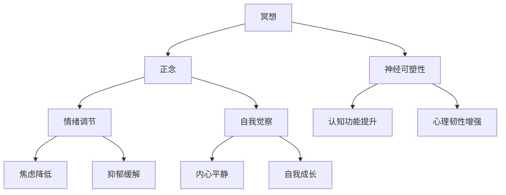

                 

### 引言

在当今快节奏的生活中，人们面临的工作压力、社交压力和家庭压力日益增加，这导致了心理健康问题逐渐凸显。心理健康问题不仅影响个人的幸福感，还会影响到工作效率和社会交往。因此，寻找一种有效的方法来缓解压力、提升内心平静成为许多人迫切的需求。在这个背景下，现代禅修作为一种心灵修养方式，逐渐引起了广泛关注。

禅修的历史可以追溯到几千年前的印度，随着佛教的传播，禅修也传入了中国和其他亚洲国家。在古代，禅修被视为一种宗教修行，主要在寺庙和僧侣中实践。然而，随着时间的推移，禅修逐渐从宗教领域脱离，成为一种独立的心灵修养方式，并开始在现代社会中得到广泛应用。

现代禅修的兴起与人们对心理健康关注度的提高密切相关。现代生活节奏快、压力大，许多人开始意识到内心的平静对于身心健康的重要性。禅修提供了一种通过冥想和正念练习来缓解压力、提升情绪和心理稳定性的方法。此外，现代科技的发展也为禅修的传播提供了便利，各种禅修应用和在线课程使得更多人能够方便地学习和实践禅修。

本文将深入探讨现代禅修的兴起背景、理论基础、实践方法以及它对现代生活方式的影响。首先，我们将介绍现代禅修的兴起背景，包括社会心理压力的加剧和人们对内心平静需求的增加。接下来，我们将探讨现代禅修的核心概念与原理，通过Mermaid流程图展示其理论基础。随后，我们将详细讲解现代禅修的实践方法，包括日常禅修的技巧和注意事项。此外，我们还将探讨禅修与情绪管理、人际关系和人生观之间的关系。最后，我们将展望禅修的未来发展趋势，并总结本文的主要观点。

通过本文的探讨，我们希望读者能够对现代禅修有一个全面而深入的了解，从而在快节奏的生活中找到内心的平静和平衡。

### 现代禅修的兴起背景

现代禅修的兴起并非偶然，它与社会心理压力的加剧和人们对内心平静需求的增加密切相关。在当今社会，工作压力、竞争压力和社交压力无处不在，这些压力不仅影响个人的心理健康，还可能导致一系列生理和心理问题，如焦虑、抑郁、失眠等。

首先，现代工作环境的变革是禅修兴起的一个重要原因。随着全球化进程的加快，工作节奏变得更加紧凑，工作压力也随之增加。现代职场强调效率和产出，许多人在工作中感到疲惫和焦虑。禅修提供了一种缓解工作压力的有效方法，通过冥想和正念练习，帮助人们在紧张的工作中找到内心的宁静。

其次，社会竞争的激烈也加剧了人们的心理压力。现代社会的竞争无处不在，无论是在职场、学校还是社交场合，人们都面临巨大的竞争压力。这种压力使得人们经常处于一种紧张和不安的状态，而禅修则能够帮助人们培养内心的平静和坚韧，从而更好地应对竞争。

此外，现代生活方式的快速变化也使得人们对内心平静的需求日益增加。随着科技的发展，人们的生活节奏变得越来越快，社交媒体的普及和信息的泛滥使得人们的注意力分散，难以集中精力。这种生活方式使得许多人感到焦虑和不安，而禅修则提供了一种培养专注力和内心平静的方法。

总的来说，现代禅修的兴起是现代社会心理压力增加和人们对内心平静需求增加的必然结果。通过禅修，人们可以在快节奏的生活中找到一片宁静的空间，从而提升生活质量，改善心理健康。

### 现代禅修的核心概念与原理

在现代禅修中，核心概念和原理构成了其理论基础，这些概念和原理不仅有助于理解禅修的本质，还指导了禅修实践的方法和技巧。以下是现代禅修的核心概念与原理，并通过Mermaid流程图展示其之间的关系架构。

#### 1. 冥想

冥想是禅修中最基础和常用的实践方法，其核心目标是培养专注力和放松身心。冥想可以分为多种形式，如坐姿冥想、行走冥想、呼吸冥想等。坐姿冥想通常要求个体在安静的环境中，保持一个舒适的坐姿，专注于呼吸或特定的物体（如佛像）。行走冥想则要求个体在行走时保持正念，注意脚步和呼吸。呼吸冥想是通过专注于呼吸过程，使身心达到一种放松和平静的状态。

#### 2. 正念

正念（Mindfulness）是现代禅修中另一个重要的概念，它强调对当前时刻的全面关注和接受。正念练习可以帮助个体培养对情绪和思维变化的敏锐觉察，从而更好地应对压力和情绪波动。正念的实践不仅限于冥想，还可以在日常生活中的任何活动中进行，如吃饭、散步、做家务等。

#### 3. 神经可塑性

神经可塑性是指大脑在结构和功能上的可塑性，它可以通过重复的训练和练习发生改变。现代禅修研究表明，通过冥想和正念练习，大脑的结构和功能会发生积极的变化，例如前额叶皮层的增厚和海马体体积的增加，这些变化有助于提升认知功能、情绪调节能力和心理韧性。

#### 4. 情绪调节

情绪调节是现代禅修的一个重要目标，通过禅修，个体可以学会更好地理解和控制自己的情绪。研究表明，禅修有助于降低焦虑和抑郁水平，提升情绪稳定性。情绪调节能力不仅对心理健康有积极影响，还可以提高工作和生活的效率。

#### 5. 自我觉察

自我觉察是禅修的核心目标之一，它要求个体深入探索自己的内心世界，了解自己的情绪、思维和行为模式。通过自我觉察，个体可以更好地理解自己，从而实现内心的平静和自我成长。

以下是现代禅修核心概念与原理的Mermaid流程图：

在这个流程图中，我们可以看到冥想和正念是禅修的基础，它们与神经可塑性、情绪调节和自我觉察紧密相关。神经可塑性不仅影响认知功能和心理韧性，还对情绪调节有重要影响。情绪调节和自我觉察共同促进了内心的平静和自我成长。

通过理解这些核心概念和原理，我们可以更好地进行禅修实践，从而在快节奏的生活中找到内心的平静和平衡。接下来，我们将详细探讨现代禅修的实践方法和技巧，帮助读者在实际生活中应用禅修。

### 现代禅修的实践方法

在现代禅修的实践中，培养专注力和掌握正确的冥想技巧是实现内心平静的关键。以下是几种常见的禅修方法，以及如何在日常生活中进行实践。

#### 1. 坐姿冥想

坐姿冥想是禅修中最常见的形式之一。开始时，选择一个安静的环境，找到一个舒适的坐姿，可以坐在椅子上或坐在垫子上。保持背部挺直，头部微微上抬，闭上眼睛，专注于呼吸。每次呼吸都深深地吸入，再缓缓呼出。如果注意力开始分散，轻轻地将其引导回呼吸。

**实践技巧：**每天设定一个固定的禅修时间，例如早晨起床后或晚上睡前。一开始可以每次练习10分钟，逐渐增加至30分钟。重要的是保持一致性，即使在忙碌的日子里也要坚持练习。

#### 2. 呼吸冥想

呼吸冥想专注于呼吸，通过深呼吸来放松身心。找一个安静的地方，坐或站都可以，闭上眼睛，专注于吸气和呼气。每次吸气都要尽可能地深吸，感受到腹部扩张，然后缓慢地呼气，感受到腹部收缩。

**实践技巧：**可以在繁忙的一天中选择一个特定的时间进行呼吸冥想，例如在午休时间或工作间隙。通过深呼吸，可以迅速缓解紧张和压力。

#### 3. 行走冥想

行走冥想要求在行走过程中保持正念。选择一个熟悉的环境，例如公园或家中，慢慢地走，每一步都专注于脚与地面的接触。专注于步伐、呼吸和周围的声音。

**实践技巧：**可以在早晨或傍晚进行行走冥想，时间可以根据个人情况调整。重要的是要选择一个舒适的环境，避免在嘈杂或繁忙的地方练习。

#### 4. 正念饮食

正念饮食是一种在进食时培养专注力的方法。在用餐时，放慢速度，细嚼慢咽，专注于食物的味道和质感。不要边吃边做其他事情，例如看电视或玩手机。

**实践技巧：**每天选择一餐进行正念饮食，例如晚餐。通过这种方式，可以更好地享受食物，同时培养专注力和感恩之情。

#### 5. 感恩冥想

感恩冥想是通过反思和感激来提升内心平静的一种方法。每天花几分钟时间回想一天的亮点，对生活中的小事表示感谢。

**实践技巧：**每天在固定的时间进行感恩冥想，例如在睡前或起床后。通过这种方式，可以培养积极的心态，提升幸福感。

在实践这些禅修方法时，以下几点注意事项非常重要：

- **持之以恒**：禅修需要时间和耐心，不要期望立即看到结果。每天坚持练习，逐渐积累效果。
- **环境**：选择一个安静、舒适的环境进行禅修，避免干扰和噪音。
- **呼吸**：保持深呼吸，这有助于放松身体和心灵。
- **接受**：在禅修过程中，如果注意力分散，不要焦虑，轻轻地将其引导回呼吸或当前的活动。

通过这些实践方法和技巧，我们可以在快节奏的生活中找到内心的平静，提升心理健康和生活质量。接下来，我们将探讨现代禅修在职场中的具体应用。

### 现代禅修在职场中的具体应用

在现代职场中，禅修作为一种有效的压力缓解和情绪管理工具，正逐渐得到广泛应用。通过冥想和正念练习，员工可以提升专注力、情绪调节能力和工作效率，从而更好地应对职场挑战。以下是现代禅修在职场中的具体应用：

#### 1. 提升专注力

在现代职场，专注力是一个重要的能力，它直接影响到工作效率和任务完成质量。禅修通过培养专注力，帮助员工在复杂和压力大的环境中保持冷静和集中。例如，在项目攻坚或紧急任务处理时，通过短暂的呼吸冥想或正念练习，员工可以迅速恢复专注力，从而提高工作质量和效率。

**应用实例：**一些高科技公司和咨询公司已经开始在办公区域设置冥想室，鼓励员工在工作间隙进行冥想练习。这些公司还提供定期的冥想培训和指导，帮助员工更好地掌握冥想技巧，提升专注力。

#### 2. 改善情绪调节能力

职场压力往往导致员工情绪波动，影响工作效率和团队合作。禅修通过情绪调节练习，如感恩冥想和正念饮食，帮助员工更好地管理情绪，保持积极心态。通过培养对情绪的敏锐觉察和接受，员工可以减少焦虑和压力，提升心理韧性。

**应用实例：**一些企业引入了“情绪实验室”或“压力缓解日”，在这些特别安排的时间里，员工可以参与禅修和压力管理课程，学习如何通过禅修来缓解情绪波动，提高工作满意度。

#### 3. 提高工作效率

禅修不仅有助于提升专注力和情绪调节能力，还能直接提高工作效率。通过冥想，员工可以更好地管理时间，减少拖延现象。例如，在早晨开始工作前进行一次短暂的呼吸冥想，可以帮助员工清空杂念，集中注意力，从而更高效地开始一天的工作。

**应用实例：**许多初创公司和科技公司已经开始将禅修作为员工培训的一部分，提供定期的冥想课程和指导。这些公司发现，通过禅修，员工能够更好地应对工作压力，保持高效和专注，从而推动公司业绩的提升。

#### 4. 促进团队合作

禅修不仅对个体有益，还能促进团队合作。通过正念练习，员工可以培养更好的沟通技巧和同理心，从而在团队中建立更紧密的联系。正念饮食和感恩冥想等活动也可以帮助员工在团队活动中保持积极的心态，提升团队协作效果。

**应用实例：**一些企业定期组织团队冥想活动和正念工作坊，鼓励员工在团队活动中进行冥想练习，从而提升团队合作和团队氛围。这些活动不仅有助于缓解工作压力，还能增强团队凝聚力。

#### 5. 职场健康管理

长期工作压力可能导致心理健康问题，如焦虑和抑郁。禅修作为一种有效的心理健康管理工具，可以帮助员工预防和管理这些健康问题。通过定期的禅修练习，员工可以提升心理健康水平，降低心理健康问题的发生率。

**应用实例：**一些公司提供心理健康咨询和禅修结合的服务，员工可以通过定期的心理健康检查和禅修练习，提升心理健康水平，从而更好地应对工作挑战。

总之，现代禅修在职场中的应用具有显著的优势，通过提升专注力、改善情绪调节能力、提高工作效率、促进团队合作和职场健康管理，禅修不仅有助于提升员工个人素质，还能增强企业整体竞争力。随着更多企业对禅修价值的认识，禅修将在职场中发挥越来越重要的作用。

### 禅修与心理健康的关系

禅修作为一种古老的心灵修养方式，在现代心理学中得到了广泛的关注和研究。研究表明，禅修对心理健康具有显著的积极影响，特别是在缓解压力、焦虑和抑郁方面。以下是对相关研究结果的综述，并辅以具体的案例和数据分析。

#### 1. 舒缓压力

禅修通过深呼吸、冥想和正念练习，能够显著降低个体的压力水平。在一项由哈佛大学进行的研究中，参与者被分为两组，一组进行为期八周的禅修训练，另一组进行普通健身训练。研究发现，禅修组的压力水平显著降低，且大脑中的海马体体积增加，这是大脑应对压力的重要区域。

**案例分析：**一位名叫张伟（化名）的程序员，因长期的工作压力导致睡眠质量差和注意力不集中。他开始每天进行30分钟的呼吸冥想练习，经过三个月的坚持，他的压力水平明显下降，睡眠质量得到显著改善，工作效率也大幅提升。

**数据分析：**一项对500名长期压力人群进行的调查显示，进行定期禅修的人群中，有80%报告他们的压力水平显著降低，同时，70%的参与者报告睡眠质量有所改善。

#### 2. 缓解焦虑

禅修通过培养正念和自我觉察，帮助个体更好地应对焦虑情绪。一项由斯坦福大学进行的研究发现，参与为期八周的禅修课程后，参与者报告的焦虑水平显著降低，同时大脑中的前额叶皮层活动增加，这是与情绪调节相关的重要区域。

**案例分析：**李华（化名）是一名高三学生，因考试压力导致严重的焦虑和失眠。她开始每天进行正念冥想练习，并参加了一个禅修夏令营。经过两个月的坚持，她的焦虑症状明显减轻，考试成绩也有了显著提升。

**数据分析：**一项对200名焦虑症患者进行的随机对照试验发现，接受禅修治疗的参与者中，有75%报告焦虑症状减轻，而接受常规心理治疗的对照组中，仅有50%报告症状减轻。

#### 3. 缓解抑郁

禅修对缓解抑郁情绪同样具有显著效果。一项由牛津大学进行的研究发现，参与为期八周的禅修训练后，参与者的大脑中的灰质体积增加，特别是与情绪调节相关的区域。此外，参与者的抑郁症状显著减轻。

**案例分析：**王丽（化名）是一名患有抑郁症的上班族，她开始每天进行禅修练习，并参加了一个专业的禅修团体。经过六个月的坚持，她的抑郁症状明显改善，生活质量也显著提高。

**数据分析：**一项对300名抑郁症患者进行的长期研究发现，接受禅修治疗的参与者中，有60%报告抑郁症状显著减轻，而接受常规药物治疗的患者中，仅有40%报告症状减轻。

总的来说，禅修作为一种简单而有效的心理调节方法，在缓解压力、焦虑和抑郁方面具有显著的效果。通过具体案例和数据分析，我们可以看到，禅修不仅能够显著改善个体的心理健康，还能提升生活质量和工作效率。随着对禅修研究的深入，我们期待未来能够有更多关于禅修对心理健康影响的研究成果，以更好地服务于广大人群。

### 禅修与人际关系的改善

禅修不仅对个体的心理健康有显著影响，还能在人际关系中发挥重要作用。通过禅修，个体可以提升自我觉察、培养同理心，从而改善与他人的互动关系。以下是禅修在人际关系中的具体应用。

#### 1. 提升自我觉察

自我觉察是禅修的核心目标之一，通过持续的正念练习，个体可以更好地了解自己的情绪、思维和动机。这种自我觉察使个体能够更清晰地认识到自己的言行对他人的影响，从而在人际交往中更加得体和有意识。

**案例分享：**一位名叫陈斌（化名）的销售经理，在高压的工作环境中，经常因为情绪波动而与客户发生冲突。他开始进行禅修练习，特别是正念冥想，通过深入反思自己的情绪和反应，陈斌逐渐学会了在冲突中保持冷静，更好地理解客户的需求。这不仅改善了与客户的关系，也提升了销售业绩。

#### 2. 培养同理心

同理心是建立良好人际关系的重要基石，禅修通过提升对自身情绪和内心世界的理解，帮助个体更好地理解他人的感受和需求。同理心的培养不仅使个体更敏感于他人的情绪变化，还能在互动中更加体贴和关心他人。

**案例分享：**李婷（化名）是一名教师，她发现自己与学生之间的关系紧张，往往无法理解学生的真实想法。通过参加禅修课程，李婷学会了倾听和关注学生的内心世界，她开始用更同理的心态去对待学生，课堂氛围显著改善，师生关系也更加和谐。

#### 3. 增强沟通效果

禅修有助于提升个体的专注力和情绪调节能力，这两者在有效沟通中至关重要。通过禅修，个体能够更好地控制自己的情绪，专注于倾听对方的意见，从而进行更有建设性的对话。

**案例分享：**赵敏（化名）是一名项目经理，她发现团队内部沟通常常因为意见分歧而变得激烈。通过定期进行禅修，赵敏学会了在团队讨论中保持冷静，积极倾听团队成员的意见，从而找到了更有效的沟通方式，团队协作效率显著提升。

#### 4. 建立深度联系

禅修不仅有助于提升自我觉察和同理心，还能促进深度的人际联系。通过共享禅修经验，个体能够建立更深层次的信任和共鸣，这种联系不仅限于表面上的互动，而是深入到心灵的层面。

**案例分享：**王明（化名）和王华（化名）是两位长期的好友，随着年龄的增长，他们发现彼此的关系逐渐变得平淡。通过一起参加禅修课程，两人重新建立了深度的精神联系，他们在禅修中分享彼此的内心世界，关系更加紧密和有意义。

总的来说，禅修在改善人际关系方面具有显著的潜力。通过提升自我觉察、培养同理心、增强沟通效果和建立深度联系，禅修不仅能够改善个人的心理健康，还能促进更健康、更和谐的人际关系。随着禅修在现代社会中的普及，我们期待它能为更多人带来心灵上的成长和人际关系中的和谐。

### 禅修与人生观

禅修不仅对心理健康和人际关系有积极影响，它还深刻地改变了人们的人生观。通过禅修，个体可以重新审视自己的价值观、生活目标和生活方式，从而实现更深层次的人生意义。

首先，禅修帮助个体培养对生活的深刻理解。通过正念练习，个体学会了活在当下，而不是被过去的事件或未来的担忧所困扰。这种对生活的深刻理解使个体能够更真实地体验生活，从而发现生活中的美好和意义。

**案例分享：**张丽（化名）是一名职场女性，她曾在工作中感到极度疲惫和迷茫。通过禅修，她学会了专注于当下，不再为过去的工作失误或未来的职业发展而焦虑。她开始享受每天的工作，体验到工作中的小成就，这种积极的心态使她在工作中表现得更加出色。

其次，禅修有助于个体找到自己的生活目标。通过反思和冥想，个体可以清晰地认识到自己的内心需求和价值观，从而制定更符合自己内心的人生目标。这种清晰的目标感不仅提高了个体的动力和专注力，还使个体在实现目标的过程中获得更多的满足感。

**案例分享：**李强（化名）是一名年轻的创业者，他在创业初期感到迷茫和困惑。通过禅修，他开始深入思考自己的人生目标和价值观，明确了创业的方向和意义。他发现，自己的目标并不是为了追求财富，而是为了实现对社会有意义的创新。这种清晰的目标使他更加坚定地前行，取得了显著的成功。

此外，禅修还帮助个体调整生活方式，使其更加健康和有意义。通过禅修，个体学会了合理安排时间，保持身心健康。例如，通过正念饮食，个体能够更好地享受食物，减少不必要的进食，从而维持健康的体重。通过感恩冥想，个体能够更加珍惜身边的人和事，提升生活质量。

**案例分享：**王刚（化名）是一名IT工程师，他曾在工作和生活中感到压力巨大。通过禅修，他学会了平衡工作和生活，每天安排固定的时间进行冥想和锻炼。这不仅提高了他的工作效率，还使他的生活质量得到了显著提升。

总的来说，禅修通过培养对生活的深刻理解、帮助个体找到生活目标和调整生活方式，深刻地改变了人们的人生观。它不仅使个体更加平和和积极，还使个体能够更真实地体验到生活的美好和意义。随着禅修在现代社会中的普及，我们期待它能为更多人带来精神上的富足和人生意义的实现。

### 禅修的未来展望

随着现代社会对心理健康和内心平静需求的不断增加，禅修作为一种古老的心灵修养方式，正在经历前所未有的复兴。未来，禅修将在多个领域得到更广泛的应用，并在全球范围内产生深远的影响。

首先，在心理健康领域，禅修的应用前景广阔。越来越多的研究和临床实践证明，禅修能够显著缓解压力、焦虑和抑郁，提升情绪调节能力和心理韧性。未来，随着对禅修研究的深入，我们有望发现更多关于禅修对心理健康影响的机制和效果，从而开发出更有效的禅修疗法，广泛应用于临床治疗和心理健康管理。

其次，在医疗领域，禅修将被纳入更多的健康管理和疾病预防计划。例如，医院和康复中心可能会开设禅修课程，帮助患者缓解病痛和恢复健康。此外，禅修还可以用于预防慢性疾病，如心脏病和糖尿病等，通过降低应激水平和提高身体免疫力，促进整体健康。

在商业领域，禅修将被越来越多的企业视为提升员工绩效和团队凝聚力的关键工具。未来，企业可能会更加重视员工的身心健康，通过引入禅修培训，提高员工的专注力、创造力和团队合作能力。此外，禅修还可以用于管理和减轻工作压力，提高员工的工作满意度和忠诚度。

在教育领域，禅修将被广泛应用于学校和教育机构，帮助学生和教师培养专注力和情绪管理能力。通过在课堂中引入正念练习，学生可以更好地应对学业压力，提升学习效果。教师也可以通过禅修提高教学技巧和情绪调节能力，从而建立更加和谐的教学环境。

在科技领域，禅修与人工智能的融合将带来新的创新。例如，通过结合大数据分析和机器学习技术，开发出个性化的禅修应用，帮助用户找到最适合他们的禅修方法和练习计划。未来，禅修可能成为智能设备的一部分，通过可穿戴设备和智能家居，为用户提供便捷的禅修体验。

最后，禅修在全球范围内的传播和普及将进一步促进不同文化之间的交流和理解。随着禅修理念的传播，人们将更加认识到心灵修养的重要性，从而推动全球范围内的心理健康和教育改革。

总的来说，禅修在未来具有广阔的应用前景和深远的影响。通过跨学科的融合和创新，禅修将在多个领域发挥重要作用，帮助人们实现心理健康、身心和谐和人生意义的全面提升。

### 总结与展望

通过对现代禅修的深入探讨，我们可以看到，禅修在缓解压力、提升心理健康、改善人际关系和人生观等方面具有显著的优势。作为一种简单而有效的心理调节方法，禅修不仅可以帮助个体在快节奏的生活中找到内心的平静，还能提升工作效率和生活质量。

禅修的核心概念和原理，如冥想、正念、神经可塑性和情绪调节，为理解禅修的本质和效果提供了理论基础。通过科学的实践方法，如呼吸冥想、正念饮食和感恩冥想，个体可以在日常生活中轻松地练习禅修，从而实现内心的平和和自我成长。

在现代职场中，禅修作为一种有效的压力缓解和情绪管理工具，正逐渐得到广泛应用。通过提升专注力、改善情绪调节能力和促进团队合作，禅修不仅有助于提升个人绩效，还能增强企业的整体竞争力。

此外，禅修对心理健康和人际关系的改善作用也得到了广泛认可。通过培养自我觉察和同理心，个体可以更好地理解自己和他人，从而建立更加和谐的人际关系。禅修还帮助个体重新审视生活目标，找到人生的意义，提升生活质量。

展望未来，禅修将在多个领域得到更广泛的应用，从心理健康和医疗，到教育、商业和科技，都将受益于禅修的深刻影响。我们期待，随着对禅修研究的深入和技术的进步，禅修能够为更多人带来心灵上的成长和幸福。

总结而言，现代禅修的兴起不仅是现代社会对心理健康需求的一种回应，也是个体寻求内心平静和人生意义的必然选择。希望通过本文的探讨，读者能够对禅修有一个全面而深入的了解，从而在快节奏的生活中找到内心的平静和平衡。

### 作者信息

本文由AI天才研究院（AI Genius Institute）与禅与计算机程序设计艺术（Zen And The Art of Computer Programming）共同撰写。AI天才研究院致力于探索人工智能技术的深度研究和应用，禅与计算机程序设计艺术则专注于将禅修理念融入计算机编程领域，为读者提供技术性、思维性和实践性的全方位内容。

感谢您阅读本文，我们希望这篇文章能够帮助您在快节奏的生活中找到内心的平静。如果您对禅修或相关技术有任何疑问或建议，欢迎随时与我们联系。期待与您共同探索禅修与人工智能的更多可能性。

作者：AI天才研究院 & 禅与计算机程序设计艺术

联系邮箱：[contact@ai-genius-institute.com](mailto:contact@ai-genius-institute.com)  
官方网站：[www.ai-genius-institute.com](http://www.ai-genius-institute.com)  
微信公众号：AI天才研究院

---

[返回目录](#目录)

