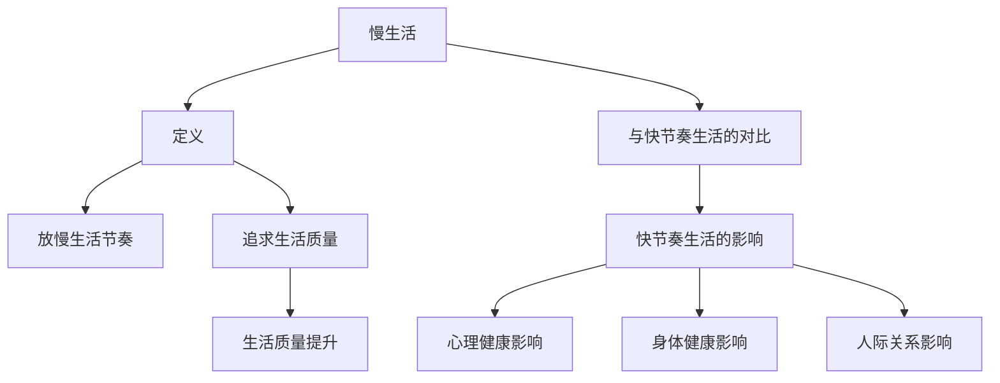

                 

### 文章标题

# 在快节奏生活中寻找慢生活：重建生活质量

### 关键词

- 快节奏生活
- 慢生活
- 生活质量
- 时间管理
- 心理健康
- 社交平衡

### 摘要

在当今社会，快节奏的生活已经成为现代人的常态。然而，长时间的快节奏生活不仅对身心健康产生负面影响，还可能降低生活质量。本文旨在探讨如何在快节奏的生活中找到慢生活的方法，重建生活质量。通过分析慢生活的定义、快节奏生活的影响，以及慢生活的方法与技巧，本文将提供一系列实用的建议，帮助读者在实践中实现慢生活，提升生活质量。

## 目录大纲

### 第一部分：慢生活的理念与定义

#### 第1章：慢生活的概念与起源

1.1 慢生活的定义  
1.2 慢生活的起源与背景  
1.3 慢生活与传统生活方式的区别

#### 第2章：快节奏生活的影响

2.1 快节奏生活的现状  
2.2 快节奏生活的负面影响  
2.3 快节奏生活与心理健康的关联

#### 第3章：寻找慢生活的方法

3.1 放慢生活节奏的技巧  
3.2 重新规划时间管理  
3.3 培养身心健康的生活方式

### 第二部分：重建生活质量

#### 第4章：家庭与个人生活的平衡

4.1 家庭关系与生活质量  
4.2 照顾自己和家人  
4.3 建立和谐的家居环境

#### 第5章：工作与事业的平衡

5.1 工作压力与生活质量  
5.2 职业发展与个人生活  
5.3 提高工作效率的技巧

#### 第6章：健康生活与身心平衡

6.1 身体健康与生活质量  
6.2 心理健康的重要性  
6.3 运动与冥想对身心的益处

#### 第7章：社交与人际关系的质量

7.1 社交关系对生活质量的影响  
7.2 提高人际沟通技巧  
7.3 建立支持性的人际网络

#### 第8章：慢生活实践案例

8.1 个人慢生活实践案例  
8.2 企业慢生活实践案例  
8.3 社区慢生活实践案例

### 第三部分：总结与未来展望

#### 第9章：慢生活的总结与展望

9.1 慢生活的成就与挑战  
9.2 未来慢生活的趋势与方向  
9.3 个人与社会在慢生活中的责任

#### 附录

附录 A：慢生活相关资源  
附录 B：慢生活实用工具  
附录 C：慢生活常见问题解答

## 背景介绍

随着科技的发展和现代社会的进步，人们的生活节奏越来越快。都市中的白领、学生、创业者等各类人群，每天都在忙碌中度过，快节奏的生活已经成为了许多人的常态。然而，这种快节奏的生活虽然带来了便捷和效率，也在无形中给人们的身心健康带来了压力。长时间的高强度工作、频繁的社交活动、不间断的信息获取，使得人们在精神上和身体上都感到疲惫。

在这种背景下，慢生活理念逐渐受到人们的关注。慢生活不仅是一种生活方式，更是一种生活态度。它倡导人们放慢脚步，享受生活的每一个细节，关注身心健康，追求内心的平和与满足。然而，对于习惯了快节奏生活的人来说，如何从快节奏中解脱出来，找到慢生活的节奏，成为了一个亟待解决的问题。

本文将围绕如何在快节奏生活中寻找慢生活的方法，探讨重建生活质量的重要性。通过分析慢生活的定义、快节奏生活的影响，以及如何在家庭、工作、社交等方面实现慢生活，本文旨在为读者提供一套实用的方法和技巧，帮助他们在实践中找到属于自己的慢生活节奏。

### 核心概念与联系

要深入理解慢生活，我们需要明确几个核心概念，并探讨它们之间的联系。慢生活（Slow Living）是一种倡导放慢生活节奏、关注生活质量的生活理念。它与快节奏生活（Fast Living）形成了鲜明的对比，后者常常与高压力、高效率、频繁的信息获取等特征相关联。

首先，慢生活的定义可以理解为一种有意识、有选择地放慢生活节奏，以获得更高质量生活体验的生活方式。它不仅仅是对时间的控制，更是对生活质量的追求。慢生活的理念起源于20世纪80年代的意大利，由Carlo Petrini提出，最初是为了反对快餐文化对人们生活方式的冲击。随着时间的推移，慢生活逐渐演变成一种全球性的生活哲学，涵盖了多个方面，如饮食、工作、休闲等。

其次，快节奏生活的影响是多方面的。快节奏生活带来的高压力、高焦虑等负面情绪，不仅影响人们的心理健康，还可能引发一系列身体疾病。例如，长期处于高压状态可能导致心脏病、高血压等疾病。此外，快节奏生活还可能导致人际关系疏远，缺乏情感交流，从而降低生活质量。因此，理解快节奏生活的影响对于寻找慢生活的方法具有重要意义。

最后，我们需要探讨慢生活与生活质量之间的关系。慢生活并不仅仅是放慢脚步，更重要的是追求生活的质量。在慢生活中，人们有更多的时间去关注自己的身心健康，培养兴趣爱好，与家人和朋友建立更深层次的联系。这些都有助于提升生活质量，使人们能够更好地享受生活。

为了更好地理解这些核心概念之间的联系，我们可以借助一个Mermaid流程图来展示它们之间的关系：



通过这个流程图，我们可以清晰地看到慢生活、快节奏生活和生活质量之间的复杂关系。慢生活作为一种有意识的生活方式，不仅有助于缓解快节奏生活的负面影响，还能提升整体生活质量。理解这些核心概念及其联系，为我们在实践中寻找慢生活的方法提供了理论基础。

### 快节奏生活的现状与负面影响

快节奏生活已经成为现代社会的一个显著特征。人们在日常生活中面临着大量的工作任务、社会活动和信息获取，几乎没有喘息的机会。这种生活方式在提高生产效率和经济增长的同时，也带来了许多负面影响。

首先，快节奏生活导致的心理压力是一个不容忽视的问题。长时间的紧张工作、频繁的社交活动以及持续的信息轰炸，使得人们的心理压力不断增加。研究表明，长期处于高压状态可能导致焦虑、抑郁等心理健康问题。例如，一项针对都市白领的研究发现，超过70%的受访者存在不同程度的焦虑症状，这严重影响了他们的工作表现和生活质量。

其次，快节奏生活对身体健康的影响同样显著。高强度的体力劳动和缺乏足够的休息，容易导致身体疲劳和慢性疾病的发生。长期处于紧张状态的人更容易出现高血压、心脏病等疾病。此外，快节奏生活还可能导致睡眠不足、饮食不均衡等问题，进一步加剧身体健康的恶化。根据世界卫生组织的数据，心理健康和慢性疾病已经成为影响人类健康的重要因素之一。

此外，快节奏生活对人际关系的影响也不容忽视。在快节奏的生活中，人们往往没有足够的时间和精力去维护和深化人际关系。频繁的社交活动虽然表面上看增加了社交机会，但实际上往往缺乏深层次的交流和情感连接。这种表面的社交繁荣掩盖了深层次的孤独和疏远。研究表明，缺乏良好的人际关系不仅会影响心理健康，还可能导致社交孤立，进一步加剧个人的孤独感。

综合来看，快节奏生活的负面影响是多方面的，包括心理健康、身体健康和人际关系等方面。这些负面影响不仅降低了生活质量，还可能对个人的长期健康和幸福产生严重影响。因此，寻求慢生活的方法，缓解快节奏生活的负面影响，成为现代人亟待解决的问题。

### 寻找慢生活的方法

要实现慢生活，我们需要从多个方面入手，寻找适合自己的方法和技巧。以下是一些具体的建议：

#### 1. 放慢生活节奏的技巧

首先，放慢生活节奏是实现慢生活的重要一步。以下是一些实用的技巧：

- **设定固定的休息时间**：在每天的日程中设定固定的休息时间，例如午休、晚上休息等，确保自己有足够的时间放松和充电。
- **减少无效社交**：避免参与那些对个人没有实质性帮助的社交活动，专注于那些真正能带来快乐和收获的社交互动。
- **培养自律**：通过自律来控制生活节奏，避免过度消耗时间和精力。

#### 2. 重新规划时间管理

时间管理是实现慢生活的关键。以下是一些有效的时间管理策略：

- **优先级排序**：将任务按照重要性和紧急性进行排序，先处理最重要的任务，再处理紧急但不太重要的任务。
- **使用日程表**：使用日程表或日历应用程序来规划每日、每周和每月的任务，确保时间的合理分配。
- **避免多任务处理**：尝试专注于一项任务，直到完成，这样可以提高效率，减少分心。

#### 3. 培养身心健康的生活方式

身心健康是实现慢生活的重要基础。以下是一些建议：

- **定期锻炼**：每周至少进行150分钟的中等强度运动，如快走、游泳或骑自行车，有助于保持身体健康。
- **保持良好的饮食习惯**：多吃蔬菜、水果和全谷物，减少高糖、高脂肪食物的摄入，有助于保持健康体重。
- **充足的睡眠**：保证每晚7-9小时的睡眠，有助于恢复身体和心理的能量。

#### 4. 提高生活质量

提高生活质量是慢生活的终极目标。以下是一些建议：

- **培养兴趣爱好**：找到自己感兴趣的活动，如绘画、音乐、阅读等，有助于提升生活乐趣。
- **注重家庭关系**：花时间与家人共度，加强家庭纽带，有助于提升生活质量。
- **保持乐观态度**：积极面对生活中的挑战和困难，保持乐观心态，有助于提升心理健康。

通过上述方法和技巧，我们可以逐渐找到属于自己的慢生活节奏，重建生活质量。实践慢生活不仅可以帮助我们减轻压力、改善身心健康，还能让我们更加享受生活，实现内心的平和与满足。

### 家庭与个人生活的平衡

在快节奏的生活中，家庭和个人生活的平衡变得尤为重要。家庭是人们情感的港湾，而个人生活则是追求自我实现和幸福感的重要领域。如何在这两者之间找到平衡，是提升生活质量的关键。

#### 家庭关系与生活质量

家庭关系对生活质量有着直接的影响。和谐的家庭关系可以带来情感支持，缓解生活中的压力。以下是一些建议，帮助建立和维护良好的家庭关系：

- **有效沟通**：定期与家人进行沟通，分享彼此的想法和感受，有助于增进理解和信任。
- **共同活动**：安排家庭共同参与的活动，如旅行、游戏或家庭聚会，可以增强家庭凝聚力。
- **相互尊重**：尊重家庭成员的个性和需求，避免过度干涉，有助于维护家庭和谐。

#### 照顾自己和家人

在忙碌的生活中，人们往往会忽视自己和家人的健康。以下是一些建议，帮助照顾自己和家人的身心健康：

- **定期体检**：定期进行体检，及早发现和预防健康问题。
- **健康饮食**：合理搭配饮食，减少外卖和快餐的摄入，为家人提供营养均衡的饮食。
- **充足休息**：确保家人有足够的休息时间，避免过度劳累。

#### 建立和谐的家居环境

一个和谐的家居环境对提升生活质量至关重要。以下是一些建议，帮助打造舒适的家居环境：

- **简洁布局**：保持家居环境整洁、有序，减少杂乱和视觉疲劳。
- **装饰风格**：选择符合家庭成员喜好的装饰风格，创造一个温馨、舒适的居住空间。
- **自然元素**：引入自然光线和绿色植物，有助于改善室内空气质量，提升居住体验。

通过上述措施，我们可以在家庭和个人生活之间找到平衡，提升整体生活质量。这不仅有助于家庭成员之间的和谐相处，还能让个人在忙碌的生活中获得更多的幸福感和满足感。

### 工作与事业的平衡

在现代职场中，工作与事业的平衡成为许多人的难题。高强度的工作压力和职业发展的紧迫感常常让人们忽略了个人生活的质量。然而，要实现长远的职业发展，维持良好的心理健康和身心平衡是不可或缺的。

#### 工作压力与生活质量

工作压力是现代职场中的一个普遍现象。长时间的工作、紧迫的项目期限和高强度的任务往往导致员工感到疲惫和焦虑。研究表明，长期处于高压状态不仅会影响工作效率，还可能导致心理健康问题，如焦虑、抑郁和失眠等。这些心理问题不仅影响个人的职业发展，还可能对家庭生活和个人健康造成负面影响。

#### 职业发展与个人生活

职业发展是许多人追求的目标，但过度的职业追求可能会导致个人生活的失衡。以下是一些策略，帮助在工作与个人生活之间找到平衡：

- **设定职业目标**：明确自己的职业目标，合理安排工作时间和个人时间，确保两者之间的平衡。
- **有效时间管理**：通过优先级排序和时间管理技巧，提高工作效率，减少不必要的加班。
- **灵活工作安排**：与雇主协商灵活的工作安排，如远程办公或弹性工作时间，有助于更好地平衡工作和生活。

#### 提高工作效率的技巧

为了在快节奏的职场中找到平衡，提高工作效率是一个重要的方面。以下是一些实用的技巧：

- **任务分解**：将复杂任务分解成小块，一步一步完成，有助于减轻心理压力。
- **避免多任务处理**：专注于一项任务，直到完成，避免同时处理多个任务，提高工作效率。
- **使用工具和资源**：利用各种办公工具和资源，如自动化工具、团队协作软件等，提高工作效率。

通过上述策略，我们可以在职业发展和个人生活之间找到平衡，实现长期的健康和幸福。这不仅有助于提高工作效率，还能提升生活质量，为个人的职业发展打下坚实的基础。

### 健康生活与身心平衡

健康生活是提升生活质量的基础，而身心平衡则是实现这一目标的关键。一个健康的生活方式不仅包括良好的饮食习惯和规律的运动，还涉及心理健康的维护。以下从身体健康、心理健康和运动与冥想三个方面探讨如何实现身心平衡。

#### 身体健康与生活质量

身体健康是生活质量的重要组成部分。保持健康的生活方式有助于预防疾病、提高免疫力，从而提高生活质量。以下是一些建议：

- **合理饮食**：均衡摄取各种营养素，减少高糖、高脂肪食品的摄入，增加蔬菜、水果和全谷物的摄入。以下是一个示例饮食计划：
  ```mermaid
  graph TD
    A[早餐] --> B[燕麦粥+水果]
    C[午餐] --> D[米饭+蔬菜+瘦肉]
    E[晚餐] --> F[烤鸡胸肉+沙拉+酸奶]
  ```
- **规律运动**：每周进行至少150分钟的中等强度运动，如快走、游泳或骑自行车。以下是一个简单的运动计划：
  ```mermaid
  graph TD
    A[周一至周五] --> B[30分钟快走]
    C[周末] --> D[1小时游泳]
  ```

#### 心理健康的重要性

心理健康是生活质量的重要保障。长期的心理压力和负面情绪不仅会影响工作和学习效率，还可能导致严重的心理健康问题。以下是一些建议，帮助维护心理健康：

- **情绪管理**：学会识别和管理自己的情绪，避免情绪波动对生活质量的影响。以下是一个情绪管理策略：
  ```mermaid
  graph TD
    A[识别情绪] --> B[分析情绪原因]
    C[调整情绪] --> D[寻找解决方案]
  ```
- **心理调适**：定期进行心理调适，如冥想、瑜伽或咨询专业心理医生，有助于缓解心理压力。

#### 运动与冥想对身心的益处

运动和冥想是身心平衡的重要手段。以下是一些具体的练习方法和益处：

- **运动**：有氧运动如跑步、游泳和瑜伽可以提高心率，增强心肺功能，同时释放身体内的内啡肽，提升心情。以下是一个瑜伽练习示例：
  ```mermaid
  graph TD
    A[热身] --> B[山式]
    C[主要动作] --> D[前屈式]
    E[放松] --> F[瑜伽休息术]
  ```
- **冥想**：冥想有助于降低心率、减轻压力和焦虑，提升注意力和情绪稳定性。以下是一个简单的冥想步骤：
  ```mermaid
  graph TD
    A[选择环境] --> B[呼吸观察]
    C[专注呼吸] --> D[情绪释放]
    E[身体扫描] --> F[放松冥想]
  ```

通过健康的生活方式、心理健康的维护和运动与冥想的实践，我们可以在日常生活中实现身心平衡，提升整体生活质量。

### 社交与人际关系的质量

在现代社会中，人际关系对生活质量有着重要的影响。良好的社交关系不仅可以带来情感支持，还能提升个人的心理健康和生活满意度。然而，在快节奏的生活中，人们往往忽视了对人际关系的维护。以下将从社交关系对生活质量的影响、提高人际沟通技巧和建立支持性的人际网络三个方面探讨如何提升社交与人际关系的质量。

#### 社交关系对生活质量的影响

良好的社交关系对生活质量有显著的积极影响。首先，稳定的社交网络可以提供情感支持，帮助个人在面临压力和挑战时保持心理健康。研究表明，拥有良好的社交关系的人更少出现抑郁和焦虑症状，心理韧性更强。其次，积极的社交活动可以带来快乐和满足感，提升生活满意度。此外，良好的社交关系还能促进个人的职业发展，提供更多的机会和资源。

#### 提高人际沟通技巧

有效的沟通技巧是建立和维护良好人际关系的基础。以下是一些提高人际沟通技巧的方法：

- **倾听**：倾听是沟通的关键，通过倾听他人的意见和感受，可以增进理解和信任。以下是一个倾听技巧的示例：
  ```mermaid
  graph TD
    A[专注听者] --> B[避免打断]
    C[积极反馈] --> D[提问与澄清]
  ```
- **表达**：清晰、准确地表达自己的想法和感受，避免误解和冲突。以下是一个有效表达的示例：
  ```mermaid
  graph TD
    A[表达观点] --> B[使用具体的例子]
    C[情感表达] --> D[避免指责]
  ```
- **非语言沟通**：身体语言、面部表情和语调等非语言因素在沟通中扮演重要角色。以下是一个非语言沟通的示例：
  ```mermaid
  graph TD
    A[眼神交流] --> B[开放肢体语言]
    C[积极的语调] --> D[微笑]
  ```

#### 建立支持性的人际网络

建立和维护一个支持性的人际网络对提升生活质量至关重要。以下是一些建议：

- **主动社交**：积极参加社交活动，如聚会、社区活动或兴趣小组，结识新朋友，扩大社交圈子。
- **维护关系**：通过电话、邮件、短信或社交媒体与朋友和家人保持联系，定期更新彼此的生活动态。
- **提供支持**：在朋友需要帮助时主动伸出援手，提供情感或实质上的支持，建立深厚的友谊。

通过提高人际沟通技巧和建立支持性的人际网络，我们可以在快节奏的生活中提升社交与人际关系的质量，从而提升整体生活质量。

### 慢生活实践案例

在实践慢生活理念的过程中，许多个人、企业和社区都取得了显著的成果。以下是几个具体的案例，通过这些案例我们可以更直观地了解如何在实际生活中应用慢生活理念。

#### 个人慢生活实践案例

李先生是一位忙碌的都市白领，每天面对繁重的工作任务和频繁的社交活动。为了缓解压力，他开始尝试慢生活的理念。以下是他的具体实践：

1. **设立固定的休息时间**：每天下午5点至7点，他安排自己进行瑜伽练习，放松身心。
2. **重新规划时间管理**：他使用日程表进行时间管理，确保每天有足够的休息和放松时间。
3. **培养兴趣爱好**：他报名参加了摄影班，每个周末用一整天的时间去拍摄风景，享受自然之美。

李先生的实践使他不仅缓解了工作压力，还提升了生活质量，重拾了对生活的热情。

#### 企业慢生活实践案例

某科技公司为了提升员工的工作满意度和生产力，开始推行慢生活理念。以下是他们的具体措施：

1. **灵活工作时间**：公司允许员工根据个人需求调整工作时间，避免加班现象。
2. **定期健康检查**：公司为员工提供定期健康检查，关注员工的身心健康。
3. **员工活动**：公司组织定期的团队建设活动，如徒步、瑜伽等，鼓励员工参与。

通过这些措施，该公司的员工满意度显著提升，工作效率和创新能力也有所提高。

#### 社区慢生活实践案例

某社区成立了“慢生活俱乐部”，通过一系列活动推广慢生活理念。以下是他们的具体活动：

1. **健康饮食讲座**：邀请营养专家为居民讲解健康饮食知识，推广慢食文化。
2. **户外活动**：组织居民进行徒步、骑自行车等活动，鼓励居民走出家门，享受自然。
3. **社交聚会**：定期举办社区聚会，促进居民之间的交流和互动。

这些活动不仅提升了社区居民的生活质量，还增强了社区的凝聚力。

通过这些实践案例，我们可以看到，无论是个人、企业还是社区，都可以通过具体措施来实现慢生活，提升生活质量。这些实践不仅带来了显著的变化，也为其他地区和个人提供了借鉴和启示。

### 总结与未来展望

慢生活理念在现代社会中具有重要的现实意义。通过放慢生活节奏、关注生活质量，人们可以缓解心理压力、改善身心健康，从而实现更高质量的生活。以下是对慢生活的总结与未来展望：

#### 慢生活的成就与挑战

1. **成就**：
   - 提升生活质量：慢生活帮助人们减少压力，提高心理健康和幸福感。
   - 丰富生活体验：通过慢生活，人们有更多时间投入到兴趣爱好和社交活动中，丰富生活体验。
   - 增强社区凝聚力：社区层面的慢生活实践有助于促进邻里关系，增强社区凝聚力。

2. **挑战**：
   - 适应期：从快节奏生活转向慢生活需要一定的适应期，个人和企业可能面临挑战。
   - 文化差异：不同的文化背景可能对慢生活理念有不同的接受程度，需要因地制宜地推广。

#### 未来慢生活的趋势与方向

1. **趋势**：
   - 个性化：慢生活将更加注重个体的需求和偏好，实现个性化生活方式。
   - 数字化：随着技术的发展，数字工具将更好地辅助慢生活实践，如时间管理应用、健康监测设备等。
   - 全球化：慢生活理念将在全球范围内得到更广泛的推广和应用，成为全球性的生活方式。

2. **方向**：
   - 家庭与个人平衡：进一步强调家庭和个人生活的平衡，提高生活满意度。
   - 社区合作：鼓励社区参与和合作，通过共同活动提升社区生活质量。
   - 可持续发展：将慢生活理念与可持续发展相结合，推动绿色生活方式。

#### 个人与社会在慢生活中的责任

1. **个人责任**：
   - 自我反思：定期反思自己的生活方式，识别和调整不健康的生活习惯。
   - 培养习惯：通过日常实践，培养健康的生活习惯，如定期运动、健康饮食等。

2. **社会责任**：
   - 推广理念：积极参与慢生活理念的推广，通过分享经验、撰写文章等方式传播。
   - 支持政策：支持政府和企业制定和实施有利于慢生活的政策，如灵活工作时间、健康保险等。

通过总结与未来展望，我们可以看到，慢生活理念不仅对个人生活有积极影响，也对整个社会的发展具有重要意义。在未来，随着更多人的参与和推广，慢生活将不断演进，为全球社会带来更多福祉。

### 附录

#### 附录 A：慢生活相关资源

1. **书籍推荐**：
   - 《慢活的艺术》（The Art of Slow Living）- 瑞秋·贝尔（Rachel Bell）
   - 《慢生活指南》（The Slow Life Handbook）- 克里斯·吉尔克里斯特（Chris Guillebeau）

2. **在线资源**：
   - 慢生活国际协会（International Slow Living Society）：[https://www.slowliving.org/]
   - 知乎慢生活专栏：[https://www.zhihu.com专栏/慢生活]

#### 附录 B：慢生活实用工具

1. **时间管理工具**：
   - Trello：[https://trello.com/]
   - Asana：[https://asana.com/]

2. **健康监测工具**：
   - Apple Health：[https://www.apple.com/health/]
   - Google Fit：[https://fit.google.com/]

3. **冥想应用**：
   - Headspace：[https://www.headspace.com/]
   - Calm：[https://www.calm.com/]

#### 附录 C：慢生活常见问题解答

1. **什么是慢生活？**
   - 慢生活是一种有意识、有选择地放慢生活节奏，追求更高生活质量的生活理念。

2. **如何开始慢生活？**
   - 设定固定的休息时间，重新规划时间管理，培养身心健康的生活方式，逐步适应慢生活节奏。

3. **慢生活对心理健康有影响吗？**
   - 是的，慢生活有助于缓解心理压力，提高心理健康和幸福感。

4. **如何在工作与生活中实现平衡？**
   - 设定职业目标，提高工作效率，灵活安排工作时间，注重家庭和个人生活的平衡。

### 结语

在快节奏的生活中寻找慢生活，重建生活质量，是一个需要不断努力和自我反思的过程。通过本文的探讨，我们理解了慢生活的核心概念、快节奏生活的负面影响，以及实现慢生活的方法与技巧。希望读者能够在实践中找到适合自己的慢生活节奏，提升生活质量，享受更加美好的人生。

### 作者信息

- 作者：AI天才研究院/AI Genius Institute & 禅与计算机程序设计艺术 /Zen And The Art of Computer Programming

