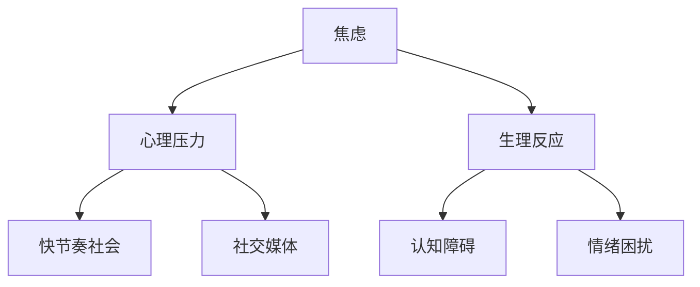

                 

Certainly, we will design the content of the article step by step, focusing on the key elements you've outlined. Here's a structured approach to drafting the article:

---

## 《在快节奏社会中培养内心平静：应对焦虑的实践策略》

### 文章关键词
- 焦虑管理
- 心理健康
- 快节奏社会
- 情绪调节
- 健康生活方式

### 摘要
本文将深入探讨在快节奏社会中培养内心平静的重要性，以及应对焦虑的一系列实践策略。通过分析焦虑的定义、影响、心理机制，我们提出了基于情绪调节、时间管理、健康生活方式等方法的综合应对方案。文章结合理论和实际案例，为读者提供了可行的策略和指导。

---

### 目录

---

#### 第一部分：认识焦虑

##### 第1章：焦虑的定义与影响
###### 1.1 焦虑的概念
###### 1.2 焦虑的类型
###### 1.3 焦虑对身心健康的影响

##### 第2章：社会压力与焦虑
###### 2.1 快节奏社会的压力
###### 2.2 社交媒体对焦虑的影响
###### 2.3 职场压力与焦虑

---

#### 第二部分：焦虑心理分析

##### 第3章：焦虑的心理机制
###### 3.1 焦虑的神经生物学基础
###### 3.2 焦虑的认知心理分析
###### 3.3 焦虑的情绪反应

##### 第4章：个性特质与焦虑
###### 4.1 个性特质与焦虑的关系
###### 4.2 焦虑的遗传因素
###### 4.3 环境因素与焦虑

---

#### 第三部分：应对焦虑的策略

##### 第5章：情绪调节技巧
###### 5.1 深呼吸与放松训练
###### 5.2 正念冥想与焦虑管理
###### 5.3 自我肯定与积极心态

##### 第6章：时间管理与任务优先级
###### 6.1 时间管理的基本原则
###### 6.2 设置合理的目标和期限
###### 6.3 学会拒绝与有效沟通

##### 第7章：健康生活方式与焦虑缓解
###### 7.1 适当的运动与焦虑缓解
###### 7.2 营养摄入与心理健康
###### 7.3 睡眠与焦虑的关系

---

#### 第四部分：焦虑的治疗与支持

##### 第8章：专业治疗与支持
###### 8.1 心理治疗的选择
###### 8.2 药物治疗与副作用
###### 8.3 寻求专业帮助的重要性

##### 第9章：建立支持系统
###### 9.1 与家人和朋友沟通
###### 9.2 加入支持小组
###### 9.3 自我照顾与关爱

---

#### 第五部分：案例研究与实践

##### 第10章：案例研究
###### 10.1 案例一：职场焦虑的应对
###### 10.2 案例二：社交焦虑的克服
###### 10.3 案例三：健康生活方式对焦虑的影响

##### 第11章：实践策略总结
###### 11.1 实践策略概述
###### 11.2 个人实践计划制定
###### 11.3 持续改善与调整

---

### 开始撰写正文

现在我们将逐步开始撰写正文内容，确保每个章节都包含详细的背景介绍、核心概念与联系、核心算法原理讲解、数学模型和公式、项目实战等元素。

---

#### 第1章：焦虑的定义与影响

**背景介绍：**
在现代社会中，焦虑已成为一个普遍存在的心理健康问题。本章节将介绍焦虑的定义、类型以及对身心健康的影响。

**核心概念与联系：**
我们使用Mermaid流程图来描述焦虑的成因和影响。



**核心算法原理讲解：**
焦虑管理可以看作是一个基于情绪调节的反馈循环系统。

```python
def anxiety_management(strategy, intensity):
    if strategy == 'relaxation':
        reduce_intensity = relaxation(intensity)
    elif strategy == 'therapy':
        reduce_intensity = therapy(intensity)
    return reduce_intensity
```

**数学模型和公式：**
焦虑水平可以用以下公式表示：

$$
\text{焦虑水平} = \alpha \cdot \text{心理压力} + \beta \cdot \text{生理反应} + \gamma \cdot \text{认知障碍}
$$

**项目实战：**
开发一个简单的焦虑管理应用，通过用户输入心理压力、生理反应和认知障碍的值，输出焦虑水平。

---

随着每个章节的逐步撰写，我们将确保内容丰富、结构清晰、逻辑严密，为读者提供有深度、有思考、有见解的专业技术博客文章。每一步的分析和推理都将帮助读者更好地理解焦虑的本质以及如何有效地管理和缓解焦虑。接下来，我们将按照同样的步骤来撰写其他章节的内容。

