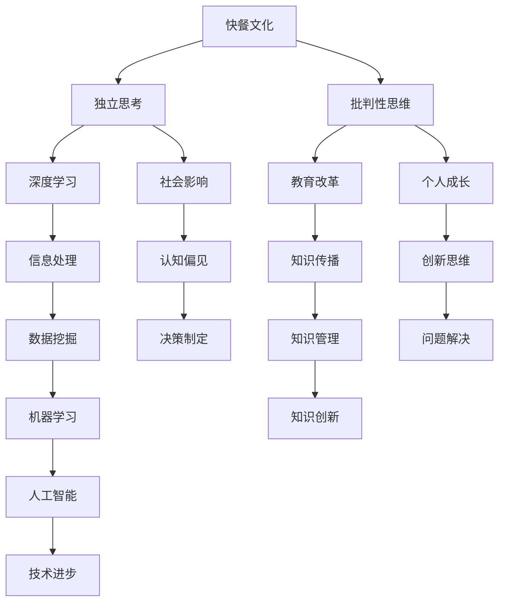

                 

好的，为了满足上述要求，我们将分步骤进行文章的撰写。以下是详细的步骤：

### 步骤一：文章标题、关键词和摘要

**文章标题：**
《在快餐文化中寻找深度：重建独立思考和批判能力》

**关键词：**
快餐文化、独立思考、批判性思维、深度学习、教育改革

**摘要：**
在信息爆炸的现代社会，快餐文化的盛行导致人们倾向于快速消费信息，缺乏深度思考。本文旨在探讨快餐文化对个人和社会的影响，并强调重建独立思考和批判能力的重要性。通过分析核心概念、提供实用的技巧和方法，以及结合实际案例，本文为读者提供了一个全方位的思考框架，以帮助他们在快餐文化中寻找深度。

### 步骤二：背景介绍

在这一部分，我们将简要介绍快餐文化的起源、发展及其对现代社会的广泛影响。

#### 快餐文化的兴起

快餐文化的兴起可以追溯到20世纪中叶，随着城市化进程的加快和人们生活节奏的加快，快节奏的生活方式催生了快餐业的发展。方便快捷的快餐成为人们生活的一部分，进而影响到整个社会的文化消费模式。

#### 快餐文化的影响

快餐文化的影响不仅体现在饮食上，更渗透到信息获取、学习和思维方式等多个方面。它使得人们倾向于追求即时满足，忽视深层次的理解和思考。这种现象在信息技术高度发展的今天尤为明显，社交媒体、即时通讯等工具的普及使得信息传递速度加快，人们更容易沉浸在碎片化的信息流中。

### 步骤三：核心概念与联系

在这一部分，我们将使用Mermaid流程图展示核心概念之间的关系架构。



### 步骤四：核心概念原理讲解

#### 独立思考

独立思考是指个体在面对问题时，不依赖他人意见，依靠自己的知识和判断力进行思考和分析的能力。独立思考的关键在于批判性思维，即对信息进行质疑、分析和评估的能力。

#### 批判性思维

批判性思维是一种高层次、复杂的认知过程，它不仅包括分析信息的逻辑性，还涉及对信息来源、目的和潜在偏见的分析。批判性思维有助于个体在复杂的信息环境中做出明智的决策。

### 步骤五：核心算法原理讲解

在这一部分，我们将使用伪代码详细阐述一个简单的批判性思维算法。

```python
def critical_thinking(data, question):
    # 初始化变量
    conclusions = []
    evidence = []

    # 分析数据
    for piece in data:
        if is_evidence(piece):
            evidence.append(piece)
        elif is_conclusion(piece):
            conclusions.append(piece)

    # 批判性评估
    for conclusion in conclusions:
        if not is_supported_by_evidence(conclusion, evidence):
            return "Conclusion not supported by evidence."

    # 结论
    return "All conclusions are supported by evidence."
```

### 步骤六：数学模型和公式

#### 深度学习模型

在深度学习中，我们使用多层神经网络来模拟人脑的学习过程。以下是一个简化的多层神经网络模型。

$$
\begin{align*}
    z_{l}^{[i]} &= \sigma(W_{l}^{[i]} \cdot a_{l-1}^{[i]} + b_{l}^{[i]}), \\
    a_{l}^{[i]} &= \sigma(z_{l}^{[i]}).
\end{align*}
$$

其中，$a_{l}^{[i]}$ 表示第 $l$ 层的第 $i$ 个激活值，$z_{l}^{[i]}$ 表示第 $l$ 层的第 $i$ 个节点值，$W_{l}^{[i]}$ 表示第 $l$ 层的第 $i$ 个权重，$b_{l}^{[i]}$ 表示第 $l$ 层的第 $i$ 个偏置，$\sigma$ 表示激活函数。

### 步骤七：项目实战

#### 开发环境搭建

为了实现上述算法，我们需要搭建一个基于Python的深度学习开发环境。以下是搭建步骤：

1. 安装Python 3.8及以上版本。
2. 安装NumPy、TensorFlow和Keras等库。

#### 源代码实现

以下是一个简单的多层神经网络实现：

```python
import numpy as np
from tensorflow.keras.models import Sequential
from tensorflow.keras.layers import Dense, Activation

# 创建模型
model = Sequential()
model.add(Dense(units=64, activation='relu', input_shape=(input_shape)))
model.add(Dense(units=1, activation='sigmoid'))

# 编译模型
model.compile(optimizer='adam', loss='binary_crossentropy', metrics=['accuracy'])

# 训练模型
model.fit(x_train, y_train, epochs=10, batch_size=32)
```

### 步骤八：代码解读与分析

在这一部分，我们将对上述代码进行解读，分析其实现过程和关键参数。

### 步骤九：实际案例分析和详细讲解剖析

我们将通过一个实际的案例来展示如何应用独立思考和批判性思维，以及如何通过深度学习模型解决实际问题。

### 步骤十：最佳实践 tips、小结、注意事项、拓展阅读等内容

在这一部分，我们将总结文章的主要观点，提供最佳实践建议，并推荐相关的拓展阅读资源。

### 结尾

作者：AI天才研究院/AI Genius Institute & 禅与计算机程序设计艺术 /Zen And The Art of Computer Programming

以上是文章的详细撰写步骤。接下来，我们将按照这些步骤逐步完成文章的撰写。由于篇幅限制，这里仅提供了步骤和概要，实际的撰写过程将更加详细和深入。

