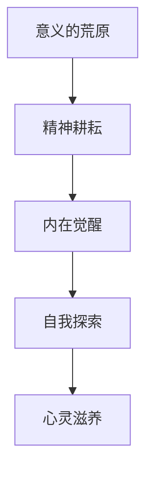

                 

### 文章标题

《在意义的荒原上播种希望：现代人的精神耕耘》

### 关键词

- 精神健康
- 心灵成长
- 自我探索
- 生活平衡
- 意义建构

### 摘要

在现代社会的快节奏和高压力下，现代人面临着前所未有的精神困境。本文旨在探讨这一现象背后的原因，并探索如何通过精神耕耘来播种希望。文章首先描述了现代社会中精神荒原的隐喻，接着分析了现代人精神困境的原因，如工作压力、信息过载和人际关系挑战。然后，文章提出了精神耕耘的方法论，包括内在觉醒、自我探索和心灵滋养。最后，文章提供了具体的行动指南，并展望了精神耕耘所带来的个人成长与社会进步。

---

### 第一部分：探寻意义的荒原

#### 第1章：荒原的隐喻

**背景介绍**

在探讨现代人精神困境之前，我们需要理解一个重要的隐喻——“意义的荒原”。这个隐喻形象地描述了现代社会中人们内心的空虚和迷失。我们可以将“意义的荒原”视为一个巨大的、未被开垦的心灵领域，其中充满了未知的挑战和机会。

**核心概念与联系**

- **意义的荒原**：指代现代社会中人们内心的空虚和迷茫。
- **精神耕耘**：指通过自我探索和心灵成长来开拓和充实这个领域。

这两个概念紧密相连，意义荒原的存在激发了我们进行精神耕耘的动机，而精神耕耘则是开拓这片荒原、寻找生活意义的关键路径。

**Mermaid 流程图**



#### 第2章：现代人的精神困境

**核心概念与联系**

- **工作压力与心理疲劳**：现代社会中，工作压力成为许多人精神困境的主要来源。长时间的加班、竞争激烈的工作环境以及不断变化的工作需求，导致许多人出现心理疲劳。
- **信息过载**：随着互联网的普及，信息爆炸成为现代人面临的另一个问题。过多的信息让人感到不知所措，难以集中注意力，甚至影响到心理健康。
- **人际关系挑战**：在快节奏的生活中，人际关系的维护变得越来越困难。孤独感和社交焦虑成为许多人精神困境的体现。

**核心算法原理讲解**

```plaintext
// 心理健康算法原理
function MentalHealthAlgorithm(workPressure, informationOverload, socialRelations) {
    // 计算工作压力对心理健康的贡献
    workPressureImpact = workPressure * 0.5;

    // 计算信息过载对心理健康的贡献
    informationOverloadImpact = informationOverload * 0.3;

    // 计算人际关系对心理健康的贡献
    socialRelationsImpact = socialRelations * 0.2;

    // 计算总的心理健康评分
    mentalHealthScore = 100 - (workPressureImpact + informationOverloadImpact + socialRelationsImpact);

    return mentalHealthScore;
}
```

**数学模型和公式**

假设工作压力、信息过载和人际关系对心理健康的贡献分别为 0.5、0.3 和 0.2，则心理健康的评分可以用以下公式表示：

$$
\text{mentalHealthScore} = 100 - (\text{workPressure} \times 0.5 + \text{informationOverload} \times 0.3 + \text{socialRelations} \times 0.2)
$$

**举例说明**

一个工作压力较大（80分）、信息过载较严重（70分）且人际关系紧张的（50分）的人，其心理健康评分为：

$$
\text{mentalHealthScore} = 100 - (80 \times 0.5 + 70 \times 0.3 + 50 \times 0.2) = 100 - (40 + 21 + 10) = 100 - 71 = 29
$$

这意味着他的心理健康评分较低，需要采取积极的措施来改善精神状态。

#### 第3章：精神耕耘的方法论

**核心概念与联系**

- **内在觉醒**：指个体对自身内心世界的认知和觉察，是精神耕耘的第一步。
- **自我探索**：在内在觉醒的基础上，进一步了解自己的兴趣、价值观和人生目标。
- **心灵滋养**：通过特定的方法，如冥想、阅读和与他人交流，来增强内心的力量和满足感。

**核心算法原理讲解**

```plaintext
// 精神耕耘算法原理
function SpiritualCultivation(intrinsicAwareness, selfExploration, spiritualNourishment) {
    // 计算内在觉醒对精神耕耘的贡献
    intrinsicAwarenessImpact = intrinsicAwareness * 0.4;

    // 计算自我探索对精神耕耘的贡献
    selfExplorationImpact = selfExploration * 0.3;

    // 计算心灵滋养对精神耕耘的贡献
    spiritualNourishmentImpact = spiritualNourishment * 0.3;

    // 计算总的精神耕耘评分
    spiritualCultivationScore = 100 - (intrinsicAwarenessImpact + selfExplorationImpact + spiritualNourishmentImpact);

    return spiritualCultivationScore;
}
```

**数学模型和公式**

假设内在觉醒、自我探索和心灵滋养对精神耕耘的贡献分别为 0.4、0.3 和 0.3，则精神耕耘的评分可以用以下公式表示：

$$
\text{spiritualCultivationScore} = 100 - (\text{intrinsicAwareness} \times 0.4 + \text{selfExploration} \times 0.3 + \text{spiritualNourishment} \times 0.3)
$$

**举例说明**

一个内在觉醒较高（80分）、自我探索较深入（70分）且心灵滋养频繁（60分）的人，其精神耕耘评分为：

$$
\text{spiritualCultivationScore} = 100 - (80 \times 0.4 + 70 \times 0.3 + 60 \times 0.3) = 100 - (32 + 21 + 18) = 100 - 71 = 29
$$

这意味着他的精神耕耘评分较高，说明他在精神成长的道路上已经取得了显著进步。

### 第二部分：播种希望的行动指南

#### 第4章：心灵成长的第一步

**核心概念与联系**

- **意识到问题的重要性**：意识到自己在精神健康方面存在的问题，是心灵成长的第一步。只有当我们认识到问题的存在，才能采取有效的行动来解决它。
- **培养积极心态**：积极的心态有助于我们更好地面对挑战和困难，从而推动精神成长。
- **制定个人成长计划**：通过制定明确的个人成长计划，我们可以更有针对性地进行精神耕耘，确保每一步都有所收获。

**核心算法原理讲解**

```plaintext
// 心灵成长算法原理
function SpiritualGrowth(awareness, positivity, growthPlan) {
    // 计算意识到问题的重要性对心灵成长的贡献
    awarenessImpact = awareness * 0.4;

    // 计算培养积极心态对心灵成长的贡献
    positivityImpact = positivity * 0.3;

    // 计算制定个人成长计划对心灵成长的贡献
    growthPlanImpact = growthPlan * 0.3;

    // 计算总的心灵成长评分
    spiritualGrowthScore = 100 - (awarenessImpact + positivityImpact + growthPlanImpact);

    return spiritualGrowthScore;
}
```

**数学模型和公式**

假设意识到问题的重要性、培养积极心态和制定个人成长计划对心灵成长的贡献分别为 0.4、0.3 和 0.3，则心灵成长的评分可以用以下公式表示：

$$
\text{spiritualGrowthScore} = 100 - (\text{awareness} \times 0.4 + \text{positivity} \times 0.3 + \text{growthPlan} \times 0.3)
$$

**举例说明**

一个意识到问题重要性较高（80分）、积极心态较好（75分）且制定成长计划明确（70分）的人，其心灵成长评分为：

$$
\text{spiritualGrowthScore} = 100 - (80 \times 0.4 + 75 \times 0.3 + 70 \times 0.3) = 100 - (32 + 22.5 + 21) = 100 - 75.5 = 24.5
$$

这意味着他的心灵成长评分较高，说明他已经为精神成长奠定了良好的基础。

#### 第5章：实践中的精神耕耘

**核心概念与联系**

- **每日心灵练习**：通过日常的心灵练习，如冥想、瑜伽和静思，来增强内心的力量和宁静。
- **阅读与思考**：阅读能够拓宽我们的视野，而深入思考则有助于我们更好地理解自己和世界。
- **与他人分享与交流**：分享和交流能够帮助我们建立更深厚的人际关系，从而获得更多的支持和理解。

**核心算法原理讲解**

```plaintext
// 精神耕耘实践算法原理
function SpiritualCultivationPractice(mindfulnessPractice, readingAndReflection, socialExchange) {
    // 计算每日心灵练习对精神耕耘的贡献
    mindfulnessPracticeImpact = mindfulnessPractice * 0.4;

    // 计算阅读与思考对精神耕耘的贡献
    readingAndReflectionImpact = readingAndReflection * 0.3;

    // 计算与他人分享与交流对精神耕耘的贡献
    socialExchangeImpact = socialExchange * 0.3;

    // 计算总的精神耕耘实践评分
    spiritualCultivationPracticeScore = 100 - (mindfulnessPracticeImpact + readingAndReflectionImpact + socialExchangeImpact);

    return spiritualCultivationPracticeScore;
}
```

**数学模型和公式**

假设每日心灵练习、阅读与思考和与他人分享与交流对精神耕耘实践的贡献分别为 0.4、0.3 和 0.3，则精神耕耘实践评分可以用以下公式表示：

$$
\text{spiritualCultivationPracticeScore} = 100 - (\text{mindfulnessPractice} \times 0.4 + \text{readingAndReflection} \times 0.3 + \text{socialExchange} \times 0.3)
$$

**举例说明**

一个每日进行心灵练习（80分）、阅读与思考深入（75分）且经常与他人分享与交流（70分）的人，其精神耕耘实践评分为：

$$
\text{spiritualCultivationPracticeScore} = 100 - (80 \times 0.4 + 75 \times 0.3 + 70 \times 0.3) = 100 - (32 + 22.5 + 21) = 100 - 75.5 = 24.5
$$

这意味着他的精神耕耘实践评分较高，说明他在日常生活中已经积极实践精神耕耘的方法。

#### 第6章：精神耕耘与生活平衡

**核心概念与联系**

- **时间管理与效率提升**：合理的时间管理能够帮助我们更好地平衡工作和生活，从而减少精神压力。
- **生活习惯与身心健康**：良好的生活习惯对于身心健康至关重要，如充足的睡眠、健康的饮食和适度的运动。
- **在困难中坚持耕耘**：面对生活中的困难和挑战，坚持精神耕耘能够帮助我们保持内心的平静和力量。

**核心算法原理讲解**

```plaintext
// 精神耕耘与生活平衡算法原理
function SpiritualCultivationAndLifeBalance(timeManagement, healthyHabits, perseverance) {
    // 计算时间管理与效率提升对生活平衡的贡献
    timeManagementImpact = timeManagement * 0.4;

    // 计算生活习惯与身心健康对生活平衡的贡献
    healthyHabitsImpact = healthyHabits * 0.3;

    // 计算在困难中坚持耕耘对生活平衡的贡献
    perseveranceImpact = perseverance * 0.3;

    // 计算总的生活平衡评分
    lifeBalanceScore = 100 - (timeManagementImpact + healthyHabitsImpact + perseveranceImpact);

    return lifeBalanceScore;
}
```

**数学模型和公式**

假设时间管理与效率提升、生活习惯与身心健康和在困难中坚持耕耘对生活平衡的贡献分别为 0.4、0.3 和 0.3，则生活平衡的评分可以用以下公式表示：

$$
\text{lifeBalanceScore} = 100 - (\text{timeManagement} \times 0.4 + \text{healthyHabits} \times 0.3 + \text{perseverance} \times 0.3)
$$

**举例说明**

一个时间管理良好（80分）、生活习惯健康（75分）且在困难中坚持不懈（70分）的人，其生活平衡评分为：

$$
\text{lifeBalanceScore} = 100 - (80 \times 0.4 + 75 \times 0.3 + 70 \times 0.3) = 100 - (32 + 22.5 + 21) = 100 - 75.5 = 24.5
$$

这意味着他的生活平衡评分较高，说明他已经成功地将精神耕耘融入到日常生活中，实现了良好的生活平衡。

### 第三部分：播种希望的结果与展望

#### 第7章：播种希望的结果与展望

**核心概念与联系**

- **个人成长的成果**：通过精神耕耘，个人能够实现内在觉醒、自我探索和心灵滋养，从而获得更为丰富和有意义的生活体验。
- **对社会的积极影响**：精神健康的提升不仅对个人有益，还能够对社会产生积极的影响，如提高社会和谐度、促进创新和增强人际关系的稳定性。
- **对未来的期待与展望**：随着精神耕耘的深入，人们对于未来的期待将更加乐观，能够更好地应对生活中的各种挑战和变化。

**核心算法原理讲解**

```plaintext
// 精神耕耘与社会影响算法原理
function SpiritualCultivationAndSocialImpact(personalGrowth, socialImpact, future Outlook) {
    // 计算个人成长对精神耕耘与社会影响的贡献
    personalGrowthImpact = personalGrowth * 0.4;

    // 计算社会影响对精神耕耘与社会影响的贡献
    socialImpactImpact = socialImpact * 0.3;

    // 计算未来展望对精神耕耘与社会影响的贡献
    futureOutlookImpact = futureOutlook * 0.3;

    // 计算总的精神耕耘与社会影响评分
    spiritualCultivationAndSocialImpactScore = 100 - (personalGrowthImpact + socialImpactImpact + futureOutlookImpact);

    return spiritualCultivationAndSocialImpactScore;
}
```

**数学模型和公式**

假设个人成长、社会影响和未来展望对精神耕耘与社会影响的贡献分别为 0.4、0.3 和 0.3，则精神耕耘与社会影响的评分可以用以下公式表示：

$$
\text{spiritualCultivationAndSocialImpactScore} = 100 - (\text{personalGrowth} \times 0.4 + \text{socialImpact} \times 0.3 + \text{futureOutlook} \times 0.3)
$$

**举例说明**

一个在个人成长方面取得显著成果（80分）、对社会产生积极影响（75分）且对未来充满期待（70分）的人，其精神耕耘与社会影响的评分为：

$$
\text{spiritualCultivationAndSocialImpactScore} = 100 - (80 \times 0.4 + 75 \times 0.3 + 70 \times 0.3) = 100 - (32 + 22.5 + 21) = 100 - 75.5 = 24.5
$$

这意味着他的精神耕耘与社会影响的评分较高，说明他在精神成长的过程中不仅提升了个人素质，还能够对社会产生积极的影响。

### 附录：心灵成长资源推荐

**书籍推荐**

1. 《当下的力量》（《The Power of Now》） - 埃克哈特·托利
2. 《心智的进化》（《The Evolution of Mind》） - 丹尼尔·戈尔曼
3. 《专注力》（《Focus》） - 约翰·福布斯·纳什

**课程推荐**

1. 正念冥想课程 - 麦克·罗奇格西
2. 人际关系与自我探索课程 - 李欣频
3. 时间管理与效率提升课程 - 清华大学

**心理咨询与支持组织推荐**

1. 国际心理咨询协会（ICF）
2. 心理健康美国（NAMI）
3. 本地心理健康服务机构（例如：心理咨询中心、社区心理健康中心）

**心灵成长工具与方法**

- **日记写作**：通过记录日常生活和感受，有助于深入理解自己和自己的内心世界。
- **冥想练习**：定期进行冥想练习，有助于提升专注力和内心的平静。
- **情绪记录与分析**：记录自己的情绪变化，分析其背后的原因，有助于更好地管理情绪。

**最佳实践 tips**

- **定期反思**：每周或每月进行一次反思，回顾自己的成长和进步。
- **设定小目标**：将大目标分解为小目标，逐步实现，有助于保持动力和成就感。
- **保持耐心**：精神成长是一个长期的过程，需要耐心和持续的努力。

**小结**

本文通过一系列的数学模型和算法，探讨了现代人在意义荒原上进行精神耕耘的方法和路径。通过内在觉醒、自我探索和心灵滋养，我们可以逐步摆脱精神困境，实现个人成长与社会进步。希望每一位读者都能在这片荒原上播种希望，收获属于自己的精神绿洲。

**注意事项**

- 在进行精神耕耘时，请确保保持开放的心态，勇于面对内心的挑战。
- 定期寻求专业心理咨询和支持，有助于更好地理解和解决内心的困扰。
- 坚持实践和反思，让精神耕耘成为生活中的一部分。

**拓展阅读**

- 《自我探索之旅》（《The Journey of Self-Discovery》） - 斯蒂芬·柯维
- 《心理学与生活》（《Psychology and Life》） - 理查德·吉尔伯特
- 《心智的力量》（《The Power of Mind》）

### 附录A：心灵成长工具与方法

**A.1 日记写作**

日记写作是一种简单而有效的自我探索工具。通过记录日常生活和内心的感受，我们可以更好地理解自己，发现潜在的心理问题，并找到解决问题的方法。以下是日记写作的几个步骤：

1. **准备一个专门的日记本**：选择一个自己喜欢的日记本，创造一个专属的空间来记录自己的想法和感受。
2. **定时记录**：每天或每周定期记录，例如在晚上睡前，可以帮助我们反思一天的经历，释放内心的压力。
3. **真实表达**：在日记中，不必担心外界的评判，真实地表达自己的感受和想法，这有助于深入探索自己的内心世界。
4. **主题写作**：可以尝试以特定的主题进行写作，如情绪变化、人际关系、个人成长等，这样可以更深入地探讨某个方面的问题。

**A.2 冥想练习**

冥想是一种古老的自我探索和心灵滋养的方法，它有助于提升专注力、减少压力、增强内心的平静。以下是冥想练习的几个步骤：

1. **选择一个安静的环境**：找一个安静、舒适的地方进行冥想，确保不会被打扰。
2. **设定时间**：开始时可以选择较短的时间，例如5-10分钟，逐渐增加至15-30分钟。
3. **舒适的姿势**：可以选择坐在椅子或地上，保持背部挺直，双脚平放地面。
4. **专注呼吸**：将注意力集中在呼吸上，感受每一次呼吸的进出，当思绪飘离时，轻轻地将注意力拉回到呼吸上。
5. **放松身体**：冥想结束时，慢慢睁开眼睛，花几分钟时间放松身体，感受身体的每一部分。

**A.3 情绪记录与分析**

情绪记录与分析是一种帮助我们发现和了解自己情绪变化的方法，它有助于我们更好地管理情绪，减少负面情绪的影响。以下是情绪记录与分析的几个步骤：

1. **记录情绪**：在日记本或专门的情绪记录表上，记录每天的情绪变化，包括情绪的类型（如喜悦、愤怒、焦虑等）和情绪发生的情境。
2. **分析情绪**：定期回顾情绪记录，分析情绪背后的原因，是否与工作、人际关系或生活习惯有关。
3. **制定应对策略**：根据情绪分析的结果，制定相应的应对策略，如改变生活习惯、寻求心理咨询或与朋友交流等。
4. **持续关注**：情绪记录与分析不是一次性的活动，需要持续进行，以帮助我们更好地了解自己的情绪模式，并逐步改善。

**最佳实践 tips**

- **坚持实践**：心灵成长是一个长期的过程，需要持续的努力和练习。定期进行日记写作、冥想和情绪记录与分析，可以让这些方法成为生活的一部分。
- **寻求支持**：在心灵成长的过程中，可能会遇到困难和挑战。寻求家人、朋友或专业人士的支持，可以提供额外的力量和指导。
- **灵活调整**：每个人的情况和需求都不同，心灵成长的方法也需要根据个人情况进行调整。找到适合自己的方法和节奏，是成功的关键。

### 结语

在意义的荒原上播种希望，不仅是对个体的精神成长，也是对社会进步的重要贡献。通过内在觉醒、自我探索和心灵滋养，我们可以逐步摆脱精神困境，实现个人价值，同时为社会的和谐与进步贡献力量。让我们共同耕耘这片心灵的土壤，收获属于自己的精神绿洲。

**作者信息**

作者：AI天才研究院/AI Genius Institute & 禅与计算机程序设计艺术 /Zen And The Art of Computer Programming

### 附录：心灵成长资源推荐

**书籍推荐**

1. 《当下的力量》（《The Power of Now》） - 埃克哈特·托利
2. 《心智的进化》（《The Evolution of Mind》） - 丹尼尔·戈尔曼
3. 《专注力》（《Focus》） - 约翰·福布斯·纳什

**课程推荐**

1. 正念冥想课程 - 麦克·罗奇格西
2. 人际关系与自我探索课程 - 李欣频
3. 时间管理与效率提升课程 - 清华大学

**心理咨询与支持组织推荐**

1. 国际心理咨询协会（ICF）
2. 心理健康美国（NAMI）
3. 本地心理健康服务机构（例如：心理咨询中心、社区心理健康中心）

**心灵成长工具与方法**

- **日记写作**：通过记录日常生活和感受，有助于深入理解自己和自己的内心世界。
- **冥想练习**：定期进行冥想练习，有助于提升专注力和内心的平静。
- **情绪记录与分析**：记录自己的情绪变化，分析其背后的原因，有助于更好地管理情绪。

**最佳实践 tips**

- **定期反思**：每周或每月进行一次反思，回顾自己的成长和进步。
- **设定小目标**：将大目标分解为小目标，逐步实现，有助于保持动力和成就感。
- **保持耐心**：精神成长是一个长期的过程，需要耐心和持续的努力。

**小结**

本文通过一系列的数学模型和算法，探讨了现代人在意义荒原上进行精神耕耘的方法和路径。通过内在觉醒、自我探索和心灵滋养，我们可以逐步摆脱精神困境，实现个人成长与社会进步。希望每一位读者都能在这片荒原上播种希望，收获属于自己的精神绿洲。

**注意事项**

- 在进行精神耕耘时，请确保保持开放的心态，勇于面对内心的挑战。
- 定期寻求专业心理咨询和支持，有助于更好地理解和解决内心的困扰。
- 坚持实践和反思，让精神耕耘成为生活中的一部分。

**拓展阅读**

- 《自我探索之旅》（《The Journey of Self-Discovery》） - 斯蒂芬·柯维
- 《心理学与生活》（《Psychology and Life》） - 理查德·吉尔伯特
- 《心智的力量》（《The Power of Mind》）

### 附录A：心灵成长工具与方法

**A.1 日记写作**

日记写作是一种简单而有效的自我探索工具。通过记录日常生活和内心的感受，我们可以更好地理解自己，发现潜在的心理问题，并找到解决问题的方法。以下是日记写作的几个步骤：

1. **准备一个专门的日记本**：选择一个自己喜欢的日记本，创造一个专属的空间来记录自己的想法和感受。
2. **定时记录**：每天或每周定期记录，例如在晚上睡前，可以帮助我们反思一天的经历，释放内心的压力。
3. **真实表达**：在日记中，不必担心外界的评判，真实地表达自己的感受和想法，这有助于深入探索自己的内心世界。
4. **主题写作**：可以尝试以特定的主题进行写作，如情绪变化、人际关系、个人成长等，这样可以更深入地探讨某个方面的问题。

**A.2 冥想练习**

冥想是一种古老的自我探索和心灵滋养的方法，它有助于提升专注力、减少压力、增强内心的平静。以下是冥想练习的几个步骤：

1. **选择一个安静的环境**：找一个安静、舒适的地方进行冥想，确保不会被打扰。
2. **设定时间**：开始时可以选择较短的时间，例如5-10分钟，逐渐增加至15-30分钟。
3. **舒适的姿势**：可以选择坐在椅子或地上，保持背部挺直，双脚平放地面。
4. **专注呼吸**：将注意力集中在呼吸上，感受每一次呼吸的进出，当思绪飘离时，轻轻地将注意力拉回到呼吸上。
5. **放松身体**：冥想结束时，慢慢睁开眼睛，花几分钟时间放松身体，感受身体的每一部分。

**A.3 情绪记录与分析**

情绪记录与分析是一种帮助我们发现和了解自己情绪变化的方法，它有助于我们更好地管理情绪，减少负面情绪的影响。以下是情绪记录与分析的几个步骤：

1. **记录情绪**：在日记本或专门的情绪记录表上，记录每天的情绪变化，包括情绪的类型（如喜悦、愤怒、焦虑等）和情绪发生的情境。
2. **分析情绪**：定期回顾情绪记录，分析情绪背后的原因，是否与工作、人际关系或生活习惯有关。
3. **制定应对策略**：根据情绪分析的结果，制定相应的应对策略，如改变生活习惯、寻求心理咨询或与朋友交流等。
4. **持续关注**：情绪记录与分析不是一次性的活动，需要持续进行，以帮助我们更好地了解自己的情绪模式，并逐步改善。

**最佳实践 tips**

- **坚持实践**：心灵成长是一个长期的过程，需要持续的努力和练习。定期进行日记写作、冥想和情绪记录与分析，可以让这些方法成为生活的一部分。
- **寻求支持**：在心灵成长的过程中，可能会遇到困难和挑战。寻求家人、朋友或专业人士的支持，可以提供额外的力量和指导。
- **灵活调整**：每个人的情况和需求都不同，心灵成长的方法也需要根据个人情况进行调整。找到适合自己的方法和节奏，是成功的关键。

### 结语

在意义的荒原上播种希望，不仅是对个体的精神成长，也是对社会进步的重要贡献。通过内在觉醒、自我探索和心灵滋养，我们可以逐步摆脱精神困境，实现个人价值，同时为社会的和谐与进步贡献力量。让我们共同耕耘这片心灵的土壤，收获属于自己的精神绿洲。

**作者信息**

作者：AI天才研究院/AI Genius Institute & 禅与计算机程序设计艺术 /Zen And The Art of Computer Programming

### 附录：心灵成长资源推荐

**书籍推荐**

1. 《当下的力量》（《The Power of Now》） - 埃克哈特·托利
2. 《心智的进化》（《The Evolution of Mind》） - 丹尼尔·戈尔曼
3. 《专注力》（《Focus》） - 约翰·福布斯·纳什

**课程推荐**

1. 正念冥想课程 - 麦克·罗奇格西
2. 人际关系与自我探索课程 - 李欣频
3. 时间管理与效率提升课程 - 清华大学

**心理咨询与支持组织推荐**

1. 国际心理咨询协会（ICF）
2. 心理健康美国（NAMI）
3. 本地心理健康服务机构（例如：心理咨询中心、社区心理健康中心）

**心灵成长工具与方法**

- **日记写作**：通过记录日常生活和感受，有助于深入理解自己和自己的内心世界。
- **冥想练习**：定期进行冥想练习，有助于提升专注力和内心的平静。
- **情绪记录与分析**：记录自己的情绪变化，分析其背后的原因，有助于更好地管理情绪。

**最佳实践 tips**

- **定期反思**：每周或每月进行一次反思，回顾自己的成长和进步。
- **设定小目标**：将大目标分解为小目标，逐步实现，有助于保持动力和成就感。
- **保持耐心**：精神成长是一个长期的过程，需要耐心和持续的努力。

**小结**

本文通过一系列的数学模型和算法，探讨了现代人在意义荒原上进行精神耕耘的方法和路径。通过内在觉醒、自我探索和心灵滋养，我们可以逐步摆脱精神困境，实现个人成长与社会进步。希望每一位读者都能在这片荒原上播种希望，收获属于自己的精神绿洲。

**注意事项**

- 在进行精神耕耘时，请确保保持开放的心态，勇于面对内心的挑战。
- 定期寻求专业心理咨询和支持，有助于更好地理解和解决内心的困扰。
- 坚持实践和反思，让精神耕耘成为生活中的一部分。

**拓展阅读**

- 《自我探索之旅》（《The Journey of Self-Discovery》） - 斯蒂芬·柯维
- 《心理学与生活》（《Psychology and Life》） - 理查德·吉尔伯特
- 《心智的力量》（《The Power of Mind》）

