                 

### 导言与背景

在现代社会中，价值的缺失似乎已成为一种普遍现象。人们不断追求物质上的富足，而精神层面的空虚却愈发明显。这种价值缺失不仅表现在个人层面，更渗透到了社会的方方面面。在这样一个意义荒原上，重建生活的价值显得尤为迫切。

#### 现代社会的特征与问题

现代社会的一个显著特征是快速变化和高竞争性。随着科技的发展和信息时代的到来，人们的生活方式、价值观和道德观念都发生了巨大变化。然而，这种快速的变化也带来了一系列问题。人们感到时间紧迫，生活节奏加快，精神压力增加。与此同时，物质生活的富足并未带来内心的满足，许多人陷入了精神上的迷茫和焦虑。

#### 价值缺失的表现与影响

价值缺失的表现形式多种多样。在个人层面，人们可能感到生活缺乏目标，内心空虚，无法找到人生的意义。在社会层面，价值缺失导致道德滑坡，社会信任下降，人际关系紧张。此外，经济领域的不公平和资源的过度消耗也是价值缺失的后果。

#### 价值缺失的原因分析

价值缺失的原因复杂多样。一方面，现代社会的高度竞争性和物质主义导向使人们过分追求物质财富，忽视了精神层面的需求。另一方面，传统价值观念的削弱和道德规范的缺失也导致了价值体系的紊乱。此外，信息爆炸和社交媒体的普及使得人们容易受到各种信息干扰，难以形成独立的思考和判断。

#### 重建价值的必要性

重建价值对于个人和社会的发展都具有重要意义。首先，重建价值可以帮助人们找到生活的目标，实现自我价值。其次，重建价值有助于增强社会凝聚力和道德水平，促进社会和谐发展。最后，重建价值可以为经济领域的可持续发展提供精神支持，推动绿色经济和可持续发展的实现。

### 摘要

本文旨在探讨现代社会中价值缺失的现象，分析其背后的原因，并提出重建价值的必要性。通过深入研究核心概念与联系，提供具体的策略与方法，本文旨在帮助读者在个人和社会层面上重建生活的价值。希望通过本文的阐述，能够引发读者对于生活价值的深入思考，从而共同迈向一个更加有意义和可持续的未来。

### 关键词

- 价值缺失
- 重建价值
- 现代社会
- 个人发展
- 社会和谐

---

#### 背景介绍

在当今世界，科技的飞速发展和社会的急剧变迁已经深刻改变了人们的生活方式。人工智能、大数据、区块链等新兴技术的广泛应用，不仅改变了我们的生产方式，也重塑了我们的思维方式。然而，这种变革并非总是带来积极的后果。随着物质生活的丰富，人们的精神世界却越来越感到空虚。这种精神上的空虚，往往源于对生活价值的迷失。

首先，现代社会的高竞争性导致人们为了生存和发展，不得不投入大量时间和精力去追求物质上的富足。在这个过程中，人们逐渐忽视了精神层面的需求，如情感的满足、自我价值的实现等。其次，科技的发展和信息时代的到来，使得信息过载成为一个普遍问题。人们在海量信息中迷失自我，很难形成独立、深入的思考。此外，传统价值观念的削弱和道德规范的缺失，也使得社会价值体系变得混乱。

这种价值缺失的现象不仅仅体现在个人层面，更渗透到了社会的各个方面。在家庭中，父母为了孩子的学业而过度关注，忽略了与孩子的情感交流；在工作场所，人们为了业绩和晋升而忽视团队合作和道德规范；在社会层面，道德滑坡、信任危机和人际关系紧张等问题屡见不鲜。这些问题不仅影响了人们的心理健康，也对社会的发展产生了负面影响。

因此，重建价值已成为当代社会的一项紧迫任务。通过重建价值，可以帮助人们找到生活的目标，实现自我价值；可以增强社会的凝聚力和道德水平，促进社会的和谐发展。总之，只有重建价值，我们才能在现代社会中找到属于自己的精神家园。

#### 核心概念与联系

为了深入探讨重建价值的过程，我们首先需要明确几个核心概念：价值观、价值体系和价值重建。

**1. 价值观**：

价值观是指一个人或社会对于何为“好”或“正确”的基本信念和判断。它包括了对人生、社会、自然等方面的根本认识，是指导人们行为和决策的内在标准。例如，一个重视家庭价值的人可能会更注重亲情和家庭的和谐；而一个重视社会责任感的人可能会积极参与社会公益活动。

**2. 价值体系**：

价值体系是由多个价值观组成的系统，反映了一个人或社会的整体价值观念。它不仅包括个人的价值观，还涵盖了社会的伦理规范、法律制度和文化传统等。一个健康的价值体系应当是多元而包容的，能够容纳不同的价值观和利益诉求，从而实现社会的和谐与稳定。

**3. 价值重建**：

价值重建是指在一个价值体系发生混乱或缺失时，通过一系列策略和方法，重新建立或调整价值观念的过程。它涉及到个人和社会两个层面，旨在解决价值缺失带来的问题，恢复生活的意义和目标。

**核心概念之间的关系架构**：

为了更直观地理解这些核心概念之间的关系，我们可以使用Mermaid流程图来展示。以下是价值重建过程中的核心概念及其相互关系：

```mermaid
graph TB
    A[价值观] --> B[价值体系]
    A --> C[个人行为]
    A --> D[社会行为]
    B --> E[社会制度]
    B --> F[文化传统]
    C --> G[心理健康]
    D --> H[社会和谐]
    E --> I[法律规范]
    F --> J[文化传承]
    G --> K[生活质量]
    H --> L[社会凝聚力]
    I --> M[公平正义]
    J --> N[社会稳定]
    K --> O[个人幸福感]
    L --> P[社会和谐]
    M --> Q[社会公正]
    N --> R[社会持续发展]
```



**关系说明**：

- 价值观是个人和社会行为的基础，直接影响心理健康和社会和谐。
- 价值体系包括社会制度和文化传统，为个人和社会行为提供规范和指导。
- 个人行为和社会行为共同影响着生活质量和社会凝聚力。
- 社会制度和法律规范确保了公平正义，有助于社会稳定和持续发展。
- 文化传统和心理健康为价值重建提供了精神支持。

通过上述Mermaid流程图，我们可以清晰地看到核心概念之间的关系，这为后续讨论重建价值的策略和方法奠定了基础。

---

#### 核心概念与联系（续）

**价值观念与生活方式**

价值观念与生活方式有着紧密的联系。生活方式是指一个人在日常生活中遵循的行为习惯和生活方式。它不仅反映了个人的价值观，还受到社会文化背景的影响。例如，一个重视环保的人可能会选择低碳生活方式，减少对环境的负面影响；而一个重视社交的人可能会花费大量时间参加各种社交活动，以建立和维护人际关系。

**价值观与道德规范**

道德规范是社会的行为准则，反映了社会共同认可的价值观念。价值观与道德规范之间的关系是相互影响、相互制约的。价值观为道德规范提供了基础，决定了社会成员应该遵守的行为准则。同时，道德规范也反过来影响个人的价值观，使其与社会价值观念保持一致。例如，诚信是许多社会所推崇的价值观，它体现在道德规范中，要求人们在经济活动中遵守合同，不欺诈他人。

**价值观与社会制度**

社会制度是保障社会秩序和公平的重要机制，包括法律、政治、经济等方面的制度安排。价值观对社会制度有着深远的影响。一个社会所倡导的价值观决定了其制度的设计和运行。例如，一个重视平等的社会可能会建立相对平等的社会制度，如税收体系、教育制度等，以确保社会资源的公平分配。同时，社会制度也会反过来影响人们的价值观，塑造社会成员的价值观念。例如，民主制度强调公民的参与和表达自由，这可能会促使人们更加重视个人权利和社会责任。

通过上述核心概念之间的关系架构，我们可以看到，价值观不仅影响个人和生活方式，也对社会制度、道德规范产生深远的影响。这些核心概念相互联系、相互作用，共同构成了一个复杂的价值体系。在重建价值的过程中，理解这些核心概念及其相互关系是至关重要的。这有助于我们制定有效的策略和方法，解决现代社会中的价值缺失问题。

### 核心算法原理讲解：价值重建的路径

在探讨如何重建价值时，我们需要明确核心算法原理，这将为我们的策略和方法提供科学依据。以下是一个基于心理学和社会学的价值重建路径，包括关键步骤和伪代码，以帮助读者更好地理解这一过程。

#### 关键步骤

1. **自我反思**：通过自我反思，识别个人价值缺失的根源。这包括回忆过去的生活经历、分析自己的行为和情感反应。
2. **价值观识别**：识别个人核心价值观，这可以通过问卷调查、日记记录或与信任的朋友交流来实现。
3. **目标设定**：基于识别的核心价值观，设定短期和长期目标。这些目标应当是具体、可衡量和有挑战性的。
4. **行为调整**：调整个人行为和生活方式，使其与核心价值观一致。这可以通过改变习惯、参与相关活动等方式实现。
5. **反馈与调整**：定期评估行为调整的效果，根据反馈进行必要的调整。

#### 伪代码

以下是一个简化的伪代码，用于描述价值重建的过程：

```
function ValueReconstruction() {
    // 步骤1：自我反思
    self_reflection()

    // 步骤2：价值观识别
    values Identified()

    // 步骤3：目标设定
    goals Set()

    // 步骤4：行为调整
    behavior Adjust()

    // 步骤5：反馈与调整
    feedback Collect()
    if (feedback Positive()) {
        continue()
    } else {
        adjust()
    }
}
```

#### 详细解释

1. **自我反思**：这一步骤是价值重建的基础。通过深入反思自己的生活和行为，我们可以识别出导致价值缺失的原因。例如，如果一个人发现自己经常感到焦虑和不安，可能需要反思自己的生活方式、工作压力和人际关系。
2. **价值观识别**：在自我反思的基础上，我们需要明确自己的核心价值观。这可以通过多种方式实现，如填写价值观问卷、写日记或与信任的朋友讨论。这个过程有助于我们了解自己真正关心和重视的事物。
3. **目标设定**：有了明确的核心价值观后，我们需要设定与这些价值观一致的目标。这些目标应当是具体、可衡量和有挑战性的。例如，如果一个人重视家庭，可以设定每周与家人共度两晚晚餐的目标。
4. **行为调整**：这一步骤涉及调整个人行为和生活方式，使其与核心价值观一致。这可能包括改变工作习惯、锻炼身体、减少社交媒体使用等。例如，如果一个人重视健康，可能会选择每周进行三次运动。
5. **反馈与调整**：定期评估行为调整的效果，并根据反馈进行必要的调整。这可以帮助我们确保行为调整的持续性，并不断优化我们的价值重建过程。

通过上述核心算法原理讲解，我们可以看到，价值重建并非一蹴而就的过程，而是一个需要持续努力和自我调整的系统工程。理解这些核心步骤和伪代码，有助于我们更好地实施价值重建策略。

### 数学模型和公式：量化价值重建的效果

为了更好地理解价值重建的效果，我们可以借助数学模型和公式来量化这一过程。以下是一个简化的数学模型，用于描述价值重建的效果评估。

#### 公式：

\[ E = f(V, T, R) \]

其中：
- \( E \) 表示价值重建的效果；
- \( V \) 表示个人价值观的得分，范围从 0 到 10；
- \( T \) 表示时间，以年为单位；
- \( R \) 表示行为调整的频率，范围从 0 到 1。

#### 参数说明：

- **个人价值观得分 \( V \)**：反映了个人的价值观强度。分数越高，表示个人的价值观越明确、越坚定。可以通过问卷调查或自我评估来获取这一数据。
- **时间 \( T \)**：反映了价值重建的持续时间。随着时间的增加，个人价值观和行为调整的效果可能逐渐显现。
- **行为调整频率 \( R \)**：反映了个人对行为调整的坚持程度。频率越高，表示个人越积极地调整行为，以符合其价值观。

#### 公式解释：

该公式表明，价值重建的效果 \( E \) 是个人价值观得分 \( V \)、时间 \( T \) 和行为调整频率 \( R \) 的函数。具体来说，个人价值观得分 \( V \) 越高，时间 \( T \) 越长，行为调整频率 \( R \) 越高，价值重建的效果 \( E \) 就越好。

#### 举例说明：

假设一个人在开始价值重建前，价值观得分为 5，行为调整频率为 0.5，经过 2 年的努力，他的价值观得分提升到 8，行为调整频率提升到 0.8。根据上述公式，我们可以计算他的价值重建效果：

\[ E = f(8, 2, 0.8) = 8 \times 2 \times 0.8 = 12.8 \]

这意味着，经过 2 年的努力，这个人在价值重建方面取得了 12.8 的效果。这个数值越高，表示他的价值重建越成功。

通过上述数学模型和公式，我们可以量化价值重建的过程和效果，从而更科学地评估个人的价值重建进程，并调整策略以提高效果。

### 项目实战：重建价值的实践与案例分析

为了更好地理解价值重建在实际中的应用，我们将通过一个具体的案例来展示重建价值的实践过程，包括开发环境搭建、源代码实现和代码解读。

#### 案例背景

某公司是一家从事科技创新的企业，近年来由于过度追求市场份额和业绩，导致员工精神压力大，工作效率下降，甚至出现了员工离职率上升的现象。公司决定通过价值重建来提升员工的工作满意度和整体工作效率。

#### 开发环境搭建

为了进行价值重建，公司首先搭建了一个内部的学习和交流平台，该平台将用于员工之间的互动和知识分享。开发环境包括以下工具和组件：

- **前端框架**：Vue.js
- **后端框架**：Spring Boot
- **数据库**：MySQL
- **版本控制**：Git
- **项目管理**：Jira

#### 源代码实现

以下是该平台的核心功能模块之一的源代码实现，包括用户注册、登录和内容发布等功能：

```java
// 用户注册模块
public class UserRegistration {
    public boolean registerUser(String username, String password, String email) {
        // 验证用户输入
        if (username.isEmpty() || password.isEmpty() || email.isEmpty()) {
            return false;
        }
        
        // 检查用户名是否已存在
        if (isUsernameExists(username)) {
            return false;
        }
        
        // 存储用户信息到数据库
        saveUserInfo(username, password, email);
        return true;
    }

    private boolean isUsernameExists(String username) {
        // 在数据库中查询用户名
        // 如果存在，返回true
        // 如果不存在，返回false
    }

    private void saveUserInfo(String username, String password, String email) {
        // 将用户信息存储到数据库
    }
}

// 用户登录模块
public class UserLogin {
    public boolean loginUser(String username, String password) {
        // 验证用户输入
        if (username.isEmpty() || password.isEmpty()) {
            return false;
        }
        
        // 检查用户名和密码是否匹配
        if (!isCredentialsValid(username, password)) {
            return false;
        }
        
        // 登录成功，返回用户ID
        return true;
    }

    private boolean isCredentialsValid(String username, String password) {
        // 在数据库中查询用户名和密码
        // 如果匹配，返回true
        // 如果不匹配，返回false
    }
}

// 内容发布模块
public class ContentPosting {
    public boolean postContent(int userId, String content) {
        // 验证用户身份
        if (!isUserValid(userId)) {
            return false;
        }
        
        // 保存内容到数据库
        saveContent(userId, content);
        return true;
    }

    private boolean isUserValid(int userId) {
        // 在数据库中查询用户ID
        // 如果存在，返回true
        // 如果不存在，返回false
    }

    private void saveContent(int userId, String content) {
        // 将内容存储到数据库
    }
}
```

#### 代码解读

上述代码实现了一个简单的用户注册、登录和内容发布模块。以下是关键部分的解读：

- **用户注册模块**：通过`registerUser`方法实现用户注册功能。首先，验证用户输入的姓名、密码和邮箱是否为空。然后，检查用户名是否已存在。最后，将用户信息存储到数据库。
- **用户登录模块**：通过`loginUser`方法实现用户登录功能。首先，验证用户输入的姓名和密码是否为空。然后，检查用户名和密码是否匹配。如果匹配，允许用户登录。
- **内容发布模块**：通过`postContent`方法实现内容发布功能。首先，验证用户身份。然后，将用户发布的内容存储到数据库。

#### 代码应用解读与分析

通过上述代码，公司成功搭建了一个内部的学习和交流平台，为员工提供了一个互动和知识分享的空间。以下是对代码应用解读和分析：

- **用户注册与登录**：用户注册和登录功能确保了平台的用户安全，防止未经授权的用户访问平台。
- **内容发布与查看**：内容发布功能允许员工分享他们的见解和经验，促进知识共享和团队协作。
- **代码可扩展性**：通过使用Vue.js和Spring Boot等现代化的开发工具和框架，平台具有良好的可扩展性，可以方便地添加新的功能模块。

#### 实际案例分析和详细讲解剖析

通过实际案例分析和详细讲解剖析，我们可以看到价值重建在项目中的具体应用。以下是对案例的详细分析和讲解：

1. **员工参与度提高**：通过平台，员工可以更方便地分享和获取信息，提高了参与度，减少了信息孤岛现象。
2. **团队合作增强**：平台促进了团队成员之间的交流和合作，增强了团队凝聚力。
3. **工作效率提升**：通过知识共享，员工能够更快地获取所需信息，减少重复工作，提高工作效率。
4. **员工满意度上升**：平台提供了一个积极的工作环境，员工满意度显著提高，离职率下降。

通过上述项目实战，我们可以看到价值重建在实际应用中的重要性。通过搭建一个合适的学习和交流平台，公司成功实现了价值重建，提升了员工的工作满意度和整体工作效率。

### 项目小结与最佳实践 tips

通过上述项目实战，我们可以得出以下结论和最佳实践 tips：

1. **重视员工参与**：建立一个互动和知识分享的平台，鼓励员工积极参与，提高团队的凝聚力和工作效率。
2. **注重用户体验**：确保平台界面简洁易用，满足用户的基本需求，提高用户满意度。
3. **持续迭代与优化**：定期收集用户反馈，根据用户需求持续优化平台功能，提高平台的适应性和扩展性。
4. **强化价值观引导**：在平台设计中融入企业的核心价值观，引导员工形成积极的工作态度和价值观。
5. **加强团队协作**：通过平台促进团队成员之间的沟通和协作，提高团队整体的工作效率和绩效。

通过这些最佳实践，企业可以更有效地进行价值重建，提升员工的工作满意度和整体工作效率，实现可持续发展。

### 注意事项

在价值重建过程中，需要注意以下几点：

1. **尊重多样性**：尊重个体差异，避免一刀切的价值观念，确保不同背景和价值观的人都能参与和融入。
2. **持续监督与反馈**：定期监督价值重建的进程，收集反馈，及时调整策略，确保价值重建的有效性。
3. **平衡个人与集体**：在强调个人价值的同时，也要关注集体利益，实现个人与社会的和谐发展。
4. **避免过度干预**：尊重个人的自主选择和自我成长，避免过度干预和指导，给予员工足够的自由空间。

### 拓展阅读

对于希望深入了解价值重建的读者，以下推荐几本相关书籍和论文：

1. **《伦理学导论》（Introduction to Ethics）**：迈克尔·桑德尔（Michael Sandel）
2. **《人类简史：从动物到上帝》（Sapiens: A Brief History of Humankind）**：尤瓦尔·赫拉利（Yuval Noah Harari）
3. **《价值投资的本质》（The Art of Value Investing）**：威廉·奥尼尔（William O'Neil）
4. **《创新者的窘境》（The Innovator's Dilemma）**：克莱顿·克里斯滕森（Clayton M. Christensen）

这些书籍和论文提供了丰富的理论和实践指导，有助于读者进一步探索价值重建的深层次问题和策略。

### 总结

在意义的荒原上，重建现代生活的价值是一项艰巨而紧迫的任务。通过深入分析价值缺失的现象，明确核心概念与联系，提出具体的策略与方法，我们为读者提供了一条可行的价值重建路径。希望本文能够引发读者对生活价值的深入思考，共同迈向一个更加有意义和可持续的未来。

### 作者信息

作者：AI天才研究院/AI Genius Institute & 禅与计算机程序设计艺术/Zen And The Art of Computer Programming

