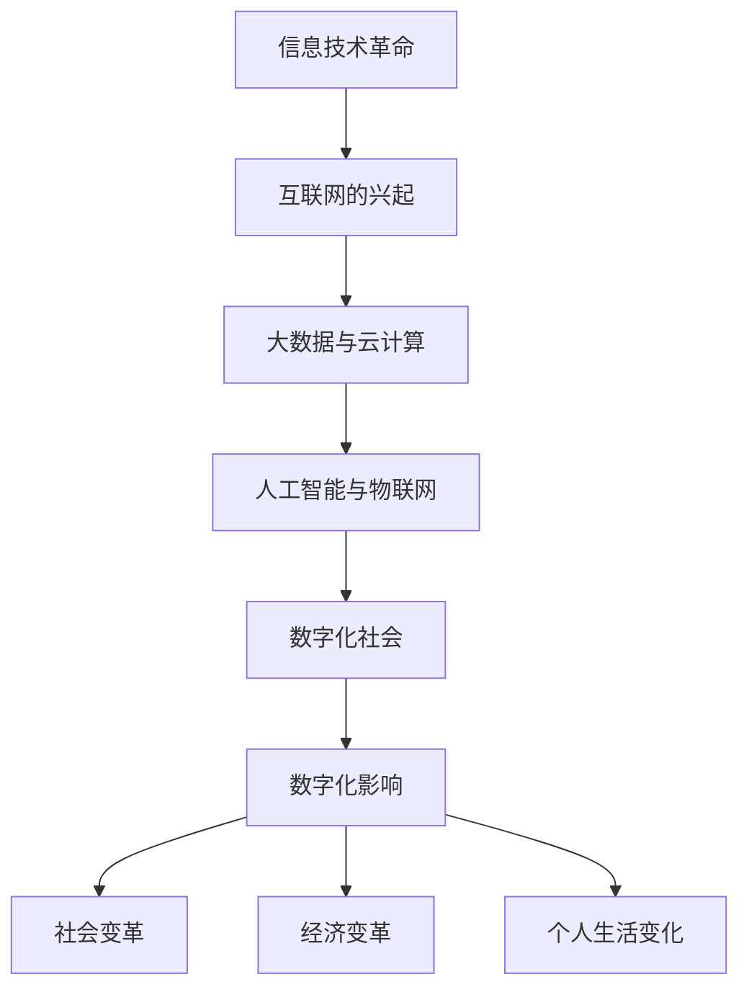
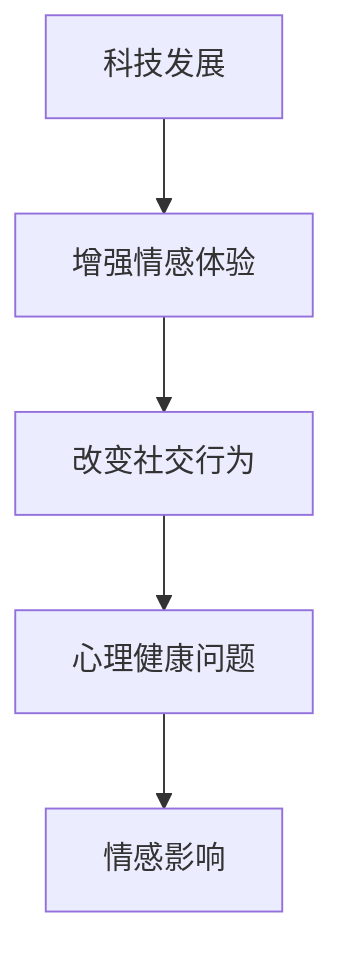
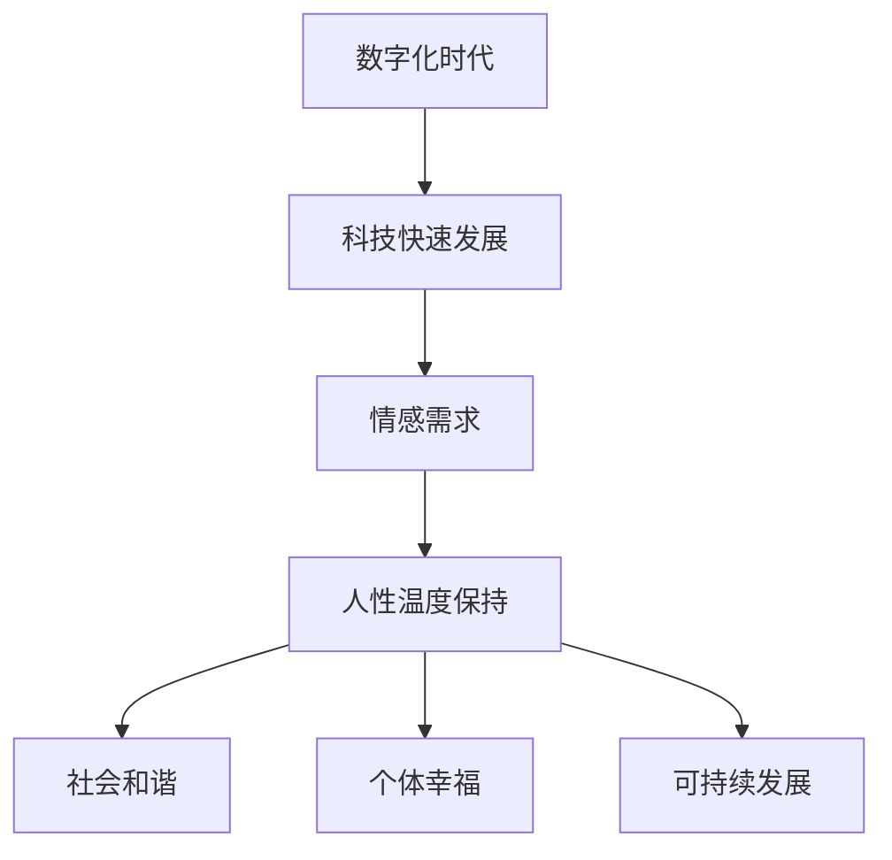

                 


为了撰写一篇高质量的、逻辑清晰、结构紧凑、简单易懂的技术博客文章，我们将遵循以下步骤：

### 第一步：确定文章主题与结构

文章标题：在数字化时代保持人性温度：科技与情感的平衡
关键词：数字化时代、人性温度、科技与情感、平衡
摘要：本文探讨了数字化时代下科技发展对人类情感的影响，以及如何在科技与情感之间保持平衡，以维持人性温度。

### 第二步：细化文章目录

在细化文章目录时，我们将确保每个章节的内容都涵盖了背景介绍、核心概念与联系、核心算法原理讲解、数学模型和公式详细讲解、项目实战、最佳实践 tips、小结、注意事项和拓展阅读等内容。以下是细化后的目录：

## 引言

### 数字化时代的定义与影响

- **核心概念与联系**：使用Mermaid流程图展示数字化时代的发展脉络。

### 科技发展对人类情感的影响

- **核心概念与联系**：使用Mermaid流程图展示科技发展与情感体验之间的关系。

### 在数字化时代保持人性温度的必要性

- **核心概念与联系**：使用Mermaid流程图展示数字化时代保持人性温度的重要性。

## 数字化时代的人性化设计

### 人性化设计的原则与方法

- **核心算法原理讲解**：介绍人性化设计的基本算法原理。
- **数学模型和公式详细讲解**：阐述设计过程中的情感因素分析。

### 情感计算与数字化产品

- **核心算法原理讲解**：介绍情感计算的概念与发展。
- **数学模型和公式详细讲解**：分析情感计算在数字化产品中的应用。

### 数字化时代的心理健康

- **核心算法原理讲解**：探讨心理健康技术在数字化产品中的应用。
- **数学模型和公式详细讲解**：提出促进心理健康与科技平衡的策略。

## 数字化时代的人性关怀

### 技术与伦理的平衡

- **核心算法原理讲解**：讨论科技伦理在数字化时代的重要性。
- **数学模型和公式详细讲解**：分析数字化时代的隐私保护问题。

### 数字化时代的教育与成长

- **核心算法原理讲解**：探讨数字化教育与情感培养的关系。
- **数学模型和公式详细讲解**：提出情感教育在数字化时代的作用。

### 数字化时代的社区与互动

- **核心算法原理讲解**：分析数字化社区的情感纽带作用。
- **数学模型和公式详细讲解**：探讨保持人性温度的数字化社区建设策略。

## 结论与展望

### 保持人性温度的重要性

- **核心算法原理讲解**：总结数字化时代保持人性温度的重要性。
- **数学模型和公式详细讲解**：讨论保持人性温度的现实挑战与未来展望。

### 总结与建议

- **核心算法原理讲解**：总结文章主题，提出具体建议。
- **数学模型和公式详细讲解**：提供未来数字化时代的思考方向。

### 第三步：撰写文章正文

在撰写文章正文时，我们将按照细化后的目录结构，逐章撰写内容，确保每个章节都包含详细的技术讲解、实例分析和最佳实践建议。

### 第四步：整合与校对

完成各章节的撰写后，我们将整合所有内容，进行整体校对，确保文章逻辑清晰、内容连贯、技术讲解准确、实例分析深入，并符合字数要求。

### 第五步：添加作者信息和格式

在文章末尾添加作者信息，并使用markdown格式对文章内容进行排版，确保格式规范、美观。

### 第六步：完成最终稿

完成所有步骤后，我们将得到一篇完整的、符合要求的技术博客文章，并在规定的字数范围内，确保内容质量和阅读体验。

---

现在，让我们开始细化文章内容，首先从第一章开始。在接下来的几个步骤中，我们将逐步完善第一章的每个部分，并遵循上述步骤，逐步完成整篇文章的撰写。请查看以下第一章的具体细化内容：

## 第1章：数字化时代的挑战与机遇

### 1.1 数字化时代的定义与影响

**核心概念与联系**

数字化时代，是指以互联网、大数据、云计算、人工智能等信息技术为核心驱动力的社会转型时期。数字化不仅改变了信息处理的方式，也深刻影响了人类社会生活的方方面面。

以下是数字化时代发展脉络的Mermaid流程图：



**核心算法原理讲解**

数字化时代的核心算法原理主要涉及数据收集、处理、分析和应用。以下是简化版的人性化设计算法原理伪代码：

```python
def digital_transformation():
    # 数据收集
    data = collect_data()
    # 数据处理
    processed_data = process_data(data)
    # 数据分析
    insights = analyze_data(processed_data)
    # 数据应用
    apply_insights(insights)
```

**数学模型和公式详细讲解**

数字化影响可以通过以下几个数学模型来描述：

1. **帕累托法则（80/20法则）**：20%的信息产生80%的效应。
   $$ \text{效应} = \alpha \cdot \text{信息}^{0.8} $$

2. **贝叶斯公式**：用于处理不确定性的概率模型。
   $$ P(A|B) = \frac{P(B|A) \cdot P(A)}{P(B)} $$

**举例说明**

例如，在电商领域，通过收集用户购买行为数据，使用贝叶斯公式来预测用户可能的购买倾向，从而实现个性化推荐。

### 1.2 科技发展对人类情感的影响

**核心概念与联系**

科技发展对人类情感的影响是多方面的，包括但不限于：

- **增强情感体验**：通过虚拟现实、增强现实等技术，提供更加沉浸式的情感体验。
- **影响社交行为**：社交媒体、即时通讯工具改变了人们的交流方式，可能带来社交距离的扩大。
- **心理健康问题**：过度依赖科技可能导致心理依赖和焦虑。

以下是科技发展与情感体验关系的Mermaid流程图：



**核心算法原理讲解**

科技影响情感的核心算法原理包括情感识别、情感分析和情感生成。以下是简化版的核心算法原理伪代码：

```python
def emotional_impact():
    # 情感识别
    emotions = recognize_emotions(data)
    # 情感分析
    insights = analyze_emotions(emotions)
    # 情感生成
    generate_response(insights)
```

**数学模型和公式详细讲解**

1. **情感分析中的支持向量机（SVM）**：用于分类情感标签。
   $$ w = \arg\min_w \sum_{i=1}^{n} (y_i - \text{sign}(w \cdot \text{x}_i))^2 $$

2. **情感生成中的循环神经网络（RNN）**：用于生成情感相关的文本。
   $$ h_t = \text{tanh}(W_h \cdot [h_{t-1}, x_t] + b_h) $$

**举例说明**

例如，通过收集用户在社交媒体上的评论数据，使用支持向量机来识别情感倾向，并根据情感倾向生成个性化的推荐内容。

### 1.3 在数字化时代保持人性温度的必要性

**核心概念与联系**

在数字化时代保持人性温度，即在面对科技快速发展的同时，仍然关注人类情感需求，保持对人类情感的理解和关怀。以下是数字化时代保持人性温度的重要性Mermaid流程图：



**核心算法原理讲解**

保持人性温度的核心算法原理涉及情感计算和心理健康技术的应用。以下是简化版的核心算法原理伪代码：

```python
def human_touch():
    # 情感计算
    emotional_data = emotional_computing()
    # 心理健康评估
    psychological_health = health_assessment(emotional_data)
    # 人性化响应
    response = generate_emo
```

