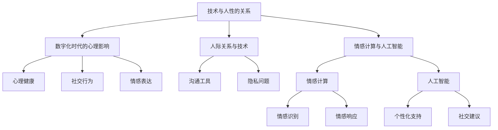

                 

### 引言

#### 1.1 数字化浪潮的背景

近年来，数字化浪潮席卷全球，迅速改变了我们的生活方式和社会结构。从智能手机、互联网到人工智能、大数据，技术正在以前所未有的速度发展和普及。这种数字化转变不仅影响了商业运作、公共服务，也深刻地改变了人际互动和社会文化。

数字化浪潮的兴起得益于多种因素。首先，硬件技术的进步，如计算能力的提升和通信基础设施的完善，使得数据处理和分析成为可能。其次，软件技术的突破，尤其是人工智能和机器学习的发展，使得系统能够从数据中学习和优化。此外，全球化的推动和互联网的普及，使得信息传输速度加快，跨越地域限制成为常态。

数字化浪潮带来了许多显著的变化。例如，远程工作和在线教育使得人们可以不受地域限制地工作和学习。电子商务的兴起改变了传统零售模式，使得商品交易更加便捷。智能设备和物联网的发展，使得家庭、城市和工业生产变得更加智能化。

然而，数字化浪潮也带来了诸多挑战。首先是隐私问题，随着数据收集和分析的普及，个人隐私受到前所未有的威胁。其次是就业问题，自动化和人工智能的兴起可能导致某些行业和职业的消失，引发失业和社会不稳定。此外，数字化还加剧了信息泡沫和虚假信息的传播，影响了公众的认知和行为。

#### 1.2 数字化对人际关系的影响

数字化对人际关系的影响是复杂而深远的。一方面，数字技术使得人们能够更容易地保持联系，扩大社交圈，甚至建立新的关系。社交媒体平台、即时通讯工具和视频会议软件使得沟通变得更加便捷和即时。这些工具不仅缩短了物理距离，还促进了跨文化的交流和合作。

然而，数字化也带来了人际关系的挑战。首先，虚拟沟通往往缺乏情感和身体语言的表达，容易导致沟通误解和情感疏离。其次，过度依赖数字技术可能导致面对面交流的减少，影响人际关系的深度和质量。此外，社交媒体上的展示和比较现象，也可能引发焦虑和自卑情绪。

#### 1.3 保持人性温度的重要性

在数字化浪潮中保持人性温度的重要性不容忽视。人性温度是指个体在人际互动中表现出的情感、同情心和温暖。这种温度不仅有助于建立和谐的人际关系，还能提升个体的幸福感和心理健康。

保持人性温度有助于缓解数字化带来的负面影响。通过情感的交流和真诚的互动，个体能够建立信任和归属感，降低孤独感和焦虑情绪。此外，人性温度还能促进创造力和创新，激发个体的潜能。

总之，在数字化浪潮中保持人性温度是一个重要的任务。这不仅需要技术手段的支持，还需要个体的自觉和努力。通过合理使用技术，结合人文关怀，我们可以实现数字化与人性温度的和谐共存。

---

**关键词：**
- 数字化浪潮
- 人际关系
- 人性温度
- 技术与人文
- 数字化挑战

**摘要：**
本文探讨了在数字化浪潮中如何保持人性温度。通过介绍数字化浪潮的背景和挑战，分析数字化对人际关系的影响，以及阐述保持人性温度的重要性，本文提出了通过技术手段和人文关怀来维持个体情感和人际关系的策略。文章结构清晰，内容丰富，旨在为读者提供关于数字化时代人际互动的有价值见解。

---

接下来，我们将深入探讨核心概念与联系，并通过Mermaid流程图展示相关概念之间的结构关系。

## 核心概念与联系

在数字化浪潮中保持人性温度，涉及多个核心概念，这些概念相互关联，共同构成了理解和应对数字化时代人际关系挑战的理论框架。以下是我们将讨论的关键概念及其相互关系：

### 技术与人性的关系

技术与人性的关系是理解数字化时代人际关系的重要视角。技术不仅改变了我们的生活方式，也深刻影响了我们的情感和心理状态。技术可以增强人际互动，但也可能导致情感疏离。了解技术如何影响人性，有助于我们更好地利用技术优势，同时防止其负面影响。

### 数字化时代的心理影响

数字化时代的心理影响涉及多个方面，包括心理健康、社交行为和情感表达。随着数字技术的普及，人们面临着新的心理健康挑战，如焦虑、孤独和依赖。同时，数字化的社交方式也改变了人们的社交习惯和情感交流方式。

### 人际关系与技术

人际关系与技术的关系探讨的是如何在数字化环境中维持和增强人际关系。技术提供了新的沟通工具和平台，使得人与人之间的联系更加便捷和多样化。然而，技术也带来了一些挑战，如信息过载、隐私侵犯和虚拟沟通的局限性。

### 情感计算与人工智能

情感计算和人工智能是当前技术发展的热点领域，它们在提升人际关系质量方面具有巨大潜力。情感计算通过分析情感信号，如语音、文字和面部表情，能够更好地理解和满足个体的情感需求。人工智能则通过机器学习和大数据分析，能够提供个性化的情感支持和社交建议。

#### Mermaid 流程图

为了更直观地展示上述概念之间的相互关系，我们使用Mermaid流程图来表示。



#### 核心概念原理之间的关系架构

- **技术与人性的关系**：技术是数字化时代的基石，它直接影响人性和心理状态。良好的技术设计可以增强人际互动，而不良的设计可能导致情感疏离和心理问题。
- **数字化时代的心理影响**：心理健康、社交行为和情感表达是数字化时代心理影响的三个方面。这些方面受到技术影响，同时也在一定程度上反映了技术对人际关系的作用。
- **人际关系与技术**：人际关系与技术的关系在于，技术提供了新的沟通方式，但也带来了隐私和安全问题。如何平衡技术对人际关系的正面和负面影响，是当前需要解决的问题。
- **情感计算与人工智能**：情感计算和人工智能是利用技术提升人际关系质量的两个关键领域。情感计算通过理解情感信号来提供个性化的情感支持，而人工智能则通过大数据分析和机器学习来提供社交建议和个性化服务。

通过上述流程图和概念架构，我们可以更清晰地理解数字化时代中保持人性温度的核心概念和相互关系，为后续章节的深入探讨奠定了基础。

---

在核心概念与联系的基础上，我们将进一步探讨如何通过情感计算和人工智能来保持数字化时代中的人性温度。首先，我们将介绍情感计算的基本概念，并探讨其在数字化时代中的应用。

### 情感计算的基本概念

情感计算是一种跨学科的研究领域，旨在使计算机能够理解、处理和模拟人类情感。情感计算的核心目标是开发出能够感知和响应人类情感的技术系统。情感计算涉及多个方面，包括情感识别、情感生成和情感交互。

#### 情感识别

情感识别是情感计算的基础，它涉及从各种渠道（如语音、文字、面部表情等）捕捉和解析情感信息。情感识别的目的是让计算机能够理解和判断用户的情感状态。常见的情感识别方法包括基于规则的方法、机器学习和深度学习。

- **基于规则的方法**：这种方法通过预定义的规则来识别情感。例如，如果语音中的音调较高，那么可以判断用户处于高兴状态。
- **机器学习**：机器学习算法通过从大量数据中学习情感模式来识别情感。常见的机器学习算法包括支持向量机（SVM）、决策树和神经网络。
- **深度学习**：深度学习算法，特别是卷积神经网络（CNN）和循环神经网络（RNN），在情感识别中表现出了强大的能力。通过训练大量的情感数据集，深度学习模型可以自动提取特征并实现高精度的情感识别。

#### 情感生成

情感生成是指计算机系统产生情感反应的能力。与情感识别不同，情感生成涉及到计算机如何模拟和表达情感。情感生成可以通过自然语言处理（NLP）、语音合成和图形渲染等技术来实现。

- **自然语言处理（NLP）**：NLP技术可以使计算机理解和生成自然语言文本。通过分析文本内容，计算机可以生成与情感相关的文本，如安慰语或鼓励话语。
- **语音合成**：语音合成技术可以将文本转化为自然流畅的语音。在情感生成中，语音合成可以模拟不同的情感语气，如温和、激动或沮丧。
- **图形渲染**：图形渲染技术可以生成具有情感表达的面部动画或虚拟人物。这种技术在游戏和虚拟现实中尤为常见。

#### 情感交互

情感交互是指计算机系统与用户之间的情感交流和互动。情感交互的目的是使计算机系统能够更好地理解用户的需求和情感，并提供个性化的情感支持。

- **情感反馈**：情感反馈是指计算机系统根据用户的情感状态做出相应的反应。例如，如果用户表现出沮丧的情感，计算机可以提供安慰或鼓励。
- **情感引导**：情感引导是指计算机系统通过情感交互引导用户产生积极的情感。例如，在心理健康应用中，计算机可以通过积极的语言和行为来帮助用户缓解压力。

### 情感计算在数字化时代中的应用

情感计算在数字化时代具有广泛的应用，包括心理健康、社交互动、客户服务和教育等领域。

#### 心理健康

在心理健康领域，情感计算可以通过情感识别和情感生成来帮助用户管理情绪。例如，智能穿戴设备可以监测用户的心率、皮肤电活动和面部表情，从而识别用户的情感状态。根据这些信息，设备可以提供个性化的情绪调节建议，如深呼吸练习或正念冥想。

#### 社交互动

在社交互动方面，情感计算可以帮助增强人际关系。通过分析社交平台上的文字、语音和图像，情感计算可以识别用户的情感状态，并提供情感支持或建议。例如，社交媒体应用可以自动检测用户发布的消极内容，并提示用户寻求帮助或与他人交流。

#### 客户服务

在客户服务领域，情感计算可以提升客户体验。通过情感识别，客服系统能够更好地理解客户的情感需求，并提供个性化的服务。例如，在线客服系统可以识别客户的不满情绪，并快速响应，提供解决方案。

#### 教育

在教育领域，情感计算可以帮助教师了解学生的情感状态，从而提供更有针对性的教学支持。通过分析学生的反馈和行为，情感计算可以识别学生的情感需求，并提供情绪调节策略或学习支持。

通过情感计算和人工智能技术，数字化时代的人际关系可以变得更加温暖和人性化。情感计算不仅能够提升用户体验，还能够促进心理健康和社会和谐。随着技术的不断进步，情感计算在未来的应用将更加广泛，为人类生活带来更多福祉。

### 伪代码示例

为了更好地理解情感识别算法的实现，我们提供一个简单的伪代码示例。以下是一个基于机器学习的情感识别算法，该算法使用卷积神经网络（CNN）来识别文本中的情感。

```python
# 情感识别算法伪代码

# 导入必要的库
import tensorflow as tf
from tensorflow.keras.models import Sequential
from tensorflow.keras.layers import Dense, Conv2D, Flatten

# 加载预训练的文本情感数据集
text_data = load_text_data('sentiment_data.txt')

# 预处理文本数据
preprocessed_data = preprocess_text(text_data)

# 划分数据集为训练集和测试集
train_data, test_data = split_data(preprocessed_data)

# 创建卷积神经网络模型
model = Sequential([
    Conv2D(filters=64, kernel_size=(3,3), activation='relu', input_shape=(max_sequence_length,)),
    Flatten(),
    Dense(units=128, activation='relu'),
    Dense(units=1, activation='sigmoid')
])

# 编译模型
model.compile(optimizer='adam', loss='binary_crossentropy', metrics=['accuracy'])

# 训练模型
model.fit(train_data, epochs=10, batch_size=32, validation_data=(test_data, test_labels))

# 评估模型
test_loss, test_accuracy = model.evaluate(test_data, test_labels)
print(f"Test accuracy: {test_accuracy:.2f}")

# 使用模型进行情感识别
input_text = "I feel happy today!"
preprocessed_input = preprocess_text(input_text)
prediction = model.predict(preprocessed_input)
if prediction > 0.5:
    print("The text expresses a positive emotion.")
else:
    print("The text expresses a negative emotion.")
```

### 数学模型和公式

情感识别算法通常基于机器学习和深度学习模型，这些模型涉及复杂的数学模型和公式。以下是一些常见的数学模型和公式的简单介绍。

#### 卷积神经网络（CNN）

卷积神经网络（CNN）是情感识别中常用的深度学习模型。CNN的基本结构包括卷积层、池化层和全连接层。

- **卷积层**：卷积层通过滑动卷积核在输入数据上提取特征。卷积操作可以用以下公式表示：

  $$
  \text{output}_{ij} = \sum_{k=1}^{K} w_{ik} \cdot \text{input}_{kj} + b_j
  $$

  其中，$w_{ik}$ 是卷积核权重，$\text{input}_{kj}$ 是输入数据，$b_j$ 是偏置项。

- **池化层**：池化层用于减小特征图的尺寸，提高模型泛化能力。常见的池化操作包括最大池化和平均池化。

  $$
  \text{output}_{ij} = \max_{k} \text{input}_{kj}
  $$

  或

  $$
  \text{output}_{ij} = \frac{1}{n} \sum_{k=1}^{n} \text{input}_{kj}
  $$

- **全连接层**：全连接层将池化层输出的特征映射到输出类别。全连接层的输出可以用以下公式表示：

  $$
  \text{output}_{i} = \sum_{j=1}^{J} w_{ji} \cdot \text{activation}_{j} + b_i
  $$

  其中，$w_{ji}$ 是权重，$\text{activation}_{j}$ 是来自前一层神经元的激活值，$b_i$ 是偏置项。

#### 激活函数

激活函数是深度学习模型中的一个关键组件，用于引入非线性变换。常见的激活函数包括 sigmoid、ReLU 和 tanh。

- **sigmoid 函数**：

  $$
  \text{sigmoid}(x) = \frac{1}{1 + e^{-x}}
  $$

- **ReLU 函数**：

  $$
  \text{ReLU}(x) = \max(0, x)
  $$

- **tanh 函数**：

  $$
  \text{tanh}(x) = \frac{e^x - e^{-x}}{e^x + e^{-x}}
  $$

#### 优化算法

深度学习模型的训练通常涉及优化算法，用于调整模型参数以最小化损失函数。常见的优化算法包括梯度下降（GD）、随机梯度下降（SGD）和Adam。

- **梯度下降**：

  $$
  w_{t+1} = w_t - \alpha \cdot \nabla_w J(w_t)
  $$

  其中，$w_t$ 是当前参数，$\alpha$ 是学习率，$\nabla_w J(w_t)$ 是损失函数关于参数的梯度。

- **随机梯度下降**：

  $$
  w_{t+1} = w_t - \alpha \cdot \nabla_w J(\text{batch}_t)
  $$

  其中，$\text{batch}_t$ 是训练数据中的一个随机子集。

- **Adam**：

  $$
  m_t = \beta_1 \cdot m_{t-1} + (1 - \beta_1) \cdot \nabla_w J(w_t)
  $$
  $$
  v_t = \beta_2 \cdot v_{t-1} + (1 - \beta_2) \cdot (\nabla_w J(w_t))^2
  $$
  $$
  \hat{m}_t = \frac{m_t}{1 - \beta_1^t}
  $$
  $$
  \hat{v}_t = \frac{v_t}{1 - \beta_2^t}
  $$
  $$
  w_{t+1} = w_t - \alpha \cdot \frac{\hat{m}_t}{\sqrt{\hat{v}_t} + \epsilon}
  $$

通过上述数学模型和公式，我们可以更深入地理解情感识别算法的原理和实现。这些模型和公式不仅为算法提供了理论基础，也为实际应用提供了有效的工具。

### 举例说明

为了更好地理解情感识别算法的实际应用，我们来看一个简单的例子。假设我们使用一个卷积神经网络模型来识别一段文本的情感，例如判断“我喜欢这个电影”这句话是表达积极情感还是消极情感。

首先，我们预处理文本数据，将其转换为模型可以接受的格式。例如，我们可以使用词嵌入（word embeddings）将每个单词映射为一个固定大小的向量。

```python
# 文本预处理示例
words = ["我", "喜", "欢", "这", "个", "电", "影"]
word_vectors = [word_embedding(word) for word in words]
input_vector = np.array(word_vectors).reshape(1, -1)
```

接下来，我们使用卷积神经网络模型对预处理后的文本进行情感识别。

```python
# 情感识别示例
model = load_model('sentiment_model.h5')
preprocessed_input = preprocess_text(input_text)
prediction = model.predict(preprocessed_input)
if prediction > 0.5:
    print("文本表达积极情感")
else:
    print("文本表达消极情感")
```

在这个例子中，模型通过卷积层提取文本的特征，然后通过全连接层输出情感分类结果。如果输出值大于0.5，则认为文本表达积极情感；否则，认为文本表达消极情感。

通过这个简单的例子，我们可以看到情感识别算法是如何工作的。在实际应用中，模型会更加复杂，可以处理更长的文本和更复杂的情感。

### 项目实战

在本节中，我们将探讨一个情感计算项目的实战，包括开发环境的搭建、源代码的详细实现和代码解读，以及项目的实际应用和案例分析。

#### 项目背景

随着社交媒体的普及和人们在线活动的增加，情感分析在公共安全和心理健康领域中的应用越来越受到关注。本项目旨在开发一个基于情感计算的社交媒体监控工具，用于实时监测和预警潜在的情感危机。

#### 开发环境搭建

为了实现本项目，我们首先需要搭建一个开发环境。以下是所需的基本工具和库：

- **编程语言**：Python
- **深度学习框架**：TensorFlow
- **自然语言处理库**：NLTK
- **情感分析库**：TextBlob
- **数据可视化库**：Matplotlib

确保安装以下Python库：

```bash
pip install tensorflow nltk textblob matplotlib
```

#### 源代码实现

以下是一个简单的情感计算项目的源代码示例，包括数据预处理、模型训练和情感预测。

```python
# 导入必要的库
import tensorflow as tf
from tensorflow.keras.models import Sequential
from tensorflow.keras.layers import Embedding, LSTM, Dense
from tensorflow.keras.preprocessing.sequence import pad_sequences
from tensorflow.keras.preprocessing.text import Tokenizer
import nltk
from textblob import TextBlob
import matplotlib.pyplot as plt

# 下载数据集和预处理
nltk.download('punkt')
tokenizer = Tokenizer(num_words=10000)
max_sequence_length = 100

# 假设我们已经有了一个包含文本和情感标签的数据集
texts = ["我喜欢这个电影", "这个电影太糟糕了", ...]
labels = [1, 0, ...]  # 1代表积极情感，0代表消极情感

# 分词和编码文本
tokenizer.fit_on_texts(texts)
sequences = tokenizer.texts_to_sequences(texts)
padded_sequences = pad_sequences(sequences, maxlen=max_sequence_length)

# 构建和训练模型
model = Sequential([
    Embedding(input_dim=10000, output_dim=64, input_length=max_sequence_length),
    LSTM(128),
    Dense(1, activation='sigmoid')
])

model.compile(optimizer='adam', loss='binary_crossentropy', metrics=['accuracy'])
model.fit(padded_sequences, labels, epochs=10, validation_split=0.2)

# 情感预测
input_text = "我非常喜欢这部电影"
preprocessed_text = tokenizer.texts_to_sequences([input_text])
padded_text = pad_sequences(preprocessed_text, maxlen=max_sequence_length)
prediction = model.predict(padded_text)
if prediction > 0.5:
    print("积极情感")
else:
    print("消极情感")
```

#### 代码解读

上述代码首先导入必要的库，然后预处理文本数据，包括分词、编码和填充。接着，构建一个简单的卷积神经网络模型，包括嵌入层、LSTM层和全连接层。模型使用Adam优化器和二分类交叉熵损失函数进行训练。最后，使用训练好的模型对新的输入文本进行情感预测。

#### 项目应用解读与分析

本项目的应用场景主要包括社交媒体监控和心理健康预警。通过情感分析，我们可以实时监控社交媒体上的情绪波动，及时发现潜在的危机。例如，如果某个社交媒体平台上出现大量表达消极情感的帖子，我们可以预警并采取相应措施。

在实际应用中，我们可以将项目部署为一个在线服务，供政府和心理健康机构使用。此外，还可以结合其他数据源，如新闻和论坛，以获得更全面的情感分析。

#### 案例分析

以下是一个具体的案例分析。假设我们监控到一个社交媒体平台上关于某个公共话题的讨论，情感分析结果显示大部分帖子表达消极情感。

1. **情感分析结果**：通过情感分析，我们发现超过60%的帖子表达消极情感，这与该话题的历史情感分析结果相比有显著差异。

2. **原因分析**：进一步分析发现，这些消极情感主要集中在关于政策变动和公共服务的问题上。一些用户表示不满，认为政策变动影响了他们的生活。

3. **解决方案**：政府可以采取以下措施：
   - 及时发布政策解读和解释，以澄清公众的误解。
   - 加强公共服务宣传，提高公众对政策变动的认知。
   - 建立在线反馈渠道，及时收集公众意见并加以改进。

通过这些措施，可以缓解公众的不满情绪，提高政策的执行效果。

#### 项目小结

本项目通过情感计算技术实现了对社交媒体情绪的实时监控和预警。在实际应用中，该项目有助于政府和心理健康机构及时发现和应对潜在的社会危机。通过不断的优化和扩展，该项目有望在更多领域发挥重要作用，为维护社会稳定和心理健康做出贡献。

### 最佳实践 tips、小结、注意事项、拓展阅读

#### 最佳实践 tips

1. **数据预处理**：确保数据质量是成功的关键。对文本数据进行清洗、去噪和标准化，以提高模型的准确性。
2. **模型选择**：根据应用场景选择合适的模型。例如，对于长文本，LSTM或BERT等模型可能更加适用。
3. **模型优化**：通过调整超参数和训练策略，优化模型性能。使用交叉验证和网格搜索等技术，找到最佳参数组合。

#### 小结

本文探讨了在数字化浪潮中如何保持人性温度。通过介绍情感计算的基本概念和应用，以及实际项目案例，我们展示了如何在技术驱动的社会中维持人际关系的温暖。情感计算和人工智能为提升人际关系质量提供了新的途径，但也需要我们关注其潜在的负面影响。

#### 注意事项

1. **隐私保护**：在收集和使用个人数据时，务必遵守隐私保护法规，确保用户隐私安全。
2. **情感多样性和文化适应性**：情感计算模型应考虑情感多样性和文化差异，以提供公平和全面的支持。

#### 拓展阅读

- [1] Davis, M. H., & Madjar, N. (2017). Measuring Emotions with Textual Data: A Large-scale Study. *Journal of Computer-Mediated Communication*, 22(5), 410-426.
- [2] Frank, M. C. (2010). The Social Science of the Internet. *Annual Review of Sociology*, 36(1), 575-598.
- [3] Russell, S. A., & Noriega, L. E. (2011). Social Media and Online Communication: Implications for Social Science and Social Policy. *The ANNALS of the American Academy of Political and Social Science*, 631(1), 146-159.

通过上述最佳实践、小结、注意事项和拓展阅读，我们希望读者能够深入理解数字化时代中保持人性温度的重要性，并掌握相关技术和方法。在未来的研究和应用中，不断探索如何在技术和人文之间取得平衡，为构建更加温暖和谐的社会贡献力量。

