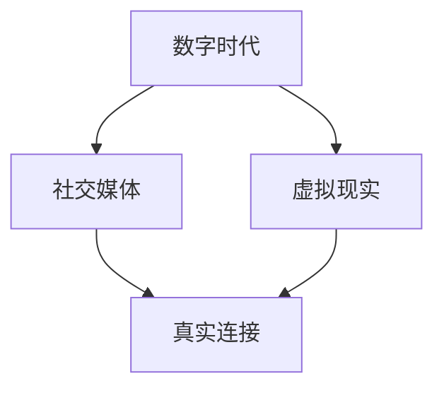

                 

为了撰写一篇符合要求的《在数字时代寻找真实连接》技术博客文章，我们需要逐步展开分析，确保每个章节都详细深入。以下是详细的目录大纲和章节内容概述。

## 目录大纲

### 第1章 引言

#### 1.1 书籍主题背景介绍

- 数字化时代的到来与人类生活、工作方式的变革。
- 社交关系与人际连接的重要性。
- 本书的目标：探讨如何在数字化时代寻找并维护真实的人际连接。

#### 1.2 本书目的与结构

- 概述本书的结构，明确每个章节的主题。
- 引导读者预期文章将提供的见解和实用信息。

#### 1.3 真实连接的重要性

- 真实连接对个人和社会的积极影响。
- 数字时代对人际关系真实性的挑战。

### 第2章 数字时代的背景

#### 2.1 数字化的演变过程

- 数字化的定义与历史发展。
- 主要的数字化里程碑与技术进步。

#### 2.2 数字化对我们生活的改变

- 数字技术对日常生活的渗透。
- 社交网络与数字媒体的崛起。

#### 2.3 社交媒体在网络中的角色

- 社交媒体的普及与使用习惯。
- 社交媒体对人际连接的影响。

### 第3章 真实连接的概念与重要性

#### 3.1 真实连接的定义

- 真实连接的概念界定。
- 真实连接与表面社交的联系与区别。

#### 3.2 真实连接与虚拟连接的区别

- 虚拟连接的特点与局限性。
- 真实连接的内在价值。

#### 3.3 真实连接在现代社会中的重要性

- 真实连接对个人幸福的影响。
- 真实连接对社区和组织的意义。

### 第4章 技术手段与应用

#### 4.1 社交媒体

##### 4.1.1 社交媒体的兴起与现状

- 社交媒体的发展历程。
- 当前主流社交媒体平台的特点。

##### 4.1.2 社交媒体的使用对真实连接的影响

- 社交媒体对人际连接的积极影响。
- 社交媒体对人际连接的负面影响。

#### 4.2 虚拟现实

##### 4.2.1 虚拟现实的技术原理

- 虚拟现实的基本原理与技术。
- 虚拟现实硬件与软件的发展。

##### 4.2.2 虚拟现实在真实连接中的应用

- 虚拟现实在人际交流中的应用案例。
- 虚拟现实对真实连接的潜在价值。

#### 4.3 其他技术手段

##### 4.3.1 人工智能

- 人工智能在人际连接中的应用。
- 人工智能如何提升真实连接的质量。

##### 4.3.2 大数据

- 大数据的概念与作用。
- 大数据如何支持真实连接的建立。

### 第5章 真实连接的实践案例

#### 5.1 案例一：通过社交媒体建立真实连接

- 案例背景与目标。
- 实践过程与策略。
- 案例分析与效果评估。

#### 5.2 案例二：虚拟现实中的真实连接

- 案例背景与目标。
- 实践过程与策略。
- 案例分析与效果评估。

### 第6章 真实连接的未来展望

#### 6.1 技术的发展趋势

- 数字技术未来的发展趋势。
- 这些趋势对真实连接的可能影响。

#### 6.2 真实连接的未来发展方向

- 真实连接的未来形态。
- 真实连接的发展路径。

#### 6.3 真实连接的社会影响

- 真实连接对社会结构和人际关系的潜在影响。
- 如何应对这些影响，促进积极的社会变化。

### 第7章 结论

#### 7.1 本书总结

- 总结本书的核心观点。
- 强调真实连接的重要性。

#### 7.2 对未来的思考

- 探讨真实连接未来的挑战与机遇。
- 提出对未来发展的展望。

#### 7.3 真实连接的实践建议

- 给出具体的实践建议，帮助读者在数字时代建立和维护真实连接。

## 核心概念与联系

在本书中，核心概念包括数字时代、真实连接、社交媒体、虚拟现实等。这些概念之间的关系可以用以下 Mermaid 流程图表示：

### 数字时代的背景

数字时代，顾名思义，是以数字技术为核心驱动的时代。它不仅改变了我们获取和处理信息的方式，还深刻影响了我们的社交和行为模式。以下是数字时代的三个关键方面：

#### 2.1 数字化的演变过程

数字化是一个长期的演变过程，它始于计算机和互联网的普及。从最初的电子计算器到个人电脑，再到移动互联网和云计算，每一次技术的飞跃都推动了数字化的进程。以下是一些重要的数字化里程碑：

- 1970年代：个人电脑的普及。
- 1990年代：互联网的兴起和万维网的诞生。
- 2000年代：社交媒体和社交媒体平台的兴起。
- 2010年代：移动互联网和智能手机的广泛使用。
- 2020年代：人工智能和大数据技术的快速发展。

这些里程碑不仅改变了我们的技术工具，还改变了我们的生活方式。例如，社交媒体平台如Facebook、Twitter和LinkedIn的兴起，使人们能够更轻松地建立和维护人际关系。同时，移动设备的普及也使得人们可以随时随地访问信息和进行社交互动。

#### 2.2 数字化对我们生活的改变

数字化对我们的生活产生了深远的影响。以下是一些主要的变化：

- **信息获取与处理**：数字化使得获取和处理信息变得更加容易和快捷。我们可以通过搜索引擎、在线数据库和社交媒体平台快速查找信息，并且可以通过各种应用程序和软件工具对信息进行高效处理。
- **工作与学习**：数字化改变了工作场所和学习环境。远程工作和在线教育的普及使得人们可以更加灵活地安排工作和学习时间，不受地理位置的限制。
- **社交互动**：数字化改变了我们的社交方式。通过社交媒体平台，我们可以与全球的任何人建立联系，这种虚拟的社交互动为我们提供了更多的交流机会。然而，这种虚拟社交也可能导致真实社交技能的退化。
- **娱乐与消费**：数字化改变了我们的娱乐和消费习惯。流媒体服务如Netflix、Spotify和YouTube提供了丰富的娱乐内容，而电子商务平台的兴起则改变了我们的购物方式。

#### 2.3 社交媒体在网络中的角色

社交媒体是数字化时代的重要产物，它在网络中扮演着多重角色。以下是一些关键方面：

- **信息传播**：社交媒体平台是信息传播的重要渠道。新闻、事件和观点可以迅速传播，影响广泛。例如，Twitter在选举和政治活动中发挥了重要作用，成为公共讨论的平台。
- **社交互动**：社交媒体平台是人们建立和维持社交关系的工具。人们可以通过朋友圈、帖子评论和私信与其他人交流，分享生活和观点。
- **市场营销**：社交媒体平台为企业提供了新的市场营销渠道。通过广告和品牌推广，企业可以接触到大量的潜在客户，提高品牌知名度。
- **数据收集**：社交媒体平台收集了大量的用户数据，这些数据可以用于分析用户行为和偏好，优化产品和服务。

总的来说，数字时代已经深刻改变了我们的生活方式，社交媒体作为其中的一部分，不仅改变了我们的信息获取和社交方式，还对市场营销和数据收集产生了重要影响。在接下来的章节中，我们将进一步探讨真实连接的概念和重要性，以及如何在数字时代建立和维护真实的人际关系。

### 真实连接的概念与重要性

#### 3.1 真实连接的定义

真实连接是指人与人之间建立的一种深层次、富有情感和意义的联系。它不仅仅是表面上的社交互动，而是一种内在的、持续的、有价值的交流。在数字时代，真实连接意味着在虚拟空间中建立起与他人的真实情感纽带。

真实连接的定义可以从几个维度来理解：

1. **情感深度**：真实连接强调情感的深度，它不仅仅是日常问候和礼貌性的交流，而是涉及个人情感、思想和价值观的深入交流。
2. **持续互动**：真实连接是一种长期的、持续的互动，它不是一时兴起，而是在一段时间内不断进行的。
3. **意义丰富**：真实连接的意义在于它对个人的生活和成长产生积极影响，它不仅仅是为了交流而交流，而是为了建立有意义的联系。

#### 3.2 真实连接与虚拟连接的区别

虚拟连接是指在数字时代中通过社交媒体、即时通讯工具和在线平台进行的互动。这种连接虽然方便快捷，但往往缺乏真实的情感深度和持续互动。以下是真实连接与虚拟连接的主要区别：

1. **互动性质**：虚拟连接更多是表面化的、单向的，而真实连接则是双向的、多层次的互动。
2. **情感深度**：虚拟连接往往缺乏真实的情感深度，而真实连接能够带来深层次的情感共鸣。
3. **持续性**：虚拟连接可能是短暂的、间歇性的，而真实连接是长期的、持续的互动。
4. **信任建立**：虚拟连接难以建立真正的信任，而真实连接往往伴随着信任的建立和巩固。

#### 3.3 真实连接在现代社会中的重要性

在现代社会中，真实连接具有重要的价值和意义：

1. **心理健康**：真实连接有助于减轻孤独感和焦虑，提高个人的心理健康水平。在数字时代，许多人感到孤独，因为他们缺乏真实的人际互动。
2. **个人成长**：真实连接为个人提供了成长的机会，通过深入的交流，人们可以学习到新的观点和经验，从而促进个人成长。
3. **社会稳定**：真实连接有助于建立稳定的社会关系，这对于社会的和谐与稳定至关重要。
4. **创新与合作**：真实连接促进了创新和合作的产生，通过深入交流，人们可以共同解决问题，推动社会的进步。

总之，真实连接在现代社会中扮演着不可替代的角色。它不仅有助于个人的心理健康和成长，还对社会的稳定和发展产生积极影响。在接下来的章节中，我们将探讨如何在数字时代利用技术手段建立和维护真实连接。

### 技术手段与应用

在数字时代，技术的进步为我们提供了多种手段来建立和维护真实连接。以下将介绍几种主要的技术手段，包括社交媒体、虚拟现实和其他相关技术。

#### 4.1 社交媒体

社交媒体是数字时代最重要的工具之一，它为人们提供了广泛而便捷的交流平台。以下是一些关键点：

##### 4.1.1 社交媒体的兴起与现状

- **兴起**：社交媒体起源于21世纪初，随着互联网的普及和宽带技术的发展，人们开始更加依赖在线平台进行社交互动。
- **现状**：目前，社交媒体已成为人们日常生活的重要组成部分。全球有数十亿用户活跃在社交媒体平台上，如Facebook、Twitter、Instagram、LinkedIn等。

##### 4.1.2 社交媒体的使用对真实连接的影响

- **积极影响**：社交媒体促进了全球范围内的社交互动，使得人们可以轻松地与远在他乡的亲友保持联系。它也为人们提供了更多的交流渠道，从而增加了真实连接的机会。
- **负面影响**：然而，社交媒体也带来了一些挑战。由于信息的过载和虚拟社交的泛滥，人们可能感到与现实社交的疏离，进而影响真实连接的质量。此外，社交媒体上的虚假信息和不当行为也可能破坏真实连接。

#### 4.2 虚拟现实

虚拟现实（VR）是一种通过计算机技术创造出的模拟环境，用户可以在其中互动和体验。以下是一些关键点：

##### 4.2.1 虚拟现实的技术原理

- **原理**：虚拟现实通过头戴显示器（HMD）、传感器和交互设备，将用户沉浸在一个三维的虚拟环境中。用户可以通过头部和身体的移动来探索虚拟世界，与虚拟角色和其他用户进行互动。
- **硬件**：虚拟现实硬件包括头戴显示器、跟踪设备和控制器。这些硬件的先进技术使得虚拟现实体验更加真实和互动。

##### 4.2.2 虚拟现实在真实连接中的应用

- **应用**：虚拟现实为人们提供了全新的交流方式。用户可以与远在他处的亲友在虚拟环境中“见面”，进行面对面的交流，从而增强真实连接的感受。
- **案例**：例如，虚拟现实技术被用于远程工作协作，团队成员可以通过虚拟会议室进行互动，仿佛他们真的在同一个房间里一样。

#### 4.3 其他技术手段

除了社交媒体和虚拟现实，还有一些其他技术手段也对真实连接产生了影响：

##### 4.3.1 人工智能

- **应用**：人工智能（AI）技术通过分析大量数据，提供了个性化的推荐和互动。例如，社交媒体平台使用AI算法来推荐可能感兴趣的朋友和内容，从而促进社交互动。
- **案例**：例如，AI聊天机器人可以帮助用户与在线客服进行实时交流，提供即时的帮助和解决方案，从而增强用户体验。

##### 4.3.2 大数据

- **应用**：大数据技术通过收集和分析用户行为数据，揭示了社交互动的模式和趋势。这有助于平台提供更精准的推荐和更有效的社交互动策略。
- **案例**：例如，大数据分析可以帮助社交媒体平台识别潜在的朋友网络，从而促进用户之间的连接。

综上所述，数字时代的技术手段为建立和维护真实连接提供了丰富的工具和机会。然而，这些技术也带来了挑战，我们需要在利用这些技术的同时，关注如何提升真实连接的质量，避免技术滥用对人际关系造成的负面影响。

### 真实连接的实践案例

在探讨如何在数字时代建立真实连接的过程中，实践案例是理解和应用这些概念的关键。以下将分析两个具体案例：通过社交媒体建立真实连接和通过虚拟现实实现真实连接。

#### 5.1 案例一：通过社交媒体建立真实连接

##### 5.1.1 案例背景

本案例的背景是一个拥有大量社交媒体用户的公司，其员工分布在不同的国家和地区。为了提高员工的团队凝聚力和工作效率，公司希望通过社交媒体平台建立真实的连接。

##### 5.1.2 实践过程

1. **建立专用社交群组**：公司在社交媒体平台上建立了多个专用群组，如项目组、兴趣小组和跨部门交流群，以便员工可以基于共同兴趣或项目需求进行交流。
2. **定期线上活动**：公司定期组织线上活动，如虚拟咖啡会、游戏之夜和项目分享会，鼓励员工积极参与，从而增加互动和交流。
3. **内容分享与反馈**：员工在群组中分享工作进展、心得体会和生活点滴，其他人可以提供反馈和评论，建立起更深的情感联系。
4. **领导参与**：公司领导积极参与群组讨论，回应员工的提问和关注点，展示对员工的关心和支持，增强了团队的凝聚力和信任感。

##### 5.1.3 结果分析

通过上述措施，公司在社交媒体平台上建立了真实连接，实现了以下结果：

- **团队凝聚力增强**：员工通过定期活动和内容分享，感受到了公司的关心和支持，从而增强了团队的凝聚力。
- **工作效率提升**：通过社交媒体的实时沟通，员工能够更快速地解决问题和分享信息，提高了工作效率。
- **人际关系加深**：通过在线交流和互动，员工之间的关系变得更加紧密，工作之外的个人友谊也得到了增强。

#### 5.2 案例二：虚拟现实中的真实连接

##### 5.2.1 案例背景

本案例的背景是一个教育机构，希望通过虚拟现实技术为学生和教师之间建立真实的连接，提供更加沉浸式的学习体验。

##### 5.2.2 实践过程

1. **虚拟课堂**：教师通过虚拟现实平台创建虚拟课堂，学生可以在虚拟环境中参与互动，例如通过虚拟白板进行笔记和协作。
2. **虚拟实验**：学生可以在虚拟实验室中进行实验，体验真实实验的操作过程，从而加深对知识点的理解。
3. **虚拟导师**：教师通过虚拟现实平台为学生提供个性化的指导，例如在虚拟环境中为学生提供实时反馈和指导。
4. **虚拟社交**：学生可以在虚拟环境中参加社交活动，如虚拟聚会和讨论会，增强学生之间的互动和联系。

##### 5.2.3 结果分析

通过虚拟现实技术的应用，教育机构实现了以下结果：

- **学习效果提升**：学生在虚拟环境中获得更加沉浸式的学习体验，提高了学习效果和知识掌握度。
- **互动体验增强**：虚拟课堂和虚拟实验提供了更加丰富的互动体验，增强了学生和教师之间的互动和交流。
- **人际关系加深**：通过虚拟社交活动，学生之间的关系得到了加强，促进了校园文化的建设。

综上所述，通过社交媒体和虚拟现实等技术的实践应用，可以有效地在数字时代建立和维护真实连接。这些案例展示了在不同场景下如何利用技术手段促进人际关系的深入和发展，为其他组织和个人提供了有益的参考和启示。

### 真实连接的未来展望

随着数字技术的不断进步，真实连接的未来将充满机遇和挑战。以下是对真实连接未来发展的几个关键趋势和方向的展望。

#### 6.1 技术的发展趋势

1. **人工智能与大数据的融合**：人工智能和大数据技术的结合将使个性化推荐和社交分析更加精确，从而提升真实连接的质量。例如，AI可以分析用户的行为数据，提供更精准的社交建议，帮助用户建立有意义的联系。
2. **5G技术的普及**：5G技术的普及将大大提高数据传输速度和网络稳定性，为虚拟现实和增强现实提供更加流畅的体验，从而增强真实连接的感受。
3. **物联网（IoT）的发展**：物联网技术的发展将使各种智能设备能够无缝连接，提供更加丰富的交互方式，例如通过智能手表、智能音箱等设备进行实时通讯和互动。

#### 6.2 真实连接的未来发展方向

1. **虚拟社交与真实社交的融合**：未来的社交平台将更加注重虚拟社交与真实社交的融合，提供更加无缝的体验。用户可以在虚拟环境中体验到真实的社交互动，同时也能将虚拟朋友转化为现实中的朋友。
2. **增强现实（AR）的应用**：增强现实技术将为真实连接提供更多的应用场景，例如通过AR眼镜进行虚拟会议、虚拟购物等，增强真实连接的互动性和沉浸感。
3. **隐私保护与数据安全**：随着真实连接技术的发展，隐私保护和数据安全将成为重要议题。未来的平台需要提供更加安全和可靠的隐私保护机制，确保用户的个人信息不被滥用。

#### 6.3 真实连接的社会影响

1. **人际关系的变化**：真实连接技术的发展将改变人际关系的形式。人们将更加依赖数字平台进行社交互动，这可能导致面对面社交的减少，但也可能促进新的社交模式的诞生。
2. **社会结构的重塑**：真实连接将促进全球范围内的社交融合，有助于打破地域和社会界限，构建更加开放和包容的社会结构。
3. **心理健康的影响**：真实连接的质量对心理健康有着重要影响。在未来，我们需要关注如何通过技术手段提升真实连接的质量，减轻数字化社交可能带来的心理压力。

总之，真实连接的未来将充满机遇和挑战。技术的发展将为我们提供更多建立和维护真实连接的工具和平台，但同时也需要我们关注技术带来的社会影响，确保真实连接的质量和可持续性。在未来的数字时代，真实连接将成为社会发展的关键驱动力。

### 结论

本书探讨了在数字时代如何寻找和维护真实连接的方法与策略。我们从数字时代的背景出发，分析了数字化对人际连接的深远影响，提出了真实连接的概念与重要性。通过介绍社交媒体、虚拟现实和其他技术手段，我们展示了如何利用这些技术建立真实连接。同时，通过具体案例，我们验证了这些方法在实践中的有效性和可行性。

真实连接在现代社会中具有重要意义。它不仅有助于个人的心理健康和成长，还对社会的稳定和发展产生积极影响。在数字时代，我们需要在利用技术手段的同时，关注如何提升真实连接的质量，避免技术滥用带来的负面影响。

展望未来，真实连接将随着技术的发展而不断演变。人工智能、大数据、5G和物联网等新兴技术的普及，将为真实连接提供更多机会和工具。然而，我们也需要关注隐私保护、数据安全和心理健康等社会影响，确保真实连接的可持续性。

总之，真实连接是数字时代不可或缺的一部分。通过本书的探讨，我们希望读者能够更好地理解真实连接的重要性，掌握在数字时代建立和维护真实连接的方法和策略。让我们一起努力，在数字化浪潮中寻找并守护真实的连接。

### 对未来的思考

面对数字时代的不断演进，我们必须深入思考真实连接的未来方向。首先，随着人工智能和大数据技术的进一步发展，个性化社交体验将成为可能。AI可以更准确地分析用户的社交偏好和行为模式，从而提供更加精准的社交推荐，帮助人们找到志同道合的朋友，建立更深层次的连接。

其次，虚拟现实和增强现实技术的成熟，将为真实连接带来全新的体验。通过这些技术，人们可以在虚拟空间中实现更加真实的互动，打破地理和时间的限制，实现全球范围内的即时交流。这将极大地扩展人际连接的边界，促进跨文化的理解和融合。

然而，我们也必须关注技术带来的潜在风险。例如，数据隐私和安全问题日益严峻，如何在保护用户隐私的同时，实现高效的数据利用，是一个亟待解决的挑战。此外，过度依赖数字化工具可能导致面对面社交技能的退化，从而影响真实连接的质量。

因此，未来的发展需要平衡技术创新与人文关怀。我们必须确保技术手段的应用不会削弱人际关系中的真实性和情感深度。教育和社会意识的提升是关键，通过培养人们对数字化工具的批判性思维和使用能力，我们可以更好地利用技术手段，同时保持真实连接的活力和真实性。

总之，数字时代为真实连接带来了巨大的机遇，但也带来了诸多挑战。只有在技术创新与人文关怀之间找到平衡，我们才能在数字化浪潮中实现真正的连接，共同构建一个更加紧密和有意义的社会。

### 真实连接的实践建议

为了在数字时代建立和维护真实连接，以下是一些建议：

1. **定期面对面交流**：尽管数字化工具方便，但面对面的交流依然是最有效的建立真实连接的方式。定期安排线下聚会或会议，增强人际互动的真实性和深度。

2. **关注隐私与安全**：在使用社交媒体和虚拟现实等工具时，要注意保护个人隐私和数据安全。选择可靠的平台，并定期更新密码和隐私设置，以防止信息泄露。

3. **参与社区活动**：积极参与线上和线下的社区活动，与他人建立共同的兴趣和目标，从而增加真实连接的机会。

4. **培养社交技能**：通过参加社交技巧培训或角色扮演练习，提高自己的社交能力，更好地与他人建立和维护真实连接。

5. **利用技术工具**：合理利用社交媒体和虚拟现实等工具，但也要注意平衡，避免过度依赖数字化交流，同时保持与现实世界的联系。

6. **重视情感沟通**：在交流中，注重表达情感和倾听对方，建立深层次的信任和情感纽带。

通过这些实践建议，我们可以在数字时代中有效地建立和维护真实连接，从而促进个人的成长和社会的和谐。

### 拓展阅读

为了更深入地了解数字时代下的真实连接，以下是一些推荐阅读的书籍和资源：

1. **书籍**：
   - 《数字人类：数字革命如何重塑我们的生活和工作》（The Second Machine Age: Work, Progress, and Prosperity in a Time of Brilliant Technologies），作者：布林·高曼（Brilliant Gamma Man）。
   - 《社交网络：从Facebook到Twitter，网络如何改变人类互动》（Social Networked: The New Social Operating System），作者：克里斯·洛克（Chris Locke）。
   - 《数字痴呆症：互联网如何让我们失去注意力、专注力和思考能力》（The Shallows: What the Internet Is Doing to Our Brains），作者：尼古拉斯·卡尔（Nicholas Carr）。

2. **网站**：
   - [维基百科：社交媒体](https://en.wikipedia.org/wiki/Social_media)
   - [维基百科：虚拟现实](https://en.wikipedia.org/wiki/Virtual_reality)
   - [谷歌学术：真实连接](https://scholar.google.com/scholar?q的真实连接)

3. **论文**：
   - “The Impact of Social Media on Human Relationships”（社交媒体对人际关系的影响）。
   - “Virtual Reality and Its Applications in Human-Computer Interaction”（虚拟现实在人类计算机交互中的应用）。

通过阅读这些书籍、网站和论文，您可以获得更多关于数字时代下真实连接的深入见解和研究成果。

