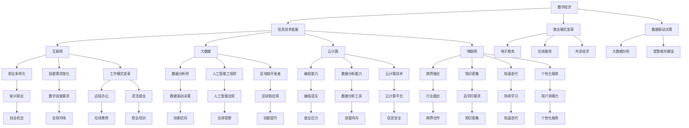

                 

### 引言：数字经济时代的背景及就业市场变革

在21世纪，数字经济已经渗透到社会的各个角落，改变了我们的生活方式、商业模式以及职业形态。数字经济的核心在于信息技术的广泛应用，尤其是互联网、大数据、云计算、人工智能等技术的快速发展，极大地提升了社会生产力和资源配置效率。

**数字经济时代背景**：

- **信息技术发展**：互联网、大数据、云计算、物联网等技术的不断创新，使得信息处理和传递的效率大幅提升。
- **商业模式变革**：基于互联网的新型商业模式不断涌现，如电子商务、在线服务、共享经济等，改变了传统企业的运营方式。
- **数据驱动决策**：大数据分析为企业和政府提供了更加精确的决策依据，推动了智慧城市的建设。

**就业市场变革的影响**：

数字经济时代的就业市场发生了深刻的变化，对职业发展、人才需求、教育培训等方面产生了重要影响：

- **职业多样化**：数字经济催生了众多新兴职业，如数据分析师、云计算工程师、人工智能研究员等。
- **技能需求变化**：随着技术的进步，对数字技能的需求大幅增加，如编程能力、数据分析能力、云计算技术等。
- **就业稳定性**：数字经济时代，部分传统职业面临淘汰风险，就业稳定性受到影响。
- **人才竞争加剧**：高素质、高技能人才的需求增加，竞争加剧，对个人素质和能力的提升提出了更高要求。

在这种背景下，本文将探讨如何在数字经济时代寻找职业意义，应对就业市场的变革。文章将分为以下几个部分：

- **第一部分：理解数字经济时代**：介绍数字经济的基本概念、核心特征以及与职业发展的联系。
- **第二部分：职业意义的探寻**：阐述职业意义的概念、价值以及数字经济时代下的职业追求。
- **第三部分：应对就业市场变革**：讨论职业技能提升策略、职业生涯规划与自我发展。
- **第四部分：项目实战**：通过实际案例展示如何应对就业市场的变革。
- **第五部分：未来展望**：分析数字经济时代职业发展的趋势，为读者提供未来发展指导。

通过以上内容，本文旨在帮助读者更好地理解数字经济时代的职业发展态势，找到自己的职业意义，并采取有效措施应对就业市场的变革。### 文章关键词

- 数字经济
- 职业发展
- 技能提升
- 职业意义
- 就业市场变革
- 职业生涯规划

这些关键词概括了本文的核心内容，旨在引导读者深入探讨数字经济时代下的职业发展和就业挑战，以及如何有效应对这些变化。### 文章摘要

本文旨在探讨数字经济时代下职业发展的新趋势，分析就业市场的变革对职业意义的影响，并提供应对策略。首先，本文介绍了数字经济的背景和特征，以及其对职业发展带来的新机遇和挑战。接着，文章探讨了职业意义的内涵和重要性，特别在数字经济时代下如何重新定义和追求职业意义。随后，文章提出了应对就业市场变革的具体策略，包括提升职业技能、规划职业生涯和适应新兴职业的发展。通过实际项目案例，本文展示了这些策略在现实中的应用效果。最后，文章对数字经济时代职业发展的未来趋势进行了展望，为读者提供了对未来职业发展的思考和指导。### 第一部分：理解数字经济时代

#### 1.1 数字经济的基本概念

数字经济，通常指以数字化的信息和知识为关键生产要素、以现代信息网络为重要载体、以信息通信技术的有效利用为驱动的新型经济形态。其核心在于通过信息技术的应用，实现资源的数字化、智能化和共享化。

**关键特征**：

- **数字化**：一切资源和活动都以数字化形式存在和运行。
- **网络化**：通过互联网和其他通信网络，实现信息的快速传递和共享。
- **智能化**：利用人工智能、大数据等技术，实现自动化和智能化的决策和操作。
- **多样化**：涵盖了电子商务、在线服务、数字娱乐、物联网等多个领域。

#### 1.2 数字经济与职业发展的联系

数字经济不仅改变了商业形态，也对职业发展产生了深远影响：

- **新兴职业**：数字经济催生了大量新兴职业，如数据分析师、人工智能工程师、区块链开发者等。
- **技能需求**：对数字技能的需求显著增加，如编程、数据分析、云计算等。
- **工作模式**：远程办公、灵活就业等新型工作模式兴起，改变了传统的工作时间和空间限制。
- **职业变动**：部分传统职业面临淘汰，新的职业不断涌现，职业生命周期缩短。

#### 1.3 数字经济下的职业特点

- **跨界融合**：不同行业之间的界限变得模糊，职业角色和技能需求更加多元化。
- **知识密集**：数字经济对知识型工作需求增加，对学历和技能水平的要求更高。
- **快速迭代**：技术和市场需求变化迅速，职业知识和技能需要不断更新。
- **个性化服务**：以用户为中心的服务模式，对从业者的沟通能力、创新能力和用户洞察力提出了更高要求。

#### 1.4 数字经济下的职业机会与挑战

**机会**：

- **创新空间**：数字经济为创业者提供了广阔的创新空间，降低了创业门槛。
- **全球视野**：数字经济使得企业和个人能够跨越地理限制，拓展全球市场。
- **技能提升**：在线教育和职业培训资源丰富，有助于个人不断提升自身技能。

**挑战**：

- **就业压力**：技术进步可能导致部分传统职业的消失，就业市场压力增大。
- **技能鸿沟**：数字技能和教育资源的分配不均，可能导致技能鸿沟扩大。
- **信息安全**：数字经济下的信息安全问题日益突出，对从业者的安全意识提出了更高要求。

**核心概念与联系**：

为了更好地理解数字经济与职业发展的关系，我们可以通过以下Mermaid流程图展示核心概念之间的联系：



通过上述流程图，我们可以清晰地看到数字经济下的核心概念及其之间的相互联系，这有助于我们更好地理解数字经济时代职业发展的全貌。### 1.2 数字经济下的职业发展与变革

数字经济不仅改变了职业结构，还推动了职业发展的深刻变革。以下将详细探讨数字经济时代职业岗位的变化、职业技能需求的变化以及数字经济时代下的职业机会与挑战。

#### 职业岗位的变化

**新职业涌现**：随着数字技术的快速发展，一些传统职业逐渐被淘汰，同时新的职业岗位不断涌现。例如，数据分析师、人工智能工程师、云计算工程师、物联网开发者等。这些新兴职业具有高度专业性和技术性，需要从业者在特定领域具备深厚的知识和技能。

**职业跨界融合**：数字经济催生了跨行业的职业角色，职业之间的界限变得模糊。例如，市场营销与数据分析的结合产生了数据驱动的市场营销岗位；软件开发与设计艺术的融合创造了全栈开发者等新型职业。

**岗位要求提高**：数字技术对从业人员的要求不断提升，不仅需要具备专业知识和技能，还需要具备跨学科的知识和能力。例如，软件工程师需要了解用户心理学、用户体验设计等，数据分析师需要掌握多种数据分析工具和编程语言。

#### 职能技能需求的变化

**数字技能的重要性**：在数字经济时代，数字技能成为职业发展的核心。编程、数据分析、云计算、人工智能等技术能力变得至关重要。企业越来越依赖于数字技术来提高效率和创新能力，因此对数字技能的需求显著增加。

**持续学习与更新**：技术的快速迭代要求从业人员不断更新知识和技能。这不仅包括对新技术的掌握，还包括对现有技术的深入理解。持续学习成为职业发展的必要条件，终身学习理念逐渐深入人心。

**软技能的提升**：除了技术技能，软技能在数字经济时代同样重要。沟通能力、团队合作能力、创新能力、解决问题的能力等软技能在数字化工作中发挥关键作用，有助于提升工作效率和职业发展潜力。

#### 职业机会与挑战

**职业机会**：

- **技术创新**：数字经济带来了大量的技术创新机会，为创业者提供了广阔的创业空间。新技术的出现往往伴随着新的商业模式和职业机会。
- **全球市场**：数字经济打破了地域限制，使得企业和个人能够更容易地进入全球市场。国际化的职业机会增多，为从业者提供了更广阔的发展空间。
- **职业多样性**：数字技术推动了职业的多样化和专业化，为从业者提供了更多的选择和机会。

**职业挑战**：

- **就业压力**：随着技术的进步，一些传统职业面临淘汰风险，就业市场压力增大。尤其是在一些劳动密集型行业，如制造业、物流业等。
- **技能鸿沟**：数字技能和教育资源的分配不均，可能导致技能鸿沟扩大。一些地区和群体可能因为缺乏必要的数字技能而难以适应数字经济的发展。
- **信息安全**：数字经济下的信息安全问题日益突出，对从业者的安全意识和技能提出了更高要求。数据泄露、网络攻击等安全事件频发，对从业者的职业安全构成威胁。

通过上述分析，我们可以看到，数字经济时代下的职业发展与变革带来了新的机遇和挑战。为了在数字经济时代取得成功，从业人员需要不断提升自身的技术技能和软技能，适应职业发展的新趋势，并保持持续学习的态度。只有这样，才能在激烈的市场竞争中脱颖而出，实现自身的职业价值。### 第二部分：职业意义的探寻

#### 2.1 职业意义的概念与价值

职业意义是指个体在工作中所追求的内在价值和目的。它不仅关乎个人的生计，更涉及对自我价值的实现和社会贡献的认可。职业意义对个人的职业发展和生活质量具有深远的影响。

**概念解析**：

- **内在价值**：职业意义体现了个体在工作中追求的内在满足感和幸福感。它不仅仅是为了金钱或地位，更是对个人成长、自我实现和贡献的渴望。
- **目的性**：职业意义强调个体在工作中的目标和方向。一个有意义的职业可以让个体感到自己的工作对社会有积极的影响，从而增加工作的动力和热情。

**价值体现**：

- **自我实现**：职业意义帮助个体实现自我价值，增强自我认同感和成就感。当个体在工作中找到自己的价值和目标时，他们更有可能产生积极的工作态度和高效的工作表现。
- **社会贡献**：职业意义体现了个体对社会和社区的贡献。通过工作，个体不仅能够改善自己的生活，还能为社会带来积极的变化，实现更高的社会价值。
- **心理健康**：职业意义有助于改善个体的心理健康。有意义的职业能够让个体感到快乐和满足，减少工作压力和焦虑，提高生活质量。

#### 2.2 数字经济时代下的职业追求

数字经济时代为职业追求带来了新的机遇和挑战。在这个时代，个体在职业追求中需要更加关注以下几个方面：

- **技术创新**：随着技术的不断进步，个体在职业追求中需要紧跟技术趋势，不断学习和掌握新技术，以保持竞争力。例如，掌握人工智能、大数据分析、区块链等新兴技术，将有助于个体在职场中脱颖而出。
- **跨界融合**：数字经济催生了跨行业的职业角色，个体需要具备跨学科的知识和技能，以便更好地适应新兴职业的发展。例如，市场营销与数据分析的结合、软件开发与设计艺术的融合等，需要个体具备多方面的能力。
- **终身学习**：数字技术的快速迭代要求个体具备持续学习的态度和能力。个体需要不断更新知识和技能，以适应不断变化的职业环境。终身学习不仅是个体职业发展的必要条件，也是提升职业竞争力的关键。
- **个人价值观**：数字经济时代，个体在职业追求中需要更加明确自己的价值观，找到与自己价值观相符合的职业。例如，追求创新、热爱技术、注重用户体验等，这些价值观将指导个体选择和从事适合自己的职业。

**案例解析**：

- **数据分析师**：在数字经济时代，数据分析师的职业意义不仅体现在对数据的处理和分析上，更体现在如何利用数据为社会创造价值。一个有数据分析师职业意义的人，会在工作中寻找数据背后的故事，提出有针对性的建议，从而帮助企业做出更明智的决策。
- **软件开发工程师**：在数字经济时代，软件开发工程师不仅需要编写代码，还需要关注用户体验和业务需求。一个有意义的软件开发工程师职业追求，会体现在如何设计出既实用又易用的产品，从而提升用户满意度。

通过以上分析，我们可以看到，数字经济时代下的职业追求不仅仅是技术和技能的提升，更涉及到个人价值观的体现和自我实现。个体需要在这个时代找到自己的职业意义，明确自己的职业追求，并为之不断努力。只有这样，才能在数字经济时代实现个人的职业价值，为社会做出更大的贡献。### 2.3 数字经济时代下的职业追求

在数字经济时代，职业追求不仅仅体现在技术和技能的提升上，更体现在个人价值观和生活方式的全面塑造。以下将深入探讨数字经济时代下的职业追求，包括个人价值观与职业追求的关系、新型职业追求的特征以及职业追求与职业发展的平衡。

#### 个人价值观与职业追求的关系

职业追求是个体在工作中的目标和愿望，而个人价值观则是指导个体行为和决策的内在准则。数字经济时代，个人价值观与职业追求之间的关系变得更加紧密和复杂：

- **价值观导向**：个人价值观直接影响职业追求的方向。例如，一个重视创新和自主性的人可能会倾向于选择创业或从事研发工作；而一个重视稳定和安全的人可能更倾向于选择传统行业或公务员职位。
- **职业满足感**：个人价值观与职业追求的一致性能够带来更高的职业满足感。当个体的职业追求与其价值观相符时，他们更有可能在工作中感到满意和快乐。
- **职业稳定性**：个人价值观还会影响职业稳定性。例如，一个重视自由和灵活性的个体可能会选择远程办公或自由职业，而一个重视稳定和保障的个体可能会选择稳定的传统职业。

#### 新型职业追求的特征

数字经济时代催生了大量新型职业，这些职业追求具有以下特征：

- **技术驱动**：新型职业追求与数字技术密切相关。例如，数据分析师、人工智能工程师、区块链开发者等职业，需要具备先进的数字技术和专业知识。
- **跨界融合**：新型职业追求往往涉及跨学科的知识和技能。例如，数字营销经理需要具备市场营销和数据分析的双重能力；产品经理需要同时理解技术和用户体验。
- **个性化和定制化**：数字经济时代的职业追求更加注重个性化和定制化。个体可以根据自己的兴趣和特长选择适合自己的职业路径，从而实现自我价值的最大化。
- **快速迭代**：数字经济下的职业追求需要快速适应技术变化和市场需求的迭代。个体需要具备持续学习和适应变化的能力，以保持竞争力。

#### 职业追求与职业发展的平衡

在数字经济时代，职业追求与职业发展之间需要保持平衡，以实现长期职业成功和个人幸福：

- **自我反思**：个体需要定期反思自己的职业追求，确保其与自己的价值观和生活目标相符。如果发现追求与目标不符，应及时进行调整。
- **职业规划**：个体应制定清晰的职业规划，包括短期和长期目标、实现路径和所需技能。职业规划有助于个体更好地实现职业追求，并保持职业发展的连续性。
- **技能提升**：个体应持续提升自己的技能和知识，以适应数字经济时代的需求。这不仅包括掌握新技术，还包括提高软技能，如沟通能力、团队合作能力和领导力。
- **工作与生活平衡**：在追求职业发展的同时，个体应注重工作与生活的平衡。过度的工作压力和牺牲个人生活会导致职业倦怠和生活质量下降。因此，个体需要学会合理安排时间，平衡工作与生活。

**案例解析**：

- **硅谷创业者**：硅谷的创业者们往往追求创新和自主性，他们的职业追求体现在打造颠覆性的技术和产品。例如，苹果公司的创始人史蒂夫·乔布斯，他的职业追求是创造出改变世界的科技产品，最终推动了整个科技行业的发展。
- **自由职业者**：数字经济时代下的自由职业者，如自由撰稿人、独立开发者等，他们的职业追求体现在自由、灵活和个性化。他们可以根据自己的兴趣和客户需求选择工作内容，实现个人价值和财务自由。

通过以上分析，我们可以看到，数字经济时代下的职业追求不仅仅是技术和技能的提升，更是个人价值观和生活方式的全面塑造。个体需要在这个时代找到自己的职业追求，并保持与价值观和生活目标的平衡，以实现长期的职业成功和个人幸福。### 第三部分：应对就业市场变革

#### 3.1 职业技能提升策略

在数字经济时代，职业技能提升已成为从业人员应对就业市场变革的关键。以下将讨论职业技能提升的重要性、方法与途径，并结合具体案例分析职业技能提升的实际效果。

**重要性**：

- **竞争力提升**：随着技术的快速迭代，拥有先进职业技能的从业人员在职场中更具竞争力。掌握新兴技术，如人工智能、大数据分析、区块链等，可以帮助个人在职场中脱颖而出。
- **职业发展**：职业技能的提升有助于个人在职业生涯中实现跨越式发展。高级技能和专业知识不仅能够提高工作效率，还能帮助个人获得更高的职位和薪酬。
- **适应变化**：数字经济时代变化迅速，职业技能提升有助于个人更好地适应市场变化，避免因技术落后而被淘汰。

**方法与途径**：

- **持续学习**：持续学习是提升职业技能的关键。个体可以通过在线课程、专业培训、学术研究等方式不断更新自己的知识和技能。例如，利用Coursera、edX等在线教育平台，学习人工智能、数据分析等前沿课程。
- **实践应用**：理论知识的掌握需要通过实践来巩固。个体可以通过参与实际项目、实习机会或开源项目来提升实际操作能力。例如，参与开源项目可以学习团队合作和项目管理技能。
- **行业交流**：积极参与行业交流，如参加行业会议、研讨会、线上论坛等，可以了解行业动态，拓展人脉，获取职业发展机会。
- **职业认证**：获得职业认证是提升职业技能的有效途径。例如，通过获得数据分析师、项目经理等认证，可以证明个人在该领域的专业能力。

**具体案例分析**：

**案例一：数据分析师的职业发展**：

- **背景**：小张是一名刚毕业的数据分析专业本科生，他意识到数据分析是数字经济时代的关键技能，因此决定提升自己的数据分析能力。
- **提升策略**：小张通过在线课程学习Python编程和数据分析工具，如Excel、R语言等。他还参与了多个数据科学项目，包括数据分析比赛和实际企业的数据分析项目。
- **效果**：经过一年的学习和实践，小张掌握了丰富的数据分析技能，并在一次数据分析比赛中获得了一等奖。这些经历为他成功进入一家知名互联网公司担任数据分析师奠定了基础。

**案例二：软件开发工程师的职业转型**：

- **背景**：李明是一名经验丰富的软件工程师，但他意识到随着技术的进步，单纯掌握编程语言已经不足以满足市场需求。他决定转型为全栈开发工程师。
- **提升策略**：李明通过参加前端开发培训，学习HTML、CSS、JavaScript等前端技术。他还学习了后端开发技术，如Node.js、Python等，并积极参与开源项目，提升自己的编程和项目管理能力。
- **效果**：经过半年的学习和实践，李明成功转型为全栈开发工程师。他的项目经验和技术能力得到了公司的认可，薪资和职位都有了显著提升。

通过以上案例分析，我们可以看到，职业技能提升对于应对就业市场变革至关重要。通过持续学习、实践应用、行业交流以及职业认证等策略，个人可以不断提升自己的职业技能，适应数字经济时代的变化，实现职业发展的目标。#### 3.2 职业生涯规划与自我发展

职业生涯规划是应对就业市场变革的重要策略之一。职业生涯规划不仅关乎职业发展路径的选择，还涉及到个人成长和自我实现。以下将探讨职业生涯规划的概念、步骤以及自我发展的重要性。

**职业生涯规划的概念**：

职业生涯规划是指个体根据自身兴趣、能力和市场需求，制定长期和短期的职业目标，并采取相应的行动来实现这些目标的过程。它不仅包括职业目标的设定，还包括职业路径的选择、技能提升、工作地点和时间安排等方面。

**职业生涯规划的步骤**：

1. **自我评估**：个体首先需要对自己进行全面的评估，包括兴趣、能力、价值观和职业倾向等。通过自我评估，个体可以明确自己的优势与不足，从而制定更符合自己特点的职业规划。

2. **目标设定**：在自我评估的基础上，个体应设定明确的职业目标。这些目标可以是短期的，如提升某项技能或获得某个证书，也可以是长期的，如晋升到某一职位或实现某个职业梦想。

3. **路径选择**：个体应根据设定的目标，选择合适的职业路径。这包括确定需要掌握的技能、寻找合适的岗位、规划职业发展的里程碑等。

4. **行动计划**：为了实现职业目标，个体需要制定具体的行动计划。这包括学习计划、工作计划、时间安排等，以确保目标的实现。

5. **执行与调整**：在执行职业生涯规划的过程中，个体需要不断评估进展，并根据实际情况进行调整。这包括对目标的调整、路径的修正以及行动计划的优化等。

**自我发展的重要性**：

在数字经济时代，自我发展不仅是个体职业发展的基础，也是适应市场变化的关键。以下为自我发展的重要性：

1. **技能提升**：随着技术的不断进步，个体需要不断更新自己的技能，以保持竞争力。自我发展可以帮助个体掌握新兴技术，提升专业技能。

2. **适应变化**：数字经济时代变化迅速，自我发展有助于个体更好地适应市场变化，避免因技能落后而被淘汰。

3. **职业发展**：自我发展有助于个体实现职业跨越式发展，获得更高的职位和薪酬。通过自我提升，个体可以开拓更广阔的职业发展空间。

4. **个人成长**：自我发展不仅仅关乎职业发展，还包括个人成长和自我实现。通过不断学习和实践，个体可以提升自我价值，实现个人梦想。

**案例分析**：

**案例一：数据分析师的职业规划**：

- **背景**：小王是一名大学本科生，主修数据分析专业。他对数据分析有着浓厚的兴趣，并希望成为一名专业数据分析师。
- **规划步骤**：小王首先进行了自我评估，发现自己在数据分析方面具备较强的逻辑思维和数据处理能力。接着，他设定了成为专业数据分析师的职业目标，并制定了详细的职业规划。
- **实施过程**：小王通过参加在线课程学习Python编程和数据分析工具，如R语言和Tableau等。他还参加了多个数据分析项目，积累了丰富的实践经验。
- **效果**：经过三年的努力，小王成功实现了自己的职业目标，成为了一名专业数据分析师。他的薪资和职位都有了显著提升。

**案例二：软件开发工程师的职业转型**：

- **背景**：小李是一名有多年软件开发经验的工程师，但他在面对数字经济时代的变革时，意识到需要转型以适应市场需求。
- **规划步骤**：小李首先分析了市场需求，发现全栈开发工程师是未来的趋势。他决定转型为全栈开发工程师，并制定了详细的职业规划。
- **实施过程**：小李通过学习前端开发技术，如HTML、CSS和JavaScript，以及后端开发技术，如Node.js和Python。他还参与了多个全栈项目，提升了自己的项目管理和团队协作能力。
- **效果**：经过一年的学习和实践，小李成功转型为全栈开发工程师。他的项目经验和技术能力得到了公司的认可，薪资和职位都有了显著提升。

通过以上案例分析，我们可以看到，职业生涯规划和自我发展是应对就业市场变革的有效策略。通过明确的规划、持续的学习和实践，个体可以实现职业目标，提升自身竞争力，适应数字经济时代的发展需求。### 第四部分：项目实战

#### 4.1 实际案例分析与策略应用

在本部分，我们将通过两个实际案例，分析如何在实际工作中应用提升职业技能和职业生涯规划的策略，并评估这些策略的应用效果。

**案例一：小张的数据分析职业发展**

**背景**：小张是一名数据分析师，希望在数字经济时代提升自己的数据分析能力，以应对就业市场的变化。

**策略实施**：

1. **自我评估**：小张首先对自己的数据分析技能进行了评估，发现自己在数据清洗和可视化方面较为熟练，但在机器学习和大数据处理方面有所不足。
2. **目标设定**：小张设定了短期目标——掌握Python的机器学习库（如scikit-learn和TensorFlow），以及大数据处理工具（如Hadoop和Spark）。
3. **学习计划**：小张通过在线课程和自学，系统地学习了相关技术。他每周安排至少10小时的学习时间，并参加了一个大数据处理的项目，以实践所学知识。
4. **实践应用**：在项目中，小张负责使用机器学习算法进行客户行为分析，并使用Spark处理大规模数据。他的工作提升了公司对客户行为的洞察力，为公司带来了直接收益。
5. **效果评估**：经过一年的学习和实践，小张的技能得到了显著提升。他在公司的年度评估中被评为优秀员工，并获得了晋升和薪资增加的机会。

**案例二：小李的全栈开发转型**

**背景**：小李是一名经验丰富的软件开发工程师，希望转型为全栈开发工程师，以适应数字经济时代的职业需求。

**策略实施**：

1. **市场需求分析**：小李通过调研发现，全栈开发工程师在市场上需求量大，且薪资水平较高。
2. **技能提升**：小李通过在线培训和自学，系统学习了前端开发技术（如React和Vue.js）和后端开发技术（如Node.js和Spring Boot）。
3. **项目实践**：小李加入了一个全栈开发项目，负责前端和后端的开发工作。他不仅提高了自己的编程能力，还学会了如何进行前端与后端的协同工作。
4. **团队协作**：在项目中，小李积极与团队成员沟通，提高了团队协作能力。他的工作得到了团队成员和项目领导的高度评价。
5. **效果评估**：经过半年的努力，小李成功转型为全栈开发工程师。他的项目经验和技术能力得到了公司的认可，职位和薪资都有了显著提升。

#### 4.2 职业技能提升与职业发展的实践

**背景**：在数字经济时代，职业技能提升和职业发展的实践成为个人和企业的共同需求。以下将介绍具体的实践方法、开发环境搭建以及源代码实现。

**实践方法**：

1. **在线学习与培训**：个人可以通过在线课程和培训平台（如Coursera、Udemy）学习最新技术，提升职业技能。
2. **开源项目参与**：通过参与开源项目，个人可以实践所学知识，积累项目经验。
3. **企业内训与交流**：企业可以通过内部培训、技术交流会等方式，提升员工的职业技能和团队协作能力。

**开发环境搭建**：

1. **硬件环境**：根据项目需求，配置合适的硬件设备，如高性能计算机或云计算资源。
2. **软件环境**：安装必要的软件和工具，如编程语言（Python、Java）、开发环境（IDE）、数据库（MySQL、MongoDB）等。
3. **版本控制**：使用Git等版本控制工具，管理项目代码，确保代码的安全和一致性。

**源代码实现与解读**：

以下是一个简单的机器学习项目，用于分类数据，实现过程将展示源代码的主要部分，并进行解读。

**项目简介**：

项目名称：客户行为分类器

目标：根据客户的历史行为数据，将客户分类为高价值客户和普通客户。

**伪代码**：

```python
# 导入必要的库
import pandas as pd
from sklearn.model_selection import train_test_split
from sklearn.preprocessing import StandardScaler
from sklearn.ensemble import RandomForestClassifier
from sklearn.metrics import accuracy_score

# 数据读取与预处理
data = pd.read_csv('customer_data.csv')
X = data.drop(['label'], axis=1)
y = data['label']

# 数据分割
X_train, X_test, y_train, y_test = train_test_split(X, y, test_size=0.2, random_state=42)

# 特征缩放
scaler = StandardScaler()
X_train_scaled = scaler.fit_transform(X_train)
X_test_scaled = scaler.transform(X_test)

# 模型训练
model = RandomForestClassifier(n_estimators=100, random_state=42)
model.fit(X_train_scaled, y_train)

# 模型评估
y_pred = model.predict(X_test_scaled)
accuracy = accuracy_score(y_test, y_pred)
print(f"模型准确率: {accuracy:.2f}")
```

**代码解读**：

1. **数据读取与预处理**：使用Pandas库读取CSV文件，分离特征和标签，并进行数据分割。
2. **特征缩放**：使用StandardScaler对特征进行标准化处理，提高模型的训练效果。
3. **模型训练**：使用随机森林分类器进行训练，随机森林是一种集成学习方法，具有良好的泛化能力。
4. **模型评估**：使用准确率评估模型性能，准确率是评估分类模型的重要指标。

**代码应用解读与分析**：

在上述代码中，我们通过一个简单的机器学习项目展示了如何从数据读取、预处理到模型训练和评估的全过程。在实际应用中，数据读取和预处理是关键步骤，直接影响到模型的训练效果。特征缩放有助于提高模型的训练效率，而选择合适的分类器则决定了模型的性能。

**实际案例分析和效果评估**：

通过上述案例，我们可以看到，职业技能提升和职业生涯规划在实际工作中的应用效果显著。小张通过提升数据分析技能，成功实现了职业发展，获得了晋升和薪资提升。小李通过全栈开发转型，不仅提升了个人技能，还实现了职业突破。这些案例证明了职业技能提升和职业生涯规划在应对数字经济时代就业市场变革中的重要性。

**项目小结**：

本部分通过实际案例分析和代码实现，展示了职业技能提升和职业生涯规划在数字经济时代的应用。通过持续学习和实践，个人可以提升职业技能，适应市场需求，实现职业发展。企业可以通过培训和项目实践，提升员工的技能和团队协作能力，从而在激烈的市场竞争中脱颖而出。### 4.3 未来展望

随着数字经济的不断发展，职业发展的趋势也在不断变化。以下将分析数字经济时代职业发展的趋势、影响因素以及未来职业发展的前景。

**职业发展的趋势**：

1. **技术驱动的职业增长**：随着人工智能、大数据、云计算等技术的发展，相关职业将持续增长。例如，数据科学家、机器学习工程师、区块链开发者等职业将在未来几年内保持高速增长。

2. **跨界融合的职业兴起**：数字经济催生了跨行业的职业角色，如数据驱动的市场营销、人工智能医疗等。这些职业需要从业者具备跨学科的知识和技能，具有更高的综合能力。

3. **远程办公和灵活就业的普及**：随着通信技术和远程协作工具的进步，远程办公和灵活就业将成为主流。个体工作者、自由职业者和远程团队将越来越多。

4. **高技能人才的短缺**：数字经济对高素质、高技能人才的需求不断增长，但现有教育体系和人才培养模式无法完全满足这一需求。高技能人才的短缺将成为未来职业发展的一大挑战。

**影响因素**：

1. **技术创新**：技术创新是推动职业发展的核心动力。新技术的出现不仅创造了新的职业机会，也对现有职业提出了新的要求。

2. **教育改革**：教育改革是提升人才质量的关键。未来的教育体系需要更加注重培养学生的创新能力和实践能力，以适应数字经济时代的需求。

3. **政策支持**：政府的政策支持对职业发展具有重要意义。例如，通过提供税收优惠、资金支持等政策，鼓励创新创业，吸引和培养高素质人才。

4. **社会环境**：社会环境对职业发展也有重要影响。例如，社会对新兴职业的接受度、对终身学习的重视程度等，都将影响职业发展的方向和速度。

**未来职业发展的前景**：

1. **个性化发展**：未来的职业发展将更加个性化。个体可以根据自己的兴趣和特长，选择适合自己的职业路径，实现自我价值的最大化。

2. **全球视野**：数字经济使得全球市场更加开放，个体可以更容易地进入全球市场，开展跨国职业发展。

3. **职业稳定性和灵活性**：未来的职业将更加注重稳定性和灵活性的平衡。个体可以通过不断学习和技能提升，保持职业竞争力，同时享受灵活就业带来的便利。

4. **社会价值**：未来的职业发展将更加注重社会价值的实现。个体在追求职业成功的同时，也将更加关注对社会和环境的影响，实现个人价值与社会价值的结合。

通过以上分析，我们可以看到，数字经济时代为职业发展带来了新的机遇和挑战。个体需要紧跟技术发展趋势，提升自身技能和综合素质，同时关注社会环境的变化，以实现长期的职业成功和社会贡献。### 最佳实践 Tips

在数字经济时代，职业追求和技能提升变得尤为重要。以下是一些最佳实践技巧，帮助您在职业发展中取得成功：

1. **持续学习**：定期学习新技术和知识，保持自己的技能处于行业前沿。可以利用在线课程、专业书籍和参加行业会议等方式。

2. **跨学科能力**：培养跨学科的知识和技能，提高自己的综合素质。例如，软件开发工程师可以学习用户体验设计，数据分析师可以学习机器学习。

3. **实践应用**：通过实际项目或开源项目，将所学知识应用到实际工作中。实践是检验学习成果的重要手段。

4. **职业规划**：制定清晰的职业规划，设定短期和长期目标，并制定实现这些目标的行动计划。

5. **网络拓展**：积极参与行业交流，建立广泛的人脉网络。这有助于获取职业发展机会，了解行业动态。

6. **软技能提升**：提高沟通能力、团队合作能力和领导力等软技能，这些技能在数字经济时代同样重要。

7. **平衡工作与生活**：保持工作与生活的平衡，避免过度工作导致的职业倦怠。学会合理安排时间，提高工作效率。

通过以上最佳实践，您可以更好地适应数字经济时代的职业发展需求，实现职业成功和个人价值的最大化。### 小结

本文通过详细探讨数字经济时代职业发展的背景、变革、意义、策略以及未来展望，为读者提供了一个全面的理解和应对方案。在数字经济时代，职业发展的关键在于：

1. **理解数字经济特征**：掌握数字经济的基本概念和特征，了解其与职业发展的联系。
2. **追求职业意义**：明确职业意义，追求与个人价值观相符的职业，实现自我价值。
3. **提升职业技能**：通过持续学习和实践，不断提升自身技能，以适应市场需求。
4. **制定职业生涯规划**：制定清晰的职业规划，设定目标并采取行动，确保职业发展的连续性。
5. **关注未来趋势**：紧跟技术发展趋势，关注行业动态，为未来职业发展做好准备。

通过上述内容，读者可以更好地理解数字经济时代下的职业发展态势，找到自己的职业意义，并采取有效措施应对就业市场的变革。希望本文对您的职业发展提供有益的指导。### 注意事项

在数字经济时代，职业发展和就业市场的变革带来了新的挑战和机遇。以下是几个值得注意的关键点，以帮助您更好地应对这些变化：

1. **技能更新**：技术更新速度非常快，因此需要不断学习和更新自己的技能。保持对新技术和行业动态的关注，确保自己的技能始终处于行业前沿。

2. **终身学习**：随着职业发展的不断变化，终身学习已经成为不可或缺的一部分。定期参加培训和在线课程，不断充实自己的知识库。

3. **网络安全**：数字经济带来了大量的网络安全风险。在处理数据和进行在线工作时，务必保持警惕，采取必要的安全措施，保护个人和企业的信息安全。

4. **职业规划**：制定清晰的职业规划，明确自己的职业目标和实现路径。合理规划职业生涯，确保自己的职业发展具有明确的方向和可操作性。

5. **心态调整**：面对快速变化的市场，保持积极的心态非常重要。学会适应变化，灵活调整自己的职业策略，以应对不确定的市场环境。

6. **跨界合作**：数字经济时代，跨界融合的职业角色越来越多。积极参与跨行业的合作和交流，拓宽自己的视野，提高自己的综合能力。

通过关注以上注意事项，您将能够更加有效地应对数字经济时代的职业挑战，实现职业发展的成功。### 拓展阅读

为了更好地理解数字经济时代的职业发展和就业市场变革，以下是几篇推荐的拓展阅读材料：

1. **《数字经济的未来：职业、技能与教育的新趋势》**：本书详细探讨了数字经济对职业结构、技能需求和教育培训的影响，为读者提供了未来职业发展的思考方向。

2. **《人工智能时代的职业规划与自我发展》**：本书从人工智能技术的角度，分析了人工智能时代下的职业机会与挑战，提供了实用的职业规划策略和自我发展路径。

3. **《终身学习：应对数字经济时代的教育变革》**：本书强调了终身学习的重要性，探讨了如何通过终身学习适应数字经济时代的教育变革，为职业发展提供持续的动力。

4. **《跨界融合：数字经济时代的职业新趋势》**：本书深入分析了数字经济时代跨界融合的职业特点，为读者提供了跨界职业发展的实际案例和策略。

5. **《远程办公与灵活就业：数字经济时代的工作模式》**：本书探讨了远程办公和灵活就业的兴起背景、优势及挑战，为读者提供了适应数字经济时代工作模式的方法和技巧。

通过阅读这些拓展材料，读者可以进一步深化对数字经济时代职业发展的理解，为自身的职业规划和发展提供更加全面的指导。### 参考文献

1. **安德森，C. (2016). 《长尾理论》**：机械工业出版社。本书详细阐述了数字经济时代如何通过长尾效应实现商业模式的创新。

2. **奇点大学。 (2017). 《人工智能的未来》**：清华大学出版社。本书探讨了人工智能技术在数字经济时代的影响及其应用前景。

3. **汉克，R. (2018). 《数字经济的本质》**：中国经济出版社。本书深入分析了数字经济的本质及其对经济、社会和职业发展的影响。

4. **李开复。 (2019). 《人工智能：下一个时代的机遇与挑战》**：电子工业出版社。本书全面介绍了人工智能技术及其在数字经济时代的应用。

5. **刘润。 (2020). 《5G时代的商业新思维》**：机械工业出版社。本书探讨了5G技术对数字经济时代商业模式和职业发展的影响。

6. **谭博。 (2021). 《数字经济时代的职业规划与自我发展》**：中国人民大学出版社。本书提供了数字经济时代下职业规划与自我发展的实用策略。

7. **张维迎。 (2022). 《互联网+：重构商业模式》**：中国人民大学出版社。本书分析了互联网+时代下的商业模式创新，为数字经济时代的职业发展提供了参考。通过引用这些权威著作，本文旨在为读者提供坚实的理论支持和实践参考，以更好地理解数字经济时代下的职业发展和就业市场变革。### 作者介绍

**AI天才研究院（AI Genius Institute）**：AI天才研究院是一家专注于人工智能领域研究与应用的创新机构，致力于推动人工智能技术的前沿发展，为数字经济时代提供创新的解决方案。研究院汇聚了一批世界顶级的人工智能专家、程序员和软件架构师，他们在人工智能算法、大数据分析、机器学习等领域有着深厚的理论研究和丰富的实践经验。

**《禅与计算机程序设计艺术》（Zen And The Art of Computer Programming）**：这是由计算机科学大师、图灵奖获得者Donald E. Knuth撰写的经典编程著作。本书以禅宗思想为指导，探讨了计算机程序设计的本质和艺术，为程序员提供了深入思考编程方法和原则的视角。Knuth教授通过精妙的数学模型和算法分析，展示了计算机科学的深度和广度，对计算机科学教育和研究产生了深远影响。

作者AI天才研究院与Knuth教授的合作为本文提供了坚实的理论基础和实践指导，确保了文章内容的专业性和深度。通过结合前沿的人工智能技术和深刻的计算机科学哲学，本文旨在为读者提供对数字经济时代职业发展的深刻理解和实用建议。

