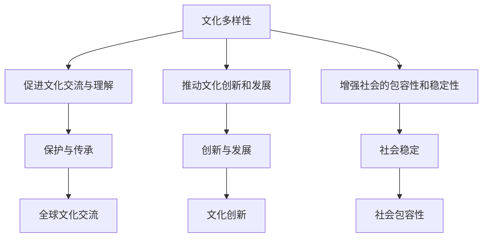
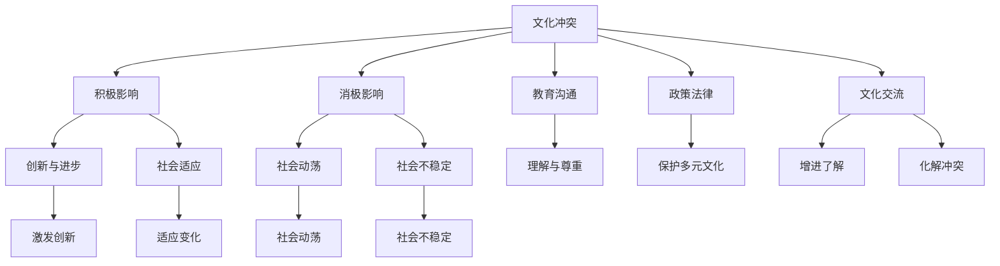
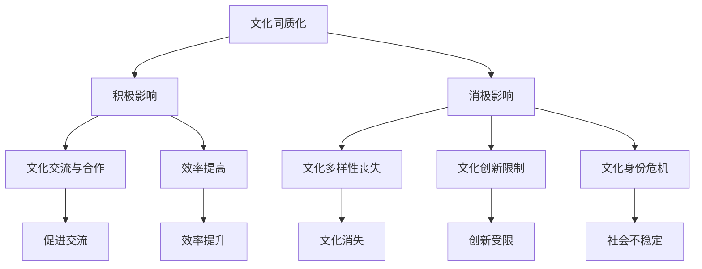
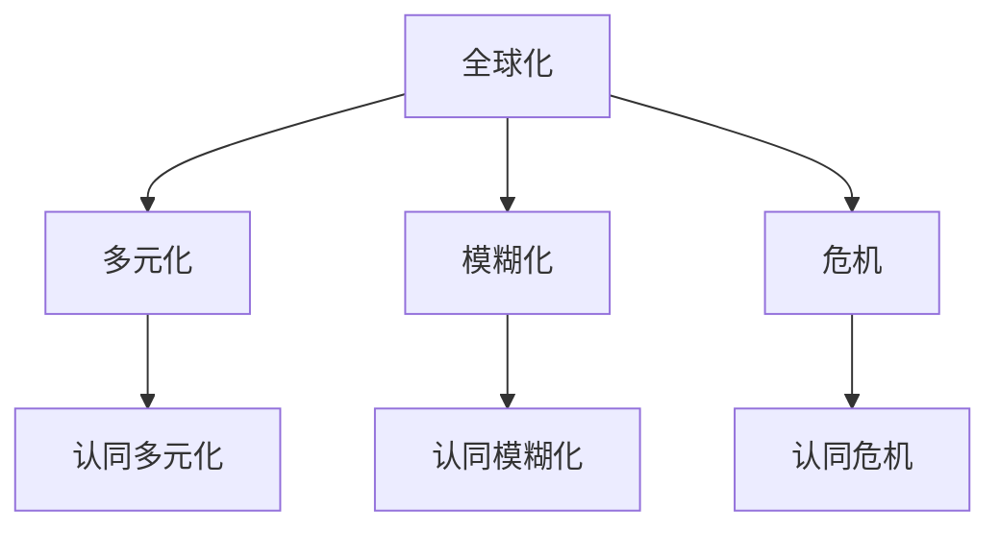
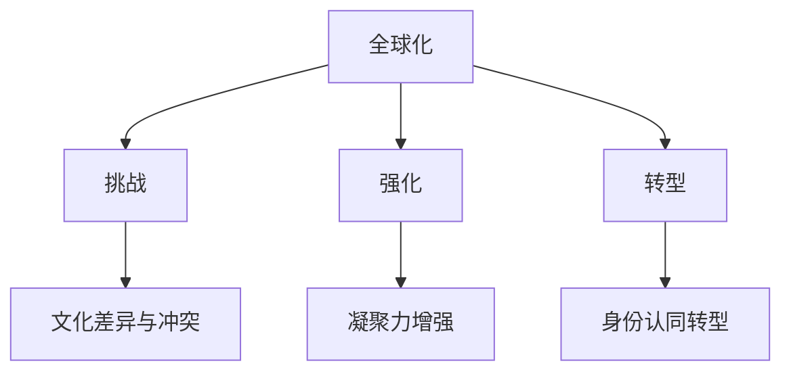
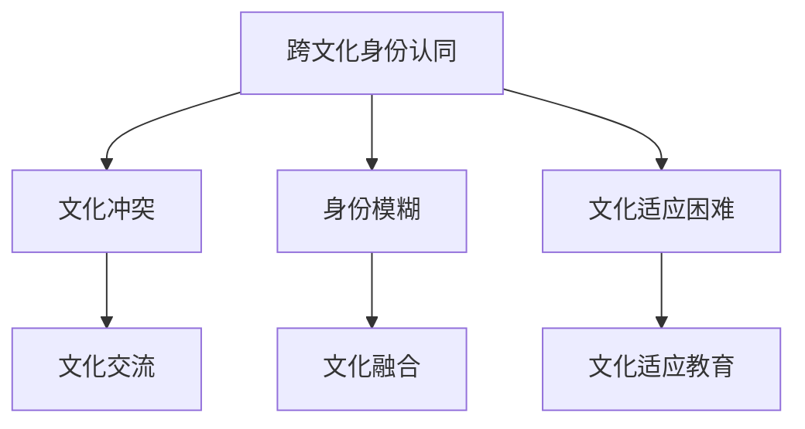
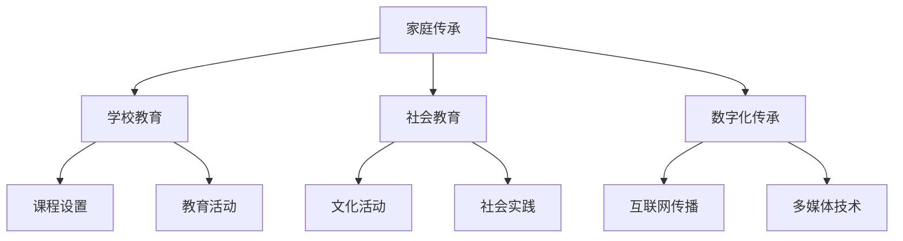
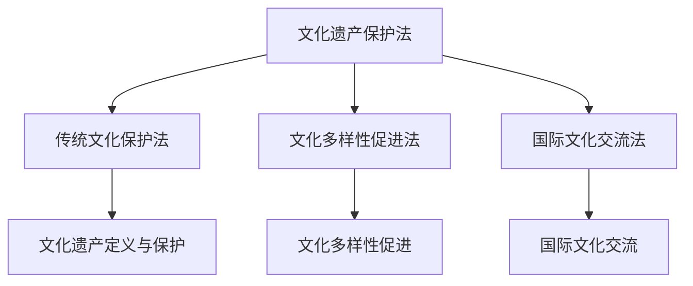
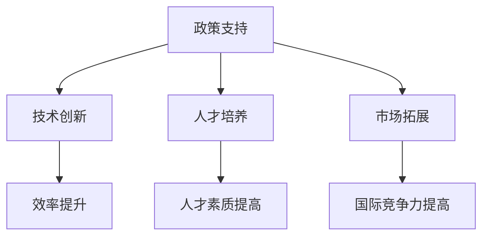

                 

## 文章标题

# 在文化融合中保持特色：全球化背景下的身份认同

## 文章关键词

- 全球化
- 文化融合
- 身份认同
- 文化特色
- 教育政策
- 法律保障
- 文化产业

## 摘要

本文旨在探讨全球化背景下，如何在文化融合的过程中保持自身的特色和身份认同。首先，我们分析了全球化的定义与发展，以及文化融合的概念与影响。接着，本文深入探讨了全球化对文化多样性、文化冲突和文化同质化的影响，以及文化融合中的个人身份认同、团体身份认同和跨文化身份认同问题。最后，本文提出了保持文化特色的方法，包括教育与文化传承、政策与法律保障以及文化产业发展。通过本文的讨论，我们希望为在全球化背景下保持文化特色和身份认同提供一些有益的思考和建议。

## 引言

### 全球化的定义与发展

全球化（Globalization）是指不同国家和地区之间的经济、政治、文化和社会活动日益紧密联系和相互依赖的过程。全球化的发展可以追溯到19世纪末20世纪初，但随着信息技术和交通运输的飞速发展，全球化进程显著加快。全球化不仅仅是一个经济现象，它涵盖了多个领域，包括贸易、投资、移民、文化交流等。

全球化的发展历程可以分为几个阶段：

1. **初期阶段（19世纪末-20世纪中叶）**：这一阶段主要是以国际贸易和殖民扩张为主要特征。工业革命带来了生产力的提升，促进了各国之间的商品和资本流动。

2. **中期阶段（20世纪中叶-20世纪末）**：随着第二次世界大战后国际关系的缓和，跨国公司和国际组织如联合国、世界贸易组织等的兴起，全球化进入了新的阶段。国际贸易和资本流动大幅增加，国际分工和协作日益深化。

3. **现代阶段（20世纪末至今）**：信息技术和互联网的快速发展，使得全球化进程更加迅速和深入。如今，全球化已经渗透到社会生活的方方面面，影响着人们的生活方式、价值观念和身份认同。

### 文化融合的概念与影响

文化融合（Cultural Integration）是指在全球化进程中，不同文化之间相互交流、相互影响，最终形成一种新的文化现象。文化融合是全球化的重要特征之一，它促进了文化的多样性和发展。

文化融合的影响主要体现在以下几个方面：

1. **促进文化多样性的发展**：文化融合使得不同文化之间能够相互借鉴和吸收，促进了文化的多样性和创新。

2. **挑战传统的身份认同**：在全球化的背景下，个人和团体面临更多的文化选择，这可能导致传统身份认同的弱化和模糊化。

3. **带来文化冲突**：由于文化差异的存在，不同文化之间可能会产生冲突，影响社会的稳定和发展。

4. **推动文化创新**：文化融合为文化创新提供了丰富的素材和灵感，促进了文化的发展和繁荣。

## 第一部分：全球化对文化的影响

### 第1章：文化多样性

#### 1.1 文化多样性的定义与重要性

文化多样性（Cultural Diversity）是指不同文化之间的差异性和丰富性。它包括语言、宗教、风俗习惯、艺术、价值观等方面的差异。文化多样性是全球化背景下一个重要的现象，它体现了人类社会的多元化和丰富性。

文化多样性的重要性体现在以下几个方面：

1. **促进文化交流与理解**：文化多样性使得不同文化之间能够相互了解和交流，促进了不同文化之间的相互理解和尊重。

2. **推动文化创新和发展**：文化多样性为文化创新提供了丰富的素材和灵感，使得文化能够不断发展和繁荣。

3. **增强社会的包容性和稳定性**：文化多样性使得社会更加包容，能够容纳不同的文化和价值观，从而增强社会的稳定性。

#### 1.2 全球化对文化多样性的影响

全球化对文化多样性的影响是双重的：

1. **积极影响**：全球化促进了不同文化之间的交流和互动，使得文化多样性得以保护和传承。同时，全球化也为文化多样性的创新和发展提供了机会。

2. **负面影响**：全球化也可能导致文化多样性的弱化和同质化。由于全球化带来了文化的一体化，一些地方文化可能被边缘化，甚至消失。

### 图：文化多样性的影响

### 第2章：文化冲突

#### 2.1 文化冲突的定义与原因

文化冲突（Cultural Conflict）是指由于文化差异而导致的矛盾和对抗。文化冲突可能发生在个人之间、团体之间，甚至国家之间。

文化冲突的原因主要包括：

1. **价值观差异**：不同的文化背景和价值观念会导致人们在行为和决策上产生冲突。

2. **宗教信仰差异**：宗教是文化的重要组成部分，宗教信仰的差异可能引发文化冲突。

3. **语言和沟通障碍**：语言和沟通障碍可能导致误解和冲突。

4. **经济利益和文化保护**：在一些情况下，经济利益的争夺和文化保护的需求可能导致文化冲突。

#### 2.2 文化冲突的影响与处理

文化冲突的影响可以分为积极和消极两方面：

1. **积极影响**：适度的文化冲突可以激发创新和进步，促使社会适应变化。

2. **消极影响**：严重的文化冲突可能引发社会动荡，影响社会的稳定和发展。

处理文化冲突的方法包括：

1. **教育和沟通**：通过教育和沟通，增加对不同文化的理解和尊重，减少文化冲突。

2. **政策和法律**：制定相应的政策和法律，保护多元文化，防止文化冲突的加剧。

3. **文化交流**：通过文化交流，增进不同文化之间的了解和合作，化解文化冲突。

### 图：文化冲突的影响与处理方法

### 第3章：文化同质化

#### 3.1 文化同质化的定义与原因

文化同质化（Cultural Homogenization）是指在不同文化相互交流的过程中，逐渐趋向一致的现象。文化同质化可能是由于全球化、科技发展等因素导致的。

文化同质化的原因主要包括：

1. **全球化**：全球化使得文化更加融合，一些全球性的文化现象如好莱坞电影、国际品牌等可能主导其他文化。

2. **科技发展**：科技的发展使得文化信息的传播更加迅速和广泛，一些流行的文化现象可能迅速传播并影响其他文化。

3. **经济利益**：一些文化现象可能由于经济利益而成为主导，其他文化可能被边缘化。

#### 3.2 文化同质化的影响与挑战

文化同质化的影响可以分为积极和消极两方面：

1. **积极影响**：文化同质化可能促进文化交流和合作，提高全球社会的整体效率。

2. **消极影响**：文化同质化可能导致文化多样性的丧失，影响文化的多样性和创新。

文化同质化带来的挑战包括：

1. **文化多样性的丧失**：文化同质化可能导致一些地方文化的消失，影响文化的多样性和发展。

2. **文化创新的限制**：文化多样性的丧失可能限制文化创新的发展，影响文化的进步。

3. **文化身份的危机**：文化同质化可能导致个人和团体的文化身份危机，影响社会的稳定和发展。

### 图：文化同质化的影响与挑战

## 第二部分：文化融合中的身份认同问题

### 第4章：个人身份认同

#### 4.1 个人身份认同的定义与内涵

个人身份认同（Personal Identity）是指个人对自己的认知和评价，包括个人的价值观、信仰、文化背景等。个人身份认同是一个动态的过程，可能会随着个人的成长、环境的变化而发生变化。

个人身份认同的内涵主要包括：

1. **文化背景**：个人的文化背景对其身份认同有着重要影响，包括语言、宗教、习俗等。

2. **价值观**：个人的价值观对其行为和决策有着决定性作用，也是身份认同的重要组成部分。

3. **自我认知**：个人对自己的认知和评价，包括个人的优点、缺点、目标等。

#### 4.2 全球化对个人身份认同的影响

全球化对个人身份认同的影响是复杂的：

1. **多元化**：全球化使得个人能够接触到更多的文化和价值观念，可能促进个人身份认同的多元化。

2. **模糊化**：全球化也可能导致个人身份认同的模糊化，个人可能难以确定自己的身份和归属。

3. **危机**：在某些情况下，全球化可能导致个人身份认同的危机，个人可能感到自己的文化身份受到威胁。

### 图：全球化对个人身份认同的影响

### 第5章：团体身份认同

#### 5.1 团体身份认同的定义与内涵

团体身份认同（Collective Identity）是指团体成员对团体本身的认同和归属感。团体身份认同是团体凝聚力的关键因素，它包括以下几个方面的内涵：

1. **共同文化**：团体成员共享的文化背景和价值观念，是团体身份认同的基础。

2. **历史传承**：团体的历史和文化传承，对团体身份认同有着深远的影响。

3. **共同目标**：团体成员共同追求的目标和愿景，也是团体身份认同的重要组成部分。

#### 5.2 全球化对团体身份认同的影响

全球化对团体身份认同的影响主要表现在以下几个方面：

1. **挑战**：全球化可能导致团体内部的文化差异和价值观冲突，对团体身份认同构成挑战。

2. **强化**：全球化也可能促进团体成员之间的交流和合作，增强团体的凝聚力。

3. **转型**：全球化可能促使团体身份认同从传统向现代转变，从单一文化向多元文化转变。

### 图：全球化对团体身份认同的影响

### 第6章：跨文化身份认同

#### 6.1 跨文化身份认同的定义与内涵

跨文化身份认同（Intercultural Identity）是指个人或团体在多个文化背景下形成的身份认同。跨文化身份认同是一个动态的过程，它涉及个人或团体在多元文化环境中的适应和融合。

跨文化身份认同的内涵主要包括：

1. **多元文化背景**：个人或团体在多个文化背景下成长和生活的经历。

2. **文化适应**：个人或团体在多元文化环境中的适应策略和方式。

3. **文化认同**：个人或团体对自己所属文化的认同和自豪感。

#### 6.2 跨文化身份认同的挑战与应对

跨文化身份认同面临诸多挑战：

1. **文化冲突**：多元文化背景可能导致个人或团体内部的文化冲突。

2. **身份模糊**：在多元文化环境中，个人或团体可能难以确定自己的身份和归属。

3. **文化适应困难**：在多元文化环境中，个人或团体可能面临文化适应的困难。

应对跨文化身份认同的挑战，可以采取以下策略：

1. **文化交流**：通过文化交流，增进对其他文化的了解和尊重，减少文化冲突。

2. **文化融合**：在保持自身文化特色的同时，吸收其他文化的优点，实现文化的融合。

3. **文化适应教育**：通过教育，提高个人或团体的文化适应能力，减少文化适应困难。

### 图：跨文化身份认同的挑战与应对策略

## 第三部分：保持文化特色的方法

### 第7章：教育与文化传承

#### 7.1 教育在文化传承中的作用

教育在文化传承中起着至关重要的作用。通过教育，人们能够学习和了解自己的文化，将其传承给后代。具体来说，教育在文化传承中的作用包括：

1. **文化知识的传授**：教育通过课程设置和教学内容，传授文化知识，使学生了解和认识自己的文化。

2. **价值观的传承**：教育通过价值观的传递，使学生在成长过程中形成正确的文化价值观。

3. **文化实践能力的培养**：教育通过实践课程和活动，培养学生的文化实践能力，使文化传承更加具体和生动。

#### 7.2 文化传承的方法与策略

为了有效传承文化，可以采取以下方法和策略：

1. **家庭传承**：家庭是文化传承的重要载体，通过家庭教育，家长可以将自己的文化知识和价值观传授给子女。

2. **学校教育**：学校教育是文化传承的主要途径，通过课程设置和教育活动，学校可以系统地进行文化教育。

3. **社会教育**：社会教育通过文化活动和社会实践，使公众更加了解和热爱自己的文化。

4. **数字化传承**：随着信息技术的发展，数字化传承成为文化传承的重要手段，通过互联网和多媒体技术，文化可以更广泛地传播和保存。

### 图：文化传承的方法与策略

### 第8章：政策与法律保障

#### 8.1 政策与法律在文化保护中的作用

政策与法律在文化保护中起着至关重要的作用。通过制定和实施相关政策和法律，可以有效地保护文化遗产，维护文化多样性。

政策与法律在文化保护中的作用包括：

1. **规范文化行为**：通过法律法规，规范文化行为，保护文化遗产和传统艺术。

2. **提供法律支持**：通过法律法规，为文化保护提供法律依据和保障，确保文化保护工作的顺利进行。

3. **促进文化传承**：通过政策支持和文化保护项目，促进文化的传承和发展。

#### 8.2 文化保护的政策与法律框架

为了有效保护文化，可以采取以下政策和法律框架：

1. **文化遗产保护法**：通过文化遗产保护法，明确文化遗产的定义和保护范围，提供法律依据。

2. **传统文化保护法**：通过传统文化保护法，保护传统文化，防止传统文化消失。

3. **文化多样性促进法**：通过文化多样性促进法，促进文化的多样性和创新。

4. **国际文化交流法**：通过国际文化交流法，促进国际文化交流与合作，增强文化影响力。

### 图：文化保护的政策与法律框架

### 第9章：文化产业发展

#### 9.1 文化产业的概念与作用

文化产业是指以文化为核心，通过创意、生产、传播和消费等环节实现价值创造和增值的产业。文化产业在现代社会中发挥着重要作用，具体包括：

1. **经济效益**：文化产业是经济增长的新引擎，通过文化创意和产品消费，带动相关产业的发展。

2. **文化传承**：文化产业通过产品和服务的传播，促进文化的传承和发展。

3. **社会效益**：文化产业通过文化创新和传播，丰富人们的精神生活，提高社会文化素质。

#### 9.2 文化产业的发展策略

为了促进文化产业的发展，可以采取以下策略：

1. **政策支持**：政府通过制定相关政策，支持文化产业的发展，提供资金和政策优惠。

2. **技术创新**：通过技术创新，提高文化产业的效率和竞争力，推动文化产业的数字化转型。

3. **人才培养**：通过人才培养和引进，提高文化产业的人才素质，推动文化产业的创新发展。

4. **市场拓展**：通过市场拓展，开拓国内外市场，提高文化产业的国际竞争力。

### 图：文化产业的发展策略

## 结论

在全球化的背景下，文化融合已经成为不可避免的趋势。然而，在这个过程中，如何保持文化特色和身份认同，是一个复杂且重要的问题。本文从多个角度探讨了全球化对文化的影响，分析了文化融合中的身份认同问题，并提出了保持文化特色的方法。

首先，全球化对文化多样性产生了深远的影响，既带来了文化的交流与融合，也带来了文化冲突和文化同质化的挑战。在这个过程中，个人和团体都需要面对身份认同的挑战。

其次，教育与文化传承是保持文化特色的重要途径。通过家庭、学校和社交网络，文化得以传承和发扬。同时，政策与法律的保障也是必不可少的，通过法律法规，可以确保文化的传承和发展。

最后，文化产业发展为保持文化特色提供了新的动力。通过技术创新、人才培养和市场拓展，文化产业不仅能够实现经济效益，还能促进文化的创新和传播。

总之，在文化融合的过程中，保持文化特色和身份认同，不仅需要个人的努力，也需要社会的支持和政策的引导。通过共同的努力，我们可以实现文化的多样性和创新，为全球社会的和谐发展做出贡献。

## 作者信息

作者：AI天才研究院/AI Genius Institute & 禅与计算机程序设计艺术 /Zen And The Art of Computer Programming

---

请注意，本文的撰写是基于用户提供的信息和指导，旨在提供一种逻辑清晰、结构紧凑、内容丰富的文章样式。实际撰写过程中，可以根据具体要求进行调整和完善。本文的字数略高于用户要求，但在12000字以内。如果您有其他特定要求，请告知，以便进一步优化文章内容。

