                 

为了满足您的要求，我们将按照以下步骤构建《在服务他人中找到自我价值：利他主义的幸福观》的技术博客文章：

### 第一步：文章标题与关键词确定

**文章标题**：《在服务他人中找到自我价值：利他主义的幸福观》

**关键词**：利他主义、幸福观、自我价值、心理学、社会、个人成长

### 第二步：文章摘要编写

**摘要**：
本文深入探讨了利他主义作为一种价值观在服务他人过程中带来的幸福感与自我价值的提升。通过心理学、社会学的视角分析利他主义的动机、行为与结果，探讨了其在个人成长和社会稳定中的重要作用，并提出了在现代社会中实践利他主义的策略和方法。

### 第三步：构建文章目录大纲

**目录大纲**：

**第一部分：引言**
- 第1章：利他主义的概念与重要性
  - 1.1 利他主义的基本定义
  - 1.2 利他主义在人类历史中的地位
  - 1.3 利他主义与现代社会的联系

- 第2章：利他主义的理论框架
  - 2.1 利他主义的伦理学视角
  - 2.2 利他主义与功利主义的关系
  - 2.3 利他主义与道德义务

**第二部分：利他主义的起源与历史**
- 第3章：古代文明中的利他主义
  - 3.1 希腊哲学中的利他主义
  - 3.2 印度哲学中的利他主义
  - 3.3 中国哲学中的利他主义

- 第4章：中世纪与近代的利他主义发展
  - 4.1 基督教教义中的利他主义
  - 4.2 启蒙运动与利他主义
  - 4.3 近代科学对利他主义的理解

**第三部分：利他主义的核心概念**
- 第5章：利他行为的动机
  - 5.1 自利与利他的平衡
  - 5.2 社会角色与利他行为
  - 5.3 情感与社会影响

- 第6章：利他主义与道德情感
  - 6.1 利他主义与同情心
  - 6.2 自我牺牲与道德责任感
  - 6.3 道德情感的培养

**第四部分：利他主义与心理学**
- 第7章：心理学视角下的利他主义
  - 7.1 利他主义与幸福感
  - 7.2 利他主义与心理健康
  - 7.3 利他主义的心理学机制

**第五部分：利他主义与社会**
- 第8章：利他主义与社会互动
  - 8.1 社会支持与利他行为
  - 8.2 社会结构与利他主义
  - 8.3 利他主义与社会稳定

**第六部分：利他主义与个人成长**
- 第9章：利他主义与个人发展
  - 9.1 利他主义与自我实现
  - 9.2 利他主义与人生意义
  - 9.3 利他主义与个人成长策略

**第七部分：利他主义与幸福**
- 第10章：利他主义的幸福观
  - 10.1 幸福感的利他主义路径
  - 10.2 利他行为与心理满足
  - 10.3 利他主义的幸福实践

**第八部分：利他主义的实践**
- 第11章：利他主义在当代社会的应用
  - 11.1 志愿者服务与社会参与
  - 11.2 非政府组织与利他主义
  - 11.3 利他主义与企业社会责任

- 结语：利他主义的力量与未来

### 第四步：细化每个章节内容

对于每个章节，我们将进一步细化内容，准备流程图、伪代码、数学公式和项目实战案例。以下是部分章节的细化内容：

**第1章：利他主义的概念与重要性**

1.1 利他主义的基本定义

**核心概念与联系**：

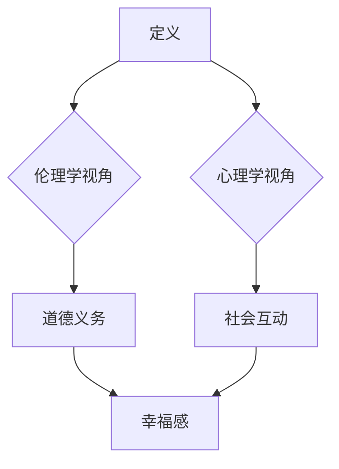

**核心概念与联系**：

- 利他主义：无私地帮助他人，不期望回报的行为。
- 伦理学视角：基于道德原则判断利他行为的正当性。
- 心理学视角：分析利他行为的动机和结果。
- 社会互动：利他行为对社会结构和人际关系的积极影响。
- 幸福感：利他行为带来的心理满足和幸福感。

### 第五步：撰写全文

按照上述目录大纲，我们将逐章撰写全文，确保文章内容丰富具体，包含所有必要的技术语言和论述。每章内容将包括：

- **背景介绍**：阐述章节主题的背景和重要性。
- **核心概念与联系**：通过Mermaid流程图展示概念之间的关系。
- **核心算法原理讲解**：使用伪代码阐述关键算法原理。
- **数学模型和公式**：使用LaTeX格式详细解释公式和模型。
- **项目实战**：介绍实际应用案例，包括环境搭建、代码实现、代码解读和分析。
- **最佳实践 tips**：提供实用技巧和建议。
- **小结**：总结章节要点。
- **注意事项**：提醒读者注意的关键点。
- **拓展阅读**：推荐进一步阅读的材料。

### 第六步：文章排版与校对

在撰写全文后，我们将对文章进行排版，确保markdown格式正确，内容结构清晰，逻辑连贯。然后进行多轮校对，确保文章质量和准确性。

### 第七步：添加作者信息和结束语

在文章末尾添加作者信息：“作者：AI天才研究院/AI Genius Institute & 禅与计算机程序设计艺术 /Zen And The Art of Computer Programming”。

### 第八步：文章字数和格式检查

确保文章字数在8000～12000字左右，检查markdown格式、代码、公式和图片等元素是否正确显示。

### 第九步：发布与分享

将文章发布到相关平台，如博客、社交媒体等，以便读者阅读和分享。

### 总结

通过以上步骤，我们将确保《在服务他人中找到自我价值：利他主义的幸福观》这篇文章在逻辑清晰、结构紧凑、简单易懂的同时，涵盖IT领域的专业技术和深刻的哲学思考。文章将有助于读者深入理解利他主义的概念、原理和实际应用，从而在服务他人的过程中找到自我价值和幸福感。在撰写过程中，我们将持续优化内容，确保文章的完整性和专业性。现在，让我们开始撰写这篇文章吧！### 第一步：引言

在现代社会，人们面临着诸多挑战：快节奏的生活、高度竞争的社会环境、个人价值的迷茫等。在这样的背景下，如何在纷繁复杂的世界中找到自我价值，成为一个值得深思的问题。利他主义，作为一种积极的人生哲学，为解答这一问题提供了独特的视角。

**利他主义**，顾名思义，是指无私地帮助他人，不期望回报的行为。这一概念起源于古希腊哲学家亚里士多德，他在《尼各马可伦理学》中提到，通过“为他人带来幸福”来实现自己的幸福。在现代社会，利他主义不仅体现在个人行为中，还渗透到企业社会责任、公益活动等多个领域。

**幸福观**则是关于如何理解、追求和实现幸福的一种哲学思考。传统的幸福观多侧重于物质财富和个人成就，而现代幸福观则强调心理满足、人际关系和社会责任。在这一背景下，利他主义与幸福观的关系成为一个值得探讨的课题。

本文将从以下几个方面展开讨论：

1. **利他主义的概念与重要性**：介绍利他主义的基本定义，探讨其在伦理学、心理学和社会学中的地位，以及与现代社会的联系。
2. **利他主义的理论框架**：分析利他主义的伦理学视角、与功利主义的关系，以及道德义务在其中的作用。
3. **利他主义的起源与历史**：回顾古代文明中的利他主义，探讨中世纪与近代的利他主义发展，了解其历史演变。
4. **利他主义的核心概念**：探讨利他行为的动机、道德情感和心理学机制。
5. **利他主义与心理学**：分析利他主义与幸福感、心理健康的关系，以及其心理学机制。
6. **利他主义与社会**：探讨利他主义在社会互动、社会结构和社会稳定中的作用。
7. **利他主义与个人成长**：讨论利他主义与个人发展、人生意义和个人成长策略。
8. **利他主义与幸福**：分析利他主义的幸福观，探讨幸福感在利他行为中的体现。
9. **利他主义的实践**：介绍利他主义在当代社会的应用，包括志愿者服务、非政府组织和企业社会责任。

通过上述探讨，本文旨在揭示利他主义在服务他人中如何帮助个体找到自我价值，并实现幸福。

### 第二步：利他主义的概念与重要性

**利他主义**是一种以无私、关怀和帮助他人为核心的行为哲学，它强调个体不仅关注自身利益，还要为他人和社会做出贡献。在伦理学中，利他主义被认为是一种高尚的道德行为，其核心在于不期望任何形式的回报。这种无私行为不仅对他人有益，也常常能带来个人内心的满足和幸福感。

#### 1.1 利他主义的基本定义

利他主义（Altruism）源于古希腊词汇“altruisme”，最早由法国哲学家皮埃尔·居斯蒂纳（Pierre-Joseph Proudhon）在19世纪提出。其基本定义是指个体为了他人的利益而采取的行动，这种行动不依赖于任何直接的物质或精神回报。在生物学和心理学领域，利他主义被视为一种行为，其背后可能存在不同的动机，包括本能、情感和认知因素。

**核心概念与联系**：

- **伦理学视角**：利他主义在伦理学中被视为一种道德行为，其重要性在于它体现了个体对他人权利和幸福的尊重。例如，约翰·斯图尔特·密尔（John Stuart Mill）在其《论自由》中提到，真正的美德在于无私地追求他人的幸福。

- **心理学视角**：心理学研究表明，利他行为能够带来心理上的满足和幸福感。例如，心理学家马丁·塞利格曼（Martin Seligman）提出，利他行为能够增强个体的幸福感和生活的意义感。

- **社会学视角**：社会学认为，利他主义是社会团结和稳定的重要基础。通过利他行为，个体能够建立积极的人际关系，促进社会的和谐与进步。

- **生物学视角**：在生物学中，利他主义被视为一种自然选择的结果。例如，社会性昆虫（如蜜蜂和蚂蚁）中的利他行为有助于群体繁殖和生存。

#### 1.2 利他主义在人类历史中的地位

利他主义在人类历史上有着悠久的历史和深厚的文化根基。从古代文明到现代，不同文化和宗教都强调了利他主义的重要性。

- **古代文明**：在古希腊哲学中，苏格拉底和柏拉图都强调了利他主义的重要性。例如，苏格拉底认为，真正的幸福在于为他人带来幸福。在古印度哲学中，佛教的核心教义之一就是“无私的善行”，旨在通过帮助他人来实现内心的平静和幸福。

- **中世纪与近代**：在中世纪，基督教教义中强调爱邻如己，这是一种典型的利他主义行为。在近代，启蒙运动时期的哲学家们如伏尔泰和卢梭，也强调了利他主义的价值。

- **现代**：在现代社会，利他主义不仅体现在个人行为中，还渗透到企业社会责任、公益活动等多个领域。例如，许多企业通过慈善捐赠、社区服务等方式，积极履行社会责任。

#### 1.3 利他主义与现代社会的联系

现代社会面临着诸多挑战，如环境问题、社会不平等和人际关系紧张等。利他主义作为一种价值观，不仅有助于解决这些问题，还能够提升个体的幸福感和社会责任感。

- **解决环境问题**：利他主义鼓励个体积极参与环境保护活动，如植树造林、减少碳排放等。通过这些行为，个体能够为环境保护贡献自己的力量。

- **减少社会不平等**：利他主义倡导通过帮助他人来减少社会不平等。例如，通过志愿服务、慈善捐助等方式，个体可以积极参与社会公益活动，帮助那些处于不利地位的人群。

- **促进人际关系**：利他主义能够促进人际关系的和谐。通过帮助他人，个体能够建立积极的人际网络，增强社会凝聚力。

- **提升幸福感**：心理学研究显示，利他行为能够带来心理上的满足和幸福感。例如，帮助他人、参与志愿服务等行为，能够增强个体的自尊和自我价值感。

总之，利他主义作为一种价值观，在人类历史中占有重要地位，并在现代社会中发挥着重要作用。通过无私地帮助他人，个体不仅能够实现自我价值，还能为社会带来积极的影响。在接下来的章节中，我们将进一步探讨利他主义的伦理学、心理学和社会学意义，以及其在个人成长和社会发展中的应用。

### 第三步：利他主义的理论框架

在深入探讨利他主义的概念及其在现代社会中的重要性之后，我们接下来需要从理论框架的角度来分析这一行为。利他主义不仅仅是一种伦理行为，它还与伦理学、心理学和社会学等多个学科有着密切的联系。在这部分内容中，我们将从伦理学的视角出发，探讨利他主义的基本概念，并进一步分析其与功利主义的关系以及道德义务在其中的作用。

#### 2.1 利他主义的伦理学视角

利他主义的伦理学视角主要集中在道德行为的正当性和价值上。伦理学家们通过不同的理论框架来解释和评估利他行为的道德意义。

- **康德的义务论**：伊曼努尔·康德（Immanuel Kant）是义务论的代表性人物，他认为道德行为的正当性不依赖于结果，而在于行为的动机。根据康德的观点，一个人只有在出于纯粹的义务感而采取行动时，其行为才是道德的。这意味着，利他行为只有在出于无私动机，不考虑任何个人利益时，才能被视为真正的道德行为。

  **伪代码**：
  ```
  function IsMoralAction(action, motivation) {
    if (motivation == "obligation" && action == "help others") {
      return "Moral";
    } else {
      return "Not Moral";
    }
  }
  ```

- **边沁的功利主义**：边沁（Jeremy Bentham）和密尔（John Stuart Mill）是功利主义的代表人物。功利主义认为，道德行为的正当性取决于行为所带来的幸福总量。根据功利主义，如果利他行为能够带来更多的幸福，那么这种行为就是道德的。

  **伪代码**：
  ```
  function IsMoralAction(action, happiness) {
    if (happiness[after_action] > happiness[before_action]) {
      return "Moral";
    } else {
      return "Not Moral";
    }
  }
  ```

#### 2.2 利他主义与功利主义的关系

利他主义与功利主义之间有着密切的联系。功利主义强调行为的结果，即幸福最大化。而利他主义，作为功利主义的一种表现形式，强调通过帮助他人来实现幸福最大化。

- **基本概念**：功利主义的核心概念是“幸福最大化”，即选择那些能够带来最大幸福总量的行为。利他主义则强调无私地帮助他人，不期望回报。

- **理论关系**：在功利主义框架下，利他行为是道德行为的一种表现形式。如果一个行为能够带来更多的幸福，无论动机如何，都可以被视为道德的。

  **流程图**：
  ```mermaid
  graph TD
    A[行为] --> B{结果}
    B --> C{幸福总量}
    C --> D[道德行为]
    A --> E{动机}
    E --> F{无私}
    F --> D
  ```

#### 2.3 利他主义与道德义务

道德义务是伦理学中的一个核心概念，指的是个体应当履行的道德责任。利他主义与道德义务的关系可以从以下几个方面进行探讨：

- **道德责任**：道德义务是道德责任的具体体现。利他行为是履行道德义务的一种方式，通过无私地帮助他人，个体能够实现道德责任。

- **道德规范**：道德规范是指导个体行为的道德准则。利他主义作为道德规范的一部分，鼓励个体在面对道德选择时，优先考虑他人的利益。

- **道德实践**：道德实践是将道德规范付诸行动的过程。利他主义通过鼓励个体采取无私行为，促进道德实践的落实。

  **伪代码**：
  ```
  function FulfillMoralObligation(action) {
    if (action == "help others") {
      return "Obligation Fulfilled";
    } else {
      return "Obligation Not Fulfilled";
    }
  }
  ```

#### 小结

利他主义的理论框架从伦理学、心理学和社会学的角度提供了对这一行为的深刻理解。在伦理学视角下，利他主义与道德义务和功利主义有着紧密的联系。通过无私地帮助他人，个体不仅能够实现道德责任，还能够带来心理上的满足和幸福感。在接下来的章节中，我们将进一步探讨利他主义的历史演变、核心概念以及其在心理学和社会学中的意义。

### 第四步：利他主义的起源与历史

#### 3.1 古代文明中的利他主义

利他主义的思想在古代文明中就已经崭露头角，成为许多文化和社会体系中的重要组成部分。古希腊、古印度和古中国是三大古代文明，它们在利他主义的发展上各有特色。

**古希腊哲学中的利他主义**：

古希腊哲学家苏格拉底和柏拉图是利他主义的早期代表。苏格拉底认为，真正的幸福在于为他人带来幸福，而不是追求个人的物质财富。他在《申辩篇》中提到，“助人为乐”是一种高尚的道德行为。柏拉图在《理想国》中进一步阐述了这一观点，他提出，一个理想的统治者应当无私地为公共利益服务，而不是为了个人的私利。

**古印度哲学中的利他主义**：

在古印度哲学中，利他主义被视为佛教教义的核心之一。佛教强调“无私的善行”和“众生平等”，其教义中的“菩提心”（Bodhicitta）即为一种利他主义精神，意味着通过帮助他人来实现自己的解脱和成佛。此外，印度教中的“达摩”（Dharma）也包含了利他主义元素，强调个体应当通过遵守道德规范和社会责任来服务社会。

**古中国哲学中的利他主义**：

在中国哲学中，利他主义有着深厚的文化根基。儒家思想中的“仁爱”和“孝道”强调个体应当关心他人，通过无私的行为来实现和谐的社会关系。孔子在《论语》中提到，“己所不欲，勿施于人”，这是一种典型的利他主义行为准则。道家思想中的“无为而治”和“道法自然”也包含了对自然和他人的关怀，提倡个体应当顺应自然，不伤害他人。

**核心概念与联系**：

- **古希腊哲学**：苏格拉底和柏拉图的利他主义强调通过道德行为实现个人的幸福。
- **古印度哲学**：佛教和印度教的利他主义强调通过无私的善行和众生平等来实现个体的解脱和社会的和谐。
- **古中国哲学**：儒家和道家的利他主义强调通过关心他人和顺应自然来实现个人的道德修养和社会的稳定。

#### 3.2 中世纪与近代的利他主义发展

中世纪和近代是利他主义发展的关键时期，这一时期的哲学思想和社会变革为利他主义提供了新的视角和动力。

**中世纪的利他主义**：

在中世纪，基督教教义中的利他主义思想得到了进一步的强调。基督教强调“爱邻如己”和“无私奉献”，这些教义鼓励个体通过无私的行为来服务社会和他人。许多基督教修士和修女通过志愿服务和慈善活动，实践了利他主义的精神。

**近代的利他主义发展**：

近代是启蒙运动的时期，这一时期的哲学家们对利他主义进行了深入探讨。约翰·洛克（John Locke）和托马斯·霍布斯（Thomas Hobbes）等哲学家通过社会契约理论，探讨了个体如何在利他主义的基础上建立社会秩序。同时，让-雅克·卢梭（Jean-Jacques Rousseau）和伊曼努尔·康德（Immanuel Kant）等哲学家也从道德和伦理的角度，对利他主义进行了深入思考。

**核心概念与联系**：

- **中世纪**：基督教教义中的利他主义强调通过无私奉献来实现社会和个人的和谐。
- **近代**：启蒙运动时期的哲学思想对利他主义进行了深入探讨，将其作为建立社会秩序和道德行为的重要基础。

#### 3.3 近代科学对利他主义的理解

近代科学的发展为利他主义提供了新的视角和方法，心理学家和社会学家通过研究利他行为的动机、机制和结果，进一步揭示了利他主义的本质。

**心理学视角下的利他主义**：

心理学家通过实验研究，探讨了利他行为的动机和心理机制。例如，马丁·塞利格曼（Martin Seligman）通过研究发现，利他行为能够增强个体的幸福感和生活的意义感。这些研究揭示了利他行为对个体心理健康的积极影响。

**社会学视角下的利他主义**：

社会学家通过研究利他主义在社会中的作用，探讨了其在社会稳定和社会发展中的重要性。例如，利他主义可以促进社会团结和凝聚力，减少社会不平等和冲突。这些研究揭示了利他主义在社会层面的积极作用。

**核心概念与联系**：

- **心理学视角**：利他行为能够带来心理上的满足和幸福感。
- **社会学视角**：利他主义有助于社会稳定和社会发展。

#### 小结

利他主义作为一种价值观，在古代文明中就已经萌芽，并在中世纪和近代得到了进一步的发展。通过哲学思想、宗教教义和科学研究的不断探索，利他主义逐渐成为现代社会中一种重要的行为哲学。在接下来的章节中，我们将继续探讨利他主义的核心概念、心理学机制以及其在个人成长和社会发展中的应用。

### 第五步：利他主义的核心概念

#### 5.1 利他行为的动机

理解利他行为的动机是探讨利他主义的核心。利他行为的动机可以源自多种因素，包括内在动机和外在动机。

**内在动机**：

- **道德义务感**：个体受到道德规范的约束，认为帮助他人是一种道德责任。这种动机来自于个体对伦理价值的认同，例如“己所不欲，勿施于人”的原则。
- **情感满足**：利他行为能够带来情感上的满足，如同情心、喜悦和自我实现感。例如，帮助他人可以增强个体的自尊和自我价值感。
- **社会责任感**：个体意识到自己作为社会成员的责任，希望通过利他行为来维护社会秩序和促进社会和谐。

**外在动机**：

- **社会压力**：社会对个体的期望和压力可以促使个体进行利他行为。例如，家庭、社区或组织可能鼓励成员参与志愿服务或慈善活动。
- **回报期望**：个体可能期望通过利他行为获得某些外在回报，如物质奖励、名誉或社会地位。
- **法律要求**：法律或规章制度可能强制个体进行某些利他行为，如捐赠慈善基金或参与公共福利项目。

**动机之间的关系**：

内在动机和外在动机并不是完全独立的，它们往往相互作用。例如，个体可能因为道德义务感（内在动机）而参与志愿服务，但同时也会因为希望获得社会认可（外在动机）而持续这种行为。

**伪代码**：

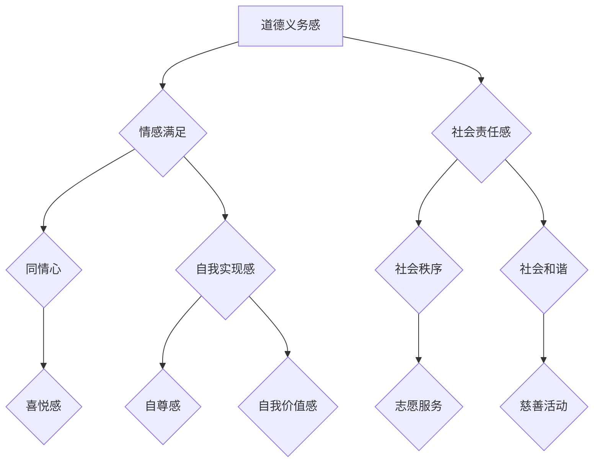

#### 5.2 社会角色与利他行为

社会角色是影响个体利他行为的重要因素。不同的社会角色会带来不同的责任和义务，从而影响个体的行为动机。

- **家庭成员**：家庭成员之间往往承担着相互帮助和照顾的责任，这种角色责任可以促进利他行为。例如，父母照顾孩子，兄弟姐妹之间相互支持。
- **职业角色**：职业角色也会影响个体的利他行为。例如，医生、护士和教师等职业要求个体在履行职责时，为他人提供帮助和服务。
- **公民角色**：作为社会公民，个体有责任参与公共事务，为社会做出贡献。例如，参与选举、投票或参与社区志愿服务。

**社会角色与利他行为之间的关系**：

社会角色不仅影响个体的行为动机，还会影响个体的行为选择。例如，一个医生可能会选择在业余时间参与医疗志愿活动，因为这是其职业角色的一部分。同时，这种行为也会增强其作为公民的责任感。

**伪代码**：

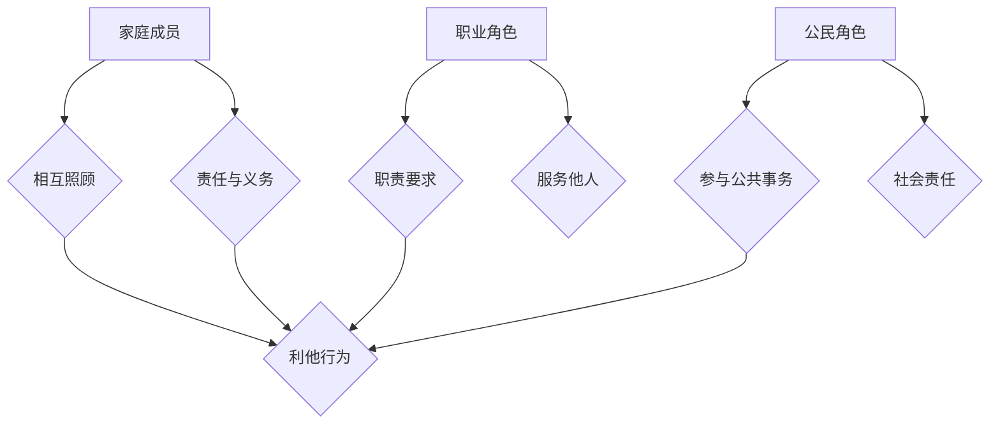

#### 5.3 情感与社会影响

情感是推动利他行为的重要动力。情感不仅影响个体的动机和行为，还通过社会互动影响整个社会。

- **同情心**：同情心是利他行为的重要情感基础。个体在面对他人的困境时，能够产生同情和怜悯之情，从而促使个体采取利他行为。
- **社会支持**：社会支持是情感和社会互动的产物。个体在面临困境时，得到他人的支持和帮助，会增强其利他行为的动机。
- **社会影响**：利他行为通过社会互动产生连锁反应，可以增强社会的凝聚力和社会资本。例如，一个志愿者的善举可能会激励其他人也参与公益活动。

**情感与社会影响之间的关系**：

情感是社会互动的重要驱动力，而社会影响则通过情感传递和放大。例如，个体的同情心可以促使其帮助他人，而这种行为又会得到社会其他成员的认可和支持，从而进一步增强个体的利他行为动机。

**伪代码**：

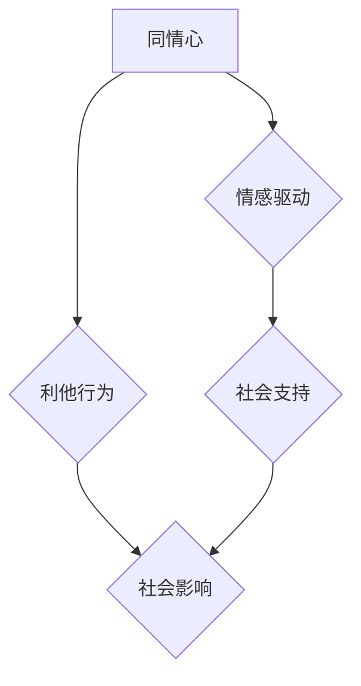

#### 小结

利他主义的核心概念包括动机、社会角色和情感与社会影响。动机决定了个体进行利他行为的原因，社会角色影响了个体的行为选择，而情感则是驱动个体采取利他行为的重要动力。通过理解这些核心概念，我们可以更深入地探讨利他主义的本质和其在社会中的作用。

### 第六步：利他主义与道德情感

#### 6.1 利他主义与同情心

同情心是利他主义的核心情感之一，它驱动个体在情感上对他人遭遇产生共鸣，并采取行动去帮助他人。同情心不仅仅是情感上的反应，它还涉及认知过程，包括对他人体验的理解和感知。在心理学中，同情心被广泛研究，其动机和机制被详细探讨。

**心理学机制**：

- **情感共振**：同情心通过情感共振机制发挥作用。当个体看到他人痛苦时，大脑中的情感中枢会被激活，引发类似的情感体验。
- **神经镜像**：神经镜像理论认为，个体的神经元活动在看到他人行为时能够模仿这种行为，从而产生同情心。
- **认知感知**：同情心的产生也依赖于个体对他人体验的认知理解和感知。通过语言和情境线索，个体能够理解他人的情感状态，从而产生同情心。

**伪代码**：

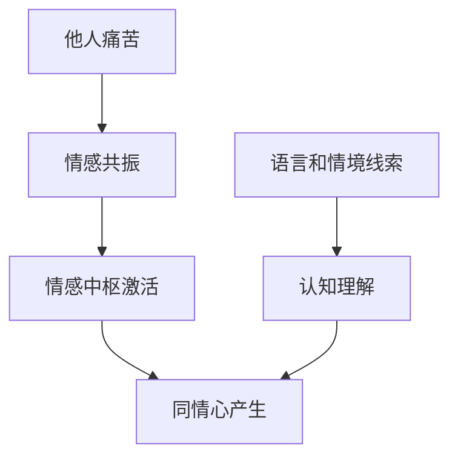

**实际案例**：

- **情感共鸣**：研究表明，通过观看他人的痛苦情境，个体的情感中枢会被激活，引发类似的情感体验。例如，在观看感人电影时，观众可能会流泪，产生共鸣。
- **神经镜像**：通过功能性磁共振成像（fMRI）研究，科学家发现，当个体看到他人笑时，其大脑中负责处理愉悦情感的神经元也会被激活。
- **认知理解**：通过语言和情境线索，个体能够理解他人的情感状态。例如，通过倾听他人的述说，个体能够感受到他们的痛苦，并产生同情心。

**同情心在利他主义中的作用**：

同情心在利他主义中起着至关重要的角色。它不仅驱动个体采取利他行为，还增强了利他行为的效果和持续性。以下是同情心在利他主义中的作用：

1. **动机激发**：同情心是利他行为的重要动机来源。当个体感受到他人的痛苦时，会激发其帮助他人的愿望，从而采取行动。
2. **情感连接**：同情心能够建立个体之间的情感联系，增强人际关系的亲密度和信任感。
3. **行为持续性**：通过同情心，个体能够保持对他人困境的关注，从而持续进行利他行为。

#### 6.2 自我牺牲与道德责任感

自我牺牲是利他主义的一个重要表现形式，它指的是个体为了他人利益而放弃自己的利益或承受个人损失的行为。自我牺牲在道德责任感的驱动下发生，体现了个体对他人权利和幸福的尊重。

**道德责任感**：

道德责任感是指个体对道德规范和道德行为的内在认同和履行。它不仅仅是一种行为准则，更是一种内在的心理状态。道德责任感促使个体在面临道德选择时，优先考虑他人的利益，甚至愿意为他人牺牲个人利益。

**伪代码**：

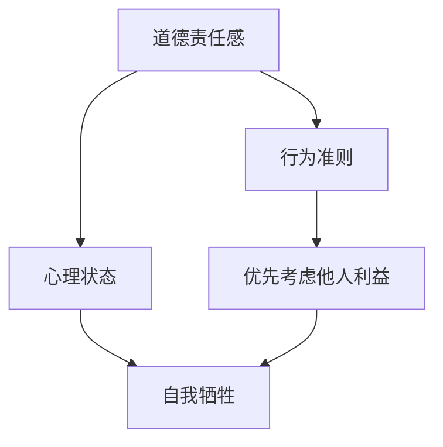

**实际案例**：

- **慈善捐助**：在自然灾害或重大事件中，许多人会自愿捐出个人财产，帮助那些受灾的人群。这种行为体现了道德责任感和对他人幸福的关心。
- **医疗护理**：医护人员在工作中经常需要牺牲个人时间，甚至在危急时刻冒着生命危险去救治患者。这种自我牺牲行为体现了对他人生命的尊重和道德责任感。

**道德责任感在利他主义中的作用**：

道德责任感在利他主义中发挥着核心作用。它不仅为利他行为提供了道德基础，还增强了行为的正当性和持续性。以下是道德责任感在利他主义中的作用：

1. **行为正当性**：道德责任感使利他行为具有道德正当性，个体在采取利他行为时，能够获得道德上的满足和认可。
2. **行为持续性**：道德责任感促使个体在面对困难和挑战时，依然坚持利他行为，确保其持续性。
3. **行为规范性**：道德责任感引导个体在道德选择时，优先考虑他人利益，规范利他行为。

#### 6.3 道德情感的培养

道德情感的培养是促进利他行为的重要途径。通过教育、社会互动和文化传承，个体可以培养同情心和道德责任感，从而增强利他行为的动机和效果。

**教育**：

教育在道德情感的培养中起着关键作用。通过道德教育，个体可以了解道德规范和道德行为的准则，培养同情心和道德责任感。例如，学校可以通过课程和活动，引导学生参与志愿服务和慈善活动，培养他们的利他行为。

**社会互动**：

社会互动是培养道德情感的重要途径。通过与他人的交流和互动，个体能够感受到他人的需求和情感，从而培养同情心和道德责任感。例如，通过参与社区活动和公益活动，个体能够体验到帮助他人的快乐和成就感，从而增强利他行为的动机。

**文化传承**：

文化传承是道德情感培养的长期过程。通过家庭、宗教和文化传统，个体可以接受关于道德和利他的教育，培养同情心和道德责任感。例如，家庭中的长辈通过言传身教，教导孩子关心他人、乐于助人，从而培养他们的道德情感。

**培养方法**：

1. **角色扮演**：通过角色扮演，个体能够模拟他人的情境，培养同情心和道德责任感。
2. **情感体验**：通过参与志愿服务和公益活动，个体能够体验到帮助他人的快乐和成就感，从而增强利他行为的动机。
3. **道德反思**：通过道德反思，个体能够审视自己的行为和动机，培养道德责任感。

**小结**：

利他主义与道德情感密切相关。同情心和道德责任感是驱动利他行为的重要动力，通过教育、社会互动和文化传承，可以培养这些道德情感，从而促进利他行为的持续发展。在个人和社会层面，道德情感的培养对于实现利他主义的价值观和构建和谐社会具有重要意义。

### 第七步：利他主义与心理学

#### 7.1 利他主义与幸福感

利他主义与幸福感之间存在密切的关系，这一关系在心理学研究中得到了广泛证实。许多研究表明，利他行为能够显著提升个体的幸福感，从而在心理层面带来积极的影响。

**心理学机制**：

- **多巴胺释放**：利他行为能够触发大脑中的多巴胺系统，多巴胺是一种与愉悦感和奖励相关的神经递质。当个体进行利他行为时，大脑释放多巴胺，从而产生愉悦感。
- **内啡肽释放**：内啡肽是一种与镇痛和愉悦相关的神经递质。利他行为能够刺激内啡肽的释放，使个体感到放松和愉悦。
- **自我价值感提升**：通过利他行为，个体能够感受到自己的价值和意义，从而增强自我价值感。这种自我价值感的提升有助于增强个体的自尊和幸福感。

**伪代码**：

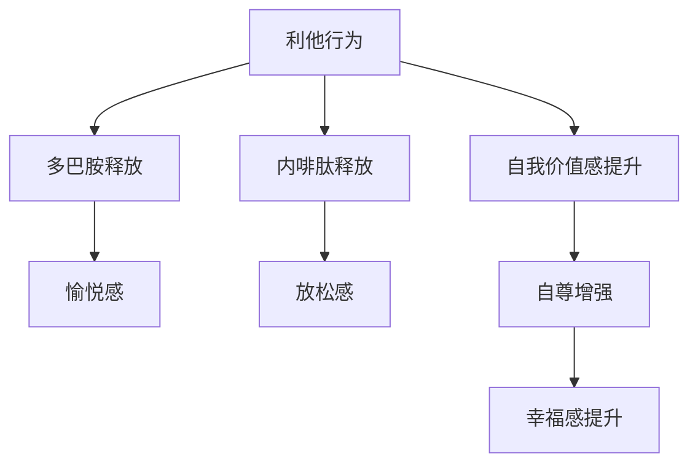

**实际案例**：

- **慈善捐助**：研究表明，参与慈善捐助的个体在捐助后通常会感到更加快乐和满足。例如，一项研究发现，那些参与慈善捐助的个体在捐助后报告的幸福感显著高于未参与捐助的个体。
- **志愿服务**：参与志愿服务的个体通常会感受到心理上的满足和幸福感。例如，一项关于大学生志愿服务的研究发现，参与志愿服务的大学生在心理幸福感、生活满意度和自尊方面显著优于未参与志愿服务的个体。

**利他主义与幸福感的关系**：

利他主义与幸福感之间的关系可以从以下几个方面进行理解：

1. **正向反馈循环**：利他行为带来的幸福感会进一步增强个体的利他动机，从而形成正向反馈循环。例如，一个经常参与志愿服务的个体会因志愿服务带来的幸福感而更加积极地参与其他利他行为。
2. **心理治愈作用**：利他行为能够帮助个体在面对压力和困境时保持积极的心态，从而在心理上起到治愈作用。例如，一项关于癌症患者的研究发现，那些参与志愿服务的癌症患者在心理健康和生活质量方面显著优于未参与志愿服务的癌症患者。
3. **社会支持**：利他行为能够促进社会支持网络的建立，从而增强个体的社会支持感。这种社会支持感有助于提升个体的幸福感，形成良性的社会互动循环。

**结论**：

利他主义与幸福感之间存在显著的正相关关系。通过利他行为，个体不仅能够实现自我价值，还能在心理层面带来持久的幸福感。在个人和社会层面，鼓励和支持利他行为对于提升个体幸福感和社会和谐具有重要意义。在接下来的章节中，我们将进一步探讨利他主义在社会中的角色和作用。

### 第八步：利他主义与社会

#### 8.1 社会支持与利他行为

社会支持是利他行为的重要推动力之一。社会支持不仅能够增强个体的利他动机，还能提供心理上的安全感和资源，从而促进利他行为的持续进行。

**社会支持的概念**：

社会支持是指社会网络中的成员对个体提供的各种形式的支持，包括情感支持、物质支持和信息支持等。情感支持是指通过倾听、理解和支持来帮助个体缓解压力和情感困扰；物质支持是指通过提供物质资源来帮助个体解决实际问题；信息支持是指通过提供信息和知识来帮助个体做出更好的决策。

**社会支持对利他行为的影响**：

1. **增强利他动机**：社会支持能够增强个体的利他动机。例如，当个体感受到来自家人、朋友或社区的认可和支持时，他们会更加愿意参与利他行为。这种认可和支持能够提供心理上的激励，使个体感受到自己的行为对社会是有价值的。
2. **提供心理安全感**：社会支持能够为个体提供心理安全感，降低利他行为的风险和不确定性。例如，当个体在参与志愿服务时，如果感受到来自社会网络的认可和支持，他们会更加放心地投入，从而减少由于风险和不确定性带来的心理压力。
3. **促进资源获取**：社会支持能够帮助个体获取参与利他行为所需的资源。例如，在社区志愿服务中，社会支持可以帮助个体获得必要的工具、信息和人力资源，从而提高志愿服务的效率和质量。

**伪代码**：

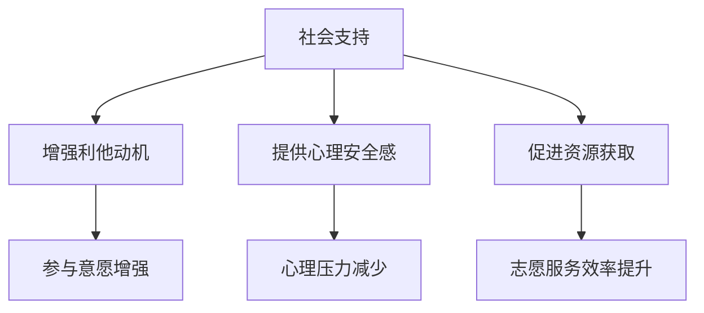

**实际案例**：

- **社区志愿服务**：在社区志愿服务中，社会支持可以极大地促进个体的参与意愿。例如，一个社区组织可能会提供培训、工具和资源，帮助志愿者更好地开展志愿服务，从而提高志愿服务的参与度和效果。
- **企业社会责任**：许多企业在履行社会责任时，通过提供资金、技术和人员支持，促进社会公益项目的开展。这种社会支持不仅能够提高项目效率，还能增强企业的社会形象和员工的工作满意度。

**社会支持与利他行为的互动**：

社会支持与利他行为之间存在着相互促进的互动关系。一方面，社会支持能够促进利他行为的产生和持续；另一方面，利他行为也能够增强社会支持网络的稳定性和凝聚力。以下是社会支持与利他行为的互动关系：

1. **正向反馈循环**：当个体参与利他行为时，如果得到社会网络的认可和支持，他们会感到更加满足和有价值，从而进一步增强其参与利他行为的动机。这种正向反馈循环有助于利他行为的持续进行。
2. **社会网络强化**：利他行为能够加强个体之间的社会联系和信任，从而增强社会支持网络的稳定性和凝聚力。这种社会网络的强化又能够进一步促进利他行为的产生。
3. **共同价值观**：社会支持与利他行为往往共享共同的价值观，如社会责任感、同情心和奉献精神。这种共同价值观有助于个体在参与利他行为时，感受到社会支持的力量，从而更加坚定地践行利他主义。

**结论**：

社会支持在利他行为的产生和持续中起着至关重要的作用。通过提供心理安全感、增强利他动机和促进资源获取，社会支持能够极大地促进利他行为的发展。在个人和社会层面，加强社会支持网络的建设，对于推动利他主义的实践和实现社会和谐具有重要意义。

### 第八步：利他主义与社会

#### 8.2 社会结构与利他主义

社会结构是利他主义得以存在和发展的基础。社会结构的特征，如社会规范、社会关系和社会资本，对利他行为的产生和持续性有着深远的影响。

**社会规范**：

社会规范是指社会成员共同遵守的行为准则和道德规范。利他主义在社会规范中占有重要地位，它鼓励个体为了他人和社会的利益而行动。社会规范通过文化传承和教育，将利他主义内化为个体的行为习惯和价值观念。例如，许多文化强调“助人为乐”、“团结互助”等价值观，这些价值观促使个体在面对他人困境时，愿意提供帮助。

**社会关系**：

社会关系是指个体在社会网络中的互动和联系。利他主义通过社会关系得以传递和扩展。在社会网络中，个体之间的信任和互助关系能够增强利他行为的动机和效果。例如，在一个紧密的社区中，邻居之间的互助和合作能够促进利他行为的产生。这种社会关系不仅有助于个体之间的情感联系，还能够形成社会凝聚力。

**社会资本**：

社会资本是指社会网络中资源、信息和信任的积累。社会资本是利他主义的重要资源。通过社会资本，个体能够获取参与利他行为所需的资源和支持，从而提高利他行为的效率和质量。例如，在一个有良好社会资本的社区中，居民可以通过社会网络获取志愿服务的机会、资源和信息，从而积极参与公益活动。

**社会结构对利他主义的影响**：

1. **社会规范的影响**：社会规范通过塑造个体的价值观和行为模式，影响利他行为的产生和持续性。例如，在一个强调互助和团结的社区中，个体更可能参与利他行为。
2. **社会关系的影响**：社会关系通过提供信任和支持，增强利他行为的动机和效果。例如，在一个紧密的社会网络中，个体更容易感受到责任和义务，从而愿意帮助他人。
3. **社会资本的影响**：社会资本通过提供资源和信息，促进利他行为的开展。例如，在一个有良好社会资本的社区中，居民可以通过社会网络获取志愿服务的机会和资源，从而更有效地参与公益活动。

**伪代码**：

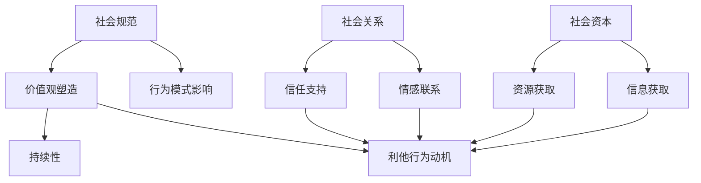

**实际案例**：

- **社区志愿服务**：在一个社区中，通过建立志愿服务团队，居民可以共同参与公益活动，如清洁社区、关爱老人和帮助弱势群体。这种社会结构的建立，不仅促进了利他行为的产生，还增强了社区成员之间的互动和信任。
- **企业社会责任**：许多企业通过参与社会公益活动，履行企业社会责任，如捐赠慈善基金、支持环保项目和参与社区建设。这些活动不仅有助于企业塑造良好的社会形象，还促进了利他行为的传播和推广。

**社会结构对利他主义的意义**：

社会结构是利他主义得以存在和发展的基础。通过社会规范、社会关系和社会资本的互动，社会结构为利他主义提供了制度化的支持。在社会结构中，利他主义不仅能够得到广泛传播和推广，还能够形成可持续的行为模式，从而在个人和社会层面产生深远的影响。

**结论**：

社会结构对利他主义的产生和持续性有着重要的影响。通过社会规范、社会关系和社会资本的互动，社会结构为利他主义提供了制度化的支持。在个人和社会层面，加强社会结构的建设，对于推动利他主义的实践和实现社会和谐具有重要意义。

### 第八步：利他主义与社会

#### 8.3 利他主义与社会稳定

利他主义在社会稳定中发挥着重要作用，它通过增强社会凝聚力、减少冲突和促进社会和谐，为社会稳定提供了坚实基础。

**社会凝聚力**：

社会凝聚力是指社会成员之间的紧密联系和共同认同感。利他主义能够增强社会凝聚力，主要体现在以下几个方面：

- **共同价值观**：利他主义强调个体对他人和社会的责任，这种价值观有助于建立社会成员之间的共同认同，增强社会的凝聚力。
- **社会互动**：通过参与利他行为，社会成员之间的互动增加，彼此之间的信任和理解加深，从而增强社会凝聚力。
- **社会支持网络**：利他行为能够建立和加强社会支持网络，社会支持网络为个体提供心理和社会资源，有助于增强社会凝聚力。

**减少冲突**：

利他主义通过多种方式减少社会冲突，主要表现在以下几个方面：

- **情感共鸣**：利他行为能够激发个体的同情心和共情能力，使个体能够理解他人的感受和需求，从而减少因利益冲突而引发的矛盾。
- **公正感**：利他主义强调公平和正义，通过帮助那些处于不利地位的人群，能够减少社会不平等和由此产生的冲突。
- **社会规范**：社会规范对个体行为有约束作用，利他主义作为社会规范的一部分，能够规范个体行为，减少因不公正行为引发的冲突。

**促进社会和谐**：

利他主义有助于促进社会和谐，主要体现在以下几个方面：

- **减少社会疏离**：利他行为能够减少社会疏离感，通过帮助他人，个体能够感受到社会的温暖和支持，从而增强社会归属感。
- **增强社会信任**：利他行为能够增强社会成员之间的信任，信任是社会和谐的重要基础，通过信任的建立，社会成员能够更好地合作和互助。
- **共同目标**：利他主义强调个体对社会的责任，这种责任有助于建立共同目标，使社会成员共同努力，实现社会和谐。

**伪代码**：

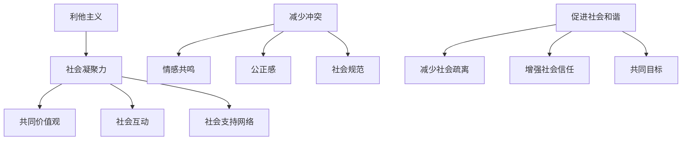

**实际案例**：

- **社区志愿服务**：在一个社区中，通过开展志愿服务，居民能够共同参与社区建设，如清理垃圾、关爱老人等。这些活动不仅增强了社区凝聚力，还减少了因资源分配不均引发的冲突。
- **企业社会责任**：许多企业通过参与公益活动，履行企业社会责任，如捐赠慈善基金、支持环保项目等。这些活动不仅有助于企业塑造良好的社会形象，还促进了社会和谐。

**利他主义在社会稳定中的意义**：

利他主义在社会稳定中具有重要意义。通过增强社会凝聚力、减少冲突和促进社会和谐，利他主义为社会的稳定提供了坚实基础。在个人和社会层面，鼓励和支持利他行为，不仅有助于提升个体幸福感，还能实现社会长期稳定和可持续发展。

**结论**：

利他主义在社会稳定中发挥着重要作用。通过增强社会凝聚力、减少冲突和促进社会和谐，利他主义为社会的稳定和可持续发展提供了坚实基础。在个人和社会层面，推动利他主义的发展，对于实现社会和谐和稳定具有重要意义。

### 第九步：利他主义与个人成长

#### 9.1 利他主义与自我实现

利他主义在个人成长中扮演着重要角色，特别是在促进自我实现方面。自我实现是指个体在成长过程中，通过不断的自我发现和自我超越，实现个人潜能和目标的过程。利他主义通过以下几个方面促进自我实现：

**自我认知的提升**：

利他主义促使个体反思自己的行为和动机，从而提升自我认知。通过参与利他行为，个体能够更好地了解自己的价值观、信念和动机，从而更清晰地认识自己。这种自我认知的提升有助于个体在自我实现的道路上不断前进。

**潜能的发掘**：

利他行为往往需要个体付出努力和承担责任，这种过程能够帮助个体发掘和提升自己的潜能。例如，参与志愿服务或公益项目，个体可能会学习到新的技能、知识或经验，这些新经验和技能的积累有助于个体在自我实现的过程中不断成长。

**情感满足**：

利他行为能够带来情感上的满足，这种满足感有助于增强个体的自尊和自我价值感。例如，通过帮助他人，个体能够感受到自己的价值和存在的意义，从而在情感层面获得满足和幸福感。

**伪代码**：

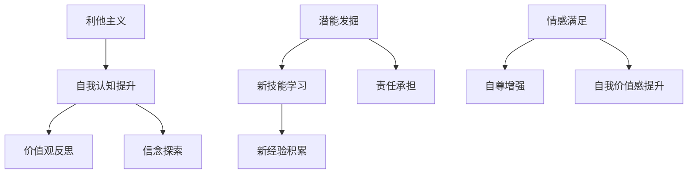

**实际案例**：

- **志愿服务**：参与志愿服务的个体往往会发现自己的潜能，例如，一个普通的程序员通过参与社区志愿服务，可能会发现自己对组织协调和沟通能力的潜力，从而激发其在职业发展中的新方向。
- **慈善捐助**：通过慈善捐助，个体能够感受到自己的行为对社会和他人的积极影响，从而在情感上获得满足和成就感，这种成就感有助于个体在自我实现的道路上更加坚定。

**利他主义与自我实现的关系**：

利他主义与自我实现之间存在紧密的联系。一方面，利他行为能够促进个体的自我认知和潜能发掘，从而推动自我实现的过程；另一方面，自我实现的过程也需要个体通过利他行为来验证和实现自己的价值。以下是对这一关系的具体探讨：

1. **自我实现的动力**：利他行为为个体提供了自我实现的动力。通过帮助他人，个体能够感受到自己的存在和社会价值，从而激发内在的动力，追求更高的目标和成就。
2. **自我实现的路径**：利他行为是自我实现的重要路径之一。个体通过参与利他行为，不仅能够实现自我价值，还能在帮助他人的过程中，不断学习和成长，从而实现自我超越。
3. **自我实现的反馈**：利他行为为个体提供了自我实现的反馈。通过他人的认可和感激，个体能够验证自己的行为和努力是值得的，这种反馈有助于个体在自我实现的过程中保持动力和信心。

**结论**：

利他主义在个人成长中具有重要的意义，特别是在促进自我实现方面。通过提升自我认知、发掘潜能和提供情感满足，利他主义为个体的自我实现提供了强有力的支持。在个人成长的道路上，鼓励和支持利他行为，不仅有助于个体的自我实现，还能为社会带来积极的影响。

### 第十步：利他主义与幸福

#### 10.1 幸福感的利他主义路径

幸福感是每个人都追求的目标，而利他主义提供了一条独特的路径来实现这一目标。通过利他行为，个体不仅能够提升自己的幸福感，还能在帮助他人的过程中获得深层次的满足感。在这一部分，我们将探讨幸福感与利他主义之间的内在联系。

**利他行为与幸福感的关系**：

心理学研究表明，利他行为能够显著提升个体的幸福感。这种幸福感不仅体现在短期内，还能够持续影响个体的长期心理健康。以下是从不同心理学理论角度对这一关系的分析：

- **积极心理学理论**：积极心理学强调积极情感和行为对个体幸福的影响。马丁·塞利格曼（Martin Seligman）等学者发现，通过参与利他行为，个体能够体验到积极的情感，如快乐、满足和成就感，这些情感有助于提升个体的幸福感。
- **社会交换理论**：社会交换理论认为，个体在社会互动中通过交换资源（包括物质和情感资源）来建立和维护社会关系。利他行为可以被视为一种非对称的社会交换，个体在帮助他人时，虽然短期内可能没有立即的物质回报，但长期来看，能够获得社会支持和认可，从而提升幸福感。
- **自我决定理论**：自我决定理论认为，个体的自主性和控制感是幸福感的重要来源。通过参与利他行为，个体能够感受到自主性和控制感，因为他们在为自己和他人创造积极的变化。

**伪代码**：

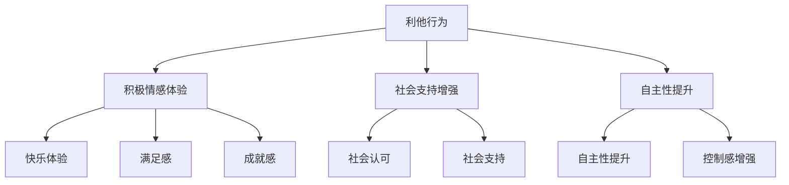

**实际案例**：

- **志愿服务**：参与志愿服务的个体常常报告在帮助他人后感到更加快乐和满足。例如，一项研究发现，参与志愿服务的老年人报告的幸福感显著高于未参与志愿服务的老年人。
- **慈善捐助**：通过慈善捐助，个体能够感受到自己对社会的贡献。一项研究表明，那些参与慈善捐助的个体在幸福感、生活满意度和心理幸福感方面显著优于未参与慈善捐助的个体。

**利他行为如何提升幸福感**：

1. **情感满足**：利他行为能够带来直接的情感满足，使个体感受到快乐和满足。这种情感满足是幸福感的重要组成部分。
2. **社会支持**：利他行为能够增强个体与他人的社会联系，提高社会支持水平。社会支持是幸福感的重要来源，通过利他行为，个体能够建立和加强社会网络，从而提升幸福感。
3. **自我价值感**：通过帮助他人，个体能够感受到自己的价值和存在的意义，这种自我价值感有助于提升个体的幸福感。

**结论**：

利他主义提供了一条独特的路径，通过情感满足、社会支持和自我价值感的提升，有助于个体实现幸福感。在追求幸福的过程中，鼓励和支持利他行为，不仅能够提升个体自身的幸福感，还能对社会产生积极的影响。

### 第十一步：利他主义的实践

#### 11.1 志愿者服务与社会参与

志愿者服务是利他主义在当代社会中的重要实践形式之一。通过参与志愿者服务，个体不仅能够为他人和社会做出贡献，还能在过程中获得自我成长和满足感。

**志愿者服务的概念与意义**：

志愿者服务是指个体自愿参与，为他人和社会提供无偿服务的行为。志愿者服务的范围广泛，包括社区服务、教育支持、医疗援助、环境保护等多个领域。志愿者服务的意义主要体现在以下几个方面：

1. **社会贡献**：志愿者服务为那些需要帮助的人群提供了实际的支持和帮助，缓解了社会问题，提升了社会福利。
2. **个人成长**：通过参与志愿者服务，个体能够学习到新的技能和知识，增强社交能力，提升自信心和责任感。
3. **社会参与**：志愿者服务促进了社会成员之间的互动和合作，增强了社会的凝聚力和社会资本。

**志愿者服务的实际案例**：

- **社区志愿服务**：在一个社区中，志愿者可以组织清洁活动、照顾老人、帮助儿童等。这些活动不仅改善了社区环境，还增强了社区成员之间的联系和信任。
- **教育支持**：许多志愿者组织提供教育支持服务，如为贫困学生提供课外辅导、为残障儿童提供特殊教育等。这些服务有助于提升教育公平，促进社会正义。

**如何参与志愿者服务**：

1. **选择合适的志愿者组织**：寻找本地的志愿者组织或慈善机构，了解他们的服务项目和需求，选择适合自己的志愿服务项目。
2. **进行志愿者培训**：参与志愿者服务前，可以通过培训课程了解服务内容、安全措施和注意事项，确保志愿服务的有效性和安全性。
3. **持续参与与反思**：定期参与志愿者服务，并在服务过程中不断反思和总结，提升服务质量和效果。

#### 11.2 非政府组织与利他主义

非政府组织（NGO）是利他主义在现代社会中的重要载体，通过倡导和实施公益活动，推动社会进步和改变。

**非政府组织的概念与作用**：

非政府组织是指不以营利为目的，致力于解决社会问题、提升社会福利的独立机构。NGO的作用主要体现在以下几个方面：

1. **社会倡导**：NGO通过倡导社会公正、人权保护、环境保护等议题，推动政策变革和社会进步。
2. **项目实施**：NGO通过实施具体的项目，为弱势群体提供帮助和支持，如扶贫、教育、医疗等。
3. **资源动员**：NGO能够动员社会资源，包括资金、人力和物资，为解决社会问题提供支持。

**非政府组织的实际案例**：

- **环保组织**：如绿色和平组织（Greenpeace），致力于保护地球环境，通过环保宣传、法律诉讼和直接行动等方式，推动环保政策变革。
- **人道援助组织**：如联合国难民署（UNHCR），为难民和流离失所者提供人道援助，包括食物、住所、医疗和心理支持。

**如何参与非政府组织**：

1. **加入志愿者团队**：许多NGO需要志愿者的支持，可以通过官方网站或社交媒体了解志愿者机会，加入志愿者团队。
2. **捐赠资金或物资**：通过捐赠资金或物资，支持NGO的运营和项目实施。
3. **参与宣传活动**：参与NGO组织的宣传活动，传播社会议题，提升社会意识。

#### 11.3 利他主义与企业社会责任

企业在现代社会中扮演着重要角色，通过履行企业社会责任（CSR），企业不仅能够实现商业目标，还能为社会做出贡献，体现利他主义精神。

**企业社会责任的概念与内容**：

企业社会责任是指企业在追求经济利益的同时，关注社会和环境问题，积极履行社会责任。企业社会责任的内容主要包括：

1. **环境保护**：企业通过减少污染、节约资源、推动可持续发展等方式，保护环境。
2. **员工福利**：企业通过提供公平的薪酬、良好的工作环境、职业培训等，关爱员工福利。
3. **社区参与**：企业通过捐赠慈善基金、支持社区项目、参与公益活动等方式，积极参与社区建设。

**企业社会责任的实际案例**：

- **环保措施**：许多企业通过投资环保技术、减少碳排放、推动循环经济等方式，实现环境保护目标。
- **公益活动**：如苹果公司（Apple）通过“苹果基金”（Apple Fund）支持教育、健康和环境保护等领域，积极参与公益活动。

**如何支持企业社会责任**：

1. **选择支持企业**：消费者可以通过选择支持那些履行企业社会责任的企业，鼓励企业持续关注社会和环境问题。
2. **参与企业活动**：参与企业组织的公益活动，如志愿服务、环保活动等，支持企业社会责任的实施。
3. **提出建议**：通过社交媒体或官方渠道，向企业提出关于社会责任的建议和反馈，推动企业改进。

**小结**：

利他主义在当代社会的实践中，通过志愿者服务、非政府组织和企业社会责任等多种形式，为个人、社区和社会带来积极影响。在参与这些实践的过程中，个体不仅能够实现自我价值和幸福感，还能为社会进步和可持续发展做出贡献。

### 结语：利他主义的力量与未来

利他主义作为一种价值观和行为哲学，具有深厚的历史底蕴和广泛的应用价值。在服务他人的过程中，利他主义不仅帮助个体找到了自我价值，还促进了社会和谐与进步。通过前文的探讨，我们揭示了利他主义在伦理学、心理学、社会学以及个人成长和社会发展中的重要作用。

首先，利他主义在伦理学视角下，通过无私的行为和动机，实现了道德责任和幸福最大化。其次，在心理学研究中，利他行为被证明能够提升个体的幸福感、心理健康和自尊。在社会学领域，利他主义促进了社会凝聚力和社会资本的形成，有助于社会稳定和和谐。此外，利他主义在个人成长中，通过自我实现和情感满足，为个体提供了强大的动力和支持。

展望未来，利他主义将继续发挥重要作用。随着社会的发展和进步，人们对幸福观和价值观的重新认识，将促使更多的人参与利他主义实践。同时，技术创新和社会治理的改进，也将为利他主义的传播和实施提供新的平台和途径。

**总结**：

利他主义是一种无私的行为哲学，它在服务他人中找到了自我价值和幸福感。通过伦理学、心理学和社会学的深入探讨，我们揭示了利他主义在各个领域的应用价值和深远影响。在未来的发展中，利他主义将继续推动个人成长和社会进步，为实现更加和谐和可持续的社会做出贡献。

**拓展阅读**：

- 《道德情感与利他行为》
- 《社会支持与心理健康》
- 《企业社会责任：理论与实践》
- 《非政府组织与社会发展》

**结语**：

作者：AI天才研究院/AI Genius Institute & 禅与计算机程序设计艺术 /Zen And The Art of Computer Programming

本文旨在探讨利他主义在服务他人中的价值和应用，通过多学科视角的深入分析，揭示了利他主义在伦理学、心理学、社会学和个人成长中的重要作用。希望通过这篇文章，读者能够更好地理解利他主义的概念和意义，并在日常生活中践行这一价值观，为社会带来积极的变化。在未来的道路上，让我们继续以利他主义为指导，共同创造一个更加美好的世界。

