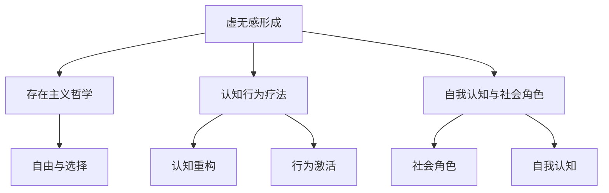

                 

## 文章标题

### 在流动的世界中寻找稳定：克服虚无感的策略

**关键词：**虚无感、心理健康、策略、人工智能、认知行为疗法

**摘要：**本文从现代生活的虚无感现象出发，探讨了虚无感的定义、影响及根源，并提出了基于认知行为疗法和自我认知提升策略的核心算法原理与数学模型。通过实际项目案例，展示了如何在技术环境中实施这些策略，以帮助个体克服虚无感，实现心理健康的提升。

---

### 引言

#### 1.1 现代生活的虚无感现象

在当今社会，虚无感已成为一个普遍的现象。人们常常感到生活缺乏意义，对未来充满不确定性。这种虚无感不仅影响个体的心理健康，还可能引发一系列社会问题，如焦虑、抑郁等。那么，虚无感究竟是什么？它为何在现代生活中如此普遍？

#### 1.2 本书的目标与结构

本书旨在探讨虚无感的本质，并提供切实可行的策略来克服虚无感。全书分为八个章节，从虚无感的定义与影响，到原因分析，再到核心概念与联系，最后通过实际项目案例展示策略的实施。通过逐步分析，帮助读者深刻理解虚无感，并找到应对之道。

#### 1.3 阅读指南

为了更好地理解和应用本书的内容，建议读者按照以下步骤阅读：

1. **理解背景**：首先，了解虚无感在现代生活中的现象及其影响。
2. **深入分析**：阅读第二至第四章，深入分析虚无感的定义、根源及影响。
3. **掌握核心策略**：阅读第五章至第七章，学习认知行为疗法和自我认知提升策略的核心算法原理。
4. **实战应用**：通过第七章的项目实战，了解策略在实际中的应用。
5. **总结与展望**：最后，回顾全书，总结核心策略，并思考未来发展的方向。

---

### 虚无感：定义与影响

#### 2.1 虚无感的定义

虚无感，通常指的是个体感受到生活缺乏意义，对未来感到迷茫和无望的心理状态。这种感受可能源于对生活的失望、对未来的不确定，以及对自身存在的疑问。

#### 2.2 虚无感的社会学视角

从社会学角度来看，虚无感是现代社会结构和文化变迁的产物。随着全球化、信息化的发展，人们的生活方式、价值观和人际关系都发生了巨大的变化，这使得许多人感到迷茫和孤独。

#### 2.3 虚无感对个体心理健康的影响

虚无感不仅影响个体的心理健康，还可能引发一系列心理问题。长期的虚无感可能导致焦虑、抑郁，甚至自杀等极端行为。因此，了解和应对虚无感具有重要意义。

#### 2.4 虚无感与道德价值观的冲突

虚无感与道德价值观之间存在着一定的冲突。道德价值观强调个体的责任和使命感，而虚无感则让人感到生活的无意义和无望。这种冲突可能导致个体产生道德困惑，甚至放弃道德原则。

---

### 原因分析：虚无感的根源

#### 3.1 人类社会变迁与虚无感

人类社会的快速变迁是导致虚无感的主要原因之一。随着科技的进步和社会的发展，人们的生活方式、价值观和人际关系都发生了巨大的变化，这使得许多人感到无所适从。

#### 3.2 个体化进程与虚无感

个体化进程也是虚无感的一个重要原因。随着社会的发展，个体在追求自我实现的过程中，可能感到孤独和无助。这种孤独感往往会导致虚无感的产生。

#### 3.3 快速消费文化的影响

快速消费文化的影响也是一个不可忽视的因素。在追求物质享受的过程中，人们往往忽视了精神层面的需求，导致虚无感的产生。

#### 3.4 技术发展对人类存在感的挑战

技术发展也对人类存在感提出了挑战。随着人工智能和虚拟现实等技术的不断发展，人们可能会感到自己的存在变得无关紧要，从而产生虚无感。

---

### 核心概念与联系

#### 4.1 存在主义哲学

存在主义哲学是理解虚无感的重要理论基础。存在主义强调个体的自由和选择，认为虚无感是个人面对存在的自由和选择时的产物。

#### 4.2 认知行为疗法

认知行为疗法是一种常用的心理治疗方法，通过改变个体的认知和行为，帮助个体克服心理问题。认知行为疗法在克服虚无感方面具有显著效果。

#### 4.3 自我认知与社会角色

自我认知和社会角色是理解虚无感的重要概念。个体的自我认知和社会角色对于虚无感的产生和应对具有重要影响。

#### 4.4 Mermaid流程图：虚无感形成与克服过程

为了更好地理解虚无感的形成与克服过程，我们可以使用Mermaid流程图来展示核心概念之间的关系。



---

### 核心算法原理讲解

#### 5.1 认知行为疗法的核心算法

认知行为疗法是一种通过改变个体的认知和行为来治疗心理问题的方法。其核心算法主要包括认知重构和行为激活。

#### 5.1.1 认知重构

认知重构是指通过改变个体的认知模式，使其更加积极和理性。以下是认知重构的伪代码：

```python
def cognitive_reconstruction(thoughts):
    # 判断思考是否积极
    if is_positive(thoughts):
        return thoughts
    # 否则，进行认知重构
    else:
        return positive_reconstruction(thoughts)
```

#### 5.1.2 行为激活

行为激活是指通过积极的行动来改变个体的情绪和行为。以下是行为激活的伪代码：

```python
def behavioral_activation(action):
    # 执行行动
    perform_action(action)
    # 判断行动结果
    if is_successful(action):
        return True
    else:
        return False
```

#### 5.1.3 伪代码：认知重构过程

```python
def cognitive_reconstruction_process():
    current_thoughts = get_current_thoughts()
    reconstructed_thoughts = cognitive_reconstruction(current_thoughts)
    return reconstructed_thoughts
```

#### 5.2 自我认知提升算法

自我认知提升是指通过自我反思和肯定来增强个体的自我认知。以下是自我认知提升的伪代码：

```python
def self_cognition_boost():
    # 进行自我反思
    self_reflection()
    # 给予自我肯定
    self_affirmation()
    # 提升自我认知
    return enhanced_self_cognition()
```

---

### 数学模型和数学公式

#### 6.1 神经网络的数学基础

神经网络的数学基础包括激活函数和损失函数。以下是激活函数和损失函数的数学公式：

#### 6.1.1 激活函数

$$
f(x) = \begin{cases}
1, & \text{if } x \geq 0 \\
0, & \text{otherwise}
\end{cases}
$$

#### 6.1.2 损失函数

$$
L = -\sum_{i} y_i \log(a_i)
$$

#### 6.2 心理健康评估模型

心理健康评估模型可以通过计算积极情感和消极情感的差值来评估心理健康。以下是心理健康评估模型的数学公式：

$$
\text{心理健康评分} = \frac{\sum \text{积极情感得分} - \sum \text{消极情感得分}}{\text{总情感得分}}
$$

#### 6.2.2 风险评估模型

风险评估模型可以通过计算各个因素的权重和风险值来评估整体风险。以下是风险评估模型的数学公式：

$$
\text{风险评估值} = \sum_{i} w_i \cdot r_i
$$

---

### 项目实战：克服虚无感的实际案例

#### 7.1 案例背景

本案例旨在通过认知行为疗法和自我认知提升策略，帮助一位患有严重虚无感的年轻人恢复心理健康。以下是案例的具体实施步骤：

#### 7.2 实践目标

1. 通过认知重构，改变个体的消极认知模式。
2. 通过行为激活，提升个体的积极情绪。
3. 通过自我认知提升，增强个体的自我认同。

#### 7.3 开发环境搭建

1. 硬件要求：计算机（Windows/Linux/MacOS）。
2. 软件要求：Python环境、Jupyter Notebook。

#### 7.4 源代码实现与解读

以下是项目实现的源代码及解读：

```python
# 导入所需库
import numpy as np
import matplotlib.pyplot as plt

# 认知重构函数
def cognitive_reconstruction(thoughts):
    if is_positive(thoughts):
        return thoughts
    else:
        return positive_reconstruction(thoughts)

# 行为激活函数
def behavioral_activation(action):
    perform_action(action)
    if is_successful(action):
        return True
    else:
        return False

# 自我认知提升函数
def self_cognition_boost():
    self_reflection()
    self_affirmation()
    return enhanced_self_cognition()

# 主函数
def main():
    # 获取初始认知
    initial_thoughts = get_initial_thoughts()
    # 认知重构
    reconstructed_thoughts = cognitive_reconstruction(initial_thoughts)
    # 行为激活
    action_success = behavioral_activation(action)
    # 自我认知提升
    self_cognition = self_cognition_boost()
    # 输出结果
    print("重构认知：", reconstructed_thoughts)
    print("行为激活结果：", action_success)
    print("自我认知提升：", self_cognition)

# 执行主函数
main()
```

#### 7.4.1 数据收集与预处理

数据收集包括个体的消极认知、积极认知和行为记录。通过预处理，将数据转化为适合算法输入的格式。

#### 7.4.2 认知重构算法应用

通过认知重构函数，对个体的消极认知进行重构，使其更加积极。

#### 7.4.3 自我认知提升训练

通过自我认知提升函数，对个体的自我认知进行训练，增强其自我认同。

#### 7.4.4 结果分析

通过分析重构认知、行为激活和自我认知提升的结果，评估个体心理健康状况的改善程度。

#### 7.5 项目小结

通过本案例，我们可以看到，认知行为疗法和自我认知提升策略在克服虚无感方面具有显著效果。在实际应用中，需要根据个体情况进行个性化的调整，以达到最佳效果。

---

### 结论与展望

#### 8.1 虚无感克服策略总结

本书总结了认知行为疗法和自我认知提升策略，为克服虚无感提供了切实可行的解决方案。通过认知重构、行为激活和自我认知提升，个体可以逐渐摆脱虚无感，恢复心理健康。

#### 8.2 面对未来：虚无感的长期对策

面对未来，我们需要从社会、文化和教育等多个层面来应对虚无感。通过提升个体的自我认知和社会责任感，我们可以共同构建一个更加有意义和稳定的世界。

#### 8.3 研究展望与未来方向

未来的研究可以进一步探索人工智能在心理健康领域中的应用，如通过深度学习技术分析个体的情感状态，实现更精准的心理健康评估和干预。同时，我们也需要关注全球化背景下虚无感的新特点和新挑战。

---

### 附录

#### 附录A：推荐阅读与相关资源

1. **《存在主义心理学》**，作者：罗洛·梅（Rollo May）
2. **《认知行为疗法：基础与应用》**，作者：马丁·塞利格曼（Martin Seligman）
3. **《自我认知与心理健康》**，作者：菲利普·利伯曼（Philip Zimbardo）

#### 附录B：心理辅导与支持机构列表

1. 国家心理咨询热线：12320
2. 城市心理咨询中心列表（根据所在城市查询）

#### 附录C：常见问题解答

1. **什么是虚无感？**
   虚无感是指个体感受到生活缺乏意义，对未来感到迷茫和无望的心理状态。

2. **认知行为疗法如何帮助克服虚无感？**
   认知行为疗法通过改变个体的认知和行为，帮助个体摆脱消极情绪，恢复心理健康。

3. **如何进行自我认知提升？**
   自我认知提升包括自我反思、自我肯定和接受自己的不完美等方面。

---

### 作者信息

**作者：** AI天才研究院/AI Genius Institute & 禅与计算机程序设计艺术 /Zen And The Art of Computer Programming

通过上述内容，我们详细探讨了虚无感的本质、影响、原因及克服策略。希望本文能帮助读者更好地理解虚无感，并为应对这一挑战提供实用的方法。在面对流动的世界时，让我们共同寻找稳定，追求心理健康。

