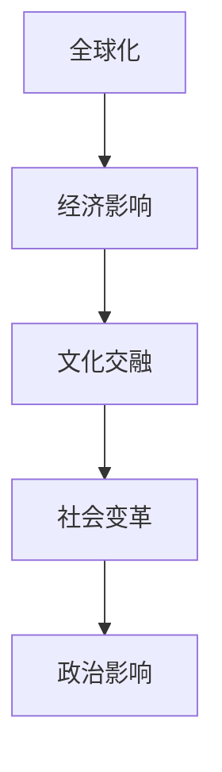
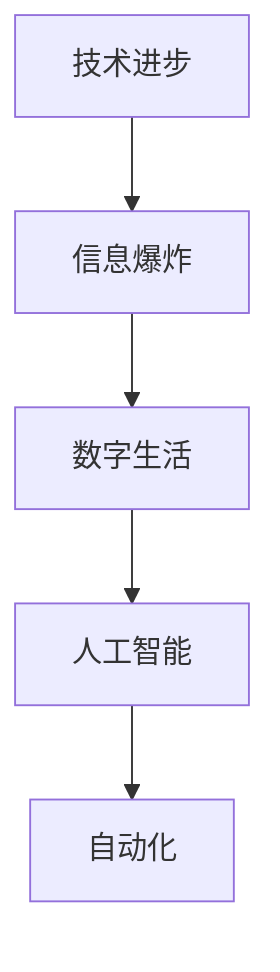

                 

### 在流动的世界中寻找稳定：现代人的困境

#### 关键词：
现代社会、变迁、职业发展、心理健康、生活平衡、稳定性

#### 摘要：
在快速变化的现代社会中，现代人面临着诸多挑战，如职业发展的不确定性、情感与人际关系的孤立、健康与心理压力等。本文将深入探讨这些困境，并从自我认知与成长、构建支持系统、职业生涯规划、心理健康与生活平衡等方面，提供寻找稳定的路径和策略。

## 第一部分：现代人的生存挑战

### 第1章：快速变化的现代世界

#### 1.1 现代社会的变迁

##### 1.1.1 全球化的影响

全球化带来了经济的全球化、文化的全球化和社会的全球化。它不仅改变了我们的生活方式，也深刻影响了职业发展的方向。

##### 1.1.2 技术进步的挑战

技术的快速进步，尤其是互联网和人工智能的兴起，改变了我们的工作方式和生活方式。然而，这也带来了信息爆炸、数字生活的挑战和自动化对劳动力市场的冲击。

### 第2章：职业发展的困境

#### 2.1 职业规划的困惑

在快速变化的现代社会中，职业选择变得更为复杂。如何规划职业生涯，应对职业发展的不确定性，成为现代人面临的重要问题。

##### 2.1.1 职业选择的困境

职业选择的困境体现在个人兴趣与市场需求之间的矛盾、职业发展的不确定性以及职业转型的挑战。

##### 2.1.2 职业发展的不确定性

职业发展的不确定性主要体现在行业变革、技术更新和劳动力市场的波动等方面。

##### 2.1.3 职业转型的挑战

随着技术的发展，许多传统职业正逐渐被淘汰，职业转型成为现代人的必然选择。然而，职业转型的过程充满挑战。

### 第3章：情感与人际关系的挑战

#### 3.1 独居与社交孤立

在现代社会中，独居现象日益增多，社交孤立成为一个普遍存在的问题。如何改善社交关系，提升生活质量，成为现代人需要面对的挑战。

##### 3.1.1 独居现象的增多

独居现象的增多，一方面反映了现代社会的变迁，另一方面也带来了社交孤立的隐患。

##### 3.1.2 社交孤立的成因

社交孤立的成因复杂多样，包括个人性格、生活方式、工作压力等方面。

##### 3.1.3 改善社交关系的策略

通过积极参与社交活动、培养良好的沟通技巧和建立健康的社交网络，可以改善社交关系，减少社交孤立。

### 第4章：健康与心理压力

#### 4.1 身体健康的挑战

在快节奏的现代生活中，身体健康面临着诸多挑战，如疾病威胁、不健康的生活方式和健康管理的必要性。

##### 4.1.1 疾病的威胁

随着生活方式的改变，慢性疾病、心理疾病等威胁着人类的健康。

##### 4.1.2 不健康的生活方式

不健康的生活方式，如缺乏运动、不合理饮食和过度工作等，对身体健康产生负面影响。

##### 4.1.3 健康管理的必要性

健康管理的必要性体现在预防疾病、提高生活质量和延长寿命等方面。

#### 4.2 心理健康的困境

在现代社会中，心理健康问题日益突出。如何识别和应对心理问题，提升心理健康水平，成为现代人需要关注的重要问题。

##### 4.2.1 压力的来源

心理压力的来源包括工作压力、生活压力、人际关系压力等。

##### 4.2.2 心理问题的识别

心理问题的识别包括焦虑、抑郁、失眠等常见心理问题。

##### 4.2.3 心理健康促进的方法

通过心理辅导、运动、社交活动等途径，可以促进心理健康。

## 第二部分：寻找稳定的路径

### 第5章：自我认知与成长

#### 5.1 了解自己

自我认知是寻找稳定的重要基础。通过自我评估、自我反思和自我成长，可以更好地了解自己，为稳定发展奠定基础。

##### 5.1.1 自我认知的重要性

自我认知的重要性在于它有助于我们明确个人目标、提升自我价值感和增强自信心。

##### 5.1.2 自我认知的方法

自我认知的方法包括自我反思、他人反馈和职业规划等。

##### 5.1.3 自我成长的策略

自我成长的策略包括学习新知识、培养新技能和提升自身素质等。

### 第6章：构建支持系统

#### 6.1 家庭与朋友的支持

家庭和朋友是构建支持系统的重要组成部分。通过建立健康的家庭关系、培养深厚的友谊和积极参与社区活动，可以增强支持系统的稳定性。

##### 6.1.1 家庭关系的构建

家庭关系的构建包括家庭沟通、家庭支持和家庭价值观的培养等。

##### 6.1.2 友谊的重要性

友谊的重要性体现在情感支持、共同成长和人生陪伴等方面。

##### 6.1.3 社区参与的价值

社区参与的价值在于增强社交网络、提升生活质量和促进社会和谐。

### 第7章：职业生涯规划

#### 7.1 职业规划的步骤

职业生涯规划是一个系统性的过程，包括自我评估、目标设定和行动计划制定等步骤。

##### 7.1.1 自我评估

自我评估包括个人兴趣、能力、价值观和职业目标等方面。

##### 7.1.2 目标设定

目标设定是职业生涯规划的核心，包括短期目标和长期目标的设定。

##### 7.1.3 行动计划的制定

行动计划的制定包括具体行动步骤、时间安排和资源调配等。

### 第8章：心理健康与生活平衡

#### 8.1 心理健康的重要性

心理健康是生活平衡的重要组成部分。心理健康的重要性在于它直接影响生活质量、工作表现和人际关系。

##### 8.1.1 心理健康与生活平衡的关系

心理健康与生活平衡的关系表现在相互促进、相互制约等方面。

##### 8.1.2 心理健康促进的策略

心理健康的促进策略包括心理辅导、运动、社交活动等。

##### 8.1.3 生活平衡的实现途径

生活平衡的实现途径包括工作与生活的平衡、个人与家庭的关系和持续学习的力量等。

## 第三部分：实际案例与策略

### 第9章：成功人士的稳定之路

#### 9.1 成功人士的稳定经验

成功人士在职业生涯、心理健康和人际关系等方面积累了丰富的经验，为我们提供了宝贵的启示。

##### 9.1.1 职业生涯的稳定发展

成功人士在职业生涯中，通过自我认知、职业规划和持续学习，实现了稳定发展。

##### 9.1.2 心理健康的维护

成功人士注重心理健康，通过心理辅导、运动和社交活动等途径，维护了心理健康。

##### 9.1.3 家庭与社交关系的平衡

成功人士在家庭与社交关系方面，通过建立健康的家庭关系、培养深厚的友谊和积极参与社区活动，实现了平衡。

### 第10章：应对变革的策略

#### 10.1 变革应对的心理准备

在快速变化的现代社会中，应对变革成为现代人需要具备的能力。心理准备是应对变革的重要前提。

##### 10.1.1 对变革的认知

对变革的认知包括对变革趋势的把握、对变革意义的理解和对变革影响的预判等。

##### 10.1.2 变革管理的策略

变革管理的策略包括变革规划、变革实施和变革评估等。

##### 10.1.3 应对变革的技巧

应对变革的技巧包括心理调适、学习能力提升和沟通能力提升等。

### 第11章：构建稳定性的方法

#### 11.1 生活平衡的艺术

生活平衡是实现稳定性的关键。通过工作与生活的平衡、个人与家庭的关系和持续学习的力量，可以实现生活平衡。

##### 11.1.1 工作与生活的平衡

工作与生活的平衡包括合理安排工作时间、培养兴趣爱好和保持身心健康等。

##### 11.1.2 个人与家庭的关系

个人与家庭的关系包括家庭沟通、家庭支持和家庭价值观的培养等。

##### 11.1.3 持续学习的力量

持续学习的力量在于提升个人能力、适应社会变革和实现自我价值。

### 第12章：未来世界的适应

#### 12.1 未来世界的特征

未来世界的特征包括技术进步、社会变迁和全球化等。

##### 12.1.1 技术进步的趋势

技术进步的趋势包括人工智能、物联网、生物技术等。

##### 12.1.2 社会变迁的影响

社会变迁的影响包括人口老龄化、社会分层和文化多元化等。

##### 12.1.3 适应未来世界的策略

适应未来世界的策略包括持续学习、心理准备和社会参与等。

## 附录

### 附录A：实用资源与工具

#### A.1 心理健康资源

包括心理健康网站推荐、心理咨询服务的获取和自我心理评估工具等。

##### A.1.1 心理健康网站推荐

推荐一些权威的心理健康网站，提供心理健康知识和咨询服务。

##### A.1.2 心理咨询服务的获取

介绍如何获取心理咨询服务，包括线上和线下咨询方式。

##### A.1.3 自我心理评估工具

推荐一些自我心理评估工具，帮助个人了解自己的心理健康状况。

#### A.2 职业发展资源

包括职业规划的书籍与课程、职业发展网站推荐和网络社交平台在职业发展中的应用等。

##### A.2.1 职业规划的书籍与课程

推荐一些关于职业规划的书籍和课程，帮助个人进行职业规划。

##### A.2.2 职业发展网站推荐

推荐一些职业发展网站，提供职业信息、招聘信息和职业规划建议。

##### A.2.3 网络社交平台在职业发展中的应用

介绍如何利用网络社交平台进行职业发展，包括人脉拓展、信息获取和求职等。

---

本文通过对现代社会变迁、职业发展、情感与人际关系、健康与心理压力等方面的深入分析，探讨了现代人面临的困境。同时，从自我认知与成长、构建支持系统、职业生涯规划、心理健康与生活平衡等方面，提供了寻找稳定的路径和策略。希望通过本文，能帮助读者在流动的世界中找到自己的稳定点，实现个人价值和社会价值的统一。本文作者为AI天才研究院/AI Genius Institute & 禅与计算机程序设计艺术 /Zen And The Art of Computer Programming，期待您的阅读与分享。

