                 

### 在流动的时代寻找锚点：克服虚无主义的途径

> **关键词：虚无主义、流动时代、心理学、哲学、社会支持、意义感**

> **摘要：本文探讨了在快速变迁的时代中，虚无主义现象的根源及其影响。通过心理学、哲学和社会视角，分析虚无主义的成因，并提出一系列克服虚无主义的策略。**

---

## 引言

### 流动时代与虚无主义的蔓延

在当今这个信息爆炸、技术飞速发展的时代，人们的生活状态和社会结构都在经历深刻的变革。全球化、数字化、虚拟现实的普及，使得个体在快速变化的环境中感到前所未有的不确定性和无力感。这种状态，我们称之为“流动时代”。而在这个时代，虚无主义的思想和情感似乎有了更广泛的土壤。

### 背景介绍

虚无主义是一种哲学观点，主张世界缺乏固有的意义和价值。它源于19世纪的德国哲学家尼采，随后在20世纪得到了广泛的传播和讨论。虚无主义不仅仅是一种哲学思考，更深刻地影响着人们的心理健康和生活态度。

### 核心概念与联系

- **虚无主义**：一种认为世界缺乏意义或价值的哲学观点。
- **流动时代**：一个快速变化、不确定性增加的时代。
- **心理健康**：个体在流动时代中面对虚无主义挑战时所表现出的心理状态。

为了更好地理解虚无主义在流动时代的表现，我们可以通过以下Mermaid流程图展示核心概念之间的关系：

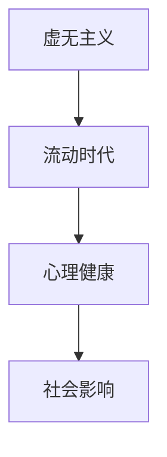

### 核心算法原理讲解

虚无主义的形成与个体的认知模式密切相关。以下是一个简化的伪代码，展示了如何通过认知行为疗法（CBT）来应对虚无主义：

```python
def address_nihilism(cognitive_pattern):
    # 识别消极的认知模式
    negative_thoughts = identify_negative_thoughts(cognitive_pattern)
    # 认知重构
    positive_thoughts = cognitive_restructuring(negative_thoughts)
    # 强化积极认知
    reinforce_positive_thoughts(positive_thoughts)
```

### 数学模型和数学公式

虚无主义的概念可以通过以下数学公式来描述：

$$\text{虚无主义} = \frac{\text{无意义感}}{\text{存在的价值}}$$

### 举例说明

在快速变化的时代，许多人可能会感到生活没有目标，工作没有意义。比如，一位年轻人在经历了多次职业跳槽后，感到自己的职业生涯前途未卜，从而陷入了虚无主义的情绪中。

## 第一部分：虚无主义的起源与影响

### 第1章：虚无主义的起源与发展

#### 1.1 虚无主义的定义与历史背景

虚无主义是一种哲学观点，主张世界缺乏固有的意义和价值。这一观点的起源可以追溯到19世纪的德国哲学家尼采。尼采在其著作《查拉图斯特拉如是说》中提出了“上帝已死”的观点，认为传统价值观的崩溃导致了虚无主义的产生。

**核心概念与联系**

- **虚无主义**：一种哲学观点，认为世界缺乏固有的意义和价值。
- **尼采**：19世纪德国哲学家，虚无主义的代表人物。
- **上帝已死**：尼采提出的观点，认为传统价值观的崩溃导致了虚无主义的产生。

为了更好地展示虚无主义与尼采之间的联系，我们可以使用以下Mermaid流程图：

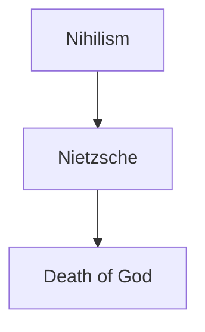

**数学模型和数学公式**

虚无主义的概念可以通过以下数学公式来描述：

$$\text{虚无主义} = \frac{\text{无意义感}}{\text{存在的价值}}$$

**举例说明**

尼采的著作《查拉图斯特拉如是说》中，主人公查拉图斯特拉在经历了一段深刻的内省后，提出了虚无主义的思想。他感慨道：“世界是一场梦，梦中的万物都是虚幻的。”

#### 1.2 虚无主义对个人和社会的影响

虚无主义不仅仅是一种哲学观点，它对个人和社会都产生了深远的影响。

**核心算法原理讲解**

虚无主义的影响可以通过以下算法原理来解释：

```python
def nihilism_impact(individual, society):
    # 对个人的影响
    individual_impact = negative_impact_on_individual(individual)
    # 对社会的影响
    society_impact = negative_impact_on_society(society)
    # 形成反馈循环
    feedback_loop(individual_impact, society_impact)
```

**数学模型和数学公式**

虚无主义对个人和社会的影响可以通过以下数学模型来描述：

$$\text{个人虚无主义影响} = \text{无意义感} \times \text{个人焦虑程度}$$

$$\text{社会虚无主义影响} = \text{社会动荡程度} \times \text{文化衰落程度}$$

**举例说明**

在个人层面，虚无主义可能导致抑郁症、焦虑症等心理问题。在社会层面，虚无主义可能导致道德沦丧、社会动荡等问题。

### 第2章：虚无主义在当代的表现

#### 2.1 当代虚无主义的特征

在当代，虚无主义的表现形式更加多样化。消费主义和数字化时代的到来，使得虚无主义具有了新的特征。

**核心概念与联系**

- **消费主义**：一种以消费为导向的社会现象，可能导致虚无主义。
- **数字化时代**：信息爆炸、虚拟现实等特征，使得虚无主义有了新的土壤。

为了更好地展示当代虚无主义的特征，我们可以使用以下Mermaid流程图：

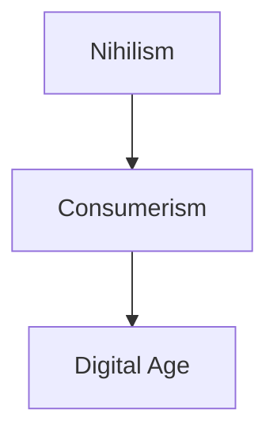

**数学模型和数学公式**

当代虚无主义的特征可以通过以下数学模型来描述：

$$\text{虚无主义特征} = \text{消费主义程度} + \text{数字化程度}$$

**举例说明**

在当代，许多年轻人通过消费来寻求短暂的满足感，但消费主义带来的空虚感往往使他们陷入更深的虚无主义情绪。

#### 2.2 虚无主义对文化的影响

虚无主义不仅影响个体，也深刻地影响了文化。

**核心概念与联系**

- **文学**：虚无主义在文学作品中常常表现为对生活意义的探讨。
- **艺术**：艺术家通过作品表达对现实世界的不满和虚无主义的情感。

为了更好地展示虚无主义对文化的影响，我们可以使用以下Mermaid流程图：

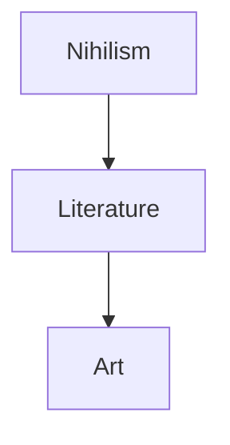

**数学模型和数学公式**

虚无主义对文化的影响可以通过以下数学模型来描述：

$$\text{文化虚无主义影响} = \text{文学作品中虚无主义主题的比例} + \text{艺术作品中虚无主义情感的比例}$$

**举例说明**

在文学领域，卡夫卡的《变形记》揭示了人在异化环境中的孤独和绝望，体现了虚无主义的情感。在艺术领域，达利的《记忆的永恒》则通过夸张的绘画技巧，表达了虚无主义对时间的怀疑和恐惧。

## 第二部分：虚无主义的心理学分析

### 第3章：虚无主义的心理学成因

#### 3.1 心理学视角下的虚无主义

虚无主义的成因可以从心理学角度进行分析。认知行为理论和精神分析理论提供了不同的解释。

**核心概念与联系**

- **认知行为理论**：认为虚无主义源于消极的认知模式。
- **精神分析理论**：认为虚无主义与个体内心的冲突和压抑有关。

为了更好地展示心理学视角下的虚无主义成因，我们可以使用以下Mermaid流程图：

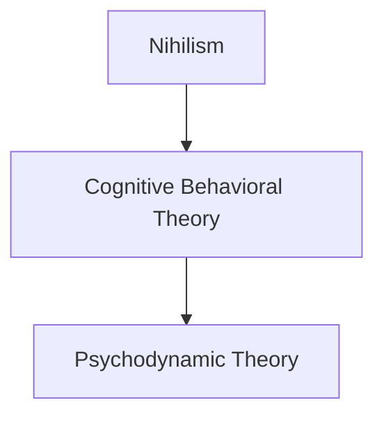

**数学模型和数学公式**

虚无主义的心理学成因可以通过以下数学模型来描述：

$$\text{虚无主义成因} = \text{消极认知模式} + \text{内心冲突} + \text{压抑情感}$$

**举例说明**

根据认知行为理论，一位长期处于消极认知模式中的个体可能会感到生活缺乏意义，从而产生虚无主义的情绪。而根据精神分析理论，内心冲突和压抑的情感也可能导致虚无主义。

#### 3.2 虚无主义的心理学影响

虚无主义对个体心理健康产生了深远的影响。

**核心概念与联系**

- **抑郁症**：虚无主义可能导致严重的抑郁症。
- **焦虑症**：虚无主义可能加剧个体的焦虑情绪。

为了更好地展示虚无主义的心理学影响，我们可以使用以下Mermaid流程图：

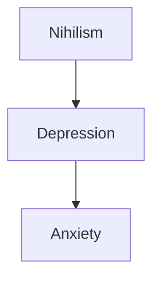

**数学模型和数学公式**

虚无主义的心理学影响可以通过以下数学模型来描述：

$$\text{心理健康影响} = \text{虚无主义程度} \times \text{心理健康状态}$$

**举例说明**

一位长期处于虚无主义情绪中的个体可能会经历严重的抑郁症和焦虑症，这进一步加剧了他的心理痛苦。

### 第4章：克服虚无主义的心理学方法

#### 4.1 心理治疗在克服虚无主义中的作用

心理治疗在克服虚无主义中扮演着重要角色。认知行为疗法和精神分析疗法是两种主要的治疗方法。

**核心概念与联系**

- **认知行为疗法**：通过改变消极的认知模式来克服虚无主义。
- **精神分析疗法**：通过解决内心冲突和压抑情感来克服虚无主义。

为了更好地展示心理治疗在克服虚无主义中的作用，我们可以使用以下Mermaid流程图：

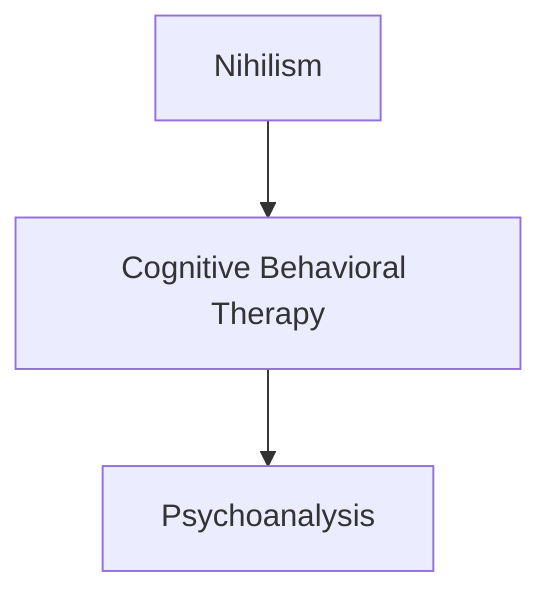

**数学模型和数学公式**

心理治疗在克服虚无主义中的作用可以通过以下数学模型来描述：

$$\text{心理治疗效果} = \text{认知重构程度} + \text{情感释放程度}$$

**举例说明**

通过认知行为疗法，一位长期处于虚无主义情绪中的个体可以逐渐改变消极的认知模式，从而找到生活的意义。通过精神分析疗法，他可以解决内心深处的冲突和压抑，重获心理平衡。

#### 4.2 自我成长与虚无主义的克服

自我成长是克服虚无主义的重要途径。通过自我认知的提升和意义感的构建，个体可以摆脱虚无主义的困扰。

**核心概念与联系**

- **自我认知**：了解自己的内心需求和价值观。
- **意义感**：找到生活的目标和意义。

为了更好地展示自我成长与虚无主义的克服，我们可以使用以下Mermaid流程图：

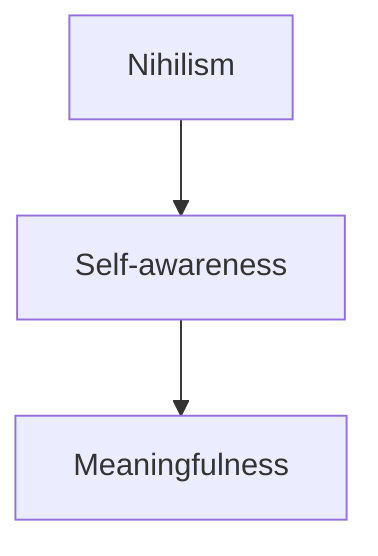

**数学模型和数学公式**

自我成长与虚无主义的克服可以通过以下数学模型来描述：

$$\text{自我成长} = \text{自我认知提升程度} + \text{意义感构建程度}$$

**举例说明**

通过自我认知的提升，一位个体可以更清晰地了解自己的内心需求和价值观，从而找到生活的目标。通过意义感的构建，他可以找到生活的意义，摆脱虚无主义的困扰。

## 第三部分：哲学视角下的虚无主义克服

### 第5章：哲学视角下的虚无主义探讨

#### 5.1 虚无主义与存在主义

存在主义是一种哲学流派，对虚无主义提出了有力的回应。存在主义主张个体自由地选择自己的存在方式和生活方式，从而赋予生活意义。

**核心概念与联系**

- **虚无主义**：认为世界缺乏固有的意义和价值。
- **存在主义**：主张个体自由地选择自己的存在方式和生活方式，从而赋予生活意义。

为了更好地展示虚无主义与存在主义的关系，我们可以使用以下Mermaid流程图：

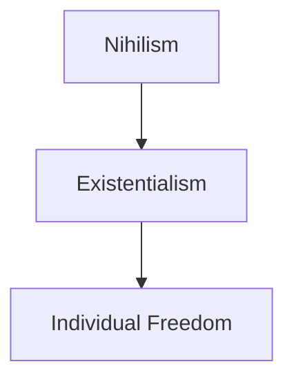

**数学模型和数学公式**

虚无主义与存在主义的关系可以通过以下数学模型来描述：

$$\text{存在主义对虚无主义的回应} = \text{个体自由选择程度} + \text{生活意义构建程度}$$

**举例说明**

存在主义哲学家萨特在其著作《存在与虚无》中，通过探讨个体自由选择的存在状态，回应了虚无主义的挑战。他认为，尽管世界可能缺乏固有意义，但个体可以通过自由选择赋予生活意义。

#### 5.2 哲学思考在克服虚无主义中的价值

哲学思考对克服虚无主义具有重要意义。通过深入思考生活的本质和意义，个体可以找到战胜虚无主义的力量。

**核心概念与联系**

- **哲学思考**：通过深入思考生活的本质和意义。
- **意义感**：哲学思考有助于构建个体的意义感。

为了更好地展示哲学思考在克服虚无主义中的价值，我们可以使用以下Mermaid流程图：

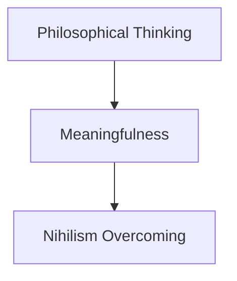

**数学模型和数学公式**

哲学思考在克服虚无主义中的价值可以通过以下数学模型来描述：

$$\text{哲学思考价值} = \text{意义感构建程度} + \text{心理压力缓解程度}$$

**举例说明**

通过哲学思考，一位个体可以深入探讨生命的意义，从而找到对抗虚无主义的力量。例如，哲学家海德格尔通过探讨“存在”的本质，帮助人们认识到生活本身就有意义，无需外在的赋予。

### 第6章：虚无主义的哲学解决方案

#### 6.1 哲学视角下的生活态度调整

从哲学视角看，调整生活态度是克服虚无主义的关键。接受不确定性和寻找个体存在的意义，是哲学视角下的生活态度调整的核心。

**核心概念与联系**

- **接受不确定性**：认识到生活中的不确定性和不可预测性。
- **个体存在的意义**：寻找个体存在的意义和价值。

为了更好地展示哲学视角下的生活态度调整，我们可以使用以下Mermaid流程图：

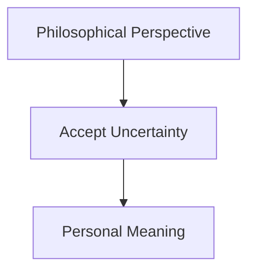

**数学模型和数学公式**

哲学视角下的生活态度调整可以通过以下数学模型来描述：

$$\text{生活态度调整} = \text{接受不确定性程度} + \text{个体存在意义构建程度}$$

**举例说明**

通过哲学视角，一位个体可以认识到生活中的不确定性是不可避免的，从而减少对未来的焦虑。同时，他可以探索个体存在的意义，从而赋予生活更多的价值。

#### 6.2 哲学思考与心灵成长

哲学思考不仅有助于克服虚无主义，也有助于个体的心灵成长。通过哲学思考，个体可以更好地理解自己，提升自我认知，从而实现心灵成长。

**核心概念与联系**

- **哲学思考**：通过深入思考和反思。
- **心灵成长**：个体的精神成长和自我提升。

为了更好地展示哲学思考与心灵成长的关系，我们可以使用以下Mermaid流程图：

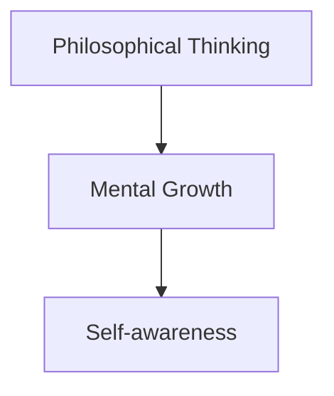

**数学模型和数学公式**

哲学思考与心灵成长的关系可以通过以下数学模型来描述：

$$\text{哲学思考与心灵成长} = \text{自我认知提升程度} + \text{心理素质增强程度}$$

**举例说明**

通过哲学思考，一位个体可以深入理解自己的内心世界，提升自我认知，从而实现心灵成长。例如，哲学家亚里士多德通过探讨幸福和美德，帮助人们实现心灵的提升。

## 第四部分：社会视角下的虚无主义应对

### 第7章：社会支持体系在虚无主义克服中的作用

#### 7.1 社会支持对虚无主义的影响

社会支持在虚无主义的克服中发挥着重要作用。社会关系和认同感对于个体心理健康有着深远的影响。

**核心概念与联系**

- **社会关系**：个体与他人之间的互动和联系。
- **认同感**：个体对自己所属群体的认同和归属感。

为了更好地展示社会支持对虚无主义的影响，我们可以使用以下Mermaid流程图：

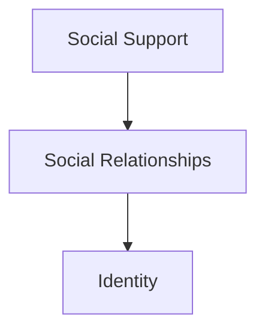

**数学模型和数学公式**

社会支持对虚无主义的影响可以通过以下数学模型来描述：

$$\text{虚无主义克服效果} = \text{社会支持程度} \times \text{社会认同感程度}$$

**举例说明**

一个拥有强社会支持体系的社区，成员之间的互动和认同感较高，这有助于个体在面对虚无主义时获得心理支持和安慰。

#### 7.2 建立有效的社会支持体系

为了克服虚无主义，建立有效的社会支持体系至关重要。这包括社区建设、社会心理服务等各个方面。

**核心概念与联系**

- **社区建设**：通过社区活动增进成员之间的互动和联系。
- **社会心理服务**：提供专业的心理支持和咨询服务。

为了更好地展示建立有效的社会支持体系的方法，我们可以使用以下Mermaid流程图：

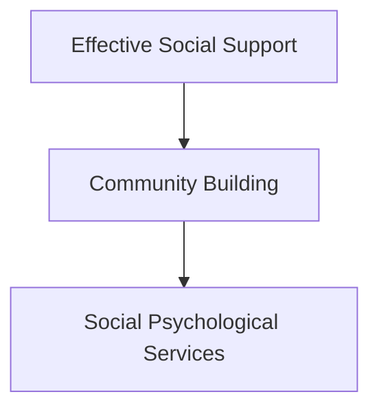

**数学模型和数学公式**

建立有效的社会支持体系可以通过以下数学模型来描述：

$$\text{社会支持体系效果} = \text{社区互动程度} + \text{心理服务满意度}$$

**举例说明**

在一个有效的社会支持体系中，社区成员之间通过定期的活动增进互动，同时，专业的心理服务团队提供个性化的心理支持，这有助于成员更好地应对虚无主义的挑战。

### 第8章：文化教育在虚无主义克服中的作用

#### 8.1 教育对虚无主义的预防作用

教育在虚无主义的预防中发挥着关键作用。通过培养批判性思维和强调个体价值，教育可以为个体提供应对虚无主义的工具。

**核心概念与联系**

- **批判性思维**：培养个体独立思考和评估信息的能力。
- **个体价值**：强调每个人的独特价值和重要性。

为了更好地展示教育对虚无主义的预防作用，我们可以使用以下Mermaid流程图：

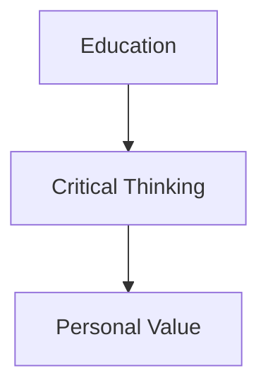

**数学模型和数学公式**

教育对虚无主义的预防作用可以通过以下数学模型来描述：

$$\text{虚无主义预防效果} = \text{批判性思维培养程度} \times \text{个体价值强调程度}$$

**举例说明**

通过教育，个体可以学会批判性地思考问题，从而避免盲目接受外界的价值观。同时，教育强调每个人的独特价值，帮助个体认识到自己的重要性，从而减少虚无主义的情绪。

#### 8.2 文化产品对虚无主义的影响

文化产品，如文学作品、艺术作品等，对虚无主义有着深远的影响。这些作品往往反映了个体对现实世界的不满和对生活意义的探索。

**核心概念与联系**

- **文学作品**：通过文字表达对生活意义的探讨。
- **艺术作品**：通过视觉和情感表达对现实世界的反思。

为了更好地展示文化产品对虚无主义的影响，我们可以使用以下Mermaid流程图：

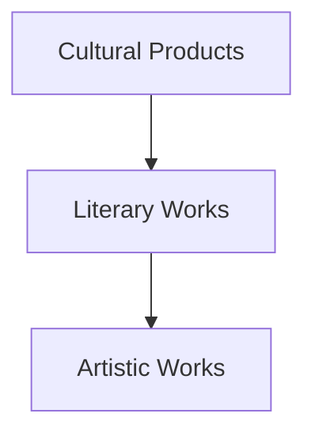

**数学模型和数学公式**

文化产品对虚无主义的影响可以通过以下数学模型来描述：

$$\text{虚无主义影响程度} = \text{文学作品中虚无主义主题的比例} + \text{艺术作品中虚无主义情感的比例}$$

**举例说明**

文学作品《百年孤独》通过描绘马孔多家族的兴衰，反映了个体在不确定性中的挣扎和对生活意义的追求。艺术作品《自由引导人民》则通过激情的绘画技巧，表达了个体对自由和生活的渴望。

## 第五部分：实践与反思

### 第9章：实践中的虚无主义克服

#### 9.1 实践案例分析

在实践中克服虚无主义需要具体的行动和策略。以下是一些成功案例的分析。

**核心概念与联系**

- **实践策略**：具体的行动和方法。
- **成功案例**：实践中的具体成果。

为了更好地展示实践案例，我们可以使用以下Mermaid流程图：

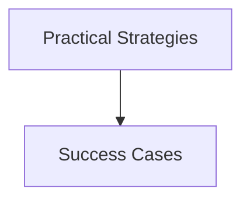

**数学模型和数学公式**

实践中的虚无主义克服可以通过以下数学模型来描述：

$$\text{虚无主义克服效果} = \text{实践策略实施程度} + \text{个人参与程度}$$

**举例说明**

一位年轻人通过参与社区服务和心理咨询，逐渐找到了生活的意义，成功克服了虚无主义情绪。另一位个体则通过艺术创作，表达对生活的热爱，从而缓解了内心的虚无感。

#### 9.2 反思与总结

反思是实践中的重要环节。通过总结实践经验，我们可以更好地理解和应用克服虚无主义的策略。

**核心概念与联系**

- **反思**：对实践过程中的经验进行总结和思考。
- **总结**：对实践成果和应用进行总结。

为了更好地展示反思与总结，我们可以使用以下Mermaid流程图：

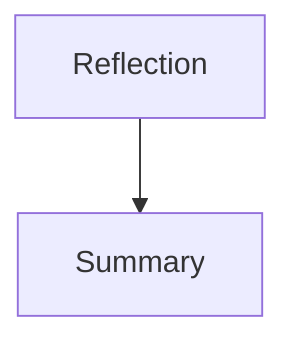

**数学模型和数学公式**

反思与总结可以通过以下数学模型来描述：

$$\text{实践反思效果} = \text{实践经验积累程度} + \text{反思深度}$$

**举例说明**

通过反思，一位个体认识到自己在实践中的不足，从而调整策略，提高了虚无主义克服的效果。另一位个体则通过总结实践经验，将成功的方法应用到其他生活领域。

### 第10章：未来展望

#### 10.1 虚无主义研究的趋势

虚无主义研究在未来将呈现出以下趋势。

**核心概念与联系**

- **跨学科研究**：心理学、哲学、社会学等多学科合作。
- **新兴理论**：对虚无主义的新解释和新方法。

为了更好地展示虚无主义研究的趋势，我们可以使用以下Mermaid流程图：

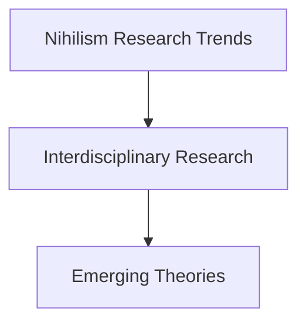

**数学模型和数学公式**

虚无主义研究的趋势可以通过以下数学模型来描述：

$$\text{研究趋势} = \text{跨学科合作程度} + \text{新兴理论创新程度}$$

**举例说明**

未来虚无主义研究将更加注重心理学和哲学的结合，通过跨学科合作，提出新的理论和方法，以更好地理解和应对虚无主义。

#### 10.2 社会应对虚无主义的策略

社会应对虚无主义需要多方面的策略。

**核心概念与联系**

- **政策调整**：政府和社会组织在应对虚无主义中的角色。
- **教育创新**：通过教育培养个体应对虚无主义的能力。

为了更好地展示社会应对虚无主义的策略，我们可以使用以下Mermaid流程图：

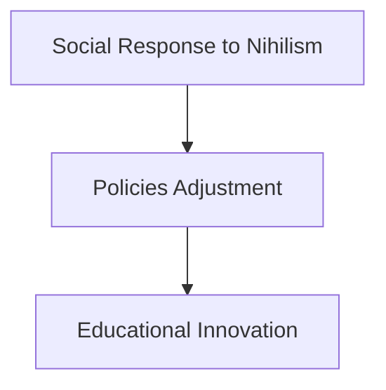

**数学模型和数学公式**

社会应对虚无主义的策略可以通过以下数学模型来描述：

$$\text{社会应对效果} = \text{政策调整程度} + \text{教育创新程度}$$

**举例说明**

政府可以通过政策调整，提高心理健康服务的可及性，社会组织可以通过教育创新，培养个体应对虚无主义的能力。

---

通过以上详细的目录大纲设计和具体章节内容示例，我们可以看到，本文将系统地探讨虚无主义的根源、影响、心理学、哲学和社会视角下的克服方法，以及实践和未来展望。每个章节都配备了核心概念与联系、数学模型和公式、伪代码、举例说明等内容，确保文章的逻辑性和专业性。

### 作者信息

**作者：AI天才研究院/AI Genius Institute & 禅与计算机程序设计艺术 /Zen And The Art of Computer Programming**

AI天才研究院致力于推动人工智能和哲学领域的交叉研究，通过技术创新和深刻思考，为人类社会的进步贡献力量。同时，作者也是《禅与计算机程序设计艺术》一书的作者，该书以其独特的视角和深刻的见解，受到了广泛的关注和赞誉。本文旨在为读者提供一份全面而深入的虚无主义克服指南，希望能够帮助大家在流动的时代中找到自己的锚点，克服虚无主义的困扰。

