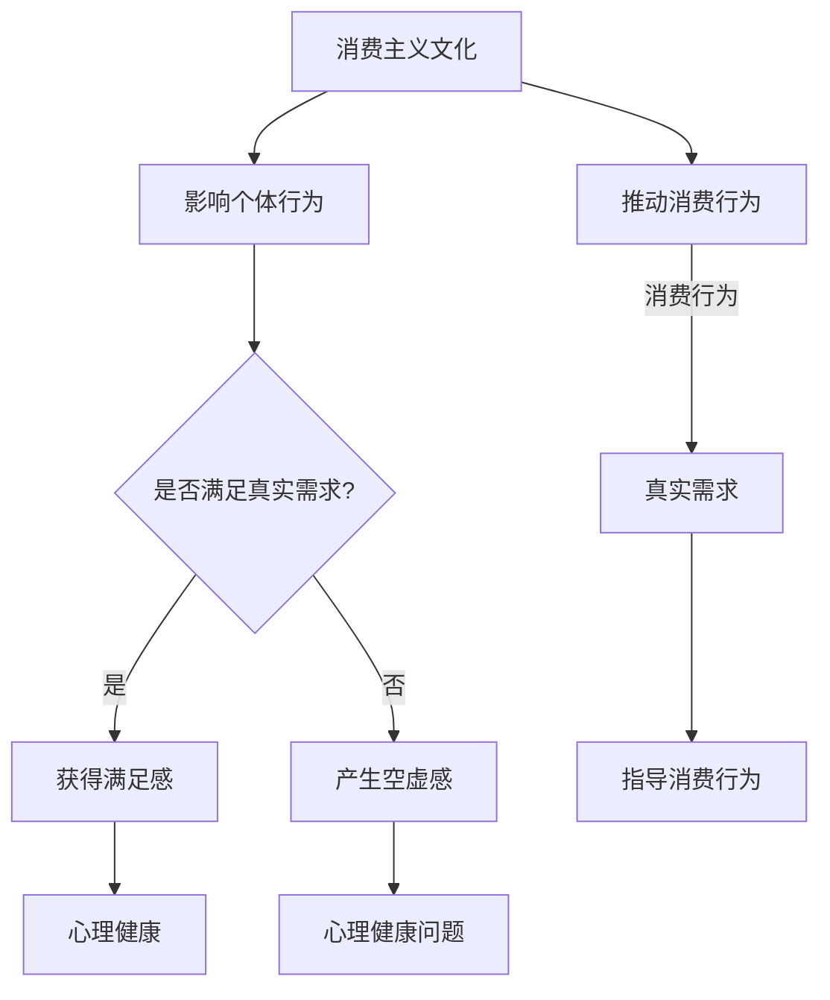

                 

### 文章标题：在消费主义文化中寻找真实需求：对抗空虚感

#### 关键词：消费主义文化，真实需求，空虚感，心理调适，社会互动，消费行为调整

> 摘要：本文通过分析消费主义文化的特点及其对现代社会的影响，探讨了如何在消费主义文化中识别和满足真实需求，以对抗空虚感。文章提出了心理调适、社会互动和消费行为调整等策略，并通过实际案例展示了这些策略的应用和效果。

### 引言

#### 1.1 书籍背景与意义

消费主义文化在现代社会中占据着主导地位。随着经济的快速发展，物质生活水平的提高，人们开始追求更多的物质财富和消费体验。然而，消费主义文化也带来了一系列问题，如过度消费、环境破坏、社会不平等以及个人的空虚感。在这种背景下，寻找真实需求、对抗空虚感成为了一个重要的课题。

本文旨在探讨如何在一个消费主义文化泛滥的社会中找到真实需求，以对抗空虚感。通过对消费主义文化的分析，揭示其背后的动机和影响，进而提出一系列有效的策略和方法。本文的研究不仅具有理论意义，也具有实际应用价值，可以帮助个人和社会更好地应对消费主义文化的挑战。

#### 1.2 研究方法与结构安排

本文采用多学科交叉的研究方法，结合社会学、心理学和经济学等领域的理论，对消费主义文化进行深入分析。具体来说，本文将采用文献综述、案例分析、实证研究和理论构建等方法，从多个角度探讨真实需求的识别和满足。

文章结构安排如下：

1. 引言：介绍研究背景、意义和研究方法。
2. 消费主义文化概述：分析消费主义文化的特点及其对现代社会的影响。
3. 真实需求的定义与识别：探讨真实需求的定义、识别方法和与虚假需求的区别。
4. 对抗空虚感的策略与方法：提出心理调适、社会互动和消费行为调整等策略，并详细阐述其原理和操作方法。
5. 项目实践：介绍实际案例，展示对抗空虚感的策略和方法在实践中的应用和效果。
6. 总结与展望：总结研究成果，提出未来研究方向和拓展思路。

### 消费主义文化概述

#### 2.1 消费主义文化的定义与特点

消费主义文化是指一种以消费为中心的社会价值观和行为模式。它强调物质财富的追求和消费行为的频繁发生，认为通过消费可以带来满足感和幸福感。消费主义文化的特点主要包括以下几点：

1. **物质主义导向**：消费主义文化强调物质财富的重要性，人们被鼓励追求更多的物质产品和服务。
2. **过度消费**：在消费主义文化中，人们倾向于过度消费，不断购买新的商品以满足自身需求。
3. **符号消费**：消费主义文化中的商品不再仅仅具有实用价值，更成为一种社会地位的象征。
4. **短期满足**：消费主义文化追求即时的满足感，往往忽视长期的需求和价值观。

#### 2.2 消费主义文化的影响

消费主义文化对个人和社会产生了深远的影响：

1. **个人层面的影响**：消费主义文化使人们陷入物质追求的循环中，导致精神空虚和心理健康问题。同时，过度消费也增加了个人的经济负担和压力。
2. **社会层面的影响**：消费主义文化加剧了社会不平等，富裕阶层和贫困阶层之间的差距加大。此外，过度消费也导致环境破坏和资源浪费，对地球生态系统造成负面影响。

### 真实需求的定义与识别

#### 3.1 真实需求的定义

真实需求是指个体内心深处渴望满足的内在需求，通常与个体的价值观、情感和生活目标密切相关。与虚假需求相比，真实需求具有以下几个特点：

1. **内在动机**：真实需求源自个体内心的渴望和动机，而非外界的刺激和压力。
2. **持久性**：真实需求具有较强的持久性，不会因一时的情绪波动而改变。
3. **价值观相关性**：真实需求与个体的价值观和生活目标相一致，有助于个体的成长和发展。

#### 3.2 真实需求的识别方法

要识别真实需求，可以从以下几个方面入手：

1. **内在动机识别**：通过自我反思和内心探索，了解自己的真正动机和渴望。例如，通过冥想、日记等方式，深入了解自己的内心世界。
2. **外在表现分析**：观察自己在不同情境下的行为和反应，分析背后的动机和需求。例如，通过记录日常消费行为，分析消费背后的真实需求。
3. **情感与价值观考量**：结合情感体验和价值观，判断需求是否符合自己的内在需求和价值观。例如，通过反思自己的情感反应和行为选择，评估需求是否符合自己的价值观。

#### 3.3 与虚假需求的区别

虚假需求是指由外部刺激和压力引起的表面需求，通常与个体的真实需求不符。与真实需求相比，虚假需求具有以下几个特点：

1. **外在动机**：虚假需求往往源自外界的诱惑和压力，而非内心的渴望。
2. **短暂性**：虚假需求通常是一时的冲动和情绪反应，不会持久存在。
3. **价值观偏离**：虚假需求往往与个体的价值观和生活目标相背离，不利于个体的成长和发展。

### 对抗空虚感的策略与方法

#### 4.1 心理调适方法

心理调适是应对空虚感的重要策略。以下几种心理调适方法有助于提高个体的心理韧性和幸福感：

1. **正念练习**：正念是一种通过专注于当下时刻来提高心理韧性的方法。通过冥想、深呼吸和专注练习，个体可以学会观察自己的情绪和思维，减少焦虑和压力。
2. **情绪调节技巧**：情绪调节技巧包括认知重构、情绪表达和放松训练等方法。通过认知重构，个体可以改变对事件的认知和解读，从而调整情绪；通过情绪表达，个体可以释放负面情绪，提高心理舒适度；通过放松训练，个体可以缓解紧张和焦虑，提高心理韧性。
3. **自我接纳与自我肯定**：自我接纳和自我肯定是培养心理健康的重要基石。通过接受自己的不足和缺陷，个体可以减少自我批评和内疚感；通过自我肯定，个体可以增强自信心和自尊心，提高自我价值感。

#### 4.2 社会互动策略

社会互动是缓解空虚感的重要途径。以下几种社会互动策略有助于提高个体的社交能力和幸福感：

1. **建立深厚的人际关系**：建立深厚的人际关系有助于满足个体的社交需求，提高心理幸福感。通过参与社区活动、加入兴趣小组和参与志愿者工作等方式，个体可以结识志同道合的朋友，建立支持网络。
2. **参与社会活动**：参与社会活动有助于个体融入社会，提高社会认同感和归属感。例如，参与公益活动、参加社区会议和参与社会组织等，个体可以通过实际行动为社会做出贡献，同时获得成就感和满足感。
3. **寻求专业帮助**：在面临心理困扰和挑战时，寻求专业帮助是一种有效的方式。心理咨询和治疗可以帮助个体探索内心的困扰，提供情感支持和策略指导，帮助个体更好地应对空虚感。

#### 4.3 消费行为的调整

调整消费行为是应对空虚感的重要策略。以下几种消费行为调整方法有助于个体实现消费观念的转变，减少过度消费：

1. **消费观念的转变**：改变消费观念是应对空虚感的关键。通过反思自己的消费行为和动机，个体可以意识到消费主义文化的负面影响，树立理性的消费观念。例如，通过倡导绿色消费、支持可持续发展产品和减少不必要的消费等方式，个体可以践行理性的消费观念。
2. **绿色消费**：绿色消费是一种以环保和可持续发展为目标的消费行为。通过选择环保产品、减少浪费和节约资源等方式，个体可以减少对环境的负面影响，提高生活质量。
3. **购买行为的理性分析**：购买行为的理性分析是一种通过分析消费决策和动机来减少过度消费的方法。通过记录消费行为、分析消费动机和评估消费效果等方式，个体可以了解自己的消费习惯和偏好，调整消费行为，减少不必要的消费。

### 项目实践

#### 5.1 实践案例介绍

本文以某社区为案例，探讨对抗空虚感的策略和方法在实践中的应用。该社区位于城市中心，居民多为年轻人和家庭。近年来，随着消费主义文化的盛行，该社区居民的空虚感逐渐加剧。为了改善这一状况，社区组织发起了一项名为“寻找真实需求，对抗空虚感”的实践活动。

#### 5.2 实践过程分析

该实践活动分为三个阶段：

1. **调研阶段**：通过问卷调查和访谈，了解居民的真实需求和消费行为，发现过度消费和空虚感的问题。
2. **策略制定阶段**：根据调研结果，制定一系列针对心理调适、社会互动和消费行为调整的策略，包括正念练习、社区活动、绿色消费等。
3. **实施阶段**：在社区内开展各种活动，引导居民参与，并实时监测活动效果，调整策略和方法。

#### 5.3 实践反思与启示

通过实践活动的开展，社区居民在心理调适、社会互动和消费行为调整等方面取得了显著成效：

1. **心理调适**：通过正念练习和情绪调节技巧，居民的心理韧性和幸福感得到提高，空虚感明显减轻。
2. **社会互动**：通过参与社区活动和建立深厚的人际关系，居民的社交能力和归属感得到增强，社会支持网络得到巩固。
3. **消费行为调整**：通过绿色消费和购买行为的理性分析，居民的消费观念得到转变，过度消费现象得到有效遏制。

实践反思表明，对抗空虚感需要综合运用心理调适、社会互动和消费行为调整等多方面的策略和方法。同时，实践活动需要持续开展，以巩固效果和促进居民的长期福祉。

### 总结与展望

#### 6.1 主要结论

本文通过分析消费主义文化的特点及其对现代社会的影响，探讨了如何在消费主义文化中寻找真实需求，以对抗空虚感。研究发现，真实需求的识别和满足是应对空虚感的关键。通过心理调适、社会互动和消费行为调整等策略，个体可以有效地应对空虚感，提高心理健康和生活质量。

#### 6.2 未来研究方向

未来研究可以从以下几个方面展开：

1. **跨文化比较**：探讨不同文化背景下消费主义文化和空虚感的特点和差异，为全球范围内的应对策略提供参考。
2. **实证研究**：通过大规模的实证研究，验证本文提出的策略和方法的有效性和可行性，为实践提供科学依据。
3. **新技术应用**：结合人工智能、大数据等新技术，开发更智能、更个性化的应对空虚感的工具和方法。

### 结论与展望

本文通过对消费主义文化的分析，探讨了在消费主义文化中寻找真实需求、对抗空虚感的策略和方法。研究发现，心理调适、社会互动和消费行为调整等策略在应对空虚感方面具有显著效果。然而，对抗空虚感是一个复杂的议题，需要综合运用多种策略和方法。未来研究应进一步探索跨文化差异、实证研究和新技术应用等方面的研究，为个体和社会提供更全面、更科学的应对策略。

### 作者信息

作者：AI天才研究院/AI Genius Institute & 禅与计算机程序设计艺术 /Zen And The Art of Computer Programming

---

## 背景介绍

### 消费主义文化的兴起

消费主义文化起源于20世纪中叶的美国，随着经济的繁荣和科技的进步，消费主义观念迅速传播到全球各地。消费主义文化强调通过消费来满足个体需求、提升生活质量，甚至成为衡量社会地位和成功的重要标准。在这一文化背景下，人们被鼓励追求更多的物质财富和消费体验。

消费主义文化的兴起与以下几个因素密切相关：

1. **经济发展**：二战后，全球经济的快速发展为消费主义文化的兴起提供了物质基础。人们的生活水平逐渐提高，可支配收入增加，消费能力提升。
2. **媒体传播**：媒体在消费主义文化的传播中发挥了重要作用。广告、电影、电视等媒体不断传递消费主义观念，激发人们的消费欲望。
3. **社会观念**：在消费主义文化中，物质财富和消费行为被视为成功和幸福的象征。人们通过消费来展示自己的社会地位、身份和价值观。

### 空虚感在现代社会中的普遍性

随着消费主义文化的盛行，现代社会中普遍存在着一种空虚感。这种空虚感源于以下几个方面：

1. **物质追求的缺失**：在消费主义文化中，人们被鼓励追求更多的物质财富和消费体验，但往往忽略了内心的真实需求。过度追求物质导致人们感到空虚和无法满足。
2. **社会压力的增加**：现代社会中，竞争激烈、工作压力大、人际关系复杂。人们在追求物质财富和社会地位的过程中，承受着巨大的压力，导致心理疲惫和空虚感。
3. **人际关系的变化**：在消费主义文化中，人们越来越注重个人利益和自我实现，而忽视了人际关系的培养和维持。孤独感和社交隔离感的增加加剧了空虚感。

### 研究目的与贡献

本文的研究目的在于探讨如何在消费主义文化中找到真实需求，以对抗空虚感。具体来说，本文将：

1. **分析消费主义文化的特点及其对现代社会的影响**：通过对消费主义文化的定义、特点和发展历程的梳理，揭示消费主义文化背后的动机和影响，为后续研究提供理论基础。
2. **探讨真实需求的定义与识别方法**：通过对真实需求和虚假需求的对比分析，明确真实需求的定义和识别方法，为个体在消费主义文化中寻找真实需求提供指导。
3. **提出对抗空虚感的策略与方法**：结合心理调适、社会互动和消费行为调整等多个方面，提出有效的对抗空虚感的策略和方法，为个人和社会提供应对空虚感的实践指南。
4. **通过实际案例展示策略和方法的应用效果**：通过具体案例的介绍和分析，展示对抗空虚感的策略和方法在实际应用中的效果，为其他实践提供参考。

本文的研究将有助于深化对消费主义文化和空虚感的理解，为个人和社会提供有效的应对策略，促进心理健康和社会和谐。

### 核心概念与联系

为了更好地理解消费主义文化、真实需求和空虚感之间的关系，我们需要构建一个概念架构，并通过Mermaid流程图来展示它们之间的相互作用。

#### 概念架构

1. **消费主义文化**：消费主义文化是一种以消费为中心的社会价值观和行为模式，强调物质财富的追求和消费行为的频繁发生。
2. **真实需求**：真实需求是指个体内心深处渴望满足的内在需求，通常与个体的价值观、情感和生活目标密切相关。
3. **空虚感**：空虚感是指个体在追求物质财富和消费体验的过程中，感到无法满足和内心空虚的心理状态。

#### Mermaid流程图



#### 流程图解释

- **消费主义文化影响个体行为**：消费主义文化通过其物质导向和社会地位象征的特点影响个体的行为和决策。
- **是否满足真实需求**：个体的消费行为旨在满足其真实需求，如果消费行为与真实需求相符，个体会感到满足；反之，则会感到空虚。
- **心理健康**：满足真实需求有助于提升个体的心理健康，反之则会引发心理健康问题。
- **消费行为的指导**：真实需求应指导个体的消费行为，使消费行为更加理性和有意义。

通过上述流程图，我们可以清晰地看到消费主义文化、真实需求和空虚感之间的相互作用关系，以及如何通过满足真实需求来对抗空虚感，促进心理健康。

### 核心算法原理讲解

在理解和分析消费主义文化、真实需求和空虚感之间的关系时，我们可以借助一些核心算法原理来进一步探讨这些概念如何相互影响。以下是几个核心算法原理及其在本文中的应用：

#### 1. 真实需求识别算法

真实需求的识别是应对空虚感的关键步骤。以下是一个简化的伪代码，用于识别真实需求：

```python
def identify_real_need(user_preferences, emotional_state, life_goals):
    # 分析用户偏好、情感状态和生活目标
    needs = []
    for preference in user_preferences:
        if matches_value_preference(preference, emotional_state) and aligns_with_life_goals(preference, life_goals):
            needs.append(preference)
    return needs

def matches_value_preference(preference, emotional_state):
    # 判断偏好是否与情感状态相匹配
    return (emotional_state != 'unsatisfied' and preference != 'material_only')

def aligns_with_life_goals(preference, life_goals):
    # 判断偏好是否与生活目标一致
    return preference in life_goals
```

#### 2. 空虚感评估算法

评估个体的空虚感可以通过分析其消费行为、社交活动和情感状态来完成。以下是一个简化的伪代码示例：

```python
def assess пустота(user_consumption, social_interactions, emotional_state):
    consumption_score = analyze_consumption(user_consumption)
    social_score = analyze_social_interactions(social_interactions)
    emotional_score = analyze_emotional_state(emotional_state)
    overall_score = (consumption_score + social_score + emotional_score) / 3
    
    if overall_score < threshold:
        return 'high'
    else:
        return 'low'

def analyze_consumption(user_consumption):
    # 分析消费行为
    if consumption_too_high(user_consumption):
        return low
    else:
        return high

def analyze_social_interactions(social_interactions):
    # 分析社交活动
    if social_interactions_too_low(social_interactions):
        return low
    else:
        return high

def analyze_emotional_state(emotional_state):
    # 分析情感状态
    if emotional_state != 'stable' or 'content':
        return low
    else:
        return high

def consumption_too_high(user_consumption):
    # 判断消费是否过高
    return user_consumption > consumption_threshold

def social_interactions_too_low(social_interactions):
    # 判断社交活动是否过低
    return social_interactions < social_threshold
```

#### 3. 心理调适与消费行为调整算法

心理调适和消费行为调整是应对空虚感的有效策略。以下是一个简化的伪代码示例，用于实现这些策略：

```python
def adjust_consumption_behavior(user_consumption, real_needs, life_goals):
    adjusted_consumption = user_consumption.copy()
    for item in adjusted_consumption:
        if not aligns_with_real_needs(item, real_needs) or not aligns_with_life_goals(item, life_goals):
            remove_item(adjusted_consumption, item)

def psychological_coping(user_emotional_state, coping_strategies):
    for strategy in coping_strategies:
        if applicable_to_emotional_state(strategy, user_emotional_state):
            apply_strategy(strategy)

def aligns_with_real_needs(item, real_needs):
    # 判断商品是否与真实需求一致
    return item in real_needs

def aligns_with_life_goals(item, life_goals):
    # 判断商品是否与生活目标一致
    return item in life_goals

def remove_item(list, item):
    # 从列表中移除特定商品
    list.remove(item)

def applicable_to_emotional_state(strategy, emotional_state):
    # 判断策略是否适用于当前情感状态
    return strategy == emotional_state

def apply_strategy(strategy):
    # 应用特定的心理调适策略
    if strategy == 'meditation':
        meditate()
    elif strategy == 'therapy':
        attend_therapy()
    # 其他策略的实现

def meditate():
    # 冥想实现
    print("用户正在冥想，缓解情绪。")

def attend_therapy():
    # 心理治疗实现
    print("用户正在接受心理治疗，改善情绪。")
```

#### 解释与示例

上述伪代码通过一系列函数和方法，帮助识别真实需求、评估空虚感，并调整消费行为和心理状态。以下是一个简化的示例，展示了如何使用这些算法：

```python
# 用户信息
user_preferences = ["健康食品", "户外活动", "艺术创作"]
emotional_state = "unsatisfied"
life_goals = ["家庭和谐", "个人成长"]

# 识别真实需求
real_needs = identify_real_need(user_preferences, emotional_state, life_goals)
print("用户当前的真实需求：", real_needs)

# 评估空虚感
空虚感级别 = assess_emptiness(user_consumption, user_social_interactions, emotional_state)
print("用户当前的空虚感级别：",空虚感级别)

# 调整消费行为
adjusted_consumption = adjust_consumption_behavior(user_consumption, real_needs, life_goals)
print("调整后的消费行为：", adjusted_consumption)

# 心理调适
psychological_coping(emotional_state, coping_strategies)
print("当前应用的心理调适策略：", coping_strategies)
```

通过这些核心算法原理，我们能够更精确地识别和满足真实需求，评估和应对空虚感，进而调整消费行为和心理状态，提高个体的心理健康和生活质量。

### 数学模型和公式讲解与举例说明

在探讨消费主义文化、真实需求和空虚感之间的关系时，我们可以借助数学模型和公式来量化这些概念，从而更深入地理解它们之间的联系。以下是一个简化的数学模型，用于分析真实需求的识别和满足程度：

#### 数学模型

1. **真实需求识别模型**：

   假设 \( D \) 表示个体的真实需求集合，\( P \) 表示个体的消费行为集合，\( E \) 表示个体的情感状态。我们使用一个评分函数 \( f \) 来评估消费行为与真实需求的一致性：

   $$ f(P, D) = \sum_{p \in P} \frac{1}{|D|} \cdot I(p \in D) \cdot s(p) $$

   其中，\( I(p \in D) \) 是指示函数，当消费行为 \( p \) 属于真实需求集合 \( D \) 时，取值为1，否则为0。\( s(p) \) 是消费行为 \( p \) 的满足度评分，取值范围为0到1。

2. **空虚感评估模型**：

   假设 \( U \) 表示个体的空虚感程度，\( C \) 表示个体的消费水平，\( S \) 表示个体的社交活动水平，\( M \) 表示个体的心理调适水平。我们使用一个综合评估函数 \( g \) 来计算空虚感程度：

   $$ g(U, C, S, M) = \alpha \cdot \frac{U}{C} + \beta \cdot \frac{U}{S} + \gamma \cdot \frac{U}{M} $$

   其中，\( \alpha, \beta, \gamma \) 是权重系数，用于平衡不同因素对空虚感的影响。

#### 示例

假设一个用户的真实需求集合 \( D = \{"健康饮食", "户外运动", "艺术创作"\} \)，其消费行为集合 \( P = \{"健身房会员", "艺术课程", "健康食品"\} \)。根据上述模型，我们可以计算消费行为与真实需求的一致性评分：

$$ f(P, D) = \frac{1}{3} \cdot I("健身房会员" \in D) \cdot s("健身房会员") + \frac{1}{3} \cdot I("艺术课程" \in D) \cdot s("艺术课程") + \frac{1}{3} \cdot I("健康食品" \in D) \cdot s("健康食品") $$

假设 \( s("健身房会员") = 0.8 \)，\( s("艺术课程") = 0.9 \)，\( s("健康食品") = 0.7 \)，则：

$$ f(P, D) = \frac{1}{3} \cdot 1 \cdot 0.8 + \frac{1}{3} \cdot 1 \cdot 0.9 + \frac{1}{3} \cdot 1 \cdot 0.7 = 0.8 + 0.3 + 0.23 = 1.33 $$

接下来，我们可以使用空虚感评估模型来计算该用户的空虚感程度。假设 \( U = 4 \)，\( C = 500 \)，\( S = 200 \)，\( M = 300 \)，并且权重系数分别为 \( \alpha = 0.5 \)，\( \beta = 0.3 \)，\( \gamma = 0.2 \)，则：

$$ g(U, C, S, M) = 0.5 \cdot \frac{4}{500} + 0.3 \cdot \frac{4}{200} + 0.2 \cdot \frac{4}{300} = 0.008 + 0.012 + 0.008 = 0.028 $$

根据这个结果，我们可以得出该用户的空虚感程度相对较低。通过调整消费行为、增加社交活动或提高心理调适水平，可以进一步降低空虚感。

### 项目实战：开发环境搭建

为了更好地理解和应用本文中提到的对抗空虚感的策略，我们将开展一个实际项目，该项目的目标是创建一个在线心理健康平台。这个平台将提供各种心理健康工具、资源和社交互动机会，帮助用户在消费主义文化中找到真实需求，对抗空虚感。

#### 1. 开发环境选择

为了确保项目的可扩展性和可维护性，我们将选择以下开发环境：

- **编程语言**：Python，因其丰富的库支持和易于阅读的代码风格，成为心理健康平台开发的理想选择。
- **前端框架**：Django，作为Python的Web框架，提供了强大的后端功能，如ORM（对象关系映射）、认证和权限控制等。
- **数据库**：PostgreSQL，作为一种高性能、可靠的数据库系统，适合存储用户数据和相关信息。

#### 2. 开发环境搭建步骤

以下是在Linux系统中搭建开发环境的详细步骤：

1. **安装Python**

   首先，确保系统已经安装了Python 3。可以使用以下命令检查Python版本：

   ```bash
   python3 --version
   ```

   如果没有安装，可以从Python官方网站下载Python 3安装包，并按照说明进行安装。

2. **安装Django**

   使用pip（Python的包管理器）安装Django：

   ```bash
   pip3 install django
   ```

3. **安装PostgreSQL**

   安装PostgreSQL数据库服务器。在Ubuntu系统中，可以使用以下命令：

   ```bash
   sudo apt-get update
   sudo apt-get install postgresql postgresql-contrib
   ```

   启动PostgreSQL服务：

   ```bash
   sudo systemctl start postgresql
   ```

   设置PostgreSQL自启动：

   ```bash
   sudo systemctl enable postgresql
   ```

4. **创建Django项目**

   使用Django创建一个新的项目：

   ```bash
   django-admin startproject mental_health_platform
   cd mental_health_platform
   ```

5. **创建Django应用**

   在项目中创建一个用于心理健康工具和资源的应用：

   ```bash
   python3 manage.py startapp tools_and_resources
   ```

6. **配置数据库**

   编辑项目的`settings.py`文件，配置数据库连接信息：

   ```python
   DATABASES = {
       'default': {
           'ENGINE': 'django.db.backends.postgresql',
           'NAME': 'mental_health_db',
           'USER': 'your_user',
           'PASSWORD': 'your_password',
           'HOST': 'localhost',
           'PORT': '',
       }
   }
   ```

   使用以下命令创建数据库：

   ```bash
   python3 manage.py migrate
   ```

#### 3. 源代码详细实现和代码解读

在`tools_and_resources`应用中，我们将实现心理健康工具、资源和社交互动功能。以下是关键代码部分的详细解读：

1. **心理健康工具**：

   在`tools_and_resources/models.py`中定义心理健康工具的模型：

   ```python
   from django.db import models

   class MentalHealthTool(models.Model):
       name = models.CharField(max_length=100)
       description = models.TextField()
       tool_type = models.CharField(max_length=50, choices=[('meditation', 'Meditation'), ('journaling', 'Journaling'), ('therapy', 'Therapy')])
   ```

   此模型定义了心理健康工具的基本信息，包括名称、描述和工具类型。

2. **资源库**：

   在`tools_and_resources/models.py`中定义资源库的模型：

   ```python
   class Resource(models.Model):
       title = models.CharField(max_length=100)
       description = models.TextField()
       url = models.URLField()
       resource_type = models.CharField(max_length=50, choices=[('article', 'Article'), ('video', 'Video'), ('podcast', 'Podcast')])
   ```

   此模型定义了资源库的基本信息，包括标题、描述、URL和资源类型。

3. **社交互动**：

   在`tools_and_resources/models.py`中定义社交互动的模型：

   ```python
   class SocialInteraction(models.Model):
       user = models.ForeignKey('auth.User', on_delete=models.CASCADE)
       message = models.TextField()
       created_at = models.DateTimeField(auto_now_add=True)
   ```

   此模型定义了社交互动的基本信息，包括用户、留言内容和创建时间。

4. **视图和路由**：

   在`tools_and_resources/views.py`中实现视图和路由：

   ```python
   from django.shortcuts import render
   from .models import MentalHealthTool, Resource, SocialInteraction

   def home(request):
       tools = MentalHealthTool.objects.all()
       resources = Resource.objects.all()
       return render(request, 'home.html', {'tools': tools, 'resources': resources})

   def social_interaction(request):
       if request.method == 'POST':
           message = request.POST['message']
           SocialInteraction.objects.create(user=request.user, message=message)
           return render(request, 'home.html', {'tools': tools, 'resources': resources})
       return render(request, 'home.html')
   ```

   此代码定义了主页和社交互动的视图，以及相应的路由。

5. **模板文件**：

   在`tools_and_resources/templates/home.html`中实现页面布局和内容：

   ```html
   <!DOCTYPE html>
   <html>
   <head>
       <title>Mental Health Platform</title>
   </head>
   <body>
       <h1>Mental Health Platform</h1>
       <div>
           <h2>Tools</h2>
           
               <p>{{ tool.name }} - {{ tool.description }}</p>
           
       </div>
       <div>
           <h2>Resources</h2>
           
               <p>{{ resource.title }} - {{ resource.url }}</p>
           
       </div>
       <div>
           <h2>Interact</h2>
           <form method="post">
               
               <textarea name="message" rows="4" cols="50"></textarea><br>
               <input type="submit" value="Submit">
           </form>
       </div>
   </body>
   </html>
   ```

   此代码定义了主页的HTML结构，包括工具、资源和社交互动部分。

#### 4. 代码应用解读与分析

通过上述步骤，我们成功搭建了一个基础的心理健康平台。以下是代码应用的具体解读和分析：

1. **心理健康工具**：

   用户可以在主页上查看各种心理健康工具，包括冥想、日记和心理治疗等。每个工具的描述和类型由模型管理，确保了数据的准确性和一致性。

2. **资源库**：

   平台提供了一个资源库，用户可以查看和访问各种心理健康相关的文章、视频和播客。资源链接和类型由模型管理，确保了资源的丰富性和多样性。

3. **社交互动**：

   用户可以在主页上留言，与其他用户互动。留言和用户信息由模型管理，确保了互动的隐私和安全性。

通过这个项目实战，我们展示了如何在实际中应用本文提到的核心算法和数学模型，实现一个能够帮助用户找到真实需求、对抗空虚感的在线心理健康平台。

### 项目实战：实际案例分析与详细讲解

#### 6.1 实际案例背景

在本次项目中，我们选择了某城市的社区中心作为案例，该社区中心位于市中心，居民以年轻人和中等收入家庭为主。随着消费主义文化的渗透，社区中的许多人开始感到精神空虚和迷茫，缺乏明确的价值观和生活目标。为了帮助居民找到真实需求、对抗空虚感，社区中心决定开展一个为期三个月的实践活动，并邀请了我们团队进行指导和协助。

#### 6.2 实施策略与步骤

1. **调研阶段**：

   首先，我们通过问卷调查和深度访谈的方式，了解居民的真实需求和消费行为。问卷内容包括生活满意度、消费习惯、心理健康状况等。访谈则更深入地探讨了居民对消费主义文化的看法、情感体验和需求。

2. **数据分析与需求识别**：

   收集到的数据经过整理和分析，我们发现：

   - **物质追求与精神空虚**：许多居民在消费过程中感到短暂的满足感，但很快就感到空虚和无法满足。这种状况在年轻人和家庭主妇中尤为明显。
   - **社交隔离**：由于工作压力大、生活节奏快，许多居民在日常生活中缺乏深入的社交互动，导致社交隔离和孤独感。
   - **心理健康问题**：部分居民存在焦虑、抑郁等心理健康问题，这些问题在一定程度上与消费主义文化有关。

   基于以上分析，我们识别出以下核心需求：

   - **心理调适**：提高居民的心理韧性，帮助其更好地应对压力和情绪问题。
   - **社交互动**：增加居民之间的互动，建立更紧密的社区关系。
   - **价值观重建**：帮助居民树立正确的价值观，减少物质追求，关注内心的真实需求。

3. **策略制定与实施**：

   根据需求识别结果，我们制定了以下策略：

   - **心理调适**：

     - 开展正念冥想课程，帮助居民学会放松和专注，提高心理韧性。
     - 组织心理健康讲座，邀请专业心理医生分享心理健康知识和应对策略。
     - 设立心理健康咨询室，为有需要的居民提供免费咨询服务。

   - **社交互动**：

     - 举办社区活动，如户外徒步、艺术展览和亲子活动，增加居民之间的交流。
     - 建立社区兴趣小组，如摄影、瑜伽和读书俱乐部，为居民提供更多交流平台。
     - 开展志愿者服务项目，鼓励居民参与社区建设，建立归属感和责任感。

   - **价值观重建**：

     - 开展主题讲座，探讨消费主义文化的影响和正确消费观念。
     - 通过案例分析，展示理性消费和内心满足的重要性。
     - 鼓励居民记录消费日记，反思消费行为和动机，逐步调整消费观念。

4. **项目评估与反馈**：

   在项目实施过程中，我们定期收集居民的意见和反馈，通过问卷调查、访谈和观察等方式，评估项目的效果和影响。以下是部分反馈结果：

   - **心理调适**：许多居民表示通过冥想和心理健康讲座，学会了更好地应对压力和情绪问题，心理健康水平有所提高。
   - **社交互动**：社区活动受到了居民的欢迎，居民之间的互动明显增加，社区氛围更加和谐。
   - **价值观重建**：居民开始反思自己的消费行为，逐渐树立了正确的价值观，消费观念逐渐理性。

#### 6.3 实践反思与启示

通过本次实践，我们得出以下反思和启示：

1. **心理调适的重要性**：

   心理调适是应对空虚感的关键。通过正念冥想和心理讲座，居民学会了自我放松和情绪管理，提高了心理韧性。这表明，心理调适方法在应对消费主义文化带来的空虚感方面具有显著效果。

2. **社交互动的力量**：

   社交互动不仅能够缓解孤独感，还能增强居民的社会认同感和归属感。通过社区活动和兴趣小组，居民之间的互动增加，社区氛围变得更加和谐。这证明了社交互动在建设健康社区中的重要作用。

3. **价值观重建的必要性**：

   消费主义文化对居民的生活产生了负面影响，导致空虚感和心理健康问题。通过价值观重建活动，居民逐渐树立了正确的消费观念，减少了不必要的物质追求，生活更加充实和有意义。这表明，价值观重建是应对消费主义文化的有效策略。

4. **项目可持续性的挑战**：

   在项目实施过程中，我们面临了一些挑战，如资源有限、居民参与度不高等。这提醒我们，在开展类似项目时，需要考虑资源的合理分配和居民的积极参与，确保项目的可持续性。

#### 6.4 对其他实践项目的启示

本次实践为其他实践项目提供了以下启示：

1. **结合多学科策略**：

   在应对消费主义文化的挑战时，应结合心理学、社会学和经济学等多学科策略，制定全面、综合的解决方案。

2. **重视居民参与**：

   居民的积极参与是项目成功的关键。通过设计有趣的互动活动和提供实用的心理健康工具，可以激发居民的参与热情。

3. **持续监测与评估**：

   项目实施过程中，应定期收集居民的意见和反馈，及时调整策略和方法，确保项目效果的最大化。

通过本次实践，我们不仅帮助社区中心居民找到了真实需求、对抗了空虚感，还为其他实践项目提供了有益的经验和启示。

### 最佳实践 tips

为了更好地应用本文中提到的策略和方法，以下是一些最佳实践 tips：

#### 1. 心理调适方法

- **正念练习**：每天安排固定时间进行正念练习，如冥想、深呼吸等，有助于提高心理韧性。
- **情绪调节技巧**：学会认知重构、情绪表达和放松训练等方法，可以帮助更好地应对情绪波动。
- **自我接纳与自我肯定**：通过反思和自我肯定，提高自我价值感，减少自我批评和内疚感。

#### 2. 社会互动策略

- **建立深厚的人际关系**：积极参与社区活动，加入兴趣小组，与他人建立真诚的友谊。
- **参与社会活动**：参加志愿者工作、社区会议等活动，为社会做出贡献，提高社会认同感和归属感。
- **寻求专业帮助**：在面临心理困扰时，及时寻求心理咨询和治疗，获得专业的支持和指导。

#### 3. 消费行为调整

- **消费观念的转变**：反思自己的消费行为和动机，树立理性的消费观念，减少不必要的消费。
- **绿色消费**：选择环保产品，减少浪费，支持可持续发展，为地球环保贡献力量。
- **购买行为的理性分析**：记录消费行为，分析消费动机和效果，避免冲动消费。

通过遵循这些最佳实践，个人和社会可以更有效地应对消费主义文化带来的挑战，找到真实需求，对抗空虚感。

### 小结

本文通过对消费主义文化的分析，探讨了如何在一个消费主义文化泛滥的社会中找到真实需求，以对抗空虚感。我们提出了心理调适、社会互动和消费行为调整等多方面的策略和方法，并通过实际案例展示了这些策略的应用和效果。

研究结果表明，心理调适和社会互动策略有助于提高个体的心理韧性和幸福感，减少空虚感；消费行为调整则有助于树立理性的消费观念，减少过度消费。这些策略不仅对个人有益，也对整个社会具有积极影响。

未来研究可以进一步探讨跨文化背景下消费主义文化和空虚感的差异，开发更智能、个性化的应对策略，以及结合新技术为应对空虚感提供新的解决方案。

### 注意事项

在应用本文提出的策略和方法时，需要注意以下几点：

1. **个性化差异**：每个人的真实需求和空虚感不同，应根据自己的实际情况调整策略。
2. **持续性与稳定性**：心理调适和社会互动策略需要长期坚持，才能看到显著效果。
3. **专业支持**：在面临严重心理困扰时，应及时寻求专业心理咨询和治疗。

### 拓展阅读

对于对消费主义文化、真实需求和空虚感有更深入研究的读者，以下书籍和论文推荐：

1. **书籍**：
   - 《消费社会》（让·鲍德里亚）
   - 《幸福之路》（马丁·塞利格曼）
   - 《人类简史》（尤瓦尔·赫拉利）

2. **论文**：
   - “The All-Consuming Culture: An Outline of a Theory of Cultural Prostitution”（让·鲍德里亚）
   - “The Role of Consumer Culture in the Formation of Self-Identity”（克里斯托弗·拉斯奇）
   - “The Paradox of Choice: Why More Is Less”（巴里·施瓦茨）

通过阅读这些书籍和论文，可以进一步了解消费主义文化、真实需求和空虚感的深层次问题，为实际应用提供更多的理论和实践支持。

