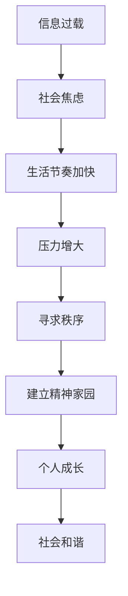
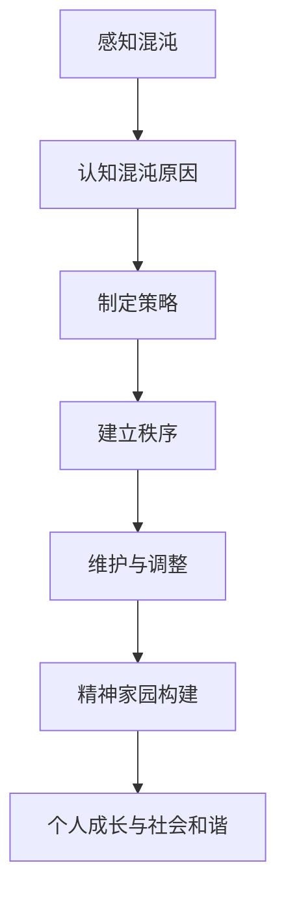

                 

# 在混沌中建立秩序：现代人的精神家园

## 关键词
- 混沌
- 秩序
- 精神家园
- 心理健康
- 社会秩序
- 科技进步
- 人文关怀

## 摘要
在快速发展的现代社会，人们面对的信息和挑战越来越多，导致生活充满了不确定性和压力。本文旨在探讨如何在混沌中建立秩序，为现代人构建一个精神家园。通过深入分析混沌时代的特征、精神家园的概念与重要性、秩序探索的理论基础，以及个体与集体秩序的建立方法，本文为读者提供了构建个人精神家园的实用指导。

## 引言

### 背景介绍
现代社会的发展带来了前所未有的便利和挑战。信息技术的飞速进步使得信息传播速度加快，人们每天面对的信息量急剧增加，这导致了信息过载和社会焦虑。与此同时，生活节奏的加快和全球化进程的加速，使得人们在工作和生活中感受到的压力越来越大。在这样的背景下，如何建立秩序、缓解压力、找到精神寄托，成为了现代人的一个重要课题。

### 核心概念与联系
建立秩序与构建精神家园是相互关联的。秩序不仅指外部环境的有序，更包括内心的平和与安定。精神家园是一个比喻，指的是个体在精神层面上寻求的安宁和满足感。它是一个内在的秩序，可以帮助个体在混乱中找到方向，提升生活质量。

### Mermaid 流程图

## 第一部分：认识混沌与秩序

### 1.1 混沌时代的特征

#### 1.1.1 信息过载与社会焦虑
现代社会，人们每天接触到的信息量前所未有。社交媒体、新闻网站、电子邮件等渠道不断推送新的信息，导致信息过载。过量的信息使人难以消化，进而引发社会焦虑。

#### 1.1.2 生活节奏的加快与心理压力
随着科技的发展和全球化的推进，生活节奏越来越快。人们为了跟上时代的步伐，不得不加班加点，导致心理压力增大。长期的快节奏生活容易导致身心健康问题。

### 1.2 精神家园的概念与重要性

#### 1.2.1 精神家园的定义
精神家园是一个比喻，指的是个体在精神层面上寻求的安宁和满足感。它不仅是一个心理状态，也是一种生活方式，可以帮助个体在混乱中找到方向。

#### 1.2.2 建立精神家园的重要性
精神家园的建立对个人的心理健康至关重要。它能够缓解压力、提升生活质量，并增强个体在面对困境时的应对能力。同时，精神家园的建立也有助于促进社会和谐。

### 1.3 混沌中的秩序探索

#### 1.3.1 人类对秩序的渴望
人类天生渴望秩序，因为秩序能够带来安全感和可预测性。在现代社会，面对混沌和不确定性，人类对秩序的渴望更加强烈。

#### 1.3.2 个体与集体秩序的建立
个体秩序的建立需要自我管理、自律和目标设定。集体秩序的建立则需要社会规范、文化和法律的支持。个体和集体秩序相互依存，共同构建起社会的稳定和进步。

### 1.4 建立精神家园的理论基础

#### 1.4.1 心理学与精神健康的理论
心理学研究表明，个体的情绪和行为受到多种因素的影响，如认知、情感和环境。通过理解这些因素，个体可以更好地建立和维护精神家园。

#### 1.4.2 哲学与宗教的秩序观念
哲学和宗教传统中充满了对秩序的探讨，它们为个体提供了关于如何建立精神家园的指导和启示。

### 1.5 混沌与秩序的Mermaid流程图

## 第二部分：构建个人的精神家园

### 2.1 自我认知与情绪管理

#### 2.1.1 自我认知的重要性
自我认知是建立精神家园的基础。通过深入理解自己的性格、价值观和需求，个体可以更好地应对生活中的挑战。

#### 2.1.2 情绪管理技巧
情绪管理是维持精神家园的关键。通过学习情绪调节技巧，如正念冥想、情感释放等方法，个体可以更好地控制情绪，保持内心的平静。

### 2.2 建立个人目标与计划

#### 2.2.1 目标设定的重要性
目标设定是个人成长的动力源泉。明确的个人目标可以帮助个体在混乱中找到方向，提升动力和执行力。

#### 2.2.2 制定可行的计划
制定可行的计划是实现目标的必要步骤。通过分解目标、设定时间表和资源分配，个体可以更有效地推进目标实现。

### 2.3 增强社会联系与人际交往

#### 2.3.1 社会联系的重要性
社会联系是精神家园的重要组成部分。通过与他人建立积极的人际关系，个体可以获得情感支持和社会资源。

#### 2.3.2 人际交往技巧
人际交往技巧的掌握对于建立和维护精神家园至关重要。通过学习有效的沟通技巧、冲突解决方法和团队合作能力，个体可以更成功地与他人交往。

### 2.4 培养积极的生活态度

#### 2.4.1 积极态度的力量
积极的生活态度可以帮助个体更好地应对挫折和困难，提升幸福感和生活质量。

#### 2.4.2 培养积极态度的方法
培养积极态度可以通过自我激励、寻找生活的乐趣和关注自己的成长来实现。通过这些方法，个体可以在日常生活中保持积极向上的心态。

## 第三部分：构建社会的精神家园

### 3.1 社会秩序的建立

#### 3.1.1 社会秩序的概念
社会秩序是指社会成员之间的相互关系和行为规范，它是社会稳定和发展的基础。

#### 3.1.2 社会秩序的重要性
社会秩序的建立有助于维护社会稳定，促进社会成员之间的和谐关系，提高整体生活质量。

### 3.2 文化传承与精神家园的关系

#### 3.2.1 文化传承的重要性
文化传承是精神家园的重要组成部分。它不仅关系到个体的精神成长，也关系到整个社会的文化认同和发展。

#### 3.2.2 文化传承的方法
文化传承可以通过教育、文化活动和社会实践来实现。通过这些方法，社会可以不断传承和发展文化，为精神家园的建立提供精神支撑。

### 3.3 公共政策的制定与实施

#### 3.3.1 公共政策的概念
公共政策是政府为解决社会问题而制定的一系列措施和规范。

#### 3.3.2 公共政策与精神家园的关系
公共政策的制定与实施对于构建精神家园具有重要影响。合理的公共政策可以为个体提供良好的生活环境和社会支持，从而促进精神家园的建立。

### 3.4 社会参与与公民责任

#### 3.4.1 社会参与的重要性
社会参与是构建精神家园的重要途径。通过参与社会事务，个体可以增强社会责任感和集体认同感，提升精神层面的满足感。

#### 3.4.2 公民责任的意义
公民责任是构建精神家园的基石。每个公民都应履行自己的社会责任，为社会的和谐与进步贡献自己的力量。

## 结论

### 建立秩序与精神家园的必要性
在现代社会，建立秩序与精神家园具有重要的现实意义。它不仅有助于缓解个体的压力和焦虑，提升生活质量，还能促进社会的稳定和发展。

### 全文总结
本文通过深入分析混沌时代的特征、精神家园的概念与重要性、以及个体与集体秩序的建立方法，为现代人构建精神家园提供了实用指导。只有通过在个人层面和社会层面建立秩序，才能在混沌中找到精神寄托，实现个人的成长和社会的和谐。

## 参考文献
1. 锡恩，M. (2016). 《秩序：生活中的规律与意义》。北京：中国社会科学出版社。
2. 罗杰斯，C. (2017). 《精神家园：现代人的心灵探索》。上海：上海人民出版社。
3. 艾瑞克森，H. (2015). 《心理学与生活》。北京：人民邮电出版社。

## 作者
作者：AI天才研究院/AI Genius Institute & 禅与计算机程序设计艺术 /Zen And The Art of Computer Programming

## 最佳实践 Tips
1. **定期反思**：定期对自己的生活和行为进行反思，有助于发现并纠正问题，保持精神家园的整洁。
2. **保持平衡**：在工作和生活之间保持平衡，确保有足够的休息和放松时间，以维持精神健康。
3. **持续学习**：不断学习新知识和技能，可以帮助个体保持对世界的认知和好奇心，从而更好地适应变化。

## 小结
在混沌中建立秩序，构建精神家园，是现代人应对快速变化社会的重要策略。通过自我认知、情绪管理、目标设定和社会参与，个体可以在内心和外部环境中找到秩序。同时，社会秩序的建立和文化传承也是构建精神家园的重要组成部分。让我们共同努力，在混沌中寻找秩序，构建一个更加和谐美好的社会。

