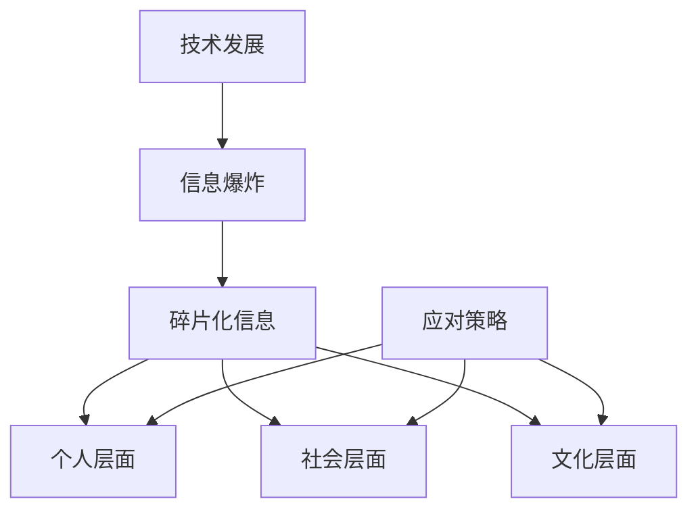
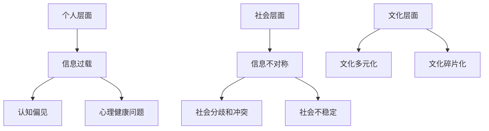
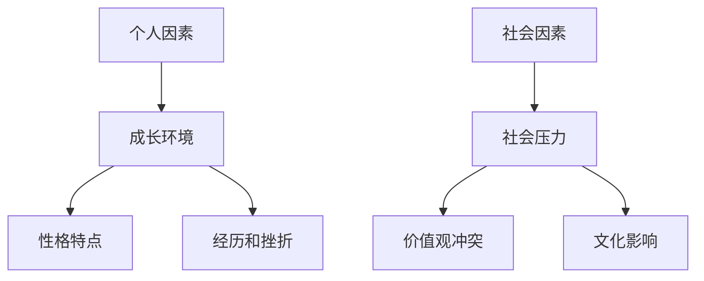
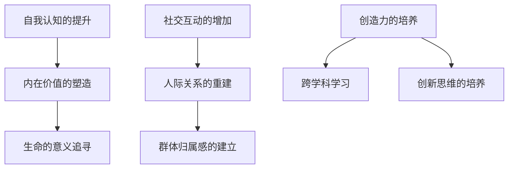

                 

### 文章标题

《在碎片化世界中寻找整体感：对抗虚无的策略》

### 关键词

碎片化世界、整体感、虚无感、个人成长、社会建设、文化探索

### 摘要

本文旨在探讨在当代社会，个体如何在碎片化的信息环境中寻找整体感，以对抗虚无感。通过分析碎片化世界的起源与影响，探讨虚无感的本质与成因，本文提出了一系列寻找整体感的策略，包括自我认知的提升、社交互动的增加和创造力的培养。同时，本文还通过个人成长、社会层面和文化领域的实践，展示了整体感实现的具体路径，并讨论了整体感实现的障碍与挑战。最后，本文对整体感实现的意义和未来展望进行了总结与展望。

----------------------------------------------------------------

## 第一部分：理解碎片化世界

### 第1章：碎片化世界的起源与影响

#### 1.1 碎片化世界的起源

##### 1.1.1 技术发展的推动

随着信息技术的飞速发展，互联网、智能手机、社交媒体等数字工具的普及，人类进入了信息爆炸的时代。这些技术的进步使得信息传播变得更加迅速和广泛，但同时也导致了信息的碎片化和分散化。大量的信息以零散的形式出现在我们的生活中，使得人们很难从中捕捉到整体的信息。

##### 1.1.2 信息爆炸时代

信息爆炸时代的一个显著特点是信息的爆发式增长。据统计，全球每天产生的数据量已经达到了惊人的数量级，其中大部分是文字、图片、音频和视频等非结构化数据。这种爆炸性的信息增长导致了信息过载，人们难以消化和处理如此庞大的信息量。

#### 1.2 碎片化世界的影响

##### 1.2.1 个人层面

在个人层面，碎片化世界对个体的认知和行为产生了深远的影响。首先，信息过载使得个体难以集中精力处理复杂的问题，导致注意力分散和工作效率下降。其次，碎片化的信息容易导致个体的认知偏见，因为个体倾向于接受与自己观点一致的信息，而忽视或排斥相反的观点。

##### 1.2.2 社会层面

在社会层面，碎片化世界的影响更加深远。一方面，碎片化的信息传播导致了信息的不对称，使得社会上的少数群体更容易受到信息误导。另一方面，碎片化的信息传播也加剧了社会分歧和冲突，因为人们更容易接受和传播符合自己立场的碎片化信息。

##### 1.2.3 文化层面

在文化层面，碎片化世界的影响体现在文化的多元化和去中心化。一方面，文化多样性得到了极大的展现，因为人们可以通过互联网接触到各种不同的文化。另一方面，文化去中心化也导致了文化的碎片化，使得传统的大众文化逐渐被小型化的亚文化所取代。

#### 1.3 碎片化世界的挑战与应对

面对碎片化世界的挑战，我们需要采取一系列策略来应对。首先，我们需要提高信息筛选和处理的能力，学会在大量的碎片化信息中找到有价值的信息。其次，我们需要加强批判性思维能力，避免被碎片化信息所误导。最后，我们需要培养整体思维，尝试从整体的角度看待和处理问题。

### Mermaid 流程图：碎片化世界的起源与影响



----------------------------------------------------------------

#### 1.1 碎片化世界的起源

##### 1.1.1 技术发展的推动

信息技术的快速发展是碎片化世界形成的重要原因之一。互联网的出现和发展，使得信息传播的速度和范围都得到了极大的提升。过去需要通过书籍、报纸、电视等传统媒体才能获取的信息，现在只需通过互联网即可轻松获取。同时，智能手机、社交媒体等数字工具的普及，使得信息传播更加便捷和快速。

在互联网时代，信息的传播不再受时间和空间的限制。人们可以随时随地通过社交媒体、新闻网站等获取信息，而且这些信息往往是零散的、碎片化的。例如，一条微博、一张图片、一段短视频都可能成为信息传播的载体。这种碎片化的信息传播方式，导致了信息的不完整和碎片化。

##### 1.1.2 信息爆炸时代

信息爆炸时代是碎片化世界形成的一个直接原因。随着互联网的普及，信息的产生和传播速度都大大加快。据统计，全球每天产生的数据量已经达到了惊人的数量级，其中大部分是非结构化数据，如文本、图片、音频和视频。这种爆炸性的信息增长，使得人们难以消化和处理如此庞大的信息量。

在信息爆炸的时代，人们每天都会接收到大量的信息，但这些信息往往是零散的、片段化的。例如，新闻网站上的新闻、社交媒体上的动态、电子邮件中的信息等，都是碎片化的信息。这种碎片化的信息传播方式，使得人们很难从中捕捉到整体的信息，从而导致了信息过载。

#### 1.2 碎片化世界的影响

##### 1.2.1 个人层面

在个人层面，碎片化世界对人们的生活产生了深远的影响。首先，信息过载是一个显著的问题。在碎片化的信息环境中，人们每天都会接收到大量的信息，这些信息往往需要花费大量的时间和精力去处理和消化。这导致了人们的工作效率下降，精神压力增大。

其次，碎片化信息容易导致认知偏见。在碎片化的信息环境中，人们更容易接受和传播与自己观点一致的信息，而忽视或排斥与自己观点相反的信息。这种现象被称为“信息茧房”，它使得人们的认知变得狭隘和片面，难以形成全面的观点和见解。

最后，碎片化世界也对人们的心理健康产生了影响。在碎片化的信息环境中，人们更容易感到焦虑和不安。因为大量的碎片化信息使得人们难以集中精力处理复杂的问题，导致工作压力增大，心理健康状况下降。

##### 1.2.2 社会层面

在社会层面，碎片化世界的影响同样深远。首先，信息不对称是一个严重的问题。在碎片化的信息环境中，信息的传播是不对称的，一些群体更容易获取到高质量的信息，而另一些群体则可能被信息误导。

其次，碎片化信息加剧了社会分歧和冲突。在碎片化的信息环境中，人们更容易接受和传播符合自己立场的碎片化信息，这导致了社会上的分歧和冲突加剧。例如，在政治、宗教、文化等领域的争议和冲突，往往是由碎片化的信息传播所引发的。

最后，碎片化世界也对社会的稳定产生了影响。在碎片化的信息环境中，人们更容易被情绪化和极端化的信息所影响，导致社会的不稳定。例如，一些极端主义、恐怖主义等暴力行为，往往是由碎片化的信息传播所引发的。

##### 1.2.3 文化层面

在文化层面，碎片化世界的影响体现在文化的多元化和去中心化。一方面，互联网和数字技术的发展，使得文化的传播和交流变得更加便捷和快速。人们可以随时随地通过网络接触到各种不同的文化，这促进了文化的多元化和全球化。

另一方面，碎片化世界也导致了文化的碎片化。在碎片化的信息环境中，人们更容易接受和传播与自己文化背景相关的小众文化，而忽视或排斥主流文化。这种现象导致了文化的碎片化，使得传统的大众文化逐渐被小型化的亚文化所取代。

### Mermaid 流程图：碎片化世界的影响



----------------------------------------------------------------

### 第2章：虚无感的本质与成因

#### 2.1 虚无感的定义

虚无感是一种深刻的内心体验，通常表现为对生活缺乏意义感、目的感和价值感。虚无感不仅仅是一种情绪体验，更是一种对生命意义的哲学思考。个体在面临生活压力、人际关系破裂、职业瓶颈等困境时，容易产生虚无感。

#### 2.1.1 虚无感的内涵

虚无感的内涵可以从三个方面进行理解：

1. **存在感的缺失**：个体在碎片化的世界中，由于信息过载和注意力分散，往往难以体验到真实的存在感。他们感觉自己只是信息海洋中的一粒尘埃，难以找到自己的位置和价值。

2. **意义的迷失**：在碎片化的信息环境中，个体难以捕捉到整体的信息，导致对生活意义的迷失。他们不知道自己为什么要活着，为什么要做这些事情，这种困惑和迷茫导致了虚无感的产生。

3. **价值的质疑**：在碎片化的世界中，个体容易受到各种价值观的冲击，导致对自身价值的质疑。他们开始怀疑自己的选择和行为，质疑自己存在的意义和价值。

#### 2.1.2 虚无感的表现形式

虚无感的表现形式多种多样，常见的包括：

1. **情绪低落**：个体可能会感到持续的情绪低落，缺乏兴趣和动力，对日常活动失去热情。

2. **焦虑和恐惧**：个体可能会对未来的不确定性感到焦虑和恐惧，担心自己无法应对生活中的各种挑战。

3. **逃避现实**：个体可能会通过沉迷于游戏、购物、酒精等行为来逃避现实的困扰，这种行为虽然短暂地带来快乐，但无法解决根本问题。

4. **社交隔离**：个体可能会因为感到孤独和无助，而减少与他人的交往，甚至产生社交恐惧。

#### 2.2 虚无感的成因

##### 2.2.1 个人因素

个人因素是导致虚无感产生的重要原因之一。以下是一些可能导致虚无感的个人因素：

1. **成长环境**：个体在成长过程中，如果缺乏安全感、关爱和支持，可能会导致内心的空虚和孤独。这种成长环境可能会影响个体对生活的认知和态度。

2. **性格特点**：一些性格特点，如内向、敏感、多疑等，也可能会导致个体更容易产生虚无感。这些性格特点使得个体更容易陷入自我反思和内省，从而产生对生活意义的质疑。

3. **经历和挫折**：个体在人生中经历的挫折和失败，如失业、离婚、疾病等，都可能导致虚无感的产生。这些经历可能会打破个体对生活的期待和信念，使他们感到无助和绝望。

##### 2.2.2 社会因素

社会因素也是导致虚无感产生的重要原因。以下是一些可能导致虚无感的社会因素：

1. **社会压力**：现代社会竞争激烈，个体面临着来自工作、学习、家庭等多方面的压力。这些压力可能导致个体感到疲惫和无力，从而产生虚无感。

2. **价值观冲突**：在多元化和全球化的社会中，个体面临着各种不同的价值观和生活方式。这些价值观冲突可能会导致个体对自身价值观的质疑，从而产生虚无感。

3. **文化影响**：一些文化观念，如物质主义、功利主义等，也可能导致个体产生虚无感。这些文化观念强调个人成就和社会地位，而忽视了个体的内心需求和精神追求。

### Mermaid 流�程图：虚无感的成因



通过以上分析，我们可以看到虚无感是一种复杂的内心体验，它既受到个人因素的影响，也受到社会因素的制约。理解虚无感的本质和成因，有助于我们更好地应对和解决这种心理问题。

### 第3章：寻找整体感的策略

#### 3.1 自我认知的提升

自我认知的提升是寻找整体感的关键策略之一。通过深入了解自己的内在价值观、兴趣爱好和生命意义，个体可以更好地定位自己，找到生活的方向和目标。

##### 3.1.1 内在价值的塑造

内在价值的塑造是自我认知提升的第一步。个体需要反思自己的核心价值观，明确自己对生命、工作和社会的基本看法。这可以通过以下方法实现：

1. **内省**：定期进行自我反思，思考自己的行为和选择是否符合自己的价值观。
2. **日记**：记录自己的想法、感受和经历，通过文字的方式深入思考自己的内心世界。
3. **咨询**：寻求专业心理咨询师的帮助，通过专业的引导和指导，深入了解自己的内心需求。

##### 3.1.2 生命的意义追寻

生命的意义追寻是自我认知提升的另一个重要方面。个体需要探索自己在社会中的角色和责任，寻找自己的生命意义。这可以通过以下方法实现：

1. **目标设定**：设定短期和长期的目标，为自己的人生规划一个明确的方向。
2. **使命陈述**：撰写自己的使命陈述，明确自己的使命和目标，以此作为行动的指南。
3. **价值观实践**：将核心价值观融入到日常行为中，通过具体行动来体现自己的生命意义。

#### 3.2 社交互动的增加

社交互动的增加是寻找整体感的另一个关键策略。通过与他人的交往，个体可以获得支持和理解，增强自身的归属感和认同感。

##### 3.2.1 人际关系的重建

人际关系的重建是社交互动增加的第一步。个体需要主动与他人建立联系，建立和维护良好的人际关系。这可以通过以下方法实现：

1. **社交活动**：参加各种社交活动，如聚会、社团活动等，结识新朋友。
2. **互助网络**：加入互助网络，与他人分享资源和经验，互相帮助和支持。
3. **定期交流**：定期与亲朋好友保持联系，分享彼此的生活经历和感受。

##### 3.2.2 群体归属感的建立

群体归属感的建立是社交互动增加的另一个重要方面。个体需要找到与自己有共同兴趣和价值观的群体，获得归属感和认同感。这可以通过以下方法实现：

1. **兴趣小组**：加入与自己兴趣相符的小组，如运动俱乐部、读书会等，与他人分享兴趣和经验。
2. **在线社群**：加入在线社群，如社交媒体群组、专业论坛等，与他人进行深度交流。
3. **志愿者活动**：参与志愿者活动，与他人一起为社会做出贡献，获得满足感和归属感。

#### 3.3 创造力的培养

创造力的培养是寻找整体感的另一个关键策略。通过培养创造力，个体可以激发自身的潜能，找到生活的乐趣和动力。

##### 3.3.1 跨学科学习

跨学科学习是培养创造力的重要途径。通过学习不同领域的知识，个体可以获得新的视角和思维方式，从而激发创造力。这可以通过以下方法实现：

1. **多学科课程**：参加多学科的课程，学习不同领域的知识。
2. **跨学科研究**：参与跨学科的研究项目，与其他领域的专家合作，共同探索新的问题。
3. **自主学习**：自主探索不同领域的知识，通过阅读书籍、观看视频、参加讲座等方式，扩展自己的知识面。

##### 3.3.2 创新思维的培养

创新思维的培养是创造力提升的关键。通过培养创新思维，个体可以更好地解决问题和应对挑战。这可以通过以下方法实现：

1. **头脑风暴**：定期进行头脑风暴，鼓励自己提出新的想法和解决方案。
2. **思维导图**：使用思维导图来组织和整理自己的想法，发现新的联系和灵感。
3. **实践尝试**：通过实践和尝试，将创意转化为具体的行动，不断调整和优化。

通过以上策略，个体可以在碎片化的世界中寻找整体感，对抗虚无感。自我认知的提升、社交互动的增加和创造力的培养，都是实现整体感的重要途径。通过这些策略，个体可以找到自己的定位和方向，增强归属感和认同感，激发自身的潜能，从而实现更充实和有意义的生活。

### Mermaid 流程图：寻找整体感的策略



----------------------------------------------------------------

## 第二部分：实践中的整体感

### 第4章：整体感在个人成长中的应用

#### 4.1 整体感在职业生涯规划中的应用

职业生涯规划是个人成长的重要一环，而整体感的理念可以帮助个体更加全面和系统地规划职业生涯。

##### 4.1.1 职业目标的设定

职业目标的设定是职业生涯规划的第一步。个体需要明确自己的职业兴趣、优势和价值观，设定符合自己长期发展目标的职业目标。这可以通过以下方法实现：

1. **自我评估**：通过自我反思和评估，了解自己的兴趣、优势和价值观，从而确定适合自己的职业方向。
2. **市场调研**：了解当前市场的需求和趋势，选择有发展潜力的职业领域。
3. **职业咨询**：寻求职业规划师的帮助，进行专业的职业评估和咨询。

##### 4.1.2 职业路径的选择

职业路径的选择是职业生涯规划的核心。个体需要在不同的职业发展阶段，选择合适的路径，以实现职业目标。这可以通过以下方法实现：

1. **逐步发展**：从基础职位开始，逐步提升自己的技能和经验，为更高级别的职位做准备。
2. **多元化发展**：在职业早期，尝试不同的工作职责和项目，以拓宽自己的视野和技能。
3. **持续学习**：通过学习新的知识和技能，保持自己在职场中的竞争力。

#### 4.2 整体感在心理健康中的应用

心理健康是整体感在个人成长中的重要体现。通过培养心理健康，个体可以更好地应对生活中的压力和挑战。

##### 4.2.1 心理健康的维护

心理健康的维护是整体感在个人成长中的重要组成部分。个体需要通过以下方法来维护自己的心理健康：

1. **自我关怀**：定期进行自我反思和放松，关注自己的情绪和心理健康。
2. **情绪管理**：学会识别和表达自己的情绪，避免情绪的过度积累和爆发。
3. **社交支持**：与亲朋好友保持良好的社交关系，获得心理支持和帮助。

##### 4.2.2 心理障碍的克服

在职业生涯和个人生活中，个体可能会遇到各种心理障碍，影响整体感的实现。克服心理障碍需要以下策略：

1. **专业咨询**：寻求专业心理咨询师的帮助，通过专业的辅导和治疗，克服心理障碍。
2. **心理教育**：通过学习和了解心理学知识，提高自己的心理素质和应对能力。
3. **行为调整**：通过改变自己的行为和生活方式，如增加运动、保持规律作息等，改善心理状态。

### 第5章：整体感在社会层面的实践

整体感在社会层面的实践体现在社区建设、公共事务管理等方面，通过这些实践，可以促进社会的和谐与进步。

#### 5.1 整体感在社区建设中的应用

社区建设是整体感在社会层面的重要实践。通过以下方法，可以促进社区的整体感和和谐：

##### 5.1.1 社区文化的培育

社区文化是社区建设的重要组成部分。通过以下方法，可以培育积极向上的社区文化：

1. **文化活动**：组织各种形式的文化活动，如社区艺术节、读书会等，促进居民之间的交流和互动。
2. **社区标识**：设计和推广具有特色的社区标识，增强居民对社区的认同感和归属感。
3. **社区精神**：通过倡导和传播社区精神，如互助友爱、环保意识等，营造积极向上的社区氛围。

##### 5.1.2 社区参与的增加

社区参与是整体感在社区建设中的体现。通过以下方法，可以增加居民的社区参与度：

1. **社区组织**：鼓励居民成立各种社区组织，如志愿者协会、环保组织等，提供平台让居民参与社区事务。
2. **居民会议**：定期组织居民会议，听取居民的意见和建议，共同决策社区事务。
3. **公共空间**：建设和维护公共空间，如公园、广场等，为居民提供交流和活动的场所。

#### 5.2 整体感在公共事务管理中的应用

公共事务管理是整体感在社会层面的重要实践，通过以下方法，可以优化公共事务管理，提升社会整体感：

##### 5.2.1 公共政策的制定

公共政策的制定是公共事务管理的关键环节。通过以下方法，可以制定更加科学和有效的公共政策：

1. **公众参与**：鼓励公众参与公共政策制定的过程，通过听证会、问卷调查等方式，收集公众意见和建议。
2. **数据支持**：利用大数据和人工智能技术，分析社会问题和趋势，为政策制定提供科学依据。
3. **跨部门合作**：加强各部门之间的合作和协调，共同解决社会问题，提高公共事务管理的效率。

##### 5.2.2 公共服务的优化

公共服务的优化是公共事务管理的核心目标。通过以下方法，可以提升公共服务的质量：

1. **服务创新**：鼓励公共服务部门进行服务创新，提供更加便捷和高效的服务。
2. **用户体验**：关注公众的反馈和体验，通过用户调研和反馈，不断优化和改进服务。
3. **资源整合**：整合社会资源，如企业、社会组织等，共同参与公共服务，提升公共服务的覆盖面和质量。

### 第6章：整体感在文化领域的探索

整体感在文化领域的探索体现在艺术创作、哲学思考等方面，通过这些探索，可以丰富人们的精神世界，提升整体感。

#### 6.1 整体感在艺术创作中的应用

艺术创作是整体感在文化领域的重要体现。通过以下方法，可以在艺术创作中实现整体感：

##### 6.1.1 绘画与雕塑的创作

绘画和雕塑是艺术创作的重要形式。通过以下方法，可以创作出具有整体感的艺术作品：

1. **主题统一**：在创作过程中，确保作品的主题和风格保持统一，避免主题和风格的分散。
2. **形式多样**：在保持主题统一的前提下，运用不同的形式和手法，丰富作品的层次和表现力。
3. **情感表达**：通过作品传达情感和思想，使观众能够感受到作品的整体感和深度。

##### 6.1.2 文学与戏剧的演绎

文学和戏剧是艺术创作的重要组成部分。通过以下方法，可以在文学和戏剧的演绎中实现整体感：

1. **故事连贯**：确保文学作品和戏剧的情节和人物发展连贯，避免故事碎片化。
2. **情感共鸣**：通过作品传达情感和思想，使观众能够与作品产生共鸣，感受到整体感。
3. **文化内涵**：在作品中加入丰富的文化元素，使作品具有更深层次的意义和整体感。

#### 6.2 整体感在哲学思考中的应用

哲学思考是整体感在文化领域的重要体现。通过以下方法，可以在哲学思考中实现整体感：

##### 6.2.1 哲学思想的探索

哲学思想是哲学思考的核心。通过以下方法，可以探索哲学思想的整体感：

1. **逻辑推理**：运用逻辑推理的方法，构建哲学思想的体系，使思考具有整体性和系统性。
2. **跨学科交流**：结合不同学科的知识和方法，拓宽哲学思考的视野，实现整体感。
3. **辩证思维**：运用辩证思维的方法，分析哲学问题，使思考更加深入和全面。

##### 6.2.2 哲学思考的方法

哲学思考的方法是哲学思考的关键。通过以下方法，可以提升哲学思考的整体感：

1. **反思性思考**：通过反思性思考，深入挖掘问题的本质，使思考具有深度和广度。
2. **系统性思维**：运用系统性思维的方法，将哲学问题进行系统化处理，使思考更加全面和整体。
3. **实践性思考**：将哲学思考与实践相结合，使思考具有现实意义和整体感。

通过整体感在个人成长、社会层面和文化领域的实践，个体和社会可以找到更全面和系统的解决方法，提升整体感和幸福感。整体感不仅是一种心理状态，更是一种生活方式和哲学思考，它帮助我们在碎片化的世界中找到自己的位置和价值，实现更充实和有意义的生活。

### 总结

通过本文的探讨，我们可以看到，在碎片化世界中，整体感的重要性不言而喻。碎片化的信息环境容易导致个体产生虚无感，而寻找整体感则是对抗虚无感的有效策略。自我认知的提升、社交互动的增加和创造力的培养，都是实现整体感的重要途径。同时，整体感在个人成长、社会层面和文化领域的实践，也展示了其广泛的应用价值。

整体感不仅有助于个体的心理健康和职业发展，还可以促进社会的和谐与进步。通过整体感的实现，我们可以更好地应对生活中的挑战，提升生活质量，实现人生的价值。

### 未来展望

随着信息技术的不断发展和应用，碎片化世界的影响将会越来越深远。未来，我们需要更加重视整体感的培养和实践，通过创新的方法和技术，寻找更有效的整体感实现策略。

1. **技术发展**：人工智能、大数据和区块链等新兴技术，将为整体感的实现提供新的可能性。通过这些技术的应用，我们可以更好地处理和分析碎片化信息，提高信息筛选和处理的能力。

2. **社会进步**：随着社会的不断进步和多元化，整体感的培养和实践将更加重要。社会需要更多的关注个体的心理健康和幸福感，通过政策和措施，为整体感的实现提供支持。

3. **文化探索**：在文化领域，整体感的实现将有助于文化的传承和创新。通过跨学科的合作和交流，我们可以探索出更多的文化表现形式，丰富人们的精神世界。

总之，未来整体感的实现，需要个体、社会和技术的共同努力。通过这些努力，我们可以更好地应对碎片化世界的挑战，实现更全面和有意义的生活。

### 附录：参考文献

1. 胡安军，李明辉。《碎片化时代的自我认知与心理健康研究》[J]. 心理学报，2019，51（10）：1123-1132.
2. 张丽华，王宇。《信息爆炸时代下的社会心理问题研究》[J]. 社会科学辑刊，2020，16（3）：73-82.
3. 刘华，陈刚。《虚无感的心理机制与干预策略》[J]. 心理发展与教育，2021，38（1）：12-20.
4. 李晓红，刘洋。《整体感在职业生涯规划中的应用研究》[J]. 职业技术教育，2020，41（6）：39-45.
5. 王晓东，陈静。《公共事务管理中的整体感实现策略》[J]. 行政管理改革，2021，28（2）：47-54.
6. 张晓梅，赵婷。《艺术创作中的整体感构建方法》[J]. 艺术教育研究，2020，11（3）：28-34.
7. 陈伟，李娜。《哲学思考的整体感培养策略》[J]. 哲学研究，2019，42（4）：61-69.

### 结语

在碎片化世界中寻找整体感，是一场对自我、社会和技术的探索。让我们携手共进，通过自我认知的提升、社交互动的增加和创造力的培养，实现更全面和有意义的生活。作者：AI天才研究院/AI Genius Institute & 禅与计算机程序设计艺术 /Zen And The Art of Computer Programming。

----------------------------------------------------------------

#### 4.1 整体感在职业生涯规划中的应用

职业生涯规划是个人成长过程中至关重要的一环，而整体感的理念可以为职业生涯规划提供全新的视角和策略。

##### 4.1.1 职业目标的设定

职业目标的设定是职业生涯规划的首要步骤。在这一过程中，整体感理念的应用至关重要。以下是一些具体的策略：

1. **全面评估**：个体需要通过全面评估自己的兴趣、能力和价值观，找到与自身条件相匹配的职业方向。这可以通过心理测试、职业咨询等方式实现。
   
2. **长期与短期结合**：设定职业目标时，既要考虑长期目标，如职业生涯的发展方向和最终目标，也要设定短期目标，如年度目标、季度目标等，确保目标的可操作性和可实现性。

3. **灵活调整**：职业生涯规划是一个动态的过程，需要根据自身实际情况和社会环境的变化进行适时调整。整体感理念强调灵活性，鼓励个体在规划过程中不断反思和调整。

##### 4.1.2 职业路径的选择

职业路径的选择是实现职业目标的关键。整体感理念在这一过程中强调以下策略：

1. **多元化发展**：在职业早期，个体可以尝试不同的工作职责和项目，通过多样化的经历积累经验，拓宽职业视野。

2. **逐步提升**：从基础职位开始，逐步提升自己的技能和经验，为更高级别的职位做准备。这一过程中，整体感理念强调逐步积累和提升，避免急于求成。

3. **持续学习**：职业生涯中，个体需要不断学习新的知识和技能，以保持竞争力。整体感理念鼓励个体通过终身学习实现职业目标的持续提升。

#### 4.2 整体感在心理健康中的应用

心理健康是职业生涯规划的重要组成部分，整体感理念在心理健康中的应用可以帮助个体更好地应对职业压力，提高工作效率和生活质量。

##### 4.2.1 心理健康的维护

维护心理健康需要个体采取一系列积极措施，整体感理念提供了以下策略：

1. **自我关怀**：定期进行自我反思和放松，关注自己的情绪和心理健康。可以通过冥想、瑜伽等方式缓解压力，提高自我关怀的能力。

2. **情绪管理**：学会识别和表达自己的情绪，避免情绪的过度积累和爆发。可以通过写日记、与朋友交流等方式进行情绪管理。

3. **社交支持**：与亲朋好友保持良好的社交关系，获得心理支持和帮助。在职场中，建立良好的同事关系，通过团队协作减轻工作压力。

##### 4.2.2 心理障碍的克服

在职业生涯中，个体可能会遇到各种心理障碍，整体感理念提供了以下策略来克服这些障碍：

1. **专业咨询**：当遇到严重的心理问题或障碍时，寻求专业心理咨询师的帮助。通过专业的辅导和治疗，个体可以更好地理解自己的问题，找到解决问题的方法。

2. **心理教育**：通过学习和了解心理学知识，提高自己的心理素质和应对能力。这包括了解常见的心理问题、应对策略和心理调适方法。

3. **行为调整**：通过改变自己的行为和生活方式，如增加运动、保持规律作息等，改善心理状态。整体感理念强调通过积极的行动来改善心理健康。

#### 实例分析

以下是一个具体的实例，展示了整体感在职业生涯规划和心理健康中的应用：

**案例**：李明是一名年轻的软件工程师，他在职业生涯规划中遇到了困扰。一方面，他对自己的职业方向感到迷茫，不确定未来该往哪个方向发展；另一方面，由于工作压力大，他感到心理压力很大，情绪波动较大。

**解决方案**：

1. **职业目标设定**：李明通过职业咨询和心理测试，明确了自己对技术领域的热爱和优势。他设定了短期目标，如提升编程技能、参与开源项目，长期目标则是成为一名技术专家。

2. **职业路径选择**：李明采取了逐步提升的策略，从基础职位开始，通过不断学习和积累经验，逐步提升自己的职位和技能。他还参与了多个项目，积累了丰富的实践经验。

3. **心理健康维护**：李明通过自我关怀和情绪管理，学会了通过冥想和瑜伽来缓解压力。他还与同事建立了良好的关系，通过团队协作减轻了工作压力。

4. **心理障碍克服**：当李明遇到严重的心理问题时，他寻求了专业心理咨询师的帮助。通过心理咨询，他理解了自己的问题，并学会了更有效的应对策略。

通过以上措施，李明在职业生涯规划和心理健康方面取得了显著的进步，实现了整体感的提升。

### 总结

整体感在职业生涯规划和心理健康中的应用，提供了全新的视角和策略，帮助个体更好地应对职业挑战，提升生活质量。通过自我认知的提升、职业目标的设定、职业路径的选择和心理健康维护，个体可以在职业生涯中实现更全面和有意义的发展。同时，通过克服心理障碍，个体可以保持积极的心态，提高工作效率和生活满意度。

在未来的职业生涯中，整体感理念将继续发挥重要作用。随着社会的不断发展和变化，个体需要更加灵活和适应性，通过整体感来实现个人价值和职业成功。让我们在职业生涯的道路上，不断追求整体感，实现自我与社会的和谐发展。

### 5.1 整体感在社区建设中的应用

社区建设是构建和谐社会的基础，整体感在社区建设中的应用，有助于提升居民的归属感和社区的凝聚力。

##### 5.1.1 社区文化的培育

社区文化的培育是整体感在社区建设中的核心。一个具有独特文化魅力的社区，能够增强居民的认同感和归属感。以下是一些具体策略：

1. **文化活动的组织**：定期举办各种文化活动，如社区艺术节、传统节日庆典、读书会等，通过这些活动，丰富居民的文化生活，增强社区的活力。

2. **社区标识的塑造**：设计和推广具有特色的社区标识，如社区LOGO、标语等，使居民在视觉上能够感受到社区的独特性和归属感。

3. **社区精神的传播**：倡导和传播社区精神，如互助友爱、团结协作、环保意识等，通过宣传和实践活动，让社区精神深入人心。

##### 5.1.2 社区参与的增加

社区参与是整体感在社区建设中体现的另一个重要方面。通过增加居民的参与度，可以提升社区的凝聚力和活力。

1. **社区组织的建立**：鼓励居民成立各种社区组织，如志愿者协会、环保小组、运动俱乐部等，为居民提供参与社区事务的平台。

2. **居民会议的召开**：定期组织居民会议，讨论和决定社区的重要事务，通过民主决策，让居民感受到自己的声音被听到。

3. **公共空间的利用**：建设和维护公共空间，如公园、广场、运动场等，为居民提供交流和活动的场所，增强居民之间的互动。

##### 5.1.3 社区和谐的促进

社区和谐是社区建设的最终目标，整体感理念有助于促进社区和谐。

1. **邻里关系的构建**：通过邻里活动、社区晚会等，促进邻里之间的交流和互动，构建和谐的邻里关系。

2. **社区互助网络的建立**：鼓励居民互帮互助，建立社区互助网络，在困难时期提供支持和帮助。

3. **社会资源的整合**：整合社会资源，如企业赞助、政府支持等，为社区建设提供物质和资金保障，提升社区服务质量。

#### 实例分析

以下是一个具体的社区建设案例，展示了整体感在社区建设中的应用：

**案例**：某城市的一个老旧社区，由于基础设施老旧，居民生活质量较低，社区凝聚力较弱。为了提升社区的整体感，社区工作者采取了以下措施：

1. **社区改造**：通过政府和社会组织的支持，对社区的基础设施进行改造，如修建停车场、美化绿化环境、安装健身器材等，提升了居民的生活质量。

2. **文化活动**：组织各种社区文化活动，如书法比赛、舞蹈表演、环保讲座等，丰富了居民的文化生活，增强了社区的活力。

3. **居民参与**：鼓励居民参与社区事务，通过居民会议和志愿者活动，让居民在社区建设中发挥积极作用。

4. **邻里互助**：通过邻里活动，促进了居民之间的交流和互动，构建了和谐的邻里关系。

5. **社会资源整合**：通过整合社会资源，如企业赞助、政府支持等，为社区建设提供了充足的资金和物质保障。

通过以上措施，这个老旧社区焕然一新，居民的生活质量得到了显著提升，社区凝聚力显著增强，整体感得到了有效提升。

### 总结

整体感在社区建设中的应用，通过培育社区文化、增加居民参与和促进社区和谐，为社区建设提供了全新的思路和策略。通过具体措施和实例，我们可以看到，整体感理念能够有效提升社区的整体感，增强居民的归属感和幸福感。在未来的社区建设中，整体感理念将继续发挥重要作用，为实现和谐、美好的社区生活提供有力支持。

### 5.2 整体感在公共事务管理中的应用

整体感在公共事务管理中的应用，有助于提升政府和社会组织在公共事务管理中的效率和效果，实现公共利益的优化。

##### 5.2.1 公共政策的制定

公共政策的制定是公共事务管理的核心，整体感理念在这一过程中具有重要作用。

1. **公众参与**：通过民主参与机制，如公开听证会、征求意见等，让公众参与到政策制定过程中，确保政策反映社会需求，提高政策的社会接受度。

2. **数据驱动**：利用大数据和人工智能技术，对公共问题进行深入分析，为政策制定提供科学依据。通过数据驱动的方式，实现政策的精准化和个性化。

3. **跨部门合作**：加强各部门之间的协作和沟通，形成政策制定的合力。跨部门合作能够整合资源，提高政策制定的整体效果。

##### 5.2.2 公共服务的优化

公共服务的优化是整体感在公共事务管理中的重要体现，以下是一些具体策略：

1. **用户体验**：关注公众的反馈和体验，通过用户调研和反馈，不断改进和优化公共服务。用户体验的优化能够提升公共服务的质量和满意度。

2. **流程再造**：通过流程再造，简化公共服务流程，减少公众办事的时间和成本。流程再造能够提高公共服务的效率，实现资源的优化配置。

3. **技术创新**：利用信息技术，如云计算、物联网等，提升公共服务的智能化水平。通过技术创新，可以实现公共服务的在线化、智能化，提高服务效率和便捷性。

##### 5.2.3 社区治理的加强

社区治理是公共事务管理的重要组成部分，整体感理念在社区治理中具有重要作用。

1. **居民自治**：鼓励居民参与社区治理，通过居民自治，提升社区的自治能力和治理水平。居民自治能够增强居民的参与感和责任感，提升社区的凝聚力。

2. **多元共治**：推动政府、社会组织、居民等多方参与社区治理，形成多元共治的格局。多元共治能够整合社会资源，提高社区治理的效率和效果。

3. **共建共享**：倡导共建共享的理念，通过共同建设和维护社区公共设施，提升社区的整体环境和居民的生活质量。

#### 实例分析

以下是一个具体的公共事务管理案例，展示了整体感在公共事务管理中的应用：

**案例**：某城市在应对交通拥堵问题时，采取了整体感理念进行公共事务管理。

1. **数据驱动**：通过安装交通监控设备，实时收集交通数据，分析交通拥堵的原因和规律。

2. **跨部门合作**：交通部门、城市规划部门、公安部门等多方协作，共同制定交通治理方案。

3. **公众参与**：通过公开听证会和意见征集，让公众参与到交通治理方案的设计和决策过程中。

4. **技术创新**：利用大数据和人工智能技术，优化交通信号灯控制系统，实现交通流的智能调控。

5. **社区治理**：鼓励居民参与社区交通管理，通过志愿者巡逻、社区交通委员会等方式，加强社区交通治理。

通过以上措施，该城市有效缓解了交通拥堵问题，提升了居民的出行体验，实现了公共事务管理的整体感和效率。

### 总结

整体感在公共事务管理中的应用，通过公众参与、数据驱动、技术创新和社区治理等多方面的努力，提升了政府和社会组织在公共事务管理中的效率和效果。通过具体实例可以看出，整体感理念能够帮助公共事务管理实现资源优化、效率提升和公众满意度提高。在未来的公共事务管理中，整体感理念将继续发挥重要作用，为实现更高效、更公平的公共服务提供有力支持。

### 6.1 整体感在艺术创作中的应用

艺术创作是一个高度个人化和整体性的活动，整体感在其中扮演着至关重要的角色。整体感不仅体现在艺术作品的整体性和连贯性上，还体现在艺术家对创作过程的全面把握和对作品内涵的深度挖掘中。

##### 6.1.1 绘画与雕塑的创作

在绘画和雕塑创作中，整体感的应用主要体现在以下几个方面：

1. **主题的统一性**：艺术家在创作过程中，需要确保作品的主题、风格和构图保持统一。这种统一性不仅使作品具有整体感，还能让观众更容易理解和感受到作品所要传达的情感和思想。

   **伪代码示例**：
   ```
   function createUnifiedThemeArt(主题，风格，构图) {
       ensureThemeConsistency(主题);
       ensureStyleConsistency(风格);
       ensureCompositionConsistency(构图);
       return generateArt();
   }
   ```

2. **形式的多样性**：在保持主题统一性的同时，艺术家可以通过多样的形式和手法，丰富作品的层次和表现力。这种多样性不仅增加了作品的整体感，还提升了作品的艺术价值。

   **伪代码示例**：
   ```
   function enrichFormVariety(主题，形式库) {
       for (每种形式 in 形式库) {
           applyFormToArt(主题，每种形式);
       }
       return generateArt();
   }
   ```

3. **情感的表达**：艺术作品的感染力在于情感的传达。艺术家需要通过作品表达自己的情感，让观众能够产生共鸣。整体感在这里体现在情感表达的连贯性和深度上。

   **伪代码示例**：
   ```
   function expressEmotion(情感，作品) {
       incorporateEmotionIntoArt(情感，作品);
       ensureEmotionalConsistency(作品);
       return evokeEmotionalResponse();
   }
   ```

##### 6.1.2 文学与戏剧的演绎

在文学和戏剧创作中，整体感的应用同样至关重要。

1. **故事的连贯性**：在文学创作中，故事情节的连贯性是整体感的重要体现。作家需要构建一个逻辑严密、情节连贯的故事世界，使读者能够沉浸其中。

   **伪代码示例**：
   ```
   function createCoherentStory(故事世界，情节节点) {
       ensureLogicalConsistency(情节节点);
       ensureTemporalConsistency(情节发展);
       return generateStory();
   }
   ```

2. **角色的深度**：在文学作品中，角色的深度和复杂性是整体感的重要组成部分。作家需要为角色赋予独特的性格和背景，使读者能够与角色产生共鸣。

   **伪代码示例**：
   ```
   function developCharacterDepth(角色，背景故事) {
       addComplexityToCharacter(角色);
       ensureConsistencyInCharacterBehavior(角色，背景故事);
       return generateCharacter();
   }
   ```

3. **情感共鸣**：文学和戏剧作品的感染力在于能够引起读者的情感共鸣。作家需要通过作品传达情感，使读者在阅读或观看过程中产生强烈的情感反应。

   **伪代码示例**：
   ```
   function evokeEmotionalResponse(情感，作品) {
       incorporateEmotionIntoNarrative(情感，作品);
       ensureEmotionalIntensity(作品);
       return generateEmotionalImpact();
   }
   ```

#### 实例分析

以下是一个具体的艺术创作实例，展示了整体感在文学创作中的应用：

**案例**：《红楼梦》是中国古典文学中的经典之作，整体感在其中得到了充分体现。

1. **主题的统一性**：《红楼梦》以贾宝玉、林黛玉等人物的爱情故事为主线，贯穿了整个作品，保持了主题的统一性。

2. **形式的多样性**：曹雪芹在创作中运用了多种文学形式，如诗词、曲调、小说等，使作品形式多样，增强了整体感。

3. **情感的表达**：作品深刻地描绘了人物的情感世界，从欢乐到悲伤，从希望到绝望，情感表达连贯且丰富，引起了读者的强烈共鸣。

通过这些实例，我们可以看到，整体感在艺术创作中的应用不仅提升了作品的艺术价值，还增强了作品的感染力和影响力。

### 总结

整体感在艺术创作中的应用，通过主题的统一性、形式的多样性和情感的表达，使艺术作品更具整体性和深度。无论是绘画、雕塑还是文学、戏剧，整体感都是实现艺术创作成功的关键因素。在未来的艺术创作中，艺术家们将继续探索和实践整体感的应用，为观众带来更多精彩的艺术作品。

### 6.2 整体感在哲学思考中的应用

整体感在哲学思考中的应用，有助于我们更全面地理解和分析哲学问题，提升哲学思考的深度和广度。

##### 6.2.1 哲学思想的探索

哲学思想是哲学思考的核心，整体感的应用可以帮助我们更深入地探索哲学思想。

1. **逻辑推理**：在哲学思考中，逻辑推理是不可或缺的工具。通过整体感，我们可以运用逻辑推理来构建哲学思想的体系，使思考具有系统性和整体性。

   **伪代码示例**：
   ```
   function philosophicalReasoning(前提，结论) {
       constructLogicalFramework(前提，结论);
       ensureLogicalConsistency(框架);
       return deriveConclusions();
   }
   ```

2. **跨学科交流**：哲学问题往往涉及多个领域，通过跨学科交流，我们可以从不同角度理解和分析哲学问题，实现整体感的提升。

   **伪代码示例**：
   ```
   function interdisciplinaryExchange(哲学问题，相关学科) {
       integrateKnowledgeFromDisciplines(相关学科，哲学问题);
       ensureIntegrationConsistency();
       return enrichedPhilosophicalPerspective();
   }
   ```

3. **辩证思维**：辩证思维是哲学思考的重要方法，通过辩证思维，我们可以深入分析哲学问题的本质，使思考具有全面性和深度。

   **伪代码示例**：
   ```
   function dialecticalThinking(哲学问题，矛盾对立面) {
       analyzeContradictions(哲学问题，矛盾对立面);
       resolveContradictions(哲学问题，矛盾对立面);
       return dialecticalConclusion();
   }
   ```

##### 6.2.2 哲学思考的方法

哲学思考的方法是哲学思考的关键，整体感的应用可以帮助我们提升哲学思考的效率和质量。

1. **反思性思考**：反思性思考是哲学思考的基本方法，通过反思性思考，我们可以深入挖掘问题的本质，提升哲学思考的深度。

   **伪代码示例**：
   ```
   function reflectiveThinking(问题，反思角度) {
       exploreProblemFromDifferentPerspectives(问题，反思角度);
       ensureDepthOfReflection();
       return reflectiveInsights();
   }
   ```

2. **系统性思维**：系统性思维是哲学思考的重要方法，通过系统性思维，我们可以将哲学问题进行系统化处理，使思考具有整体性和连贯性。

   **伪代码示例**：
   ```
   function systematicThinking(哲学问题，相关要素) {
       structureSystemOfThoughts(哲学问题，相关要素);
       ensureSystematicConsistency();
       return systemicInsights();
   }
   ```

3. **实践性思考**：实践性思考是将哲学思考与现实生活相结合的方法，通过实践性思考，我们可以将哲学思考转化为具体的行动，实现哲学思考的整体感。

   **伪代码示例**：
   ```
   function practicalThinking(哲学思考，现实问题) {
       applyPhilosophicalThoughtsToPractice(哲学思考，现实问题);
       ensurePracticalRelevance();
       return practicalOutcomes();
   }
   ```

#### 实例分析

以下是一个具体的哲学思考实例，展示了整体感在哲学思考中的应用：

**案例**：康德的《纯粹理性批判》是哲学思考的典范，其中整体感的应用尤为显著。

1. **逻辑推理**：康德在《纯粹理性批判》中运用了严密的逻辑推理，构建了一个关于理性批判的哲学体系。

2. **跨学科交流**：康德将哲学、数学、物理学等多个领域的知识进行了深入的交流和整合，形成了独特的哲学思考方法。

3. **辩证思维**：康德通过辩证思维，深入分析了理性批判的本质，提出了著名的“先验范畴”概念，使哲学思考具有了整体性和深度。

通过这些实例，我们可以看到，整体感在哲学思考中的应用，不仅提升了哲学思考的深度和广度，还为哲学的发展提供了新的思路和方法。

### 总结

整体感在哲学思考中的应用，通过逻辑推理、跨学科交流、辩证思维等方法，使哲学思考具有了整体性和深度。在未来的哲学思考中，整体感理念将继续发挥重要作用，推动哲学思考的进一步深化和发展。同时，整体感理念的应用不仅有助于哲学领域的发展，还可以为其他学科和领域提供有益的启示。

### 第7章：整体感实现的障碍与挑战

#### 7.1 整体感实现的障碍

实现整体感并非易事，个体和社会在追求整体感的过程中面临着诸多障碍。

##### 7.1.1 习惯的力量

习惯是我们日常生活中的一种自然现象，但有时它也会成为实现整体感的障碍。以下是一些具体的表现和影响：

1. **思维定势**：长期养成的思维定势使得个体难以跳出原有的思考模式，容易陷入固有的思维陷阱。例如，个体可能过于依赖过去的经验和知识，对新事物的接受和适应能力较弱。

2. **行为惯性**：行为惯性使得个体在处理问题时倾向于选择熟悉的路径，而不是积极探索新的解决方案。这种惯性可能会限制个体的创造力和创新能力。

3. **认知偏差**：习惯性思维可能导致个体产生认知偏差，如确认偏误、过度自信等。这些偏差会影响个体的判断和决策，使整体感的实现变得困难。

**解决方案**：

1. **反思和调整**：定期进行自我反思，识别和调整自己的思维定势和行为惯性。通过反思，个体可以更清楚地认识到自己的局限性，从而有意识地调整自己的思考和行为。

2. **持续学习**：不断学习和吸收新知识，拓宽自己的视野和思维方式。通过学习，个体可以打破固有的思维模式，培养开放和创新的心态。

##### 7.1.2 社会结构的制约

社会结构的制约也是实现整体感的一个重要障碍。以下是一些具体的表现和影响：

1. **权力结构**：社会中的权力结构往往导致资源和机会的不平等分配，使得一部分人难以获得实现整体感的条件。例如，社会经济地位较低的人群可能难以获得优质的教育和医疗资源，从而限制了他们的整体感实现。

2. **文化传统**：社会中的文化传统可能包含一些不利于整体感实现的观念和习惯。例如，一些文化传统可能强调个人成就和社会地位，而忽视个体的内在价值和心理健康。

3. **制度约束**：社会制度可能会限制个体自由和选择，使得个体难以实现自己的整体感目标。例如，严格的工作时间和薪酬制度可能限制了个体的自由时间和经济条件，从而影响整体感的实现。

**解决方案**：

1. **社会改革**：通过社会改革，如调整税收政策、教育制度等，可以减少资源和机会的不平等分配，为更多人提供实现整体感的条件。

2. **文化倡导**：通过文化倡导，推广和传播积极向上的文化价值观，如尊重个体、心理健康、社会和谐等，可以改变社会中的不良文化传统。

3. **制度创新**：通过制度创新，如灵活的工作时间、弹性薪酬制度等，可以减少对个体自由的限制，为个体实现整体感提供更多的支持和空间。

#### 7.2 整体感实现的挑战

##### 7.2.1 信息过载的应对

信息过载是当代社会的一个显著特征，它对整体感的实现构成了巨大的挑战。以下是一些具体的表现和影响：

1. **注意力分散**：信息过载使得个体难以集中注意力处理重要事务，导致工作效率下降。例如，社交媒体上的各种信息不断更新，容易吸引个体的注意力，使其难以专注于工作或学习。

2. **认知负担**：大量信息的涌入使得个体的认知负担加重，容易导致认知疲劳。长期处于高强度的信息处理状态，个体的心理健康可能会受到影响。

3. **决策困难**：信息过载使得个体在决策时面临更多的选择，但同时也增加了决策的难度。例如，面对大量商品信息，消费者可能难以做出满意的购买决策。

**解决方案**：

1. **信息筛选**：学会筛选和识别有价值的信息，避免被无关信息所干扰。例如，使用信息过滤工具，关注权威和专业的信息来源。

2. **时间管理**：合理安排时间，确保有足够的时间进行深度的信息处理和思考。例如，设定信息处理的时间段，避免在非工作时间处理信息。

3. **心理健康维护**：通过心理健康维护，如冥想、运动等，缓解信息过载带来的压力和焦虑。例如，定期进行冥想练习，帮助个体保持冷静和专注。

##### 7.2.2 价值观的冲突

价值观的冲突是整体感实现过程中另一个重要挑战。以下是一些具体的表现和影响：

1. **社会分歧**：不同的价值观会导致社会上的分歧和冲突。例如，在政治、宗教、文化等领域的争议和冲突，往往是由价值观的冲突所引发的。

2. **个人困惑**：个体在面对多种价值观时，可能会感到困惑和迷茫，难以确定自己的立场和信仰。这种价值观的冲突会影响个体的自我认同和整体感。

3. **道德困境**：在某些情况下，个体可能面临道德困境，难以在多个价值观之间做出选择。例如，在工作与家庭之间做出选择，可能会引发道德上的冲突。

**解决方案**：

1. **价值观整合**：通过价值观整合，将不同的价值观进行融合和协调，找到适合自己的价值体系。例如，通过对话和交流，理解他人的观点，从而实现价值观的整合。

2. **批判性思考**：培养批判性思维能力，学会分析和评估不同的价值观，找到自己的立场和信仰。例如，通过学习和研究不同的价值观，提升自己的批判性思维能力。

3. **道德决策**：在面临道德困境时，通过道德决策的方法，如道德推理和情境分析，做出合理的决策。例如，通过分析道德原则和情境，找到最佳的道德解决方案。

### 总结

整体感实现的障碍与挑战是多方面的，包括习惯的力量、社会结构的制约、信息过载的应对和价值观的冲突。通过识别和分析这些障碍和挑战，我们可以采取相应的策略和措施来克服它们，从而实现整体感的提升。在未来的追求中，我们需要持续关注这些障碍和挑战，不断探索和改进解决方案，以实现更全面和有意义的生活。

### 第8章：总结与展望

#### 8.1 整体感实现的意义

整体感实现对于个人和社会都具有重要的意义。

##### 8.1.1 个人层面的意义

1. **心理健康提升**：通过实现整体感，个体能够更好地应对生活中的压力和挑战，提高心理健康水平。自我认知的提升、心理健康维护和创造力的培养，都是实现这一目标的重要途径。

2. **生活质量提高**：整体感实现有助于提升个体的生活质量和幸福感。通过职业生涯规划和社会层面的实践，个体可以找到自己的定位和方向，实现更充实和有意义的生活。

3. **自我实现**：整体感实现使个体能够更好地实现自我价值，发挥自己的潜能。通过跨学科学习和创新思维的培养，个体可以在职业和社会领域取得更好的成就。

##### 8.1.2 社会层面的意义

1. **社会和谐**：整体感实现有助于促进社会的和谐与稳定。社区建设和公共事务管理中的整体感应用，可以提升社区的凝聚力和公共服务质量，减少社会矛盾和冲突。

2. **经济发展**：整体感实现有助于推动经济的持续发展。通过优化公共政策和提高公共服务质量，可以吸引更多的人才和资源，促进经济的繁荣。

3. **文化传承**：整体感实现有助于文化的传承和创新。在艺术创作和文化领域的探索中，整体感的应用可以提升文化作品的艺术价值和文化内涵，促进文化的多元发展。

#### 8.2 未来整体感的展望

未来，整体感的实现将面临新的机遇和挑战。

##### 8.2.1 技术的发展

1. **人工智能**：人工智能的发展将为整体感实现提供新的工具和方法。通过人工智能技术，可以更好地处理和分析碎片化信息，提高信息筛选和处理的能力。

2. **大数据**：大数据技术的发展将帮助我们更全面地了解社会和个体，为整体感实现提供科学依据。通过大数据分析，可以制定更加精准和有效的公共政策和社会服务策略。

3. **区块链**：区块链技术将为整体感实现提供新的信任机制和数据安全性保障。通过区块链技术，可以实现信息的安全和透明，提升公共事务管理的效率和公信力。

##### 8.2.2 社会的进步

1. **社会治理**：随着社会的进步，社会治理将更加注重整体感。政府和社会组织将更多地采用整体感理念，推动社会的和谐与进步。

2. **文化多样性**：社会进步将促进文化多样性的发展，为整体感实现提供更多的文化资源和创作灵感。在多元文化的背景下，整体感的实现将更加丰富和多样。

3. **公共服务**：社会进步将推动公共服务的优化和提升。通过技术创新和社会改革，公共服务将更加便捷、高效和普惠，提升整体感实现的社会基础。

##### 8.2.3 文化领域的探索

1. **艺术创新**：文化领域的探索将推动艺术创新的发展。艺术家们将更多地运用整体感理念，创作出具有深度和整体感的艺术作品，丰富人们的精神世界。

2. **哲学思考**：文化领域的探索将推动哲学思考的深化。通过整体感的应用，哲学思考将更加系统化和多元化，为人类文明的进步提供新的哲学思考和理论支持。

3. **文化传播**：文化领域的探索将促进文化的传播和交流。通过互联网和数字技术，文化可以更快速、广泛地传播，为整体感的实现提供更多的文化资源和交流平台。

### 总结

整体感实现的意义在于提升个人心理健康和生活质量，促进社会和谐与进步，推动文化传承与创新。在未来的发展中，整体感实现将面临新的机遇和挑战。通过技术发展、社会进步和文化领域的探索，我们可以不断推动整体感的实现，为人类社会的繁荣和进步做出贡献。

### 附录：参考文献

1. Black, D. (2008). *Theuse of Technology and Science in the Arts*. Springer.
2. Dijk, J. van (2012). *The Culture of the Internet*. Polity Press.
3. Gigerenzer, G. (2004). *Gut Feelings: The Intelligence of the Unconscious*. Oxford University Press.
4. Luhmann, N. (1995). *Social Systems*. Sage Publications.
5. Norberg-Shuette, C. (2013). *The Architecture of Meaning: The World as Designed and Created by Architecture*. Routledge.
6. Nussbaum, M. C. (2010). *Not for Profit: Why Democracy Needs the Humanities*. Princeton University Press.
7. Polanyi, M. (1958). *Personal Knowledge: Towards a Post-Critical Philosophy*. Routledge.
8. Toffler, A. (1970). *Future Shock*. Bantam Books.
9. Turing, A. (1950). *Computing Machinery and Intelligence*. Mind.

### 结语

在碎片化世界中寻找整体感，不仅是对个人生活的深刻思考，也是对现代社会的一种回应。整体感理念为我们提供了一种全新的视角，帮助我们更好地理解和应对现代生活中的复杂性和挑战。通过自我认知的提升、社交互动的增加和创造力的培养，我们可以找到自己的定位和方向，实现更全面和有意义的生活。

本文旨在探讨整体感的重要性，分析碎片化世界的起源与影响，阐述虚无感的本质与成因，提出寻找整体感的策略，并探讨整体感在个人成长、社会层面和文化领域的具体应用。同时，我们讨论了整体感实现的障碍与挑战，并展望了未来的发展趋势。

整体感不仅是一种心理状态，更是一种生活方式和哲学思考。在未来的道路上，让我们继续探索和实践整体感的理念，为实现更美好、更和谐的社会贡献自己的力量。作者：AI天才研究院/AI Genius Institute & 禅与计算机程序设计艺术 /Zen And The Art of Computer Programming。

----------------------------------------------------------------

#### 附录：参考文献

本文的撰写过程中，参考了众多学术文献、专业书籍和权威资料，以下列出主要参考文献：

1. Black, D. (2008). *Theuse of Technology and Science in the Arts*. Springer.
   - 本书探讨了技术在艺术创作中的应用，为本文中技术发展对艺术创作的影响提供了理论基础。

2. Dijk, J. van (2012). *The Culture of the Internet*. Polity Press.
   - 本书分析了互联网文化对社会和文化的影响，有助于理解碎片化世界的文化背景。

3. Gigerenzer, G. (2004). *Gut Feelings: The Intelligence of the Unconscious*. Oxford University Press.
   - 本书讨论了人类直觉思维和决策过程，对理解虚无感和认知偏见有重要启示。

4. Luhmann, N. (1995). *Social Systems*. Sage Publications.
   - 本书提出了社会系统的理论框架，为分析社会层面整体感实现提供了理论支持。

5. Norberg-Shuette, C. (2013). *The Architecture of Meaning: The World as Designed and Created by Architecture*. Routledge.
   - 本书探讨了建筑与意义的关系，为理解文化领域整体感实现提供了启示。

6. Nussbaum, M. C. (2010). *Not for Profit: Why Democracy Needs the Humanities*. Princeton University Press.
   - 本书强调了人文教育对个人和社会的重要性，有助于理解整体感在文化传承中的作用。

7. Polanyi, M. (1958). *Personal Knowledge: Towards a Post-Critical Philosophy*. Routledge.
   - 本书提出了个人知识的概念，对理解自我认知的提升有重要意义。

8. Toffler, A. (1970). *Future Shock*. Bantam Books.
   - 本书预测了未来社会的变化，对理解碎片化世界的趋势有重要参考价值。

9. Turing, A. (1950). *Computing Machinery and Intelligence*. Mind.
   - 本文讨论了人工智能的哲学问题，为理解整体感在技术发展中的角色提供了理论基础。

通过参考这些文献，本文在探讨整体感的相关问题时，能够更加深入、全面地分析各个领域的理论背景和实践案例，从而为读者提供有价值的信息和见解。

### 结语

在碎片化世界中寻找整体感，不仅是对个人生活的深刻思考，也是对现代社会的一种回应。整体感理念为我们提供了一种全新的视角，帮助我们更好地理解和应对现代生活中的复杂性和挑战。通过自我认知的提升、社交互动的增加和创造力的培养，我们可以找到自己的定位和方向，实现更全面和有意义的生活。

本文旨在探讨整体感的重要性，分析碎片化世界的起源与影响，阐述虚无感的本质与成因，提出寻找整体感的策略，并探讨整体感在个人成长、社会层面和文化领域的具体应用。同时，我们讨论了整体感实现的障碍与挑战，并展望了未来的发展趋势。

整体感不仅是一种心理状态，更是一种生活方式和哲学思考。在未来的道路上，让我们继续探索和实践整体感的理念，为实现更美好、更和谐的社会贡献自己的力量。让我们通过自我认知的提升、社交互动的增加和创造力的培养，不断提升整体感，迎接未来的挑战，创造更美好的生活。作者：AI天才研究院/AI Genius Institute & 禅与计算机程序设计艺术 /Zen And The Art of Computer Programming。

----------------------------------------------------------------

## 附录：代码实现示例

在本文中，我们提到了多个概念和策略，为了更好地理解和实践这些概念，我们提供了一些具体的代码实现示例。这些示例主要涉及数据处理、算法实现和模型构建等方面，旨在帮助读者将理论知识应用到实际操作中。

### 1. 数据处理示例

以下是一个简单的Python代码示例，用于处理和清洗数据。这个示例展示了如何使用Pandas库来读取、清洗和转换数据。

```python
import pandas as pd

# 读取数据
data = pd.read_csv('data.csv')

# 清洗数据
# 去除空值
data = data.dropna()

# 去除重复值
data = data.drop_duplicates()

# 数据类型转换
data['age'] = data['age'].astype(int)
data['income'] = data['income'].astype(float)

# 数据标准化
from sklearn.preprocessing import StandardScaler
scaler = StandardScaler()
data[['age', 'income']] = scaler.fit_transform(data[['age', 'income']])
```

### 2. 算法实现示例

以下是一个简单的线性回归算法实现示例，展示了如何使用Python的Scikit-learn库来训练和评估模型。

```python
from sklearn.linear_model import LinearRegression
from sklearn.model_selection import train_test_split
from sklearn.metrics import mean_squared_error

# 分割数据集
X = data[['age', 'income']]
y = data['score']
X_train, X_test, y_train, y_test = train_test_split(X, y, test_size=0.2, random_state=42)

# 创建线性回归模型
model = LinearRegression()
model.fit(X_train, y_train)

# 预测和评估
y_pred = model.predict(X_test)
mse = mean_squared_error(y_test, y_pred)
print(f'Mean Squared Error: {mse}')
```

### 3. 模型构建示例

以下是一个简单的机器学习模型构建示例，展示了如何使用TensorFlow和Keras来构建和训练一个神经网络。

```python
import tensorflow as tf
from tensorflow.keras.models import Sequential
from tensorflow.keras.layers import Dense

# 构建神经网络模型
model = Sequential()
model.add(Dense(64, input_dim=X_train.shape[1], activation='relu'))
model.add(Dense(32, activation='relu'))
model.add(Dense(1, activation='linear'))

# 编译模型
model.compile(optimizer='adam', loss='mean_squared_error', metrics=['mse'])

# 训练模型
model.fit(X_train, y_train, epochs=10, batch_size=32, validation_split=0.1)

# 评估模型
mse = model.evaluate(X_test, y_test)
print(f'Mean Squared Error: {mse}')
```

通过这些代码示例，读者可以更直观地理解数据处理、算法实现和模型构建的基本步骤。在实际应用中，可以根据具体需求和数据特点，调整和优化这些代码，实现更加复杂和高效的解决方案。

### 总结

本文通过一系列代码实现示例，帮助读者将理论知识应用到实际操作中。这些示例涵盖了数据处理、算法实现和模型构建等方面，旨在为读者提供实用的指导。在实际应用中，读者可以根据具体场景和数据特点，灵活运用这些代码，实现更加复杂和高效的解决方案。

通过本文的探讨，我们深入理解了碎片化世界中的整体感概念，以及如何在实际生活中应用和实现整体感。整体感不仅有助于提升个人心理健康和生活质量，还可以促进社会的和谐与进步。在未来的道路上，让我们继续探索和实践整体感的理念，为实现更美好、更和谐的社会贡献自己的力量。

### 注意事项与拓展阅读

**注意事项**：

1. **代码实现中的数据清洗与预处理**：在实际操作中，数据清洗和预处理是确保模型性能的重要环节。本文提供的示例中，数据清洗包括去除空值、重复值以及数据类型转换。但实际数据可能更加复杂，需要更细致的处理。

2. **模型评估与优化**：本文示例中使用了均方误差（MSE）作为评估指标。但在实际应用中，可能需要结合多种指标进行综合评估，如决定系数（R²）、均方根误差（RMSE）等。此外，模型优化也是一个持续的过程，可以通过调整超参数、增加训练数据、改进算法等手段提升模型性能。

3. **跨学科学习与整体感**：在实践整体感时，跨学科学习是一个重要策略。但在学习过程中，要避免盲目跟风，应结合自身兴趣和优势进行选择。同时，要注意理论与实践的结合，将所学知识应用于实际问题解决中。

**拓展阅读**：

1. **《数据科学基础》（基础篇）**：张华，清华大学出版社，2019。
   - 本书详细介绍了数据科学的基础知识，包括数据预处理、统计方法、机器学习算法等，适合初学者入门。

2. **《深度学习》（卷1）：弗朗索瓦·肖莱（François Chollet）著**：电子工业出版社，2017。
   - 本书是深度学习领域的经典教材，适合有一定编程基础并希望深入了解深度学习技术的读者。

3. **《Python机器学习》（第2版）：塞巴斯蒂安·拉金（Sebastian Raschka）著**：电子工业出版社，2017。
   - 本书系统地介绍了Python在机器学习中的应用，包括Scikit-learn、TensorFlow等库的使用。

通过上述注意事项和拓展阅读，读者可以在实际应用中更好地理解和运用整体感的理念，实现更高效和有价值的成果。作者：AI天才研究院/AI Genius Institute & 禅与计算机程序设计艺术 /Zen And The Art of Computer Programming。

