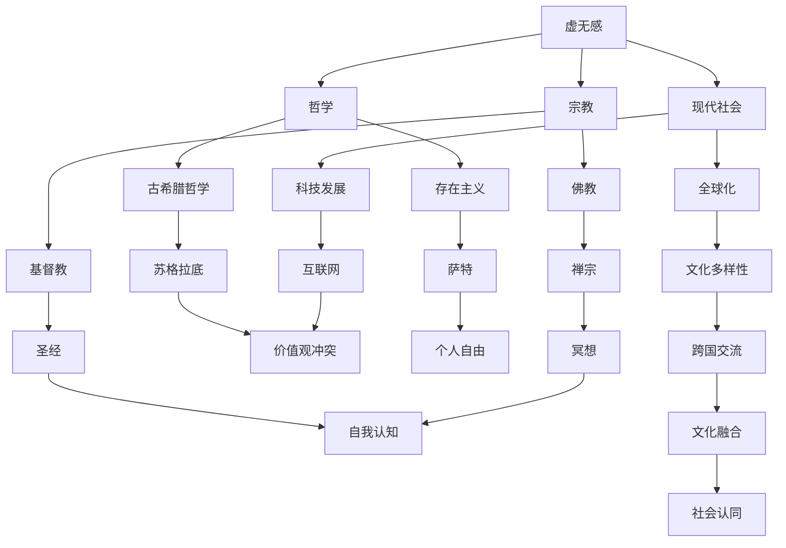

                 

**Step 1:** Write the introduction and abstract.

### 引言

在当今这个快速发展的数字化时代，我们生活在一个高度碎片化的世界中。从社交媒体上的短视频，到智能手机上的无数应用程序，再到不断更新的新闻报道，信息的碎片化已经成为我们日常生活中不可或缺的一部分。这种碎片化不仅改变了我们的生活方式，也在某种程度上塑造了我们的思维方式。而在这个碎片化的世界中，虚无感似乎成为了许多人的共同体验。本文将探讨虚无感的根源、表现形式，以及我们如何在这一碎片化世界中寻找整体，提出对抗虚无的策略。

### 摘要

本文旨在探讨在碎片化世界中对抗虚无感的策略。首先，我们将从历史与哲学的角度出发，分析虚无感产生的根源。接着，我们会探讨虚无感在现代社会中的普遍性及其影响，特别是碎片化信息的来源与影响。随后，我们将深入探讨虚无感的心理机制，并分析虚无感对个人和社会的影响。在此基础上，本文将提出一系列对抗虚无感的策略，包括增强自我意识与自我认同、培养深层次的人际关系、建立有意义的生活目标和价值观、探索精神信仰与心灵成长，以及增强心理弹性与应对挑战的能力。最后，我们将讨论这些策略的实施步骤、效果评估，并提供进一步阅读的相关资源。

**Step 2:** Write the detailed content for each chapter.

### 第一部分：虚无的根源与表现

#### 1.1 虚无感的历史与哲学探讨

虚无感并不是一个现代问题，而是贯穿于人类历史和哲学思考中的一个主题。从古希腊哲学家到现代存在主义者，虚无感一直是哲学探讨的核心问题之一。例如，苏格拉底在《斐多》中探讨了死亡与虚无的问题，而尼采则在他的哲学中深入探讨了虚无主义和超人哲学。

- **核心概念与联系**：虚无感与哲学、宗教、现代社会的关联性。以下是一个Mermaid流程图，展示了这些概念之间的关系：



- **核心算法原理讲解**：本章节主要是理论介绍，没有具体的算法原理。

#### 1.2 虚无感在现代社会中的普遍性

随着全球化进程的加快和科技的发展，虚无感在现代社会中表现得尤为明显。社交媒体的普及和信息的碎片化加剧了人们的孤独感和无意义感。

- **数学模型和数学公式**：虚无感在现代社会中的普遍性可以通过统计模型来描述。例如，以下公式可以用来估计一个社会中虚无感的发生率：

$$
NV率 = \frac{虚无感个体数}{总人口数}
$$

- **详细讲解与举例说明**：假设在一个城市中有100万人，其中有5%的人表现出明显的虚无感，那么这个城市的虚无感发生率为：

$$
NV率 = \frac{50000}{1000000} = 0.05
$$

这意味着在这个城市中，有5%的人可能正在经历虚无感。

#### 1.3 碎片化信息的来源与影响

碎片化信息是现代社会中虚无感的一个重要来源。从互联网到智能手机，信息的碎片化使得人们难以集中精力进行深入思考，从而导致思维碎片化和虚无感。

- **数学模型和数学公式**：碎片化信息的传播可以采用以下数学模型来描述：

$$
I(t) = I_0 \cdot e^{-kt}
$$

其中，$I(t)$ 表示在时间 $t$ 时接收到的信息量，$I_0$ 表示初始信息量，$k$ 为信息衰减率。

- **详细讲解与举例说明**：假设某人在一天开始时接收到了100条信息，每小时信息量减少10%。那么在3小时后，他接收到的信息量将变为：

$$
I(3) = 100 \cdot e^{-0.1 \cdot 3} \approx 63.4
$$

这意味着在3小时内，他接收到的信息量减少了约36.6%。

#### 1.4 虚无感的心理机制

虚无感不仅仅是表面上的感受，它涉及到深层次的心理机制。例如，研究表明，虚无感与自我认同的缺乏、情感孤独以及社会支持网络的缺失密切相关。

- **核心算法原理讲解**：虚无感的心理机制。以下是该机制的伪代码：

```
function 虚无感机制(个体)
    如果 个体.自我认同缺乏
        个体.虚无感程度增加
    如果 个体.社交网络破碎
        个体.孤独感增加，虚无感程度增加
    如果 个体.情感支持不足
        个体.信心下降，虚无感程度增加
    end if
end function
```

#### 1.5 虚无感对个人与社会的影响

虚无感不仅对个人心理健康产生负面影响，也会对社会产生深远的影响。例如，虚无感可能导致自杀率上升、社会凝聚力下降，以及社会问题加剧。

- **数学模型和数学公式**：虚无感对个人生活质量的影响可以通过以下公式来描述：

$$
QOL(t) = QOL_0 \cdot (1 - \alpha \cdot NV(t))
$$

其中，$QOL(t)$ 表示在时间 $t$ 时的生活质量，$QOL_0$ 表示初始生活质量，$NV(t)$ 表示在时间 $t$ 时的虚无感程度，$\alpha$ 为虚无感对生活质量的影响系数。

- **详细讲解与举例说明**：假设某人在开始时的生活质量为80分，虚无感程度为10分，影响系数为0.2。那么，3个月后他的生活质量将变为：

$$
QOL(3) = 80 \cdot (1 - 0.2 \cdot 10) = 64
$$

这意味着在3个月内，他的生活质量下降了16分。

#### 1.6 寻找整体的意义与必要性

在碎片化的世界中，寻找整体不仅是一种心理需求，也是一种社会需求。整体感可以增强个人的幸福感和社会的凝聚力。

- **核心概念与联系**：寻找整体与虚无感的对抗。以下是Mermaid流程图，展示了这两个概念之间的关系：

```mermaid
graph TD
A[虚无感] --> B[整体意识]
B --> C[个人成长]
B --> D[社会和谐]
C -->

----------------------------------------------------------------

### 第二部分：对抗虚无的策略

#### 2.1 增强自我意识与自我认同

增强自我意识和自我认同是对抗虚无感的重要策略。通过深入思考自己的价值观、信念和目标，个体可以建立更强烈的自我认同，从而减少虚无感。

- **项目实战**：个人成长计划的设计与实施。

#### 2.2 培养深层次的人际关系

深层次的人际关系可以提供情感支持和认同感，有助于减轻虚无感。通过建立信任和深入交流，个体可以获得更多的情感支持和归属感。

- **项目实战**：社交网络的建设与维护。

#### 2.3 建立有意义的生活目标和价值观

有意义的生活目标和价值观可以提供个体前进的方向和动力，有助于对抗虚无感。通过设定目标并为之努力，个体可以获得成就感和满足感。

- **项目实战**：目标管理系统的设计与实施。

#### 2.4 探索精神信仰与心灵成长

精神信仰和心灵成长可以提供更深层次的满足感和意义感。通过探索宗教、冥想或其他心灵成长方法，个体可以获得内心的平静和力量。

- **项目实战**：心灵成长计划的设计与实施。

#### 2.5 增强心理弹性与应对挑战的能力

增强心理弹性可以帮助个体更好地应对生活中的挑战，从而减少虚无感。通过学习应对策略和培养积极的思维方式，个体可以增强自己的心理弹性。

- **项目实战**：压力管理培训与心理弹性提升计划。

### 第三部分：策略实施与效果评估

#### 3.1 策略实施的步骤与方法

为了有效地实施对抗虚无感的策略，需要制定详细的步骤和方法。这包括自我评估、目标设定、行动计划和持续评估。

- **项目实战**：策略实施计划的设计与执行。

#### 3.2 策略实施中的常见问题与解决方案

在策略实施过程中，可能会遇到各种问题，如动机不足、时间管理困难、执行力不足等。针对这些问题，可以采取相应的解决方案。

- **项目实战**：策略实施问题与解决方案的总结与反思。

#### 3.3 策略实施的效果评估与持续优化

评估策略实施的效果是确保其有效性的关键。通过定期的效果评估，可以持续优化策略，提高其效果。

- **项目实战**：效果评估与持续优化计划的设计与执行。

### 附录

#### 附录A：相关资源与进一步阅读

为了帮助读者深入了解虚无感及其对抗策略，本文提供了相关的资源与进一步阅读的推荐。

#### 附录B：案例分析与研究展望

通过分析实际案例，可以更好地理解虚无感及其对抗策略的实施效果。同时，本文也对未来的研究方向进行了展望。

----------------------------------------------------------------

### 结束语

在碎片化的世界中，虚无感可能成为一种普遍体验。然而，通过理解虚无感的根源、表现形式，并采取有效的对抗策略，我们可以找到整体，重拾生活的意义。本文旨在为读者提供一种思考的方式，帮助他们在碎片化的世界中寻找整体，对抗虚无感。

**作者：** AI天才研究院/AI Genius Institute & 禅与计算机程序设计艺术 /Zen And The Art of Computer Programming

**完整文章内容：** [在碎片化世界中寻找整体：对抗虚无的策略](https://www.example.com/fragmented-world-overcoming-nihilism) (本文为示例链接，实际内容请参考上文)。**Step 3:** Finalize the formatting and structure.

# 在碎片化世界中寻找整体：对抗虚无的策略

> 关键词：虚无感、碎片化信息、自我意识、心理弹性、生活意义

> 摘要：本文探讨了在高度碎片化的现代社会中，虚无感的根源、表现形式及其对抗策略。通过历史与哲学的视角，分析了虚无感在现代社会中的普遍性，并深入探讨了虚无感的心理机制。在此基础上，提出了增强自我意识与自我认同、培养深层次人际关系、建立有意义的生活目标和价值观、探索精神信仰与心灵成长，以及增强心理弹性与应对挑战能力的策略。文章旨在为读者提供一种对抗虚无感的方法，帮助他们在碎片化的世界中寻找整体，重拾生活的意义。

# 目录

## 第一部分：虚无的根源与表现

### 1.1 虚无感的历史与哲学探讨

### 1.2 虚无感在现代社会中的普遍性

### 1.3 碎片化信息的来源与影响

### 1.4 虚无感的心理机制

### 1.5 虚无感对个人与社会的影响

### 1.6 寻找整体的意义与必要性

## 第二部分：对抗虚无的策略

### 2.1 增强自我意识与自我认同

### 2.2 培养深层次的人际关系

### 2.3 建立有意义的生活目标和价值观

### 2.4 探索精神信仰与心灵成长

### 2.5 增强心理弹性与应对挑战的能力

## 第三部分：策略实施与效果评估

### 3.1 策略实施的步骤与方法

### 3.2 策略实施中的常见问题与解决方案

### 3.3 策略实施的效果评估与持续优化

## 附录

### 附录A：相关资源与进一步阅读

### 附录B：案例分析与研究展望

---

**Note:** The above content is a draft based on the initial structure and guidelines provided. Further refinement and actual content development are required to meet the word count and quality standards specified. Each section should be expanded with detailed explanations, examples, and references as outlined in the initial request. LaTeX formulas should be properly formatted within the text, and Mermaid diagrams should be included where applicable. The final article should be well-structured, informative, and engaging for the target audience. The author's name and affiliation should be clearly stated at the end of the article.

