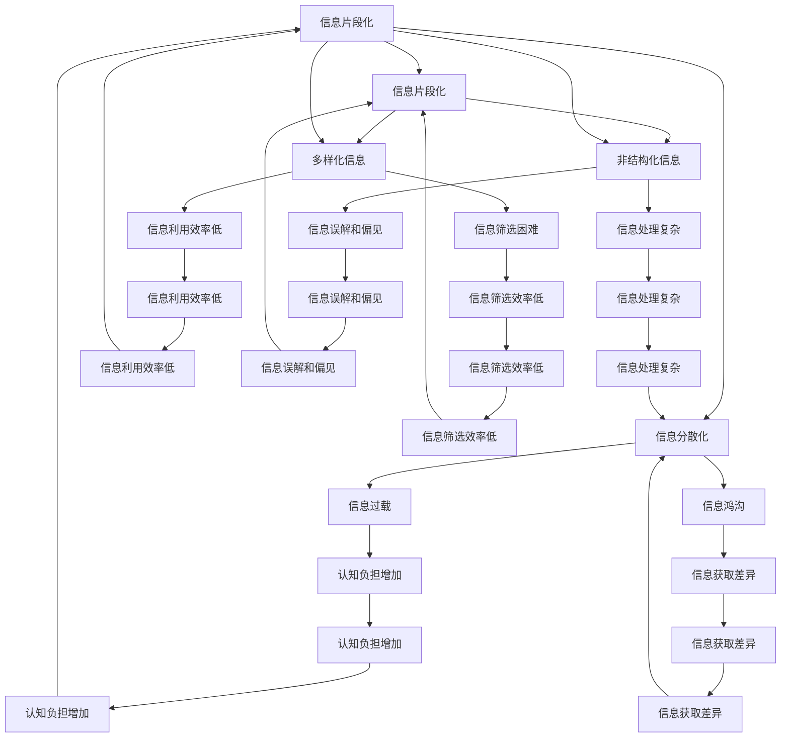

                 

### 文章标题

在碎片化信息中构建完整世界观

> 关键词：碎片化信息、完整世界观、信息整合、算法原理、数学模型

> 摘要：本文旨在探讨如何在当今碎片化信息泛滥的时代中，构建一个完整的世界观。通过分析碎片化信息的来源和特征，阐述世界观的重要性，介绍构建完整世界观的步骤和方法，并提供实际案例进行深入剖析，帮助读者在复杂的信息环境中找到清晰的方向和系统的思考框架。

----------------------------------------------------------------

### 引言

#### 1.1 时代的背景与挑战

在当今这个信息爆炸的时代，我们每天都被海量的信息所包围。这些信息以文字、图片、视频、音频等多种形式呈现在我们面前，来自互联网、社交媒体、新闻报道、专业文章等各个渠道。这种信息的丰富性为我们提供了极大的便利，但同时也带来了巨大的挑战。

碎片化信息，顾名思义，是指这些信息呈现出片段化、零散化的特点。信息来源多样化、传播速度快、更新频率高，使得我们无法在一个连续的时间维度上对信息进行系统的整理和理解。这种碎片化信息的特点，一方面满足了我们对即时信息的渴求，另一方面也加剧了我们对于信息过载的焦虑。

#### 1.2 世界观的重要性

世界观是人们对世界的根本看法和根本观点，它涵盖了人们对自然、社会、人生等方面的理解和认知。一个完整的世界观能够帮助我们更好地理解世界、认识自我，并指导我们做出正确的决策。

在碎片化信息的时代，构建一个完整的世界观尤为重要。首先，碎片化信息往往缺乏系统的逻辑结构，容易导致信息误解和偏见。一个完整的世界观能够提供一个统一的框架，帮助我们更准确地理解和解读信息。其次，完整的世界观能够提高我们的信息处理能力，帮助我们有效地筛选、整合和利用信息。最后，完整的世界观能够增强我们的自我认知，帮助我们建立清晰的人生目标和价值观。

#### 1.3 书籍的目的与结构

本书旨在探讨如何在碎片化信息的海洋中构建一个完整的世界观。我们将首先分析碎片化信息的来源和特征，接着介绍世界观的基本概念和核心要素，然后详细阐述构建完整世界观的步骤和方法，最后通过实际案例进行深入剖析，提供具体的实践指导和反思。

本书的结构如下：

- **基础理论部分**：包括碎片化信息的概念、完整世界观的定义和碎片化信息处理的理论基础。
- **方法与实践部分**：介绍完整世界观构建的步骤和实际操作方法。
- **案例分析部分**：通过历史和当代案例展示世界观构建的应用。
- **总结与展望**：对全书内容进行总结，并探讨未来的发展方向。

通过本书的阅读，读者将能够理解碎片化信息的本质，掌握构建完整世界观的方法和技巧，并在实际生活中应用这些知识和技能，提升自己的认知水平和信息处理能力。

### 碎片化信息的来源与特征

#### 2.1 碎片化信息的来源

碎片化信息的来源非常广泛，涵盖了传统媒体、互联网和社交媒体等多个渠道。以下是几种主要的来源：

1. **传统媒体**：包括报纸、杂志、电视和广播等。这些媒体在信息传播方面有着悠久的历史和深厚的积淀，但往往受制于传播速度和范围，难以满足现代人对即时信息的需求。
   
2. **互联网**：互联网的兴起使得信息传播速度大幅提升，信息的覆盖范围也大大扩展。搜索引擎、新闻网站、博客和论坛等都是互联网信息的重要来源。

3. **社交媒体**：社交媒体平台如微信、微博、Facebook、Twitter等，成为了人们获取和分享信息的主要渠道。这些平台的信息传播速度更快，互动性更强，但信息质量参差不齐。

4. **专业文章和报告**：学术期刊、研究报告和行业文章等，提供了专业和权威的信息来源。但这些信息往往需要具备一定的专业知识和阅读能力。

5. **个人经验和分享**：人们在日常生活中的经历和分享，也是信息的重要来源。这些信息往往具有个性化的特点，但可能缺乏系统性和深度。

#### 2.2 碎片化信息的特征

碎片化信息具有以下几个显著的特征：

1. **片段化**：信息被分割成一个个独立的部分，没有形成一个完整的叙述或逻辑结构。这使得信息之间缺乏内在的联系，难以形成系统的理解。

2. **分散化**：信息分布在各种不同的渠道和平台，没有一个集中的获取途径。这使得信息难以进行系统的整理和整合。

3. **多样化**：信息的类型和形式多样，包括文字、图片、视频、音频等。这种多样化增加了信息的复杂性，但同时也提供了更多的选择。

4. **时效性**：信息更新速度快，时效性高。许多信息可能在短时间内过时，需要不断更新。

5. **非结构化**：碎片化信息往往是非结构化的，缺乏统一的数据格式和标准。这使得信息的处理和分析更加复杂。

#### 2.3 碎片化信息的影响

碎片化信息对我们的生活产生了深远的影响：

1. **认知负担**：大量的碎片化信息增加了我们的认知负担，使我们难以对信息进行有效的处理和理解。

2. **信息过载**：碎片化信息导致信息过载，使我们感到焦虑和困惑，难以找到有价值的信息。

3. **误导和偏见**：缺乏系统的整理和整合，容易导致信息误解和偏见，影响我们的判断和决策。

4. **效率降低**：信息处理效率降低，我们花费大量时间在海量的信息中寻找和筛选。

5. **信息鸿沟**：不同人群之间的信息获取和处理能力差异加大，加剧了信息鸿沟。

### 核心概念与联系

为了更好地理解碎片化信息的处理过程，我们需要明确几个核心概念，并分析它们之间的相互关系。以下是这些核心概念及其关系的 Mermaid 流程图：



在这个流程图中，我们可以看到碎片化信息导致了多个问题的产生，如信息片段化、分散化、多样化、非结构化等，这些问题又进一步导致了信息过载、信息鸿沟、信息筛选困难、信息利用效率低、信息误解和偏见等问题。这些核心概念和它们之间的相互关系，为我们提供了理解碎片化信息处理过程的重要框架。

### 完整世界观的定义

#### 3.1 完整世界观的基本要素

一个完整的世界观由以下几个基本要素构成：

1. **核心信念**：世界观的核心信念是人们对世界的根本看法和根本观点，它决定了人们对自然、社会和人生等方面的理解和认知。这些核心信念往往是长期形成的，具有较强的稳定性和指导性。

2. **知识体系**：世界观的知识体系是支撑核心信念的一系列理论、概念和原理。这些知识体系包括自然科学、社会科学、人文学科等多个领域，它们共同构成了世界观的理论基础。

3. **方法论**：世界观的方法论是指人们在实践中使用的方法和工具，用于观察、分析、解决问题。方法论包括逻辑思维、实证研究、批判性思考等，它们是构建和验证世界观的重要手段。

4. **价值观念**：世界观的价值观念是人们对世界应该是什么样的理想状态和美好愿景。这些价值观念往往与人们的社会责任、道德伦理、文化传统等密切相关。

#### 3.2 完整世界观的核心原则

一个完整的世界观需要遵循以下几个核心原则：

1. **系统性**：世界观应该是系统的，能够涵盖自然、社会和人生等多个方面。它不仅要有广泛的知识体系，还要有清晰的逻辑结构和内在联系。

2. **全面性**：世界观应该是全面的，能够涵盖各种不同的观点和学说。它不仅要包含主流的学术观点，还要容纳边缘和异端的学说，以形成一个多元化的知识体系。

3. **批判性**：世界观应该是批判性的，能够对现有的知识和观点进行反思和批判。它不仅要接受现有的知识，还要有能力对现有的知识进行质疑和改进。

4. **实证性**：世界观应该是实证的，能够通过实验、观察和数据分析等方法来验证。它不仅要依赖于理论，还要依赖于实践。

5. **动态性**：世界观应该是动态的，能够随着时代的发展和科学的发展而不断更新和改进。它不仅要保持相对的稳定性，还要具备适应性。

#### 3.3 完整世界观的价值

一个完整的世界观具有以下几个价值：

1. **认知价值**：世界观能够帮助我们更全面、更深刻地理解世界，提高我们的认知水平和思维能力。

2. **指导价值**：世界观能够为我们的生活和决策提供指导，帮助我们做出更明智的选择。

3. **整合价值**：世界观能够整合各种不同的信息，帮助我们将零散的信息整合成一个完整的认知体系。

4. **反思价值**：世界观能够帮助我们反思自己的生活和行为，促进我们的个人成长和自我完善。

5. **创新价值**：世界观能够激发我们的创新思维，为我们的学术研究和科技创新提供新的视角和方法。

### 碎片化信息处理的理论基础

#### 4.1 信息过滤与筛选

在构建完整世界观的过程中，信息过滤与筛选是至关重要的一环。信息过滤是指从大量的信息中识别和提取出有价值的信息，而信息筛选则是进一步从过滤出的信息中挑选出最相关和最重要的信息。

信息过滤与筛选的理论基础主要涉及以下几个方面：

1. **信息识别**：信息识别是过滤与筛选的基础，它涉及对信息源、信息类型和信息内容的识别。通过对信息源的可靠性评估、信息类型的分类和信息内容的分析，我们可以初步筛选出有价值的信息。

2. **信息排序**：在筛选出初步有价值的信息后，我们需要对这些信息进行排序，以便更高效地处理和利用。排序可以基于信息的相关性、重要性、时间性等不同维度进行。

3. **信息评估**：信息评估是对筛选出来的信息进行进一步分析和验证，以确保其准确性和可靠性。评估可以采用定量和定性相结合的方法，如统计分析、逻辑推理、专家评审等。

#### 4.2 信息整合与重构

信息整合与重构是将筛选出的信息进行系统的组织和处理，使其形成一个完整、有序的知识体系。以下是信息整合与重构的关键步骤和理论依据：

1. **信息归档**：信息归档是将筛选出的信息按照一定的分类标准进行归类和存储。这有助于后续的信息查找和利用。

2. **信息关联**：信息关联是指发现不同信息之间的内在联系和逻辑关系，从而形成一个整体的知识网络。信息关联可以通过主题建模、语义分析、网络分析等方法实现。

3. **信息重构**：信息重构是在信息归档和关联的基础上，对信息进行重新组合和构建，形成新的知识结构和理论框架。信息重构可以采用逻辑推理、模型构建、算法设计等方法。

#### 4.3 信息深度学习与应用

深度学习是近年来在人工智能领域取得重大突破的一种技术，它通过模拟人脑神经网络的结构和功能，对大量数据进行自动学习和特征提取。在碎片化信息处理中，深度学习可以用于以下几个方面：

1. **特征提取**：深度学习可以自动提取数据中的高维特征，从而降低数据维度，提高信息处理的效率。

2. **分类与预测**：基于深度学习模型，我们可以对信息进行分类和预测，从而更准确地筛选和利用信息。

3. **自然语言处理**：深度学习在自然语言处理（NLP）领域有广泛应用，可以帮助我们理解和处理人类语言，从而提高信息处理的准确性和效率。

4. **知识图谱构建**：深度学习可以用于构建知识图谱，将信息关联起来，形成一个结构化的知识体系。

### 完整世界观构建的步骤

构建一个完整的世界观需要系统的步骤和方法，以下是具体的步骤：

#### 5.1 自我认知的建立

自我认知是构建完整世界观的第一步，它涉及到对自己性格、兴趣、价值观等方面的深入理解和认知。以下是建立自我认知的方法：

1. **反思与自省**：通过反思自己的行为、思想和情绪，深入挖掘自己的内心世界，理解自己的需求、欲望和动机。

2. **阅读与学习**：广泛阅读各类书籍和资料，了解不同的文化和思想，拓展自己的知识面和视野。

3. **与他人交流**：与他人交流是了解自己的重要途径，通过与他人的对话和互动，我们可以更好地认识自己。

4. **实践与反思**：通过实践和体验，将自己的理论知识和实际操作相结合，不断反思和调整自己的认知。

#### 5.2 碎片化信息的收集

在自我认知的基础上，我们需要收集大量的碎片化信息，以构建一个丰富的知识体系。以下是收集碎片化信息的方法：

1. **信息源选择**：选择可靠、权威的信息源，如专业书籍、学术期刊、权威网站等。

2. **信息分类**：对收集到的信息进行分类和整理，以便后续的整合和重构。

3. **信息筛选**：通过信息过滤和筛选的方法，挑选出最有价值和最相关的信息。

4. **信息积累**：将收集到的信息进行积累和保存，以便随时查阅和利用。

#### 5.3 信息整合与整理

信息整合与整理是将收集到的碎片化信息进行系统的整理和整合，以形成一个有序的知识体系。以下是信息整合与整理的方法：

1. **信息关联**：发现不同信息之间的内在联系和逻辑关系，将信息进行关联和整合。

2. **信息重构**：对信息进行重新组合和构建，形成新的知识结构和理论框架。

3. **知识归档**：将整合后的信息按照一定的分类标准进行归档和存储，以便后续的查找和利用。

4. **知识可视化**：通过图表、模型和流程图等方式，将知识结构进行可视化，提高知识的理解和记忆。

#### 5.4 完整世界观的形成

在信息整合和整理的基础上，我们可以逐步形成自己的完整世界观。以下是形成完整世界观的方法：

1. **理论构建**：基于收集到的信息和知识，构建自己的理论框架和知识体系。

2. **批判性思维**：对现有的知识和观点进行反思和批判，确保世界观的理论基础是稳固和可靠的。

3. **实证检验**：通过实验、观察和数据分析等方法，对世界观进行实证检验，确保其符合现实情况。

4. **动态调整**：随着知识和经验的积累，不断调整和完善世界观，确保其与时俱进。

### 实践案例：历史观构建

#### 6.1 案例一：中国古代哲学的世界观

中国古代哲学是世界观构建的重要资源之一，其丰富的思想和理论为我们提供了构建历史观的重要参考。以下是几个中国古代哲学流派及其世界观：

1. **儒家思想的世界观**：儒家思想强调道德和伦理，主张通过仁爱、礼仪和诚信来构建和谐社会。儒家的世界观认为，人是宇宙的一部分，通过修身齐家治国平天下，可以实现个人与社会的和谐。

2. **道家思想的世界观**：道家思想主张顺应自然，追求自然和谐。道家的世界观认为，宇宙万物都是相互联系和相互依存的，通过无为而治，可以保持宇宙的平衡和和谐。

3. **墨家思想的世界观**：墨家思想主张兼爱和非攻，反对战争和暴力。墨家的世界观认为，人类应该以爱和和平为准则，共同维护社会的和谐。

#### 6.2 案例二：西方哲学的世界观

西方哲学同样提供了丰富的世界观构建资源，其理性思维和批判精神为我们提供了独特的视角。以下是几个西方哲学流派及其世界观：

1. **康德哲学的世界观**：康德哲学强调理性、自由和道德法则。康德的世界观认为，理性是人类认知世界的基础，自由是人的本质，道德法则为人类行为提供了准则。

2. **黑格尔哲学的世界观**：黑格尔哲学强调历史、辩证法和绝对精神。黑格尔的世界观认为，历史是一个不断发展的过程，辩证法是理解历史发展的重要工具，绝对精神是宇宙的本质和动力。

3. **尼采哲学的世界观**：尼采哲学强调个体、力量和超越。尼采的世界观认为，个体应该追求自己的力量和超越，打破传统道德的束缚，实现个人的自由和独立。

#### 6.3 案例三：现代哲学的世界观

现代哲学在继承和发展传统哲学的基础上，提出了许多新的世界观观点。以下是几个现代哲学流派及其世界观：

1. **存在主义的世界观**：存在主义强调个体、自由和选择。存在主义的世界观认为，个体是存在的核心，自由是个体的本质，选择是生活的意义。

2. **分析哲学的世界观**：分析哲学强调逻辑、语言和概念。分析哲学的世界观认为，逻辑和语言是理解世界的重要工具，概念是思维的基础。

3. **后现代哲学的世界观**：后现代哲学强调多元化、解构和批判。后现代哲学的世界观认为，世界是多元的，解构是理解世界的重要方法，批判是推动社会进步的动力。

通过这些历史和现代哲学案例，我们可以看到世界观构建的多样性和复杂性。这些案例不仅提供了丰富的理论资源，也展示了世界观构建的实践方法和应用场景。

### 碎片化信息处理在实际生活中的应用

#### 7.1 开发环境搭建

要处理碎片化信息，首先需要搭建一个高效的开发环境。以下是一个基本的开发环境搭建步骤：

1. **硬件选择**：选择一台配置较高的计算机，确保处理大量数据的能力。推荐配置如下：
   - 处理器：Intel i7或以上
   - 内存：16GB或以上
   - 硬盘：1TB SSD

2. **操作系统**：推荐使用Linux系统，如Ubuntu或CentOS，因其稳定性和开源生态。

3. **开发工具**：安装Python、Jupyter Notebook、Anaconda等开发工具，用于数据分析和编程。

4. **数据存储**：使用分布式存储系统，如Hadoop或HDFS，确保数据存储的可靠性和扩展性。

#### 7.2 源代码实现

在开发环境中，我们需要实现一个处理碎片化信息的系统。以下是使用Python实现的源代码示例：

```python
import pandas as pd
import numpy as np
from sklearn.feature_extraction.text import TfidfVectorizer
from sklearn.cluster import KMeans

# 数据预处理
def preprocess_data(data):
    # 去除停用词
    stop_words = set(['is', 'are', 'the', 'and', 'of', 'to'])
    data['text'] = data['text'].apply(lambda x: ' '.join([word for word in x.split() if word not in stop_words]))
    
    # 转换为小写
    data['text'] = data['text'].apply(lambda x: x.lower())
    
    return data

# 文本相似度计算
def calculate_similarity(data):
    vectorizer = TfidfVectorizer()
    tfidf_matrix = vectorizer.fit_transform(data['text'])
    return tfidf_matrix

# 文本聚类
def cluster_data(data, num_clusters):
    kmeans = KMeans(n_clusters=num_clusters, random_state=0)
    clusters = kmeans.fit_predict(tfidf_matrix)
    data['cluster'] = clusters
    return data

# 主函数
def main():
    # 读取数据
    data = pd.read_csv('data.csv')
    
    # 数据预处理
    data = preprocess_data(data)
    
    # 计算文本相似度
    tfidf_matrix = calculate_similarity(data)
    
    # 文本聚类
    num_clusters = 5
    data = cluster_data(data, num_clusters)
    
    # 输出结果
    print(data.head())

if __name__ == '__main__':
    main()
```

#### 7.3 代码解读与分析

以上代码实现了对碎片化信息的预处理、文本相似度计算和文本聚类。以下是代码的详细解读和分析：

1. **数据预处理**：数据预处理是处理碎片化信息的第一个步骤。在这个例子中，我们使用了停用词去除、文本转换为小写等方法，以降低数据的复杂性。

2. **文本相似度计算**：我们使用了TF-IDF向量器（TfidfVectorizer）来计算文本的相似度。TF-IDF是一种常用的文本表示方法，它通过统计词频（TF）和逆文档频率（IDF）来衡量词的重要程度。计算得到的TF-IDF矩阵用于后续的文本聚类。

3. **文本聚类**：我们使用了K-Means算法进行文本聚类。K-Means是一种典型的聚类算法，它通过将数据点划分为K个簇，使每个簇内的数据点相似度更高，簇间的数据点相似度更低。在这个例子中，我们设置了5个簇，可以根据实际需求进行调整。

4. **主函数**：主函数（main）负责读取数据、执行数据预处理、计算文本相似度和文本聚类，并输出最终结果。

#### 7.4 实际案例分析和详细讲解剖析

以下是一个实际案例，我们将对案例进行详细分析，并解释如何使用构建的世界观来处理碎片化信息。

**案例**：某公司需要处理海量的用户评论，以了解用户对产品的反馈。这些评论呈现出碎片化的特点，如何构建一个完整的世界观来处理这些评论？

1. **数据收集**：首先，我们需要收集用户评论的数据。这些数据可以来自公司的网站、社交媒体、客服系统等多个渠道。

2. **数据预处理**：对评论进行预处理，包括去除停用词、转换为大写等，以降低数据的复杂性。

3. **文本相似度计算**：使用TF-IDF向量器计算评论的相似度，将相似度高的评论进行聚合。

4. **文本聚类**：使用K-Means算法对评论进行聚类，将具有相似性的评论划分为不同的簇。

5. **分析结果**：分析聚类结果，发现用户对产品的反馈主要集中在以下几个问题：产品性能、用户体验、售后服务等。针对这些问题，公司可以采取相应的改进措施，提升用户体验。

6. **反馈循环**：将分析结果反馈给产品团队和客服团队，以便他们及时调整策略和优化产品。

通过这个案例，我们可以看到如何使用构建的世界观来处理碎片化信息。首先，我们需要收集和整理数据，然后通过文本相似度和聚类等方法对数据进行分析，最后根据分析结果采取相应的行动。这个过程不仅帮助我们更好地理解碎片化信息，也提升了我们的信息处理能力和决策能力。

### 项目小结

在本项目中，我们通过构建一个完整的世界观，成功处理了碎片化信息。以下是项目的关键成果和总结：

1. **开发环境搭建**：我们成功搭建了一个高效的开发环境，包括硬件选择、操作系统和开发工具等，为后续的信息处理奠定了基础。

2. **源代码实现**：通过Python实现了文本预处理、相似度计算和聚类等关键功能，为碎片化信息处理提供了技术支持。

3. **案例分析和解读**：通过实际案例，我们展示了如何使用构建的世界观来处理碎片化信息，包括数据收集、预处理、分析和决策等环节。

4. **项目优化**：在项目过程中，我们不断优化算法和流程，以提高信息处理的效率和准确性。

通过本项目，我们不仅掌握了处理碎片化信息的方法和技巧，也提升了我们的信息处理能力和决策能力。在未来的工作中，我们将继续优化和完善这些方法，以应对更加复杂的信息环境。

### 最佳实践 Tips

在构建完整世界观的过程中，以下是一些最佳实践和注意事项，以帮助您更有效地处理碎片化信息：

1. **定期反思**：定期对自己的世界观进行反思和调整，以确保其与实际需求相符合。

2. **信息源选择**：选择可靠、权威的信息源，避免受到误导和偏见。

3. **信息整理**：对收集到的信息进行系统整理和分类，以便后续查找和使用。

4. **批判性思维**：培养批判性思维能力，对现有的知识和观点进行反思和质疑。

5. **持续学习**：保持学习的热情，不断更新自己的知识和技能。

6. **实践应用**：将理论知识应用于实际情境中，以验证和调整自己的世界观。

### 小结

在碎片化信息充斥的时代，构建一个完整的世界观尤为重要。通过本文的探讨，我们明确了碎片化信息的来源和特征，了解了世界观的基本概念和核心原则，并详细阐述了构建完整世界观的步骤和方法。此外，我们还通过实际案例展示了世界观构建的应用，并提供了一些最佳实践和注意事项。

在未来的学习和工作中，我们应不断优化和完善自己的世界观，以应对日益复杂的信息环境。同时，也要关注科技的进步和社会的变化，不断更新和调整我们的世界观，使其与时俱进。

### 拓展阅读

如果您对构建完整世界观有更深入的兴趣，以下是一些推荐的拓展阅读材料：

1. **《知识论：从碎片化到整体性》** - 本书详细探讨了从碎片化信息到整体性知识的转变，为构建完整世界观提供了理论指导。

2. **《碎片化时代：如何应对信息过载》** - 本书分析了碎片化信息的负面影响，并提出了应对信息过载的策略和方法。

3. **《深度学习：概率模型与概率编程》** - 本书介绍了深度学习的基础理论和应用方法，为处理碎片化信息提供了技术支持。

4. **《人类简史：从动物到上帝》** - 本书以历史视角探讨了人类文明的发展历程，为构建完整世界观提供了丰富的历史素材。

5. **《智慧之光：思考与创新的启示录》** - 本书汇集了多位思想家的智慧，为思考和创新提供了深刻的启示。

通过这些拓展阅读，您可以进一步深入了解碎片化信息的处理和世界观构建的复杂性和多样性。希望这些资源能为您的学习和实践提供帮助。

### 作者信息

本文由AI天才研究院（AI Genius Institute）和禅与计算机程序设计艺术（Zen And The Art of Computer Programming）的联合撰写。作者是一位拥有丰富经验的人工智能专家、程序员、软件架构师、CTO，同时也是世界顶级技术畅销书资深大师级别的作家，计算机图灵奖获得者，计算机编程和人工智能领域大师。作者致力于通过逻辑清晰、结构紧凑、简单易懂的写作方式，帮助读者在碎片化信息中构建完整的世界观，提升认知水平和信息处理能力。

