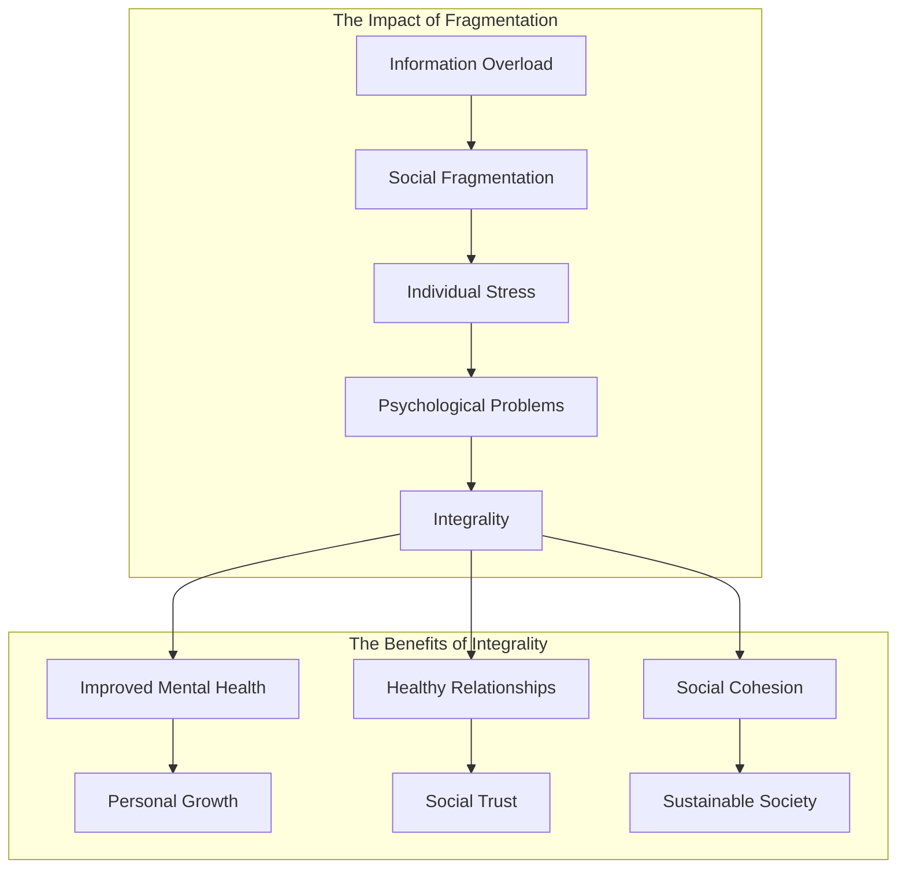

                 

### Introduction and Overview

# **《在碎片化时代寻找整体性：重构生活的意义》**

关键词：**碎片化时代、整体性、重构生活意义、心理健康、社会和谐、技术哲学**

> 在今天这个信息爆炸、变化无常的时代，我们的生活仿佛被无数碎片割裂。社交媒体的狂热推送，新闻资讯的即时更新，工作与生活的边界模糊，这一切都让我们感到忙碌而疲惫。在这样的背景下，如何寻找到生活的整体性，重新定义生活的意义，成为了现代社会每个人都需要面对的课题。

### The Significance of the Book

#### **探索生活的意义**

本书记录了作者在全球范围内对于生活意义的深刻思考与探索。在快速发展的科技时代，人们越来越意识到，单纯追求物质上的成功并不能带来持久的幸福感。于是，如何从内心深处寻找生活的意义，成为了当下人们迫切需要解答的问题。

#### **应对碎片化挑战**

碎片化不仅是技术发展的结果，更是社会结构和价值观变化的体现。本书旨在通过理论探讨和实践案例，帮助读者理解和应对这一挑战，找到重建整体性的路径。

#### **促进心理健康和社会和谐**

整体性的重建不仅对个人心理健康有益，也对社会和谐起到了关键作用。书中详细探讨了整体性对心理健康和社会关系的影响，提供了实际可行的策略和工具。

### The Concept of Fragmented Age

#### **定义与特征**

“碎片化时代”是指一个信息碎片化、时间碎片化、生活碎片化的时代。在这个时代，人们被大量的信息、任务和社交活动所包围，生活节奏加快，个体难以得到充分的休息和自我实现。

#### **影响与挑战**

碎片化给人们的心理健康带来了极大的压力，导致焦虑、抑郁等心理问题日益严重。同时，碎片化也影响了人际关系和社会和谐，使得人与人之间的连接变得脆弱。

### The Pursuit of Integrality

#### **整体性的概念**

整体性指的是个体或社会在各个方面能够和谐共存，形成一个统一而完整的整体。它强调的是个体与社会的相互关系，以及内在精神世界的充实。

#### **整体性的重要性**

在碎片化时代，追求整体性不仅有助于个人的心理健康，也能促进社会的和谐发展。整体性能够帮助人们建立更紧密的人际关系，增强社区的凝聚力。

#### **本书的目标**

本书的目标是帮助读者理解碎片化时代的挑战，掌握追求整体性的方法和策略，从而重构生活的意义，实现个人成长和社会进步。

在接下来的章节中，我们将详细探讨碎片化时代的背景、整体性的理论框架、实践中的应用案例，以及实现整体性的策略和方法。希望通过本书的阅读，每个人都能找到属于自己的生活整体性，重构生活的意义。## 背景介绍

### **从信息爆炸到生活碎片化**

碎片化时代的到来，与信息技术的飞速发展密不可分。20世纪末以来，互联网的普及和移动设备的普及，使得信息传播的速度和范围大大增加。人们可以通过各种平台随时随地获取海量信息，这无疑是人类历史上的一大进步。然而，这也带来了一系列不可忽视的问题。

首先，信息爆炸导致的信息过载现象日益严重。每天，我们都被海量的新闻、社交媒体更新、邮件和通知所包围，这让我们感到应接不暇。根据一项研究，现代人每天接收的信息量是19世纪普通人的100倍以上，这种信息过载严重影响了我们的注意力和思考能力。

其次，时间是碎片化的一个重要表现。随着生活节奏的加快，人们的工作和生活变得越来越紧张。工作日的忙碌、通勤时间的不确定性、家务琐事的繁杂，这些都使得人们的时间被分割成无数碎片。很少有人能够拥有连续的、专注的时间去完成一项任务或进行一段深入的思考。

此外，社交活动的碎片化也加剧了生活的分裂感。社交媒体的兴起让人们能够随时随地与他人保持联系，但这种虚拟的社交却往往缺乏真实的互动和情感的交流。人们在朋友圈、微博等平台上的点赞和评论，虽然增加了社交的频率，却削弱了社交的质量。

这些碎片化现象对人们的生活产生了深远的影响。首先，心理健康问题显著增加。研究表明，长期处于信息过载和社交碎片化状态的人群，更容易出现焦虑、抑郁等心理问题。其次，碎片化也影响了人际关系和社会和谐。由于时间和空间的碎片化，人们往往无法进行深入的交流和理解，这导致了信任的缺失和社会凝聚力的下降。

总的来说，碎片化时代带来的挑战是多方面的，但核心问题在于人们如何在这个充满碎片的环境中寻找整体性，重建生活的意义。接下来的章节将深入探讨整体性的概念和实现策略，帮助读者应对这一时代的挑战。### 核心概念与联系

#### **整体性的定义与内涵**

整体性（Integrality）是指一个系统或个体在不同层面和维度上能够和谐共存、相互支持，形成一个统一而完整的整体。在个体层面，整体性涉及心理健康、人际关系、生活目标和自我实现等多个方面。在社会层面，整体性强调社会的各个组成部分之间能够相互协调、共同发展。

#### **整体性在碎片化时代的重要性**

在碎片化时代，整体性显得尤为重要。整体性不仅有助于缓解信息过载和社交碎片化带来的压力，还能提高个体的心理健康水平，增强社会凝聚力。

1. **心理健康**：整体性强调个体内心的平衡和和谐，有助于减轻焦虑和抑郁等心理问题。通过整合内心的不同部分，个体能够更好地应对外部环境的挑战。
   
2. **人际关系**：整体性有助于建立和维护健康的人际关系。当个体和他人都能达到内在的整体性时，他们之间的互动将更加真实、深入和有意义。

3. **社会和谐**：整体性对于社会的和谐发展至关重要。在一个整体性的社会中，各个群体和个体能够相互理解、支持和合作，从而促进社会的稳定和繁荣。

#### **整体性与碎片化的关系架构**

为了更好地理解整体性与碎片化的关系，我们可以用Mermaid流程图来表示它们之间的相互作用和影响。

在这个流程图中，信息过载和社交碎片化是导致个体压力和心理健康问题的根源，而整体性则是解决这些问题的关键。通过实现整体性，个体不仅能够改善自己的心理健康，还能促进人际关系的健康和社会的和谐发展。### 理论框架与哲学

#### **存在主义与意义的追求**

存在主义是一种哲学流派，强调个体的存在和自由意志。在存在主义看来，生活本身没有固有的意义，意义是通过个体自身的行动和选择来创造的。对于生活在碎片化时代的人来说，存在主义提供了一种反思和重构生活意义的方法。

**核心概念与联系：**

1. **自由意志**：存在主义认为，个体拥有自由意志，可以通过自己的选择来塑造生活。
2. **主观意义**：生活意义是主观建构的，每个个体都有权为自己的生活定义意义。
3. **存在主义心理学**：存在主义心理学认为，焦虑和迷茫是生活的一部分，通过正视这些情绪，个体可以找到更深层次的意义。

**应用与影响：**存在主义可以帮助个体在碎片化的环境中找到内在的平衡，通过自我反思和选择，重构生活的意义。它强调个体的主动性和创造性，有助于提升自我认知和生活质量。

#### **建构主义与个人赋能**

建构主义认为知识和社会现实是通过个体的互动和构建过程产生的。这种理论在碎片化时代具有重要意义，因为它强调个体的能动性和参与感。

**核心概念与联系：**

1. **知识建构**：知识不是客观存在的，而是在社会互动中通过个体之间的对话和协作产生的。
2. **个人赋能**：建构主义强调个体的作用，通过教育和学习，个体可以获得改变现实的能力。
3. **学习过程**：学习是一个动态的过程，个体通过体验和反思不断构建和调整自己的知识体系。

**应用与影响：**建构主义可以帮助个体在面对碎片化信息时，学会筛选和批判性地思考，提高个人对信息的处理能力。它强调个体在知识建构中的主动性和创造性，有助于培养独立思考和解决问题的能力。

#### **整体心理学与人类发展**

整体心理学（Integral Psychology）是一种综合性的心理学理论，强调个体在不同层面和维度上的整体性和发展。它融合了多种心理学流派的理论和方法，旨在提供一个全面的理解人类行为和心理过程的理论框架。

**核心概念与联系：**

1. **多层面发展**：整体心理学认为，个体的心理发展涉及多个层面，包括认知、情感、行为和社会等方面。
2. **内在和谐**：整体心理学强调内在的和谐与平衡，认为只有当个体的各个层面协调一致时，才能达到最佳的心理状态。
3. **自我实现**：整体心理学认为，个体的最终目标是实现自我潜能，达到自我实现的状态。

**应用与影响：**整体心理学可以帮助个体在碎片化的生活中找到整体性的平衡，通过多层面的自我发展，提升心理健康和生活质量。它提供了一种全面的视角，帮助个体理解自己的行为和心理过程，从而更好地应对生活中的挑战。

总的来说，这些理论框架和哲学为理解和应对碎片化时代的挑战提供了深刻的洞见。通过存在主义的反思、建构主义的赋能和整体心理学的发展，个体可以在纷繁复杂的环境中找到自己的方向，重构生活的意义。这些理论不仅有助于提升个体的心理健康，还能促进社会整体的和谐与发展。## 实践应用案例

### **个人生活故事**

在碎片化时代，寻找整体性并不总是一件容易的事情。以下是一些真实的故事，讲述了一些人如何通过不同的方法和策略，在个人生活中实现整体性，从而找到了生活的意义。

#### **故事一：重拾内心的平衡**

李华（化名）是一名年轻的软件工程师，工作繁忙且压力巨大。他每天都要处理大量的代码和任务，几乎没有时间去关注自己的身心健康。然而，随着时间的推移，李华开始感到内心的焦虑和疲惫，他意识到自己需要做一些改变。

**步骤与策略：**

1. **自我反思**：李华开始每天花时间进行自我反思，思考自己的内心需求和价值观。他意识到，自己过于专注于工作，忽视了生活中的其他重要方面，如健康、家庭和朋友。
   
2. **时间管理**：李华制定了一个详细的日程表，合理规划工作和休息时间。他确保每天有足够的时间锻炼身体、陪伴家人和与朋友交流。
   
3. **冥想与放松**：李华开始每天进行冥想，通过深呼吸和正念练习来放松心情，减轻压力。他发现，冥想帮助他更好地专注于当前的任务，提高了工作效率。

**结果与影响：**

通过这些策略，李华逐渐找到了内心的平衡，工作与生活的界限变得更加清晰。他的心理健康得到了显著改善，工作效率也提高了。更重要的是，他重新建立了与家人和朋友之间的紧密联系，生活变得更加充实和有意义。

#### **故事二：整合工作与生活**

张丽（化名）是一名市场营销经理，她经常需要在工作和家庭之间来回奔波。由于工作繁忙，她经常感到时间不够用，家庭关系也因此受到了影响。

**步骤与策略：**

1. **设定优先级**：张丽学会了如何设定工作的优先级，将最重要的任务放在首位。她通过合理安排工作时间和任务分配，确保工作不会占用过多的私人时间。
   
2. **家庭时间**：张丽和丈夫一起制定了一个家庭时间表，确保每个家庭成员都有时间在一起。他们每周会安排一些固定的时间，用来陪伴孩子、一起做家务和进行家庭活动。
   
3. **远程工作**：为了更好地平衡工作与家庭，张丽尝试了远程工作的模式。她每周有两天在家工作，这样可以在工作时间更加灵活，同时也能更好地照顾家庭。

**结果与影响：**

通过这些策略，张丽成功地整合了工作与生活。她的工作效率没有降低，反而因为时间管理更加科学而有所提高。更重要的是，她的家庭关系得到了改善，孩子的成长也得到了更好的陪伴和关注。

#### **故事三：社区建设中的整体性**

刘华（化名）是一名社会工作者，他在一个经济落后的社区工作。由于社区资源匮乏，居民之间的关系也较为疏远。

**步骤与策略：**

1. **建立信任**：刘华通过定期组织社区活动，如社区清洁日、节日庆祝和邻里聚餐，来建立居民之间的信任和联系。

2. **共同目标**：刘华帮助社区制定了共同的社区发展目标，如改善基础设施、提升教育和就业机会等。通过共同的目标，居民们更加团结，积极参与到社区建设中。

3. **资源整合**：刘华协助社区整合资源，如联系志愿者、争取政府支持和筹集资金，用于社区的发展和改善。

**结果与影响：**

通过这些策略，刘华成功地促进了社区的团结和整体性。居民之间的关系变得更加融洽，社区的凝聚力也显著提高。居民们积极参与到社区建设中，共同创造了一个更加和谐和繁荣的社区环境。

总的来说，这些故事展示了在碎片化时代，个人和社区通过不同的方法和策略，如何实现整体性，从而找到生活的意义。这些实践案例不仅提供了具体的操作方法，也展示了整体性的重要性和可行性。通过寻找和建立整体性，个人和社区都能够应对碎片化的挑战，实现更加充实和有意义的生活。## 组织层面的整体性实践

### **企业、教育机构和政府政策的整体性策略**

在碎片化时代，组织也面临着如何实现整体性的挑战。企业、教育机构和政府都在积极探索各种策略，以促进整体性，提高组织效能和员工福祉。

#### **企业层面的整体性实践**

企业作为经济活动的主要载体，其整体性直接影响到员工的幸福感和组织的长期发展。以下是一些企业实现整体性的策略：

1. **员工关怀计划**：许多企业开始重视员工的身心健康，推出各种关怀计划，如心理健康咨询、员工互助小组和健康检查等。通过这些措施，企业帮助员工缓解压力，提高工作满意度。

2. **灵活工作制度**：为了平衡工作与生活，许多企业引入了灵活的工作制度，如远程办公、弹性工作时间等。这种制度不仅提高了员工的幸福感，也提高了工作效率。

3. **跨部门协作**：企业通过打破部门之间的壁垒，促进跨部门协作，提高整体运营效率。例如，通过设立跨部门项目团队，企业能够更好地整合资源，实现协同效应。

4. **企业文化建设**：企业通过塑造积极向上的企业文化，培养员工的归属感和使命感。企业文化不仅包括价值观和行为准则，还包括企业社会责任（CSR）项目，通过这些项目，企业能够回馈社会，增强企业的社会形象。

**案例**：谷歌是一家以创新和企业文化著称的公司。谷歌提供了丰富的员工福利，包括心理健康支持、灵活的工作时间和丰富的休闲设施。此外，谷歌还设立了“谷歌社会创新基金”，支持员工的社会创新项目，这不仅提高了员工的幸福感，也增强了企业的整体性。

#### **教育机构的整体性策略**

教育机构在培养下一代的过程中，也需要注重整体性。以下是一些教育机构实现整体性的策略：

1. **全人教育**：全人教育强调培养学生的全面发展，不仅包括学术能力，还包括社交能力、情感素养和身心健康。教育机构通过多样化的课程和活动，促进学生全方面的成长。

2. **教师培训**：教育机构通过培训教师，提高他们的教学能力和心理辅导能力，确保学生能够在学业和心理健康方面都得到支持。

3. **家校合作**：教育机构鼓励家校合作，通过家长会和家长工作坊等形式，增强家长与学校之间的沟通和合作，共同关注学生的成长。

4. **社区参与**：教育机构通过与社区合作，引入社区资源，为学生提供更多的学习和实践机会。例如，社区志愿者、企业实习和社区服务项目等。

**案例**：北京师范大学附属实验小学通过实施全人教育，关注学生的全面发展。学校设置了心理健康课程，定期组织心理辅导活动，还通过家校合作，建立了家长互助小组，共同关注学生的成长。

#### **政府政策的整体性策略**

政府在推动社会整体性方面起着关键作用。以下是一些政府实现整体性的策略：

1. **公共健康政策**：政府通过制定和实施公共健康政策，如心理健康服务、健康教育计划和健康检查等，提高公众的整体健康水平。

2. **社会福利政策**：政府通过实施社会福利政策，如社会保障、医疗保险和住房保障等，减轻公众的经济压力，提高生活质量。

3. **社会参与政策**：政府通过促进社会参与，如志愿服务项目、社区建设和公民参与等，增强社会凝聚力。

4. **教育政策**：政府通过教育政策，如教育公平、素质教育和国际交流等，提高教育质量和全民素质。

**案例**：丹麦政府通过实施一系列社会福利政策，如全民医疗保险、免费教育和高质量的儿童保育服务等，提高了社会的整体性和公众的幸福感。此外，丹麦政府还鼓励公民参与社会事务，通过各种形式的公众参与和民主对话，增强了社会的凝聚力。

总的来说，企业、教育机构和政府都在积极探索实现整体性的策略，通过这些实践，它们不仅提高了组织的效能和员工的福祉，也为社会的和谐发展做出了贡献。通过这些案例，我们可以看到，整体性不仅是一个理论概念，更是一种实际可行的路径，帮助我们在碎片化时代找到生活的意义。## 个人发展策略

### **实现整体性的方法和工具**

在碎片化时代，个人要实现整体性，需要掌握一系列的方法和工具，这些方法和工具不仅能够帮助我们更好地管理时间和精力，还能提升心理素质和人际关系。以下是一些具体的策略：

#### **1. 心灵调息与冥想**

**概念与原理：** 心灵调息（Pranayama）和冥想（Meditation）是瑜伽实践中的重要组成部分，旨在通过调节呼吸和集中注意力来达到心灵的平静与和谐。

**步骤：**
- **基础呼吸练习**：开始时，可以选择坐姿或躺姿，专注于呼吸，通过深呼吸来放松身心。
- **专注练习**：随着练习的深入，可以尝试将注意力集中在某一物体或概念上，如一个光点或重复一个曼特拉。

**效果：** 通过定期的练习，可以帮助个人减轻焦虑、提高专注力和情绪稳定性。

#### **2. 正念实践**

**概念与原理：** 正念（Mindfulness）是一种古老而又现代的修行方法，强调对当前时刻的觉察和接纳，而不是被过去或未来的思维所困扰。

**步骤：**
- **日常练习**：在日常生活中，可以随时随地练习正念，如吃饭时专注于品尝每一口食物，走路时专注于每一步的踏地声。
- **正念冥想**：每天安排一段时间进行正念冥想，专注于呼吸或身体感受。

**效果：** 正念有助于提高自我觉察能力，增强情绪调节能力，减少压力和焦虑。

#### **3. 时间管理技巧**

**概念与原理：** 时间管理是一种通过规划和优先级设定来提高时间利用效率的方法。

**步骤：**
- **任务分解**：将大任务分解成小任务，逐一完成。
- **优先级设定**：根据任务的重要性和紧急性进行优先级排序。
- **时间块安排**：将一天的时间分为不同的时间段，并为每个时间段设定具体任务。

**效果：** 通过合理的时间管理，可以减少时间的浪费，提高工作效率，增加个人自由时间。

#### **4. 人际关系建设**

**概念与原理：** 健康的人际关系是整体性生活中不可或缺的一部分，强调相互理解、尊重和支持。

**步骤：**
- **主动沟通**：主动与家人、朋友和同事进行沟通，分享自己的想法和感受。
- **倾听技巧**：倾听他人说话，不打断，给予反馈和关心。
- **冲突解决**：学会通过非暴力沟通和妥协来解决冲突。

**效果：** 通过良好的人际关系建设，可以增强社交支持网络，提高生活满意度，减轻压力。

#### **5. 自我反思和目标设定**

**概念与原理：** 自我反思是一种深入了解自己内心世界和价值观的方法，目标设定则是为个人发展制定具体的目标和计划。

**步骤：**
- **定期反思**：每周或每月花时间反思自己的行为和感受，评估目标的实现情况。
- **目标设定**：根据个人兴趣和价值观，设定短期和长期目标，并制定实现目标的计划。

**效果：** 自我反思和目标设定有助于个人明确方向，提高自我意识，促进个人成长。

通过这些个人发展策略，我们可以在碎片化时代找到整体性，实现生活的平衡与和谐。这些方法和工具不仅有助于提升个人的心理健康，还能增强人际关系的质量，为个人和社会带来积极的影响。### 社会层面的整合策略

### **促进整体性的社会策略与工具**

在碎片化时代，社会整体的整合性不仅关系到个体的心理健康，更是社会和谐与可持续发展的基础。以下是一些社会层面的整合策略与工具，帮助社会实现整体性，提升社区凝聚力和公民幸福感。

#### **1. 社区参与与志愿活动**

**概念与原理：** 社区参与与志愿活动鼓励公民积极参与社区事务，通过实际行动建立社区归属感和凝聚力。

**步骤：**
- **建立社区组织**：鼓励居民自发组织或参与社区协会、居民委员会等组织，共同规划社区活动和项目。
- **组织志愿活动**：定期组织社区志愿活动，如环保清洁、公益演出、社区义诊等，鼓励居民参与。

**效果：** 社区参与和志愿活动能够加强邻里关系，提高社区凝聚力，同时为居民提供相互帮助和成长的机会。

#### **2. 公共教育和文化推广**

**概念与原理：** 公共教育和文化推广通过提升公民的文化素养和知识水平，增强社会的整体性和文化认同感。

**步骤：**
- **开设公共课程**：提供免费或低成本的公共课程，涵盖艺术、科学、历史等多个领域，提升居民的知识素养。
- **文化活动**：组织文化节、艺术展览、音乐会等文化推广活动，增强社区的文化氛围。

**效果：** 公共教育和文化推广有助于培养公民的文化素养，提升社会整体的文化水平，促进社会和谐。

#### **3. 社会福利与公共服务**

**概念与原理：** 社会福利与公共服务通过提供基本生活保障和优质公共服务，确保所有公民都能享受到社会发展的成果。

**步骤：**
- **社会保障**：建立完善的社会保障体系，提供医疗保险、失业救济、养老保障等基本社会福利。
- **公共服务**：提升公共服务的质量和可及性，如医疗、教育、交通等，确保居民的基本需求得到满足。

**效果：** 社会福利与公共服务有助于减少社会不平等，提高公民的生活质量，增强社会的稳定性。

#### **4. 数字技术与信息共享**

**概念与原理：** 数字技术与信息共享通过优化资源分配和信息流通，提高社会整体效率和信息透明度。

**步骤：**
- **数字化平台**：建立数字化平台，提供在线服务、信息查询和互动交流，方便居民获取信息和参与社区活动。
- **数据开放**：政府和企业开放相关数据，促进公众监督和社会创新。

**效果：** 数字技术与信息共享能够提高公共服务效率，促进信息透明，增强社会信任和公民参与。

#### **5. 社区共建与可持续发展**

**概念与原理：** 社区共建与可持续发展强调社区成员共同参与社区建设，实现资源的可持续利用和环境的保护。

**步骤：**
- **社区共建项目**：鼓励居民参与社区建设项目，如公园建设、社区中心维护等，增强社区成员的参与感和归属感。
- **环境保护**：推动绿色社区建设，提倡节能减排、垃圾分类等环保措施，保护社区环境。

**效果：** 社区共建与可持续发展有助于提高居民的环保意识，促进社区环境的改善，增强社区的整体性和可持续性。

通过这些社会层面的整合策略与工具，社会可以在碎片化时代找到整体性，促进社区的和谐与发展。这些策略不仅能够提升公民的生活质量，还能增强社会的凝聚力，为构建一个更加美好和谐的社会奠定坚实的基础。### 实现整体性的工具和技巧

### **评估工具、自我反思方法和生活平衡策略**

在碎片化时代，实现整体性不仅需要理论指导和实践应用，还需要一系列工具和技巧来辅助个人和组织在复杂的环境中找到平衡。以下是一些关键的评估工具、自我反思方法和生活平衡策略。

#### **1. 自我评估工具**

自我评估是理解自身状况、识别问题和制定改进计划的重要步骤。以下是一些常用的自我评估工具：

- **SWOT分析**（Strengths, Weaknesses, Opportunities, Threats）：这是一种用于评估个人或组织优势、劣势、机会和威胁的分析方法。通过SWOT分析，可以明确自身的优势和劣势，并探索可以利用的机会和潜在威胁。

- **Gallup Q12**：这是一套员工敬业度调查问卷，涵盖了员工的工作环境、工作满意度、工作与生活平衡等多个维度。通过Gallup Q12，可以了解员工的情感状态和工作体验，从而制定改善措施。

- **MBTI**（Myers-Briggs Type Indicator）：这是一种性格测评工具，帮助个体了解自己的性格类型，从而更好地理解和沟通。MBTI有助于团队建设和个性化管理，提高协作效率。

#### **2. 自我反思方法**

自我反思是一种深入理解自己内心世界和外在行为的过程，以下是一些有效的自我反思方法：

- **晨间反思**：每天早晨花几分钟时间反思前一天的经历，总结成功和不足，为当天制定目标和计划。

- **夜间回顾**：在睡前回顾当天的重要事件和感受，思考如何改进明天的表现。这种方法有助于培养自我觉察和自我调整的能力。

- **日记写作**：定期记录日记，不仅有助于情绪释放，还能帮助个体更好地了解自己的思维模式和行为习惯。

- **正念练习**：通过正念冥想和专注于当下的练习，增强自我觉察和自我调节的能力，减少焦虑和压力。

#### **3. 生活平衡策略**

在碎片化时代，实现生活平衡是保持整体性的关键。以下是一些具体的生活平衡策略：

- **时间管理**：合理规划时间，确保工作、休息、娱乐和社交活动都有足够的时间。使用工具如时间日志、待办事项列表和日历安排，提高时间利用效率。

- **情感管理**：学会识别和管理自己的情绪，通过正念、放松训练和情绪调节技巧，保持情绪的稳定。培养乐观的态度和积极的心态，面对压力和挑战。

- **健康生活方式**：保持健康的饮食、充足的睡眠和规律的锻炼，提高身体素质和心理韧性。健康的生活方式有助于提高生活质量和工作效率。

- **社交网络**：建立和维护良好的社交网络，与家人、朋友和同事保持紧密的联系。社交支持是应对压力和挑战的重要资源。

- **心理支持**：在需要时寻求专业心理支持，如心理咨询、心理治疗等。心理健康是整体性的核心组成部分，不应被忽视。

通过这些工具和方法，个人和组织可以在碎片化时代找到整体性，实现生活的平衡与和谐。这些策略不仅有助于提升个体的心理健康和生活质量，还能增强社会的整体性和凝聚力。### 结论与展望

### **总结与展望**

在碎片化时代，整体性的重建对于个体和社会的意义不言而喻。本文通过详细的理论框架、实践案例和策略方法，探讨了如何在这个充满挑战的环境中寻找整体性，重构生活的意义。

**总结：**

1. **理论框架**：存在主义、建构主义和整体心理学等理论框架为理解碎片化时代的挑战提供了深刻的洞见，强调个体的主动性、自我实现和内在平衡。
   
2. **实践案例**：通过个人生活故事、企业、教育机构和政府政策的实践案例，展示了整体性在不同层面的具体应用和成效。

3. **策略方法**：自我反思、时间管理、健康生活方式和社交网络等策略，帮助个体和组织在碎片化的环境中找到整体性和平衡。

**展望：**

1. **技术进步**：随着科技的不断进步，未来将会有更多工具和平台来支持整体性的实现，如人工智能、虚拟现实和增强现实等。

2. **社会变革**：社会整体性的实现需要全社会的共同努力，政府、企业和教育机构需要共同推动社会变革，为个体提供更多的支持和资源。

3. **持续研究**：整体性研究需要持续深入，探索更多有效的策略和方法，以应对碎片化时代的复杂挑战。

**结论：**

整体性不仅是应对碎片化时代挑战的重要路径，更是重构生活的意义的关键。通过理解整体性的概念、应用实践案例和策略方法，每个人都可以在碎片化的世界中找到自己的整体性，实现个人成长和社会进步。

### **作者信息**

作者：**AI天才研究院/AI Genius Institute & 禅与计算机程序设计艺术 /Zen And The Art of Computer Programming**。作为人工智能领域的领先专家和计算机科学的资深作家，作者致力于通过深入的研究和独特的视角，为读者提供有启发性的见解和实用的指导。本文旨在帮助读者在碎片化时代找到生活的整体性，实现个人和社会的和谐发展。

