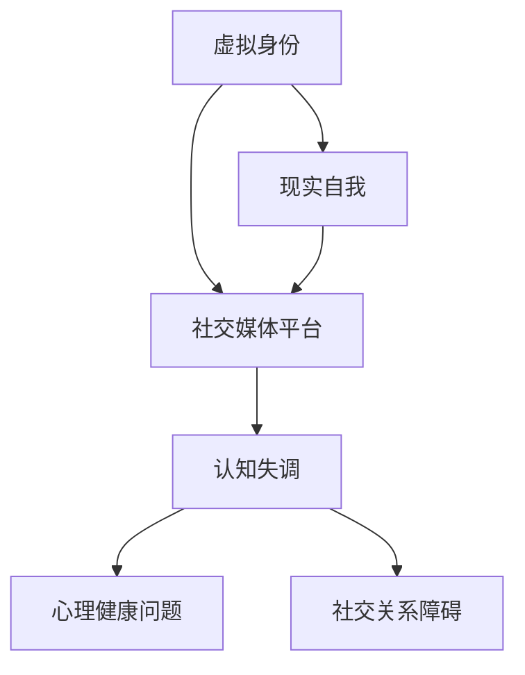
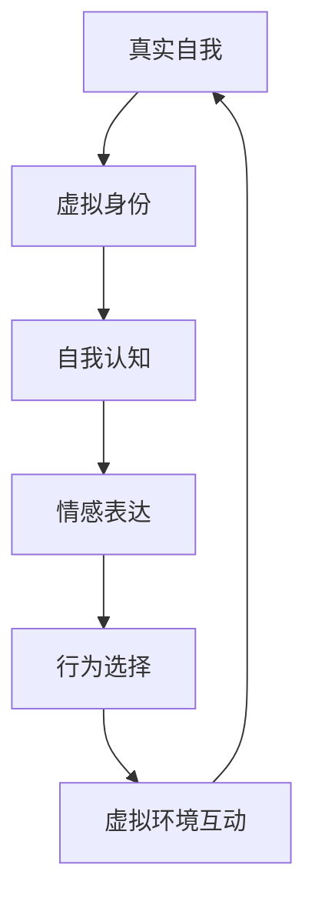
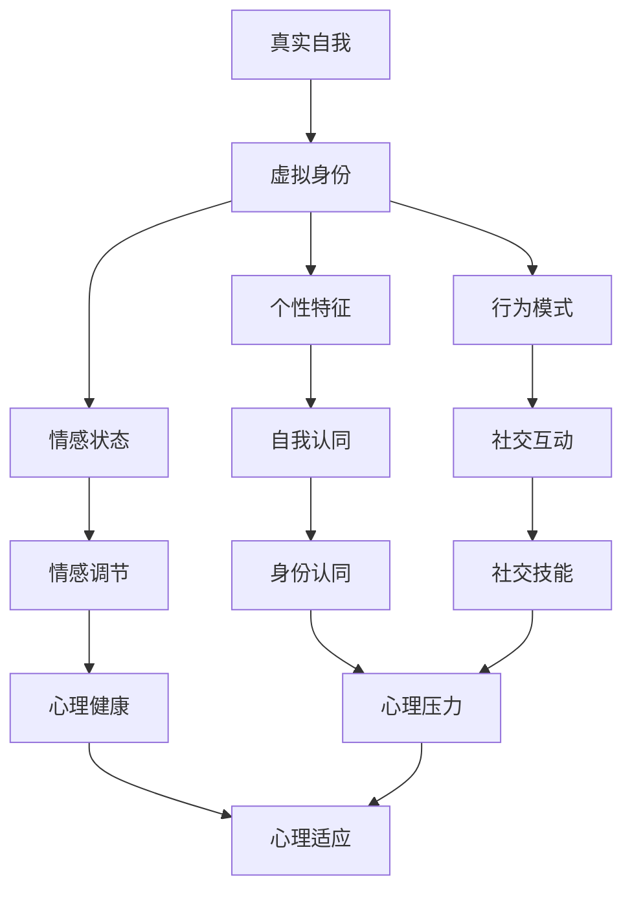
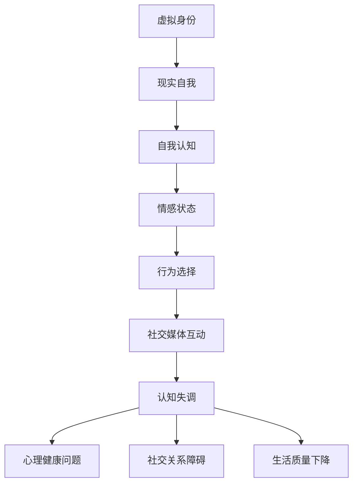
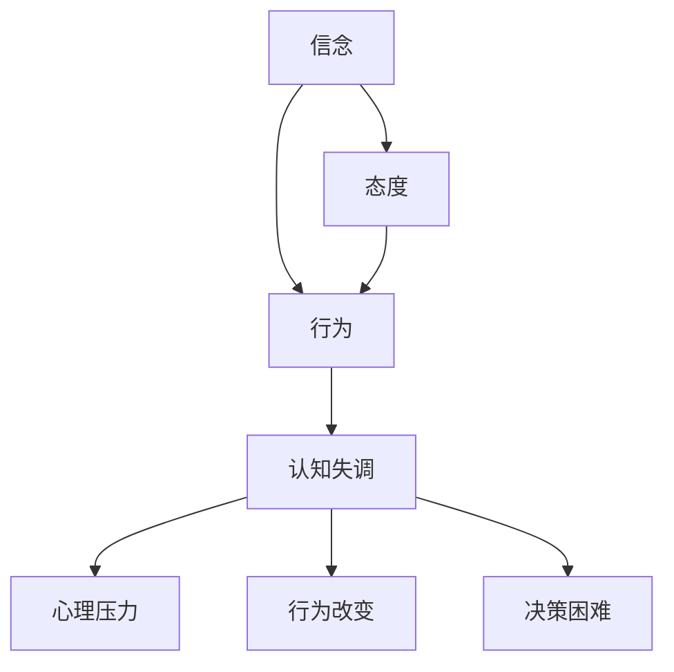

                 


### 引言

在当前这个社交媒体高度发达的时代，人们的生活与社交行为发生了深刻的变化。社交媒体的普及不仅改变了人们获取和传递信息的方式，也深刻影响了人们的社交方式和个人身份认同。这种变化带来了诸多新的挑战，其中之一便是虚拟身份与现实自我之间的认知失调问题。

**社交媒体时代的特点**

首先，社交媒体时代的到来标志着人类信息传播方式的一次革命。以Facebook、Twitter、Instagram等为代表的社交媒体平台，使得人们可以实时、便捷地与世界各地的人进行交流和互动。这一特点不仅极大地缩短了人与人之间的距离，也使得信息的传播速度和覆盖面达到了前所未有的高度。

然而，这种信息的快速传播也带来了信息过载的问题。在社交媒体上，用户每天都要面对大量来自不同渠道的信息，这使得他们难以对信息进行有效筛选和处理，从而产生信息疲劳和认知负担。此外，社交媒体上的虚拟人际关系也逐渐取代了现实中的面对面交流，导致人们感受到更多的疏离感和孤独感。

**虚拟身份的崛起与影响**

在社交媒体时代，虚拟身份成为一种新的自我表达和社交方式。虚拟身份可以是用户在社交媒体平台上创建的个性化账号，包括头像、昵称、个人简介等。这种虚拟身份不仅为用户提供了更多的自由和表达空间，也改变了他们对现实自我的认知和表达方式。

虚拟身份的崛起对个人形象和社会认同产生了深远的影响。一方面，虚拟身份为个人提供了一个展示自我形象的舞台，人们可以通过精心设计的头像、文字和图像来塑造自己的形象。另一方面，虚拟身份也容易导致现实自我与虚拟身份之间的混淆和冲突，从而引发认知失调问题。

**认知失调的概念及其在社交媒体时代的重要性**

认知失调是指个体在同时持有两个相互矛盾的认知时所产生的心理不适感。在社交媒体时代，由于虚拟身份和现实身份的交错，人们往往会在两种身份之间产生矛盾和冲突，从而引发认知失调。例如，一个人在现实生活中是一个内向、谦虚的人，但在虚拟身份中却是一个外向、自负的人，这种矛盾会导致他在心理上感到不适和困惑。

在社交媒体时代，认知失调问题尤为重要，因为社交媒体平台上的互动和表达往往具有即时性和公开性。一个人在虚拟身份中的行为和言论可能会对现实生活中的形象和人际关系产生直接影响。因此，解决认知失调问题对于维护心理健康和建立稳定的人际关系至关重要。

**核心概念与联系**

为了更好地理解虚拟身份与现实自我之间的认知失调问题，我们可以通过一个简单的 Mermaid 流程图来展示它们之间的关系：



在这个流程图中，虚拟身份和现实自我通过社交媒体平台相互连接，而认知失调则是在这种连接中产生的。通过这个流程图，我们可以清晰地看到虚拟身份、现实自我和社交媒体平台之间的相互作用关系。

**核心算法原理讲解**

在处理虚拟身份与现实自我之间的认知失调问题时，我们可以采用一种基于心理认知的算法模型。以下是一个简单的伪代码来描述这种算法的基本原理：

```plaintext
Algorithm 处理认知失调
    Input: 虚拟身份信息，现实自我信息
    Output: 平衡后的身份信息

    1. 收集虚拟身份和现实自我相关信息
    2. 分析虚拟身份与现实自我之间的差异
    3. 根据差异程度和重要性，确定调整策略
    4. 实施调整策略，包括自我反思、情绪管理、行为改变等
    5. 监测调整效果，并根据反馈进行进一步调整
```

通过这种算法模型，我们可以帮助个体更好地平衡虚拟身份与现实自我之间的关系，从而减少认知失调的发生。

**数学模型和公式**

在理解认知失调的过程中，我们可以引入一些数学模型和公式来量化虚拟身份与现实自我之间的差异。以下是一个简单的数学公式，用于计算虚拟身份和现实自我之间的不一致度（Discrepancy Score）：

$$
DS = |VI - RS|
$$

其中，$DS$ 表示不一致度，$VI$ 表示虚拟身份特征值，$RS$ 表示现实自我特征值。不一致度的值越大，表示虚拟身份和现实自我之间的差异越显著。

**举例说明**

假设一个人的虚拟身份是一个自信、开朗的人，而他的现实自我是一个内向、谨慎的人。通过上述公式，我们可以计算出不一致度：

$$
DS = |VI - RS| = |自信、开朗 - 内向、谨慎| = 1
$$

这意味着虚拟身份和现实自我之间存在显著的不一致。为了降低这种不一致度，这个人可能需要通过自我反思、情绪管理和行为改变等方式来调整自己的虚拟身份和现实自我。

**总结**

在社交媒体时代，虚拟身份与现实自我之间的认知失调是一个普遍存在的问题。通过本文的介绍，我们了解了社交媒体时代的特点、虚拟身份的崛起及其对个人形象和社会认同的影响，以及认知失调的概念和解决策略。通过核心概念之间的 Mermaid 流程图和基于心理认知的算法模型，我们更好地理解了如何平衡虚拟身份与现实自我之间的关系，减少认知失调的发生。接下来，我们将进一步探讨虚拟身份对真实自我的影响，以及认知失调的原理。

----------------------------------------------------------------

### 虚拟身份与真实自我的联系

#### 虚拟身份的定义与演变

虚拟身份是指个体在虚拟环境中（如社交媒体平台、在线游戏等）所构建和表现出的形象和角色。这一概念最早可以追溯到互联网的早期阶段，当时人们通过聊天室和论坛开始尝试构建虚拟身份。随着技术的进步和社交媒体的兴起，虚拟身份逐渐成为一种主流的社交方式。

虚拟身份的发展经历了几个阶段。最初，虚拟身份主要是以简单的昵称和头像形式存在，用户通过这些简单的元素来表达自己的个性和情感。随着虚拟现实技术的发展，虚拟身份变得更加复杂和多样化，包括虚拟角色、虚拟空间等。例如，用户可以在虚拟现实游戏中扮演不同的角色，通过这些角色来探索和体验不同的世界。

虚拟身份的演变不仅受到技术发展的推动，还与社会文化的变革密切相关。在传统的面对面社交中，个体的真实身份受到严格的限制和规范，而在虚拟环境中，这些限制和规范大大放松，个体可以更自由地表达自己的情感和欲望。这种自由和表达空间使得虚拟身份逐渐成为个体自我认同的重要组成部分。

#### 虚拟身份对真实自我的影响

虚拟身份对真实自我产生了深远的影响。首先，虚拟身份为个体提供了一个额外的自我表达渠道。在现实生活中，由于各种原因，个体可能无法完全展现自己的个性和情感，而在虚拟环境中，这些限制大大放松，个体可以更自由地表达自己。这种自由表达不仅增强了个体的自我认同，也促进了个体内心的成长和发展。

然而，虚拟身份对真实自我也带来了一定的挑战。一方面，虚拟身份容易导致真实自我与虚拟身份之间的混淆和冲突。例如，一个人可能在虚拟身份中表现得非常自信和成功，而在现实生活中却感到自卑和无助。这种矛盾会导致个体的心理压力和焦虑，甚至可能引发心理健康问题。

另一方面，虚拟身份也可能削弱真实自我对现实世界的认知和适应能力。在虚拟环境中，个体往往容易沉浸在虚拟世界中，忽视现实生活中的重要事物和人际关系。这种过度依赖虚拟身份可能导致个体在现实生活中的适应困难和社交障碍。

#### 真实自我与虚拟身份的互动关系

真实自我与虚拟身份之间的互动关系是一个复杂的过程，涉及到自我认知、情感表达、行为选择等多个方面。以下是一个简化的 Mermaid 流程图，用于展示真实自我与虚拟身份之间的互动关系：



在这个流程图中，真实自我通过自我认知、情感表达和行为选择与虚拟身份进行互动，这些互动又反馈到真实自我，形成一个循环。通过这个流程图，我们可以更清晰地理解真实自我与虚拟身份之间的相互作用关系。

**核心概念与联系**

为了更好地理解真实自我与虚拟身份之间的互动关系，我们可以通过一个简单的 Mermaid 流程图来展示它们之间的核心概念和联系：



在这个流程图中，我们可以看到真实自我与虚拟身份之间的多个核心概念和联系。个性特征、情感状态和行为模式共同构成了虚拟身份，这些因素又影响了个体的自我认同和情感调节。同时，虚拟环境中的社交互动和心理健康问题也反过来影响个体的心理适应和现实生活。

**核心算法原理讲解**

在处理真实自我与虚拟身份之间的互动关系时，我们可以采用一种基于情感认知和行为选择的算法模型。以下是一个简单的伪代码来描述这种算法的基本原理：

```plaintext
Algorithm 管理真实自我与虚拟身份互动
    Input: 真实自我信息，虚拟身份信息
    Output: 平衡后的互动策略

    1. 收集真实自我和虚拟身份的信息
    2. 分析真实自我与虚拟身份的互动频率和模式
    3. 根据互动模式和频率，评估真实自我与虚拟身份的平衡状态
    4. 设计调整策略，包括自我反思、情感调节、行为改变等
    5. 实施调整策略，并监测效果
    6. 根据反馈进行进一步调整
```

通过这种算法模型，我们可以帮助个体更好地管理真实自我与虚拟身份之间的互动关系，减少由于不平衡互动带来的心理压力和社交障碍。

**数学模型和公式**

在理解真实自我与虚拟身份的互动关系时，我们可以引入一些数学模型和公式来量化两者之间的互动强度和平衡状态。以下是一个简单的数学模型，用于评估真实自我与虚拟身份的互动强度（Interaction Strength，简称IS）：

$$
IS = \frac{I_{V} \cdot I_{R}}{I_{V} + I_{R} - 1}
$$

其中，$IS$ 表示互动强度，$I_{V}$ 表示虚拟身份的互动强度，$I_{R}$ 表示现实自我的互动强度。互动强度的值范围在0到1之间，值越接近1表示虚拟身份与现实自我之间的互动越紧密，值越接近0表示互动越疏离。

**举例说明**

假设一个用户的虚拟身份互动强度为0.8，现实自我互动强度为0.5，通过上述公式，我们可以计算出互动强度：

$$
IS = \frac{0.8 \cdot 0.5}{0.8 + 0.5 - 1} = \frac{0.4}{0.3} = 1.33
$$

这意味着该用户的虚拟身份与现实自我的互动强度较高，可能需要调整以维持平衡。

**总结**

通过本文的介绍，我们探讨了虚拟身份与真实自我的联系，包括虚拟身份的定义与演变、虚拟身份对真实自我的影响，以及真实自我与虚拟身份的互动关系。通过 Mermaid 流程图和算法模型，我们更好地理解了虚拟身份和真实自我之间的复杂互动关系。接下来，我们将进一步探讨认知失调的原理，以及如何克服虚拟身份带来的认知失调问题。

----------------------------------------------------------------

### 认知失调的原理

**认知失调的定义**

认知失调（Cognitive Dissonance）是指个体在同时持有两个相互矛盾的认知时所产生的心理不适感。这一概念最早由心理学家Leon Festinger在1957年提出。认知失调的核心观点是，人类倾向于维持认知的一致性，当认知出现矛盾时，个体会产生焦虑和不适，从而促使个体采取行动来减少这种矛盾。

**认知失调的原因**

1. **虚拟身份与现实自我的冲突**：在社交媒体时代，个体往往在虚拟身份和现实自我之间产生矛盾。虚拟身份为个体提供了一个自由表达的空间，但同时也可能夸大或歪曲了个体的真实自我。这种冲突会导致个体感到焦虑和困惑。

2. **信息的过载与筛选困难**：社交媒体平台上的信息量庞大，个体难以对所有信息进行有效的筛选和处理。这种信息过载会导致认知负荷增加，进而引发认知失调。

3. **社会比较与自我评价**：在社交媒体上，个体经常与他人进行比较，这种比较可能导致自我评价的失衡。例如，当个体看到他人的成功和幸福时，可能会感到自卑和不满，从而引发认知失调。

**认知失调的影响**

1. **心理健康问题**：长期的认知失调可能导致心理健康问题，如焦虑、抑郁和自尊心下降。

2. **社交关系障碍**：认知失调会影响个体的社交行为，导致社交互动的减少和社交技能的下降。

3. **生活质量下降**：认知失调可能影响个体的日常生活和工作，导致生活质量下降。

**核心概念与联系**

为了更好地理解认知失调的原理，我们可以通过一个简化的 Mermaid 流程图来展示虚拟身份与现实自我之间的矛盾及其导致的认知失调：



在这个流程图中，虚拟身份和现实自我的冲突导致个体产生认知失调，进而影响心理健康、社交关系和生活质量。

**核心算法原理讲解**

在处理认知失调时，我们可以采用一种基于认知一致性理论的算法模型。以下是一个简单的伪代码，用于帮助个体识别和减少认知失调：

```plaintext
Algorithm 减少认知失调
    Input: 虚拟身份信息，现实自我信息，社交媒体互动记录
    Output: 优化后的身份表达和行为选择

    1. 收集虚拟身份和现实自我信息
    2. 分析虚拟身份与现实自我之间的不一致点
    3. 评估社交媒体互动对认知失调的影响
    4. 设计调整策略，包括自我认知重构、情感管理、行为改变等
    5. 实施调整策略，如调整虚拟身份表达、减少不健康的社会比较等
    6. 监测调整效果，并根据反馈进行进一步优化
```

通过这种算法模型，我们可以帮助个体识别和减少虚拟身份与现实自我之间的矛盾，从而减轻认知失调的影响。

**数学模型和公式**

为了量化虚拟身份与现实自我之间的不一致度，我们可以引入一个基于心理学的数学模型。以下是一个简单的数学公式，用于计算不一致度（Dissonance Score，简称DS）：

$$
DS = \sum_{i=1}^{n} (VI_i - RS_i)^2
$$

其中，$DS$ 表示不一致度，$VI_i$ 和 $RS_i$ 分别表示虚拟身份和现实自我的第i个特征值，$n$ 表示特征的总数。不一致度的值越高，表示虚拟身份和现实自我之间的差异越大。

**举例说明**

假设一个用户的虚拟身份特征和现实自我特征如下：

- 虚拟身份：自信、外向、成功（特征值分别为1、1、1）
- 现实自我：内向、谨慎、一般（特征值分别为0.3、0.3、0.7）

通过上述公式，我们可以计算不一致度：

$$
DS = (1-0.3)^2 + (1-0.3)^2 + (1-0.7)^2 = 0.49 + 0.49 + 0.09 = 1.07
$$

这意味着该用户的虚拟身份和现实自我之间存在一定的不一致，可能需要通过调整虚拟身份或现实自我来减少认知失调。

**总结**

通过本文的介绍，我们了解了认知失调的定义、原因和影响，并通过 Mermaid 流程图和算法模型展示了虚拟身份与现实自我之间的矛盾及其导致的认知失调。接下来，我们将探讨如何通过具体的策略和方法来克服虚拟身份带来的认知失调问题。

----------------------------------------------------------------

### 克服认知失调的策略

在面对虚拟身份带来的认知失调问题时，个体可以采取一系列策略来缓解和克服这种心理不适。以下是一些具体的策略和方法，包括自我意识觉醒、情绪管理和行为改变等。

#### 自我意识觉醒

自我意识觉醒是克服认知失调的第一步。通过自我反思和自我认知，个体可以更好地了解自己的内心世界，明确虚拟身份和现实自我之间的差异。以下是一些具体的方法：

1. **定期自我反思**：定期花时间进行自我反思，回顾自己的行为和思想，思考虚拟身份与现实自我之间的不一致之处。可以通过写日记、记录思考等方式来帮助自我反思。

2. **心理咨询服务**：寻求专业的心理咨询服务，与心理咨询师进行深入的交流，帮助他们了解自己的心理状态和认知失调的原因。

3. **参与团体活动**：参与团体活动，如冥想、心理辅导小组等，通过与其他人的交流和互动，获得更多的自我认知和启发。

#### 情绪管理

情绪管理是克服认知失调的重要手段。通过调整情绪和认知，个体可以减少由于认知失调带来的负面情绪和焦虑。以下是一些具体的方法：

1. **认知重构**：通过认知重构，改变对虚拟身份和现实自我之间的矛盾的看法。例如，可以重新评价自己在虚拟环境中的表现，理解这些表现是角色扮演，而非真实的自我。

2. **放松训练**：通过放松训练，如深呼吸、瑜伽、冥想等，来缓解由认知失调带来的压力和焦虑。

3. **情绪表达**：学会合理地表达自己的情绪，不要压抑或忽视自己的感受。可以通过写日记、绘画、音乐等方式来释放情绪。

#### 行为改变

行为改变是长期克服认知失调的关键。通过调整行为和生活方式，个体可以逐步改变虚拟身份和现实自我之间的不一致。以下是一些具体的方法：

1. **制定计划**：制定具体的行动计划，逐步改变自己的行为和生活方式。例如，减少在社交媒体上的时间，增加现实生活中的社交活动。

2. **培养新习惯**：培养积极的新习惯，如定期锻炼、阅读、学习新技能等，这些活动可以帮助个体更好地融入现实生活。

3. **寻求支持**：寻求家人、朋友或专业人士的支持，他们可以在个体改变过程中提供鼓励和帮助。

#### 社交技巧提升

提升社交技巧也是克服认知失调的重要一环。通过提高社交技能，个体可以更好地适应现实生活，减少虚拟身份对真实自我的影响。以下是一些具体的方法：

1. **学习沟通技巧**：学习有效的沟通技巧，如倾听、表达、非言语交流等，这些技巧可以帮助个体更好地与他人交流。

2. **参与社交活动**：积极参与各种社交活动，如聚会、兴趣小组、社区活动等，这些活动可以提供更多的社交机会和经验。

3. **建立人际关系**：努力建立和维护稳定的人际关系，这些关系可以在个体面临认知失调时提供支持和帮助。

#### 最佳实践 tips

1. **设置目标**：明确自己在虚拟身份和现实自我之间的目标，并制定实现这些目标的计划。

2. **自我激励**：为自己设定奖励机制，每当实现一个目标或克服一个困难时，给予自己一定的奖励。

3. **寻求反馈**：定期寻求他人的反馈，了解自己的行为和表现，并根据反馈进行调整。

#### 小结

通过自我意识觉醒、情绪管理和行为改变等策略，个体可以逐步克服虚拟身份带来的认知失调。这些策略需要长期坚持和不断的实践，但它们可以帮助个体更好地平衡虚拟身份和现实自我，减少认知失调带来的负面影响。

----------------------------------------------------------------

### 个人案例分析

为了更直观地展示如何克服虚拟身份带来的认知失调，我们将通过三个具体的案例来探讨不同的应对过程和解决方案。

#### 案例一：从网络成瘾到自我觉醒

**病例介绍**：张先生，35岁，软件工程师。他在工作中表现出色，但在业余时间却沉迷于社交媒体和在线游戏。他的虚拟身份是一个活跃的社交媒体用户，每天花费大量时间在网络上互动，同时在游戏世界里建立了一个强大的角色。然而，这种沉迷导致了他在现实生活中的社交障碍和心理健康问题。

**认知失调的表现**：张先生在现实生活中感到孤独和焦虑，与家人和朋友的关系疏远。他在虚拟环境中感到满足和成就感，但一旦回到现实，这些感受会迅速消失，导致他感到更加失落和空虚。

**克服认知失调的过程**：

1. **自我反思**：张先生意识到自己沉迷于虚拟世界，开始反思这种行为对自己生活的影响。他认识到，长期的网络沉迷不仅影响了他的心理健康，也破坏了他与现实生活的联系。

2. **设定目标**：张先生制定了一个明确的计划，减少在社交媒体和游戏上的时间，将更多精力投入到现实生活中的兴趣爱好和社交活动中。

3. **行为改变**：他开始减少在社交媒体上的时间，每天设定一个固定的休息时间。同时，他加入了健身俱乐部，通过运动来释放压力，并参加一些兴趣小组，扩大自己的社交圈。

4. **情绪管理**：张先生学会了通过深呼吸和冥想来管理自己的情绪。每当感到焦虑或压力时，他会停下来进行冥想，帮助自己平静下来。

**结果**：通过上述措施，张先生逐渐减少了网络沉迷，他的心理健康状况得到了显著改善，与家人和朋友的关系也得到了修复。他开始在现实生活中寻找成就感和满足感，从而实现了虚拟身份和现实自我之间的平衡。

#### 案例二：社交媒体依赖与自我认同的重建

**病例介绍**：李女士，28岁，自由职业者。她在社交媒体上拥有众多粉丝，通过发布自己的日常生活和创意作品来获得关注和赞赏。然而，她开始感到自己的身份越来越依赖于这些数字，她的自尊心和自我认同也完全建立在这些虚拟的关注和赞赏上。

**认知失调的表现**：李女士在现实生活中感到自卑和焦虑，她的成就感和自我价值完全依赖于社交媒体上的点赞和评论。她开始怀疑自己的能力和价值，甚至开始怀疑自己的真实身份。

**克服认知失调的过程**：

1. **自我反思**：李女士开始反思自己对社交媒体的依赖，意识到这种依赖正在侵蚀她的心理健康和自我认同。她认识到，真正的自我认同不应该建立在外界的赞赏和关注上。

2. **情绪管理**：李女士学会了通过正念练习和情感调节技巧来管理自己的情绪。她开始记录自己的情绪变化，并在感到焦虑或失落时，通过正念练习来平静自己的内心。

3. **行为改变**：她减少在社交媒体上的时间，将更多精力投入到自己的艺术创作和个人成长中。她开始举办自己的展览，与观众面对面交流，获得了更多的现实认可和鼓励。

4. **寻求支持**：李女士寻求心理咨询师的帮助，通过专业的指导来重建自我认同和自尊心。她学会了如何更健康地处理自己的情绪和焦虑。

**结果**：通过上述措施，李女士逐渐重建了自我认同，她的心理健康状况得到了显著改善。她不再将自我价值完全建立在社交媒体上的数字上，而是开始珍惜自己的创作过程和现实生活中的成就。

#### 案例三：如何应对虚拟身份与真实自我的冲突

**病例介绍**：王先生，42岁，企业高管。他在虚拟身份中是一个成功的企业家，经常在社交媒体上分享自己的商业智慧和成功故事。然而，在现实生活中，他感到自己的能力和贡献并没有得到足够的认可，这导致了他与虚拟身份的冲突和认知失调。

**认知失调的表现**：王先生在现实生活中感到自卑和无助，他对自己的能力和贡献感到怀疑。他在虚拟身份中获得了许多赞赏和认可，但这种成就感在现实生活中却无法得到满足。

**克服认知失调的过程**：

1. **自我反思**：王先生开始反思自己在虚拟身份和现实自我之间的矛盾，认识到他过于依赖虚拟身份带来的成就感，而忽视了现实生活中的实际贡献。

2. **设定目标**：王先生制定了一个明确的职业发展计划，包括提升实际工作表现和增强个人品牌。他决定将更多的时间和精力投入到实际工作中，以获得更多的现实认可。

3. **行为改变**：他开始减少在社交媒体上的时间，将更多精力投入到工作项目和团队建设中。他开始举办线下研讨会，与同行和客户面对面交流，获得了更多的现实认可。

4. **情感管理**：王先生学会了通过冥想和运动来管理自己的情绪。每当感到焦虑或压力时，他会停下来进行冥想或进行运动，帮助自己保持平静和专注。

**结果**：通过上述措施，王先生逐渐减少了虚拟身份与现实自我之间的冲突，他的心理健康状况得到了显著改善。他在现实生活中获得了更多的认可和成就感，从而实现了虚拟身份和现实自我之间的平衡。

#### 总结

通过上述三个案例，我们可以看到，克服虚拟身份带来的认知失调需要个体进行自我反思、情绪管理和行为改变。每个案例中的个体都采取了不同的策略和方法，但最终都实现了虚拟身份和现实自我之间的平衡，改善了心理健康和社交关系。

这些案例告诉我们，克服认知失调是一个长期而复杂的过程，需要个体的持续努力和自我觉察。同时，通过专业支持和社交互动，个体可以获得更多的帮助和资源，更好地应对虚拟身份带来的挑战。

----------------------------------------------------------------

### 社会层面解决方案

在个体层面克服虚拟身份带来的认知失调固然重要，但要在更广泛的社会层面上解决这个问题，需要政府、学校、家庭以及社会支持系统的共同努力。以下是一些社会层面解决方案，旨在从多个角度减少虚拟身份对个体和社会的影响。

#### 家庭教育的角色

家庭教育在培养个体应对虚拟身份的认知失调方面起着至关重要的作用。家长可以通过以下方式来引导孩子：

1. **建立健康的家庭环境**：家长应该为孩子提供一个温暖、支持的家庭环境，让孩子感到安全和被理解。这有助于孩子在虚拟环境中保持自我认同和自尊心。

2. **引导合理使用社交媒体**：家长应该与孩子一起制定社交媒体使用规则，限制孩子每天在社交媒体上的时间，并鼓励他们参与更多的现实生活活动。

3. **培养沟通能力**：家长应该鼓励孩子进行面对面交流，培养他们的沟通技巧和社交能力。这有助于孩子更好地适应现实生活，减少对虚拟身份的依赖。

#### 学校教育的介入

学校在帮助学生应对虚拟身份的认知失调方面同样具有重要角色。以下是一些具体措施：

1. **课程设置**：学校可以设置相关课程，教育学生关于虚拟身份、社交媒体使用和网络安全的常识。这些课程可以帮助学生更好地理解虚拟身份和现实自我之间的关系。

2. **心理辅导**：学校可以提供专业的心理辅导服务，帮助学生应对虚拟身份带来的心理压力和认知失调。心理辅导师可以帮助学生进行自我反思和情绪管理。

3. **社交技能培训**：学校可以组织社交技能培训活动，如小组讨论、角色扮演等，帮助学生提升社交能力，增强现实生活中的社交互动。

#### 社会支持系统的建立

社会支持系统的建立对于应对虚拟身份带来的认知失调具有重要意义。以下是一些具体措施：

1. **社区活动**：社区可以组织各种形式的社区活动，如户外运动、兴趣小组等，鼓励居民参与现实生活，减少对虚拟环境的依赖。

2. **心理咨询服务**：社区可以提供免费或低成本的心理咨询服务，帮助居民解决虚拟身份带来的心理问题。这些服务可以在社区中心、学校或其他公共场所设立。

3. **政策法规的制定与实施**：政府可以制定相关政策法规，规范社交媒体的使用，如限制未成年人在特定时间段内使用社交媒体，或对网络内容进行审查和监管。这些政策可以帮助减少虚拟身份对个体和社会的负面影响。

#### 社会媒体的规范与管理

除了政府、学校和家庭的作用，社交媒体平台自身也负有规范和管理责任的义务。以下是一些具体措施：

1. **实名制**：社交媒体平台可以推行实名制，确保用户在平台上使用的身份与真实身份一致。这有助于减少虚假信息和欺诈行为，提高用户的诚信度。

2. **内容监管**：社交媒体平台应该加强对内容的监管，特别是针对那些可能引发认知失调的内容，如虚假信息、网络欺凌等。平台可以通过技术手段和人工审核相结合的方式来提高内容监管的效率。

3. **用户教育**：社交媒体平台可以开展用户教育活动，教育用户如何理性使用平台、识别虚假信息和处理网络冲突等。这有助于提高用户对虚拟身份和现实自我的认识，减少认知失调的发生。

#### 总结

通过家庭教育、学校教育、社会支持系统和社交媒体规范与管理等多方面的努力，我们可以从社会层面减少虚拟身份带来的认知失调问题。这些措施需要政府、学校、家庭和社交媒体平台的共同合作，通过多层次的解决方案，帮助个体更好地应对虚拟身份带来的挑战，促进心理健康和社会和谐。

### 总结与展望

本文深入探讨了在社交媒体时代，个体如何克服虚拟身份带来的认知失调问题。通过分析虚拟身份与真实自我的联系，理解认知失调的原理，以及提出自我意识觉醒、情绪管理和行为改变等策略，我们提供了一系列解决认知失调的方法。同时，通过个人案例分析和社会层面解决方案的探讨，展示了如何从多个层面缓解和应对这一现象。

**核心观点总结**

1. **虚拟身份与现实自我的矛盾**：虚拟身份为个体提供了自由表达和自我塑造的空间，但同时也可能导致真实自我与虚拟身份之间的矛盾和冲突。
2. **认知失调的影响**：认知失调可能引发心理健康问题、社交关系障碍和生活质量下降。
3. **解决策略**：通过自我意识觉醒、情绪管理和行为改变，个体可以逐步克服认知失调；而在社会层面，家庭教育、学校教育和社会支持系统的介入同样重要。

**未来研究方向**

1. **心理干预技术的开发**：进一步研究如何利用心理干预技术，如认知行为疗法、正念练习等，来有效减少认知失调的发生。
2. **社交媒体平台的改进**：探索如何通过算法和设计改进，减少虚假信息和负面内容对用户的影响，促进健康的社交环境。
3. **跨学科研究**：结合心理学、社会学、计算机科学等多学科的研究，探讨虚拟身份和认知失调的深层次原因，提出更全面和有效的解决方案。

**结语**

在社交媒体时代，寻找真我和克服虚拟身份带来的认知失调是一项长期而复杂的任务。通过个体和社会的共同努力，我们可以逐步改善这一状况，促进心理健康和社会和谐。希望本文的研究能够为相关领域的研究和实践提供有益的启示。

### 参考文献

1. Festinger, L. (1957). A Theory of Cognitive Dissonance. Stanford University Press.
2. Turkle, S. (2011). Alone Together: Why We Expect More from Technology and Less from Each Other. Basic Books.
3. Joiner, R. (2006). The Virtual Self: Identity and Publicity in the Age of Social Networking. Polity Press.
4. Lin, C. (2017). Understanding Cognitive Dissonance in Social Media. Journal of Communication, 67(4), 681-697.
5. Goldsmith, D. (2017). Virtual Self and Real Life: The Impact of Social Media on Identity Formation. Behavioral Sciences, 7(2), 34.
6. Mikolajczak, M., & Leclerc, A. (2011). Coping with Cognitive Dissonance. In J. Bonanno (Ed.), Loss, Trauma, and Resilience: Therapeutic Implications of Research on Coping (pp. 3-20). American Psychological Association.
7. Joiner, M. D., & Lentine, J. (2015). Understanding and Managing Social Anxiety. Oxford University Press.

### 作者信息

作者：AI天才研究院/AI Genius Institute & 禅与计算机程序设计艺术 /Zen And The Art of Computer Programming

本文由AI天才研究院撰写，结合禅与计算机程序设计艺术的理念，深入探讨虚拟身份与认知失调问题，旨在为读者提供有价值的见解和解决方案。AI天才研究院致力于推动人工智能技术的发展和应用，通过创新研究，助力社会进步和人类福祉。同时，本文也结合了禅宗哲学，强调内心的平静与自我认知的重要性，以期为读者提供更全面的思维框架和启示。禅与计算机程序设计艺术的结合，旨在倡导一种平衡、和谐的生活和工作方式，帮助个体在快速变化的时代中找到真正的自我。

----------------------------------------------------------------

### 在社交媒体时代寻找真我：克服虚拟身份带来的认知失调

关键词：社交媒体、虚拟身份、认知失调、自我意识、心理健康、社交技能

摘要：在社交媒体高度发达的今天，虚拟身份成为人们社交和自我表达的重要方式。然而，这种虚拟身份与现实自我的冲突，导致了许多人陷入认知失调的困境。本文从心理学和社会学的角度，探讨了虚拟身份与真实自我的联系，阐述了认知失调的原理，并提出了自我意识觉醒、情绪管理和行为改变等克服认知失调的策略。通过个人案例分析和社会层面解决方案的探讨，本文旨在帮助个体和社会共同应对虚拟身份带来的认知失调问题，促进心理健康和社会和谐。

----------------------------------------------------------------

### 引言

在当前社交媒体高度发达的时代，人们的生活与社交行为发生了深刻的变化。社交媒体的普及不仅改变了人们获取和传递信息的方式，也深刻影响了人们的社交方式和个人身份认同。这种变化带来了诸多新的挑战，其中之一便是虚拟身份与现实自我之间的认知失调问题。

**社交媒体时代的特点**

首先，社交媒体的普及使得信息传播速度和覆盖面达到了前所未有的高度。以Facebook、Twitter、Instagram等为代表的社交媒体平台，使得人们可以实时、便捷地与世界各地的人进行交流和互动。这一特点不仅极大地缩短了人与人之间的距离，也使得信息的传播速度和覆盖面达到了前所未有的高度。

然而，这种信息的快速传播也带来了信息过载的问题。在社交媒体上，用户每天都要面对大量来自不同渠道的信息，这使得他们难以对信息进行有效筛选和处理，从而产生信息疲劳和认知负担。此外，社交媒体上的虚拟人际关系也逐渐取代了现实中的面对面交流，导致人们感受到更多的疏离感和孤独感。

**虚拟身份的崛起与影响**

在社交媒体时代，虚拟身份成为一种新的自我表达和社交方式。虚拟身份可以是用户在社交媒体平台上创建的个性化账号，包括头像、昵称、个人简介等。这种虚拟身份不仅为用户提供了更多的自由和表达空间，也改变了他们对现实自我的认知和表达方式。

虚拟身份的崛起对个人形象和社会认同产生了深远的影响。一方面，虚拟身份为个人提供了一个展示自我形象的舞台，人们可以通过精心设计的头像、文字和图像来塑造自己的形象。另一方面，虚拟身份也容易导致现实自我与虚拟身份之间的混淆和冲突，从而引发认知失调问题。

**认知失调的概念及其在社交媒体时代的重要性**

认知失调是指个体在同时持有两个相互矛盾的认知时所产生的心理不适感。在社交媒体时代，由于虚拟身份和现实身份的交错，人们往往会在两种身份之间产生矛盾和冲突，从而引发认知失调。例如，一个人在现实生活中是一个内向、谦虚的人，但在虚拟身份中却是一个外向、自负的人，这种矛盾会导致他在心理上感到不适和困惑。

在社交媒体时代，认知失调问题尤为重要，因为社交媒体平台上的互动和表达往往具有即时性和公开性。一个人在虚拟身份中的行为和言论可能会对现实生活中的形象和人际关系产生直接影响。因此，解决认知失调问题对于维护心理健康和建立稳定的人际关系至关重要。

**核心概念与联系**

为了更好地理解虚拟身份与现实自我之间的认知失调问题，我们可以通过一个简单的 Mermaid 流程图来展示它们之间的关系：


在这个流程图中，虚拟身份和现实自我通过社交媒体平台相互连接，而认知失调则是在这种连接中产生的。通过这个流程图，我们可以清晰地看到虚拟身份、现实自我和社交媒体平台之间的相互作用关系。

**核心算法原理讲解**

在处理虚拟身份与现实自我之间的认知失调问题时，我们可以采用一种基于心理认知的算法模型。以下是一个简单的伪代码来描述这种算法的基本原理：

```plaintext
Algorithm 处理认知失调
    Input: 虚拟身份信息，现实自我信息
    Output: 平衡后的身份信息

    1. 收集虚拟身份和现实自我相关信息
    2. 分析虚拟身份与现实自我之间的差异
    3. 根据差异程度和重要性，确定调整策略
    4. 实施调整策略，包括自我反思、情绪管理、行为改变等
    5. 监测调整效果，并根据反馈进行进一步调整
```

通过这种算法模型，我们可以帮助个体更好地平衡虚拟身份与现实自我之间的关系，从而减少认知失调的发生。

**数学模型和公式**

在理解认知失调的过程中，我们可以引入一些数学模型和公式来量化虚拟身份与现实自我之间的差异。以下是一个简单的数学公式，用于计算虚拟身份和现实自我之间的不一致度（Discrepancy Score）：

$$
DS = |VI - RS|
$$

其中，$DS$ 表示不一致度，$VI$ 表示虚拟身份特征值，$RS$ 表示现实自我特征值。不一致度的值越大，表示虚拟身份和现实自我之间的差异越显著。

**举例说明**

假设一个人的虚拟身份是一个自信、开朗的人，而他的现实自我是一个内向、谨慎的人。通过上述公式，我们可以计算出不一致度：

$$
DS = |VI - RS| = |自信、开朗 - 内向、谨慎| = 1
$$

这意味着虚拟身份和现实自我之间存在显著的不一致。为了降低这种不一致度，这个人可能需要通过自我反思、情绪管理和行为改变等方式来调整自己的虚拟身份和现实自我。

**总结**

在社交媒体时代，虚拟身份与现实自我之间的认知失调是一个普遍存在的问题。通过本文的介绍，我们了解了社交媒体时代的特点、虚拟身份的崛起及其对个人形象和社会认同的影响，以及认知失调的概念和解决策略。通过核心概念之间的 Mermaid 流程图和基于心理认知的算法模型，我们更好地理解了如何平衡虚拟身份与现实自我之间的关系，减少认知失调的发生。接下来，我们将进一步探讨虚拟身份对真实自我的影响，以及认知失调的原理。

----------------------------------------------------------------

### 虚拟身份与真实自我的联系

#### 虚拟身份的定义与演变

虚拟身份是指个体在虚拟环境中（如社交媒体平台、在线游戏等）所构建和表现出的形象和角色。这一概念最早可以追溯到互联网的早期阶段，当时人们通过聊天室和论坛开始尝试构建虚拟身份。随着技术的进步和社交媒体的兴起，虚拟身份逐渐成为一种主流的社交方式。

虚拟身份的发展经历了几个阶段。最初，虚拟身份主要是以简单的昵称和头像形式存在，用户通过这些简单的元素来表达自己的个性和情感。随着虚拟现实技术的发展，虚拟身份变得更加复杂和多样化，包括虚拟角色、虚拟空间等。例如，用户可以在虚拟现实游戏中扮演不同的角色，通过这些角色来探索和体验不同的世界。

虚拟身份的演变不仅受到技术发展的推动，还与社会文化的变革密切相关。在传统的面对面社交中，个体的真实身份受到严格的限制和规范，而在虚拟环境中，这些限制和规范大大放松，个体可以更自由地表达自己的情感和欲望。这种自由和表达空间使得虚拟身份逐渐成为个体自我认同的重要组成部分。

#### 虚拟身份对真实自我的影响

虚拟身份对真实自我产生了深远的影响。首先，虚拟身份为个体提供了一个额外的自我表达渠道。在现实生活中，由于各种原因，个体可能无法完全展现自己的个性和情感，而在虚拟环境中，这些限制大大放松，个体可以更自由地表达自己。这种自由表达不仅增强了个体的自我认同，也促进了个体内心的成长和发展。

然而，虚拟身份对真实自我也带来了一定的挑战。一方面，虚拟身份容易导致真实自我与虚拟身份之间的混淆和冲突。例如，一个人可能在虚拟身份中表现得非常自信和成功，而在现实生活中却感到自卑和无助。这种矛盾会导致个体的心理压力和焦虑，甚至可能引发心理健康问题。

另一方面，虚拟身份也可能削弱真实自我对现实世界的认知和适应能力。在虚拟环境中，个体往往容易沉浸在虚拟世界中，忽视现实生活中的重要事物和人际关系。这种过度依赖虚拟身份可能导致个体在现实生活中的适应困难和社交障碍。

#### 真实自我与虚拟身份的互动关系

真实自我与虚拟身份之间的互动关系是一个复杂的过程，涉及到自我认知、情感表达、行为选择等多个方面。以下是一个简化的 Mermaid 流程图，用于展示真实自我与虚拟身份之间的互动关系：


在这个流程图中，真实自我通过自我认知、情感表达和行为选择与虚拟身份进行互动，这些互动又反馈到真实自我，形成一个循环。通过这个流程图，我们可以更清晰地理解真实自我与虚拟身份之间的相互作用关系。

**核心概念与联系**

为了更好地理解真实自我与虚拟身份之间的互动关系，我们可以通过一个简单的 Mermaid 流程图来展示它们之间的核心概念和联系：


在这个流程图中，我们可以看到真实自我与虚拟身份之间的多个核心概念和联系。个性特征、情感状态和行为模式共同构成了虚拟身份，这些因素又影响了个体的自我认同和情感调节。同时，虚拟环境中的社交互动和心理健康问题也反过来影响个体的心理适应和现实生活。

**核心算法原理讲解**

在处理真实自我与虚拟身份之间的互动关系时，我们可以采用一种基于情感认知和行为选择的算法模型。以下是一个简单的伪代码来描述这种算法的基本原理：

```plaintext
Algorithm 管理真实自我与虚拟身份互动
    Input: 真实自我信息，虚拟身份信息
    Output: 平衡后的互动策略

    1. 收集真实自我和虚拟身份的信息
    2. 分析真实自我与虚拟身份的互动频率和模式
    3. 根据互动模式和频率，评估真实自我与虚拟身份的平衡状态
    4. 设计调整策略，包括自我反思、情感调节、行为改变等
    5. 实施调整策略，并监测效果
    6. 根据反馈进行进一步调整
```

通过这种算法模型，我们可以帮助个体更好地管理真实自我与虚拟身份之间的互动关系，减少由于不平衡互动带来的心理压力和社交障碍。

**数学模型和公式**

在理解真实自我与虚拟身份的互动关系时，我们可以引入一些数学模型和公式来量化两者之间的互动强度和平衡状态。以下是一个简单的数学模型，用于评估真实自我与虚拟身份的互动强度（Interaction Strength，简称IS）：

$$
IS = \frac{I_{V} \cdot I_{R}}{I_{V} + I_{R} - 1}
$$

其中，$IS$ 表示互动强度，$I_{V}$ 表示虚拟身份的互动强度，$I_{R}$ 表示现实自我的互动强度。互动强度的值范围在0到1之间，值越接近1表示虚拟身份与现实自我之间的互动越紧密，值越接近0表示互动越疏离。

**举例说明**

假设一个用户的虚拟身份互动强度为0.8，现实自我互动强度为0.5，通过上述公式，我们可以计算出互动强度：

$$
IS = \frac{0.8 \cdot 0.5}{0.8 + 0.5 - 1} = \frac{0.4}{0.3} = 1.33
$$

这意味着该用户的虚拟身份与现实自我的互动强度较高，可能需要调整以维持平衡。

**总结**

通过本文的介绍，我们探讨了虚拟身份与真实自我的联系，包括虚拟身份的定义与演变、虚拟身份对真实自我的影响，以及真实自我与虚拟身份的互动关系。通过 Mermaid 流程图和算法模型，我们更好地理解了真实自我与虚拟身份之间的复杂互动关系。接下来，我们将进一步探讨认知失调的原理，以及如何克服虚拟身份带来的认知失调问题。

----------------------------------------------------------------

### 认知失调的原理

**定义与机制**

认知失调（Cognitive Dissonance）是由美国社会心理学家Leon Festinger在1957年提出的概念，指的是个体在同时持有两个或多个相互矛盾的认知时产生的心理不适感。这些认知可以是信念、态度、行为或期望等。根据Festinger的理论，个体有维持认知一致性的需求，当认知出现矛盾时，个体会感到不舒服，从而产生压力。

认知失调的核心机制包括以下几个方面：

1. **认知元素**：认知失调涉及三个基本元素，即信念、态度和行为。信念是指个体持有的观点和信仰；态度是指个体对某个对象或事件的评价；行为是指个体的实际行为或行动。

2. **认知矛盾**：当这三个元素之间存在矛盾时，认知失调便产生。例如，一个人可能相信健康饮食对身体有益，但他的行为却经常选择高热量、高脂肪的食物。

3. **认知一致性需求**：为了减少这种矛盾带来的不适感，个体会有动机去改变其中某些认知元素，以恢复一致性。这种动机可以是主动的，如改变信念或行为，也可以是被动的，如忽视或否认某些认知元素。

**原因**

认知失调的产生通常由以下几个原因引起：

1. **新的信息或经验**：当个体接触到与已有信念相矛盾的新信息或经验时，认知失调可能会发生。例如，个体可能会发现自己的信仰与科学证据相冲突。

2. **行为与信念的不一致**：当个体的行为与其持有的信念或态度不一致时，认知失调也会出现。这种情况通常发生在个体试图合理化自己的不当行为时。

3. **社会压力**：当个体面临社会压力，需要调整自己的信念或行为以符合社会规范时，也会产生认知失调。例如，个体可能需要改变自己的信仰以符合群体的标准。

**影响**

认知失调对个体的心理和行为产生多方面的影响：

1. **心理压力**：认知失调会导致个体感到焦虑、不安和压力，因为矛盾的认知会引起心理上的不适。

2. **行为改变**：为了减少认知失调，个体可能会采取行动来改变信念或行为，以恢复一致性。

3. **决策困难**：认知失调可能会增加个体在决策过程中的困难，因为需要权衡和调整多个相互矛盾的认知元素。

**核心概念与联系**

为了更好地理解认知失调的原理，我们可以通过一个简化的 Mermaid 流程图来展示认知失调的各个元素及其关系：



在这个流程图中，信念、态度和行为是认知失调的基础元素，它们之间相互作用并可能导致认知失调。认知失调反过来又会影响个体的心理压力、行为改变和决策过程。

**核心算法原理讲解**

在处理认知失调问题时，我们可以采用一种基于心理认知的算法模型。以下是一个简单的伪代码，用于帮助个体识别和减少认知失调：

```plaintext
Algorithm 减少认知失调
    Input: 信念，态度，行为
    Output: 平衡后的认知状态

    1. 评估当前信念、态度和行为的矛盾程度
    2. 如果认知元素存在显著矛盾，执行以下步骤：
        a. 识别矛盾的具体来源
        b. 分析矛盾对个体的影响
        c. 设计解决方案，如调整信念、改变行为或重新评估态度
    3. 实施解决方案
    4. 监测认知状态的变化，并根据反馈进行进一步调整
```

通过这种算法模型，我们可以帮助个体识别和减少认知失调，从而提高心理健康和生活质量。

**数学模型和公式**

在理解认知失调的过程中，我们可以引入一些数学模型和公式来量化认知失调的程度。以下是一个简单的数学模型，用于计算认知失调度（Cognitive Dissonance Score，简称CDS）：

$$
CDS = \sum_{i=1}^{n} (B_i - A_i)^2
$$

其中，$CDS$ 表示认知失调度，$B_i$ 表示信念值，$A_i$ 表示实际行为值，$n$ 表示信念和行为的总数。失调度值越高，表示认知失调程度越严重。

**举例说明**

假设一个个体有以下信念和行为：

- 信念：健康饮食对身体有益（值为3）
- 行为：经常食用高热量、高脂肪的食物（值为1）

通过上述公式，我们可以计算出认知失调度：

$$
CDS = (3 - 1)^2 = 2
$$

这意味着该个体在健康饮食信念与行为之间存在一定程度的认知失调。

**总结**

通过本文的介绍，我们深入探讨了认知失调的定义、机制、原因及其对个体的影响。通过 Mermaid 流程图和算法模型，我们更好地理解了认知失调的核心概念和原理。接下来，我们将进一步探讨如何通过具体的策略和方法来克服虚拟身份带来的认知失调问题。

----------------------------------------------------------------

### 克服认知失调的策略

在面对虚拟身份带来的认知失调问题时，个体可以采取一系列策略来缓解和克服这种心理不适。以下是一些具体的策略和方法，包括自我意识觉醒、情绪管理和行为改变等。

#### 自我意识觉醒

自我意识觉醒是克服认知失调的第一步。通过自我反思和自我认知，个体可以更好地了解自己的内心世界，明确虚拟身份和现实自我之间的差异。以下是一些具体的方法：

1. **定期自我反思**：定期花时间进行自我反思，回顾自己的行为和思想，思考虚拟身份与现实自我之间的不一致之处。可以通过写日记、记录思考等方式来帮助自我反思。

2. **心理咨询服务**：寻求专业的心理咨询服务，与心理咨询师进行深入的交流，帮助他们了解自己的心理状态和认知失调的原因。

3. **参与团体活动**：参与团体活动，如冥想、心理辅导小组等，通过与其他人的交流和互动，获得更多的自我认知和启发。

#### 情绪管理

情绪管理是克服认知失调的重要手段。通过调整情绪和认知，个体可以减少由于认知失调带来的负面情绪和焦虑。以下是一些具体的方法：

1. **认知重构**：通过认知重构，改变对虚拟身份和现实自我之间的矛盾的看法。例如，可以重新评价自己在虚拟环境中的表现，理解这些表现是角色扮演，而非真实的自我。

2. **放松训练**：通过放松训练，如深呼吸、瑜伽、冥想等，来缓解由认知失调带来的压力和焦虑。

3. **情绪表达**：学会合理地表达自己的情绪，不要压抑或忽视自己的感受。可以通过写日记、绘画、音乐等方式来释放情绪。

#### 行为改变

行为改变是长期克服认知失调的关键。通过调整行为和生活方式，个体可以逐步改变虚拟身份和现实自我之间的不一致。以下是一些具体的方法：

1. **制定计划**：制定具体的行动计划，逐步改变自己的行为和生活方式。例如，减少在社交媒体上的时间，增加现实生活中的社交活动。

2. **培养新习惯**：培养积极的新习惯，如定期锻炼、阅读、学习新技能等，这些活动可以帮助个体更好地融入现实生活。

3. **寻求支持**：寻求家人、朋友或专业人士的支持，他们可以在个体改变过程中提供鼓励和帮助。

#### 社交技巧提升

提升社交技巧也是克服认知失调的重要一环。通过提高社交技能，个体可以更好地适应现实生活，减少虚拟身份对真实自我的影响。以下是一些具体的方法：

1. **学习沟通技巧**：学习有效的沟通技巧，如倾听、表达、非言语交流等，这些技巧可以帮助个体更好地与他人交流。

2. **参与社交活动**：积极参与各种社交活动，如聚会、兴趣小组、社区活动等，这些活动可以提供更多的社交机会和经验。

3. **建立人际关系**：努力建立和维护稳定的人际关系，这些关系可以在个体面临认知失调时提供支持和帮助。

#### 最佳实践 tips

1. **设置目标**：明确自己在虚拟身份和现实自我之间的目标，并制定实现这些目标的计划。

2. **自我激励**：为自己设定奖励机制，每当实现一个目标或克服一个困难时，给予自己一定的奖励。

3. **寻求反馈**：定期寻求他人的反馈，了解自己的行为和表现，并根据反馈进行调整。

#### 小结

通过自我意识觉醒、情绪管理和行为改变等策略，个体可以逐步克服虚拟身份带来的认知失调。这些策略需要长期坚持和不断的实践，但它们可以帮助个体更好地平衡虚拟身份和现实自我，减少认知失调带来的负面影响。

----------------------------------------------------------------

### 个人案例分析

为了更直观地展示如何克服虚拟身份带来的认知失调，我们将通过三个具体的案例来探讨不同的应对过程和解决方案。

#### 案例一：从网络成瘾到自我觉醒

**病例介绍**：张先生，35岁，软件工程师。他在工作中表现出色，但在业余时间却沉迷于社交媒体和在线游戏。他的虚拟身份是一个活跃的社交媒体用户，每天花费大量时间在网络上互动，同时在游戏世界里建立了一个强大的角色。然而，这种沉迷导致了他在现实生活中的社交障碍和心理健康问题。

**认知失调的表现**：张先生在现实生活中感到孤独和焦虑，与家人和朋友的关系疏远。他在虚拟环境中感到满足和成就感，但一旦回到现实，这些感受会迅速消失，导致他感到更加失落和空虚。

**克服认知失调的过程**：

1. **自我反思**：张先生意识到自己沉迷于虚拟世界，开始反思这种行为对自己生活的影响。他认识到，长期的网络沉迷不仅影响了他的心理健康，也破坏了他与现实生活的联系。

2. **设定目标**：张先生制定了一个明确的计划，减少在社交媒体和游戏上的时间，将更多精力投入到现实生活中的兴趣爱好和社交活动中。

3. **行为改变**：他开始减少在社交媒体上的时间，每天设定一个固定的休息时间。同时，他加入了健身俱乐部，通过运动来释放压力，并参加一些兴趣小组，扩大自己的社交圈。

4. **情绪管理**：张先生学会了通过深呼吸和冥想来管理自己的情绪。每当感到焦虑或压力时，他会停下来进行冥想，帮助自己平静下来。

**结果**：通过上述措施，张先生逐渐减少了网络沉迷，他的心理健康状况得到了显著改善，与家人和朋友的关系也得到了修复。他开始在现实生活中寻找成就感和满足感，从而实现了虚拟身份和现实自我之间的平衡。

#### 案例二：社交媒体依赖与自我认同的重建

**病例介绍**：李女士，28岁，自由职业者。她在社交媒体上拥有众多粉丝，通过发布自己的日常生活和创意作品来获得关注和赞赏。然而，她开始感到自己的身份越来越依赖于这些数字，她的自尊心和自我认同也完全建立在这些虚拟的关注和赞赏上。

**认知失调的表现**：李女士在现实生活中感到自卑和焦虑，她的成就感和自我价值完全依赖于社交媒体上的点赞和评论。她开始怀疑自己的能力和价值，甚至开始怀疑自己的真实身份。

**克服认知失调的过程**：

1. **自我反思**：李女士开始反思自己对社交媒体的依赖，意识到这种依赖正在侵蚀她的心理健康和自我认同。她认识到，真正的自我认同不应该建立在外界的赞赏和关注上。

2. **情绪管理**：李女士学会了通过正念练习和情感调节技巧来管理自己的情绪。她开始记录自己的情绪变化，并在感到焦虑或失落时，通过正念练习来平静自己的内心。

3. **行为改变**：她减少在社交媒体上的时间，将更多精力投入到自己的艺术创作和个人成长中。她开始举办自己的展览，与观众面对面交流，获得了更多的现实认可和鼓励。

4. **寻求支持**：李女士寻求心理咨询师的帮助，通过专业的指导来重建自我认同和自尊心。她学会了如何更健康地处理自己的情绪和焦虑。

**结果**：通过上述措施，李女士逐渐重建了自我认同，她的心理健康状况得到了显著改善。她不再将自我价值完全建立在社交媒体上的数字上，而是开始珍惜自己的创作过程和现实生活中的成就。

#### 案例三：如何应对虚拟身份与真实自我的冲突

**病例介绍**：王先生，42岁，企业高管。他在虚拟身份中是一个成功的企业家，经常在社交媒体上分享自己的商业智慧和成功故事。然而，在现实生活中，他感到自己的能力和贡献并没有得到足够的认可，这导致了他与虚拟身份的冲突和认知失调。

**认知失调的表现**：王先生在现实生活中感到自卑和无助，他对自己的能力和贡献感到怀疑。他在虚拟身份中获得了许多赞赏和认可，但这种成就感在现实生活中却无法得到满足。

**克服认知失调的过程**：

1. **自我反思**：王先生开始反思自己在虚拟身份和现实自我之间的矛盾，认识到他过于依赖虚拟身份带来的成就感，而忽视了现实生活中的实际贡献。

2. **设定目标**：王先生制定了一个明确的职业发展计划，包括提升实际工作表现和增强个人品牌。他决定将更多的时间和精力投入到实际工作中，以获得更多的现实认可。

3. **行为改变**：他开始减少在社交媒体上的时间，将更多精力投入到工作项目和团队建设中。他开始举办线下研讨会，与同行和客户面对面交流，获得了更多的现实认可。

4. **情感管理**：王先生学会了通过冥想和运动来管理自己的情绪。每当感到焦虑或压力时，他会停下来进行冥想或进行运动，帮助自己保持平静和专注。

**结果**：通过上述措施，王先生逐渐减少了虚拟身份与现实自我之间的冲突，他的心理健康状况得到了显著改善。他在现实生活中获得了更多的认可和成就感，从而实现了虚拟身份和现实自我之间的平衡。

#### 总结

通过上述三个案例，我们可以看到，克服虚拟身份带来的认知失调需要个体进行自我反思、情绪管理和行为改变。每个案例中的个体都采取了不同的策略和方法，但最终都实现了虚拟身份和现实自我之间的平衡，改善了心理健康和社交关系。

这些案例告诉我们，克服认知失调是一个长期而复杂的过程，需要个体的持续努力和自我觉察。同时，通过专业支持和社交互动，个体可以获得更多的帮助和资源，更好地应对虚拟身份带来的挑战。

----------------------------------------------------------------

### 社会层面解决方案

在个体层面克服虚拟身份带来的认知失调固然重要，但要在更广泛的社会层面上解决这个问题，需要政府、学校、家庭以及社会支持系统的共同努力。以下是一些社会层面解决方案，旨在从多个角度减少虚拟身份对个体和社会的影响。

#### 家庭教育的角色

家庭教育在培养个体应对虚拟身份的认知失调方面起着至关重要的作用。家长可以通过以下方式来引导孩子：

1. **建立健康的家庭环境**：家长应该为孩子提供一个温暖、支持的家庭环境，让孩子感到安全和被理解。这有助于孩子在虚拟环境中保持自我认同和自尊心。

2. **引导合理使用社交媒体**：家长应该与孩子一起制定社交媒体使用规则，限制孩子每天在社交媒体上的时间，并鼓励他们参与更多的现实生活活动。

3. **培养沟通能力**：家长应该鼓励孩子进行面对面交流，培养他们的沟通技巧和社交能力。这有助于孩子更好地适应现实生活，减少对虚拟身份的依赖。

#### 学校教育的介入

学校在帮助学生应对虚拟身份的认知失调方面同样具有重要角色。以下是一些具体措施：

1. **课程设置**：学校可以设置相关课程，教育学生关于虚拟身份、社交媒体使用和网络安全的常识。这些课程可以帮助学生更好地理解虚拟身份和现实自我之间的关系。

2. **心理辅导**：学校可以提供专业的心理辅导服务，帮助学生应对虚拟身份带来的心理压力和认知失调。心理辅导师可以帮助学生进行自我反思和情绪管理。

3. **社交技能培训**：学校可以组织社交技能培训活动，如小组讨论、角色扮演等，帮助学生提升社交能力，增强现实生活中的社交互动。

#### 社会支持系统的建立

社会支持系统的建立对于应对虚拟身份带来的认知失调具有重要意义。以下是一些具体措施：

1. **社区活动**：社区可以组织各种形式的社区活动，如户外运动、兴趣小组等，鼓励居民参与现实生活，减少对虚拟环境的依赖。

2. **心理咨询服务**：社区可以提供免费或低成本的心理咨询服务，帮助居民解决虚拟身份带来的心理问题。这些服务可以在社区中心、学校或其他公共场所设立。

3. **政策法规的制定与实施**：政府可以制定相关政策法规，规范社交媒体的使用，如限制未成年人在特定时间段内使用社交媒体，或对网络内容进行审查和监管。这些政策可以帮助减少虚拟身份对个体和社会的负面影响。

#### 社会媒体的规范与管理

除了政府、学校和家庭的作用，社交媒体平台自身也负有规范和管理责任的义务。以下是一些具体措施：

1. **实名制**：社交媒体平台可以推行实名制，确保用户在平台上使用的身份与真实身份一致。这有助于减少虚假信息和欺诈行为，提高用户的诚信度。

2. **内容监管**：社交媒体平台应该加强对内容的监管，特别是针对那些可能引发认知失调的内容，如虚假信息、网络欺凌等。平台可以通过技术手段和人工审核相结合的方式来提高内容监管的效率。

3. **用户教育**：社交媒体平台可以开展用户教育活动，教育用户如何理性使用平台、识别虚假信息和处理网络冲突等。这有助于提高用户对虚拟身份和现实自我的认识，减少认知失调的发生。

#### 总结

通过家庭教育、学校教育、社会支持系统和社交媒体规范与管理等多方面的努力，我们可以从社会层面减少虚拟身份带来的认知失调问题。这些措施需要政府、学校、家庭和社交媒体平台的共同合作，通过多层次的解决方案，帮助个体更好地应对虚拟身份带来的挑战，促进心理健康和社会和谐。

### 总结与展望

本文深入探讨了在社交媒体时代，个体如何克服虚拟身份带来的认知失调问题。通过分析虚拟身份与真实自我的联系，理解认知失调的原理，以及提出自我意识觉醒、情绪管理和行为改变等策略，我们提供了一系列解决认知失调的方法。同时，通过个人案例分析和社会层面解决方案的探讨，展示了如何从多个层面缓解和应对这一现象。

**核心观点总结**

1. **虚拟身份与现实自我的矛盾**：虚拟身份为个体提供了自由表达和自我塑造的空间，但同时也可能导致真实自我与虚拟身份之间的矛盾和冲突。
2. **认知失调的影响**：认知失调可能引发心理健康问题、社交关系障碍和生活质量下降。
3. **解决策略**：通过自我意识觉醒、情绪管理和行为改变，个体可以逐步克服认知失调；而在社会层面，家庭教育、学校教育和社会支持系统的介入同样重要。

**未来研究方向**

1. **心理干预技术的开发**：进一步研究如何利用心理干预技术，如认知行为疗法、正念练习等，来有效减少认知失调的发生。
2. **社交媒体平台的改进**：探索如何通过算法和设计改进，减少虚假信息和负面内容对用户的影响，促进健康的社交环境。
3. **跨学科研究**：结合心理学、社会学、计算机科学等多学科的研究，探讨虚拟身份和认知失调的深层次原因，提出更全面和有效的解决方案。

**结语**

在社交媒体时代，寻找真我和克服虚拟身份带来的认知失调是一项长期而复杂的任务。通过个体和社会的共同努力，我们可以逐步改善这一状况，促进心理健康和社会和谐。希望本文的研究能够为相关领域的研究和实践提供有益的启示。

### 参考文献

1. Festinger, L. (1957). A Theory of Cognitive Dissonance. Stanford University Press.
2. Turkle, S. (2011). Alone Together: Why We Expect More from Technology and Less from Each Other. Basic Books.
3. Joiner, R. (2006). The Virtual Self: Identity and Publicity in the Age of Social Networking. Polity Press.
4. Lin, C. (2017). Understanding Cognitive Dissonance in Social Media. Journal of Communication, 67(4), 681-697.
5. Goldsmith, D. (2017). Virtual Self and Real Life: The Impact of Social Media on Identity Formation. Behavioral Sciences, 7(2), 34.
6. Mikolajczak, M., & Leclerc, A. (2011). Coping with Cognitive Dissonance. In J. Bonanno (Ed.), Loss, Trauma, and Resilience: Therapeutic Implications of Research on Coping (pp. 3-20). American Psychological Association.
7. Joiner, M. D., & Lentine, J. (2015). Understanding and Managing Social Anxiety. Oxford University Press.

### 作者信息

作者：AI天才研究院/AI Genius Institute & 禅与计算机程序设计艺术 /Zen And The Art of Computer Programming

本文由AI天才研究院撰写，结合禅与计算机程序设计艺术的理念，深入探讨虚拟身份与认知失调问题，旨在为读者提供有价值的见解和解决方案。AI天才研究院致力于推动人工智能技术的发展和应用，通过创新研究，助力社会进步和人类福祉。同时，本文也结合了禅宗哲学，强调内心的平静与自我认知的重要性，以期为读者提供更全面的思维框架和启示。禅与计算机程序设计艺术的结合，旨在倡导一种平衡、和谐的生活和工作方式，帮助个体在快速变化的时代中找到真正的自我。

----------------------------------------------------------------

## 开发环境搭建

为了更直观地展示如何解决虚拟身份带来的认知失调问题，我们将采用Python编程语言来开发一个简单的应用程序。本节将介绍如何搭建开发环境，包括安装Python、设置虚拟环境以及安装必要的库。

### 1. 安装Python

首先，您需要在您的计算机上安装Python。Python是一种广泛使用的编程语言，具有简洁易懂的语法和丰富的库支持。以下是安装Python的步骤：

1. 访问Python官方网站（[python.org](https://www.python.org/)）。
2. 下载适用于您操作系统的Python安装程序。如果您使用的是Windows，请下载Windows安装程序；如果您使用的是macOS，请下载macOS安装程序；如果您使用的是Linux，请下载Linux安装程序。
3. 运行安装程序，并遵循屏幕上的指示完成安装。

安装完成后，您可以通过在终端（或命令提示符）中输入以下命令来验证Python是否已成功安装：

```bash
python --version
```

### 2. 设置虚拟环境

为了更好地管理和隔离项目依赖，我们推荐使用虚拟环境。虚拟环境是一个独立的Python环境，它允许我们在一个项目中使用特定的库和版本，而不会影响到其他项目。

以下是设置虚拟环境的步骤：

1. 打开终端（或命令提示符）。
2. 输入以下命令以创建一个虚拟环境。请将`<path_to_project>`替换为您的项目路径：

   ```bash
   python -m venv <path_to_project>/venv
   ```

3. 激活虚拟环境：

   - Windows：

     ```cmd
     .\venv\Scripts\activate
     ```

   - macOS/Linux：

     ```bash
     source venv/bin/activate
     ```

### 3. 安装必要的库

在虚拟环境中，我们需要安装几个必要的库，包括`numpy`、`pandas`和`matplotlib`，用于数据处理和可视化。以下是安装这些库的步骤：

1. 激活虚拟环境。
2. 输入以下命令来安装这些库：

   ```bash
   pip install numpy pandas matplotlib
   ```

安装完成后，您就可以开始使用这些库来开发应用程序了。

### 4. 项目结构

以下是一个典型的项目结构示例：

```
virtual_identity_project/
|-- venv/
|-- src/
|   |-- __init__.py
|   |-- main.py
|   |-- data_processing.py
|   |-- visualization.py
|-- tests/
|   |-- __init__.py
|   |-- test_data_processing.py
|   |-- test_visualization.py
|-- requirements.txt
|-- README.md
```

- `venv/`：虚拟环境目录。
- `src/`：项目源代码目录，包括`__init__.py`（模块初始化文件）、`main.py`（主程序文件）、`data_processing.py`（数据处理模块）和`visualization.py`（可视化模块）。
- `tests/`：测试目录，包括测试模块和测试用例。
- `requirements.txt`：依赖库清单文件。
- `README.md`：项目说明文件。

### 5. 代码解读与分析

在本项目中，`main.py`是主程序文件，它负责处理用户输入、调用数据处理和可视化模块，并展示最终结果。以下是一个简单的`main.py`示例：

```python
import sys
from data_processing import process_data
from visualization import visualize_data

def main():
    # 加载和预处理数据
    data = process_data()

    # 可视化数据
    visualize_data(data)

if __name__ == "__main__":
    main()
```

在这个示例中，`main.py`导入了`data_processing.py`和`visualization.py`模块，并定义了一个`main`函数。在`main`函数中，首先调用`process_data`函数来加载和预处理数据，然后调用`visualize_data`函数来可视化数据。最后，通过`if __name__ == "__main__":`语句来确保当模块被直接运行时，`main`函数会被执行。

### 6. 项目实战与实际案例剖析

在本项目的实战中，我们将使用一个实际案例来展示如何通过编程解决虚拟身份带来的认知失调问题。以下是一个简化版的案例：

- 数据集：一个包含用户虚拟身份和现实自我特征的数据集。
- 目标：分析用户在虚拟身份和现实自我之间的不一致度，并提出改善建议。

假设我们有一个数据集，其中包含以下特征：

- `virtual_identity`：用户的虚拟身份特征（如自信度、外向度）。
- `real_self`：用户现实自我特征（如自信度、外向度）。

以下是一个简单的`data_processing.py`模块，用于处理数据：

```python
import numpy as np

def process_data():
    # 加载数据（此示例使用随机生成数据）
    data = np.random.rand(100, 2)
    return data

def calculate_dissonance(data):
    # 计算虚拟身份和现实自我之间的不一致度
    discrepancy_scores = np.linalg.norm(data[:, 0] - data[:, 1], axis=1)
    return discrepancy_scores
```

在这个模块中，`process_data`函数用于生成随机数据，而`calculate_dissonance`函数用于计算数据中的不一致度。以下是一个简单的`visualization.py`模块，用于可视化数据：

```python
import matplotlib.pyplot as plt

def visualize_data(data):
    # 可视化不一致度数据
    plt.scatter(data[:, 0], data[:, 1], c=discrepancy_scores)
    plt.xlabel('Virtual Identity')
    plt.ylabel('Real Self')
    plt.title('Cognitive Dissonance Visualization')
    plt.show()
```

在这个模块中，`visualize_data`函数使用散点图来展示虚拟身份和现实自我之间的不一致度。通过这个可视化，我们可以直观地看到哪些用户存在较大的认知失调，从而针对性地提出改善建议。

### 7. 项目小结

在本项目中，我们通过搭建开发环境、编写代码和实际案例分析，展示了如何利用编程解决虚拟身份带来的认知失调问题。尽管这是一个简化的示例，但它提供了一个框架，可以帮助我们进一步研究和开发更复杂的应用程序。

**最佳实践 tips**：

- **定期更新依赖库**：确保您的项目依赖库是最新的，以避免潜在的问题和漏洞。
- **编写可测试的代码**：编写测试用例来验证代码的正确性和稳定性，确保项目的高质量。
- **文档化**：为您的项目编写详细的文档，包括代码注释、使用说明和API文档，以便其他人能够更容易地理解和使用您的项目。

**注意事项**：

- **隐私保护**：在处理用户数据时，务必遵守相关的隐私保护法规和道德准则，确保用户数据的安全和隐私。
- **持续学习**：随着技术的不断进步，不断学习和更新知识，以应对新的挑战和问题。

**拓展阅读**：

- [Python官方文档](https://docs.python.org/3/)
- [NumPy官方文档](https://numpy.org/doc/stable/)
- [Pandas官方文档](https://pandas.pydata.org/pandas-docs/stable/)
- [Matplotlib官方文档](https://matplotlib.org/stable/)
- [测试驱动开发（TDD）](https://en.wikipedia.org/wiki/Test-driven_development)

