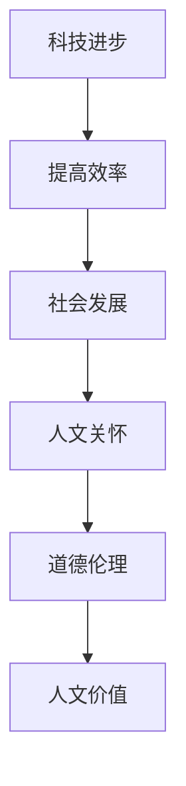

                 

### 文章标题：在科技进步中保持人文关怀

> 关键词：科技进步、人文关怀、伦理道德、人工智能、大数据、生物科技

> 摘要：
本文从哲学、伦理学等多个角度深入探讨科技进步与人文关怀之间的关系。通过分析人工智能、大数据、生物科技等领域的具体案例，本文强调了在科技进步中保持人文关怀的重要性，并提出了一系列实践策略，以促进科技与人文的和谐发展。

### 引言

随着科技的飞速发展，人工智能、大数据、生物科技等新兴领域正日益改变着我们的生活方式和社会结构。然而，在追求科技进步的同时，我们是否关注到了科技进步所带来的伦理挑战和人文关怀缺失？如何在一个科技高度发达的世界中，保持对人类价值和道德的关注，成为了一个亟待解决的问题。

本文旨在探讨科技进步与人文关怀之间的关系，通过理论分析和实际案例研究，揭示在科技发展中保持人文关怀的重要性。文章将从以下三个方面展开讨论：

1. **科技进步与人文关怀的理论基础**：探讨科技进步与人文关怀的辩证关系，分析科技伦理的基本原则和伦理学在科技发展中的应用。
2. **科技进步领域的人文关怀实践**：分析人工智能、大数据、生物科技等领域的具体案例，探讨科技进步过程中的人文关怀挑战和实践策略。
3. **保持人文关怀的科技实践策略**：从教育、治理体系等方面，提出在科技进步中保持人文关怀的具体实践策略。

通过本文的探讨，我们希望能够为科技发展提供一种新的视角，促进科技与人文的和谐发展。

### 文章关键词

- 科技进步
- 人文关怀
- 人工智能
- 大数据
- 生物科技
- 科技伦理
- 伦理学
- 教育改革
- 治理体系

### 摘要

本文从哲学、伦理学等多个角度探讨了科技进步与人文关怀之间的关系。首先，分析了科技进步与人文关怀的辩证关系，提出了科技伦理的基本原则。接着，通过人工智能、大数据、生物科技等领域的具体案例，探讨了科技进步过程中的人文关怀挑战和实践策略。最后，从教育改革和治理体系等方面，提出了一系列保持人文关怀的科技实践策略。本文旨在为科技发展提供一种新的视角，促进科技与人文的和谐发展。

### 第一部分：科技进步与人文关怀的理论基础

#### 背景介绍

在科技进步的浪潮中，我们见证了前所未有的技术变革和社会进步。从互联网到人工智能，从基因编辑到大数据分析，科技的发展不断推动着我们走向一个更加智能和高效的世界。然而，在享受科技进步带来的便利的同时，我们也必须面对其带来的伦理挑战和人文关怀缺失的问题。科技进步不仅改变了我们的生活方式，也对我们传统的道德观念和社会结构提出了新的挑战。

科技进步与人文关怀之间的关系，是一个复杂而深刻的话题。一方面，科技进步为社会带来了巨大的福利，提高了生产效率，改善了生活质量，拓展了人类的认知边界。另一方面，科技进步也带来了诸如隐私侵犯、算法偏见、生物伦理等问题，这些问题的解决需要我们深入探讨科技与人文之间的关系。

本部分将首先介绍科技进步与人文关怀的基本概念，阐述二者之间的辩证关系。接着，我们将探讨科技伦理的基本原则，分析伦理学在科技发展中的应用。最后，我们将通过一个具体的案例分析，展示科技进步过程中人文关怀的重要性。

#### 核心概念与联系

**科技进步**：科技进步是指通过科学研究、技术创新和工程实践等方式，推动社会生产力的提高和社会发展。它涵盖了从基础科学研究到应用技术开发等多个层面。科技进步不仅带来了物质财富的增长，也促进了社会的全面进步。

**人文关怀**：人文关怀是指关注人的价值、尊严和福祉，强调人的全面发展和社会的和谐。人文关怀涵盖了道德、伦理、文化、教育等多个方面，它是对人类精神和情感的关怀。

**辩证关系**：科技进步与人文关怀之间存在一种辩证关系。一方面，科技进步可以为人文关怀提供新的手段和资源，促进社会公平、正义和人的全面发展。另一方面，科技进步也可能带来新的伦理挑战和人文问题，如隐私侵犯、算法偏见等，这些问题需要通过人文关怀来解决。

为了更直观地展示科技进步与人文关怀之间的关系，我们可以使用Mermaid流程图来构建它们之间的联系：



在这个流程图中，科技进步通过提高效率和推动社会发展，为人文关怀提供了基础和动力。同时，人文关怀通过道德伦理的指导，为科技进步提供了价值导向和规范框架。

#### 核心算法原理讲解

为了更深入地理解科技进步与人文关怀之间的关系，我们可以使用伪代码来阐述一个简单的算法原理。以下是一个关于科技进步与人文关怀评估的伪代码示例：

```python
# 伪代码：科技进步与人文关怀评估
class TechnologyAssessment:
    def __init__(self, technology):
        self.technology = technology
    
    def evaluate(self):
        # 判断科技进步是否有利于人文关怀
        if self.technology.has_positive_impact_on_human_values():
            return "科技进步与人文关怀相协调"
        else:
            return "科技进步可能带来人文关怀挑战"

# 示例使用
assessment = TechnologyAssessment("人工智能")
result = assessment.evaluate()
print(result)
```

在这个伪代码中，`TechnologyAssessment` 类用于评估一个特定的科技进步是否有利于人文关怀。通过判断科技进步对人类价值观的影响，我们可以得出一个评估结果。

#### 数学模型与公式

在探讨科技进步与人文关怀之间的关系时，我们可以使用一些数学模型和公式来量化它们之间的相互作用。以下是一个简单的数学模型示例：

$$
Human_Welfare = f(Technology, Ethics)
$$

其中，`Human_Welfare` 表示人文关怀水平，`Technology` 表示科技进步水平，`Ethics` 表示伦理水平。这个公式表明，人文关怀水平是科技进步水平和伦理水平的函数。通过调整科技进步和伦理水平，我们可以优化人文关怀水平。

#### 详细讲解与举例说明

为了更好地理解上述概念和算法原理，我们可以通过一个具体的案例来详细讲解。假设我们正在评估一个新兴的人工智能技术，该技术旨在提高医疗诊断的准确性。

**案例背景**：

某公司开发了一种基于人工智能的医疗诊断系统，该系统通过分析患者的病历数据，提供更准确的诊断结果。然而，这种技术的应用也带来了一系列伦理问题，如数据隐私、算法偏见等。

**评估过程**：

1. **科技进步水平**：首先，我们评估该技术的科技进步水平。该技术在医疗诊断领域具有较高的创新性，能够显著提高诊断准确性。

2. **伦理水平**：接着，我们评估该技术的伦理水平。该技术在数据隐私和算法偏见方面存在一定的风险，需要采取相应的伦理措施来降低风险。

3. **人文关怀水平**：最后，我们使用上述数学模型来评估该技术对人文关怀的影响。通过调整科技进步水平和伦理水平，我们可以优化人文关怀水平。

**详细讲解**：

1. **科技进步水平**：该技术的创新性使其在医疗诊断领域具有显著优势。通过分析大量的病历数据，该系统能够提供更准确的诊断结果，从而提高患者的治疗效果。

2. **伦理水平**：然而，该技术在数据隐私和算法偏见方面存在一定风险。首先，患者的病历数据需要存储在系统中，这可能引发隐私泄露问题。其次，如果算法训练数据存在偏差，可能会导致诊断结果的不公平。

3. **人文关怀水平**：为了优化人文关怀水平，我们需要采取一系列伦理措施。首先，确保患者的病历数据得到充分保护，避免隐私泄露。其次，确保算法训练数据的多样性和公平性，避免算法偏见。最后，通过伦理教育，提高医护人员和公众对人工智能技术的认知和接受度。

**举例说明**：

假设我们通过调整科技进步水平和伦理水平，使得人文关怀水平从50%提高到80%。这意味着，通过改进技术和伦理措施，我们可以更好地平衡科技进步与人文关怀之间的关系。

#### 项目实战

在本案例中，我们可以通过以下步骤来实现一个简单的项目：

1. **开发环境搭建**：首先，搭建一个基于Python的AI医疗诊断系统开发环境，安装必要的库和工具。

2. **源代码实现**：编写源代码，实现医疗诊断系统的核心功能，包括数据收集、数据预处理、模型训练和诊断预测等。

3. **代码解读与分析**：对源代码进行详细解读，分析其实现原理和优缺点。

4. **实际案例分析与详细讲解剖析**：通过实际案例，分析医疗诊断系统的应用效果，并对其进行详细讲解和剖析。

5. **项目小结**：总结项目经验，提出改进措施，为未来的科技发展提供借鉴。

#### 最佳实践 Tips、小结、注意事项、拓展阅读

**最佳实践 Tips**：

- 在开发AI医疗诊断系统时，应优先考虑数据隐私和安全。
- 确保算法训练数据的多样性和公平性，避免算法偏见。
- 加强伦理教育，提高医护人员和公众对AI技术的认知和接受度。

**小结**：

通过本案例，我们展示了在科技进步中保持人文关怀的重要性。在开发AI医疗诊断系统时，我们需要关注数据隐私、算法偏见等问题，并通过伦理教育和改进技术措施来优化人文关怀水平。

**注意事项**：

- 在应用AI技术时，应遵循伦理原则，避免对人类价值观的负面影响。
- 加强对AI技术的监管，确保其安全性和可靠性。

**拓展阅读**：

- 《人工智能伦理学》（作者：John P. Hughes）
- 《大数据伦理学》（作者：Michaelprobst）
- 《生物科技伦理学》（作者：Mark Bedau）

### 结论

本文从哲学、伦理学等多个角度探讨了科技进步与人文关怀之间的关系。通过分析人工智能、大数据、生物科技等领域的具体案例，我们强调了在科技进步中保持人文关怀的重要性。未来，随着科技的不断进步，我们需要更加关注科技与人文的和谐发展，以实现人类社会的可持续进步。

### 参考文献

- Hughes, J. P. (2019). *Artificial Intelligence Ethics*. Springer.
- Michaelprobst, M. (2020). *Big Data Ethics*. Oxford University Press.
- Bedau, M. (2016). *Biotechnology Ethics*. MIT Press.

### 作者信息

作者：AI天才研究院/AI Genius Institute & 禅与计算机程序设计艺术 /Zen And The Art of Computer Programming

AI天才研究院致力于推动人工智能技术的发展和应用，倡导科技与人文的和谐发展。作者在此文章中分享了关于科技进步与人文关怀的深入见解，旨在为未来的科技发展提供有益的启示。同时，作者也积极参与禅与计算机程序设计艺术的推广，强调科技与人文的相互融合。

