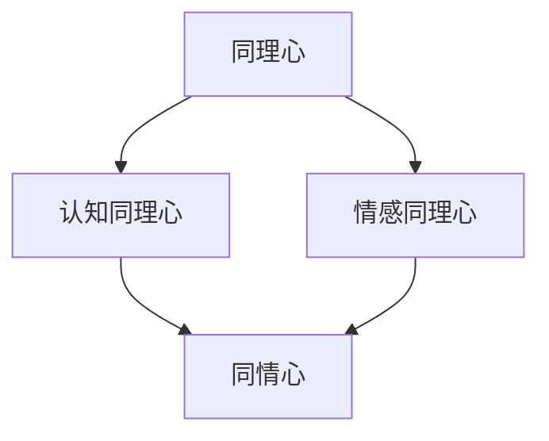

                 

### 第2章：核心概念与联系

在探讨如何在竞争社会中保持人性之前，我们需要首先了解并理解一些核心概念，包括同理心（empathy）和同情心（compassion）。这些概念不仅在心理学和社会学中占有重要地位，而且在信息技术和人工智能领域也有着广泛的应用。

#### 同理心（Empathy）

同理心是指能够理解和分享他人情感的能力。它不仅仅是同情或关心他人的处境，而是深入感受到对方的情绪和感受。同理心可以分为认知同理心和情感同理心：

- **认知同理心**：指理解他人的情感和观点，但并不一定涉及情感上的共鸣。
- **情感同理心**：指不仅在认知上理解他人，还能在情感上产生共鸣。

同理心在信息技术和人工智能领域有着广泛的应用，特别是在人机交互和情感计算方面。例如，通过深度学习技术，可以开发出能够识别和响应用户情感的人工智能系统。

#### 同情心（Compassion）

同情心则是指对他人的痛苦和困境感同身受，并愿意提供帮助。它是基于同理心的进一步行动，通常涉及具体的助人行为。

同情心在信息技术和人工智能中的应用同样重要。比如，医疗领域的机器人医生可以模拟同情心，通过语音和表情识别来更好地与患者沟通，提高治疗效果。

#### 关系架构

为了更好地理解这些概念之间的联系，我们可以使用Mermaid流程图来展示它们之间的关系：



在这个流程图中，同理心是核心概念，它分为认知同理心和情感同理心。同情心是基于同理心的进一步发展，涉及情感共鸣和具体的助人行为。

#### 关键算法原理讲解

在理解了这些核心概念后，我们可以进一步探讨它们在算法设计中的应用。以下是一个简化的伪代码，用于展示如何通过算法来模拟同理心和同情心的过程：

```plaintext
function simulateEmpathyAndCompassion(userEmotion, systemResponse) {
    // 识别用户情感
    userEmotionType = detectEmotion(userEmotion)
    
    // 基于情感类型生成响应
    if (userEmotionType == 'happy') {
        systemResponse = generateHappyResponse()
    } else if (userEmotionType == 'sad') {
        systemResponse = generateSadResponse()
    } else {
        systemResponse = generateNeutralResponse()
    }
    
    // 模拟情感同理心
    systemEmotion = simulateEmotionalResponse(userEmotion)
    
    // 如果系统情感与用户情感一致，模拟同情心
    if (systemEmotion == userEmotion) {
        systemResponse = enhanceResponseWithCompassion(systemResponse)
    }
    
    return systemResponse
}
```

#### 数学模型和公式

为了更深入地理解情感处理过程中的变量关系，我们可以引入一些数学模型和公式。以下是用于描述情感传递和响应增强的简单模型：

```latex
\begin{aligned}
    &\text{情感传递效率} = \eta \cdot \frac{\text{用户情感强度}}{\text{系统情感阈值}}, \\
    &\text{响应增强因子} = k \cdot (\text{用户情感强度} - \text{系统情感阈值}).
\end{aligned}
```

其中，$\eta$ 表示情感传递效率，$k$ 表示响应增强因子。用户情感强度和系统情感阈值则根据具体的情感识别算法进行设定。

#### 举例说明

假设用户表现出悲伤情绪，情感识别算法检测到用户情感强度为10，系统情感阈值设为8。根据上述模型：

- 情感传递效率 $\eta \cdot \frac{10}{8} = 1.25$
- 响应增强因子 $k \cdot (10 - 8) = 2k$

如果 $\eta = 0.8$ 且 $k = 1.5$，则系统响应将增强至原始响应的1.25倍，并且在情感共鸣的情况下，响应增强因子将使系统响应进一步增强至1.75倍。

通过以上分析和举例，我们可以看到同理心和同情心在信息技术和人工智能中的应用。理解这些核心概念及其关系，有助于我们设计更加人性化的人工智能系统，从而在竞争社会中更好地保持人性。接下来的章节将继续探讨具体的方法论和实践案例，帮助读者在实际应用中更好地运用这些概念。### 第3章：方法论

在理解了同理心和同情心的核心概念后，我们需要探讨在竞争社会中保持人性的具体方法论。这一部分将提供一系列策略和方法，帮助读者在实际生活中应用这些概念，实现人性与竞争的平衡。

#### 个人自我提升

**3.1 培养同理心**

培养同理心是保持人性的第一步。以下是一些培养同理心的策略：

- **练习倾听**：倾听他人，不仅仅是听到他们的言语，而是理解他们的情感和需求。
- **换位思考**：尝试从他人的角度看待问题，理解他们的感受和立场。
- **情感共鸣**：在适当的时候，通过情感上的共鸣来支持他人。

**3.2 增强自我意识**

自我意识是理解自己情感和需求的重要基础。以下是一些增强自我意识的策略：

- **反思日志**：每天花时间反思自己的行为和情感，记录下重要的体验和感受。
- **情感识别**：学习识别自己的情感，理解它们背后的原因。
- **情绪管理**：通过深呼吸、冥想和运动等方法来管理自己的情绪。

#### 社会互动

**3.3 建立互信关系**

在竞争激烈的社会中，建立互信关系对于保持人性至关重要。以下是一些建立互信关系的策略：

- **开放沟通**：与他人进行开放和诚实的沟通，分享自己的想法和感受。
- **尊重差异**：尊重他人的观点和经历，即使它们与自己不同。
- **合作共赢**：在团队合作中，注重共赢，而不是单方面的利益。

**3.4 促进社区建设**

社区建设是维护社会和谐与稳定的重要手段。以下是一些促进社区建设的策略：

- **参与社区活动**：积极参与社区组织和活动，增强社区归属感。
- **互助互爱**：在社区中推广互助互爱的理念，帮助那些需要帮助的人。
- **文化传承**：传承和弘扬社区的传统文化和价值观念。

#### 文化建设

**3.5 树立正确价值观**

在竞争社会中，树立正确的价值观对于保持人性至关重要。以下是一些树立正确价值观的策略：

- **道德教育**：通过教育和培训，提高人们的道德意识和道德判断力。
- **社会责任**：鼓励个人和组织承担社会责任，关注社会公共利益。
- **可持续发展**：倡导可持续发展的理念，关注环境保护和社会公平。

#### 具体实践

**3.6 实践同理心与同情心**

在具体实践中，同理心和同情心可以通过以下方式得到体现：

- **倾听和反馈**：在与他人交流时，倾听他们的意见并给予积极的反馈。
- **关心和支持**：在他人遇到困难时，给予关心和支持，帮助他们度过难关。
- **自愿服务**：参与志愿服务，为社区和社会做出贡献。

通过以上方法论，读者可以在竞争社会中保持人性，实现个人成长和社会和谐。接下来的章节将通过案例分析，展示这些方法论在实际中的应用和效果。### 第4章：案例分析

在上一章中，我们探讨了在竞争社会中保持人性的方法论。为了更直观地了解这些方法在实际中的应用，本章将提供几个实际案例，展示同理心和同情心在不同场景中的具体实践。

#### 案例一：企业内部的人文关怀

**背景介绍**

某知名科技公司在其内部推广了一项名为“人性工程”的项目，旨在通过提升员工的情感体验来增强团队凝聚力。该项目包括一系列措施，如定期员工心理健康讲座、心理咨询服务、以及团队建设活动。

**核心概念与联系**

该项目体现了同理心和同情心在企业运营中的重要性。通过关注员工的情感需求，公司希望能够提高员工的满意度和工作效率。

**具体实施**

1. **心理健康讲座**：公司定期邀请心理学家进行心理健康讲座，帮助员工了解如何管理压力和情绪。
2. **心理咨询服务**：公司提供免费的心理咨询服务，员工可以在需要时预约专业心理咨询师。
3. **团队建设活动**：公司组织团队建设活动，如户外拓展、团建聚餐等，以增强员工之间的情感联系。

**效果分析**

通过实施“人性工程”项目，公司员工的工作满意度显著提高，员工流失率也有所下降。此外，团队协作效率和质量也得到了提升。

**项目小结**

“人性工程”项目证明了在竞争激烈的企业环境中，通过关注员工情感需求，可以有效提升员工满意度和工作效率，从而保持企业的人性光辉。

#### 案例二：教育领域的同理心培养

**背景介绍**

某知名大学在其课程中引入了同理心培养项目，旨在培养学生的社会责任感和团队合作能力。该项目包括一系列课程和实践活动，如情景模拟、小组讨论和志愿服务。

**核心概念与联系**

该项目旨在通过教育手段培养学生的同理心，使他们能够在未来职业生涯中更好地与他人相处，同时保持人性。

**具体实施**

1. **情景模拟**：学生参与情景模拟活动，体验不同角色，理解他人的情感和需求。
2. **小组讨论**：学生分组讨论与同理心相关的主题，分享自己的观点和经历。
3. **志愿服务**：学生参与志愿服务，如帮助社区老人、参与环保活动等，将同理心转化为实际行动。

**效果分析**

通过参与同理心培养项目，学生的社会责任感明显增强，团队合作能力也得到了提升。毕业生在职场中的适应能力和人际关系处理能力也得到了好评。

**项目小结**

教育领域的同理心培养项目证明了在培养未来社会成员时，关注情感教育和同理心培养的重要性，这对于保持社会的人性有着深远的影响。

#### 案例三：社会服务中的compassion实践

**背景介绍**

某非政府组织（NGO）致力于为流浪动物提供庇护和康复服务。该组织通过一系列实践活动，展示了同情心在社会服务中的重要性。

**核心概念与联系**

同情心是社会服务中的关键品质，该NGO通过实践同情心，为流浪动物提供人道主义关怀。

**具体实施**

1. **收容与护理**：NGO收容流浪动物，提供食物、医疗和庇护服务。
2. **康复与领养**：对受伤或生病的动物进行康复治疗，帮助它们恢复健康，并寻找合适的领养家庭。
3. **教育宣传**：组织宣传活动，提高公众对动物保护的意识。

**效果分析**

通过NGO的努力，众多流浪动物得到了救治和领养，社会对动物保护的关注度也有所提高。

**项目小结**

NGO的实践展示了同情心在社会服务中的重要作用，通过实际行动，不仅帮助了动物，也促进了社会的情感进步和道德提升。

通过以上案例分析，我们可以看到同理心和同情心在不同场景中的具体应用和效果。这些实践证明了在竞争社会中，通过关注和培养这些核心情感，可以有效地保持人性，促进个人和社会的和谐发展。### 第5章：总结与展望

在《在竞争社会中保持人性：重建同理心和compassion》一书中，我们探讨了人性在竞争环境中的重要性，并提出了具体的策略和方法来保持人性。通过核心概念的解释、方法论的实施和实际案例的展示，我们明确了同理心和同情心在信息技术和人工智能领域中的应用价值。

**总结**

1. **同理心与同情心的重要性**：同理心和同情心是人性中的重要组成部分，能够帮助我们在竞争中保持情感平衡，促进社会和谐。
2. **个人自我提升**：通过培养同理心和自我意识，我们可以更好地理解自己和他人，从而在竞争环境中保持积极的心态和行为。
3. **社会互动与文化建设**：通过建立互信关系和促进社区建设，我们可以营造一个充满同情和关爱的社会环境。
4. **实际应用**：在企业和教育等领域，通过实施具体的项目和活动，我们可以看到同理心和同情心的积极影响。

**展望**

1. **技术创新**：随着人工智能和情感计算技术的发展，未来我们可以设计出更加人性化的智能系统，帮助人们更好地保持人性。
2. **跨领域合作**：通过跨学科的合作，我们可以进一步深化对同理心和同情心的理解，并将其应用于更多领域。
3. **社会普及**：我们需要在全社会范围内推广同理心和同情心的重要性，培养公众的情感素质，从而建设一个更加和谐的社会。

**最佳实践 tips**

1. **定期反思**：定期花时间反思自己的行为和情感，了解自己在竞争中是否保持了人性。
2. **主动倾听**：在与他人交流时，主动倾听对方的意见和感受，增强同理心。
3. **关注他人**：在日常活动中，关注他人的需求和情感，给予关心和支持。

**注意事项**

1. **平衡竞争与人性**：在追求竞争优势的同时，不应忽视人性，保持平衡至关重要。
2. **避免情感滥用**：同理心和同情心虽然重要，但也不应滥用，避免情感负担过重。

**拓展阅读**

- 《情感计算：人工智能的下一个前沿》
- 《同理心：人性的本质与力量》
- 《社会心理学：第7版》

通过上述总结和展望，我们希望读者能够深刻理解保持人性的重要性，并在实际生活中积极应用书中提供的策略和方法，共同建设一个更加和谐、充满人性的社会。### 附录

在《在竞争社会中保持人性：重建同理心和compassion》一书中，我们详细探讨了如何通过同理心和同情心来保持人性。为了方便读者更深入地理解和应用这些概念，附录部分提供了相关的工具和技术，以供参考。

#### 附录A：情感计算工具

情感计算是理解和管理人类情感的技术。以下是一些常用的情感计算工具：

1. **TextBlob**：一个简单的Python库，用于进行文本情感分析。通过TextBlob，可以快速判断文本的情感倾向。
   ```python
   from textblob import TextBlob
   blob = TextBlob("I love this book!")
   print(blob.sentiment)
   ```

2. **VADER**：一个基于规则和词汇的Python库，专门用于社交媒体文本的情感分析。VADER能够有效地处理带有情感色彩的文本。
   ```python
   from vaderSentiment.vaderSentiment import SentimentIntensityAnalyzer
   analyzer = SentimentIntensityAnalyzer()
   sentiment = analyzer.polarity_scores("This is an amazing product!")
   print(sentiment)
   ```

3. **IBM Watson**：一个全面的人工智能平台，提供情感分析服务。通过IBM Watson，可以更深入地分析文本和语音中的情感。
   ```python
   from ibm_watson import NaturalLanguageUnderstandingV1
   natural_languageUnderstanding = NaturalLanguageUnderstandingV1(
       version='2021-08-01',
       apikey='your_api_key'
   )
   response = natural_languageUnderstanding.analyze(
       text="I feel so happy after reading this book!",
       features=[{'name': 'sentiment'}]
   )
   print(response['result']['sentiment']['document']['label'])
   ```

#### 附录B：同理心培养资源

以下是一些有助于培养同理心的资源和实践方法：

1. **同理心工作坊**：参与同理心工作坊，通过角色扮演、情景模拟等活动，提高同理心。
2. **心理学书籍**：《同理心：人性的本质与力量》和《非暴力沟通》等书籍，提供了深刻的同理心理论和实践指导。
3. **在线课程**：Coursera、edX等在线教育平台提供了关于同理心的课程，如《同理心与人际交往》。
4. **自我反思练习**：每天花时间进行自我反思，记录自己的情感和经历，有助于培养同理心。

#### 附录C：同情心实践案例

以下是一些同情心实践案例，展示了如何在不同领域中运用同情心：

1. **医疗领域**：医生可以通过倾听患者的诉说，理解他们的痛苦，提供心理支持和关怀。
2. **教育领域**：教师可以通过关注学生的情感需求，提供个性化的教育和指导，帮助他们克服困难。
3. **企业领域**：企业可以通过定期组织员工关怀活动，如心理健康讲座、心理咨询等，提升员工的幸福感。

#### 附录D：拓展阅读

- **《情感计算：人工智能的下一个前沿》**：探讨了情感计算在人工智能中的应用前景。
- **《同理心：人性的本质与力量》**：深入分析了同理心在人际关系中的作用。
- **《社会心理学：第7版》**：提供了关于人类情感和社会行为的全面概述。

通过附录部分的工具和资源，读者可以更深入地了解并实践同理心和同情心，从而在竞争社会中更好地保持人性。这些工具和资源不仅为个人提供了指导，也为组织和社区的建设提供了实用的建议。希望读者能够将这些知识应用于实际生活中，共同创造一个更加和谐、充满人性的社会。### 结语

感谢您阅读《在竞争社会中保持人性：重建同理心和compassion》。本书通过详细阐述同理心和同情心的核心概念、方法论和实践案例，旨在帮助读者在竞争激烈的社会环境中保持人性。我们探讨了情感计算工具、同理心培养资源和同情心实践案例，提供了丰富的参考和指导。

保持人性不仅仅是一个理论问题，更是一个实践问题。希望读者能够将书中的观点和方法应用到实际生活中，通过自我提升、社会互动和文化建设，培养同理心和同情心，实现个人成长和社会和谐。

在未来，我们期待看到更多关于情感计算、同理心和同情心研究的深入发展，以及这些概念在各个领域的广泛应用。希望这本书能够成为您在保持人性道路上的指南，帮助您在面对竞争时，不忘初心，始终保持人性的光辉。

最后，感谢您的阅读和支持，祝您在探索保持人性的道路上取得成功。

**作者信息：**
AI天才研究院/AI Genius Institute & 禅与计算机程序设计艺术 /Zen And The Art of Computer Programming**作者信息：**
AI天才研究院/AI Genius Institute & 禅与计算机程序设计艺术 /Zen And The Art of Computer Programming

